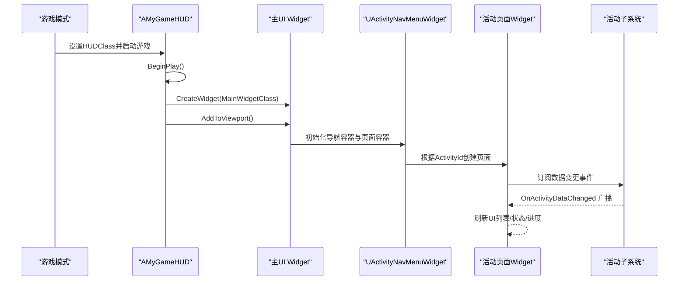
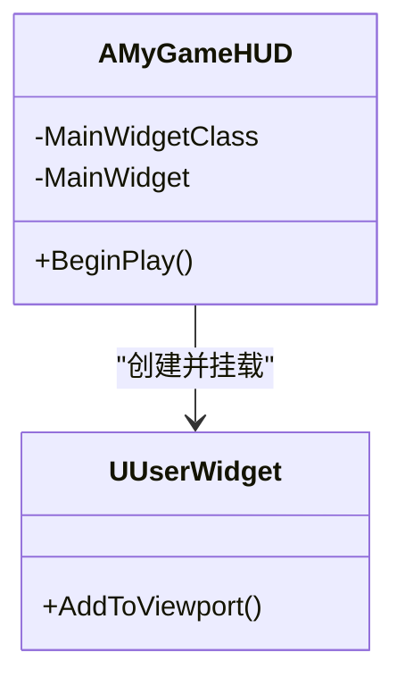
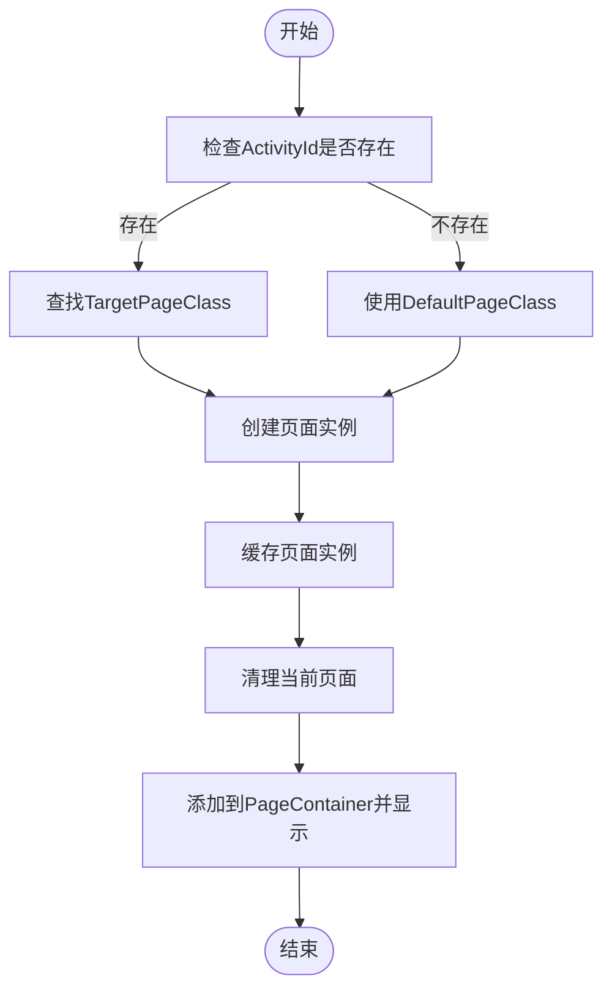
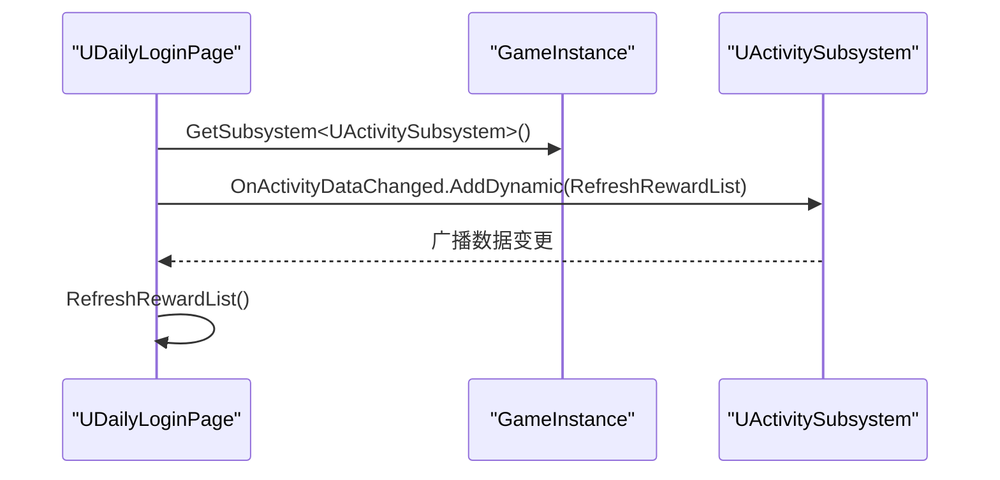
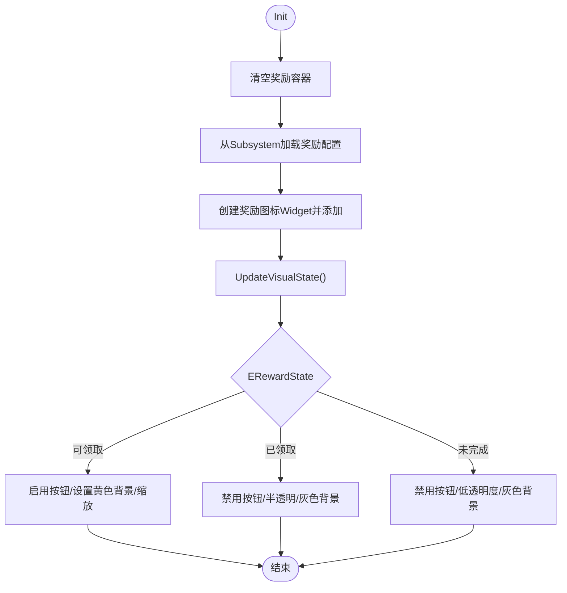
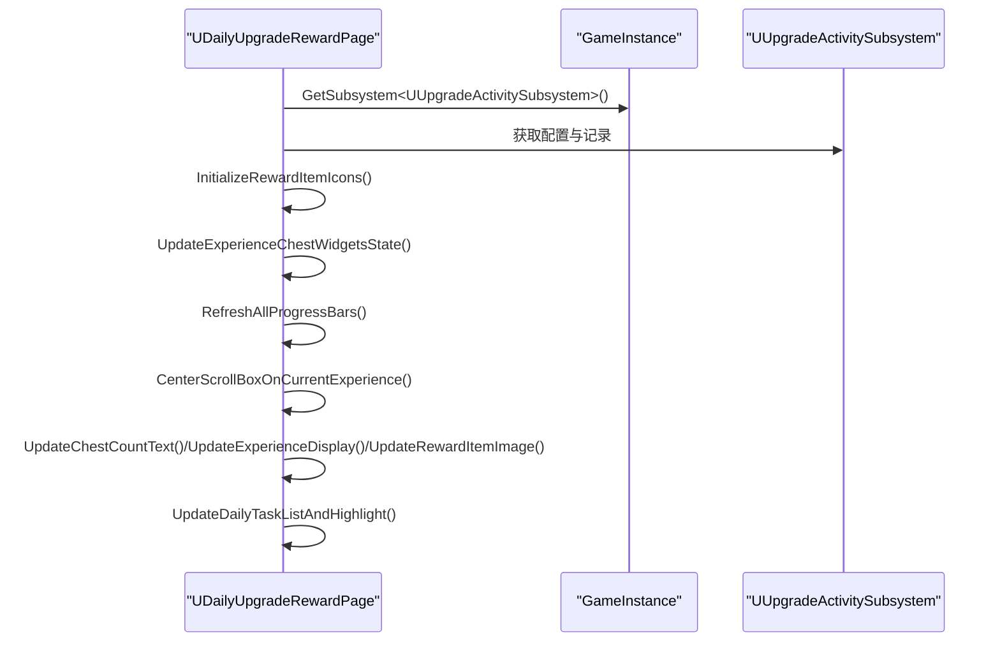
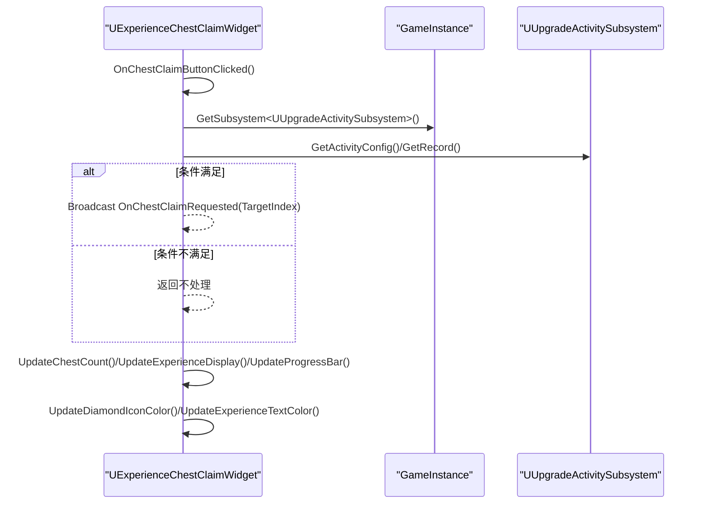
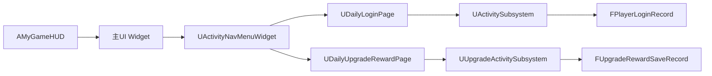

# HUD系统

<cite>
**本文引用的文件**
- [MyGameHUD.h](file://MetalSlug01/Source/MetalSlug01/Public/UI/MyGameHUD.h)
- [MyGameHUD.cpp](file://MetalSlug01/Source/MetalSlug01/Private/UI/MyGameHUD.cpp)
- [MetalSlug01GameModeBase.cpp](file://MetalSlug01/Source/MetalSlug01/MetalSlug01GameModeBase.cpp)
- [ActivityNavMenuWidget.h](file://MetalSlug01/Source/MetalSlug01/Public/UI/Activity/Pages/Navigation/ActivityNavMenuWidget.h)
- [ActivityNavButton.h](file://MetalSlug01/Source/MetalSlug01/Public/UI/Activity/Pages/Navigation/ActivityNavButton.h)
- [DailyLoginPage.cpp](file://MetalSlug01/Source/MetalSlug01/Private/UI/Activity/Pages/DailyLogin/DailyLoginPage.cpp)
- [DailyLoginDayItemWidget.cpp](file://MetalSlug01/Source/MetalSlug01/Private/UI/Activity/Pages/DailyLogin/DailyLoginDayItemWidget.cpp)
- [ExperienceChestClaimWidget.cpp](file://MetalSlug01/Source/MetalSlug01/Private/UI/Activity/Pages/DailyUpgradeReward/ExperienceChestClaimWidget.cpp)
- [DailyUpgradeRewardPage.cpp](file://MetalSlug01/Source/MetalSlug01/Private/UI/Activity/Pages/DailyUpgradeReward/DailyUpgradeRewardPage.cpp)
- [DailyLoginSave.h](file://MetalSlug01/Source/MetalSlug01/Public/UI/Activity/Data/DailyLoginSave.h)
- [DailyLoginConfig.h](file://MetalSlug01/Source/MetalSlug01/Public/UI/Activity/Data/DailyLoginConfig.h)
- [ActivitySubsystem.h](file://MetalSlug01/Source/MetalSlug01/Public/UI/Activity/Core/ActivitySubsystem.h)
- [UpgradeActivitySubsystem.h](file://MetalSlug01/Source/MetalSlug01/Public/UI/Activity/Core/UpgradeActivitySubsystem.h)
- [UpgradeActivitySaveModifier.cpp](file://MetalSlug01/Source/MetalSlug01/Private/Tools/UpgradeActivitySaveModifier.cpp)
</cite>

## 目录
1. [简介](#简介)
2. [项目结构](#项目结构)
3. [核心组件](#核心组件)
4. [架构总览](#架构总览)
5. [详细组件分析](#详细组件分析)
6. [依赖关系分析](#依赖关系分析)
7. [性能考虑](#性能考虑)
8. [故障排查指南](#故障排查指南)
9. [结论](#结论)
10. [附录](#附录)

## 简介
本文件为 MetalSlug 项目的 HUD 系统技术文档，重点围绕 MyGameHUD 类的设计与实现展开，涵盖游戏信息显示、状态指示器、用户界面布局等核心功能；阐述 HUD 与游戏系统的交互方式（数据绑定、事件响应、实时更新）；解析 UI 组件组织结构（控件布局、样式、行为）；并提供扩展开发与定制指南，帮助开发者添加新的信息显示与自定义界面元素。

## 项目结构
本项目采用“蓝图 + C++”混合开发模式，HUD 通过 AMyGameHUD 在游戏启动时创建并挂载一个主 UserWidget 到视口，形成顶层 UI 层。活动模块（Activity）提供导航菜单、日常登录、升级奖励等页面，这些页面均以 UUserWidget 形式实现，并通过子系统进行数据驱动与事件广播。

```mermaid
graph TB
GM["游戏模式<br/>AMyGameModeBase"] --> HUD["HUD类<br/>AMyGameHUD"]
HUD --> MW["主UI Widget<br/>UUserWidget"]
MW --> NAV["导航菜单<br/>UActivityNavMenuWidget"]
NAV --> PAGE1["日常登录页<br/>UDailyLoginPage"]
NAV --> PAGE2["升级奖励页<br/>UDailyUpgradeRewardPage"]
PAGE1 --> SUB1["活动子系统<br/>UActivitySubsystem"]
PAGE2 --> SUB2["升级活动子系统<br/>UUpgradeActivitySubsystem"]
SUB1 --> DATA1["日常登录存档<br/>FPlayerLoginRecord"]
SUB2 --> DATA2["升级活动存档<br/>FUpgradeRewardSaveRecord"]
```

图表来源
- [MetalSlug01GameModeBase.cpp](file://MetalSlug01/Source/MetalSlug01/MetalSlug01GameModeBase.cpp#L24-L26)
- [MyGameHUD.h](file://MetalSlug01/Source/MetalSlug01/Public/UI/MyGameHUD.h#L7-L22)
- [MyGameHUD.cpp](file://MetalSlug01/Source/MetalSlug01/Private/UI/MyGameHUD.cpp#L4-L18)
- [ActivityNavMenuWidget.h](file://MetalSlug01/Source/MetalSlug01/Public/UI/Activity/Pages/Navigation/ActivityNavMenuWidget.h#L16-L35)
- [DailyLoginPage.cpp](file://MetalSlug01/Source/MetalSlug01/Private/UI/Activity/Pages/DailyLogin/DailyLoginPage.cpp#L24-L38)
- [DailyUpgradeRewardPage.cpp](file://MetalSlug01/Source/MetalSlug01/Private/UI/Activity/Pages/DailyUpgradeReward/DailyUpgradeRewardPage.cpp#L167-L204)
- [DailyLoginSave.h](file://MetalSlug01/Source/MetalSlug01/Public/UI/Activity/Data/DailyLoginSave.h#L85-L161)
- [UpgradeActivitySubsystem.h](file://MetalSlug01/Source/MetalSlug01/Public/UI/Activity/Core/UpgradeActivitySubsystem.h#L35-L47)

章节来源
- [MyGameHUD.h](file://MetalSlug01/Source/MetalSlug01/Public/UI/MyGameHUD.h#L1-L23)
- [MyGameHUD.cpp](file://MetalSlug01/Source/MetalSlug01/Private/UI/MyGameHUD.cpp#L1-L19)
- [MetalSlug01GameModeBase.cpp](file://MetalSlug01/Source/MetalSlug01/MetalSlug01GameModeBase.cpp#L1-L26)

## 核心组件
- MyGameHUD（AMyGameHUD）
  - 负责在 BeginPlay 时创建并挂载主 UI Widget 到视口，作为 HUD 的根容器。
  - 通过 MainWidgetClass 指定主 Widget 类型，MainWidget 保存实例句柄。
- 活动导航菜单（UActivityNavMenuWidget）
  - 提供导航容器与页面容器，支持动态创建与缓存页面，切换当前显示页面。
  - 支持默认页面类回退策略。
- 日常登录页（UDailyLoginPage）
  - 通过 ActivitySubsystem 订阅数据变更事件，刷新奖励列表与界面状态。
- 升级奖励页（UDailyUpgradeRewardPage）
  - 从 UpgradeActivitySubsystem 获取配置与存档数据，驱动 UI 列表、进度条、宝箱状态等。
- 子系统层
  - UActivitySubsystem：统一管理活动数据与时间、红点等管理器。
  - UUpgradeActivitySubsystem：负责升级奖励活动的数据存取、业务逻辑与事件广播。
- 存档与配置
  - FPlayerLoginRecord：日常登录进度与领取状态。
  - FUpgradeRewardSaveRecord：升级奖励活动的存档记录。
  - FDailyLoginConfigRow：活动配置（如导航、背景、图标等）。

章节来源
- [MyGameHUD.h](file://MetalSlug01/Source/MetalSlug01/Public/UI/MyGameHUD.h#L7-L22)
- [MyGameHUD.cpp](file://MetalSlug01/Source/MetalSlug01/Private/UI/MyGameHUD.cpp#L4-L18)
- [ActivityNavMenuWidget.h](file://MetalSlug01/Source/MetalSlug01/Public/UI/Activity/Pages/Navigation/ActivityNavMenuWidget.h#L16-L35)
- [DailyLoginPage.cpp](file://MetalSlug01/Source/MetalSlug01/Private/UI/Activity/Pages/DailyLogin/DailyLoginPage.cpp#L24-L38)
- [DailyUpgradeRewardPage.cpp](file://MetalSlug01/Source/MetalSlug01/Private/UI/Activity/Pages/DailyUpgradeReward/DailyUpgradeRewardPage.cpp#L167-L204)
- [DailyLoginSave.h](file://MetalSlug01/Source/MetalSlug01/Public/UI/Activity/Data/DailyLoginSave.h#L85-L161)
- [UpgradeActivitySubsystem.h](file://MetalSlug01/Source/MetalSlug01/Public/UI/Activity/Core/UpgradeActivitySubsystem.h#L35-L47)

## 架构总览
HUD 与 UI 的交互遵循“数据驱动 + 事件广播”的模式：
- 游戏启动时，GameMode 指定 HUD 类型为 AMyGameHUD。
- AMyGameHUD 在 BeginPlay 中创建 MainWidget 并添加到视口。
- 主 Widget 内部包含导航菜单，导航菜单根据 ActivityId 动态创建并缓存页面。
- 页面通过子系统订阅数据变化，实时刷新 UI。
- 子系统通过委托事件向 UI 广播状态更新，实现解耦。

图表来源
- [MetalSlug01GameModeBase.cpp](file://MetalSlug01/Source/MetalSlug01/MetalSlug01GameModeBase.cpp#L24-L26)
- [MyGameHUD.cpp](file://MetalSlug01/Source/MetalSlug01/Private/UI/MyGameHUD.cpp#L4-L18)
- [ActivityNavMenuWidget.h](file://MetalSlug01/Source/MetalSlug01/Public/UI/Activity/Pages/Navigation/ActivityNavMenuWidget.h#L16-L35)
- [DailyLoginPage.cpp](file://MetalSlug01/Source/MetalSlug01/Private/UI/Activity/Pages/DailyLogin/DailyLoginPage.cpp#L24-L38)

## 详细组件分析

### MyGameHUD 类分析
- 设计要点
  - 继承自 AHUD，覆盖 BeginPlay，在游戏开始时创建主 UI Widget。
  - MainWidgetClass 为蓝图可配置项，MainWidget 保存实例。
- 数据流
  - 无外部数据绑定，主要职责是“挂载 UI 根节点”，后续页面由主 Widget 内部管理。
- 可扩展性
  - 可通过 MainWidgetClass 切换不同的主页面类型。
  - 若需全局状态（如暂停、FPS 等），可在 HUD 层增加委托与事件广播。

图表来源
- [MyGameHUD.h](file://MetalSlug01/Source/MetalSlug01/Public/UI/MyGameHUD.h#L7-L22)
- [MyGameHUD.cpp](file://MetalSlug01/Source/MetalSlug01/Private/UI/MyGameHUD.cpp#L4-L18)

章节来源
- [MyGameHUD.h](file://MetalSlug01/Source/MetalSlug01/Public/UI/MyGameHUD.h#L1-L23)
- [MyGameHUD.cpp](file://MetalSlug01/Source/MetalSlug01/Private/UI/MyGameHUD.cpp#L1-L19)

### 活动导航菜单（UActivityNavMenuWidget）
- 功能概述
  - 提供导航容器与页面容器，支持动态创建页面、缓存页面、切换当前页面。
  - 支持默认页面类回退，避免页面缺失导致崩溃。
- 关键属性
  - NavContainer：导航按钮容器。
  - PageContainer：页面显示容器。
  - DefaultPageClass：默认页面类。
- 流程
  - 根据 ActivityId 查找目标页面类，若不存在则回退到 DefaultPageClass。
  - 创建页面实例并缓存，清理当前页面后显示新页面。
  - 设置 Canvas Panel Slot 锚点以全屏填充。

图表来源
- [ActivityNavMenuWidget.h](file://MetalSlug01/Source/MetalSlug01/Public/UI/Activity/Pages/Navigation/ActivityNavMenuWidget.h#L16-L35)
- [ActivityNavMenuWidget.cpp](file://MetalSlug01/Source/MetalSlug01/Private/UI/Activity/Pages/Navigation/ActivityNavMenuWidget.cpp#L863-L912)

章节来源
- [ActivityNavMenuWidget.h](file://MetalSlug01/Source/MetalSlug01/Public/UI/Activity/Pages/Navigation/ActivityNavMenuWidget.h#L1-L39)

### 日常登录页（UDailyLoginPage）
- 数据绑定与事件响应
  - 在 NativeConstruct 中获取 GameInstance 并获取 UActivitySubsystem。
  - 订阅 OnActivityDataChanged 事件，收到广播后刷新奖励列表。
- 页面刷新流程
  - 初始化 Subsystem 指针。
  - 绑定数据更新回调。
  - 根据配置与存档数据刷新 UI。

图表来源
- [DailyLoginPage.cpp](file://MetalSlug01/Source/MetalSlug01/Private/UI/Activity/Pages/DailyLogin/DailyLoginPage.cpp#L24-L38)

章节来源
- [DailyLoginPage.cpp](file://MetalSlug01/Source/MetalSlug01/Private/UI/Activity/Pages/DailyLogin/DailyLoginPage.cpp#L1-L38)

### 日常登录项（UDailyLoginDayItemWidget）
- 视觉状态与交互
  - 根据 ERewardState 控制按钮启用/禁用、文本、透明度、缩放与 ZOrder。
  - 支持特殊奖励的大奖背景与角色图标显示。
- 奖励图标加载
  - 通过 ActivitySubsystem 获取奖励配置，动态创建奖励图标 Widget 并添加到容器。
- 颜色与样式
  - 预设多种颜色（可领取、已领取、未完成、明日可领），根据状态设置按钮背景色与透明度。

图表来源
- [DailyLoginDayItemWidget.cpp](file://MetalSlug01/Source/MetalSlug01/Private/UI/Activity/Pages/DailyLogin/DailyLoginDayItemWidget.cpp#L77-L112)
- [DailyLoginDayItemWidget.cpp](file://MetalSlug01/Source/MetalSlug01/Private/UI/Activity/Pages/DailyLogin/DailyLoginDayItemWidget.cpp#L114-L200)

章节来源
- [DailyLoginDayItemWidget.cpp](file://MetalSlug01/Source/MetalSlug01/Private/UI/Activity/Pages/DailyLogin/DailyLoginDayItemWidget.cpp#L1-L200)

### 升级奖励页（UDailyUpgradeRewardPage）
- 数据来源
  - 通过 GameInstance 获取 UUpgradeActivitySubsystem，读取配置与存档数据。
- 刷新流程
  - 初始化奖励物品图标缓存。
  - 更新经验宝箱状态、进度条、当前经验值显示、宝箱数量、任务列表与高亮状态。
- 业务逻辑下沉
  - 高亮与锁定状态由 Subsystem 计算并返回，页面仅负责渲染。

图表来源
- [DailyUpgradeRewardPage.cpp](file://MetalSlug01/Source/MetalSlug01/Private/UI/Activity/Pages/DailyUpgradeReward/DailyUpgradeRewardPage.cpp#L167-L204)
- [DailyUpgradeRewardPage.cpp](file://MetalSlug01/Source/MetalSlug01/Private/UI/Activity/Pages/DailyUpgradeReward/DailyUpgradeRewardPage.cpp#L1020-L1049)
- [DailyUpgradeRewardPage.cpp](file://MetalSlug01/Source/MetalSlug01/Private/UI/Activity/Pages/DailyUpgradeReward/DailyUpgradeRewardPage.cpp#L1322-L1355)

章节来源
- [DailyUpgradeRewardPage.cpp](file://MetalSlug01/Source/MetalSlug01/Private/UI/Activity/Pages/DailyUpgradeReward/DailyUpgradeRewardPage.cpp#L167-L204)

### 经验宝箱领取（UExperienceChestClaimWidget）
- 事件与状态
  - 绑定按钮点击事件，检查领取条件（经验值、是否已领取）。
  - 通过 OnChestClaimRequested 广播领取请求，携带目标索引。
- UI 更新
  - 更新宝箱数量、经验值显示、进度条、钻石图标颜色与经验文本颜色。
- 条件分支
  - 普通经验宝箱与固定奖励宝箱（FixedPrizeWidget）使用不同索引策略。

图表来源
- [ExperienceChestClaimWidget.cpp](file://MetalSlug01/Source/MetalSlug01/Private/UI/Activity/Pages/DailyUpgradeReward/ExperienceChestClaimWidget.cpp#L77-L152)
- [ExperienceChestClaimWidget.cpp](file://MetalSlug01/Source/MetalSlug01/Private/UI/Activity/Pages/DailyUpgradeReward/ExperienceChestClaimWidget.cpp#L154-L200)

章节来源
- [ExperienceChestClaimWidget.cpp](file://MetalSlug01/Source/MetalSlug01/Private/UI/Activity/Pages/DailyUpgradeReward/ExperienceChestClaimWidget.cpp#L1-L200)

### 子系统与数据模型
- UActivitySubsystem
  - 管理活动数据、时间与红点等，提供统一访问接口。
- UUpgradeActivitySubsystem
  - 负责升级奖励活动的数据存取、业务逻辑与事件广播。
- 存档结构
  - FPlayerLoginRecord：日常登录进度与领取状态。
  - FUpgradeRewardSaveRecord：升级奖励活动的存档记录。
- 配置结构
  - FDailyLoginConfigRow：活动配置（导航、背景、图标等）。

章节来源
- [ActivitySubsystem.h](file://MetalSlug01/Source/MetalSlug01/Public/UI/Activity/Core/ActivitySubsystem.h#L29-L51)
- [UpgradeActivitySubsystem.h](file://MetalSlug01/Source/MetalSlug01/Public/UI/Activity/Core/UpgradeActivitySubsystem.h#L35-L47)
- [DailyLoginSave.h](file://MetalSlug01/Source/MetalSlug01/Public/UI/Activity/Data/DailyLoginSave.h#L85-L161)
- [DailyLoginConfig.h](file://MetalSlug01/Source/MetalSlug01/Public/UI/Activity/Data/DailyLoginConfig.h#L259-L300)

## 依赖关系分析
- 组件耦合
  - AMyGameHUD 与主 UI Widget 弱耦合，通过 MainWidgetClass 解耦。
  - 页面与子系统通过委托事件弱耦合，实现数据驱动与解耦。
- 外部依赖
  - GameInstance 提供子系统访问入口。
  - DataTable 与存档结构提供配置与运行时数据。
- 循环依赖
  - 未发现直接循环依赖；页面通过子系统访问数据，子系统不直接依赖页面。

图表来源
- [MyGameHUD.h](file://MetalSlug01/Source/MetalSlug01/Public/UI/MyGameHUD.h#L7-L22)
- [ActivityNavMenuWidget.h](file://MetalSlug01/Source/MetalSlug01/Public/UI/Activity/Pages/Navigation/ActivityNavMenuWidget.h#L16-L35)
- [DailyLoginPage.cpp](file://MetalSlug01/Source/MetalSlug01/Private/UI/Activity/Pages/DailyLogin/DailyLoginPage.cpp#L24-L38)
- [DailyUpgradeRewardPage.cpp](file://MetalSlug01/Source/MetalSlug01/Private/UI/Activity/Pages/DailyUpgradeReward/DailyUpgradeRewardPage.cpp#L167-L204)
- [DailyLoginSave.h](file://MetalSlug01/Source/MetalSlug01/Public/UI/Activity/Data/DailyLoginSave.h#L85-L161)

章节来源
- [MyGameHUD.h](file://MetalSlug01/Source/MetalSlug01/Public/UI/MyGameHUD.h#L1-L23)
- [ActivityNavMenuWidget.h](file://MetalSlug01/Source/MetalSlug01/Public/UI/Activity/Pages/Navigation/ActivityNavMenuWidget.h#L1-L39)

## 性能考虑
- UI 创建与缓存
  - 导航菜单对页面进行缓存，避免频繁创建销毁带来的开销。
- 延迟与异步
  - 部分 UI 初始化使用定时器延迟设置样式，确保控件完全初始化后再应用样式。
- 数据刷新
  - 页面通过子系统事件订阅刷新，避免轮询，降低 CPU 占用。
- 资源加载
  - 物品图标与纹理采用软资源（TSoftObjectPtr），按需加载，减少启动时内存压力。

## 故障排查指南
- HUD 未显示
  - 检查 GameMode 是否正确设置 HUDClass 为 AMyGameHUD。
  - 检查 MainWidgetClass 是否在编辑器中正确赋值。
- 页面切换异常
  - 检查 ActivityId 是否存在于导航配置中，若不存在将回退到默认页面类。
  - 检查 PageContainer 与 NavContainer 是否正确绑定。
- 奖励列表不刷新
  - 确认页面已订阅 OnActivityDataChanged 事件。
  - 检查子系统数据是否正常广播。
- 领取按钮不可用
  - 检查经验值是否满足条件、是否已领取、按钮是否被禁用。
  - 检查事件绑定是否正确。

章节来源
- [MetalSlug01GameModeBase.cpp](file://MetalSlug01/Source/MetalSlug01/MetalSlug01GameModeBase.cpp#L24-L26)
- [MyGameHUD.cpp](file://MetalSlug01/Source/MetalSlug01/Private/UI/MyGameHUD.cpp#L8-L18)
- [ActivityNavMenuWidget.cpp](file://MetalSlug01/Source/MetalSlug01/Private/UI/Activity/Pages/Navigation/ActivityNavMenuWidget.cpp#L824-L861)
- [DailyLoginPage.cpp](file://MetalSlug01/Source/MetalSlug01/Private/UI/Activity/Pages/DailyLogin/DailyLoginPage.cpp#L394-L417)
- [ExperienceChestClaimWidget.cpp](file://MetalSlug01/Source/MetalSlug01/Private/UI/Activity/Pages/DailyUpgradeReward/ExperienceChestClaimWidget.cpp#L77-L152)

## 结论
MyGameHUD 以最小职责实现 HUD 根容器，配合活动导航与页面体系，形成清晰的数据驱动 UI 架构。通过子系统与事件广播，页面实现与业务逻辑解耦，具备良好的扩展性与可维护性。建议在扩展新功能时遵循“页面只负责渲染、业务下沉到子系统”的原则，并充分利用委托事件与缓存机制提升性能与稳定性。

## 附录
- 扩展开发建议
  - 新增页面：在导航配置中注册 ActivityId，并在导航菜单中提供目标页面类或默认页面类。
  - 新增信息显示：在页面中订阅相应子系统的事件，按需刷新 UI。
  - 自定义界面元素：通过蓝图调整布局与样式，必要时在 C++ 中扩展 Widget 以支持更复杂的交互。
- 定制指南
  - 界面美化：利用蓝图的样式系统与 Canvas Panel Slot 进行布局与动画。
  - 功能增强：在子系统中新增业务逻辑与事件，页面通过事件订阅自动更新。
  - 存档与配置：通过存档结构与配置表扩展数据维度，确保数据持久化与热更新能力。