# ActivitySubsystem核心子系统

<cite>
**本文档引用的文件**
- [ActivitySubsystem.h](file://MetalSlug01/Source/MetalSlug01/Public/UI/Activity/Core/ActivitySubsystem.h)
- [ActivitySubsystem.cpp](file://MetalSlug01/Source/MetalSlug01/Private/UI/Activity/Core/ActivitySubsystem.cpp)
- [RedDotManager.h](file://MetalSlug01/Source/MetalSlug01/Public/UI/Activity/Core/RedDotManager.h)
- [RedDotManager.cpp](file://MetalSlug01/Source/MetalSlug01/Private/UI/Activity/Core/RedDotManager.cpp)
- [ActivityTimeManager.h](file://MetalSlug01/Source/MetalSlug01/Public/UI/Activity/Managers/ActivityTimeManager.h)
- [ActivityTimeManager.cpp](file://MetalSlug01/Source/MetalSlug01/Private/UI/Activity/Managers/ActivityTimeManager.cpp)
- [DailyLoginConfig.h](file://MetalSlug01/Source/MetalSlug01/Public/UI/Activity/Data/DailyLoginConfig.h)
- [DailyLoginSave.h](file://MetalSlug01/Source/MetalSlug01/Public/UI/Activity/Data/DailyLoginSave.h)
- [DailyLoginSaveModifier.h](file://MetalSlug01/Source/MetalSlug01/Public/Tools/DailyLoginSaveModifier.h)
- [DailyLoginSaveModifier.cpp](file://MetalSlug01/Source/MetalSlug01/Private/Tools/DailyLoginSaveModifier.cpp)
</cite>

## 目录
1. [简介](#简介)
2. [项目结构](#项目结构)
3. [核心组件](#核心组件)
4. [架构概览](#架构概览)
5. [详细组件分析](#详细组件分析)
6. [依赖关系分析](#依赖关系分析)
7. [性能考虑](#性能考虑)
8. [故障排除指南](#故障排除指南)
9. [结论](#结论)
10. [附录](#附录)

## 简介

ActivitySubsystem是游戏活动系统的核心控制器，作为GameInstanceSubsystem运行在游戏生命周期中。该子系统承担着统一管理所有Activity Track、负责Track的创建和生命周期管理、为Page/UI提供Track访问入口等核心职责。

### 设计理念

系统遵循三个核心设计原则：
- **Subsystem不做业务判断**：子系统专注于基础设施管理，不参与具体的业务逻辑决策
- **Subsystem不直接操作UI**：子系统通过数据接口为UI提供数据，不直接操控界面元素
- **Track逻辑独立存在**：每个活动跟踪器拥有独立的业务逻辑，通过标准化接口与子系统交互

### 主要职责范围

1. **统一管理所有 Activity Track**：协调多个活动跟踪器的生命周期
2. **Track创建和生命周期管理**：负责活动跟踪器的初始化、更新和销毁
3. **为Page/UI提供Track访问入口**：暴露标准化的接口供界面层调用
4. **数据持久化管理**：通过SaveGame系统管理玩家进度数据
5. **外部系统集成**：与RedDotManager、ActivityTimeManager等管理器协作

## 项目结构

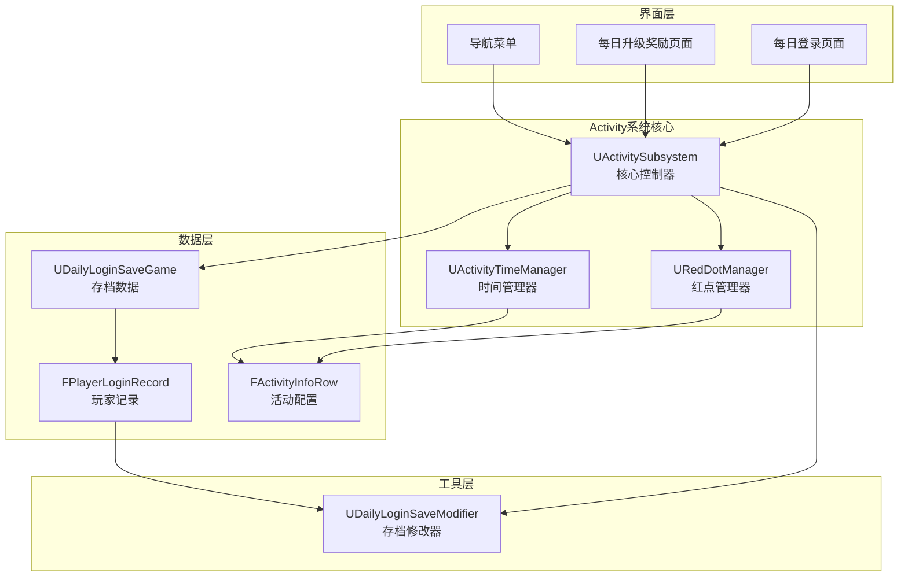

**图表来源**
- [ActivitySubsystem.h](file://MetalSlug01/Source/MetalSlug01/Public/UI/Activity/Core/ActivitySubsystem.h#L29-L32)
- [RedDotManager.h](file://MetalSlug01/Source/MetalSlug01/Public/UI/Activity/Core/RedDotManager.h#L16-L18)
- [ActivityTimeManager.h](file://MetalSlug01/Source/MetalSlug01/Public/UI/Activity/Managers/ActivityTimeManager.h#L18-L20)

**章节来源**
- [ActivitySubsystem.h](file://MetalSlug01/Source/MetalSlug01/Public/UI/Activity/Core/ActivitySubsystem.h#L17-L28)
- [ActivitySubsystem.cpp](file://MetalSlug01/Source/MetalSlug01/Private/UI/Activity/Core/ActivitySubsystem.cpp#L7-L39)

## 核心组件

### ActivitySubsystem核心类

UActivitySubsystem继承自UGameInstanceSubsystem，是整个活动系统的大脑和中枢神经。

#### 主要特性
- **生命周期管理**：通过Initialize和Deinitialize方法管理子系统的启动和关闭
- **管理器协调**：统一管理RedDotManager和ActivityTimeManager
- **数据访问接口**：提供丰富的API供其他组件访问活动数据
- **事件广播机制**：通过OnActivityDataChanged事件通知数据变更

#### 关键数据结构

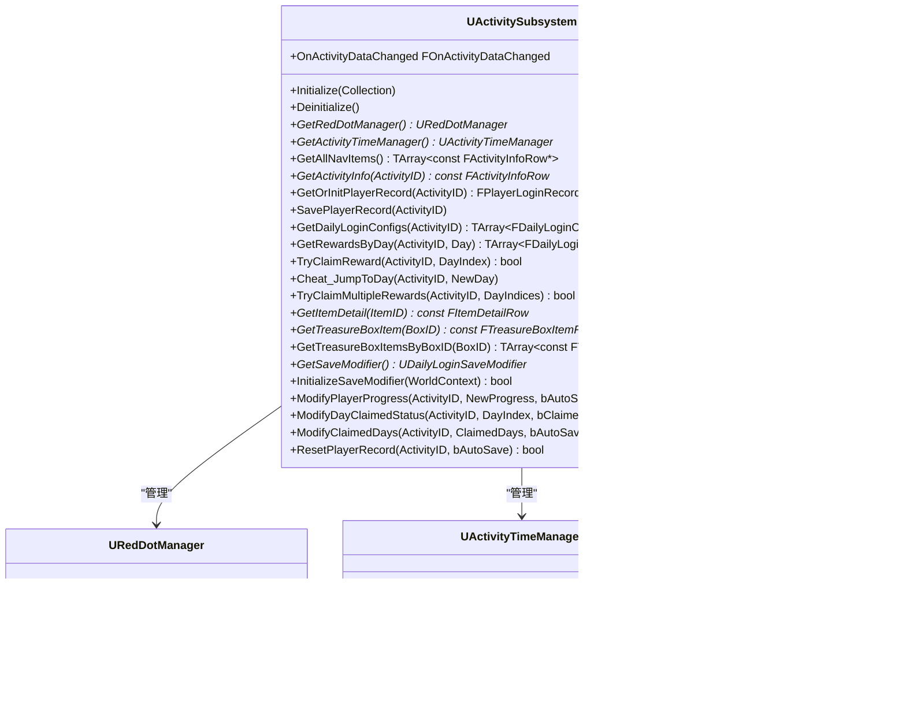

**图表来源**
- [ActivitySubsystem.h](file://MetalSlug01/Source/MetalSlug01/Public/UI/Activity/Core/ActivitySubsystem.h#L29-L175)
- [RedDotManager.h](file://MetalSlug01/Source/MetalSlug01/Public/UI/Activity/Core/RedDotManager.h#L16-L99)
- [ActivityTimeManager.h](file://MetalSlug01/Source/MetalSlug01/Public/UI/Activity/Managers/ActivityTimeManager.h#L18-L116)

**章节来源**
- [ActivitySubsystem.h](file://MetalSlug01/Source/MetalSlug01/Public/UI/Activity/Core/ActivitySubsystem.h#L29-L175)

### 数据模型架构

系统采用分层数据模型设计：

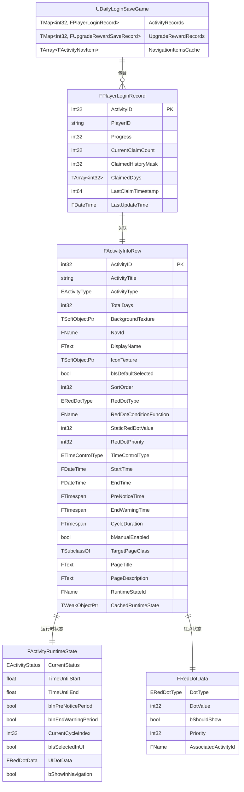

**图表来源**
- [DailyLoginConfig.h](file://MetalSlug01/Source/MetalSlug01/Public/UI/Activity/Data/DailyLoginConfig.h#L249-L420)
- [DailyLoginSave.h](file://MetalSlug01/Source/MetalSlug01/Public/UI/Activity/Data/DailyLoginSave.h#L85-L161)
- [DailyLoginSave.h](file://MetalSlug01/Source/MetalSlug01/Public/UI/Activity/Data/DailyLoginSave.h#L27-L78)

**章节来源**
- [DailyLoginConfig.h](file://MetalSlug01/Source/MetalSlug01/Public/UI/Activity/Data/DailyLoginConfig.h#L147-L420)
- [DailyLoginSave.h](file://MetalSlug01/Source/MetalSlug01/Public/UI/Activity/Data/DailyLoginSave.h#L85-L373)

## 架构概览

### 系统架构图

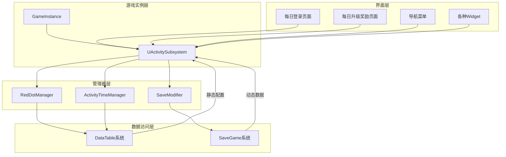

**图表来源**
- [ActivitySubsystem.cpp](file://MetalSlug01/Source/MetalSlug01/Private/UI/Activity/Core/ActivitySubsystem.cpp#L7-L39)
- [RedDotManager.cpp](file://MetalSlug01/Source/MetalSlug01/Private/UI/Activity/Core/RedDotManager.cpp#L5-L10)
- [ActivityTimeManager.cpp](file://MetalSlug01/Source/MetalSlug01/Private/UI/Activity/Managers/ActivityTimeManager.cpp#L16-L21)

### 数据流架构

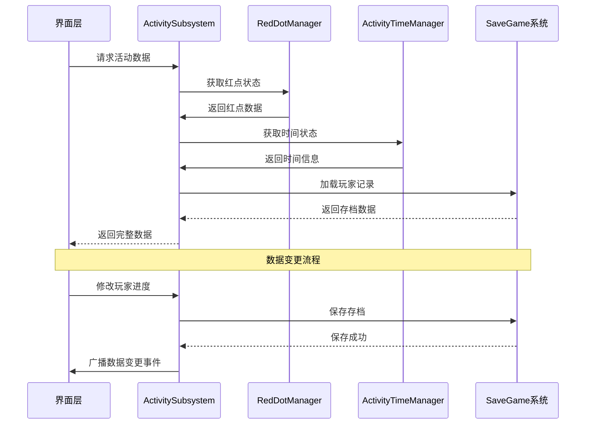

**图表来源**
- [ActivitySubsystem.cpp](file://MetalSlug01/Source/MetalSlug01/Private/UI/Activity/Core/ActivitySubsystem.cpp#L247-L298)
- [ActivitySubsystem.cpp](file://MetalSlug01/Source/MetalSlug01/Private/UI/Activity/Core/ActivitySubsystem.cpp#L481-L598)

## 详细组件分析

### ActivitySubsystem核心实现

#### 生命周期管理

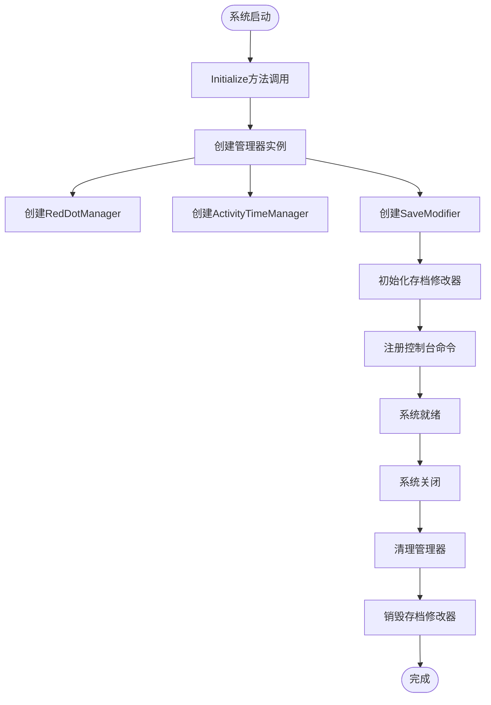

**图表来源**
- [ActivitySubsystem.cpp](file://MetalSlug01/Source/MetalSlug01/Private/UI/Activity/Core/ActivitySubsystem.cpp#L7-L39)

#### 奖励领取流程

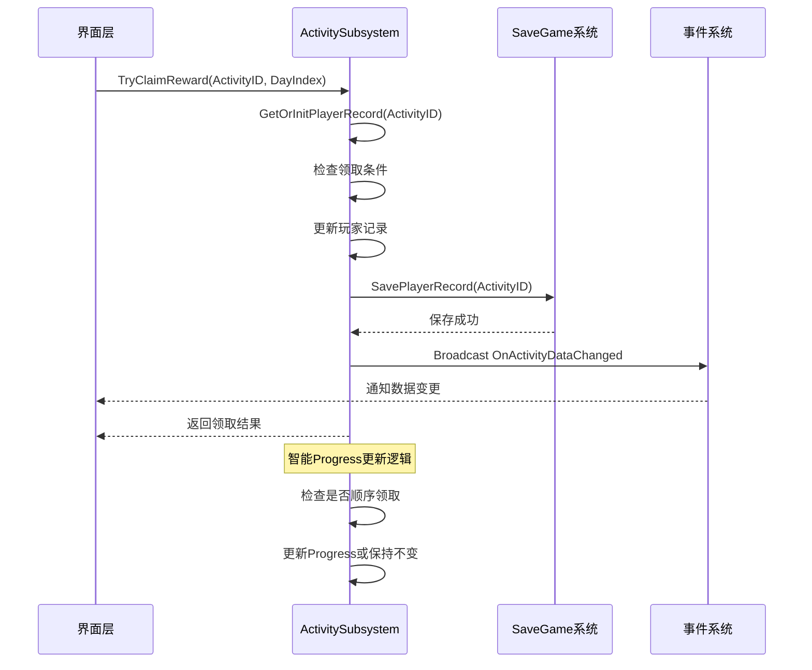

**图表来源**
- [ActivitySubsystem.cpp](file://MetalSlug01/Source/MetalSlug01/Private/UI/Activity/Core/ActivitySubsystem.cpp#L247-L298)

**章节来源**
- [ActivitySubsystem.cpp](file://MetalSlug01/Source/MetalSlug01/Private/UI/Activity/Core/ActivitySubsystem.cpp#L7-L39)
- [ActivitySubsystem.cpp](file://MetalSlug01/Source/MetalSlug01/Private/UI/Activity/Core/ActivitySubsystem.cpp#L247-L298)

### RedDotManager红点管理器

#### 红点计算策略

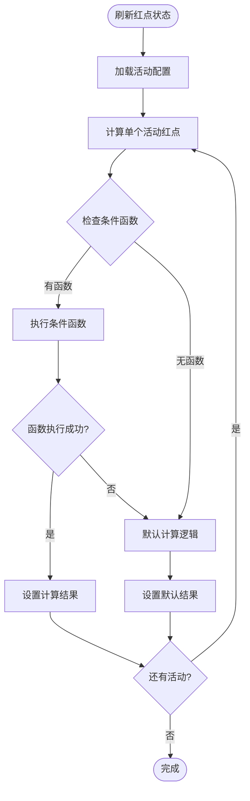

**图表来源**
- [RedDotManager.cpp](file://MetalSlug01/Source/MetalSlug01/Private/UI/Activity/Core/RedDotManager.cpp#L12-L36)
- [RedDotManager.cpp](file://MetalSlug01/Source/MetalSlug01/Private/UI/Activity/Core/RedDotManager.cpp#L91-L117)

#### 红点类型系统

| 红点类型 | 用途 | 显示效果 | 优先级 |
|---------|------|----------|--------|
| None | 不显示红点 | 无 | 0 |
| SimpleDot | 简单提示 | 纯红点 | 1 |
| NumberBadge | 数字徽章 | 带数字的红点 | 2 |
| SpecialBadge | 特殊徽章 | 特殊样式 | 3 |
| ProgressBadge | 进度徽章 | 进度型显示 | 4 |

**章节来源**
- [RedDotManager.h](file://MetalSlug01/Source/MetalSlug01/Public/UI/Activity/Core/RedDotManager.h#L16-L99)
- [RedDotManager.cpp](file://MetalSlug01/Source/MetalSlug01/Private/UI/Activity/Core/RedDotManager.cpp#L91-L160)

### ActivityTimeManager时间管理器

#### 时间状态计算

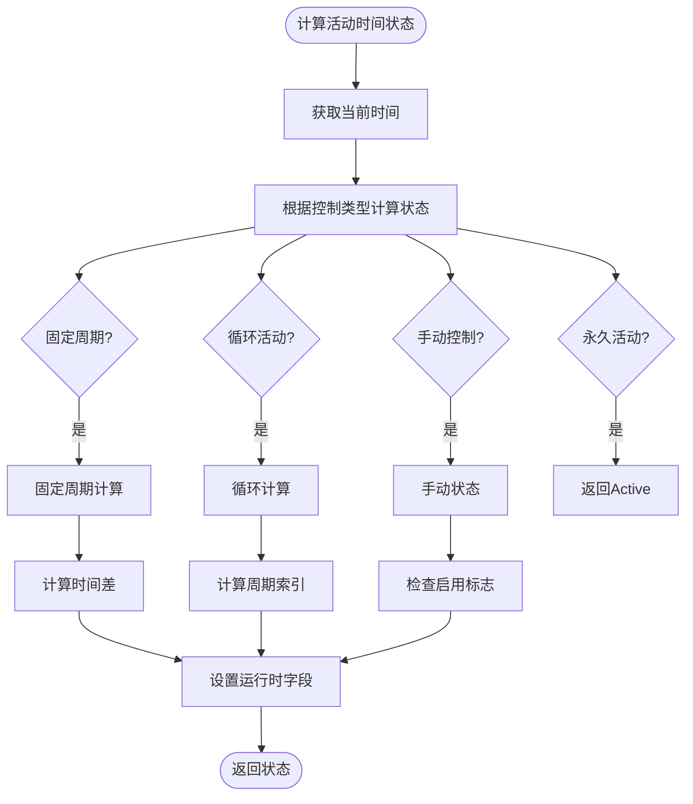

**图表来源**
- [ActivityTimeManager.cpp](file://MetalSlug01/Source/MetalSlug01/Private/UI/Activity/Managers/ActivityTimeManager.cpp#L101-L160)
- [ActivityTimeManager.cpp](file://MetalSlug01/Source/MetalSlug01/Private/UI/Activity/Managers/ActivityTimeManager.cpp#L162-L235)

**章节来源**
- [ActivityTimeManager.h](file://MetalSlug01/Source/MetalSlug01/Public/UI/Activity/Managers/ActivityTimeManager.h#L18-L116)
- [ActivityTimeManager.cpp](file://MetalSlug01/Source/MetalSlug01/Private/UI/Activity/Managers/ActivityTimeManager.cpp#L101-L235)

### DailyLoginSaveModifier存档修改器

#### 修改历史追踪

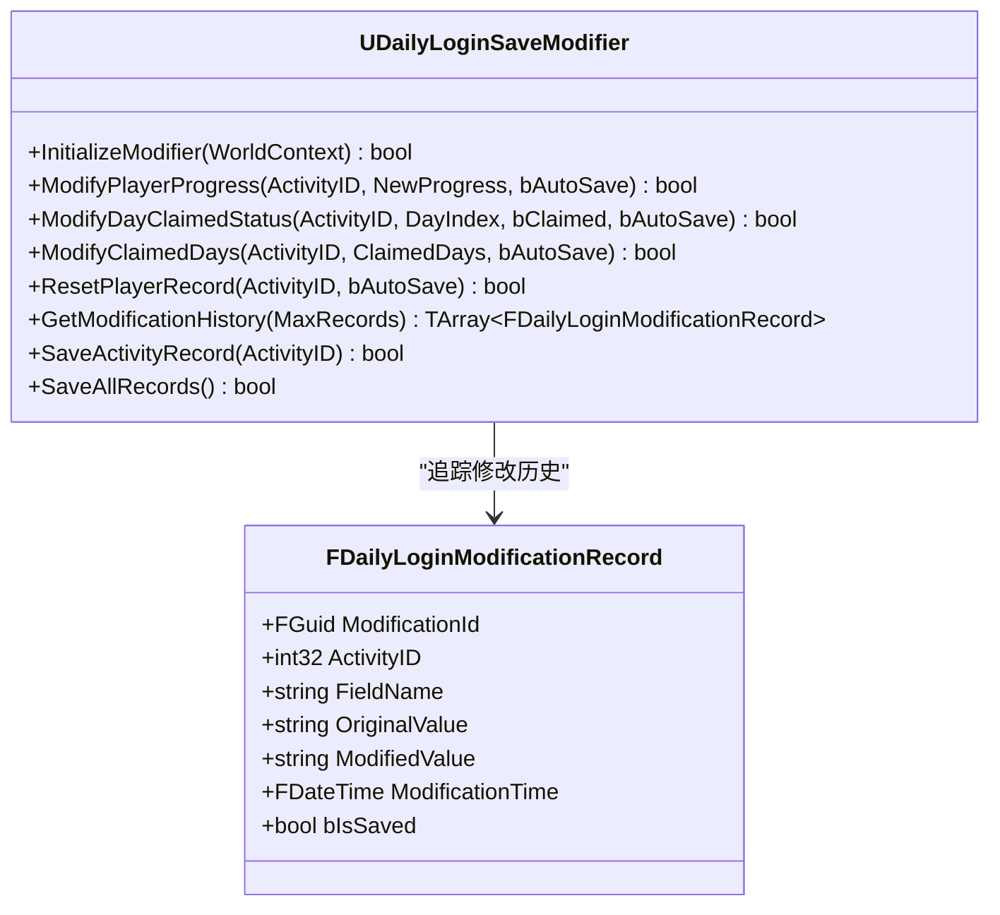

**图表来源**
- [DailyLoginSaveModifier.h](file://MetalSlug01/Source/MetalSlug01/Public/Tools/DailyLoginSaveModifier.h#L73-L294)
- [DailyLoginSaveModifier.cpp](file://MetalSlug01/Source/MetalSlug01/Private/Tools/DailyLoginSaveModifier.cpp#L22-L97)

**章节来源**
- [DailyLoginSaveModifier.h](file://MetalSlug01/Source/MetalSlug01/Public/Tools/DailyLoginSaveModifier.h#L73-L294)
- [DailyLoginSaveModifier.cpp](file://MetalSlug01/Source/MetalSlug01/Private/Tools/DailyLoginSaveModifier.cpp#L531-L546)

## 依赖关系分析

### 组件依赖图

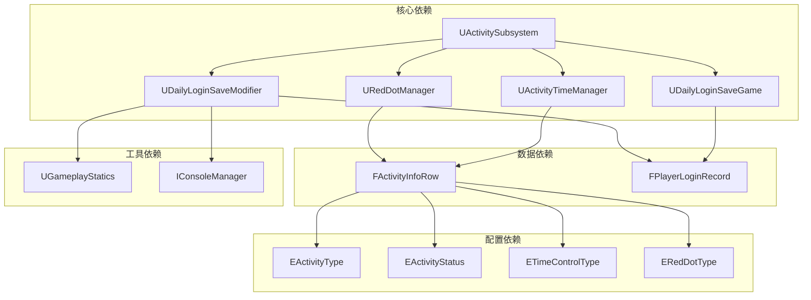

**图表来源**
- [ActivitySubsystem.h](file://MetalSlug01/Source/MetalSlug01/Public/UI/Activity/Core/ActivitySubsystem.h#L5-L11)
- [RedDotManager.h](file://MetalSlug01/Source/MetalSlug01/Public/UI/Activity/Core/RedDotManager.h#L5-L6)
- [ActivityTimeManager.h](file://MetalSlug01/Source/MetalSlug01/Public/UI/Activity/Managers/ActivityTimeManager.h#L5-L7)

### 数据访问模式

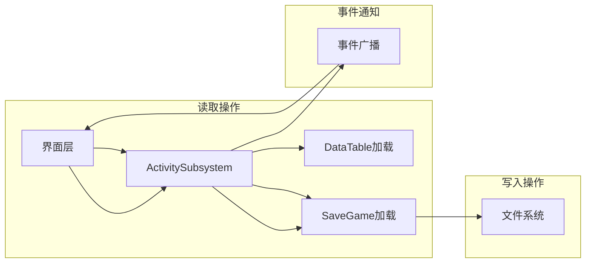

**图表来源**
- [ActivitySubsystem.cpp](file://MetalSlug01/Source/MetalSlug01/Private/UI/Activity/Core/ActivitySubsystem.cpp#L51-L75)
- [ActivitySubsystem.cpp](file://MetalSlug01/Source/MetalSlug01/Private/UI/Activity/Core/ActivitySubsystem.cpp#L149-L161)

**章节来源**
- [ActivitySubsystem.cpp](file://MetalSlug01/Source/MetalSlug01/Private/UI/Activity/Core/ActivitySubsystem.cpp#L51-L75)
- [ActivitySubsystem.cpp](file://MetalSlug01/Source/MetalSlug01/Private/UI/Activity/Core/ActivitySubsystem.cpp#L149-L161)

## 性能考虑

### 内存管理策略

1. **对象生命周期管理**
   - 所有管理器对象在子系统销毁时自动清理
   - SaveModifier通过DestroyModifier方法显式销毁
   - 使用TWeakObjectPtr避免循环引用

2. **数据缓存机制**
   - CachedSaveGame缓存最近使用的存档实例
   - RedDotCache缓存红点状态
   - TimeInfoCache缓存时间状态

3. **异步操作支持**
   - 控制台命令支持异步执行
   - 事件系统支持异步通知

### 性能优化建议

1. **DataTable访问优化**
   - 避免频繁的静态配置加载
   - 使用缓存机制减少重复访问

2. **存档操作优化**
   - 批量保存操作减少磁盘I/O
   - 异步保存机制避免主线程阻塞

3. **事件广播优化**
   - 合并频繁的数据变更事件
   - 使用弱引用避免内存泄漏

## 故障排除指南

### 常见问题诊断

#### 存档加载失败

**症状**：玩家进度数据丢失或重置
**可能原因**：
- SaveGame文件损坏
- 存档槽位名称错误
- 权限问题导致无法写入

**解决方案**：
1. 检查存档文件是否存在
2. 验证存档槽位名称格式
3. 确认游戏目录写入权限

#### 红点状态异常

**症状**：红点显示不正确或不更新
**可能原因**：
- RedDotManager未正确初始化
- 条件函数执行失败
- 缓存数据过期

**解决方案**：
1. 调用RefreshAllRedDots强制刷新
2. 检查条件函数名称是否正确
3. 清理RedDotCache重新计算

#### 时间状态错误

**症状**：活动状态显示异常
**可能原因**：
- 时间计算逻辑错误
- 服务器时间不同步
- 配置数据不正确

**解决方案**：
1. 验证活动时间配置
2. 检查服务器时间设置
3. 使用SetActivityStatusManually强制设置

**章节来源**
- [ActivitySubsystem.cpp](file://MetalSlug01/Source/MetalSlug01/Private/UI/Activity/Core/ActivitySubsystem.cpp#L149-L161)
- [RedDotManager.cpp](file://MetalSlug01/Source/MetalSlug01/Private/UI/Activity/Core/RedDotManager.cpp#L12-L36)
- [ActivityTimeManager.cpp](file://MetalSlug01/Source/MetalSlug01/Private/UI/Activity/Managers/ActivityTimeManager.cpp#L84-L92)

## 结论

ActivitySubsystem作为游戏活动系统的核心控制器，通过清晰的架构设计和严格的职责分离，实现了活动系统的高效管理和扩展。系统遵循的设计原则确保了代码的可维护性和可扩展性，而完善的API接口为上层UI提供了强大的数据支持。

### 主要优势

1. **模块化设计**：各组件职责明确，便于单独测试和维护
2. **数据驱动**：通过DataTable和SaveGame实现数据与逻辑分离
3. **事件驱动**：基于事件的通知机制确保数据一致性
4. **扩展性强**：支持新的活动类型和管理器的添加

### 发展方向

1. **性能优化**：进一步优化大数据量场景下的性能表现
2. **监控增强**：增加更详细的日志和监控功能
3. **配置管理**：提供更灵活的配置管理系统
4. **多平台支持**：增强跨平台兼容性

## 附录

### API参考手册

#### ActivitySubsystem公共接口

| 方法签名 | 参数 | 返回值 | 描述 |
|---------|------|--------|------|
| Initialize | Collection: FSubsystemCollectionBase& | void | 初始化子系统 |
| Deinitialize |  | void | 销毁子系统 |
| GetRedDotManager |  | URedDotManager* | 获取红点管理器实例 |
| GetActivityTimeManager |  | UActivityTimeManager* | 获取时间管理器实例 |
| GetAllNavItems |  | TArray<const FActivityInfoRow*> | 获取所有导航项 |
| GetActivityInfo | ActivityID: int32 | const FActivityInfoRow* | 获取指定活动信息 |
| GetOrInitPlayerRecord | ActivityID: int32 | FPlayerLoginRecord& | 获取或初始化玩家记录 |
| SavePlayerRecord | ActivityID: int32 | void | 保存玩家记录 |
| GetDailyLoginConfigs | ActivityID: int32 | TArray<FDailyLoginConfigRow*> | 获取活动配置 |
| GetRewardsByDay | ActivityID: int32, Day: int32 | TArray<FDailyLoginConfigRow*> | 根据天数获取奖励 |
| TryClaimReward | ActivityID: int32, DayIndex: int32 | bool | 尝试领取奖励 |
| Cheat_JumpToDay | ActivityID: int32, NewDay: int32 | void | 作弊跳转到指定天 |
| TryClaimMultipleRewards | ActivityID: int32, DayIndices: TArray<int32> | bool | 批量领取奖励 |
| GetItemDetail | ItemID: int32 | const FItemDetailRow* | 获取物品详情 |
| GetTreasureBoxItem | BoxID: int32 | const FTreasureBoxItemRow* | 获取宝箱物品 |
| GetTreasureBoxItemsByBoxID | BoxID: int32 | TArray<const FTreasureBoxItemRow*> | 获取所有宝箱物品 |
| GetSaveModifier |  | UDailyLoginSaveModifier* | 获取存档修改器 |
| InitializeSaveModifier | WorldContext: UObject* | bool | 初始化存档修改器 |
| ModifyPlayerProgress | ActivityID: int32, NewProgress: int32, bAutoSave: bool | bool | 修改玩家进度 |
| ModifyDayClaimedStatus | ActivityID: int32, DayIndex: int32, bClaimed: bool, bAutoSave: bool | bool | 修改领取状态 |
| ModifyClaimedDays | ActivityID: int32, ClaimedDays: TArray<int32>, bAutoSave: bool | bool | 批量修改领取天数 |
| ResetPlayerRecord | ActivityID: int32, bAutoSave: bool | bool | 重置玩家记录 |

#### 事件定义

| 事件名称 | 触发时机 | 描述 |
|---------|----------|------|
| OnActivityDataChanged | 数据变更时 | 广播活动数据变更事件 |

### 最佳实践指南

#### 使用建议

1. **正确初始化**：确保在GameInstance的Initialize阶段调用Initialize
2. **资源管理**：在Deinitialize中清理所有资源
3. **错误处理**：对所有API调用进行适当的错误检查
4. **性能考虑**：避免频繁的DataTable访问，使用缓存机制

#### 开发规范

1. **接口设计**：遵循Subsystem不做业务判断的原则
2. **数据安全**：所有数据修改必须通过SaveGame系统
3. **事件通信**：使用事件系统进行组件间通信
4. **日志记录**：完善日志记录便于调试和监控