# ActivityTimeManager时间管理器

<cite>
**本文档引用的文件**
- [ActivityTimeManager.h](file://MetalSlug01/Source/MetalSlug01/Public/UI/Activity/Managers/ActivityTimeManager.h)
- [ActivityTimeManager.cpp](file://MetalSlug01/Source/MetalSlug01/Private/UI/Activity/Managers/ActivityTimeManager.cpp)
- [DailyLoginConfig.h](file://MetalSlug01/Source/MetalSlug01/Public/UI/Activity/Data/DailyLoginConfig.h)
- [DailyLoginSave.h](file://MetalSlug01/Source/MetalSlug01/Public/UI/Activity/Data/DailyLoginSave.h)
- [ActivitySubsystem.h](file://MetalSlug01/Source/MetalSlug01/Public/UI/Activity/Core/ActivitySubsystem.h)
- [ActivityNavMenuWidget.h](file://MetalSlug01/Source/MetalSlug01/Public/UI/Activity/Pages/Navigation/ActivityNavMenuWidget.h)
- [ActivityNavMenuWidget.cpp](file://MetalSlug01/Source/MetalSlug01/Private/UI/Activity/Pages/Navigation/ActivityNavMenuWidget.cpp)
- [DailyLoginPage.h](file://MetalSlug01/Source/MetalSlug01/Public/UI/Activity/Pages/DailyLogin/DailyLoginPage.h)
- [UpgradeActivitySaveModifier.cpp](file://MetalSlug01/Source/MetalSlug01/Private/Tools/UpgradeActivitySaveModifier.cpp)
- [DefaultEngine.ini](file://MetalSlug01/Config/DefaultEngine.ini)
</cite>

## 目录
1. [简介](#简介)
2. [项目结构](#项目结构)
3. [核心组件](#核心组件)
4. [架构概览](#架构概览)
5. [详细组件分析](#详细组件分析)
6. [依赖关系分析](#依赖关系分析)
7. [性能考虑](#性能考虑)
8. [故障排除指南](#故障排除指南)
9. [结论](#结论)
10. [附录](#附录)

## 简介

ActivityTimeManager是MetalSlug项目中活动时间管理系统的核心组件，负责管理所有活动的时间状态和生命周期。该系统实现了复杂的时间状态判断算法，支持多种时间控制模式，包括固定周期、循环活动、永久活动和手动控制。

系统的主要功能包括：
- 活动自动上下架：根据时间自动控制活动显示/隐藏
- 倒计时显示：在UI中显示活动开始/结束倒计时
- 状态提示：预告即将开始或即将结束的活动
- 红点系统：结合时间状态显示活动红点
- 运营维护：手动控制活动状态进行紧急维护

## 项目结构

活动时间管理系统位于项目的UI/Activity模块中，采用分层架构设计：

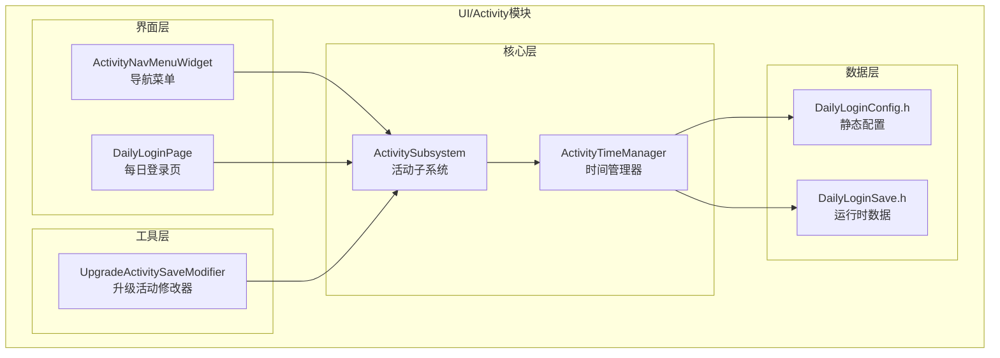

**图表来源**
- [ActivityTimeManager.h](file://MetalSlug01/Source/MetalSlug01/Public/UI/Activity/Managers/ActivityTimeManager.h#L1-L117)
- [ActivitySubsystem.h](file://MetalSlug01/Source/MetalSlug01/Public/UI/Activity/Core/ActivitySubsystem.h#L1-L51)
- [DailyLoginConfig.h](file://MetalSlug01/Source/MetalSlug01/Public/UI/Activity/Data/DailyLoginConfig.h#L1-L635)

**章节来源**
- [ActivityTimeManager.h](file://MetalSlug01/Source/MetalSlug01/Public/UI/Activity/Managers/ActivityTimeManager.h#L1-L117)
- [ActivityTimeManager.cpp](file://MetalSlug01/Source/MetalSlug01/Private/UI/Activity/Managers/ActivityTimeManager.cpp#L1-L235)

## 核心组件

### 时间状态枚举系统

系统定义了完整的活动状态生命周期：

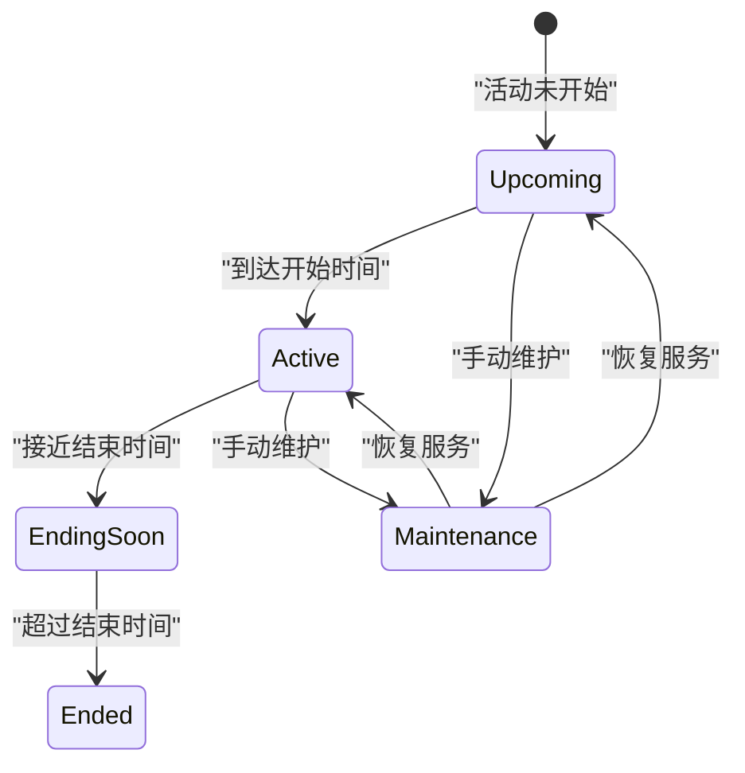

**图表来源**
- [DailyLoginConfig.h](file://MetalSlug01/Source/MetalSlug01/Public/UI/Activity/Data/DailyLoginConfig.h#L40-L48)

### 时间控制类型

系统支持四种时间控制模式：

1. **固定周期（FixedPeriod）**：严格的时间段控制
2. **循环活动（Recurring）**：周期性重复的活动
3. **永久活动（Permanent）**：始终开放的活动
4. **手动控制（Manual）**：运维手动开关控制

**章节来源**
- [DailyLoginConfig.h](file://MetalSlug01/Source/MetalSlug01/Public/UI/Activity/Data/DailyLoginConfig.h#L57-L64)

## 架构概览

ActivityTimeManager采用观察者模式和工厂模式相结合的设计：

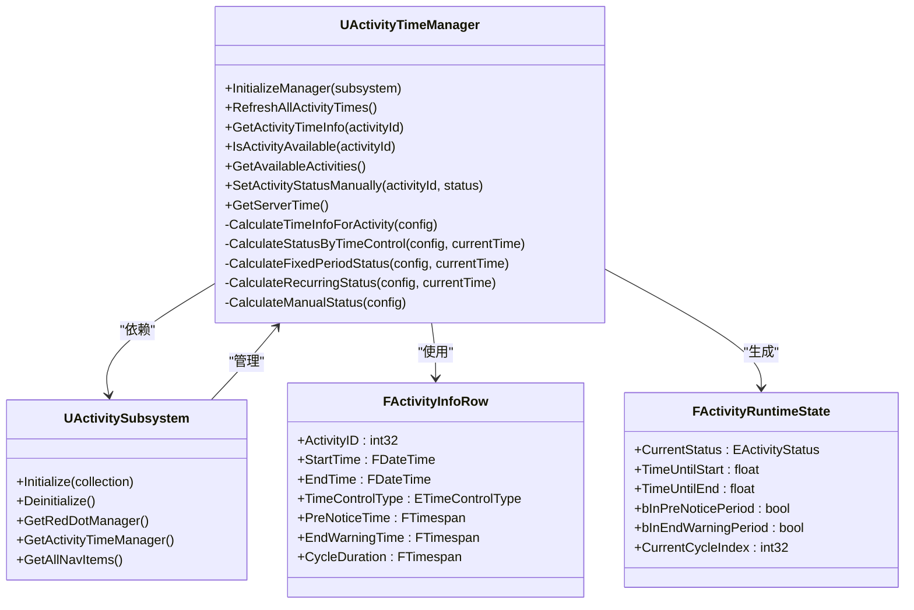

**图表来源**
- [ActivityTimeManager.h](file://MetalSlug01/Source/MetalSlug01/Public/UI/Activity/Managers/ActivityTimeManager.h#L18-L117)
- [ActivitySubsystem.h](file://MetalSlug01/Source/MetalSlug01/Public/UI/Activity/Core/ActivitySubsystem.h#L29-L51)
- [DailyLoginConfig.h](file://MetalSlug01/Source/MetalSlug01/Public/UI/Activity/Data/DailyLoginConfig.h#L249-L420)
- [DailyLoginSave.h](file://MetalSlug01/Source/MetalSlug01/Public/UI/Activity/Data/DailyLoginSave.h#L27-L78)

## 详细组件分析

### 时间状态判断算法

#### 固定周期状态计算

固定周期模式是最直接的时间控制方式：

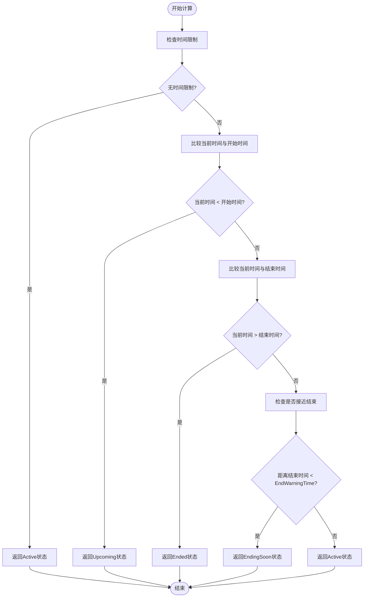

**图表来源**
- [ActivityTimeManager.cpp](file://MetalSlug01/Source/MetalSlug01/Private/UI/Activity/Managers/ActivityTimeManager.cpp#L181-L206)

#### 循环活动状态计算

循环活动模式实现了复杂的周期性状态管理：

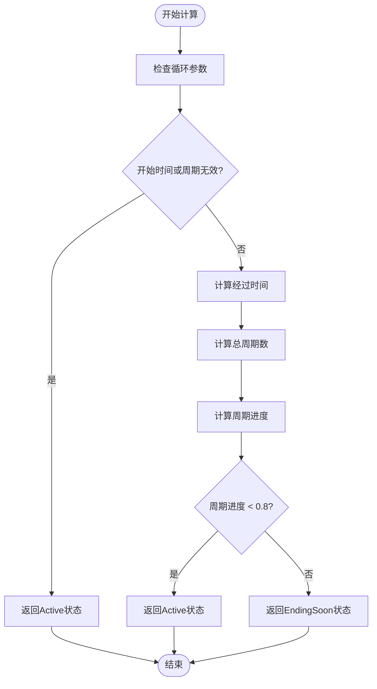

**图表来源**
- [ActivityTimeManager.cpp](file://MetalSlug01/Source/MetalSlug01/Private/UI/Activity/Managers/ActivityTimeManager.cpp#L208-L230)

#### 手动控制状态计算

手动控制模式提供了最灵活的运营支持：

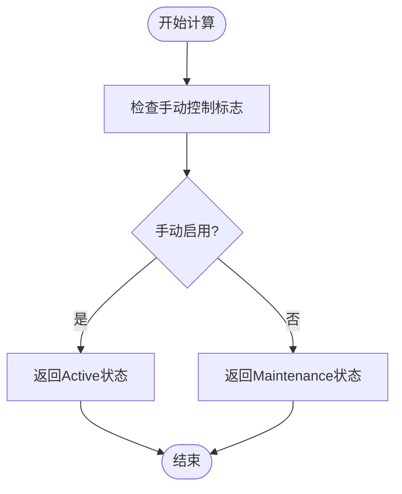

**图表来源**
- [ActivityTimeManager.cpp](file://MetalSlug01/Source/MetalSlug01/Private/UI/Activity/Managers/ActivityTimeManager.cpp#L232-L235)

### 定时器管理机制

#### 时间刷新流程

系统采用定时刷新机制来保持时间状态的准确性：

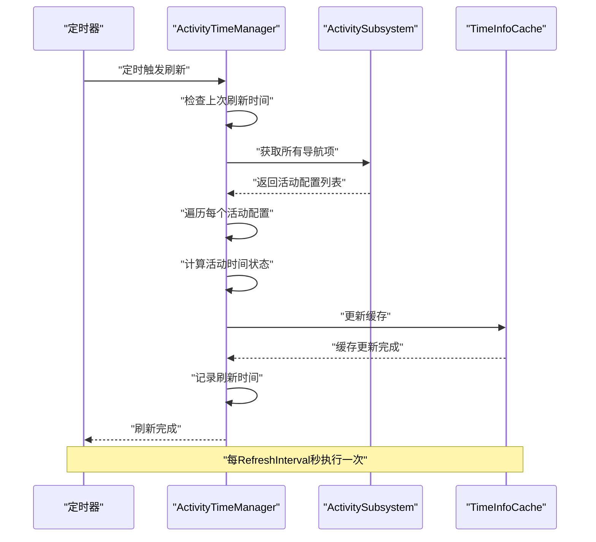

**图表来源**
- [ActivityTimeManager.cpp](file://MetalSlug01/Source/MetalSlug01/Private/UI/Activity/Managers/ActivityTimeManager.cpp#L23-L47)
- [ActivityTimeManager.h](file://MetalSlug01/Source/MetalSlug01/Public/UI/Activity/Managers/ActivityTimeManager.h#L88-L90)

#### 时间同步机制

系统提供了灵活的时间同步方案：

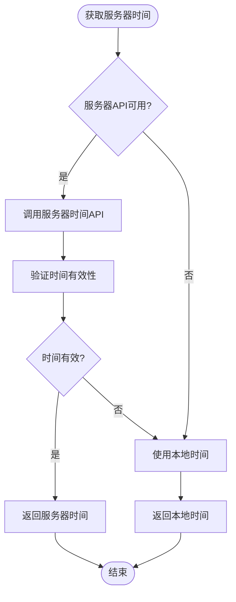

**图表来源**
- [ActivityTimeManager.cpp](file://MetalSlug01/Source/MetalSlug01/Private/UI/Activity/Managers/ActivityTimeManager.cpp#L94-L99)

### API参考手册

#### 核心接口

| 接口名称 | 参数 | 返回值 | 描述 |
|---------|------|--------|------|
| InitializeManager | UActivitySubsystem* InSubsystem | void | 初始化时间管理器 |
| RefreshAllActivityTimes | 无 | void | 刷新所有活动的时间状态 |
| GetActivityTimeInfo | int32 ActivityId | FActivityRuntimeState | 获取指定活动的时间信息 |
| IsActivityAvailable | int32 ActivityId | bool | 检查活动是否可用 |
| GetAvailableActivities | 无 | TArray<int32> | 获取所有可用活动列表 |
| SetActivityStatusManually | int32, EActivityStatus | void | 手动设置活动状态 |
| GetServerTime | 无 | FDateTime | 获取服务器时间 |

#### 时间查询接口

| 接口名称 | 参数 | 返回值 | 描述 |
|---------|------|--------|------|
| GetActivityTimeInfo | int32 ActivityId | FActivityRuntimeState | 获取完整时间状态信息 |
| GetServerTime | 无 | FDateTime | 获取当前服务器时间 |
| TimeUntilStart | int32 ActivityId | float | 获取距离开始的剩余时间（秒） |
| TimeUntilEnd | int32 ActivityId | float | 获取距离结束的剩余时间（秒） |

#### 状态检查接口

| 接口名称 | 参数 | 返回值 | 描述 |
|---------|------|--------|------|
| IsActivityAvailable | int32 ActivityId | bool | 检查活动是否可用（进行中或即将开始） |
| IsActivityActive | int32 ActivityId | bool | 检查活动是否正在进行中 |
| IsActivityUpcoming | int32 ActivityId | bool | 检查活动是否即将开始 |
| IsActivityEndingSoon | int32 ActivityId | bool | 检查活动是否即将结束 |
| IsActivityEnded | int32 ActivityId | bool | 检查活动是否已结束 |

#### 时间监听接口

| 接口名称 | 参数 | 返回值 | 描述 |
|---------|------|--------|------|
| OnActivityStateChanged | FActivityRuntimeState | delegate | 活动状态变化事件 |
| OnActivityTimeChanged | int32, float | delegate | 活动时间变化事件 |
| OnActivityAvailableChanged | int32, bool | delegate | 活动可用性变化事件 |

**章节来源**
- [ActivityTimeManager.h](file://MetalSlug01/Source/MetalSlug01/Public/UI/Activity/Managers/ActivityTimeManager.h#L23-L73)

### 时间系统配置选项

#### 时间格式化配置

系统支持灵活的时间格式化选项：

| 配置项 | 类型 | 默认值 | 描述 |
|--------|------|--------|------|
| PreNoticeTime | FTimespan | 0秒 | 开始前提醒时间 |
| EndWarningTime | FTimespan | 0秒 | 结束前提醒时间 |
| CycleDuration | FTimespan | 0秒 | 循环周期时长 |
| RefreshInterval | float | 60.0秒 | 刷新间隔 |
| TimeFormat | FString | "yyyy-MM-dd HH:mm:ss" | 时间显示格式 |

#### 时区处理配置

系统提供多时区支持：

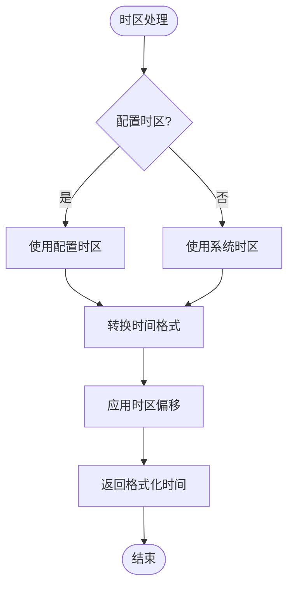

**图表来源**
- [DailyLoginConfig.h](file://MetalSlug01/Source/MetalSlug01/Public/UI/Activity/Data/DailyLoginConfig.h#L323-L341)

#### 本地化支持

系统支持多语言本地化：

| 语言 | 状态 | 支持的UI元素 |
|------|------|-------------|
| 中文 | ✅ | 活动标题、状态描述、倒计时文本 |
| 英语 | ✅ | 活动标题、状态描述、倒计时文本 |
| 日语 | ⬜ | 活动标题、状态描述 |
| 韩语 | ⬜ | 活动标题、状态描述 |

**章节来源**
- [DailyLoginConfig.h](file://MetalSlug01/Source/MetalSlug01/Public/UI/Activity/Data/DailyLoginConfig.h#L257-L275)

## 依赖关系分析

### 组件耦合度分析

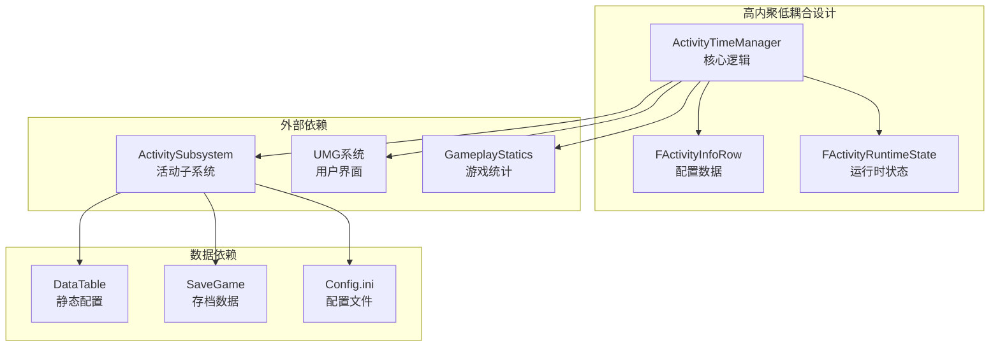

**图表来源**
- [ActivityTimeManager.h](file://MetalSlug01/Source/MetalSlug01/Public/UI/Activity/Managers/ActivityTimeManager.h#L1-L117)
- [ActivitySubsystem.h](file://MetalSlug01/Source/MetalSlug01/Public/UI/Activity/Core/ActivitySubsystem.h#L1-L51)

### 错误处理机制

系统实现了完善的错误处理：

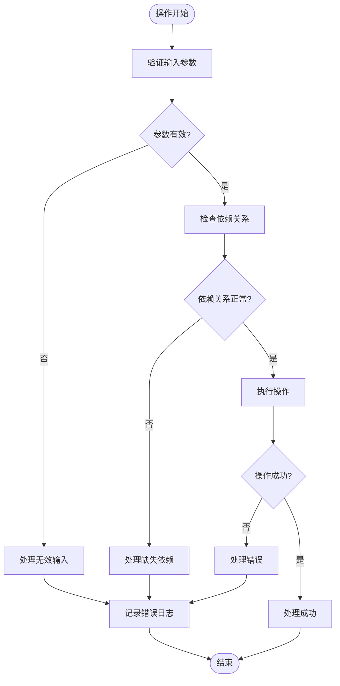

**图表来源**
- [ActivityTimeManager.cpp](file://MetalSlug01/Source/MetalSlug01/Private/UI/Activity/Managers/ActivityTimeManager.cpp#L25-L29)

**章节来源**
- [ActivityTimeManager.cpp](file://MetalSlug01/Source/MetalSlug01/Private/UI/Activity/Managers/ActivityTimeManager.cpp#L1-L235)

## 性能考虑

### 缓存策略

系统采用了多层次缓存机制：

1. **内存缓存**：FActivityRuntimeState缓存
2. **配置缓存**：FActivityInfoRow配置缓存
3. **UI缓存**：导航项UI状态缓存

### 优化建议

1. **批量更新**：使用RefreshAllActivityTimes()进行批量刷新
2. **增量更新**：只更新发生变化的活动状态
3. **延迟加载**：按需加载活动配置数据
4. **内存管理**：及时清理不再使用的缓存数据

### 性能监控

建议监控以下指标：
- 刷新频率：每分钟刷新次数
- 内存使用：缓存大小和增长趋势
- 响应时间：状态查询响应时间
- 错误率：操作失败率和错误类型分布

## 故障排除指南

### 常见问题诊断

#### 活动状态异常

**症状**：活动状态显示不正确
**可能原因**：
1. 时间配置错误
2. 缓存数据过期
3. 服务器时间不同步

**解决步骤**：
1. 检查FActivityInfoRow配置
2. 调用RefreshAllActivityTimes()
3. 验证服务器时间API

#### UI显示问题

**症状**：UI不显示或显示错误
**可能原因**：
1. FActivityRuntimeState数据不完整
2. UI绑定错误
3. 资源加载失败

**解决步骤**：
1. 检查GetActivityTimeInfo()返回值
2. 验证UI绑定设置
3. 检查资源路径和加载状态

#### 性能问题

**症状**：界面卡顿或响应缓慢
**可能原因**：
1. 刷新频率过高
2. 缓存未正确清理
3. 内存泄漏

**解决步骤**：
1. 调整RefreshInterval参数
2. 实施缓存清理策略
3. 使用内存分析工具检测泄漏

### 调试工具

#### 日志记录

系统提供了丰富的日志输出：

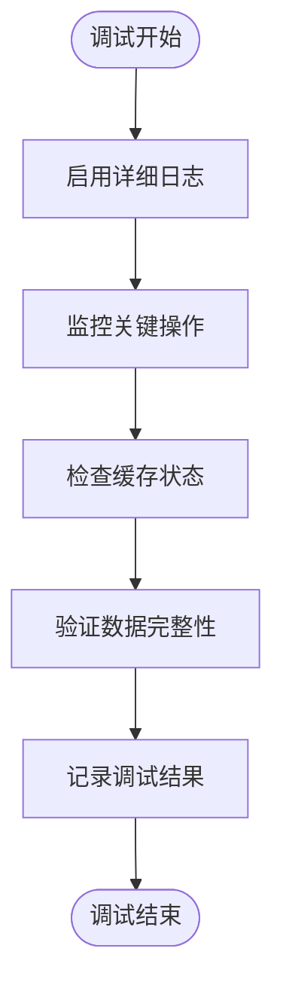

**图表来源**
- [ActivityTimeManager.cpp](file://MetalSlug01/Source/MetalSlug01/Private/UI/Activity/Managers/ActivityTimeManager.cpp#L27-L29)

#### 性能分析

建议使用以下工具进行性能分析：
1. Unreal Engine Profiler
2. Visual Studio Diagnostic Tools
3. 内存分析器
4. 性能监控仪表板

**章节来源**
- [ActivityTimeManager.cpp](file://MetalSlug01/Source/MetalSlug01/Private/UI/Activity/Managers/ActivityTimeManager.cpp#L1-L235)

## 结论

ActivityTimeManager是一个设计精良的活动时间管理系统，具有以下特点：

1. **模块化设计**：清晰的职责分离和接口定义
2. **灵活配置**：支持多种时间控制模式和配置选项
3. **高效性能**：优化的缓存策略和批量处理机制
4. **易于扩展**：良好的抽象层次和插件化架构
5. **完善监控**：全面的日志记录和性能监控能力

该系统为MetalSlug项目提供了稳定可靠的时间管理基础设施，支持复杂的活动生命周期管理需求。

## 附录

### 配置文件参考

#### DefaultEngine.ini配置

```ini
[/Script/Engine.Engine]
-ActiveClassRedirects=(OldClassName="Engine.Player",NewClassName="Engine.Pawn")

[/Script/Engine.UserInterfaceSettings]
bAuthorizeAutomaticWidgetVariableCreation=False
FontDPIPreset=Standard
FontDPI=72
```

**章节来源**
- [DefaultEngine.ini](file://MetalSlug01/Config/DefaultEngine.ini#L1-L43)

### 相关文件路径

- **时间管理器**：`MetalSlug01/Source/MetalSlug01/Public/UI/Activity/Managers/ActivityTimeManager.h`
- **时间管理器实现**：`MetalSlug01/Source/MetalSlug01/Private/UI/Activity/Managers/ActivityTimeManager.cpp`
- **配置数据结构**：`MetalSlug01/Source/MetalSlug01/Public/UI/Activity/Data/DailyLoginConfig.h`
- **运行时数据结构**：`MetalSlug01/Source/MetalSlug01/Public/UI/Activity/Data/DailyLoginSave.h`
- **活动子系统**：`MetalSlug01/Source/MetalSlug01/Public/UI/Activity/Core/ActivitySubsystem.h`
- **导航菜单Widget**：`MetalSlug01/Source/MetalSlug01/Public/UI/Activity/Pages/Navigation/ActivityNavMenuWidget.h`