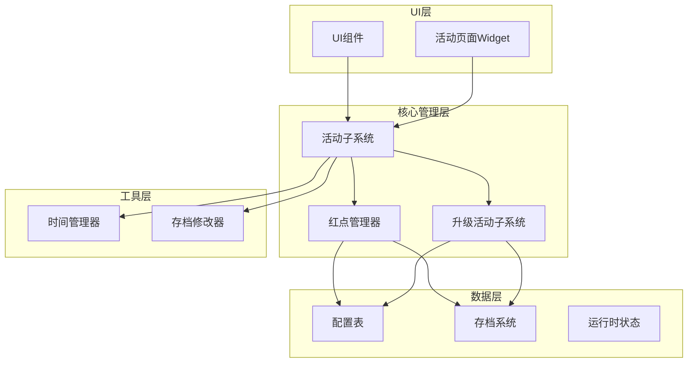
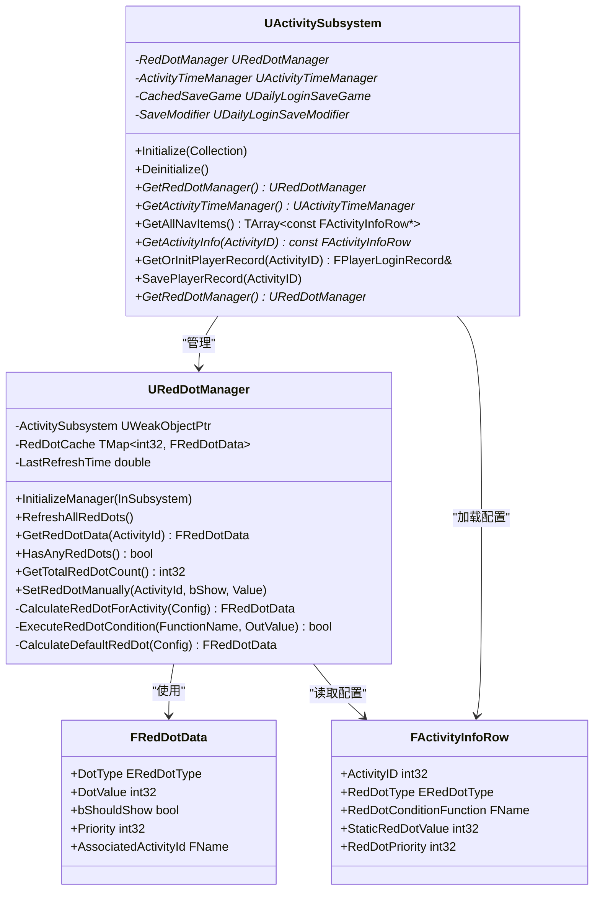
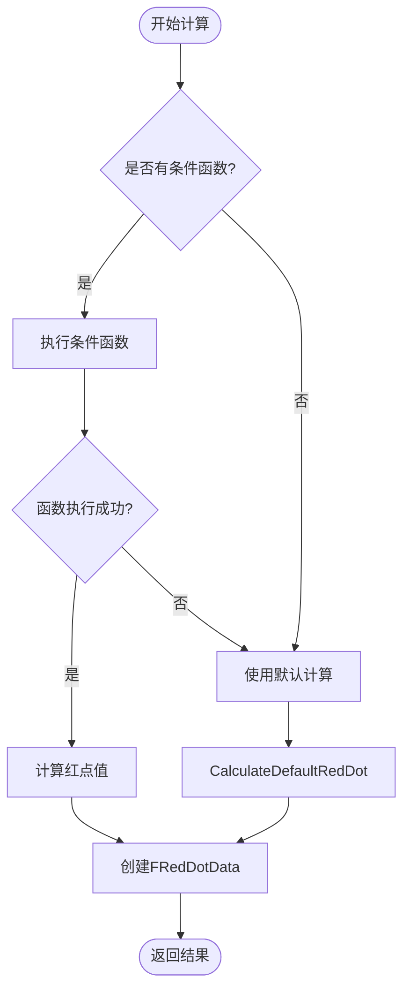
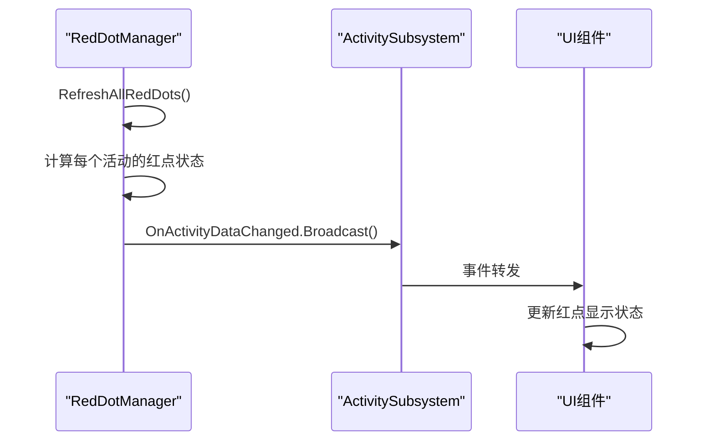
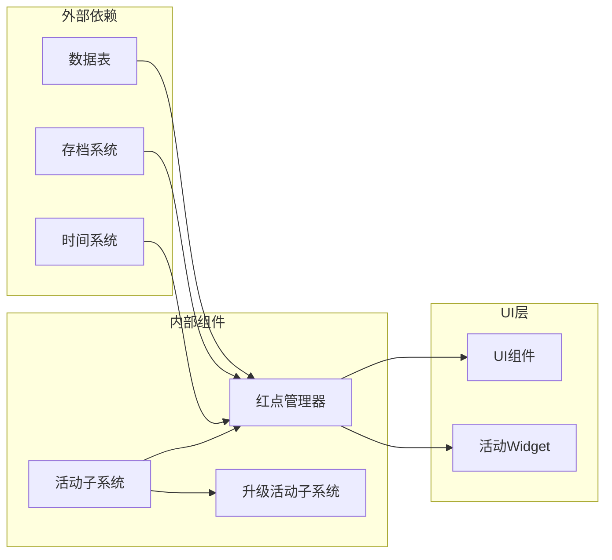

# RedDotManager红点管理系统

<cite>
**本文档引用的文件**
- [RedDotManager.h](file://MetalSlug01/Source/MetalSlug01/Public/UI/Activity/Core/RedDotManager.h)
- [RedDotManager.cpp](file://MetalSlug01/Source/MetalSlug01/Private/UI/Activity/Core/RedDotManager.cpp)
- [ActivitySubsystem.h](file://MetalSlug01/Source/MetalSlug01/Public/UI/Activity/Core/ActivitySubsystem.h)
- [ActivitySubsystem.cpp](file://MetalSlug01/Source/MetalSlug01/Private/UI/Activity/Core/ActivitySubsystem.cpp)
- [UpgradeActivitySubsystem.h](file://MetalSlug01/Source/MetalSlug01/Public/UI/Activity/Core/UpgradeActivitySubsystem.h)
- [UpgradeActivitySubsystem.cpp](file://MetalSlug01/Source/MetalSlug01/Private/UI/Activity/Core/UpgradeActivitySubsystem.cpp)
- [DailyLoginConfig.h](file://MetalSlug01/Source/MetalSlug01/Public/UI/Activity/Data/DailyLoginConfig.h)
- [DailyLoginSave.h](file://MetalSlug01/Source/MetalSlug01/Public/UI/Activity/Data/DailyLoginSave.h)
</cite>

## 目录
1. [简介](#简介)
2. [项目结构](#项目结构)
3. [核心组件](#核心组件)
4. [架构概览](#架构概览)
5. [详细组件分析](#详细组件分析)
6. [依赖关系分析](#依赖关系分析)
7. [性能考虑](#性能考虑)
8. [故障排除指南](#故障排除指南)
9. [结论](#结论)
10. [附录](#附录)

## 简介

RedDotManager红点管理系统是MetalSlug项目中UI活动系统的重要组成部分，负责计算和管理所有活动项的红点状态。该系统通过统一的红点状态计算算法，为UI组件提供实时的红点显示逻辑，包括活动状态、玩家进度、时间限制等多种因素的综合考量。

系统采用模块化设计，支持多种红点规则和可扩展的状态管理，能够根据活动配置动态生成红点状态，并通过事件通知机制与UI组件进行解耦集成。

## 项目结构

项目采用分层架构设计，主要分为以下层次：



**图表来源**
- [ActivitySubsystem.h](file://MetalSlug01/Source/MetalSlug01/Public/UI/Activity/Core/ActivitySubsystem.h#L29-L32)
- [RedDotManager.h](file://MetalSlug01/Source/MetalSlug01/Public/UI/Activity/Core/RedDotManager.h#L16-L18)
- [UpgradeActivitySubsystem.h](file://MetalSlug01/Source/MetalSlug01/Public/UI/Activity/Core/UpgradeActivitySubsystem.h#L35-L37)

**章节来源**
- [ActivitySubsystem.h](file://MetalSlug01/Source/MetalSlug01/Public/UI/Activity/Core/ActivitySubsystem.h#L1-L178)
- [RedDotManager.h](file://MetalSlug01/Source/MetalSlug01/Public/UI/Activity/Core/RedDotManager.h#L1-L100)

## 核心组件

### 红点管理器 (RedDotManager)

RedDotManager是整个红点系统的核心控制器，负责：

- **初始化管理**：接收活动子系统引用并建立依赖关系
- **状态计算**：为每个活动项计算红点状态
- **缓存管理**：维护红点状态缓存以提升性能
- **事件通知**：通过委托机制通知UI组件状态变化

### 活动子系统 (ActivitySubsystem)

活动子系统作为协调者，管理多个子系统和组件：

- **生命周期管理**：负责子系统的初始化和销毁
- **数据访问接口**：提供统一的数据访问方法
- **事件广播**：在数据变更时广播事件
- **存档管理**：处理玩家进度的持久化

### 升级活动子系统 (UpgradeActivitySubsystem)

专门处理升级奖励活动的业务逻辑：

- **任务管理**：管理每日任务的完成状态
- **奖励系统**：处理宝箱和任务奖励的领取
- **进度跟踪**：跟踪玩家的经验值和进度
- **数据持久化**：管理升级活动的存档数据

**章节来源**
- [RedDotManager.h](file://MetalSlug01/Source/MetalSlug01/Public/UI/Activity/Core/RedDotManager.h#L16-L100)
- [ActivitySubsystem.h](file://MetalSlug01/Source/MetalSlug01/Public/UI/Activity/Core/ActivitySubsystem.h#L29-L175)
- [UpgradeActivitySubsystem.h](file://MetalSlug01/Source/MetalSlug01/Public/UI/Activity/Core/UpgradeActivitySubsystem.h#L35-L476)

## 架构概览

红点管理系统采用分层架构，通过清晰的职责分离实现松耦合的设计：



**图表来源**
- [RedDotManager.h](file://MetalSlug01/Source/MetalSlug01/Public/UI/Activity/Core/RedDotManager.h#L16-L100)
- [ActivitySubsystem.h](file://MetalSlug01/Source/MetalSlug01/Public/UI/Activity/Core/ActivitySubsystem.h#L29-L175)
- [DailyLoginConfig.h](file://MetalSlug01/Source/MetalSlug01/Public/UI/Activity/Data/DailyLoginConfig.h#L147-L189)
- [DailyLoginConfig.h](file://MetalSlug01/Source/MetalSlug01/Public/UI/Activity/Data/DailyLoginConfig.h#L249-L420)

## 详细组件分析

### 红点状态计算算法

红点管理器实现了两层计算逻辑：

#### 动态条件计算
当活动配置中设置了条件函数时，系统优先执行动态计算：



**图表来源**
- [RedDotManager.cpp](file://MetalSlug01/Source/MetalSlug01/Private/UI/Activity/Core/RedDotManager.cpp#L91-L117)

#### 默认计算逻辑
当没有条件函数或动态计算失败时，使用默认计算：

1. **静态数值检查**：检查StaticRedDotValue是否大于0
2. **类型选择**：根据检查结果选择相应的红点类型
3. **状态设置**：设置显示状态和优先级
4. **数据封装**：创建FRedDotData结构返回

**章节来源**
- [RedDotManager.cpp](file://MetalSlug01/Source/MetalSlug01/Private/UI/Activity/Core/RedDotManager.cpp#L91-L160)

### 数据结构设计

#### 红点数据结构 (FRedDotData)
```mermaid
erDiagram
FRedDotData {
ERedDotType DotType
int32 DotValue
bool bShouldShow
int32 Priority
FName AssociatedActivityId
}
ERedDotType {
None "无红点"
SimpleDot "简单红点"
NumberBadge "数字徽章"
SpecialBadge "特殊徽章"
ProgressBadge "进度徽章"
}
```

**图表来源**
- [DailyLoginConfig.h](file://MetalSlug01/Source/MetalSlug01/Public/UI/Activity/Data/DailyLoginConfig.h#L147-L189)
- [DailyLoginConfig.h](file://MetalSlug01/Source/MetalSlug01/Public/UI/Activity/Data/DailyLoginConfig.h#L73-L81)

#### 活动信息结构 (FActivityInfoRow)
活动信息结构包含了完整的红点配置：

- **红点类型**：RedDotType
- **条件函数**：RedDotConditionFunction  
- **静态数值**：StaticRedDotValue
- **优先级**：RedDotPriority

**章节来源**
- [DailyLoginConfig.h](file://MetalSlug01/Source/MetalSlug01/Public/UI/Activity/Data/DailyLoginConfig.h#L249-L420)

### 红点管理器API参考

#### 初始化接口
```cpp
void InitializeManager(UActivitySubsystem* InSubsystem);
```
- **功能**：初始化红点管理器，建立与活动子系统的依赖关系
- **参数**：活动子系统引用
- **返回值**：无

#### 状态查询接口
```cpp
FRedDotData GetRedDotData(int32 ActivityId) const;
bool HasAnyRedDots() const;
int32 GetTotalRedDotCount() const;
```

#### 状态更新接口
```cpp
void SetRedDotManually(int32 ActivityId, bool bShow, int32 Value = 1);
void RefreshAllRedDots();
```

#### 内部计算接口
```cpp
FRedDotData CalculateRedDotForActivity(const FActivityInfoRow* Config);
bool ExecuteRedDotCondition(const FName& FunctionName, int32& OutValue);
FRedDotData CalculateDefaultRedDot(const FActivityInfoRow* Config);
```

**章节来源**
- [RedDotManager.h](file://MetalSlug01/Source/MetalSlug01/Public/UI/Activity/Core/RedDotManager.h#L21-L100)

### 事件通知机制

系统通过委托机制实现松耦合的事件通知：



**图表来源**
- [ActivitySubsystem.cpp](file://MetalSlug01/Source/MetalSlug01/Private/UI/Activity/Core/ActivitySubsystem.cpp#L294-L294)

**章节来源**
- [ActivitySubsystem.h](file://MetalSlug01/Source/MetalSlug01/Public/UI/Activity/Core/ActivitySubsystem.h#L149-L152)

## 依赖关系分析

### 组件耦合关系



**图表来源**
- [ActivitySubsystem.cpp](file://MetalSlug01/Source/MetalSlug01/Private/UI/Activity/Core/ActivitySubsystem.cpp#L51-L74)
- [RedDotManager.cpp](file://MetalSlug01/Source/MetalSlug01/Private/UI/Activity/Core/RedDotManager.cpp#L23-L32)

### 数据流分析

红点系统的核心数据流：

1. **配置加载**：从数据表加载活动配置
2. **状态计算**：根据配置和运行时数据计算红点状态
3. **缓存存储**：将计算结果存储在缓存中
4. **UI更新**：通过事件通知UI组件更新显示

**章节来源**
- [RedDotManager.cpp](file://MetalSlug01/Source/MetalSlug01/Private/UI/Activity/Core/RedDotManager.cpp#L12-L36)

## 性能考虑

### 缓存策略
- **内存缓存**：使用TMap存储红点状态，避免重复计算
- **时间戳管理**：LastRefreshTime记录上次刷新时间
- **懒加载**：仅在需要时才计算特定活动的红点状态

### 优化建议
1. **批量更新**：使用RefreshAllRedDots()进行批量状态更新
2. **条件缓存**：对于复杂的条件函数结果进行缓存
3. **异步计算**：对于耗时的计算逻辑考虑异步处理
4. **内存管理**：及时清理不再使用的缓存数据

### 内存使用分析
- **缓存大小**：与活动数量成正比
- **数据结构**：FRedDotData占用相对较小的内存空间
- **生命周期**：随ActivitySubsystem的生命周期自动管理

## 故障排除指南

### 常见问题及解决方案

#### 红点状态不更新
**症状**：UI显示的红点状态与预期不符
**可能原因**：
- 活动子系统未正确初始化
- 红点缓存未刷新
- 条件函数执行失败

**解决步骤**：
1. 检查InitializeManager()是否正确调用
2. 调用RefreshAllRedDots()强制刷新
3. 验证条件函数名称是否正确

#### 条件函数未执行
**症状**：设置的条件函数未生效
**可能原因**：
- 函数名称不匹配
- 函数签名不正确
- 条件函数返回值异常

**解决步骤**：
1. 检查FActivityInfoRow::RedDotConditionFunction配置
2. 验证ExecuteRedDotCondition()实现
3. 查看日志输出确认函数执行情况

#### 性能问题
**症状**：界面卡顿或响应缓慢
**可能原因**：
- 缓存未正确使用
- 计算逻辑过于复杂
- 频繁的状态查询

**优化措施**：
1. 使用HasAnyRedDots()和GetTotalRedDotCount()减少查询次数
2. 实现条件函数的结果缓存
3. 避免在UI线程中执行耗时计算

**章节来源**
- [RedDotManager.cpp](file://MetalSlug01/Source/MetalSlug01/Private/UI/Activity/Core/RedDotManager.cpp#L119-L141)

## 结论

RedDotManager红点管理系统通过模块化设计和清晰的职责分离，为MetalSlug项目提供了强大而灵活的红点状态管理能力。系统的主要优势包括：

1. **模块化设计**：各组件职责明确，便于维护和扩展
2. **可扩展性**：支持自定义红点规则和条件函数
3. **性能优化**：通过缓存和批量处理提升性能
4. **事件驱动**：通过委托机制实现松耦合的UI集成

该系统为UI活动提供了可靠的红点状态管理，能够根据多种因素动态计算红点显示逻辑，为玩家提供准确的活动提示信息。

## 附录

### 自定义红点规则开发指南

#### 实现步骤
1. **定义条件函数**：在FActivityInfoRow中设置RedDotConditionFunction
2. **实现计算逻辑**：在ExecuteRedDotCondition()中实现自定义计算
3. **返回计算结果**：设置OutValue和返回true表示计算成功
4. **错误处理**：在函数不存在时返回false使用默认逻辑

#### 最佳实践
- **函数命名规范**：使用有意义的函数名称便于维护
- **参数验证**：确保输入参数的有效性
- **性能考虑**：避免在条件函数中执行耗时操作
- **错误处理**：提供适当的错误处理和日志记录

### UI集成示例

#### 基本集成流程
1. **获取管理器**：通过ActivitySubsystem获取URedDotManager
2. **查询状态**：调用GetRedDotData()获取特定活动的红点状态
3. **绑定事件**：订阅OnActivityDataChanged事件
4. **更新显示**：根据FRedDotData更新UI组件

#### 状态处理逻辑
```cpp
// 检查红点类型并更新UI
if (redDotData.bShouldShow) {
    switch (redDotData.DotType) {
        case ERedDotType::SimpleDot:
            showSimpleDot();
            break;
        case ERedDotType::NumberBadge:
            showNumberBadge(redDotData.DotValue);
            break;
        // 处理其他类型...
    }
}
```

**章节来源**
- [ActivitySubsystem.h](file://MetalSlug01/Source/MetalSlug01/Public/UI/Activity/Core/ActivitySubsystem.h#L43-L44)
- [DailyLoginConfig.h](file://MetalSlug01/Source/MetalSlug01/Public/UI/Activity/Data/DailyLoginConfig.h#L147-L189)