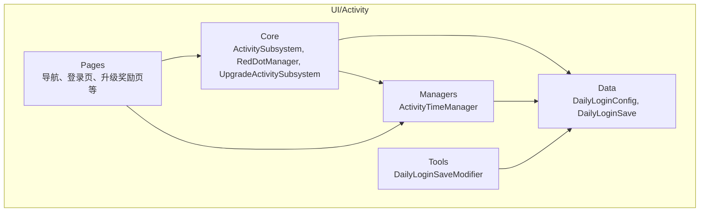
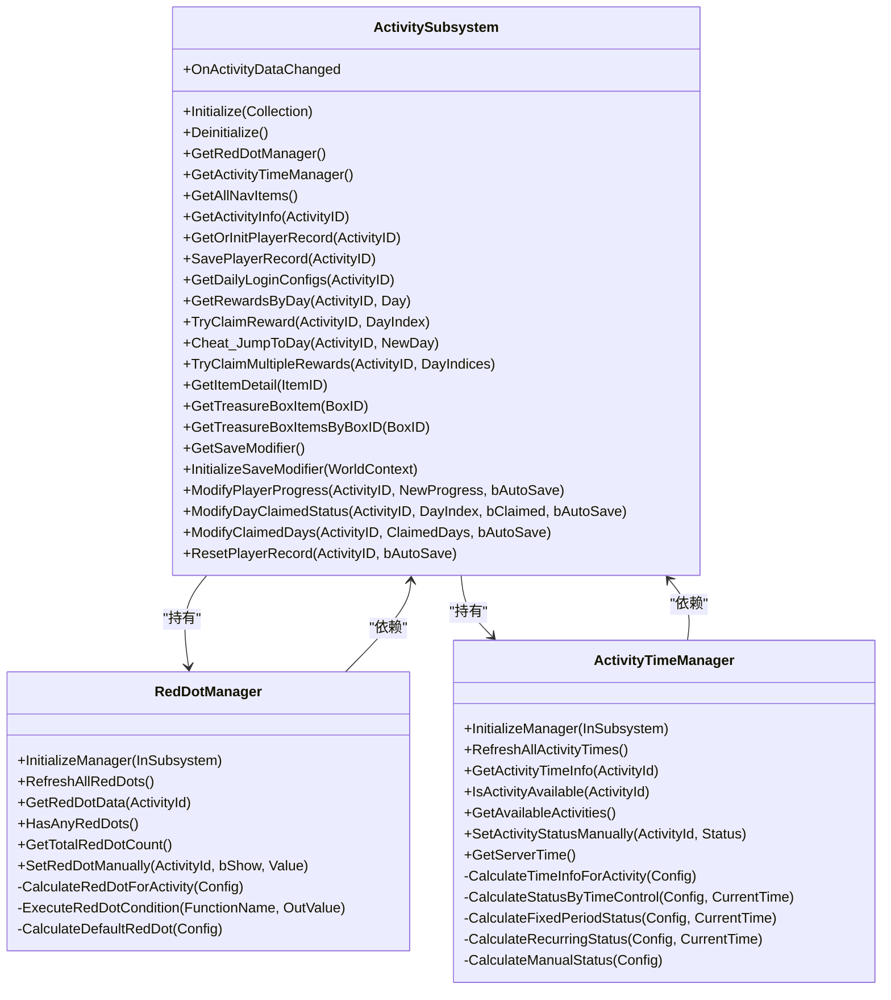
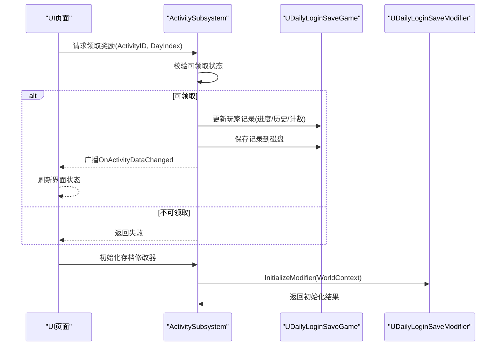
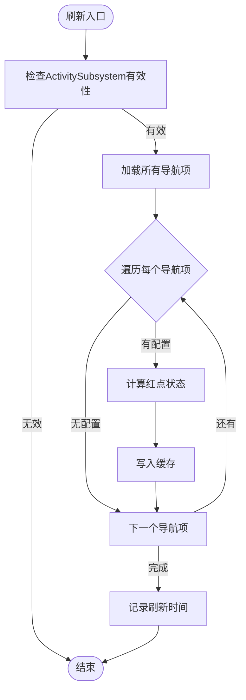
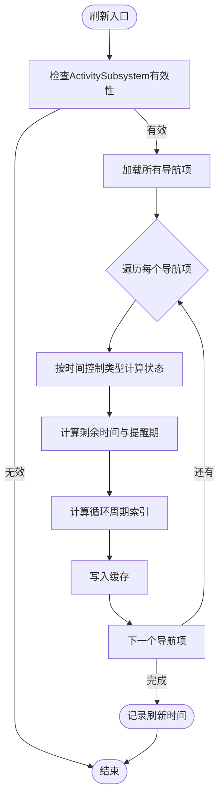
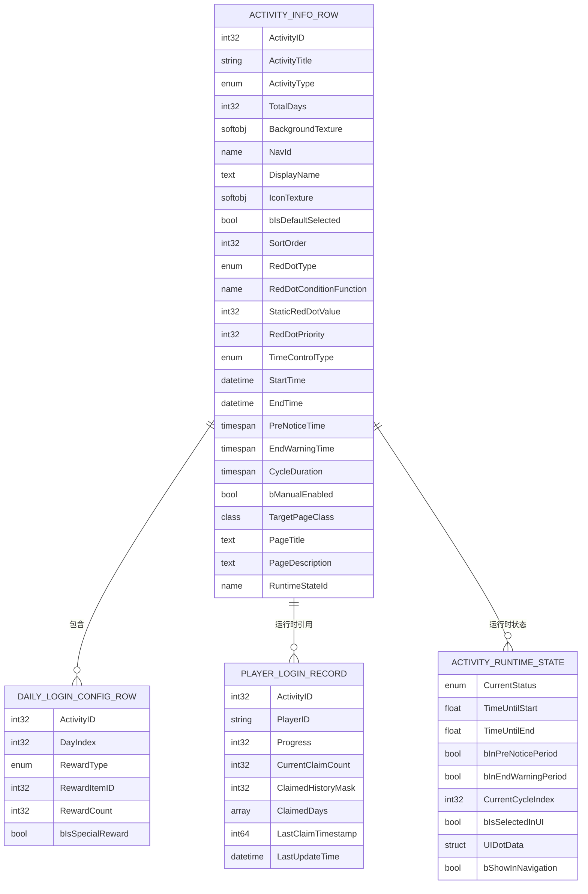
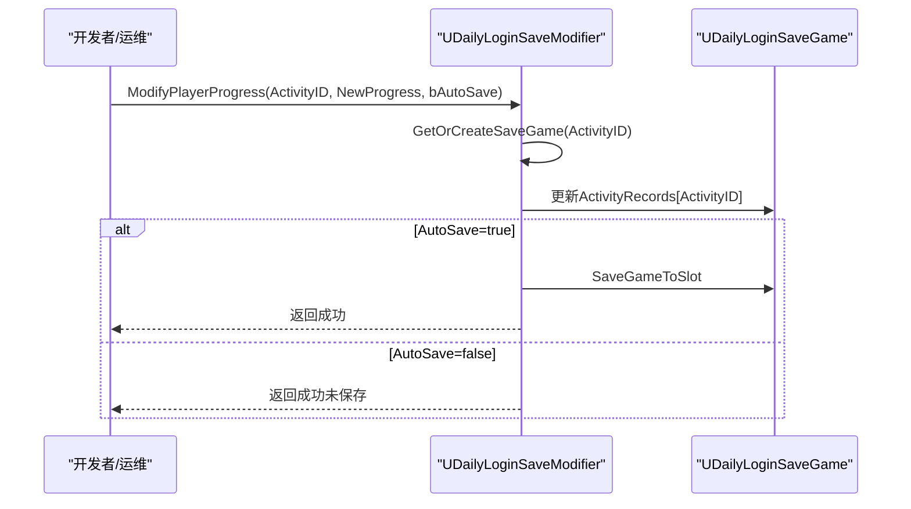
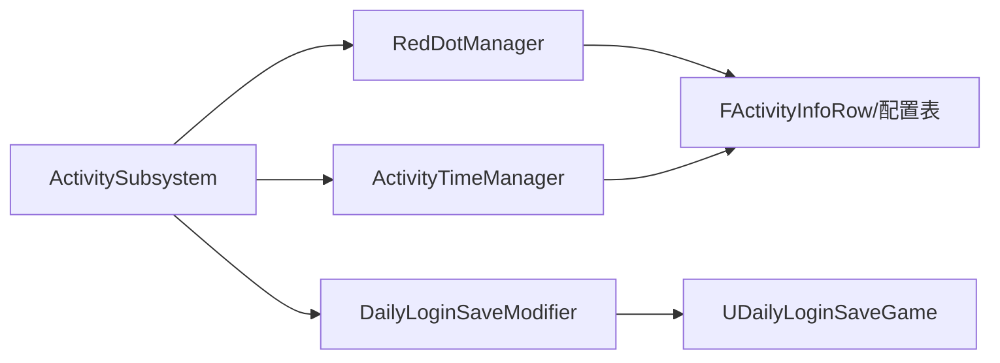

# UI活动系统

<cite>
**本文引用的文件**
- [ActivitySubsystem.h](file://MetalSlug01/Source/MetalSlug01/Public/UI/Activity/Core/ActivitySubsystem.h)
- [ActivitySubsystem.cpp](file://MetalSlug01/Source/MetalSlug01/Private/UI/Activity/Core/ActivitySubsystem.cpp)
- [RedDotManager.h](file://MetalSlug01/Source/MetalSlug01/Public/UI/Activity/Core/RedDotManager.h)
- [RedDotManager.cpp](file://MetalSlug01/Source/MetalSlug01/Private/UI/Activity/Core/RedDotManager.cpp)
- [ActivityTimeManager.h](file://MetalSlug01/Source/MetalSlug01/Public/UI/Activity/Managers/ActivityTimeManager.h)
- [ActivityTimeManager.cpp](file://MetalSlug01/Source/MetalSlug01/Private/UI/Activity/Managers/ActivityTimeManager.cpp)
- [DailyLoginConfig.h](file://MetalSlug01/Source/MetalSlug01/Public/UI/Activity/Data/DailyLoginConfig.h)
- [DailyLoginSave.h](file://MetalSlug01/Source/MetalSlug01/Public/UI/Activity/Data/DailyLoginSave.h)
- [DailyLoginSaveModifier.h](file://MetalSlug01/Source/MetalSlug01/Public/Tools/DailyLoginSaveModifier.h)
- [DailyLoginSaveModifier.cpp](file://MetalSlug01/Source/MetalSlug01/Private/Tools/DailyLoginSaveModifier.cpp)
</cite>

## 目录
1. [简介](#简介)
2. [项目结构](#项目结构)
3. [核心组件](#核心组件)
4. [架构总览](#架构总览)
5. [详细组件分析](#详细组件分析)
6. [依赖分析](#依赖分析)
7. [性能考虑](#性能考虑)
8. [故障排除指南](#故障排除指南)
9. [结论](#结论)
10. [附录](#附录)

## 简介
本技术文档围绕MetalSlug UI活动系统展开，重点解析以下核心子系统与管理器：
- ActivitySubsystem：活动子系统，负责统一管理活动Track、生命周期、数据访问与事件广播。
- RedDotManager：红点管理系统，负责计算与缓存各活动的红点状态，支持动态条件与默认计算。
- ActivityTimeManager：活动时间管理器，负责活动时间状态判断、定时刷新与状态同步。

同时，文档阐述模块化架构、组件协作关系、数据流与事件分发机制，并提供扩展开发指南与API参考，帮助开发者快速添加新活动类型与自定义红点规则。

## 项目结构
UI活动系统位于MetalSlug01工程的UI/Activity目录下，采用“按功能域划分”的组织方式：
- Core：核心子系统与管理器（ActivitySubsystem、RedDotManager、UpgradeActivitySubsystem）
- Managers：管理器（ActivityTimeManager）
- Data：静态配置与动态存档数据结构（DailyLoginConfig、DailyLoginSave）
- Pages：活动页面与UI控件（导航、登录页、升级奖励页等）
- Tools：工具类（DailyLoginSaveModifier）

**图表来源**
- [ActivitySubsystem.h](file://MetalSlug01/Source/MetalSlug01/Public/UI/Activity/Core/ActivitySubsystem.h#L1-L178)
- [ActivityTimeManager.h](file://MetalSlug01/Source/MetalSlug01/Public/UI/Activity/Managers/ActivityTimeManager.h#L1-L117)
- [DailyLoginConfig.h](file://MetalSlug01/Source/MetalSlug01/Public/UI/Activity/Data/DailyLoginConfig.h#L1-L635)
- [DailyLoginSave.h](file://MetalSlug01/Source/MetalSlug01/Public/UI/Activity/Data/DailyLoginSave.h#L1-L373)
- [DailyLoginSaveModifier.h](file://MetalSlug01/Source/MetalSlug01/Public/Tools/DailyLoginSaveModifier.h#L1-L294)

**章节来源**
- [ActivitySubsystem.h](file://MetalSlug01/Source/MetalSlug01/Public/UI/Activity/Core/ActivitySubsystem.h#L1-L178)
- [ActivityTimeManager.h](file://MetalSlug01/Source/MetalSlug01/Public/UI/Activity/Managers/ActivityTimeManager.h#L1-L117)
- [DailyLoginConfig.h](file://MetalSlug01/Source/MetalSlug01/Public/UI/Activity/Data/DailyLoginConfig.h#L1-L635)
- [DailyLoginSave.h](file://MetalSlug01/Source/MetalSlug01/Public/UI/Activity/Data/DailyLoginSave.h#L1-L373)
- [DailyLoginSaveModifier.h](file://MetalSlug01/Source/MetalSlug01/Public/Tools/DailyLoginSaveModifier.h#L1-L294)

## 核心组件
本节概述三大核心组件的职责与关键能力：
- ActivitySubsystem：统一管理活动Track、生命周期；提供导航项查询、活动配置读取、玩家记录存取、事件广播；集成动态存档修改器以支持运行时调试与运维。
- RedDotManager：集中计算与缓存各活动的红点状态，支持条件函数与默认静态值；提供聚合统计与手动覆盖接口。
- ActivityTimeManager：根据时间控制策略（固定周期、循环、永久、手动）计算活动状态与倒计时；提供可用性判断与服务器时间接口。

**章节来源**
- [ActivitySubsystem.h](file://MetalSlug01/Source/MetalSlug01/Public/UI/Activity/Core/ActivitySubsystem.h#L17-L28)
- [RedDotManager.h](file://MetalSlug01/Source/MetalSlug01/Public/UI/Activity/Core/RedDotManager.h#L12-L16)
- [ActivityTimeManager.h](file://MetalSlug01/Source/MetalSlug01/Public/UI/Activity/Managers/ActivityTimeManager.h#L14-L18)

## 架构总览
系统采用“子系统+管理器+数据表”的分层架构：
- 子系统层：ActivitySubsystem作为协调者，持有管理器与存档修改器实例，提供统一API。
- 管理器层：RedDotManager与ActivityTimeManager分别负责红点与时间状态的计算与缓存。
- 数据层：静态配置（DataTable）与动态存档（SaveGame）分离，保证可扩展与持久化。
- UI层：页面与控件通过子系统访问数据与状态，实现低耦合的交互。

**图表来源**
- [ActivitySubsystem.h](file://MetalSlug01/Source/MetalSlug01/Public/UI/Activity/Core/ActivitySubsystem.h#L29-L175)
- [RedDotManager.h](file://MetalSlug01/Source/MetalSlug01/Public/UI/Activity/Core/RedDotManager.h#L16-L99)
- [ActivityTimeManager.h](file://MetalSlug01/Source/MetalSlug01/Public/UI/Activity/Managers/ActivityTimeManager.h#L18-L116)

**章节来源**
- [ActivitySubsystem.cpp](file://MetalSlug01/Source/MetalSlug01/Private/UI/Activity/Core/ActivitySubsystem.cpp#L7-L39)
- [RedDotManager.cpp](file://MetalSlug01/Source/MetalSlug01/Private/UI/Activity/Core/RedDotManager.cpp#L5-L36)
- [ActivityTimeManager.cpp](file://MetalSlug01/Source/MetalSlug01/Private/UI/Activity/Managers/ActivityTimeManager.cpp#L16-L47)

## 详细组件分析

### ActivitySubsystem：活动子系统
职责与能力：
- 生命周期管理：在Initialize中创建并初始化RedDotManager、ActivityTimeManager与DailyLoginSaveModifier；Deinitialize中清理资源。
- 数据访问：提供导航项查询、活动配置读取、玩家记录获取与保存、奖励配置查询、物品与宝箱配置查询。
- 奖励发放：支持单天与批量奖励领取，内置进度推进与状态更新逻辑。
- 事件分发：通过多播委托广播活动数据变更事件，供UI订阅。
- 动态存档修改器：提供统一的运行时修改接口，支持进度、领取状态、批量修改与重置，并自动保存。

**图表来源**
- [ActivitySubsystem.cpp](file://MetalSlug01/Source/MetalSlug01/Private/UI/Activity/Core/ActivitySubsystem.cpp#L247-L298)
- [ActivitySubsystem.cpp](file://MetalSlug01/Source/MetalSlug01/Private/UI/Activity/Core/ActivitySubsystem.cpp#L486-L598)
- [DailyLoginSaveModifier.cpp](file://MetalSlug01/Source/MetalSlug01/Private/Tools/DailyLoginSaveModifier.cpp#L60-L97)

**章节来源**
- [ActivitySubsystem.h](file://MetalSlug01/Source/MetalSlug01/Public/UI/Activity/Core/ActivitySubsystem.h#L34-L175)
- [ActivitySubsystem.cpp](file://MetalSlug01/Source/MetalSlug01/Private/UI/Activity/Core/ActivitySubsystem.cpp#L7-L39)
- [ActivitySubsystem.cpp](file://MetalSlug01/Source/MetalSlug01/Private/UI/Activity/Core/ActivitySubsystem.cpp#L101-L161)
- [ActivitySubsystem.cpp](file://MetalSlug01/Source/MetalSlug01/Private/UI/Activity/Core/ActivitySubsystem.cpp#L163-L245)
- [ActivitySubsystem.cpp](file://MetalSlug01/Source/MetalSlug01/Private/UI/Activity/Core/ActivitySubsystem.cpp#L247-L336)
- [ActivitySubsystem.cpp](file://MetalSlug01/Source/MetalSlug01/Private/UI/Activity/Core/ActivitySubsystem.cpp#L338-L475)
- [ActivitySubsystem.cpp](file://MetalSlug01/Source/MetalSlug01/Private/UI/Activity/Core/ActivitySubsystem.cpp#L486-L598)

### RedDotManager：红点管理系统
职责与能力：
- 初始化：绑定ActivitySubsystem，记录上次刷新时间并立即刷新。
- 状态计算：遍历导航项，优先执行配置的条件函数，否则回退到默认静态值计算。
- 缓存与查询：以ActivityID为键缓存FRedDotData，提供聚合统计（HasAnyRedDots、GetTotalRedDotCount）与手动覆盖接口。
- 条件函数：预留反射或委托调用机制，支持按需扩展自定义红点逻辑。

**图表来源**
- [RedDotManager.cpp](file://MetalSlug01/Source/MetalSlug01/Private/UI/Activity/Core/RedDotManager.cpp#L12-L36)
- [RedDotManager.cpp](file://MetalSlug01/Source/MetalSlug01/Private/UI/Activity/Core/RedDotManager.cpp#L91-L117)

**章节来源**
- [RedDotManager.h](file://MetalSlug01/Source/MetalSlug01/Public/UI/Activity/Core/RedDotManager.h#L16-L99)
- [RedDotManager.cpp](file://MetalSlug01/Source/MetalSlug01/Private/UI/Activity/Core/RedDotManager.cpp#L5-L36)
- [RedDotManager.cpp](file://MetalSlug01/Source/MetalSlug01/Private/UI/Activity/Core/RedDotManager.cpp#L91-L160)

### ActivityTimeManager：活动时间管理器
职责与能力：
- 初始化：绑定ActivitySubsystem，记录刷新时间并立即刷新。
- 时间状态计算：根据时间控制类型（固定周期、循环、手动、永久）计算当前状态、距离开始/结束的剩余时间、是否处于预告/结束提醒期、当前周期索引。
- 可用性判断：提供活动是否可用（进行中或即将开始且处于预告期）的判断与可用活动列表查询。
- 手动控制：支持手动设置活动状态，便于紧急维护。
- 服务器时间：提供获取服务器时间的接口（当前示例使用本地时间）。

**图表来源**
- [ActivityTimeManager.cpp](file://MetalSlug01/Source/MetalSlug01/Private/UI/Activity/Managers/ActivityTimeManager.cpp#L23-L47)
- [ActivityTimeManager.cpp](file://MetalSlug01/Source/MetalSlug01/Private/UI/Activity/Managers/ActivityTimeManager.cpp#L101-L160)
- [ActivityTimeManager.cpp](file://MetalSlug01/Source/MetalSlug01/Private/UI/Activity/Managers/ActivityTimeManager.cpp#L162-L235)

**章节来源**
- [ActivityTimeManager.h](file://MetalSlug01/Source/MetalSlug01/Public/UI/Activity/Managers/ActivityTimeManager.h#L18-L116)
- [ActivityTimeManager.cpp](file://MetalSlug01/Source/MetalSlug01/Private/UI/Activity/Managers/ActivityTimeManager.cpp#L16-L47)
- [ActivityTimeManager.cpp](file://MetalSlug01/Source/MetalSlug01/Private/UI/Activity/Managers/ActivityTimeManager.cpp#L101-L235)

### 数据模型与配置
- 静态配置：FActivityInfoRow、FDailyLoginConfigRow、FItemDetailRow、FTreasureBoxItemRow等，统一存放于DailyLoginConfig.h，支持活动元信息、导航配置、红点配置、时间控制、页面路由等。
- 动态存档：FPlayerLoginRecord、FActivityRuntimeState、UDailyLoginSaveGame等，统一存放于DailyLoginSave.h，支持玩家进度、运行时状态与导航项缓存。
- 枚举体系：EActivityType、EActivityStatus、ETimeControlType、ERedDotType、ELoginRewardType、EGameModeType、ETaskType、ERewardState等，支撑活动类型、状态、时间控制、红点类型、奖励类型等。

**图表来源**
- [DailyLoginConfig.h](file://MetalSlug01/Source/MetalSlug01/Public/UI/Activity/Data/DailyLoginConfig.h#L249-L420)
- [DailyLoginConfig.h](file://MetalSlug01/Source/MetalSlug01/Public/UI/Activity/Data/DailyLoginConfig.h#L196-L242)
- [DailyLoginSave.h](file://MetalSlug01/Source/MetalSlug01/Public/UI/Activity/Data/DailyLoginSave.h#L85-L161)
- [DailyLoginSave.h](file://MetalSlug01/Source/MetalSlug01/Public/UI/Activity/Data/DailyLoginSave.h#L27-L78)

**章节来源**
- [DailyLoginConfig.h](file://MetalSlug01/Source/MetalSlug01/Public/UI/Activity/Data/DailyLoginConfig.h#L1-L635)
- [DailyLoginSave.h](file://MetalSlug01/Source/MetalSlug01/Public/UI/Activity/Data/DailyLoginSave.h#L1-L373)

### 动态存档修改器：运行时数据修改与持久化
职责与能力：
- 生命周期：支持初始化与销毁，注册/注销控制台命令。
- 数据修改：支持修改玩家进度、某天领取状态、批量修改已领取天数、当前领取次数与重置记录。
- 查询接口：提供进度、已领取天数、某天领取状态、当前领取次数查询。
- 历史记录：记录每次修改的详细信息（字段名、原值、新值、时间、是否已保存），并限制最大历史条目。
- 保存接口：支持保存单个活动记录或全部记录，自动标记历史记录为已保存。

**图表来源**
- [DailyLoginSaveModifier.cpp](file://MetalSlug01/Source/MetalSlug01/Private/Tools/DailyLoginSaveModifier.cpp#L60-L97)
- [DailyLoginSaveModifier.cpp](file://MetalSlug01/Source/MetalSlug01/Private/Tools/DailyLoginSaveModifier.cpp#L400-L430)

**章节来源**
- [DailyLoginSaveModifier.h](file://MetalSlug01/Source/MetalSlug01/Public/Tools/DailyLoginSaveModifier.h#L72-L294)
- [DailyLoginSaveModifier.cpp](file://MetalSlug01/Source/MetalSlug01/Private/Tools/DailyLoginSaveModifier.cpp#L27-L58)
- [DailyLoginSaveModifier.cpp](file://MetalSlug01/Source/MetalSlug01/Private/Tools/DailyLoginSaveModifier.cpp#L60-L307)
- [DailyLoginSaveModifier.cpp](file://MetalSlug01/Source/MetalSlug01/Private/Tools/DailyLoginSaveModifier.cpp#L400-L457)
- [DailyLoginSaveModifier.cpp](file://MetalSlug01/Source/MetalSlug01/Private/Tools/DailyLoginSaveModifier.cpp#L559-L664)

## 依赖分析
- 组件耦合：
  - ActivitySubsystem持有RedDotManager与ActivityTimeManager，形成“协调者”角色。
  - RedDotManager与ActivityTimeManager均依赖ActivitySubsystem提供的导航项与配置数据。
  - DailyLoginSaveModifier与ActivitySubsystem配合，通过委托广播事件驱动UI刷新。
- 数据依赖：
  - 静态配置来源于DataTable（FActivityInfoRow、FDailyLoginConfigRow等）。
  - 动态存档来源于UDailyLoginSaveGame，持久化玩家进度与运行时状态。
- 外部依赖：
  - GameplayStatics用于加载/保存存档。
  - 控制台命令用于运行时调试与运维。

**图表来源**
- [ActivitySubsystem.h](file://MetalSlug01/Source/MetalSlug01/Public/UI/Activity/Core/ActivitySubsystem.h#L14-L163)
- [RedDotManager.h](file://MetalSlug01/Source/MetalSlug01/Public/UI/Activity/Core/RedDotManager.h#L74-L79)
- [ActivityTimeManager.h](file://MetalSlug01/Source/MetalSlug01/Public/UI/Activity/Managers/ActivityTimeManager.h#L77-L82)
- [DailyLoginSaveModifier.h](file://MetalSlug01/Source/MetalSlug01/Public/Tools/DailyLoginSaveModifier.h#L230-L240)

**章节来源**
- [ActivitySubsystem.cpp](file://MetalSlug01/Source/MetalSlug01/Private/UI/Activity/Core/ActivitySubsystem.cpp#L11-L19)
- [RedDotManager.cpp](file://MetalSlug01/Source/MetalSlug01/Private/UI/Activity/Core/RedDotManager.cpp#L5-L9)
- [ActivityTimeManager.cpp](file://MetalSlug01/Source/MetalSlug01/Private/UI/Activity/Managers/ActivityTimeManager.cpp#L11-L13)
- [DailyLoginSaveModifier.cpp](file://MetalSlug01/Source/MetalSlug01/Private/Tools/DailyLoginSaveModifier.cpp#L11-L14)

## 性能考虑
- 缓存策略：RedDotManager与ActivityTimeManager均采用缓存（TMap）存储计算结果，减少重复计算与DataTable访问开销。
- 刷新频率：ActivityTimeManager暴露刷新间隔配置（RefreshInterval），建议根据实际需求调整，避免频繁刷新导致CPU占用上升。
- 存档I/O：存档修改器支持自动保存与批量保存，建议在批量修改时关闭自动保存，在合适时机统一SaveAllRecords，降低磁盘写入压力。
- UI事件：ActivitySubsystem通过多播委托广播数据变更，建议UI侧仅订阅必要事件，避免过度刷新。

[本节为通用指导，无需特定文件分析]

## 故障排除指南
- 红点不刷新：确认RedDotManager已初始化并调用RefreshAllRedDots；检查导航项配置是否正确；查看日志输出定位问题。
- 时间状态异常：确认ActivityTimeManager已初始化；检查时间控制类型与配置时间字段；验证服务器时间接口返回值。
- 奖励领取失败：检查玩家记录是否存在与可领取范围；确认领取状态未被篡改；查看日志输出定位失败原因。
- 存档修改无效：确认DailyLoginSaveModifier已初始化；检查AutoSave参数；验证SaveGameToSlot返回值；查看历史记录是否标记为已保存。

**章节来源**
- [RedDotManager.cpp](file://MetalSlug01/Source/MetalSlug01/Private/UI/Activity/Core/RedDotManager.cpp#L12-L36)
- [ActivityTimeManager.cpp](file://MetalSlug01/Source/MetalSlug01/Private/UI/Activity/Managers/ActivityTimeManager.cpp#L23-L47)
- [ActivitySubsystem.cpp](file://MetalSlug01/Source/MetalSlug01/Private/UI/Activity/Core/ActivitySubsystem.cpp#L247-L298)
- [DailyLoginSaveModifier.cpp](file://MetalSlug01/Source/MetalSlug01/Private/Tools/DailyLoginSaveModifier.cpp#L400-L430)

## 结论
MetalSlug UI活动系统通过ActivitySubsystem统一协调RedDotManager与ActivityTimeManager，结合静态配置与动态存档，实现了活动生命周期管理、状态同步与事件分发的模块化架构。系统具备良好的扩展性与可维护性，支持通过DataTable配置与运行时修改器进行灵活扩展与运维。

[本节为总结性内容，无需特定文件分析]

## 附录

### API参考与使用示例（路径指引）
- ActivitySubsystem
  - 生命周期与管理器访问：[Initialize/Deinitialize/GetRedDotManager/GetActivityTimeManager](file://MetalSlug01/Source/MetalSlug01/Private/UI/Activity/Core/ActivitySubsystem.cpp#L7-L39)
  - 导航项与活动配置：[GetAllNavItems/GetActivityInfo](file://MetalSlug01/Source/MetalSlug01/Private/UI/Activity/Core/ActivitySubsystem.cpp#L51-L99)
  - 玩家记录与奖励：[GetOrInitPlayerRecord/SavePlayerRecord/TryClaimReward/Cheat_JumpToDay/TryClaimMultipleRewards](file://MetalSlug01/Source/MetalSlug01/Private/UI/Activity/Core/ActivitySubsystem.cpp#L101-L161)
  - 奖励配置与物品查询：[GetDailyLoginConfigs/GetRewardsByDay/GetItemDetail/GetTreasureBoxItem/GetTreasureBoxItemsByBoxID](file://MetalSlug01/Source/MetalSlug01/Private/UI/Activity/Core/ActivitySubsystem.cpp#L163-L245)
  - 动态存档修改器接口：[GetSaveModifier/InitializeSaveModifier/ModifyPlayerProgress/ModifyDayClaimedStatus/ModifyClaimedDays/ResetPlayerRecord](file://MetalSlug01/Source/MetalSlug01/Private/UI/Activity/Core/ActivitySubsystem.cpp#L486-L598)
  - 事件广播：[OnActivityDataChanged](file://MetalSlug01/Source/MetalSlug01/Public/UI/Activity/Core/ActivitySubsystem.h#L149-L152)

- RedDotManager
  - 初始化与刷新：[InitializeManager/RefreshAllRedDots](file://MetalSlug01/Source/MetalSlug01/Private/UI/Activity/Core/RedDotManager.cpp#L5-L36)
  - 红点查询与统计：[GetRedDotData/HasAnyRedDots/GetTotalRedDotCount](file://MetalSlug01/Source/MetalSlug01/Private/UI/Activity/Core/RedDotManager.cpp#L38-L74)
  - 手动覆盖：[SetRedDotManually](file://MetalSlug01/Source/MetalSlug01/Private/UI/Activity/Core/RedDotManager.cpp#L76-L89)
  - 计算逻辑：[CalculateRedDotForActivity/ExecuteRedDotCondition/CalculateDefaultRedDot](file://MetalSlug01/Source/MetalSlug01/Private/UI/Activity/Core/RedDotManager.cpp#L91-L160)

- ActivityTimeManager
  - 初始化与刷新：[InitializeManager/RefreshAllActivityTimes](file://MetalSlug01/Source/MetalSlug01/Private/UI/Activity/Managers/ActivityTimeManager.cpp#L16-L47)
  - 时间信息查询：[GetActivityTimeInfo/IsActivityAvailable/GetAvailableActivities](file://MetalSlug01/Source/MetalSlug01/Private/UI/Activity/Managers/ActivityTimeManager.cpp#L49-L82)
  - 手动控制与服务器时间：[SetActivityStatusManually/GetServerTime](file://MetalSlug01/Source/MetalSlug01/Private/UI/Activity/Managers/ActivityTimeManager.cpp#L84-L99)
  - 计算逻辑：[CalculateTimeInfoForActivity/CalculateStatusByTimeControl/CalculateFixedPeriodStatus/CalculateRecurringStatus/CalculateManualStatus](file://MetalSlug01/Source/MetalSlug01/Private/UI/Activity/Managers/ActivityTimeManager.cpp#L101-L235)

- DailyLoginSaveModifier
  - 初始化与销毁：[InitializeModifier/DestroyModifier](file://MetalSlug01/Source/MetalSlug01/Private/Tools/DailyLoginSaveModifier.cpp#L27-L58)
  - 数据修改：[ModifyPlayerProgress/ModifyDayClaimedStatus/ModifyClaimedDays/ModifyCurrentClaimCount/ResetPlayerRecord](file://MetalSlug01/Source/MetalSlug01/Private/Tools/DailyLoginSaveModifier.cpp#L60-L307)
  - 查询接口：[GetPlayerProgress/GetClaimedDays/IsDayClaimed/GetCurrentClaimCount](file://MetalSlug01/Source/MetalSlug01/Private/Tools/DailyLoginSaveModifier.cpp#L311-L375)
  - 历史记录与保存：[GetModificationHistory/ClearModificationHistory/SaveActivityRecord/SaveAllRecords/LoadActivityRecord](file://MetalSlug01/Source/MetalSlug01/Private/Tools/DailyLoginSaveModifier.cpp#L379-L483)
  - 控制台命令：[RegisterConsoleCommands/UnregisterConsoleCommands](file://MetalSlug01/Source/MetalSlug01/Private/Tools/DailyLoginSaveModifier.cpp#L559-L664)

### 扩展开发指南
- 添加新活动类型
  - 在FActivityInfoRow中完善活动元信息与导航配置字段。
  - 在DataTable中新增活动配置行，设置ActivityType、页面路由与UI资源。
  - 如需特殊红点逻辑，配置RedDotConditionFunction并在RedDotManager中实现对应条件函数。
  - 如需时间控制，设置TimeControlType及相关时间字段，必要时扩展状态计算逻辑。

- 自定义红点规则
  - 若使用条件函数：在FActivityInfoRow中设置RedDotConditionFunction，然后在RedDotManager的条件函数执行器中实现对应逻辑。
  - 若使用静态值：设置StaticRedDotValue与RedDotType，RedDotManager将采用默认计算逻辑。
  - 手动覆盖：通过SetRedDotManually进行测试或紧急覆盖。

- 时间状态判断与定时器管理
  - 根据TimeControlType选择固定周期、循环、手动或永久策略。
  - 调整RefreshInterval以平衡刷新频率与性能。
  - 使用GetAvailableActivities与IsActivityAvailable进行UI可用性判断。

- 数据持久化与运维
  - 使用DailyLoginSaveModifier进行运行时修改与批量操作。
  - 合理使用AutoSave参数，批量修改后统一SaveAllRecords。
  - 通过控制台命令进行快速调试与数据恢复。

[本节为通用指导，无需特定文件分析]