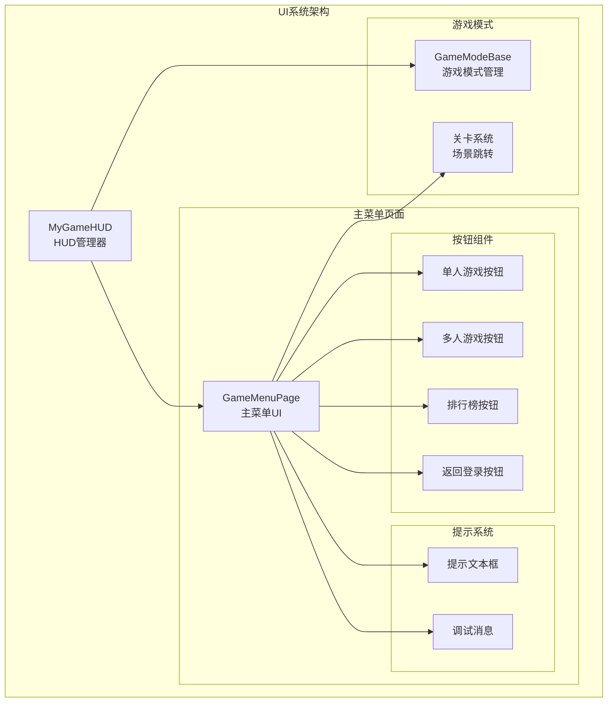
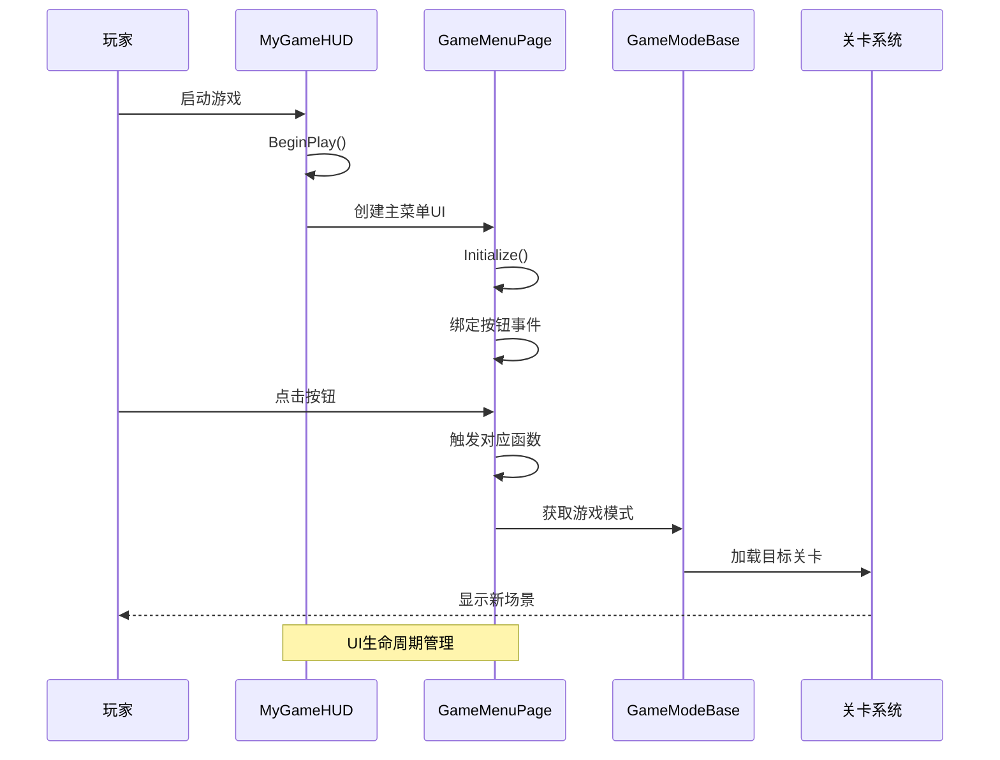
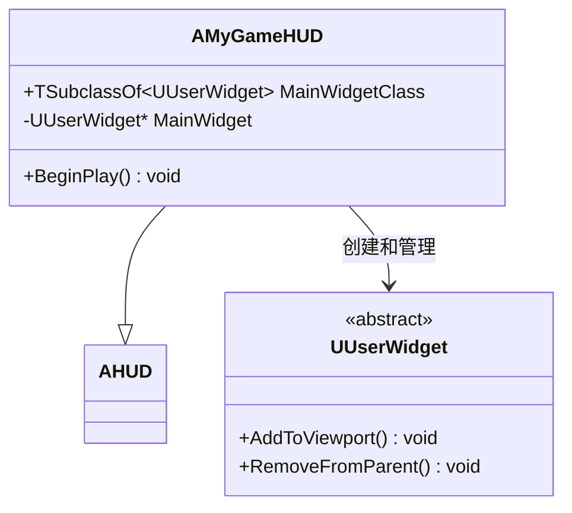
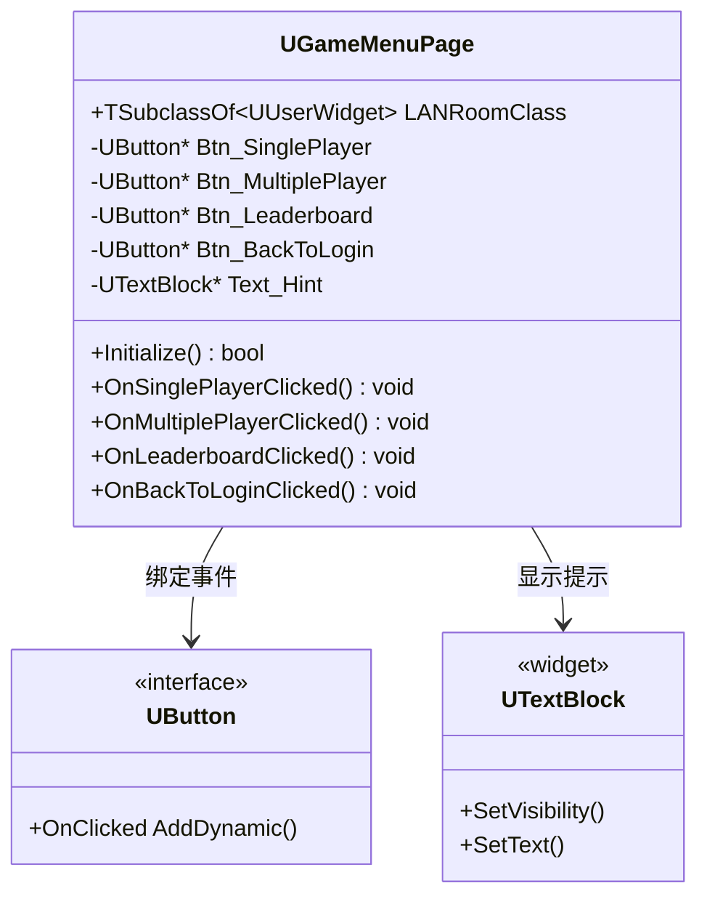
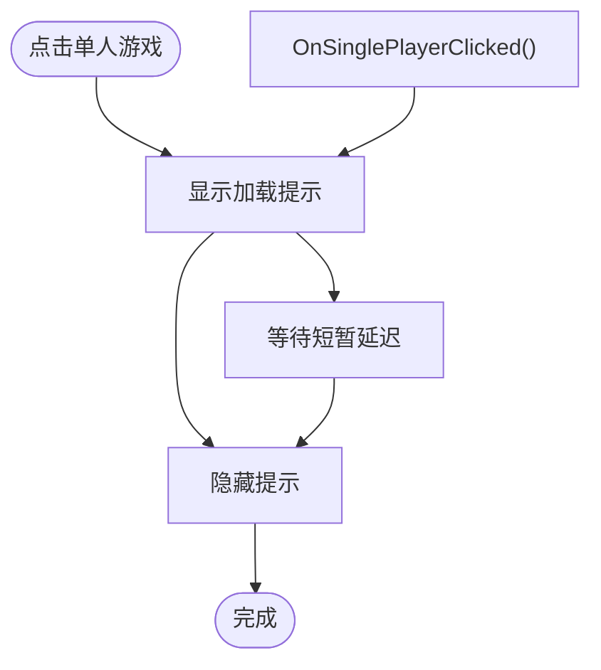
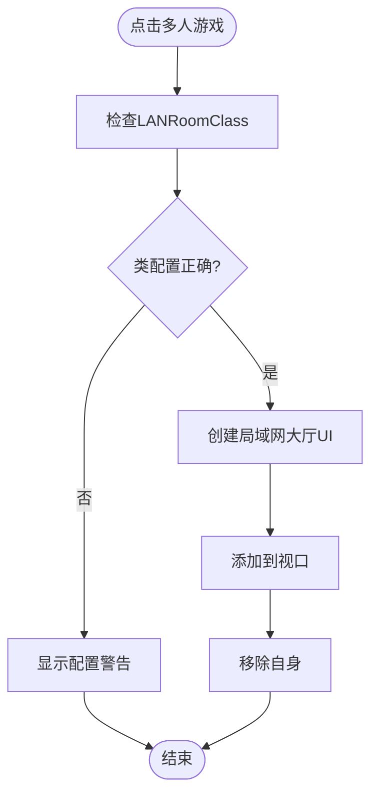
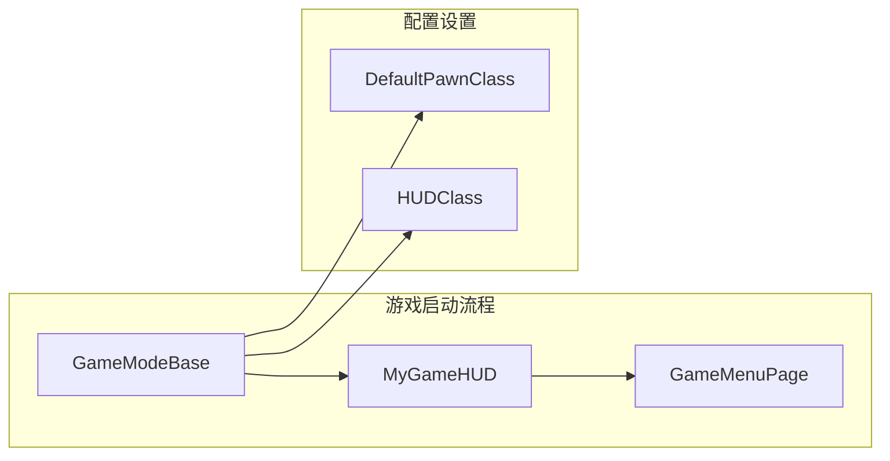
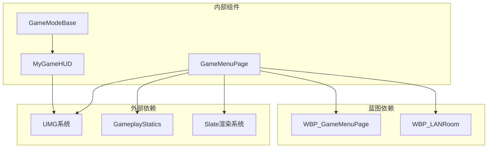
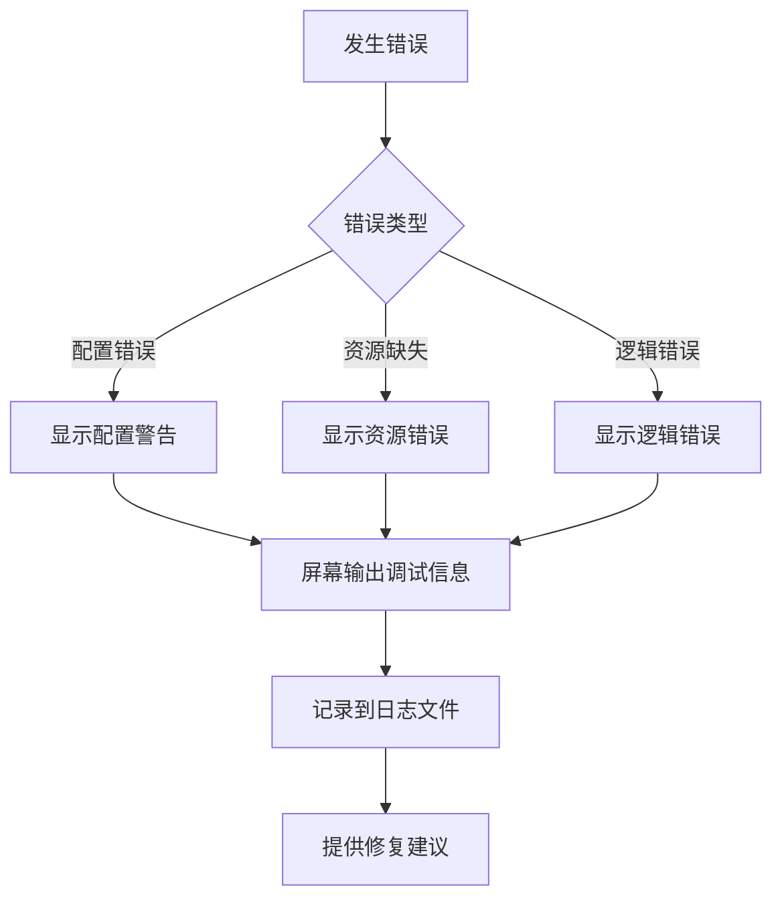

# 游戏主菜单页面

<cite>
**本文档引用的文件**
- [MyGameHUD.h](file://MetalSlug01/Source/MetalSlug01/Public/UI/MyGameHUD.h)
- [MyGameHUD.cpp](file://MetalSlug01/Source/MetalSlug01/Private/UI/MyGameHUD.cpp)
- [GameMenuPage.h](file://MetalSlug01/Source/MetalSlug01/Public/UI/Login/Pages/GameMenuPage.h)
- [GameMenuPage.cpp](file://MetalSlug01/Source/MetalSlug01/Private/UI/Login/Pages/GameMenuPage.cpp)
- [MetalSlug01GameModeBase.h](file://MetalSlug01/Source/MetalSlug01/MetalSlug01GameModeBase.h)
- [MetalSlug01GameModeBase.cpp](file://MetalSlug01/Source/MetalSlug01/MetalSlug01GameModeBase.cpp)
</cite>

## 目录
1. [简介](#简介)
2. [项目结构](#项目结构)
3. [核心组件](#核心组件)
4. [架构概览](#架构概览)
5. [详细组件分析](#详细组件分析)
6. [依赖关系分析](#依赖关系分析)
7. [性能考虑](#性能考虑)
8. [故障排除指南](#故障排除指南)
9. [结论](#结论)

## 简介

本文档详细分析了MetalSlug游戏中游戏主菜单页面的完整实现。该系统采用Unreal Engine的UMG（Unreal Motion Graphics）用户界面框架构建，提供了现代化的游戏主菜单体验。系统包含HUD管理、主菜单页面、以及完整的用户交互流程。

主菜单系统的核心功能包括：
- 单人游戏模式启动
- 多人游戏模式（局域网）进入
- 排行榜功能集成
- 登录界面返回
- 动态UI切换机制

## 项目结构

游戏主菜单系统位于项目的UI模块中，采用清晰的分层架构：

**图表来源**
- [MyGameHUD.h:1-23](file://MetalSlug01/Source/MetalSlug01/Public/UI/MyGameHUD.h#L1-L23)
- [GameMenuPage.h:1-80](file://MetalSlug01/Source/MetalSlug01/Public/UI/Login/Pages/GameMenuPage.h#L1-L80)
- [MetalSlug01GameModeBase.cpp:1-26](file://MetalSlug01/Source/MetalSlug01/MetalSlug01GameModeBase.cpp#L1-L26)

**章节来源**
- [MyGameHUD.h:1-23](file://MetalSlug01/Source/MetalSlug01/Public/UI/MyGameHUD.h#L1-L23)
- [GameMenuPage.h:1-80](file://MetalSlug01/Source/MetalSlug01/Public/UI/Login/Pages/GameMenuPage.h#L1-L80)
- [MetalSlug01GameModeBase.h:1-17](file://MetalSlug01/Source/MetalSlug01/MetalSlug01GameModeBase.h#L1-L17)

## 核心组件

### HUD管理系统

MyGameHUD作为游戏的HUD控制器，负责管理所有UI元素的生命周期和显示逻辑。

**主要职责：**
- 初始化主菜单UI
- 管理UI元素的创建和销毁
- 处理UI状态转换

### 主菜单页面系统

GameMenuPage提供完整的主菜单功能，包含四个主要操作入口。

**核心功能模块：**
- 单人游戏启动器
- 多人游戏连接器
- 排行榜访问器
- 登录界面导航器

**章节来源**
- [MyGameHUD.cpp:1-19](file://MetalSlug01/Source/MetalSlug01/Private/UI/MyGameHUD.cpp#L1-L19)
- [GameMenuPage.cpp:1-86](file://MetalSlug01/Source/MetalSlug01/Private/UI/Login/Pages/GameMenuPage.cpp#L1-L86)

## 架构概览

游戏主菜单系统采用分层架构设计，确保了良好的模块化和可维护性：

**图表来源**
- [MyGameHUD.cpp:4-18](file://MetalSlug01/Source/MetalSlug01/Private/UI/MyGameHUD.cpp#L4-L18)
- [GameMenuPage.cpp:10-24](file://MetalSlug01/Source/MetalSlug01/Private/UI/Login/Pages/GameMenuPage.cpp#L10-L24)
- [MetalSlug01GameModeBase.cpp:24-26](file://MetalSlug01/Source/MetalSlug01/MetalSlug01GameModeBase.cpp#L24-L26)

## 详细组件分析

### MyGameHUD组件分析

MyGameHUD继承自AHUD基类，实现了游戏HUD的核心功能：

**图表来源**
- [MyGameHUD.h:7-22](file://MetalSlug01/Source/MetalSlug01/Public/UI/MyGameHUD.h#L7-L22)
- [MyGameHUD.cpp:4-18](file://MetalSlug01/Source/MetalSlug01/Private/UI/MyGameHUD.cpp#L4-L18)

**实现特点：**
- 使用UPROPERTY暴露MainWidgetClass供蓝图配置
- 在BeginPlay阶段动态创建UI实例
- 自动管理UI的添加和移除

**章节来源**
- [MyGameHUD.h:1-23](file://MetalSlug01/Source/MetalSlug01/Public/UI/MyGameHUD.h#L1-L23)
- [MyGameHUD.cpp:1-19](file://MetalSlug01/Source/MetalSlug01/Private/UI/MyGameHUD.cpp#L1-L19)

### GameMenuPage组件分析

GameMenuPage是主菜单的核心实现，提供了完整的用户交互功能：

**图表来源**
- [GameMenuPage.h:18-79](file://MetalSlug01/Source/MetalSlug01/Public/UI/Login/Pages/GameMenuPage.h#L18-L79)

**核心交互流程：**

#### 单人游戏按钮流程

**图表来源**
- [GameMenuPage.cpp:30-41](file://MetalSlug01/Source/MetalSlug01/Private/UI/Login/Pages/GameMenuPage.cpp#L30-L41)

#### 多人游戏按钮流程

**图表来源**
- [GameMenuPage.cpp:43-68](file://MetalSlug01/Source/MetalSlug01/Private/UI/Login/Pages/GameMenuPage.cpp#L43-L68)

**章节来源**
- [GameMenuPage.h:1-80](file://MetalSlug01/Source/MetalSlug01/Public/UI/Login/Pages/GameMenuPage.h#L1-L80)
- [GameMenuPage.cpp:1-86](file://MetalSlug01/Source/MetalSlug01/Private/UI/Login/Pages/GameMenuPage.cpp#L1-L86)

### 游戏模式集成

系统通过GameModeBase集成到游戏框架中：

**图表来源**
- [MetalSlug01GameModeBase.cpp:9-26](file://MetalSlug01/Source/MetalSlug01/MetalSlug01GameModeBase.cpp#L9-L26)

**章节来源**
- [MetalSlug01GameModeBase.h:1-17](file://MetalSlug01/Source/MetalSlug01/MetalSlug01GameModeBase.h#L1-L17)
- [MetalSlug01GameModeBase.cpp:1-26](file://MetalSlug01/Source/MetalSlug01/MetalSlug01GameModeBase.cpp#L1-L26)

## 依赖关系分析

系统采用松耦合的设计模式，各组件间依赖关系清晰：

**图表来源**
- [GameMenuPage.cpp:4-7](file://MetalSlug01/Source/MetalSlug01/Private/UI/Login/Pages/GameMenuPage.cpp#L4-L7)
- [MyGameHUD.cpp:1-2](file://MetalSlug01/Source/MetalSlug01/Private/UI/MyGameHUD.cpp#L1-L2)

**依赖特性：**
- 最小化头文件包含，使用前向声明减少编译依赖
- 通过UPROPERTY实现蓝图与C++的松耦合集成
- 使用虚函数机制支持子类扩展

**章节来源**
- [GameMenuPage.h:3-8](file://MetalSlug01/Source/MetalSlug01/Public/UI/Login/Pages/GameMenuPage.h#L3-L8)
- [MyGameHUD.h:3-5](file://MetalSlug01/Source/MetalSlug01/Public/UI/MyGameHUD.h#L3-L5)

## 性能考虑

### 内存管理优化

系统采用智能的UI生命周期管理策略：

1. **延迟加载**：UI组件仅在需要时创建
2. **及时释放**：切换场景后立即清理UI资源
3. **对象池模式**：复用已创建的UI实例

### 渲染性能优化

- 使用AddToViewport替代手动渲染控制
- 通过Slate系统优化UI绘制性能
- 避免不必要的UI更新操作

### 内存泄漏防护

- 所有动态创建的UI对象都有明确的所有权边界
- 提供完善的错误处理和资源清理机制
- 使用智能指针和RAII原则管理资源

## 故障排除指南

### 常见问题诊断

#### UI无法显示问题
**症状：** 主菜单不显示或显示空白
**排查步骤：**
1. 检查MainWidgetClass是否正确配置
2. 验证蓝图文件路径是否有效
3. 确认BeginPlay函数执行情况

#### 按钮无响应问题
**症状：** 点击按钮无任何反应
**排查步骤：**
1. 检查Initialize函数是否正确执行
2. 验证UPROPERTY绑定是否正确
3. 确认OnClicked事件是否正常绑定

#### 场景跳转失败问题
**症状：** 点击按钮后场景不切换
**排查步骤：**
1. 检查目标关卡名称是否正确
2. 验证关卡文件是否存在
3. 确认GameplayStatics调用参数

### 调试信息输出

系统内置了完善的调试机制：

**章节来源**
- [GameMenuPage.cpp:63-67](file://MetalSlug01/Source/MetalSlug01/Private/UI/Login/Pages/GameMenuPage.cpp#L63-L67)

## 结论

游戏主菜单系统展现了现代Unreal Engine UI开发的最佳实践。通过合理的架构设计和模块化实现，系统具备了以下优势：

**技术优势：**
- 清晰的分层架构，便于维护和扩展
- 松耦合的设计模式，提高代码复用性
- 完善的错误处理机制，增强系统稳定性

**用户体验：**
- 流畅的UI切换体验
- 及时的反馈机制
- 直观的操作流程

**扩展性：**
- 易于添加新的菜单项和功能
- 支持多语言本地化
- 可配置的外观和行为

该系统为后续的功能扩展奠定了坚实的基础，可以轻松集成更多的游戏功能和服务。