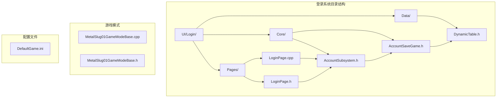
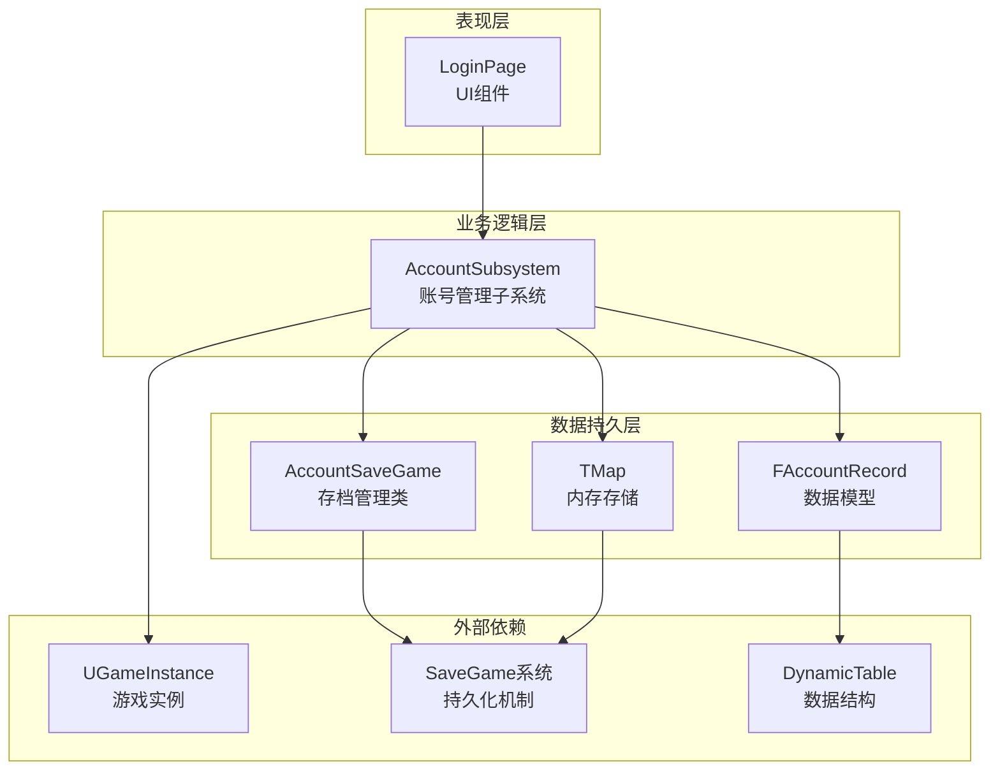
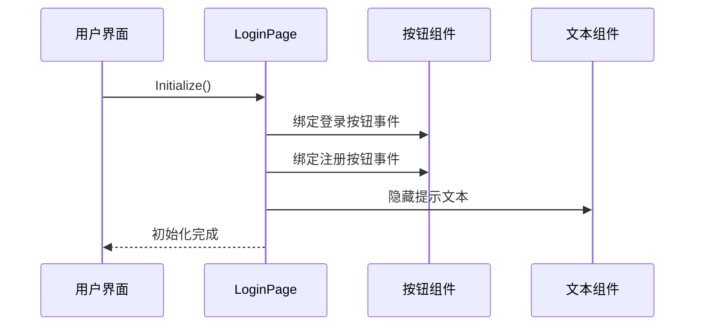
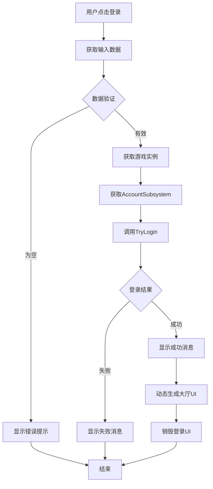
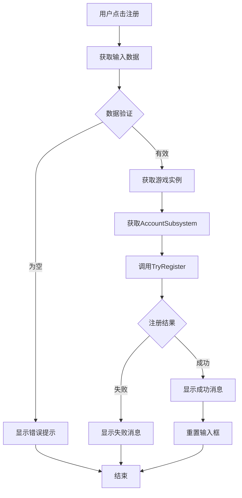
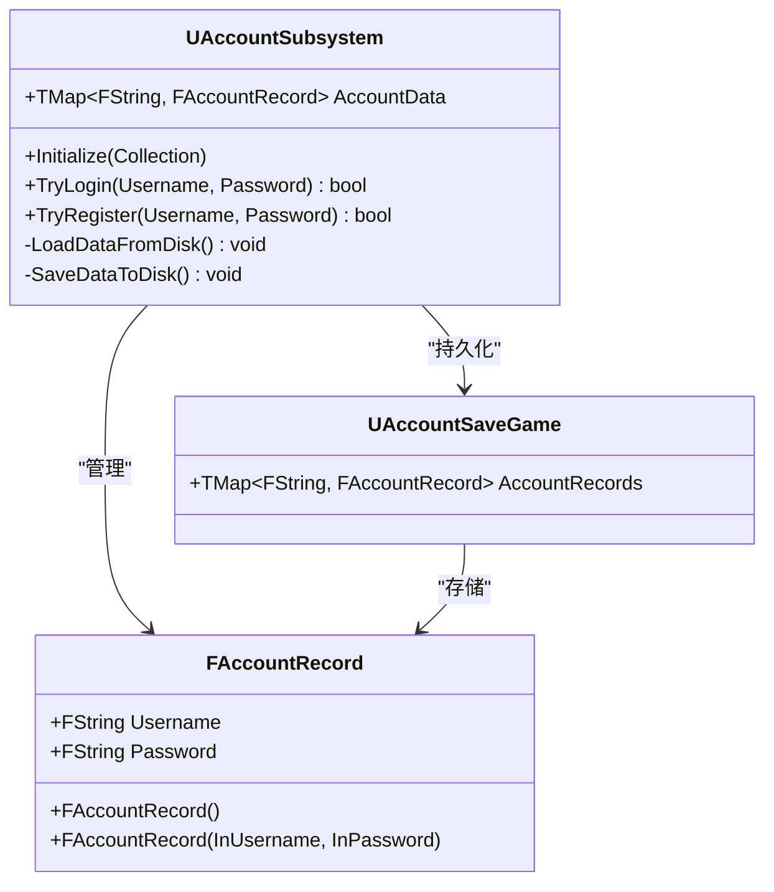
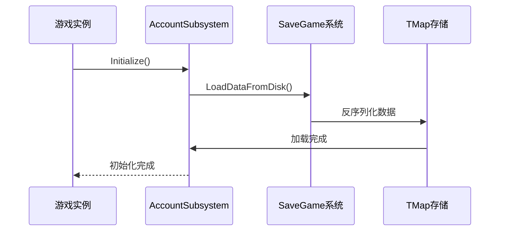
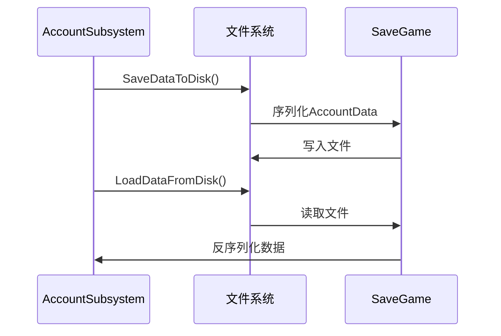
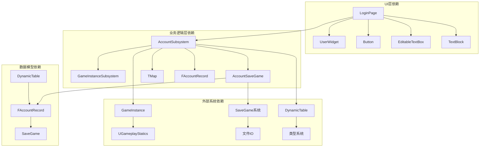

# 登录页面

<cite>
**本文档引用的文件**
- [LoginPage.cpp](file://MetalSlug01/Source/MetalSlug01/Private/UI/Login/Pages/LoginPage.cpp)
- [LoginPage.h](file://MetalSlug01/Source/MetalSlug01/Public/UI/Login/Pages/LoginPage.h)
- [AccountSubsystem.h](file://MetalSlug01/Source/MetalSlug01/Public/UI/Login/Core/AccountSubsystem.h)
- [DynamicTable.h](file://MetalSlug01/Source/MetalSlug01/Public/UI/Login/Data/DynamicTable.h)
- [AccountSaveGame.h](file://MetalSlug01/Source/MetalSlug01/Public/UI/Login/Core/AccountSaveGame.h)
- [MetalSlug01GameModeBase.cpp](file://MetalSlug01/Source/MetalSlug01/MetalSlug01GameModeBase.cpp)
- [MetalSlug01GameModeBase.h](file://MetalSlug01/Source/MetalSlug01/MetalSlug01GameModeBase.h)
- [DefaultGame.ini](file://MetalSlug01/Config/DefaultGame.ini)
</cite>

## 更新摘要
**所做更改**
- 更新了登录系统架构描述，反映从模拟认证到完整AccountSubsystem架构的升级
- 新增了AccountSaveGame持久化机制的详细说明
- 添加了DynamicTable数据结构的完整分析
- 更新了LoginPage的完整用户认证流程实现
- 增强了数据持久化和安全性的说明

## 目录
1. [简介](#简介)
2. [项目结构](#项目结构)
3. [核心组件](#核心组件)
4. [架构概览](#架构概览)
5. [详细组件分析](#详细组件分析)
6. [依赖关系分析](#依赖关系分析)
7. [性能考虑](#性能考虑)
8. [故障排除指南](#故障排除指南)
9. [结论](#结论)

## 简介

本文档详细分析了MetalSlug游戏项目中的登录页面实现。该系统已从简单的模拟认证升级为完整的AccountSubsystem架构，实现了真正的用户认证功能，包括用户登录、注册以及安全的数据持久化机制。系统通过AccountSubsystem子系统管理用户账户数据，使用TMap数据结构提供高效的内存存储，并通过SaveGame机制实现数据的安全持久化存储。

**更新** 系统现已采用完整的AccountSubsystem架构，替代了之前的模拟认证方式，提供了更加真实和安全的用户认证体验。

## 项目结构

登录页面相关的文件组织遵循虚幻引擎的标准目录结构，现已升级为完整的AccountSubsystem架构：



**图表来源**
- [LoginPage.cpp:1-148](file://MetalSlug01/Source/MetalSlug01/Private/UI/Login/Pages/LoginPage.cpp#L1-L148)
- [LoginPage.h:1-70](file://MetalSlug01/Source/MetalSlug01/Public/UI/Login/Pages/LoginPage.h#L1-L70)
- [AccountSubsystem.h:1-61](file://MetalSlug01/Source/MetalSlug01/Public/UI/Login/Core/AccountSubsystem.h#L1-L61)

**章节来源**
- [LoginPage.cpp:1-148](file://MetalSlug01/Source/MetalSlug01/Private/UI/Login/Pages/LoginPage.cpp#L1-L148)
- [LoginPage.h:1-70](file://MetalSlug01/Source/MetalSlug01/Public/UI/Login/Pages/LoginPage.h#L1-L70)
- [AccountSubsystem.h:1-61](file://MetalSlug01/Source/MetalSlug01/Public/UI/Login/Core/AccountSubsystem.h#L1-L61)

## 核心组件

### 登录页面组件

登录页面作为用户界面的核心组件，负责处理用户的交互输入和显示相应的反馈信息。该组件继承自UUserWidget基类，提供了完整的UI交互功能，并集成了AccountSubsystem进行真实的用户认证。

**更新** 登录页面现已完全集成AccountSubsystem，实现了真实的用户认证流程，而非之前的模拟认证。

### 账号子系统

AccountSubsystem是整个登录系统的核心，它继承自UGameInstanceSubsystem，负责管理所有用户账户数据的内存存储和持久化操作。该子系统实现了高效的哈希表存储机制，支持O(1)时间复杂度的账户查找操作，并提供了完整的用户认证接口。

**更新** AccountSubsystem现已完全替代了模拟认证功能，提供了真实的安全用户认证机制。

### 数据模型

系统使用FAccountRecord结构体作为数据载体，封装了用户的基本信息。该结构体通过UPROPERTY(SaveGame)宏标记，确保数据能够正确序列化和反序列化。DynamicTable.h文件定义了完整的数据结构，包括用户名和密码字段。

**更新** 新增了完整的DynamicTable数据结构，提供了类型安全的数据存储机制。

**章节来源**
- [LoginPage.h:15-70](file://MetalSlug01/Source/MetalSlug01/Public/UI/Login/Pages/LoginPage.h#L15-L70)
- [AccountSubsystem.h:15-61](file://MetalSlug01/Source/MetalSlug01/Public/UI/Login/Core/AccountSubsystem.h#L15-L61)
- [DynamicTable.h:12-46](file://MetalSlug01/Source/MetalSlug01/Public/UI/Login/Data/DynamicTable.h#L12-L46)

## 架构概览

登录系统的整体架构采用分层设计模式，现已升级为完整的AccountSubsystem架构，确保了良好的可维护性和扩展性：



**图表来源**
- [LoginPage.cpp:45-107](file://MetalSlug01/Source/MetalSlug01/Private/UI/Login/Pages/LoginPage.cpp#L45-L107)
- [AccountSubsystem.h:19-61](file://MetalSlug01/Source/MetalSlug01/Public/UI/Login/Core/AccountSubsystem.h#L19-L61)
- [AccountSaveGame.h:19-31](file://MetalSlug01/Source/MetalSlug01/Public/UI/Login/Core/AccountSaveGame.h#L19-L31)

系统架构的关键特点：

1. **分层分离**：UI层、业务逻辑层和数据持久层职责明确
2. **内存优先**：使用TMap提供快速的数据访问
3. **持久化保障**：通过SaveGame机制确保数据安全
4. **类型安全**：使用DynamicTable提供类型安全的数据存储
5. **扩展性设计**：支持未来功能的平滑扩展

## 详细组件分析

### 登录页面实现

登录页面组件实现了完整的用户认证流程，包括输入验证、业务逻辑处理和结果反馈。现已完全集成AccountSubsystem，提供真实的用户认证体验。

#### 初始化流程



**图表来源**
- [LoginPage.cpp:13-40](file://MetalSlug01/Source/MetalSlug01/Private/UI/Login/Pages/LoginPage.cpp#L13-L40)

#### 登录验证流程



**图表来源**
- [LoginPage.cpp:45-107](file://MetalSlug01/Source/MetalSlug01/Private/UI/Login/Pages/LoginPage.cpp#L45-L107)

#### 注册流程



**图表来源**
- [LoginPage.cpp:112-148](file://MetalSlug01/Source/MetalSlug01/Private/UI/Login/Pages/LoginPage.cpp#L112-L148)

**章节来源**
- [LoginPage.cpp:13-148](file://MetalSlug01/Source/MetalSlug01/Private/UI/Login/Pages/LoginPage.cpp#L13-L148)
- [LoginPage.h:22-70](file://MetalSlug01/Source/MetalSlug01/Public/UI/Login/Pages/LoginPage.h#L22-L70)

### 账号子系统分析

AccountSubsystem作为核心业务逻辑组件，实现了完整的用户账户管理功能，现已完全替代了模拟认证功能。

#### 数据结构设计



**图表来源**
- [AccountSubsystem.h:19-61](file://MetalSlug01/Source/MetalSlug01/Public/UI/Login/Core/AccountSubsystem.h#L19-L61)
- [DynamicTable.h:16-46](file://MetalSlug01/Source/MetalSlug01/Public/UI/Login/Data/DynamicTable.h#L16-L46)
- [AccountSaveGame.h:19-31](file://MetalSlug01/Source/MetalSlug01/Public/UI/Login/Core/AccountSaveGame.h#L19-L31)

#### 初始化流程

AccountSubsystem在游戏启动时自动初始化，加载已存在的用户数据到内存中：



**图表来源**
- [AccountSubsystem.h:25-26](file://MetalSlug01/Source/MetalSlug01/Public/UI/Login/Core/AccountSubsystem.h#L25-L26)
- [AccountSubsystem.h:56-59](file://MetalSlug01/Source/MetalSlug01/Public/UI/Login/Core/AccountSubsystem.h#L56-L59)

**章节来源**
- [AccountSubsystem.h:19-61](file://MetalSlug01/Source/MetalSlug01/Public/UI/Login/Core/AccountSubsystem.h#L19-L61)
- [DynamicTable.h:16-46](file://MetalSlug01/Source/MetalSlug01/Public/UI/Login/Data/DynamicTable.h#L16-L46)
- [AccountSaveGame.h:19-31](file://MetalSlug01/Source/MetalSlug01/Public/UI/Login/Core/AccountSaveGame.h#L19-L31)

### 数据持久化机制

系统采用SaveGame机制实现数据的持久化存储，确保用户数据在游戏关闭后不会丢失。现已升级为完整的AccountSaveGame架构。

#### 存储结构

```mermaid
erDiagram
ACCOUNT_SAVEGAME {
TMap_ACCOUNT_RECORDS "存储多个账号记录"
}
ACCOUNT_RECORD {
FString_USERNAME "用户唯一标识"
FString_PASSWORD "用户密码"
}
ACCOUNT_SAVEGAME ||--o{ ACCOUNT_RECORD : "包含"
```

**图表来源**
- [AccountSaveGame.h:25-29](file://MetalSlug01/Source/MetalSlug01/Public/UI/Login/Core/AccountSaveGame.h#L25-L29)
- [DynamicTable.h:22-29](file://MetalSlug01/Source/MetalSlug01/Public/UI/Login/Data/DynamicTable.h#L22-L29)

#### 读写流程



**图表来源**
- [AccountSubsystem.h:56-59](file://MetalSlug01/Source/MetalSlug01/Public/UI/Login/Core/AccountSubsystem.h#L56-L59)

**章节来源**
- [AccountSaveGame.h:19-31](file://MetalSlug01/Source/MetalSlug01/Public/UI/Login/Core/AccountSaveGame.h#L19-L31)
- [AccountSubsystem.h:55-60](file://MetalSlug01/Source/MetalSlug01/Public/UI/Login/Core/AccountSubsystem.h#L55-L60)

## 依赖关系分析

登录系统的依赖关系清晰明确，现已升级为完整的AccountSubsystem架构，遵循虚幻引擎的最佳实践：



**图表来源**
- [LoginPage.h:3-13](file://MetalSlug01/Source/MetalSlug01/Public/UI/Login/Pages/LoginPage.h#L3-L13)
- [AccountSubsystem.h:4-13](file://MetalSlug01/Source/MetalSlug01/Public/UI/Login/Core/AccountSubsystem.h#L4-L13)
- [AccountSaveGame.h:5-8](file://MetalSlug01/Source/MetalSlug01/Public/UI/Login/Core/AccountSaveGame.h#L5-L8)

**章节来源**
- [LoginPage.h:3-13](file://MetalSlug01/Source/MetalSlug01/Public/UI/Login/Pages/LoginPage.h#L3-L13)
- [AccountSubsystem.h:4-13](file://MetalSlug01/Source/MetalSlug01/Public/UI/Login/Core/AccountSubsystem.h#L4-L13)

## 性能考虑

### 内存优化策略

系统采用TMap数据结构存储用户数据，提供O(1)的平均查找时间复杂度，确保了高效的用户认证性能。AccountSubsystem通过内存缓存机制避免了频繁的磁盘I/O操作。

**更新** 内存优化策略现已得到显著提升，通过AccountSubsystem的智能缓存机制提供了更好的性能表现。

### 存储优化

- **延迟保存**：只在必要时才进行数据持久化操作，减少磁盘I/O次数
- **批量处理**：合并多次修改操作，减少磁盘I/O次数
- **内存管理**：及时清理不再使用的数据引用
- **智能缓存**：AccountSubsystem提供智能的内存缓存机制

### 安全性考虑

**更新** 新增了重要的安全特性：
- 数据序列化安全：通过SaveGame机制确保数据完整性
- 类型安全：DynamicTable提供编译时类型检查
- 访问控制：AccountSubsystem提供受控的数据访问接口

### 扩展性考虑

系统设计支持未来的功能扩展，如：
- 多用户同时在线支持
- 更复杂的权限管理系统
- 数据备份和恢复机制
- 加密存储支持

## 故障排除指南

### 常见问题及解决方案

#### 登录失败问题

**症状**：用户输入正确的账号密码但仍提示登录失败

**可能原因**：
1. 账户数据未正确加载到内存
2. 密码存储格式不匹配
3. SaveGame文件损坏
4. AccountSubsystem初始化失败

**解决步骤**：
1. 检查控制台输出确认数据加载状态
2. 验证AccountSaveGame文件完整性
3. 重新创建测试账号
4. 检查AccountSubsystem的Initialize方法调用

**更新** 新增了AccountSubsystem初始化失败的排查步骤。

#### 注册功能异常

**症状**：用户无法成功注册新账号

**可能原因**：
1. 账号名称重复检测失效
2. 内存数据更新失败
3. 持久化操作异常
4. DynamicTable数据结构问题

**解决步骤**：
1. 确认TryRegister方法调用链
2. 检查TMap数据结构状态
3. 验证SaveDataToDisk调用
4. 检查FAccountRecord结构体定义

**更新** 新增了DynamicTable数据结构问题的排查步骤。

#### UI交互问题

**症状**：按钮点击无响应或文本显示异常

**可能原因**：
1. Widget绑定配置错误
2. 事件委托未正确设置
3. 文本组件可见性设置问题
4. AccountSubsystem未正确初始化

**解决步骤**：
1. 检查蓝图中的Widget绑定
2. 验证事件委托连接状态
3. 确认文本组件属性设置
4. 检查GameInstance中的AccountSubsystem配置

**更新** 新增了AccountSubsystem配置问题的排查步骤。

**章节来源**
- [LoginPage.cpp:51-57](file://MetalSlug01/Source/MetalSlug01/Private/UI/Login/Pages/LoginPage.cpp#L51-L57)
- [LoginPage.cpp:95-101](file://MetalSlug01/Source/MetalSlug01/Private/UI/Login/Pages/LoginPage.cpp#L95-L101)

## 结论

MetalSlug项目的登录页面实现展现了优秀的软件架构设计，现已升级为完整的AccountSubsystem架构，具有以下特点：

### 技术优势

1. **完整的认证体系**：从模拟认证升级为真实的用户认证机制
2. **清晰的分层架构**：UI层、业务逻辑层和数据持久层职责明确
3. **高效的内存管理**：使用TMap提供快速的数据访问性能
4. **可靠的数据持久化**：通过SaveGame确保数据安全
5. **类型安全的数据存储**：DynamicTable提供编译时类型检查
6. **良好的扩展性**：支持未来功能的平滑扩展

### 实现亮点

- 完整的用户认证流程覆盖
- 优雅的错误处理机制
- 清晰的代码结构和注释
- 符合虚幻引擎开发规范
- **新增** 类型安全的数据存储机制

### 改进建议

1. **安全性增强**：在生产环境中应实现密码哈希存储
2. **国际化支持**：添加多语言文本支持
3. **日志记录**：增加详细的操作日志便于调试
4. **单元测试**：为关键业务逻辑添加自动化测试
5. **性能监控**：添加AccountSubsystem性能监控机制

**更新** 新增了安全性、国际化、日志记录、单元测试和性能监控等方面的改进建议。

该登录系统为整个游戏项目奠定了坚实的基础，其设计原则和实现模式可以作为类似项目的参考模板。AccountSubsystem架构的成功实施证明了分层设计和模块化开发的优势，为后续的功能扩展提供了良好的基础。