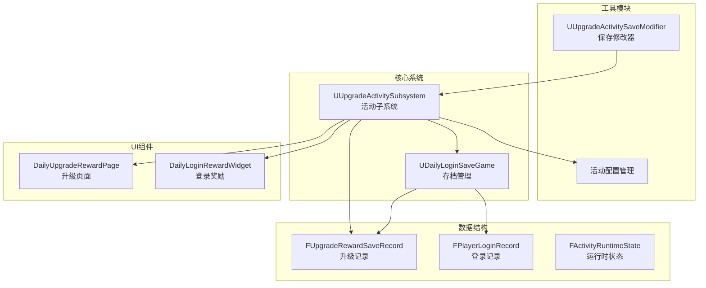
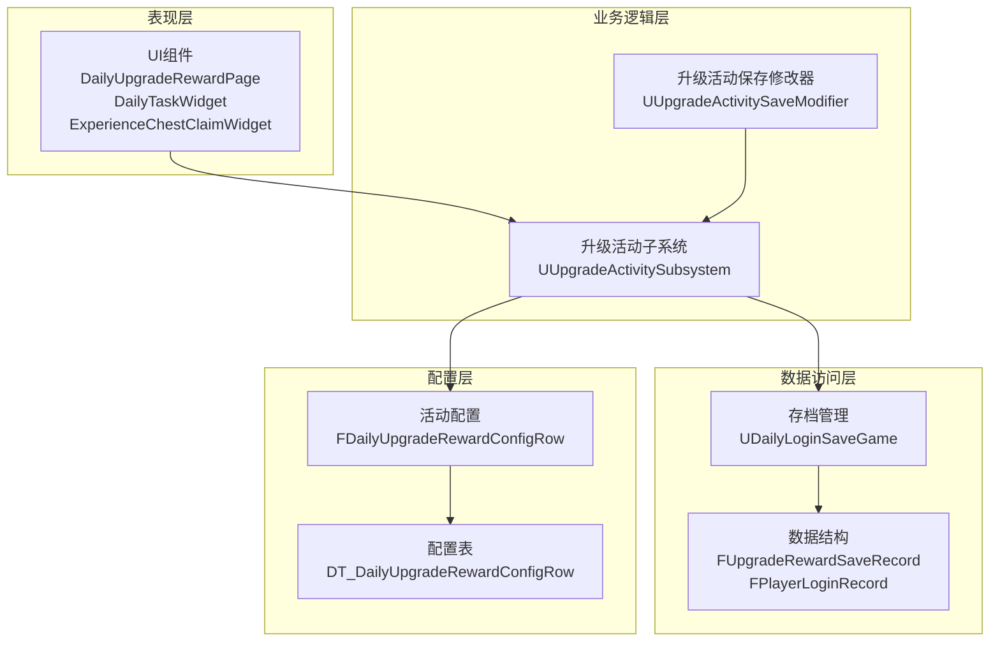
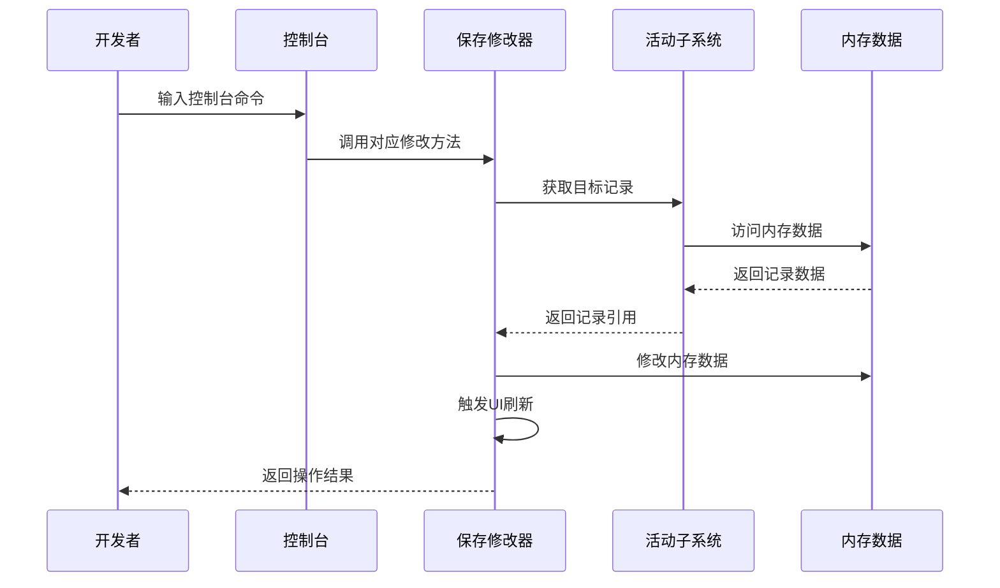
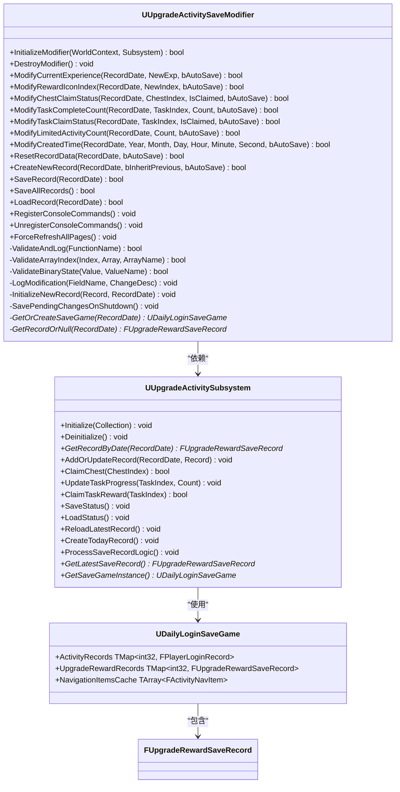
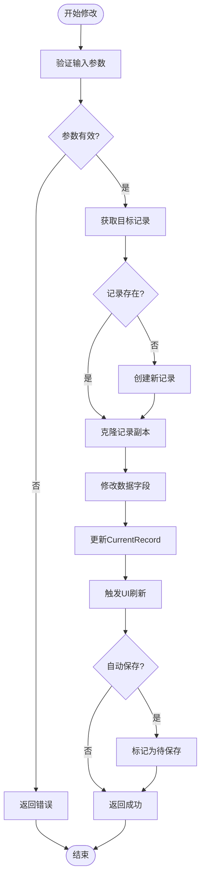
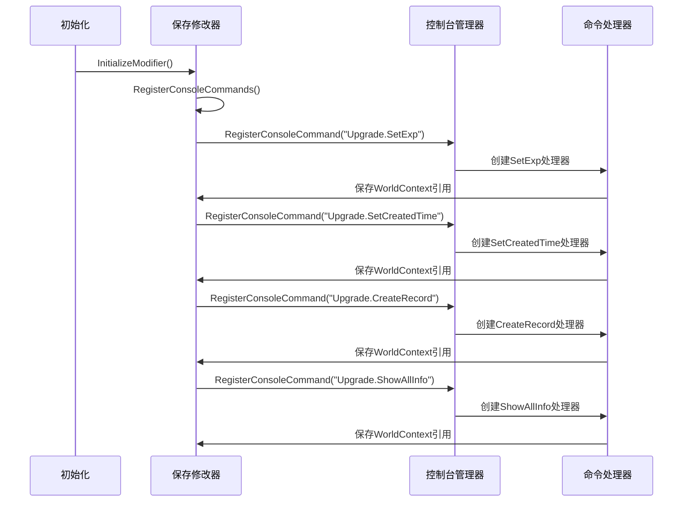
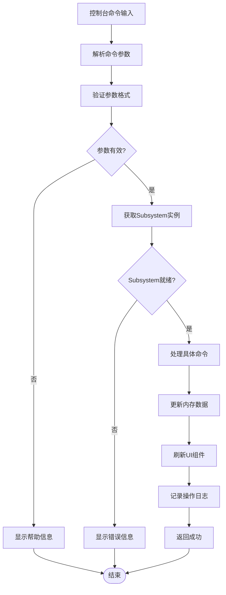
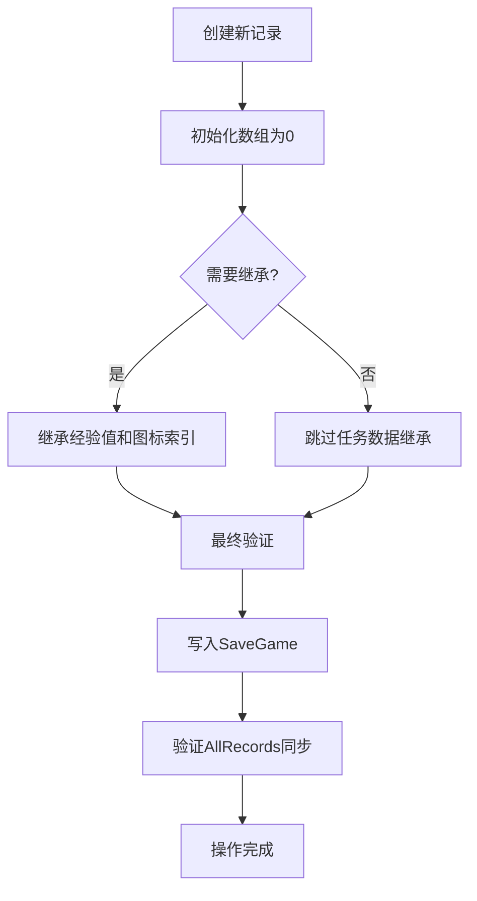
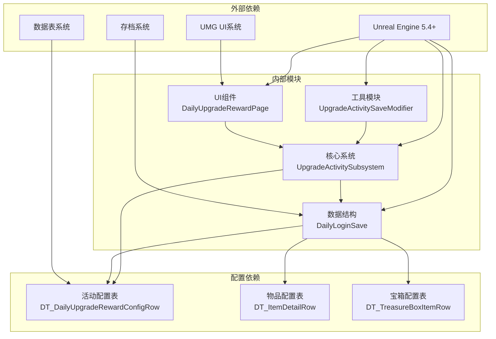
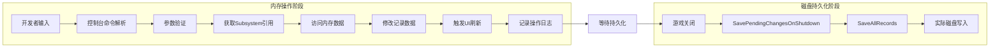

# 升级活动保存修改器

<cite>
**本文档引用的文件**
- [UpgradeActivitySaveModifier.h](file://MetalSlug01/Source/MetalSlug01/Public/Tools/UpgradeActivitySaveModifier.h)
- [UpgradeActivitySaveModifier.cpp](file://MetalSlug01/Source/MetalSlug01/Private/Tools/UpgradeActivitySaveModifier.cpp)
- [UpgradeActivitySubsystem.h](file://MetalSlug01/Source/MetalSlug01/Public/UI/Activity/Core/UpgradeActivitySubsystem.h)
- [UpgradeActivitySubsystem.cpp](file://MetalSlug01/Source/MetalSlug01/Private/UI/Activity/Core/UpgradeActivitySubsystem.cpp)
- [DailyLoginSave.h](file://MetalSlug01/Source/MetalSlug01/Public/UI/Activity/Data/DailyLoginSave.h)
- [UpgradeActivitySaveModifier_Readme.md](file://UpgradeActivitySaveModifier_Readme.md)
</cite>

## 更新摘要
**变更内容**
- **控制台命令重构**：所有控制台命令现在都重构为直接调用 `CreateNewRecord` 函数，提升代码复用性和一致性
- **新增标准化调试日志系统**：每个控制台命令都具备统一的调试日志格式，包含调试标记、时间戳和详细的操作信息
- **修复任务数据继承bug**：确保新记录创建时不会继承前一天的任务数据，通过明确初始化任务数组为0来解决
- **改进格式化输出**：使用统一的日志格式和调试标记，提供更好的调试体验
- **增强内存操作验证**：新增四个验证阶段确保数据修改的正确性和完整性

## 目录
1. [简介](#简介)
2. [项目结构](#项目结构)
3. [核心组件](#核心组件)
4. [架构概览](#架构概览)
5. [详细组件分析](#详细组件分析)
6. [调试日志系统](#调试日志系统)
7. [依赖关系分析](#依赖关系分析)
8. [性能考虑](#性能考虑)
9. [故障排除指南](#故障排除指南)
10. [结论](#结论)

## 简介

升级活动保存修改器是一个专为Unreal Engine 5.4+设计的调试工具，用于实时修改和管理升级奖励活动的存档数据。该系统提供了强大的控制台命令和编程接口，允许开发者在游戏运行时动态修改玩家的升级进度、奖励状态和活动数据，而无需重启游戏。

该修改器采用内存优先的设计理念，在游戏运行时只在内存中修改数据，所有实际的磁盘持久化操作仅在游戏关闭时执行，确保了调试过程的高效性和安全性。系统现已具备全面的调试日志系统，为开发者提供了强大的诊断和调试能力。

## 项目结构

项目采用模块化架构，主要包含以下核心模块：

**图表来源**
- [UpgradeActivitySaveModifier.h](file://MetalSlug01/Source/MetalSlug01/Public/Tools/UpgradeActivitySaveModifier.h#L34-L347)
- [UpgradeActivitySubsystem.h](file://MetalSlug01/Source/MetalSlug01/Public/UI/Activity/Core/UpgradeActivitySubsystem.h#L35-L499)
- [DailyLoginSave.h](file://MetalSlug01/Source/MetalSlug01/Public/UI/Activity/Data/DailyLoginSave.h#L233-L373)

**章节来源**
- [UpgradeActivitySaveModifier.h](file://MetalSlug01/Source/MetalSlug01/Public/Tools/UpgradeActivitySaveModifier.h#L1-L347)
- [UpgradeActivitySubsystem.h](file://MetalSlug01/Source/MetalSlug01/Public/UI/Activity/Core/UpgradeActivitySubsystem.h#L1-L499)

## 核心组件

### 升级活动保存修改器 (UUpgradeActivitySaveModifier)

升级活动保存修改器是整个系统的核心组件，提供了以下主要功能：

#### 主要特性
- **内存优先操作**：所有数据修改仅在内存中进行，确保调试效率
- **磁盘持久化**：游戏关闭时才执行实际的磁盘保存操作
- **控制台命令**：提供完整的控制台调试接口
- **数据验证**：内置参数验证和错误处理机制
- **自动刷新**：修改后自动触发UI刷新
- **全面调试日志**：提供详细的调试信息输出

#### 核心接口分类

**数据修改接口**
- `ModifyCurrentExperience()` - 修改经验值
- `ModifyRewardIconIndex()` - 修改奖励图标索引
- `ModifyChestClaimStatus()` - 修改宝箱领取状态
- `ModifyTaskCompleteCount()` - 修改任务完成次数
- `ModifyTaskClaimStatus()` - 修改任务领取状态
- `ModifyLimitedActivityCount()` - 修改限时活动完成次数
- **新增** `ModifyCreatedTime()` - 修改记录创建时间

**查询接口**
- `GetCurrentExperience()` - 获取当前经验值
- `GetRewardIconIndex()` - 获取奖励图标索引
- `GetChestClaimStatus()` - 获取宝箱领取状态
- `GetTaskCompleteCount()` - 获取任务完成次数
- `GetTaskClaimStatus()` - 获取任务领取状态
- `GetLimitedActivityCount()` - 获取限时活动完成次数

**保存接口**
- `SaveRecord()` - 保存指定日期的修改
- `SaveAllRecords()` - 保存所有修改
- `LoadRecord()` - 加载记录

**调试接口**
- `ValidateAndLog()` - 验证初始化状态并记录日志
- `ValidateArrayIndex()` - 验证数组索引有效性
- `ValidateBinaryState()` - 验证二进制状态值
- `LogModification()` - 记录修改日志

**章节来源**
- [UpgradeActivitySaveModifier.h](file://MetalSlug01/Source/MetalSlug01/Public/Tools/UpgradeActivitySaveModifier.h#L62-L223)

### 升级活动子系统 (UUpgradeActivitySubsystem)

升级活动子系统负责管理升级奖励活动的核心业务逻辑：

#### 主要职责
- **数据管理**：维护所有活动记录的内存映射表
- **业务逻辑**：处理宝箱领取、任务完成等核心业务
- **持久化**：负责数据的磁盘读写操作
- **配置管理**：加载和缓存活动配置数据

#### 核心功能
- `GetRecordByDate()` - 获取指定日期的记录
- `AddOrUpdateRecord()` - 添加或更新记录
- `ClaimChest()` - 领取宝箱奖励
- `ClaimTaskReward()` - 领取任务奖励
- `SaveStatus()` - 保存数据到磁盘
- `LoadStatus()` - 从磁盘加载数据

**章节来源**
- [UpgradeActivitySubsystem.h](file://MetalSlug01/Source/MetalSlug01/Public/UI/Activity/Core/UpgradeActivitySubsystem.h#L64-L432)

### 数据结构定义

#### 升级奖励存档记录 (FUpgradeRewardSaveRecord)

升级奖励存档记录是系统的核心数据结构，包含以下关键字段：

**基础信息**
- `RecordDate` - 记录天数（1代表day1）
- `RewardIconIndex` - 奖励图标显示下标

**限时活动数据**
- `LimitedActivityStartTime` - 限时活动开始时间（Unix时间戳）
- `LimitedActivityCompleteCount` - 限时活动完成次数

**任务数据**
- `TaskCompleteCounts` - 任务完成次数数组
- `TaskClaimStatus` - 任务领取情况数组

**经验值数据**
- `CurrentExperience` - 当前累计经验值

**宝箱数据**
- `ChestClaimStatus` - 宝箱领取情况数组

**时间戳**
- `CreatedTime` - 记录创建时间
- `LastUpdateTime` - 最后更新时间

**章节来源**
- [DailyLoginSave.h](file://MetalSlug01/Source/MetalSlug01/Public/UI/Activity/Data/DailyLoginSave.h#L233-L343)

## 架构概览

系统采用分层架构设计，实现了清晰的关注点分离：

**图表来源**
- [UpgradeActivitySaveModifier.h](file://MetalSlug01/Source/MetalSlug01/Public/Tools/UpgradeActivitySaveModifier.h#L34-L347)
- [UpgradeActivitySubsystem.h](file://MetalSlug01/Source/MetalSlug01/Public/UI/Activity/Core/UpgradeActivitySubsystem.h#L35-L499)
- [DailyLoginSave.h](file://MetalSlug01/Source/MetalSlug01/Public/UI/Activity/Data/DailyLoginSave.h#L352-L373)

### 控制台命令系统

系统提供了完整的控制台命令接口，支持以下调试操作：

**图表来源**
- [UpgradeActivitySaveModifier.cpp](file://MetalSlug01/Source/MetalSlug01/Private/Tools/UpgradeActivitySaveModifier.cpp#L686-L1061)

**章节来源**
- [UpgradeActivitySaveModifier.cpp](file://MetalSlug01/Source/MetalSlug01/Private/Tools/UpgradeActivitySaveModifier.cpp#L686-L1061)

## 详细组件分析

### 升级活动保存修改器类分析

#### 类关系图

**图表来源**
- [UpgradeActivitySaveModifier.h](file://MetalSlug01/Source/MetalSlug01/Public/Tools/UpgradeActivitySaveModifier.h#L34-L347)
- [UpgradeActivitySubsystem.h](file://MetalSlug01/Source/MetalSlug01/Public/UI/Activity/Core/UpgradeActivitySubsystem.h#L35-L499)
- [DailyLoginSave.h](file://MetalSlug01/Source/MetalSlug01/Public/UI/Activity/Data/DailyLoginSave.h#L352-L373)

#### 数据修改流程

**图表来源**
- [UpgradeActivitySaveModifier.cpp](file://MetalSlug01/Source/MetalSlug01/Private/Tools/UpgradeActivitySaveModifier.cpp#L86-L130)
- [UpgradeActivitySaveModifier.cpp](file://MetalSlug01/Source/MetalSlug01/Private/Tools/UpgradeActivitySaveModifier.cpp#L132-L170)

**章节来源**
- [UpgradeActivitySaveModifier.cpp](file://MetalSlug01/Source/MetalSlug01/Private/Tools/UpgradeActivitySaveModifier.cpp#L86-L170)

### 控制台命令实现分析

#### 命令注册流程

**图表来源**
- [UpgradeActivitySaveModifier.cpp](file://MetalSlug01/Source/MetalSlug01/Private/Tools/UpgradeActivitySaveModifier.cpp#L686-L1061)

#### 命令执行流程

**图表来源**
- [UpgradeActivitySaveModifier.cpp](file://MetalSlug01/Source/MetalSlug01/Private/Tools/UpgradeActivitySaveModifier.cpp#L694-L769)
- [UpgradeActivitySaveModifier.cpp](file://MetalSlug01/Source/MetalSlug01/Private/Tools/UpgradeActivitySaveModifier.cpp#L773-L850)

**章节来源**
- [UpgradeActivitySaveModifier.cpp](file://MetalSlug01/Source/MetalSlug01/Private/Tools/UpgradeActivitySaveModifier.cpp#L686-L1061)

### 重构的 Upgrade.CreateRecord 命令

**更新** 所有控制台命令现在都重构为直接调用 `CreateNewRecord` 函数，提升了代码复用性和一致性

#### 命令重构特点
- **统一入口**：所有创建记录的命令都通过 `CreateNewRecord` 函数处理
- **参数传递**：直接传递参数给 `CreateNewRecord` 函数，无需重复解析
- **错误处理**：集中处理错误情况，提升用户体验
- **日志统一**：使用统一的调试日志格式输出

#### 命令实现细节
- **参数解析**：从命令行参数中提取记录日期和继承标志
- **函数调用**：直接调用 `CreateNewRecord(RecordDate, bInherit, false)` 创建记录
- **状态同步**：调用 `ForceRefreshAllPages()` 刷新UI组件
- **调试输出**：使用统一的调试日志格式输出详细信息

**章节来源**
- [UpgradeActivitySaveModifier.cpp](file://MetalSlug01/Source/MetalSlug01/Private/Tools/UpgradeActivitySaveModifier.cpp#L961-L1011)

### 新增的 Upgrade.SetCreatedTime 命令

**更新** 新增了 `Upgrade.SetCreatedTime` 控制台命令，用于直接修改升级活动记录的创建时间

#### 命令功能
- **用途**：直接修改指定日期记录的 `CreatedTime` 字段
- **参数**：7个参数（RecordDate, Year, Month, Day, Hour, Minute, Second）
- **操作模式**：内存优先，修改后触发UI刷新但不立即持久化到磁盘
- **应用场景**：调试活动时间逻辑、模拟不同时间点的活动状态

#### 命令实现细节
- 参数解析：将7个字符串参数转换为整数类型
- 时间构造：使用 `FDateTime(Year, Month, Day, Hour, Minute, Second)` 创建新时间
- 数据更新：修改 `CreatedTime` 字段并更新 `LastUpdateTime`
- 状态同步：同时更新 `CurrentRecord` 和 `AllRecords` 映射表
- 日志记录：详细的调试日志输出，包括修改前后的对比

**章节来源**
- [UpgradeActivitySaveModifier.cpp](file://MetalSlug01/Source/MetalSlug01/Private/Tools/UpgradeActivitySaveModifier.cpp#L770-L853)

## 调试日志系统

### 全面的调试日志架构

系统现已具备全面的调试日志系统，提供了四个关键的验证阶段和详细的日志输出：

#### 四个验证阶段

**1. 初始化后验证**
- 验证新记录创建后的数据状态
- 确保任务数据数组初始化为0
- 检查继承操作的正确性

**2. 继承检查**
- 显示前一天记录的详细数据
- 验证经验值和奖励图标的继承
- 明确标注不继承任务数据

**3. 最终验证**
- 写入SaveGame前的完整数据检查
- 验证所有数组内容的正确性
- 确保数据完整性

**4. 写入后验证**
- SaveGame.UpgradeRewardRecords中的数据确认
- 验证AllRecords表格的同步更新
- 确认CurrentRecord的正确设置

#### 统一的日志格式

系统使用统一的日志格式，包含以下元素：

- **调试标记**：如 `[SET_EXP_DEBUG]`、`[SET_CREATED_TIME_DEBUG]`、`MEMORY_DATA_MODIFICATION_START`
- **时间戳**：显示操作的具体时间
- **数据状态**：详细显示修改前后的数据状态
- **操作说明**：清晰描述每个操作的目的和结果

#### 控制台命令调试增强

所有控制台命令都具备详细的调试输出：

- **内存操作标识**：明确显示"仅内存操作，不写入磁盘"
- **数据状态显示**：显示当前内存中的数据状态
- **操作结果确认**：确认每个操作的成功或失败
- **格式化输出**：使用统一的格式化样式

**章节来源**
- [UpgradeActivitySaveModifier.cpp](file://MetalSlug01/Source/MetalSlug01/Private/Tools/UpgradeActivitySaveModifier.cpp#L480-L589)
- [UpgradeActivitySaveModifier.cpp](file://MetalSlug01/Source/MetalSlug01/Private/Tools/UpgradeActivitySaveModifier.cpp#L845-L945)
- [UpgradeActivitySaveModifier.cpp](file://MetalSlug01/Source/MetalSlug01/Private/Tools/UpgradeActivitySaveModifier.cpp#L1024-L1089)

### 修复的任务数据继承bug

**更新** 修复了任务数据继承的重要bug，确保新记录不会继承前一天的任务数据

#### 问题描述
在之前的版本中，新记录会错误地继承前一天的任务完成次数和领取状态，这会导致数据不一致和调试困难。

#### 解决方案
- **明确初始化**：新记录创建时显式将任务数据数组初始化为0
- **继承限制**：只继承经验值和奖励图标索引，不继承任务数据
- **验证确认**：通过四个验证阶段确保数据正确性

#### 验证流程

**章节来源**
- [UpgradeActivitySaveModifier.cpp](file://MetalSlug01/Source/MetalSlug01/Private/Tools/UpgradeActivitySaveModifier.cpp#L464-L528)

## 依赖关系分析

### 组件依赖图

**图表来源**
- [UpgradeActivitySubsystem.cpp](file://MetalSlug01/Source/MetalSlug01/Private/UI/Activity/Core/UpgradeActivitySubsystem.cpp#L32-L73)
- [DailyLoginSave.h](file://MetalSlug01/Source/MetalSlug01/Public/UI/Activity/Data/DailyLoginSave.h#L352-L373)

### 数据流分析

#### 内存操作流程

**图表来源**
- [UpgradeActivitySaveModifier.cpp](file://MetalSlug01/Source/MetalSlug01/Private/Tools/UpgradeActivitySaveModifier.cpp#L592-L617)
- [UpgradeActivitySaveModifier.cpp](file://MetalSlug01/Source/MetalSlug01/Private/Tools/UpgradeActivitySaveModifier.cpp#L565-L590)

**章节来源**
- [UpgradeActivitySaveModifier.cpp](file://MetalSlug01/Source/MetalSlug01/Private/Tools/UpgradeActivitySaveModifier.cpp#L547-L617)

## 性能考虑

### 内存优化策略

1. **延迟持久化**：所有修改仅在内存中进行，减少磁盘I/O操作
2. **批量保存**：游戏关闭时统一执行磁盘保存，避免频繁写入
3. **智能缓存**：Subsystem缓存配置表数据，避免重复加载
4. **弱引用管理**：使用TWeakObjectPtr避免循环引用

### 并发安全

- **单线程模型**：所有数据修改在游戏主线程执行
- **原子操作**：记录级别的数据修改保证一致性
- **状态同步**：修改后自动触发UI刷新，确保界面一致性

### 资源管理

- **自动清理**：Subsystem销毁时自动清理相关资源
- **内存监控**：定期检查内存使用情况
- **垃圾回收**：利用UE的垃圾回收机制管理对象生命周期

## 故障排除指南

### 常见问题及解决方案

#### 初始化失败
**问题**：保存修改器无法初始化
**原因**：
- WorldContext为空
- 无法获取GameInstance
- 无法获取UpgradeActivitySubsystem

**解决方案**：
1. 确保在有效的游戏环境中调用
2. 检查Subsystem是否正确初始化
3. 验证WorldContext的有效性

#### 数据修改失败
**问题**：修改操作返回失败
**原因**：
- 参数验证失败
- 记录不存在
- 索引超出范围

**解决方案**：
1. 检查输入参数的有效性
2. 确认目标记录存在
3. 验证数组索引范围

#### UI不刷新
**问题**：修改后UI不显示更新
**原因**：
- 刷新机制未触发
- 事件广播失败

**解决方案**：
1. 调用ForceRefreshAllPages()
2. 检查OnGlobalRefresh事件绑定
3. 验证UI组件的刷新逻辑

### 调试技巧

1. **启用详细日志**：查看控制台输出的详细操作信息
2. **使用ShowAllInfo**：查看所有记录的当前状态
3. **参数验证**：在修改前先使用ShowInfo验证当前状态
4. **逐步调试**：按经验→图标→宝箱的顺序进行设置
5. **时间调试**：使用 `Upgrade.SetCreatedTime` 模拟不同时间点的状态
6. **验证阶段**：关注四个验证阶段的输出信息

**章节来源**
- [UpgradeActivitySaveModifier_Readme.md](file://UpgradeActivitySaveModifier_Readme.md#L162-L189)

## 结论

升级活动保存修改器是一个设计精良的调试工具，它成功地平衡了调试效率和数据安全性。通过采用内存优先的操作模式和智能的持久化策略，该系统为开发者提供了强大而灵活的调试能力。

### 主要优势

1. **高效调试**：内存操作确保快速响应
2. **数据安全**：磁盘持久化避免意外数据丢失
3. **易于使用**：直观的控制台命令接口
4. **扩展性强**：模块化设计便于功能扩展
5. **稳定性好**：完善的错误处理和恢复机制
6. **全面调试**：新增的调试日志系统提供强大的诊断能力

### 技术亮点

- **解耦设计**：保存修改器与Subsystem完全解耦
- **内存管理**：智能的内存使用和清理机制
- **事件驱动**：基于事件的UI自动刷新机制
- **配置驱动**：灵活的配置系统支持动态调整
- **时间控制**：新增的时间修改功能增强了调试能力
- **验证系统**：四个验证阶段确保数据完整性
- **统一日志**：详细的调试日志输出

### 新增功能价值

**控制台命令重构** 的引入显著提升了系统的代码质量和一致性：
- 所有命令都通过统一的 `CreateNewRecord` 函数处理
- 提升了代码复用性和维护性
- 简化了命令实现逻辑

**全面调试日志系统** 的引入显著提升了系统的调试能力：
- 四个验证阶段确保数据修改的正确性
- 统一的日志格式提供清晰的调试信息
- 详细的控制台命令输出增强用户体验
- 修复的任务数据继承bug提高了数据一致性

**修复的任务数据继承bug** 的重要性：
- 确保新记录不会错误继承前一天的任务数据
- 通过四个验证阶段验证数据正确性
- 明确标注继承限制，避免混淆
- 提高了系统的可靠性和可预测性

**改进的格式化输出** 的价值：
- 统一的调试日志格式提升了可读性
- 标准化的调试标记便于问题定位
- 详细的日志信息帮助开发者快速理解系统状态

该系统为Unreal Engine项目的活动系统开发提供了重要的调试和测试支持，是项目开发过程中的宝贵工具。新增的调试功能使其成为了一个更加完善和专业的开发工具。