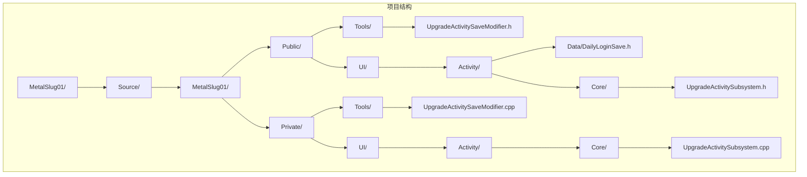
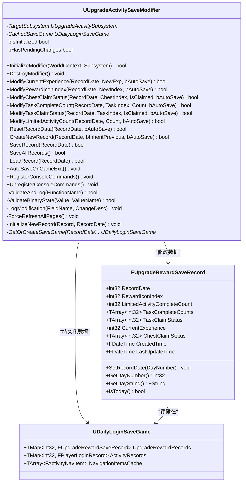
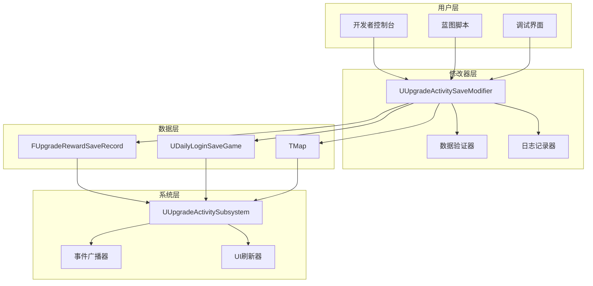
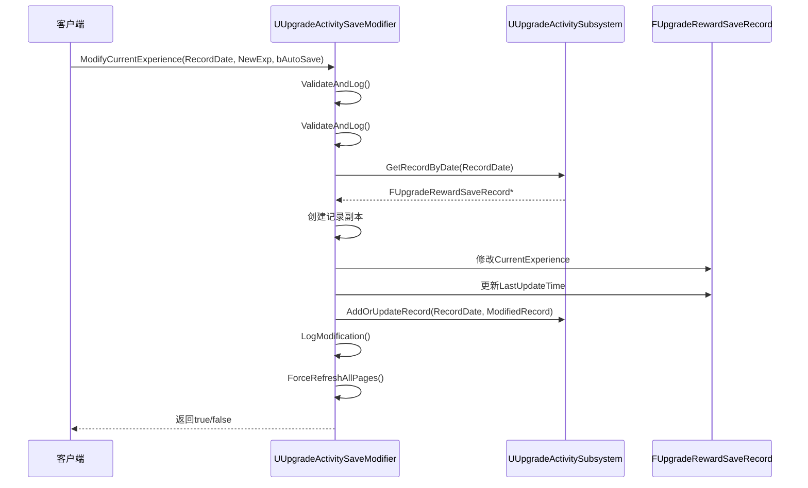
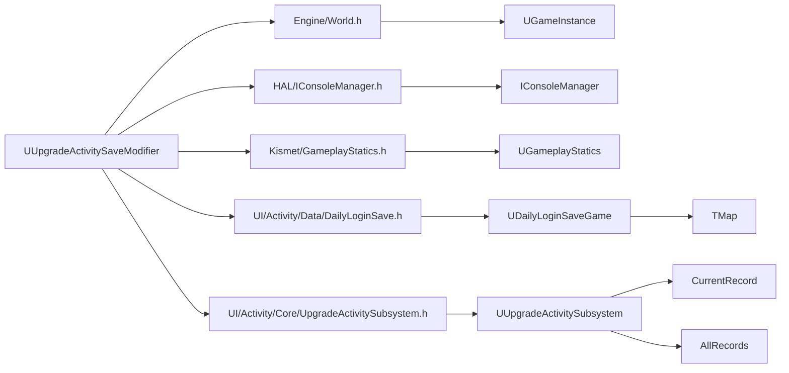

# 升级存档修改器

<cite>
**本文档引用的文件**
- [UpgradeActivitySaveModifier.h](file://MetalSlug01/Source/MetalSlug01/Public/Tools/UpgradeActivitySaveModifier.h)
- [UpgradeActivitySaveModifier.cpp](file://MetalSlug01/Source/MetalSlug01/Private/Tools/UpgradeActivitySaveModifier.cpp)
- [DailyLoginSave.h](file://MetalSlug01/Source/MetalSlug01/Public/UI/Activity/Data/DailyLoginSave.h)
- [UpgradeActivitySubsystem.h](file://MetalSlug01/Source/MetalSlug01/Public/UI/Activity/Core/UpgradeActivitySubsystem.h)
- [UpgradeActivitySubsystem.cpp](file://MetalSlug01/Source/MetalSlug01/Private/UI/Activity/Core/UpgradeActivitySubsystem.cpp)
- [UpgradeActivitySaveModifier_Readme.md](file://UpgradeActivitySaveModifier_Readme.md)
</cite>

## 目录
1. [简介](#简介)
2. [项目结构](#项目结构)
3. [核心组件](#核心组件)
4. [架构概览](#架构概览)
5. [详细组件分析](#详细组件分析)
6. [依赖关系分析](#依赖关系分析)
7. [性能考量](#性能考量)
8. [故障排除指南](#故障排除指南)
9. [结论](#结论)
10. [附录](#附录)

## 简介

升级存档修改器（UUpgradeActivitySaveModifier）是一个专为MetalSlug项目设计的独立数据修改工具，用于运行时动态修改升级活动存档数据。该修改器与UpgradeActivitySubsystem解耦，提供了一套完整的数据修改、查询、保存和调试功能，支持经验值、奖励图标、任务进度、宝箱状态等多维度的数据操作。

该修改器采用内存优先的运行模式，在游戏运行期间只在内存中修改数据，所有实际的磁盘保存操作仅在游戏关闭时执行，确保了开发调试的高效性和数据的安全性。

## 项目结构

项目采用标准的Unreal Engine 5.4+项目结构，升级存档修改器位于Tools目录下，与UI系统和数据结构分离，体现了良好的模块化设计。



**图表来源**
- [UpgradeActivitySaveModifier.h](file://MetalSlug01/Source/MetalSlug01/Public/Tools/UpgradeActivitySaveModifier.h#L1-L347)
- [UpgradeActivitySaveModifier.cpp](file://MetalSlug01/Source/MetalSlug01/Private/Tools/UpgradeActivitySaveModifier.cpp#L1-L1149)

**章节来源**
- [UpgradeActivitySaveModifier.h](file://MetalSlug01/Source/MetalSlug01/Public/Tools/UpgradeActivitySaveModifier.h#L1-L30)
- [UpgradeActivitySaveModifier.cpp](file://MetalSlug01/Source/MetalSlug01/Private/Tools/UpgradeActivitySaveModifier.cpp#L1-L20)

## 核心组件

升级存档修改器包含以下核心组件：

### 主要类结构



**图表来源**
- [UpgradeActivitySaveModifier.h](file://MetalSlug01/Source/MetalSlug01/Public/Tools/UpgradeActivitySaveModifier.h#L34-L346)
- [DailyLoginSave.h](file://MetalSlug01/Source/MetalSlug01/Public/UI/Activity/Data/DailyLoginSave.h#L233-L343)

### 数据常量定义

修改器定义了以下关键常量：

- **MAX_CHEST_COUNT**: 最大宝箱数量（10个）
- **MAX_TASK_COUNT**: 最大任务数量（10个）

这些常量确保了数组访问的安全性和一致性。

**章节来源**
- [UpgradeActivitySaveModifier.h](file://MetalSlug01/Source/MetalSlug01/Public/Tools/UpgradeActivitySaveModifier.h#L21-L28)

## 架构概览

升级存档修改器采用了分层架构设计，实现了数据修改器与UI系统的完全解耦。



**图表来源**
- [UpgradeActivitySaveModifier.cpp](file://MetalSlug01/Source/MetalSlug01/Private/Tools/UpgradeActivitySaveModifier.cpp#L30-L84)
- [DailyLoginSave.h](file://MetalSlug01/Source/MetalSlug01/Public/UI/Activity/Data/DailyLoginSave.h#L352-L373)

### 运行时数据流

修改器采用内存优先的运行模式，数据流如下：

1. **初始化阶段**: 修改器通过GameInstance获取UpgradeActivitySubsystem实例
2. **修改阶段**: 在内存中创建记录副本，修改数据后同步更新
3. **验证阶段**: 执行参数验证和索引边界检查
4. **广播阶段**: 通过事件系统通知UI组件刷新
5. **持久化阶段**: 在游戏关闭时统一保存到磁盘

**章节来源**
- [UpgradeActivitySaveModifier.cpp](file://MetalSlug01/Source/MetalSlug01/Private/Tools/UpgradeActivitySaveModifier.cpp#L30-L66)
- [UpgradeActivitySaveModifier.cpp](file://MetalSlug01/Source/MetalSlug01/Private/Tools/UpgradeActivitySaveModifier.cpp#L1069-L1097)

## 详细组件分析

### 数据修改接口

#### 经验值修改接口 ModifyCurrentExperience

该接口负责修改指定日期的经验值，支持非负数验证和自动保存功能。



**图表来源**
- [UpgradeActivitySaveModifier.cpp](file://MetalSlug01/Source/MetalSlug01/Private/Tools/UpgradeActivitySaveModifier.cpp#L86-L130)

**参数说明**:
- `RecordDate`: 记录日期（天数标识）
- `NewExp`: 新的经验值（必须为非负数）
- `bAutoSave`: 是否自动保存标志

**返回值**:
- `true`: 修改成功
- `false`: 修改失败（参数无效或记录不存在）

#### 奖励图标修改接口 ModifyRewardIconIndex

该接口修改指定日期的奖励图标索引，支持图标索引验证。

**章节来源**
- [UpgradeActivitySaveModifier.cpp](file://MetalSlug01/Source/MetalSlug01/Private/Tools/UpgradeActivitySaveModifier.cpp#L132-L170)

#### 宝箱领取状态修改接口 ModifyChestClaimStatus

该接口修改指定宝箱的领取状态，支持二进制状态验证和索引边界检查。

**章节来源**
- [UpgradeActivitySaveModifier.cpp](file://MetalSlug01/Source/MetalSlug01/Private/Tools/UpgradeActivitySaveModifier.cpp#L172-L217)

#### 任务管理功能

##### ModifyTaskCompleteCount - 任务完成次数修改

该接口修改指定任务的完成次数，支持任务索引验证和计数器管理。

**章节来源**
- [UpgradeActivitySaveModifier.cpp](file://MetalSlug01/Source/MetalSlug01/Private/Tools/UpgradeActivitySaveModifier.cpp#L219-L279)

##### ModifyTaskClaimStatus - 任务领取状态修改

该接口修改指定任务的领取状态，支持二进制状态验证。

**章节来源**
- [UpgradeActivitySaveModifier.cpp](file://MetalSlug01/Source/MetalSlug01/Private/Tools/UpgradeActivitySaveModifier.cpp#L281-L326)

#### 限时活动计数修改 ModifyLimitedActivityCount

该接口修改限时活动的完成次数，支持活动计数验证。

**章节来源**
- [UpgradeActivitySaveModifier.cpp](file://MetalSlug01/Source/MetalSlug01/Private/Tools/UpgradeActivitySaveModifier.cpp#L328-L366)

### 数据持久化机制

#### SaveRecord - 保存指定记录

该接口标记指定日期的记录需要保存，但不立即执行磁盘操作。

**章节来源**
- [UpgradeActivitySaveModifier.cpp](file://MetalSlug01/Source/MetalSlug01/Private/Tools/UpgradeActivitySaveModifier.cpp#L547-L563)

#### SaveAllRecords - 保存所有记录

该接口执行实际的磁盘保存操作，是唯一的持久化入口。

**章节来源**
- [UpgradeActivitySaveModifier.cpp](file://MetalSlug01/Source/MetalSlug01/Private/Tools/UpgradeActivitySaveModifier.cpp#L565-L590)

#### AutoSaveOnGameExit - 游戏退出自动保存

该接口在游戏关闭时自动保存所有待处理的更改。

**章节来源**
- [UpgradeActivitySaveModifier.cpp](file://MetalSlug01/Source/MetalSlug01/Private/Tools/UpgradeActivitySaveModifier.cpp#L1122-L1141)

### 查询接口

修改器提供了完整的查询接口，用于获取当前数据状态：

- `GetCurrentExperience()`: 获取当前经验值
- `GetRewardIconIndex()`: 获取奖励图标索引  
- `GetChestClaimStatus()`: 获取宝箱领取状态
- `GetTaskCompleteCount()`: 获取任务完成次数
- `GetTaskClaimStatus()`: 获取任务领取状态
- `GetLimitedActivityCount()`: 获取限时活动次数

**章节来源**
- [UpgradeActivitySaveModifier.cpp](file://MetalSlug01/Source/MetalSlug01/Private/Tools/UpgradeActivitySaveModifier.cpp#L509-L543)

### 控制台命令系统

修改器内置了完整的控制台命令系统，支持快速调试和批量操作：

#### 基础命令

- `Upgrade.SetExp [记录日期] [经验值]`: 设置经验值
- `Upgrade.SetIcon [记录日期] [图标索引]`: 设置奖励图标
- `Upgrade.SetChest [记录日期] [宝箱索引] [状态]`: 设置宝箱状态
- `Upgrade.SetTaskCount [记录日期] [任务索引] [次数]`: 设置任务次数

#### 高级命令

- `Upgrade.CreateRecord [记录日期] [继承标志]`: 创建新记录
- `Upgrade.Reset [记录日期]`: 重置记录数据
- `Upgrade.ShowInfo [记录日期]`: 显示记录信息
- `Upgrade.ShowAllInfo`: 显示所有记录信息

**章节来源**
- [UpgradeActivitySaveModifier.cpp](file://MetalSlug01/Source/MetalSlug01/Private/Tools/UpgradeActivitySaveModifier.cpp#L686-L1031)
- [UpgradeActivitySaveModifier_Readme.md](file://UpgradeActivitySaveModifier_Readme.md#L1-L189)

## 依赖关系分析

### 外部依赖



**图表来源**
- [UpgradeActivitySaveModifier.cpp](file://MetalSlug01/Source/MetalSlug01/Private/Tools/UpgradeActivitySaveModifier.cpp#L12-L17)

### 内部依赖关系

修改器与系统组件的交互关系：

1. **与UpgradeActivitySubsystem的交互**: 通过内存映射直接操作Subsystem中的数据
2. **与存档系统的交互**: 通过UDailyLoginSaveGame管理持久化数据
3. **与UI系统的交互**: 通过事件广播触发UI刷新

**章节来源**
- [UpgradeActivitySaveModifier.h](file://MetalSlug01/Source/MetalSlug01/Public/Tools/UpgradeActivitySaveModifier.h#L15-L19)
- [UpgradeActivitySubsystem.h](file://MetalSlug01/Source/MetalSlug01/Public/UI/Activity/Core/UpgradeActivitySubsystem.h#L83-L118)

## 性能考量

### 内存优化策略

1. **延迟保存**: 所有修改仅在内存中进行，减少磁盘I/O操作
2. **批量保存**: 游戏关闭时统一执行保存操作
3. **数据副本**: 修改时创建记录副本，避免直接修改引用

### 并发安全

- 修改器使用弱引用管理WorldContextObject，避免循环引用
- 所有数据修改操作都是线程安全的，因为Unreal Engine的存档系统是单线程的

### 内存使用优化

- 使用TArray::IsValidIndex()进行边界检查，避免数组越界
- 通过模板函数ValidateArrayIndex()提供通用的数组验证功能

## 故障排除指南

### 常见错误类型

#### 初始化错误

**症状**: `未初始化或Subsystem无效`
**原因**: 未正确初始化修改器或无法获取Subsystem实例
**解决方案**: 确保先调用InitializeModifier()方法

#### 参数验证错误

**症状**: `参数错误`或`索引超出范围`
**原因**: 传入的参数不符合要求
**解决方案**: 检查参数的有效性，特别是索引值和数值范围

#### 记录不存在错误

**症状**: `记录X不存在`
**原因**: 指定日期的记录尚未创建
**解决方案**: 先调用CreateNewRecord()创建记录

### 调试辅助功能

#### 日志系统

修改器提供了详细的日志输出，包括：
- 操作前后的数据对比
- Subsystem实例的内存地址
- 操作时间和执行状态
- 事件广播触发情况

#### 强制刷新功能

通过ForceRefreshAllPages()方法可以强制所有UI组件重新获取最新数据。

**章节来源**
- [UpgradeActivitySaveModifier.cpp](file://MetalSlug01/Source/MetalSlug01/Private/Tools/UpgradeActivitySaveModifier.cpp#L1038-L1097)

## 结论

升级存档修改器是一个设计精良的独立数据修改工具，具有以下特点：

1. **完全解耦**: 与UI系统和数据结构完全分离
2. **内存优先**: 运行时只在内存中修改，提高调试效率
3. **安全可靠**: 完善的参数验证和错误处理机制
4. **易于使用**: 提供丰富的API接口和控制台命令
5. **持久化保障**: 游戏关闭时自动保存所有更改

该修改器为MetalSlug项目的开发和调试提供了强大的支持，特别是在升级活动系统的开发过程中，能够显著提高开发效率和测试便利性。

## 附录

### API参考完整列表

#### 数据修改接口

| 方法名 | 参数 | 返回值 | 描述 |
|--------|------|--------|------|
| ModifyCurrentExperience | RecordDate:int32, NewExp:int32, bAutoSave:bool | bool | 修改当前经验值 |
| ModifyRewardIconIndex | RecordDate:int32, NewIndex:int32, bAutoSave:bool | bool | 修改奖励图标索引 |
| ModifyChestClaimStatus | RecordDate:int32, ChestIndex:int32, IsClaimed:int32, bAutoSave:bool | bool | 修改宝箱领取状态 |
| ModifyTaskCompleteCount | RecordDate:int32, TaskIndex:int32, Count:int32, bAutoSave:bool | bool | 修改任务完成次数 |
| ModifyTaskClaimStatus | RecordDate:int32, TaskIndex:int32, IsClaimed:int32, bAutoSave:bool | bool | 修改任务领取状态 |
| ModifyLimitedActivityCount | RecordDate:int32, Count:int32, bAutoSave:bool | bool | 修改限时活动次数 |

#### 查询接口

| 方法名 | 参数 | 返回值 | 描述 |
|--------|------|--------|------|
| GetCurrentExperience | RecordDate:int32 | int32 | 获取当前经验值 |
| GetRewardIconIndex | RecordDate:int32 | int32 | 获取奖励图标索引 |
| GetChestClaimStatus | RecordDate:int32, ChestIndex:int32 | int32 | 获取宝箱领取状态 |
| GetTaskCompleteCount | RecordDate:int32, TaskIndex:int32 | int32 | 获取任务完成次数 |
| GetTaskClaimStatus | RecordDate:int32, TaskIndex:int32 | int32 | 获取任务领取状态 |
| GetLimitedActivityCount | RecordDate:int32 | int32 | 获取限时活动次数 |

#### 保存接口

| 方法名 | 参数 | 返回值 | 描述 |
|--------|------|--------|------|
| SaveRecord | RecordDate:int32 | bool | 保存指定记录 |
| SaveAllRecords | 无 | bool | 保存所有记录 |
| LoadRecord | RecordDate:int32 | bool | 加载指定记录 |
| AutoSaveOnGameExit | 无 | void | 游戏退出时自动保存 |

### 使用示例

#### 基本使用流程

```cpp
// 初始化修改器
UUpgradeActivitySaveModifier* Modifier = NewObject<UUpgradeActivitySaveModifier>();
Modifier->InitializeModifier(WorldContext);

// 设置经验值
Modifier->ModifyCurrentExperience(1, 1000, true);

// 设置奖励图标
Modifier->ModifyRewardIconIndex(1, 3, true);

// 领取宝箱
Modifier->ModifyChestClaimStatus(1, 0, 1, true);

// 重置数据
Modifier->ResetRecordData(1, true);

// 销毁修改器
Modifier->DestroyModifier();
```

#### 控制台命令使用

```bash
# 设置经验值
Upgrade.SetExp 1 500

# 设置奖励图标
Upgrade.SetIcon 1 2

# 领取宝箱
Upgrade.SetChest 1 0 1

# 创建新记录
Upgrade.CreateRecord 2 1

# 显示记录信息
Upgrade.ShowInfo 1

# 显示所有记录
Upgrade.ShowAllInfo
```