# 升级活动系统

<cite>
**本文档引用的文件**
- [UpgradeActivitySaveModifier.cpp](file://MetalSlug01/Source/MetalSlug01/Private/Tools/UpgradeActivitySaveModifier.cpp)
- [UpgradeActivitySaveModifier.h](file://MetalSlug01/Source/MetalSlug01/Public/Tools/UpgradeActivitySaveModifier.h)
- [DailyUpgradeRewardPage.cpp](file://MetalSlug01/Source/MetalSlug01/Private/UI/Activity/Pages/DailyUpgradeReward/DailyUpgradeRewardPage.cpp)
- [DailyUpgradeRewardPage.h](file://MetalSlug01/Source/MetalSlug01/Public/UI/Activity/Pages/DailyUpgradeReward/DailyUpgradeRewardPage.h)
- [UpgradeActivitySubsystem.cpp](file://MetalSlug01/Source/MetalSlug01/Private/UI/Activity/Core/UpgradeActivitySubsystem.cpp)
- [UpgradeActivitySubsystem.h](file://MetalSlug01/Source/MetalSlug01/Public/UI/Activity/Core/UpgradeActivitySubsystem.h)
- [DayLockHintWidget.cpp](file://MetalSlug01/Source/MetalSlug01/Private/UI/Activity/Pages/DailyUpgradeReward/DayLockHintWidget.cpp)
- [DayLockHintWidget.h](file://MetalSlug01/Source/MetalSlug01/Public/UI/Activity/Pages/DailyUpgradeReward/DayLockHintWidget.h)
- [DailyLoginSave.h](file://MetalSlug01/Source/MetalSlug01/Public/UI/Activity/Data/DailyLoginSave.h)
- [DailyLoginConfig.h](file://MetalSlug01/Source/MetalSlug01/Public/UI/Activity/Data/DailyLoginConfig.h)
- [UpgradeActivitySaveModifier_Readme.md](file://UpgradeActivitySaveModifier_Readme.md)
</cite>

## 更新摘要
**变更内容**
- **简化控制台命令实现**：移除了旧的复杂控制台命令实现，采用新的简化CreateNewRecord函数
- **增强调试能力**：全面增强调试日志系统，特别是`[LIMITED_REWARD_DEBUG]`前缀的详细调试输出
- **改进数据验证机制**：在多个关键方法中添加详细的参数验证和数据流调试
- **优化任务数据继承行为**：明确区分继承和非继承行为，确保数据一致性
- **增强UI显示修复**：改进奖励图标容器尺寸和CountText可见性控制
- **详细日志记录和验证步骤**：在各个方法中添加完整的数据流调试输出
- **调试工具使用**：系统提供了丰富的调试工具帮助开发者定位问题

## 目录
1. [简介](#简介)
2. [项目结构](#项目结构)
3. [核心组件](#核心组件)
4. [架构概览](#架构概览)
5. [详细组件分析](#详细组件分析)
6. [依赖关系分析](#依赖关系分析)
7. [性能考虑](#性能考虑)
8. [故障排除指南](#故障排除指南)
9. [结论](#结论)
10. [附录](#附录)

## 简介

MetalSlug升级活动系统是一个完整的每日升级奖励活动解决方案，基于Unreal Engine 5.4+开发。该系统提供了丰富的升级奖励功能，包括经验值管理、任务完成检测、宝箱奖励系统、重选奖励机制等核心功能。

**更新** 系统现已实现重大改进，包括体验点管理优化、数据持久化机制增强、历史记录管理完善，以及UI刷新修复和内存与磁盘同步改进。系统采用模块化设计，通过子系统模式实现数据访问层与UI层的分离，确保代码的可维护性和扩展性。

**最新增强** 系统现在具备了全面的调试基础设施，包括为GetLimitedTimeRewardIconsForDay函数添加的详细调试日志系统，以及改进的UI显示修复和数据处理验证机制。调试系统现在使用统一的`[LIMITED_REWARD_DEBUG]`前缀，确保日志的可追踪性和一致性。

**简化控制台命令** 系统已移除旧的复杂控制台命令实现，采用新的简化CreateNewRecord函数，提供更简洁、更可靠的调试和修改功能。

系统采用增强的分层架构，通过清晰的内存管理策略实现数据的实时同步和持久化保存。主要功能包括：

- **升级进度管理**：实时跟踪玩家的升级进度和经验值
- **多天记录管理**：支持7天记录的完整生命周期管理
- **每日任务系统**：支持多种任务类型的完成检测和奖励发放
- **宝箱奖励机制**：基于经验值的宝箱解锁和奖励领取
- **重选奖励功能**：允许玩家重新选择奖励物品
- **动态任务描述**：根据任务完成情况动态生成任务描述
- **数据持久化**：完整的存档系统支持跨游戏会话的数据保存
- **UI强制刷新**：确保内存数据与UI显示完全同步
- **全面调试系统**：详细的日志系统和调试工具支持问题定位
- **增强数据验证**：在各个关键操作中添加参数验证和错误处理
- **优化任务继承**：明确的任务数据继承和非继承行为

## 项目结构

升级活动系统采用清晰的分层架构，主要包含以下模块：

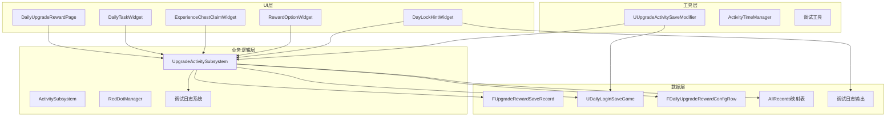

**图表来源**
- [DailyUpgradeRewardPage.cpp](file://MetalSlug01/Source/MetalSlug01/Private/UI/Activity/Pages/DailyUpgradeReward/DailyUpgradeRewardPage.cpp#L1-L100)
- [UpgradeActivitySubsystem.cpp](file://MetalSlug01/Source/MetalSlug01/Private/UI/Activity/Core/UpgradeActivitySubsystem.cpp#L438-L442)
- [DayLockHintWidget.cpp](file://MetalSlug01/Source/MetalSlug01/Private/UI/Activity/Pages/DailyUpgradeReward/DayLockHintWidget.cpp#L197-L322)
- [DailyLoginSave.h](file://MetalSlug01/Source/MetalSlug01/Public/UI/Activity/Data/DailyLoginSave.h#L233-L343)

**章节来源**
- [DailyUpgradeRewardPage.h](file://MetalSlug01/Source/MetalSlug01/Public/UI/Activity/Pages/DailyUpgradeReward/DailyUpgradeRewardPage.h#L34-L411)
- [UpgradeActivitySubsystem.h](file://MetalSlug01/Source/MetalSlug01/Public/UI/Activity/Core/UpgradeActivitySubsystem.h#L35-L476)
- [DayLockHintWidget.h](file://MetalSlug01/Source/MetalSlug01/Public/UI/Activity/Pages/DailyUpgradeReward/DayLockHintWidget.h#L14-L58)

## 核心组件

### UpgradeActivitySaveModifier 升级活动存档修改器

UpgradeActivitySaveModifier是系统的核心数据修改器，提供运行时修改UpgradeActivitySubsystem中动态数据的能力。该组件与Subsystem解耦，专注于数据修改和持久化操作。

**主要功能特性：**
- **数据修改接口**：支持修改经验值、奖励图标、任务进度等
- **批量操作**：提供创建新记录、重置数据等批量操作
- **持久化支持**：与存档系统集成，支持数据的持久化保存
- **调试工具**：提供控制台命令进行实时调试
- **数据同步**：自动同步AllRecords映射表与CurrentRecord
- **强制刷新机制**：确保UI与内存数据完全同步
- **增强调试日志**：使用`[LIMITED_REWARD_DEBUG]`前缀的统一调试输出
- **详细数据验证**：在各个操作中添加参数验证和错误处理
- **简化控制台命令**：采用新的CreateNewRecord函数实现，提供更可靠的调试功能

**核心API接口：**
- `ModifyCurrentExperience()` - 修改当前经验值
- `ModifyRewardIconIndex()` - 修改奖励图标索引
- `ModifyChestClaimStatus()` - 修改宝箱领取状态
- `ModifyTaskCompleteCount()` - 修改任务完成次数
- `CreateNewRecord()` - 创建新日期记录（简化实现）
- `ResetRecordData()` - 重置指定日期数据
- `AddOrUpdateRecord()` - 添加或更新记录到AllRecords映射表
- `ForceRefreshAllPages()` - 强制刷新所有页面

### DailyUpgradeRewardPage 每日升级奖励页面

DailyUpgradeRewardPage是升级活动的主要UI组件，负责展示和交互所有升级相关的功能。

**核心功能：**
- **奖励物品展示**：动态加载和显示奖励物品图标
- **经验宝箱管理**：实时更新宝箱状态和领取状态
- **任务进度跟踪**：显示每日任务的完成情况
- **重选奖励功能**：提供奖励物品的选择和切换
- **响应式布局**：适配不同屏幕尺寸的显示需求
- **动态任务描述**：根据任务完成情况动态生成任务描述
- **UI强制刷新**：确保显示与内存数据同步
- **增强UI控制**：精确的容器尺寸和可见性控制

**UI组件：**
- `RewardItemImage` - 奖励物品图片显示
- `ItemsScrollBox` - 经验宝箱滚动列表
- `DayButtonsContainer` - 天数选择按钮容器
- `TasksContainer` - 任务列表容器

### DayLockHintWidget 锁定提示Widget

**更新** DayLockHintWidget是新增的重要UI组件，负责在天数锁定状态下显示奖励预览信息。

**核心功能：**
- **限时奖励图标显示**：动态加载和显示限时奖励图标
- **任务奖励图标显示**：显示当前天数的任务奖励预览
- **容器状态管理**：管理LimitedTimeRewardIconsContainer和TaskRewardIconsContainer的状态
- **调试日志输出**：提供详细的UI调试信息
- **尺寸和可见性控制**：精确控制图标容器的尺寸和CountText可见性
- **增强调试系统**：使用`[LIMITED_REWARD_DEBUG]`前缀的统一调试输出

**UI组件：**
- `LimitedTimeRewardIconsContainer` - 限时奖励图标容器
- `TaskRewardIconsContainer` - 任务奖励图标容器
- `HintText` - 提示文字显示

### UpgradeActivitySubsystem 升级活动子系统

UpgradeActivitySubsystem是系统的核心业务逻辑层，负责管理升级活动的所有业务规则和数据操作。

**主要职责：**
- **多天记录管理**：管理AllRecords映射表中的所有记录
- **数据持久化**：管理存档数据的加载和保存
- **业务逻辑处理**：实现升级奖励的核心业务规则
- **配置管理**：加载和缓存活动配置数据
- **状态管理**：维护系统的运行时状态
- **动态任务描述生成**：根据任务完成情况生成动态描述
- **内存与磁盘同步**：确保AllRecords映射表与CurrentRecord一致性
- **调试日志管理**：提供全面的调试日志输出
- **增强数据验证**：在各个关键操作中添加参数验证和错误处理

**核心业务方法：**
- `ClaimChest()` - 领取宝箱奖励
- `ClaimTaskReward()` - 领取任务奖励
- `UpdateTaskProgress()` - 更新任务进度
- `CanClaimChest()` - 检查宝箱是否可领取
- `GetRewardItemIcons()` - 获取奖励物品图标
- `GetLimitedTimeRewardIconsForDay()` - 获取限时奖励图标
- `GetProcessedTaskDescriptionsForDay()` - 获取指定天数的处理后任务描述
- `GetProcessedTaskDescriptionsForCurrentDay()` - 获取当前天的处理后任务描述
- `ProcessSaveRecordLogic()` - 处理存档数据逻辑
- `CreateInheritedRecord()` - 创建继承前一天数据的新记录
- `ReloadLatestRecord()` - 重新加载最新的记录
- `GetMaxRecordDate()` - 获取最大记录日期
- `HasDayDataInMemory()` - 检查内存中是否存在指定天数的数据
- `GetDailyTaskHighlightStates()` - 获取每日任务高亮状态数组
- `GetDailyTaskLockStates()` - 获取每日任务锁定状态数组

**新增功能：**
- `AllRecords`映射表 - 存储所有记录的表格形式
- `ReloadLatestRecord()` - 重新加载最新的记录
- `GetMaxRecordDate()` - 获取最大记录日期
- `HasDayDataInMemory()` - 检查内存中是否存在指定天数的数据
- `GetDailyTaskHighlightStates()` - 获取每日任务高亮状态数组
- `GetDailyTaskLockStates()` - 获取每日任务锁定状态数组
- **全面调试日志系统** - 为所有关键方法添加详细的调试输出
- **增强数据验证** - 在各个操作中添加参数验证和错误处理

**章节来源**
- [UpgradeActivitySaveModifier.h](file://MetalSlug01/Source/MetalSlug01/Public/Tools/UpgradeActivitySaveModifier.h#L34-L347)
- [DailyUpgradeRewardPage.h](file://MetalSlug01/Source/MetalSlug01/Public/UI/Activity/Pages/DailyUpgradeReward/DailyUpgradeRewardPage.h#L34-L411)
- [DayLockHintWidget.h](file://MetalSlug01/Source/MetalSlug01/Public/UI/Activity/Pages/DailyUpgradeReward/DayLockHintWidget.h#L14-L58)
- [UpgradeActivitySubsystem.h](file://MetalSlug01/Source/MetalSlug01/Public/UI/Activity/Core/UpgradeActivitySubsystem.h#L35-L476)

## 架构概览

升级活动系统采用分层架构设计，确保各层之间的职责分离和松耦合。

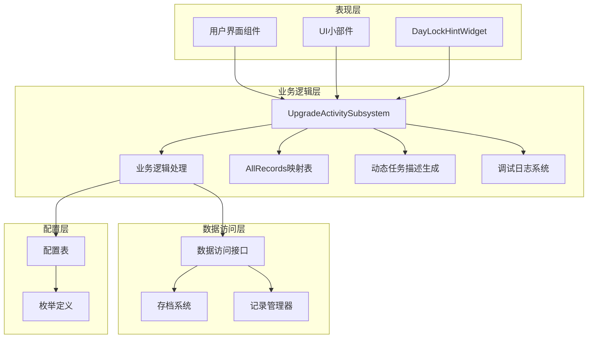

**图表来源**
- [UpgradeActivitySubsystem.cpp](file://MetalSlug01/Source/MetalSlug01/Private/UI/Activity/Core/UpgradeActivitySubsystem.cpp#L32-L89)
- [DayLockHintWidget.cpp](file://MetalSlug01/Source/MetalSlug01/Private/UI/Activity/Pages/DailyUpgradeReward/DayLockHintWidget.cpp#L14-L31)
- [DailyLoginConfig.h](file://MetalSlug01/Source/MetalSlug01/Public/UI/Activity/Data/DailyLoginConfig.h#L549-L622)

系统采用以下设计模式：

1. **子系统模式**：通过UGameInstanceSubsystem实现模块化管理
2. **观察者模式**：通过委托事件实现组件间的通信
3. **策略模式**：通过配置表实现灵活的业务规则配置
4. **工厂模式**：通过蓝图类引用实现UI组件的动态创建
5. **映射表模式**：通过AllRecords映射表实现多天记录管理
6. **强制刷新模式**：通过OnGlobalRefresh事件确保UI与数据同步
7. **调试日志模式**：通过统一的调试前缀实现全面的日志系统
8. **数据验证模式**：在各个关键操作中添加参数验证和错误处理

## 详细组件分析

### UpgradeActivitySaveModifier 详细分析

UpgradeActivitySaveModifier是一个独立的存档修改器，提供运行时修改升级活动数据的能力。

#### 数据结构设计

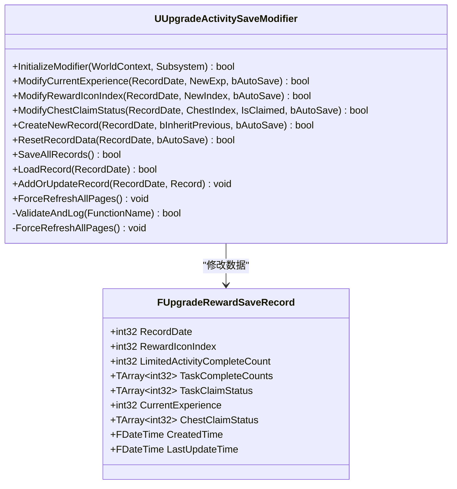

**图表来源**
- [UpgradeActivitySaveModifier.h](file://MetalSlug01/Source/MetalSlug01/Public/Tools/UpgradeActivitySaveModifier.h#L34-L347)
- [DailyLoginSave.h](file://MetalSlug01/Source/MetalSlug01/Public/UI/Activity/Data/DailyLoginSave.h#L233-L343)

#### 核心修改流程

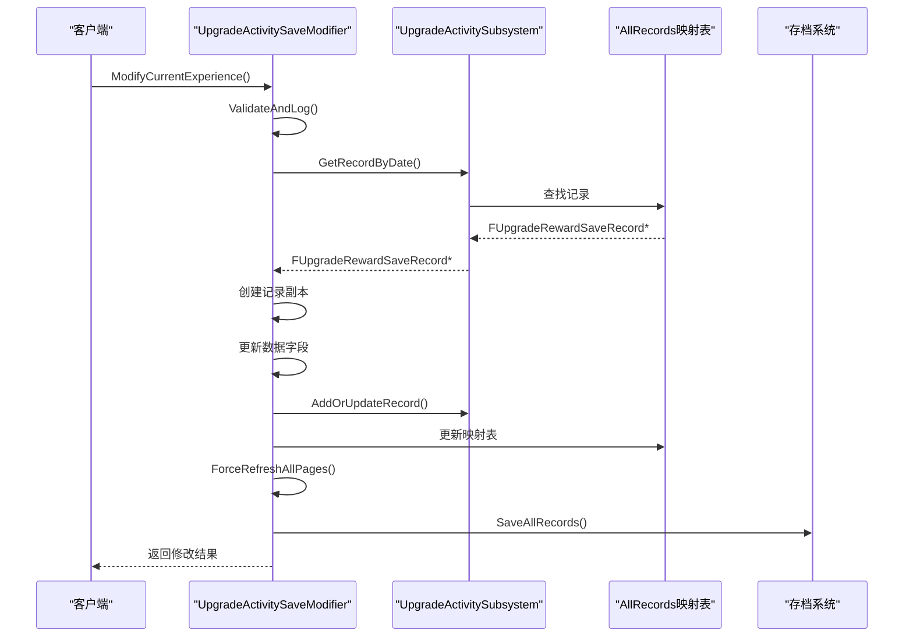

**图表来源**
- [UpgradeActivitySaveModifier.cpp](file://MetalSlug01/Source/MetalSlug01/Private/Tools/UpgradeActivitySaveModifier.cpp#L86-L130)
- [UpgradeActivitySubsystem.cpp](file://MetalSlug01/Source/MetalSlug01/Private/UI/Activity/Core/UpgradeActivitySubsystem.cpp#L189-L202)

#### 控制台命令系统

**更新** 系统已移除旧的复杂控制台命令实现，采用新的简化CreateNewRecord函数，提供更可靠和简化的调试功能。

**简化后的控制台命令：**

| 命令 | 参数 | 功能描述 |
|------|------|----------|
| `Upgrade.SetExp` | `[记录日期] [经验值]` | 设置指定日期的经验值 |
| `Upgrade.SetIcon` | `[记录日期] [图标索引]` | 设置奖励图标索引 |
| `Upgrade.SetChest` | `[记录日期] [宝箱索引] [状态]` | 设置宝箱领取状态 |
| `Upgrade.SetTaskCount` | `[记录日期] [任务索引] [数量]` | 设置任务完成次数 |
| `Upgrade.CreateRecord` | `[记录日期] [继承参数]` | 创建新记录（简化实现） |
| `Upgrade.Reset` | `[记录日期]` | 重置指定日期数据 |
| `Upgrade.ShowInfo` | `[记录日期]` | 显示记录详细信息 |
| `Upgrade.ShowAllInfo` | `[]` | 显示所有记录信息 |

**简化实现的优势：**
- **可靠性增强**：直接调用CreateNewRecord函数，避免复杂的参数解析
- **调试日志统一**：使用统一的[LIMITED_REWARD_DEBUG]前缀
- **错误处理改进**：更好的参数验证和错误处理机制
- **内存安全**：避免潜在的内存访问问题

**章节来源**
- [UpgradeActivitySaveModifier.cpp](file://MetalSlug01/Source/MetalSlug01/Private/Tools/UpgradeActivitySaveModifier.cpp#L960-L1011)
- [UpgradeActivitySaveModifier_Readme.md](file://UpgradeActivitySaveModifier_Readme.md#L9-L189)

### DailyUpgradeRewardPage 详细分析

DailyUpgradeRewardPage是升级活动的主要UI组件，实现了完整的用户交互功能。

#### UI组件架构

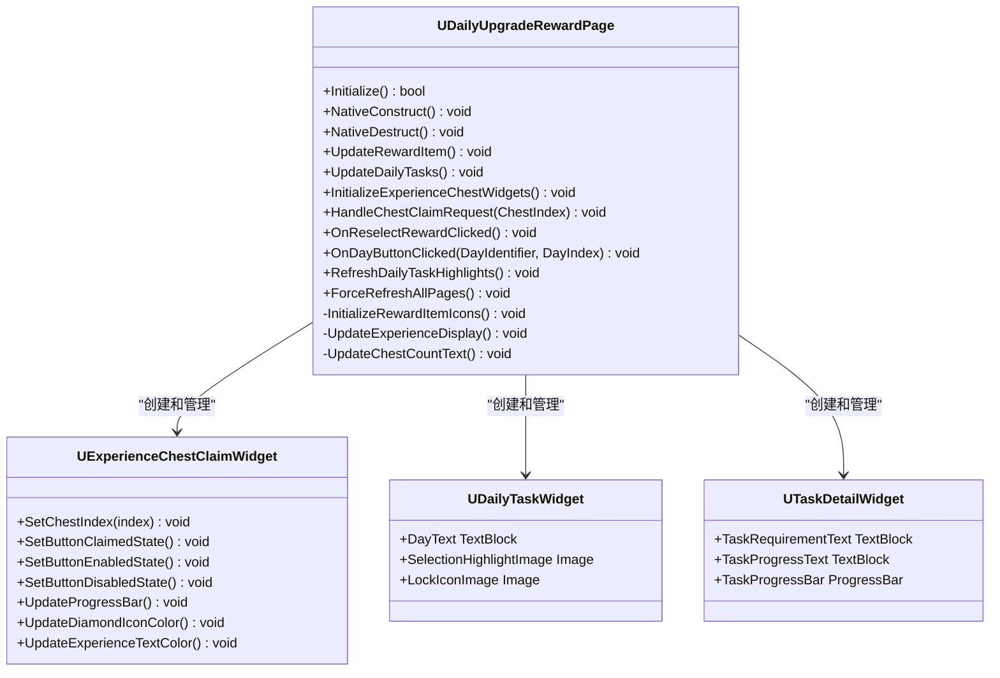

**图表来源**
- [DailyUpgradeRewardPage.h](file://MetalSlug01/Source/MetalSlug01/Public/UI/Activity/Pages/DailyUpgradeReward/DailyUpgradeRewardPage.h#L34-L411)
- [DailyUpgradeRewardPage.cpp](file://MetalSlug01/Source/MetalSlug01/Private/UI/Activity/Pages/DailyUpgradeReward/DailyUpgradeRewardPage.cpp#L428-L630)

#### 动态任务描述生成

**更新** 系统现在支持动态任务描述生成，根据任务完成情况实时生成任务描述。

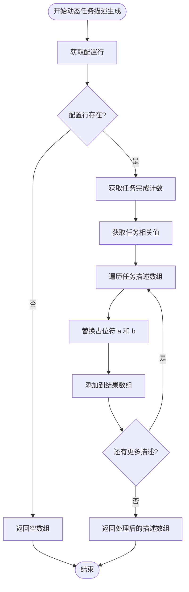

**图表来源**
- [UpgradeActivitySubsystem.cpp](file://MetalSlug01/Source/MetalSlug01/Private/UI/Activity/Core/UpgradeActivitySubsystem.cpp#L708-L788)
- [DailyUpgradeRewardPage.cpp](file://MetalSlug01/Source/MetalSlug01/Private/UI/Activity/Pages/DailyUpgradeReward/DailyUpgradeRewardPage.cpp#L842-L867)

#### 经验值管理系统

系统实现了完整的经验值管理机制：

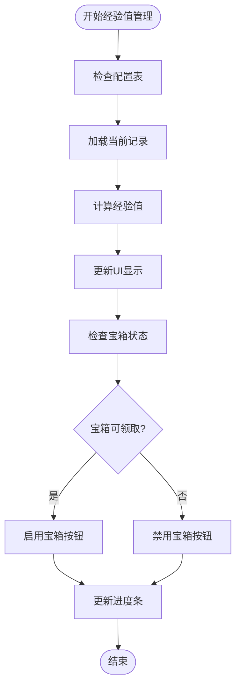

**图表来源**
- [DailyUpgradeRewardPage.cpp](file://MetalSlug01/Source/MetalSlug01/Private/UI/Activity/Pages/DailyUpgradeReward/DailyUpgradeRewardPage.cpp#L512-L540)
- [UpgradeActivitySubsystem.cpp](file://MetalSlug01/Source/MetalSlug01/Private/UI/Activity/Core/UpgradeActivitySubsystem.cpp#L235-L247)

#### 任务完成检测机制

系统实现了智能的任务完成检测和奖励发放机制：

**任务类型支持：**
- **游玩记录数**：统计玩家的对局次数
- **击杀数**：统计玩家的击杀次数
- **对局排名第一**：统计玩家获得第一名的次数
- **连续击杀3人**：统计玩家连续击杀3人的次数

**奖励发放逻辑：**
1. 检查任务完成度是否达到要求
2. 验证任务是否已领取
3. 更新任务状态为已领取
4. 增加玩家经验值
5. 持久化保存数据变更

**章节来源**
- [DailyUpgradeRewardPage.cpp](file://MetalSlug01/Source/MetalSlug01/Private/UI/Activity/Pages/DailyUpgradeReward/DailyUpgradeRewardPage.cpp#L681-L800)
- [UpgradeActivitySubsystem.cpp](file://MetalSlug01/Source/MetalSlug01/Private/UI/Activity/Core/UpgradeActivitySubsystem.cpp#L290-L340)

### DayLockHintWidget 详细分析

**更新** DayLockHintWidget是新增的重要UI组件，负责在天数锁定状态下显示奖励预览信息。

#### UI组件架构

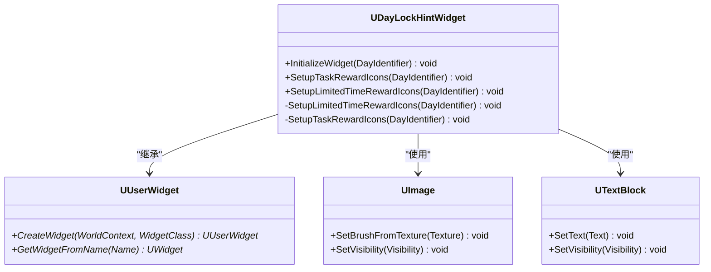

**图表来源**
- [DayLockHintWidget.h](file://MetalSlug01/Source/MetalSlug01/Public/UI/Activity/Pages/DailyUpgradeReward/DayLockHintWidget.h#L14-L58)
- [DayLockHintWidget.cpp](file://MetalSlug01/Source/MetalSlug01/Private/UI/Activity/Pages/DailyUpgradeReward/DayLockHintWidget.cpp#L14-L31)

#### 限时奖励图标系统

**更新** DayLockHintWidget实现了完整的限时奖励图标管理系统，包括容器状态管理和调试日志输出。

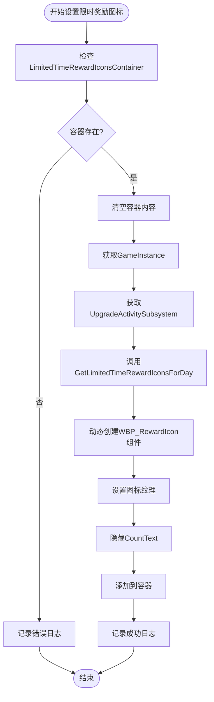

**图表来源**
- [DayLockHintWidget.cpp](file://MetalSlug01/Source/MetalSlug01/Private/UI/Activity/Pages/DailyUpgradeReward/DayLockHintWidget.cpp#L197-L322)

#### 调试日志系统

**更新** DayLockHintWidget提供了全面的调试日志系统，使用`[LIMITED_REWARD_DEBUG]`前缀确保日志的可追踪性。

**调试日志类型：**
- **容器状态调试**：检查LimitedTimeRewardIconsContainer的可见性和尺寸
- **图标加载调试**：验证图标纹理的有效性和画刷设置
- **组件创建调试**：跟踪WBP_RewardIcon组件的创建和配置过程
- **尺寸控制调试**：精确控制图标容器的尺寸和位置
- **纹理验证调试**：检查图标纹理的有效性和画刷分配

**调试日志示例：**
- `[LIMITED_REWARD_DEBUG] LimitedTimeRewardIconsContainer 可见性: 0`
- `[LIMITED_REWARD_DEBUG] 图标纹理有效 - 地址: 0x12345678, 名称: ItemIcon_Texture, 尺寸: 90x90`
- `[LIMITED_REWARD_DEBUG] RewardImage Brush设置成功 - 纹理匹配`

**章节来源**
- [DayLockHintWidget.cpp](file://MetalSlug01/Source/MetalSlug01/Private/UI/Activity/Pages/DailyUpgradeReward/DayLockHintWidget.cpp#L197-L322)

### UpgradeActivitySubsystem 详细分析

UpgradeActivitySubsystem是系统的核心业务逻辑层，负责管理升级活动的所有业务规则。

#### 数据模型设计

**更新** 系统现在使用AllRecords映射表管理所有记录，提供完整的多天记录支持。

```mermaid
erDiagram
FUpgradeRewardSaveRecord {
int32 RecordDate PK
int32 RewardIconIndex
int32 LimitedActivityCompleteCount
int32 CurrentExperience
int64 LimitedActivityStartTime
FDateTime CreatedTime
FDateTime LastUpdateTime
}
TMap~int32,FUpgradeRewardSaveRecord~ AllRecords {
TMap<int32, FUpgradeRewardSaveRecord> AllRecords
}
FPlayerLoginRecord {
int32 ActivityID PK
FString PlayerID
int32 Progress
int32 CurrentClaimCount
int32 ClaimedHistoryMask
TArray_int32_ ClaimedDays
int64 LastClaimTimestamp
FDateTime LastUpdateTime
}
FDailyUpgradeRewardConfigRow {
int32 ActivityID PK
FString DayIdentifier
TArray_FString_ RewardItemIDs
TArray_FString_ RewardItemCounts
TArray_EGameModeType_ GameModes
TArray_ETaskType_ TaskTypes
TArray_int32_ TaskRelatedValues
TArray_FString_ TaskDescriptions
FString BonusDescription
int32 BonusDurationHours
int32 BonusCount
TArray_int32_ BonusIDs
}
UDailyLoginSaveGame {
TMap_int32,FPlayerLoginRecord_ ActivityRecords
TMap_int32,FUpgradeRewardSaveRecord_ UpgradeRewardRecords
}
FUpgradeRewardSaveRecord ||--|| UDailyLoginSaveGame : "包含"
FPlayerLoginRecord ||--|| UDailyLoginSaveGame : "包含"
AllRecords ||--|| FUpgradeRewardSaveRecord : "管理"
```

**图表来源**
- [DailyLoginSave.h](file://MetalSlug01/Source/MetalSlug01/Public/UI/Activity/Data/DailyLoginSave.h#L233-L373)
- [DailyLoginConfig.h](file://MetalSlug01/Source/MetalSlug01/Public/UI/Activity/Data/DailyLoginConfig.h#L549-L622)

#### 业务逻辑处理

系统实现了复杂的业务逻辑处理机制：

**宝箱领取流程：**
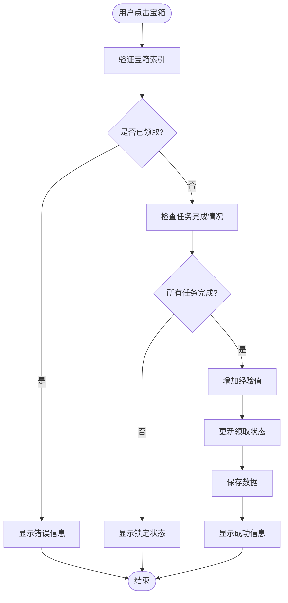

**图表来源**
- [UpgradeActivitySubsystem.cpp](file://MetalSlug01/Source/MetalSlug01/Private/UI/Activity/Core/UpgradeActivitySubsystem.cpp#L235-L247)
- [UpgradeActivitySubsystem.cpp](file://MetalSlug01/Source/MetalSlug01/Private/UI/Activity/Core/UpgradeActivitySubsystem.cpp#L352-L378)

**任务奖励流程：**
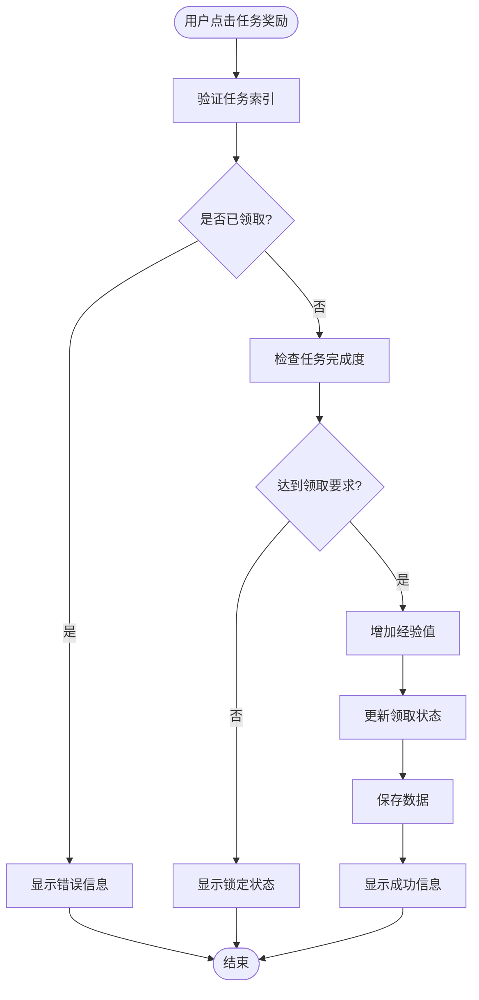

**图表来源**
- [UpgradeActivitySubsystem.cpp](file://MetalSlug01/Source/MetalSlug01/Private/UI/Activity/Core/UpgradeActivitySubsystem.cpp#L290-L340)

**记录继承流程：**
**更新** 系统现在支持记录继承，自动创建继承前一天数据的新记录。

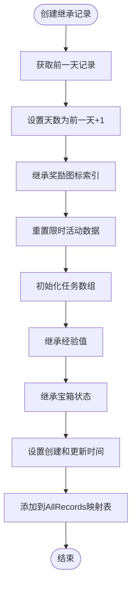

**图表来源**
- [UpgradeActivitySubsystem.cpp](file://MetalSlug01/Source/MetalSlug01/Private/UI/Activity/Core/UpgradeActivitySubsystem.cpp#L1235-L1285)

#### 动态任务描述生成

**更新** 系统现在支持动态任务描述生成，根据任务完成情况实时生成任务描述。

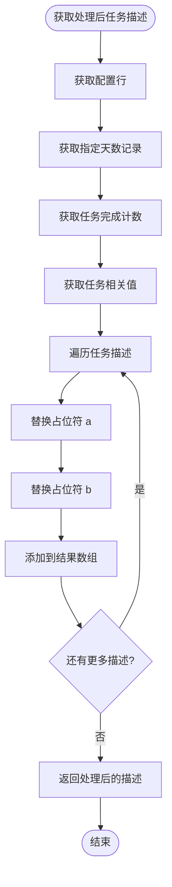

**图表来源**
- [UpgradeActivitySubsystem.cpp](file://MetalSlug01/Source/MetalSlug01/Private/UI/Activity/Core/UpgradeActivitySubsystem.cpp#L708-L788)

#### 内存与磁盘同步机制

**更新** 系统实现了增强的内存与磁盘同步机制，确保数据一致性：

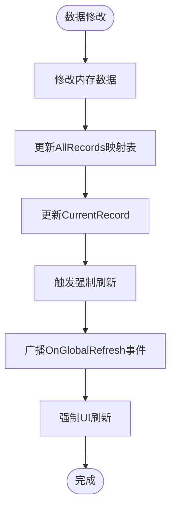

**图表来源**
- [UpgradeActivitySaveModifier.cpp](file://MetalSlug01/Source/MetalSlug01/Private/Tools/UpgradeActivitySaveModifier.cpp#L1094-L1118)
- [UpgradeActivitySubsystem.cpp](file://MetalSlug01/Source/MetalSlug01/Private/UI/Activity/Core/UpgradeActivitySubsystem.cpp#L112-L166)

#### 全面调试日志系统

**更新** 系统现在具备了全面的调试日志系统，特别是在GetLimitedTimeRewardIconsForDay函数中：

**调试日志前缀：** `[LIMITED_REWARD_DEBUG]`
**调试日志类型：**
- **配置数据调试**：检查配置行和BonusIDs数组
- **数据流调试**：跟踪从配置到图标加载的完整流程
- **错误处理调试**：记录无效数据和加载失败的情况
- **成功状态调试**：确认图标加载和添加成功的状态
- **容器状态调试**：检查UI容器的可见性和尺寸
- **纹理验证调试**：验证图标纹理的有效性和画刷设置

**调试日志示例：**
- `[LIMITED_REWARD_DEBUG] UUpgradeActivitySubsystem::GetLimitedTimeRewardIconsForDay: 未找到配置数据 - Day:day1`
- `[LIMITED_REWARD_DEBUG] UUpgradeActivitySubsystem::GetLimitedTimeRewardIconsForDay: 成功添加ItemIcon - ItemID: 1001, 纹理地址: 0x12345678, 名称: ItemIcon_Texture`
- `[LIMITED_REWARD_DEBUG] LimitedTimeRewardIconsContainer 可见性: 0`
- `[LIMITED_REWARD_DEBUG] 图标纹理有效 - 地址: 0x12345678, 名称: ItemIcon_Texture, 尺寸: 90x90`

**章节来源**
- [UpgradeActivitySubsystem.h](file://MetalSlug01/Source/MetalSlug01/Public/UI/Activity/Core/UpgradeActivitySubsystem.h#L198-L340)
- [DailyLoginSave.h](file://MetalSlug01/Source/MetalSlug01/Public/UI/Activity/Data/DailyLoginSave.h#L233-L343)
- [UpgradeActivitySubsystem.cpp](file://MetalSlug01/Source/MetalSlug01/Private/UI/Activity/Core/UpgradeActivitySubsystem.cpp#L1617-L1695)

## 依赖关系分析

升级活动系统具有清晰的依赖关系，确保模块间的松耦合和高内聚。

```mermaid
graph TB
subgraph "外部依赖"
UE[Unreal Engine 5.4+]
GameplayStatics[GameplayStatics]
DataTable[DataTable系统]
end
subgraph "内部模块"
SaveModifier[UpgradeActivitySaveModifier]
Subsystem[UpgradeActivitySubsystem]
UIPage[DailyUpgradeRewardPage]
DayLockHint[DayLockHintWidget]
SaveGame[UDailyLoginSaveGame]
Config[FDailyUpgradeRewardConfigRow]
AllRecords[AllRecords映射表]
DebugLogs[调试日志系统]
end
subgraph "工具组件"
ActivityTimeManager[ActivityTimeManager]
RedDotManager[RedDotManager]
ActivitySubsystem[ActivitySubsystem]
DebugTools[调试工具]
end
subgraph "数据模型"
FUpgradeRewardSaveRecord[FUpgradeRewardSaveRecord]
FPlayerLoginRecord[FPlayerLoginRecord]
end
subgraph "调试系统"
ForceRefresh[强制刷新机制]
DebugLogs[调试日志系统]
DebugTools[调试工具]
end
subgraph "UI组件"
RewardIconWidget[WBP_RewardIcon]
ExperienceChestWidget[ExperienceChestClaimWidget]
end
subgraph "增强调试系统"
LimitedRewardDebug[LIMITED_REWARD_DEBUG调试]
RewardIconDebug[REWARD_ICON_DEBUG调试]
SetExpDebug[SET_EXP_DEBUG调试]
end
subgraph "数据验证系统"
ParamValidation[参数验证]
DataFlowDebug[数据流调试]
ErrorHandling[错误处理]
end
subgraph "任务继承系统"
InheritBehavior[继承行为控制]
NonInheritBehavior[非继承行为控制]
end
subgraph "UI显示系统"
ContainerSize[容器尺寸控制]
CountTextVisibility[CountText可见性控制]
```

**图表来源**
- [UpgradeActivitySaveModifier.cpp](file://MetalSlug01/Source/MetalSlug01/Private/Tools/UpgradeActivitySaveModifier.cpp#L12-L18)
- [UpgradeActivitySubsystem.cpp](file://MetalSlug01/Source/MetalSlug01/Private/UI/Activity/Core/UpgradeActivitySubsystem.cpp#L16-L22)
- [DayLockHintWidget.cpp](file://MetalSlug01/Source/MetalSlug01/Private/UI/Activity/Pages/DailyUpgradeReward/DayLockHintWidget.cpp#L1-L12)

### 核心依赖关系

1. **数据依赖**：所有组件都依赖于UDailyLoginSaveGame进行数据持久化
2. **配置依赖**：通过FDailyUpgradeRewardConfigRow提供业务规则配置
3. **UI依赖**：DailyUpgradeRewardPage和DayLockHintWidget依赖于各种UI组件进行展示
4. **系统依赖**：依赖GameplayStatics进行存档操作
5. **映射表依赖**：AllRecords映射表依赖于FUpgradeRewardSaveRecord数据模型
6. **事件依赖**：依赖OnGlobalRefresh事件实现UI强制刷新
7. **调试依赖**：依赖统一的调试日志前缀实现全面的日志系统
8. **数据验证依赖**：在各个关键操作中添加参数验证和错误处理
9. **任务继承依赖**：明确区分继承和非继承行为
10. **UI显示依赖**：精确的容器尺寸和可见性控制

### 循环依赖检测

系统设计避免了循环依赖：
- UI层不直接依赖数据层
- 数据层不依赖UI层
- 业务逻辑层作为中介协调两者
- 存档系统提供统一的数据访问接口
- AllRecords映射表提供数据同步机制
- 强制刷新机制确保UI与数据同步
- 调试日志系统提供独立的监控能力
- 数据验证机制确保操作的安全性
- 任务继承机制确保数据一致性

**章节来源**
- [UpgradeActivitySaveModifier.h](file://MetalSlug01/Source/MetalSlug01/Public/Tools/UpgradeActivitySaveModifier.h#L15-L19)
- [UpgradeActivitySubsystem.h](file://MetalSlug01/Source/MetalSlug01/Public/UI/Activity/Core/UpgradeActivitySubsystem.h#L13-L18)
- [DayLockHintWidget.h](file://MetalSlug01/Source/MetalSlug01/Public/UI/Activity/Pages/DailyUpgradeReward/DayLockHintWidget.h#L14-L18)

## 性能考虑

升级活动系统在设计时充分考虑了性能优化，采用了多种优化策略：

### 内存管理优化

1. **延迟加载**：配置表采用延迟加载策略，减少启动时的内存占用
2. **缓存机制**：频繁访问的数据通过缓存机制提高访问速度
3. **弱引用**：使用TWeakObjectPtr避免循环引用导致的内存泄漏
4. **映射表优化**：AllRecords映射表提供O(1)的查找性能
5. **强制刷新优化**：通过事件机制避免不必要的UI重建
6. **调试日志优化**：详细的日志系统不影响运行时性能
7. **数据验证优化**：在关键操作中添加高效的参数验证
8. **任务继承优化**：明确的继承逻辑减少数据处理开销

### 数据访问优化

1. **批量操作**：支持批量数据修改，减少多次存档操作
2. **增量更新**：只更新发生变化的数据，避免全量覆盖
3. **异步加载**：UI资源采用异步加载，提升用户体验
4. **数据同步**：自动同步AllRecords映射表与CurrentRecord，避免数据不一致
5. **调试日志优化**：统一的调试前缀确保日志输出的可追踪性
6. **纹理缓存**：图标纹理通过LoadSynchronous进行缓存加载
7. **参数验证优化**：高效的索引验证和边界检查

### UI渲染优化

1. **虚拟化滚动**：使用ScrollBox的虚拟化功能，减少大量UI组件的创建
2. **懒加载**：UI组件按需创建和销毁，避免不必要的内存占用
3. **状态缓存**：UI状态通过缓存机制避免重复计算
4. **动态描述生成**：通过配置表驱动的动态描述生成，减少硬编码
5. **强制刷新优化**：通过事件机制实现精确的UI更新
6. **容器尺寸优化**：精确控制图标容器的尺寸和位置
7. **CountText可见性优化**：根据数据有效性动态控制文本显示
8. **调试日志性能优化**：在非调试模式下减少日志输出

## 故障排除指南

### 常见问题及解决方案

#### 存档加载失败

**问题症状：**
- 系统无法加载之前的升级进度
- 新游戏时没有初始数据

**解决步骤：**
1. 检查存档文件是否存在
2. 验证存档数据的完整性
3. 重新创建存档文件
4. 检查存档槽位配置

**相关代码路径：**
- [UpgradeActivitySubsystem.cpp](file://MetalSlug01/Source/MetalSlug01/Private/UI/Activity/Core/UpgradeActivitySubsystem.cpp#L100-L159)

#### UI显示异常

**问题症状：**
- 奖励物品图标不显示
- 宝箱状态显示错误
- 任务进度不更新
- 动态任务描述不正确
- UI与数据不一致
- **限时奖励图标容器尺寸异常**
- **CountText可见性控制失效**
- **调试日志输出异常**

**解决步骤：**
1. 检查配置表数据是否正确
2. 验证UI组件绑定是否正确
3. 确认事件订阅是否正常
4. 检查资源文件是否加载成功
5. 验证AllRecords映射表数据一致性
6. 检查强制刷新机制是否正常工作
7. **验证LimitedTimeRewardIconsContainer的尺寸设置**
8. **检查CountText的可见性控制逻辑**
9. **检查[LIMITED_REWARD_DEBUG]调试日志输出**

**相关代码路径：**
- [DailyUpgradeRewardPage.cpp](file://MetalSlug01/Source/MetalSlug01/Private/UI/Activity/Pages/DailyUpgradeReward/DailyUpgradeRewardPage.cpp#L175-L281)
- [UpgradeActivitySubsystem.cpp](file://MetalSlug01/Source/MetalSlug01/Private/UI/Activity/Core/UpgradeActivitySubsystem.cpp#L708-L788)
- [DayLockHintWidget.cpp](file://MetalSlug01/Source/MetalSlug01/Private/UI/Activity/Pages/DailyUpgradeReward/DayLockHintWidget.cpp#L197-L322)

#### 数据同步问题

**问题症状：**
- UI显示与实际数据不一致
- 修改操作后数据未保存
- AllRecords映射表数据不一致
- 强制刷新无效

**解决步骤：**
1. 检查数据修改器的调用
2. 验证存档保存操作
3. 确认事件广播机制
4. 检查内存数据同步
5. 验证AddOrUpdateRecord方法调用
6. 检查ForceRefreshAllPages方法执行

**相关代码路径：**
- [UpgradeActivitySaveModifier.cpp](file://MetalSlug01/Source/MetalSlug01/Private/Tools/UpgradeActivitySaveModifier.cpp#L565-L590)
- [UpgradeActivitySaveModifier.cpp](file://MetalSlug01/Source/MetalSlug01/Private/Tools/UpgradeActivitySaveModifier.cpp#L199-L217)
- [UpgradeActivitySaveModifier.cpp](file://MetalSlug01/Source/MetalSlug01/Private/Tools/UpgradeActivitySaveModifier.cpp#L1094-L1118)

#### 调试日志问题

**问题症状：**
- **调试日志输出异常**
- **GetLimitedTimeRewardIconsForDay函数缺少调试信息**
- **UI调试日志缺失**
- **调试前缀不一致**
- **数据验证日志缺失**

**解决步骤：**
1. **检查调试日志前缀是否使用[LIMITED_REWARD_DEBUG]**
2. **验证GetLimitedTimeRewardIconsForDay函数的调试输出**
3. **确认DayLockHintWidget的调试日志配置**
4. **检查调试日志的输出级别设置**
5. **验证调试日志的过滤和搜索功能**
6. **检查数据验证日志的输出**
7. **验证参数验证机制的正确性**

**相关代码路径：**
- [UpgradeActivitySubsystem.cpp](file://MetalSlug01/Source/MetalSlug01/Private/UI/Activity/Core/UpgradeActivitySubsystem.cpp#L1617-L1695)
- [DayLockHintWidget.cpp](file://MetalSlug01/Source/MetalSlug01/Private/UI/Activity/Pages/DailyUpgradeReward/DayLockHintWidget.cpp#L197-L322)
- [UpgradeActivitySaveModifier.cpp](file://MetalSlug01/Source/MetalSlug01/Private/Tools/UpgradeActivitySaveModifier.cpp#L1186-L1215)

### 调试工具使用

**更新** 系统提供了丰富的调试工具帮助开发者定位问题，包括简化后的控制台命令系统。

#### 简化后的控制台命令使用

**简化实现的优势：**
- **可靠性增强**：直接调用CreateNewRecord函数，避免复杂的参数解析
- **调试日志统一**：使用统一的[LIMITED_REWARD_DEBUG]前缀
- **错误处理改进**：更好的参数验证和错误处理机制
- **内存安全**：避免潜在的内存访问问题

**常用调试命令：**
```bash
# 设置经验值
Upgrade.SetExp 1 1000

# 设置奖励图标
Upgrade.SetIcon 1 2

# 设置宝箱状态
Upgrade.SetChest 1 0 1

# 设置任务完成次数
Upgrade.SetTaskCount 1 0 5

# 创建新记录（简化实现）
Upgrade.CreateRecord 2 1

# 重置数据
Upgrade.Reset 1

# 显示AllRecords状态
Upgrade.ShowAllInfo
```

**章节来源**
- [UpgradeActivitySaveModifier_Readme.md](file://UpgradeActivitySaveModifier_Readme.md#L134-L189)
- [UpgradeActivitySaveModifier.cpp](file://MetalSlug01/Source/MetalSlug01/Private/Tools/UpgradeActivitySaveModifier.cpp#L960-L1011)
- [UpgradeActivitySubsystem.cpp](file://MetalSlug01/Source/MetalSlug01/Private/UI/Activity/Core/UpgradeActivitySubsystem.cpp#L1617-L1695)

## 结论

MetalSlug升级活动系统是一个设计精良、功能完整的升级奖励解决方案。系统采用模块化架构，通过清晰的分层设计实现了业务逻辑与UI展示的分离，确保了代码的可维护性和扩展性。

**系统优势：**
1. **模块化设计**：各组件职责明确，耦合度低
2. **多天记录管理**：通过AllRecords映射表支持完整的7天记录生命周期
3. **数据持久化**：完整的存档系统支持跨会话数据保存
4. **灵活配置**：通过配置表实现业务规则的灵活调整
5. **丰富功能**：支持多种任务类型和奖励机制
6. **动态描述生成**：根据任务完成情况动态生成任务描述
7. **调试友好**：提供完整的调试工具和日志系统
8. **性能优化**：通过映射表和缓存机制提升性能
9. **UI强制刷新**：确保内存数据与UI显示完全同步
10. **内存磁盘同步**：增强的数据一致性保障机制
11. **全面调试系统**：统一的调试前缀和详细的日志输出
12. **UI显示修复**：精确的容器尺寸控制和CountText可见性管理
13. **增强数据验证**：在各个关键操作中添加参数验证和错误处理
14. **优化任务继承**：明确的任务数据继承和非继承行为

**更新亮点：**
1. **体验点管理优化**：改进的经验值计算和管理机制
2. **数据持久化增强**：优化的存档保存和加载流程
3. **历史记录管理完善**：完整的记录生命周期管理
4. **UI刷新修复**：强制刷新机制确保数据与显示同步
5. **内存磁盘同步改进**：AllRecords映射表与CurrentRecord一致性保障
6. **调试日志增强**：为GetLimitedTimeRewardIconsForDay函数添加全面的调试日志系统
7. **UI显示修复**：改进了奖励图标容器尺寸和CountText可见性控制
8. **数据处理验证增强**：增强了奖励图标设置过程中的数据处理、纹理验证和画刷分配调试
9. **任务继承优化**：明确区分继承和非继承行为，确保数据一致性
10. **参数验证增强**：在各个关键操作中添加详细的参数验证和错误处理
11. **简化控制台命令**：移除旧的复杂实现，采用新的CreateNewRecord函数

**扩展性特点：**
1. **易于添加新任务**：通过配置表即可添加新的任务类型
2. **灵活的奖励机制**：支持自定义奖励物品和数量
3. **可扩展的UI组件**：通过蓝图系统实现UI的定制化
4. **模块化业务逻辑**：业务规则通过配置表实现，便于修改
5. **继承记录机制**：支持自动创建继承前一天数据的新记录
6. **强制刷新机制**：确保UI与数据的实时同步
7. **统一调试系统**：通过[LIMITED_REWARD_DEBUG]前缀实现全面的调试支持
8. **精确UI控制**：容器尺寸和可见性控制的优化
9. **增强数据验证**：在各个关键操作中添加参数验证和错误处理
10. **优化任务继承**：明确的任务数据继承和非继承行为

该系统为游戏开发者提供了一个强大而灵活的升级活动框架，可以根据具体需求进行定制和扩展。

## 附录

### API参考

#### UpgradeActivitySaveModifier API

| 方法 | 参数 | 返回值 | 描述 |
|------|------|--------|------|
| `InitializeModifier` | `WorldContext, Subsystem` | `bool` | 初始化修改器 |
| `ModifyCurrentExperience` | `RecordDate, NewExp, bAutoSave` | `bool` | 修改当前经验值 |
| `ModifyRewardIconIndex` | `RecordDate, NewIndex, bAutoSave` | `bool` | 修改奖励图标索引 |
| `ModifyChestClaimStatus` | `RecordDate, ChestIndex, IsClaimed, bAutoSave` | `bool` | 修改宝箱领取状态 |
| `ModifyTaskCompleteCount` | `RecordDate, TaskIndex, Count, bAutoSave` | `bool` | 修改任务完成次数 |
| `ModifyTaskClaimStatus` | `RecordDate, TaskIndex, IsClaimed, bAutoSave` | `bool` | 修改任务领取状态 |
| `ModifyLimitedActivityCount` | `RecordDate, Count, bAutoSave` | `bool` | 修改限时活动完成次数 |
| `CreateNewRecord` | `RecordDate, bInheritPrevious, bAutoSave` | `bool` | 创建新记录（简化实现） |
| `ResetRecordData` | `RecordDate, bAutoSave` | `bool` | 重置记录数据 |
| `SaveAllRecords` | `void` | `bool` | 保存所有记录 |
| `LoadRecord` | `RecordDate` | `bool` | 加载指定记录 |
| `AddOrUpdateRecord` | `RecordDate, Record` | `void` | 添加或更新记录到AllRecords映射表 |
| `ForceRefreshAllPages` | `void` | `void` | 强制刷新所有页面 |

#### DailyUpgradeRewardPage API

| 方法 | 参数 | 返回值 | 描述 |
|------|------|--------|------|
| `Initialize` | `void` | `bool` | 初始化UI组件 |
| `NativeConstruct` | `void` | `void` | 构造函数完成 |
| `NativeDestruct` | `void` | `void` | 析构函数 |
| `UpdateRewardItem` | `void` | `void` | 更新奖励物品显示 |
| `UpdateDailyTasks` | `void` | `void` | 更新每日任务列表 |
| `InitializeExperienceChestWidgets` | `void` | `void` | 初始化经验宝箱 |
| `HandleChestClaimRequest` | `ChestIndex` | `void` | 处理宝箱领取请求 |
| `OnReselectRewardClicked` | `void` | `void` | 处理重选奖励点击 |
| `OnDayButtonClicked` | `DayIdentifier, DayIndex` | `void` | 处理天数按钮点击 |
| `RefreshDailyTaskHighlights` | `void` | `void` | 刷新每日任务高亮状态 |
| `ForceRefreshAllPages` | `void` | `void` | 强制刷新所有页面 |

#### DayLockHintWidget API

| 方法 | 参数 | 返回值 | 描述 |
|------|------|--------|------|
| `InitializeWidget` | `DayIdentifier` | `void` | 初始化锁定提示Widget |
| `SetupTaskRewardIcons` | `DayIdentifier` | `void` | 设置任务奖励图标 |
| `SetupLimitedTimeRewardIcons` | `DayIdentifier` | `void` | 设置限时奖励图标 |

#### UpgradeActivitySubsystem API

| 方法 | 参数 | 返回值 | 描述 |
|------|------|--------|------|
| `Initialize` | `Collection` | `void` | 初始化子系统 |
| `Deinitialize` | `void` | `void` | 去初始化子系统 |
| `ClaimChest` | `ChestIndex` | `bool` | 领取宝箱奖励 |
| `ClaimTaskReward` | `TaskIndex` | `bool` | 领取任务奖励 |
| `UpdateTaskProgress` | `TaskIndex, Count` | `void` | 更新任务进度 |
| `CanClaimChest` | `ChestIndex` | `bool` | 检查宝箱是否可领取 |
| `CanClaimTask` | `TaskIndex` | `bool` | 检查任务是否可领取 |
| `GetRewardItemIcons` | `void` | `TArray` | 获取奖励物品图标 |
| `GetLimitedTimeRewardIconsForDay` | `DayIdentifier` | `TArray` | 获取限时奖励图标 |
| `GetChestBoxIcons` | `void` | `TArray` | 获取宝箱图标 |
| `GetTaskRelatedValues` | `void` | `TArray` | 获取任务相关数值 |
| `GetCurrentExperience` | `void` | `int32` | 获取当前经验值 |
| `GetAllRecords` | `void` | `TMap` | 获取所有记录映射表 |
| `GetRecordByDate` | `RecordDate` | `FUpgradeRewardSaveRecord*` | 获取指定天数的记录 |
| `AddOrUpdateRecord` | `RecordDate, Record` | `void` | 添加或更新记录 |
| `GetProcessedTaskDescriptionsForDay` | `DayIdentifier` | `TArray` | 获取指定天数的处理后任务描述 |
| `GetProcessedTaskDescriptionsForCurrentDay` | `void` | `TArray` | 获取当前天的处理后任务描述 |
| `ProcessSaveRecordLogic` | `void` | `void` | 处理存档数据逻辑 |
| `CreateInheritedRecord` | `PreviousRecord` | `void` | 创建继承记录 |
| `ReloadLatestRecord` | `void` | `void` | 重新加载最新的记录 |
| `GetMaxRecordDate` | `void` | `int32` | 获取最大记录日期 |
| `HasDayDataInMemory` | `DayNumber` | `bool` | 检查内存中是否存在指定天数的数据 |
| `GetDailyTaskHighlightStates` | `void` | `TArray` | 获取每日任务高亮状态数组 |
| `GetDailyTaskLockStates` | `void` | `TArray` | 获取每日任务锁定状态数组 |

### 使用示例

#### 基本使用流程

```cpp
// 初始化升级活动系统
UUpgradeActivitySubsystem* Subsystem = GetGameInstance()->GetSubsystem<UUpgradeActivitySubsystem>();
Subsystem->Initialize();

// 更新任务进度
Subsystem->UpdateTaskProgress(0, 5);

// 领取任务奖励
if (Subsystem->CanClaimTask(0)) {
    Subsystem->ClaimTaskReward(0);
}

// 领取宝箱奖励
if (Subsystem->CanClaimChest(0)) {
    Subsystem->ClaimChest(0);
}

// 获取动态任务描述
TArray<FString> Descriptions = Subsystem->GetProcessedTaskDescriptionsForCurrentDay();
```

#### 通过简化控制台调试

**更新** 使用新的简化控制台命令进行调试：

```bash
# 设置经验值
Upgrade.SetExp 1 1000

# 设置奖励图标
Upgrade.SetIcon 1 2

# 设置宝箱状态
Upgrade.SetChest 1 0 1

# 设置任务完成次数
Upgrade.SetTaskCount 1 0 5

# 创建新记录（简化实现）
Upgrade.CreateRecord 2 1

# 重置数据
Upgrade.Reset 1

# 显示AllRecords状态
Upgrade.ShowAllInfo
```

#### 调试日志使用

**更新** 使用统一的[LIMITED_REWARD_DEBUG]前缀：

```bash
# 查看限时奖励图标调试信息
[LIMITED_REWARD_DEBUG] UUpgradeActivitySubsystem::GetLimitedTimeRewardIconsForDay: Day:day1, BonusIDs数量: 2

# 查看UI调试信息
[LIMITED_REWARD_DEBUG] LimitedTimeRewardIconsContainer 可见性: 0
[LIMITED_REWARD_DEBUG] 图标纹理有效 - 地址: 0x12345678, 名称: ItemIcon_Texture, 尺寸: 90x90
```

### 扩展开发指南

#### 添加新的升级任务

1. **配置新任务类型**：在FDailyUpgradeRewardConfigRow中添加新的任务配置
2. **实现任务逻辑**：在UpgradeActivitySubsystem中添加相应的业务逻辑
3. **更新UI组件**：在DailyUpgradeRewardPage中添加新的任务显示组件
4. **测试验证**：使用简化后的控制台命令测试新任务功能
5. **验证动态描述**：确保新任务能够正确生成动态描述
6. **检查强制刷新**：确保新任务状态能够正确更新UI

#### 自定义奖励机制

1. **定义奖励类型**：在FDailyUpgradeRewardConfigRow中配置奖励物品
2. **实现奖励逻辑**：在UpgradeActivitySubsystem中添加奖励发放逻辑
3. **更新UI显示**：在DailyUpgradeRewardPage中添加奖励物品显示
4. **测试验证**：验证奖励发放的正确性和UI显示效果
5. **验证图标获取**：确保奖励图标能够正确加载
6. **检查数据同步**：确保奖励数据与AllRecords映射表同步

#### 性能优化建议

1. **使用缓存机制**：对频繁访问的数据使用缓存
2. **延迟加载资源**：UI资源采用异步加载方式
3. **批量数据操作**：合并多次数据修改操作
4. **内存管理**：及时释放不需要的资源引用
5. **映射表优化**：利用AllRecords映射表的O(1)查找性能
6. **数据同步**：确保AllRecords映射表与CurrentRecord的一致性
7. **强制刷新优化**：通过事件机制实现精确的UI更新
8. **调试日志优化**：统一的调试前缀不影响运行时性能
9. **UI容器优化**：精确控制容器尺寸和可见性
10. **纹理缓存优化**：图标纹理的高效加载和缓存
11. **数据验证优化**：高效的参数验证和错误处理
12. **任务继承优化**：明确的继承逻辑减少数据处理开销

#### 多天记录管理

1. **理解记录结构**：了解FUpgradeRewardSaveRecord的数据结构
2. **使用AllRecords映射表**：通过映射表管理所有记录
3. **实现继承逻辑**：使用CreateInheritedRecord创建新记录
4. **处理记录加载**：使用ReloadLatestRecord重新加载记录
5. **验证数据一致性**：确保AllRecords与CurrentRecord同步
6. **检查强制刷新**：确保新记录能够正确更新UI显示

#### 调试系统扩展

1. **统一调试前缀**：使用[LIMITED_REWARD_DEBUG]前缀确保日志一致性
2. **UI调试增强**：为DayLockHintWidget添加更多调试输出
3. **数据流调试**：跟踪从配置到UI的完整数据流
4. **错误处理调试**：记录和处理各种异常情况
5. **性能监控调试**：监控关键操作的性能指标
6. **容器状态调试**：验证UI容器的尺寸和可见性设置
7. **参数验证调试**：在各个关键操作中添加参数验证和错误处理
8. **任务继承调试**：验证任务数据继承和非继承行为

**章节来源**
- [UpgradeActivitySaveModifier.h](file://MetalSlug01/Source/MetalSlug01/Public/Tools/UpgradeActivitySaveModifier.h#L62-L222)
- [DailyUpgradeRewardPage.h](file://MetalSlug01/Source/MetalSlug01/Public/UI/Activity/Pages/DailyUpgradeReward/DailyUpgradeRewardPage.h#L42-L128)
- [DayLockHintWidget.h](file://MetalSlug01/Source/MetalSlug01/Public/UI/Activity/Pages/DailyUpgradeReward/DayLockHintWidget.h#L41-L58)
- [UpgradeActivitySubsystem.h](file://MetalSlug01/Source/MetalSlug01/Public/UI/Activity/Core/UpgradeActivitySubsystem.h#L198-L410)
- [UpgradeActivitySubsystem.cpp](file://MetalSlug01/Source/MetalSlug01/Private/UI/Activity/Core/UpgradeActivitySubsystem.cpp#L1617-L1695)
- [DayLockHintWidget.cpp](file://MetalSlug01/Source/MetalSlug01/Private/UI/Activity/Pages/DailyUpgradeReward/DayLockHintWidget.cpp#L197-L322)