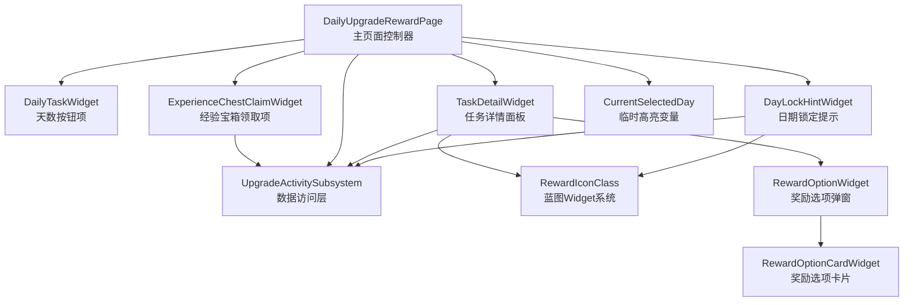
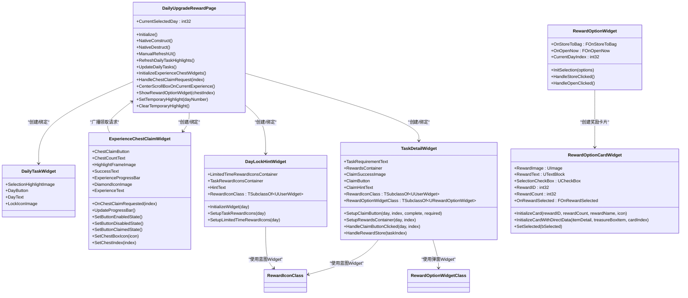
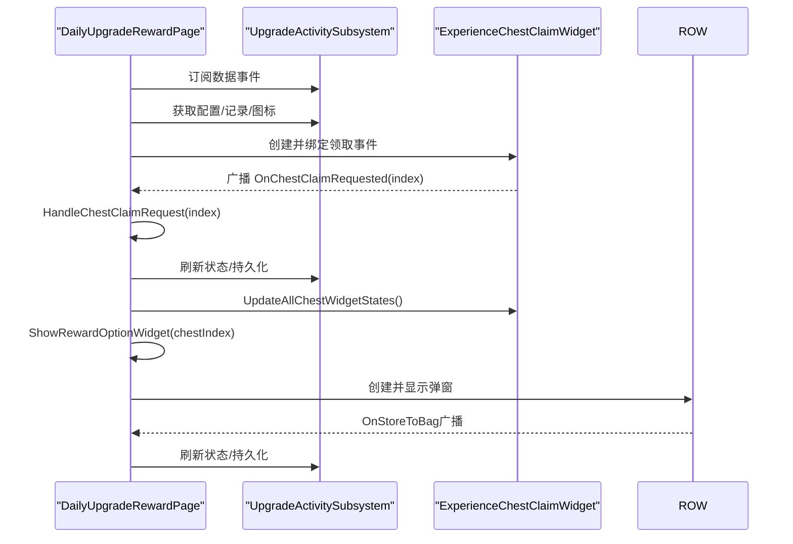
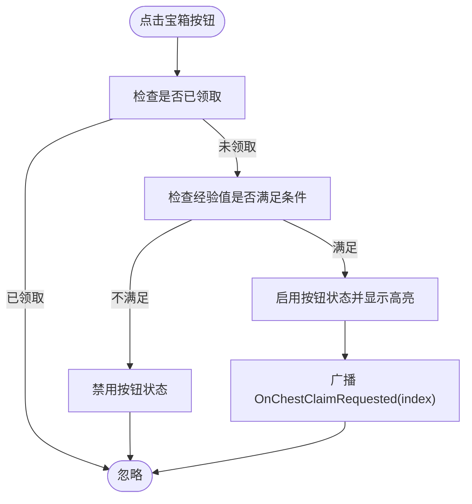
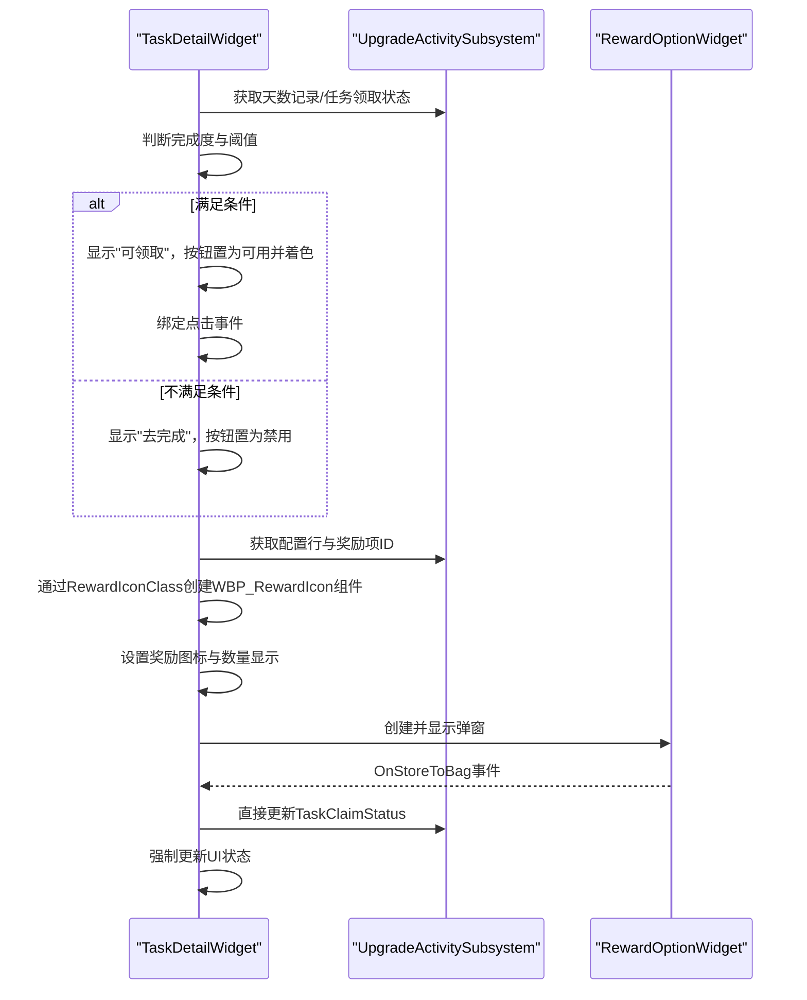
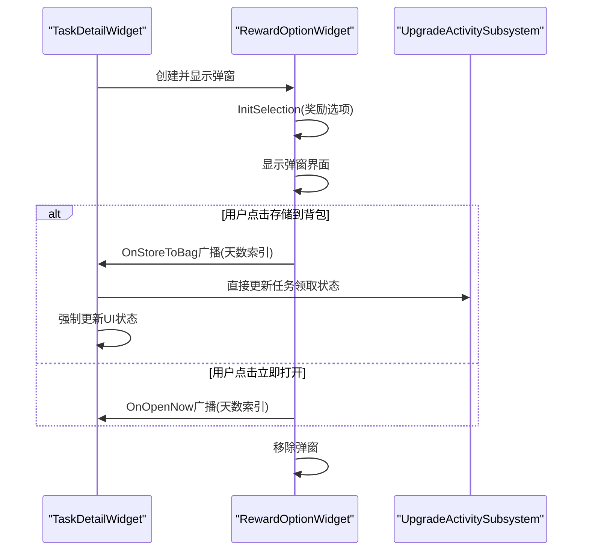
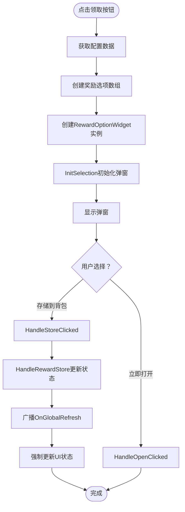
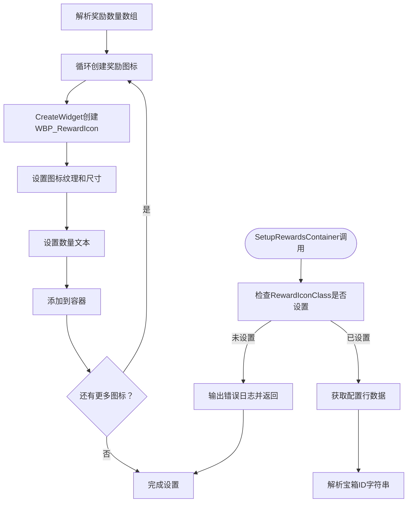
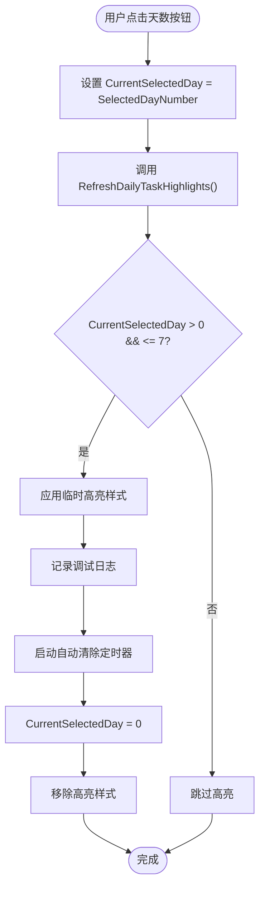
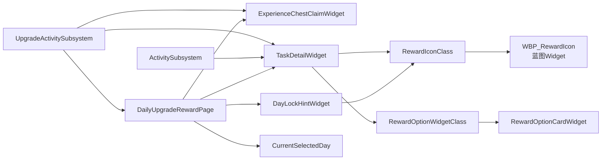

# 每日升级奖励页面

<cite>
**本文引用的文件**
- [DailyUpgradeRewardPage.cpp](file://MetalSlug01/Source/MetalSlug01/Private/UI/Activity/Pages/DailyUpgradeReward/DailyUpgradeRewardPage.cpp)
- [DailyUpgradeRewardPage.h](file://MetalSlug01/Source/MetalSlug01/Public/UI/Activity/Pages/DailyUpgradeReward/DailyUpgradeRewardPage.h)
- [DailyTaskWidget.h](file://MetalSlug01/Source/MetalSlug01/Public/UI/Activity/Pages/DailyUpgradeReward/DailyTaskWidget.h)
- [DailyTaskWidget.cpp](file://MetalSlug01/Source/MetalSlug01/Private/UI/Activity/Pages/DailyUpgradeReward/DailyTaskWidget.cpp)
- [ExperienceChestClaimWidget.h](file://MetalSlug01/Source/MetalSlug01/Public/UI/Activity/Pages/DailyUpgradeReward/ExperienceChestClaimWidget.h)
- [ExperienceChestClaimWidget.cpp](file://MetalSlug01/Source/MetalSlug01/Private/UI/Activity/Pages/DailyUpgradeReward/ExperienceChestClaimWidget.cpp)
- [TaskDetailWidget.h](file://MetalSlug01/Source/MetalSlug01/Public/UI/Activity/Pages/DailyUpgradeReward/TaskDetailWidget.h)
- [TaskDetailWidget.cpp](file://MetalSlug01/Source/MetalSlug01/Private/UI/Activity/Pages/DailyUpgradeReward/TaskDetailWidget.cpp)
- [DayLockHintWidget.h](file://MetalSlug01/Source/MetalSlug01/Public/UI/Activity/Pages/DailyUpgradeReward/DayLockHintWidget.h)
- [DayLockHintWidget.cpp](file://MetalSlug01/Source/MetalSlug01/Private/UI/Activity/Pages/DailyUpgradeReward/DayLockHintWidget.cpp)
- [RewardOptionWidget.h](file://MetalSlug01/Source/MetalSlug01/Public/UI/Activity/Pages/ClaimBox/RewardOptionWidget.h)
- [RewardOptionWidget.cpp](file://MetalSlug01/Source/MetalSlug01/Private/UI/Activity/Pages/ClaimBox/RewardOptionWidget.cpp)
- [RewardOptionCardWidget.h](file://MetalSlug01/Source/MetalSlug01/Public/UI/Activity/Pages/SelectMultiplePopup/RewardOptionCardWidget.h)
- [RewardOptionCardWidget.cpp](file://MetalSlug01/Source/MetalSlug01/Private/UI/Activity/Pages/SelectMultiplePopup/RewardOptionCardWidget.cpp)
</cite>

## 更新摘要
**所做更改**
- TaskDetailWidget重大重构：claim按钮系统、可见性管理、奖励选择系统全面升级
- RewardOptionCardWidget优化：直接数据初始化、性能提升、事件处理增强
- UI交互增强：自动奖励图标尺寸、字体处理、错误报告系统完善
- 蓝图Widget系统标准化：统一的奖励图标组件化管理
- 弹窗组件系统：RewardOptionWidget与RewardOptionCardWidget协同工作机制

## 目录
1. [简介](#简介)
2. [项目结构](#项目结构)
3. [核心组件](#核心组件)
4. [架构总览](#架构总览)
5. [组件详解](#组件详解)
6. [奖励领取系统增强](#奖励领取系统增强)
7. [奖励图标系统重构](#奖励图标系统重构)
8. [临时高亮功能](#临时高亮功能)
9. [依赖关系分析](#依赖关系分析)
10. [性能考量](#性能考量)
11. [故障排查指南](#故障排查指南)
12. [结论](#结论)
13. [附录](#附录)

## 简介
本技术文档围绕 MetalSlug 的"每日升级奖励页面"系统展开，聚焦于 DailyUpgradeRewardPage 主页面的设计架构与布局逻辑，以及其子组件（DailyTaskWidget、ExperienceChestClaimWidget、TaskDetailWidget、DayLockHintWidget）的实现细节。文档将从系统架构、数据流、事件处理、样式与交互、导航与绑定机制等方面进行深入剖析，并提供可视化图表帮助理解。

**更新** 系统现已集成了全新的RewardOptionWidget弹窗系统和RewardOptionCardWidget奖励卡片组件，显著增强了奖励领取的复杂性和用户体验。TaskDetailWidget经过重大重构，实现了更智能的按钮状态管理和奖励选择系统。

## 项目结构
- 页面位于 UI/Activity/Pages/DailyUpgradeReward 目录，包含主页面与四个关键 UI 组件：
  - DailyUpgradeRewardPage：主页面控制器，负责整体布局、数据绑定、事件转发和临时高亮管理
  - DailyTaskWidget：每日任务按钮项（天数按钮）
  - ExperienceChestClaimWidget：经验宝箱领取项（含进度条、按钮、高亮提示）
  - TaskDetailWidget：任务详情面板（奖励展示、领取按钮、完成度提示、弹窗系统）
  - DayLockHintWidget：日期锁定提示（未解锁天数的奖励预览）

- 新增组件：
  - RewardOptionWidget：奖励选项弹窗组件，用于处理奖励存储到背包的操作
  - RewardOptionCardWidget：奖励选项卡片组件，用于ActivityConfirmPopupWidget中动态生成奖励选项

**图表来源**
- [DailyUpgradeRewardPage.cpp](file://MetalSlug01/Source/MetalSlug01/Private/UI/Activity/Pages/DailyUpgradeReward/DailyUpgradeRewardPage.cpp#L832-L840)
- [DailyUpgradeRewardPage.h](file://MetalSlug01/Source/MetalSlug01/Public/UI/Activity/Pages/DailyUpgradeReward/DailyUpgradeRewardPage.h#L34-L411)
- [DailyTaskWidget.h](file://MetalSlug01/Source/MetalSlug01/Public/UI/Activity/Pages/DailyUpgradeReward/DailyTaskWidget.h#L15-L36)
- [ExperienceChestClaimWidget.h](file://MetalSlug01/Source/MetalSlug01/Public/UI/Activity/Pages/DailyUpgradeReward/ExperienceChestClaimWidget.h#L26-L179)
- [TaskDetailWidget.h](file://MetalSlug01/Source/MetalSlug01/Public/UI/Activity/Pages/DailyUpgradeReward/TaskDetailWidget.h#L15-L97)
- [DayLockHintWidget.h](file://MetalSlug01/Source/MetalSlug01/Public/UI/Activity/Pages/DailyUpgradeReward/DayLockHintWidget.h#L14-L58)
- [RewardOptionWidget.h](file://MetalSlug01/Source/MetalSlug01/Public/UI/Activity/Pages/ClaimBox/RewardOptionWidget.h#L11-L57)
- [RewardOptionCardWidget.h](file://MetalSlug01/Source/MetalSlug01/Public/UI/Activity/Pages/SelectMultiplePopup/RewardOptionCardWidget.h#L17-L45)

**章节来源**
- [DailyUpgradeRewardPage.cpp](file://MetalSlug01/Source/MetalSlug01/Private/UI/Activity/Pages/DailyUpgradeReward/DailyUpgradeRewardPage.cpp#L832-L840)
- [DailyUpgradeRewardPage.h](file://MetalSlug01/Source/MetalSlug01/Public/UI/Activity/Pages/DailyUpgradeReward/DailyUpgradeRewardPage.h#L34-L411)

## 核心组件
- DailyUpgradeRewardPage：主页面，负责初始化、订阅数据事件、动态创建与更新子组件、处理重选奖励与宝箱领取请求、居中滚动定位，以及管理CurrentSelectedDay临时高亮状态。
- DailyTaskWidget：承载天数按钮与高亮/锁定状态显示的基础控件。
- ExperienceChestClaimWidget：负责宝箱按钮状态、进度条、成功提示、图标设置与事件广播。
- TaskDetailWidget：负责任务详情展示、奖励图标容器填充、领取按钮状态与交互，以及集成RewardOptionWidget弹窗系统。
- DayLockHintWidget：负责未解锁天数的提示文案与奖励图标预览。
- **新增** RewardOptionWidget：奖励选项弹窗组件，用于处理奖励存储到背包的操作。
- **新增** RewardOptionCardWidget：奖励选项卡片组件，用于ActivityConfirmPopupWidget中动态生成奖励选项。

**更新** TaskDetailWidget现在集成了全新的RewardOptionWidget弹窗系统，实现了复杂的奖励领取流程，包括奖励存储到背包的交互功能。RewardOptionCardWidget经过优化，支持直接数据初始化和性能提升。

**章节来源**
- [DailyUpgradeRewardPage.h](file://MetalSlug01/Source/MetalSlug01/Public/UI/Activity/Pages/DailyUpgradeReward/DailyUpgradeRewardPage.h#L34-L411)
- [DailyTaskWidget.h](file://MetalSlug01/Source/MetalSlug01/Public/UI/Activity/Pages/DailyUpgradeReward/DailyTaskWidget.h#L15-L36)
- [ExperienceChestClaimWidget.h](file://MetalSlug01/Source/MetalSlug01/Public/UI/Activity/Pages/DailyUpgradeReward/ExperienceChestClaimWidget.h#L26-L179)
- [TaskDetailWidget.h](file://MetalSlug01/Source/MetalSlug01/Public/UI/Activity/Pages/DailyUpgradeReward/TaskDetailWidget.h#L15-L97)
- [DayLockHintWidget.h](file://MetalSlug01/Source/MetalSlug01/Public/UI/Activity/Pages/DailyUpgradeReward/DayLockHintWidget.h#L14-L58)
- [RewardOptionWidget.h](file://MetalSlug01/Source/MetalSlug01/Public/UI/Activity/Pages/ClaimBox/RewardOptionWidget.h#L11-L57)
- [RewardOptionCardWidget.h](file://MetalSlug01/Source/MetalSlug01/Public/UI/Activity/Pages/SelectMultiplePopup/RewardOptionCardWidget.h#L17-L45)

## 架构总览
系统采用"页面控制器 + 子组件 + Subsystem 数据层 + 弹窗组件"的分层架构：
- 页面控制器负责生命周期、事件绑定、数据聚合与 UI 更新，以及临时高亮状态管理
- 子组件负责各自领域的 UI 行为与状态
- Subsystem 提供统一的数据访问与业务逻辑封装
- 弹窗组件提供复杂的交互体验和数据处理能力

**图表来源**
- [DailyUpgradeRewardPage.h](file://MetalSlug01/Source/MetalSlug01/Public/UI/Activity/Pages/DailyUpgradeReward/DailyUpgradeRewardPage.h#L34-L411)
- [DailyTaskWidget.h](file://MetalSlug01/Source/MetalSlug01/Public/UI/Activity/Pages/DailyUpgradeReward/DailyTaskWidget.h#L15-L36)
- [ExperienceChestClaimWidget.h](file://MetalSlug01/Source/MetalSlug01/Public/UI/Activity/Pages/DailyUpgradeReward/ExperienceChestClaimWidget.h#L26-L179)
- [TaskDetailWidget.h](file://MetalSlug01/Source/MetalSlug01/Public/UI/Activity/Pages/DailyUpgradeReward/TaskDetailWidget.h#L15-L97)
- [DayLockHintWidget.h](file://MetalSlug01/Source/MetalSlug01/Public/UI/Activity/Pages/DailyUpgradeReward/DayLockHintWidget.h#L14-L58)
- [RewardOptionWidget.h](file://MetalSlug01/Source/MetalSlug01/Public/UI/Activity/Pages/ClaimBox/RewardOptionWidget.h#L11-L57)
- [RewardOptionCardWidget.h](file://MetalSlug01/Source/MetalSlug01/Public/UI/Activity/Pages/SelectMultiplePopup/RewardOptionCardWidget.h#L17-L45)

## 组件详解

### DailyUpgradeRewardPage 主页面
- 生命周期与初始化
  - Initialize：设置默认值、绑定重选奖励按钮事件
  - NativeConstruct：订阅数据事件、初始化奖励图标缓存、更新宝箱数量、初始化经验宝箱控件、初始化固定奖励控件、更新经验显示、初始化每日任务列表、延迟居中滚动
  - NativeDestruct：解绑按钮事件，保留 Subsystem 事件订阅以支持缓存页面
- 数据与 UI 更新
  - InitializeRewardItemIcons / UpdateRewardItemImage：从 Subsystem 获取奖励图标缓存并显示
  - UpdateChestCountText：从配置表读取宝箱数量并显示
  - InitializeExperienceChestWidgets：按配置创建 ExperienceChestClaimWidget，绑定领取事件，根据存档状态与经验值条件设置按钮状态与高亮框
  - UpdateDailyTasks：动态创建 DailyTaskWidget，绑定点击事件，应用 Subsystem 提供的高亮与锁定状态
  - UpdateExperienceDisplay：显示当前经验值
  - CenterScrollBoxOnCurrentExperience：基于经验值与配置数组计算目标索引并居中滚动
- 交互与事件
  - OnReselectRewardClicked：触发重选奖励流程（由页面持有者决定具体行为）
  - HandleChestClaimRequest：接收子组件广播的领取请求，进行统一处理（页面持有者实现）
  - **新增** ShowRewardOptionWidget：弹出RewardOptionWidget弹窗，处理宝箱奖励的存储操作
- 资源与容错
  - 编辑器预览模式下静默处理，避免日志干扰
  - 事件解绑与资源释放遵循生命周期

**更新** 在UpdateDailyTasks方法中集成了新的TaskDetailWidget和DayLockHintWidget的创建逻辑，实现了完整的任务追踪和奖励预览功能。新增的ShowRewardOptionWidget方法提供了宝箱奖励的弹窗处理能力。

**图表来源**
- [DailyUpgradeRewardPage.cpp](file://MetalSlug01/Source/MetalSlug01/Private/UI/Activity/Pages/DailyUpgradeReward/DailyUpgradeRewardPage.cpp#L113-L122)
- [DailyUpgradeRewardPage.cpp](file://MetalSlug01/Source/MetalSlug01/Private/UI/Activity/Pages/DailyUpgradeReward/DailyUpgradeRewardPage.cpp#L408-L610)
- [ExperienceChestClaimWidget.cpp](file://MetalSlug01/Source/MetalSlug01/Private/UI/Activity/Pages/DailyUpgradeReward/ExperienceChestClaimWidget.cpp#L77-L152)
- [DailyUpgradeRewardPage.cpp](file://MetalSlug01/Source/MetalSlug01/Private/UI/Activity/Pages/DailyUpgradeReward/DailyUpgradeRewardPage.cpp#L1404-L1431)

**章节来源**
- [DailyUpgradeRewardPage.cpp](file://MetalSlug01/Source/MetalSlug01/Private/UI/Activity/Pages/DailyUpgradeReward/DailyUpgradeRewardPage.cpp#L66-L154)
- [DailyUpgradeRewardPage.cpp](file://MetalSlug01/Source/MetalSlug01/Private/UI/Activity/Pages/DailyUpgradeReward/DailyUpgradeRewardPage.cpp#L167-L304)
- [DailyUpgradeRewardPage.cpp](file://MetalSlug01/Source/MetalSlug01/Private/UI/Activity/Pages/DailyUpgradeReward/DailyUpgradeRewardPage.cpp#L358-L396)
- [DailyUpgradeRewardPage.cpp](file://MetalSlug01/Source/MetalSlug01/Private/UI/Activity/Pages/DailyUpgradeReward/DailyUpgradeRewardPage.cpp#L408-L610)
- [DailyUpgradeRewardPage.cpp](file://MetalSlug01/Source/MetalSlug01/Private/UI/Activity/Pages/DailyUpgradeReward/DailyUpgradeRewardPage.cpp#L661-L800)
- [DailyUpgradeRewardPage.cpp](file://MetalSlug01/Source/MetalSlug01/Private/UI/Activity/Pages/DailyUpgradeReward/DailyUpgradeRewardPage.cpp#L1398-L1431)
- [DailyUpgradeRewardPage.h](file://MetalSlug01/Source/MetalSlug01/Public/UI/Activity/Pages/DailyUpgradeReward/DailyUpgradeRewardPage.h#L34-L411)

### DailyTaskWidget 任务组件
- 设计要点
  - 仅包含基础控件引用：选中高亮框、天数按钮、天数文本、锁定图标
  - 高亮与锁定状态由 DailyUpgradeRewardPage 根据 Subsystem 结果统一设置
- 交互逻辑
  - 页面为每个按钮绑定点击事件，传递 DayIdentifier 与 DayIndex
  - 点击后由页面统一处理并更新详情面板

**更新** 作为最基础的UI组件，DailyTaskWidget为整个奖励系统的导航提供了基础框架。

**章节来源**
- [DailyTaskWidget.h](file://MetalSlug01/Source/MetalSlug01/Public/UI/Activity/Pages/DailyUpgradeReward/DailyTaskWidget.h#L15-L36)
- [DailyTaskWidget.cpp](file://MetalSlug01/Source/MetalSlug01/Private/UI/Activity/Pages/DailyUpgradeReward/DailyTaskWidget.cpp#L1-L12)
- [DailyUpgradeRewardPage.cpp](file://MetalSlug01/Source/MetalSlug01/Private/UI/Activity/Pages/DailyUpgradeReward/DailyUpgradeRewardPage.cpp#L782-L800)

### ExperienceChestClaimWidget 宝箱领取组件
- 功能概览
  - 按钮状态：启用（满足条件）、禁用（条件不足）、已领取（不可重复）
  - 进度条：按区间规则计算当前经验所在区间的进度
  - 视觉反馈：成功提示文本、高亮框、钻石图标颜色变化
  - 图标设置：通过按钮样式设置宝箱图标
- 事件与状态
  - OnChestClaimRequested：当按钮满足条件被点击时广播索引
  - UpdateButtonState/SetButtonEnabledState/SetButtonDisabledState/SetButtonClaimedState：根据领取状态与经验条件切换按钮状态
  - UpdateSuccessTextVisibility：根据领取状态显示/隐藏成功提示
  - UpdateDiamondIconColor/UpdateExperienceTextColor：根据条件变更颜色
- 交互流程

**图表来源**
- [ExperienceChestClaimWidget.cpp](file://MetalSlug01/Source/MetalSlug01/Private/UI/Activity/Pages/DailyUpgradeReward/ExperienceChestClaimWidget.cpp#L77-L152)
- [ExperienceChestClaimWidget.cpp](file://MetalSlug01/Source/MetalSlug01/Private/UI/Activity/Pages/DailyUpgradeReward/ExperienceChestClaimWidget.cpp#L357-L400)
- [ExperienceChestClaimWidget.cpp](file://MetalSlug01/Source/MetalSlug01/Private/UI/Activity/Pages/DailyUpgradeReward/ExperienceChestClaimWidget.cpp#L558-L641)

**章节来源**
- [ExperienceChestClaimWidget.h](file://MetalSlug01/Source/MetalSlug01/Public/UI/Activity/Pages/DailyUpgradeReward/ExperienceChestClaimWidget.h#L26-L179)
- [ExperienceChestClaimWidget.cpp](file://MetalSlug01/Source/MetalSlug01/Private/UI/Activity/Pages/DailyUpgradeReward/ExperienceChestClaimWidget.cpp#L19-L75)
- [ExperienceChestClaimWidget.cpp](file://MetalSlug01/Source/MetalSlug01/Private/UI/Activity/Pages/DailyUpgradeReward/ExperienceChestClaimWidget.cpp#L172-L256)
- [ExperienceChestClaimWidget.cpp](file://MetalSlug01/Source/MetalSlug01/Private/UI/Activity/Pages/DailyUpgradeReward/ExperienceChestClaimWidget.cpp#L278-L355)
- [ExperienceChestClaimWidget.cpp](file://MetalSlug01/Source/MetalSlug01/Private/UI/Activity/Pages/DailyUpgradeReward/ExperienceChestClaimWidget.cpp#L501-L547)
- [ExperienceChestClaimWidget.cpp](file://MetalSlug01/Source/MetalSlug01/Private/UI/Activity/Pages/DailyUpgradeReward/ExperienceChestClaimWidget.cpp#L558-L641)
- [ExperienceChestClaimWidget.cpp](file://MetalSlug01/Source/MetalSlug01/Private/UI/Activity/Pages/DailyUpgradeReward/ExperienceChestClaimWidget.cpp#L643-L729)
- [ExperienceChestClaimWidget.cpp](file://MetalSlug01/Source/MetalSlug01/Private/UI/Activity/Pages/DailyUpgradeReward/ExperienceChestClaimWidget.cpp#L731-L800)

### TaskDetailWidget 任务详情组件
- 设计要点
  - 任务需求说明、奖励展示容器、领取按钮、领取提示文本、领取成功图标
  - **新增** RewardIconClass蓝图Widget系统，用于奖励图标的组件化管理
  - **新增** RewardOptionWidgetClass蓝图Widget系统，用于奖励领取弹窗的组件化管理
- 功能实现
  - SetupClaimButton：根据天数标识与任务索引，从 Subsystem 获取任务领取状态，结合完成度与阈值设置按钮可见性、颜色与点击能力，并绑定点击事件
  - **重构** SetupRewardsContainer：通过RewardIconClass蓝图Widget系统，动态创建WBP_RewardIcon组件，实现奖励图标的统一管理和数量显示
  - **新增** HandleClaimButtonClicked：弹出RewardOptionWidget弹窗，处理奖励领取的复杂流程
  - **新增** HandleRewardStore：处理奖励存储到背包的事件，直接更新任务领取状态
- 交互流程

**更新** TaskDetailWidget的SetupRewardsContainer方法经过重大重构，引入了全新的蓝图Widget系统，实现了奖励图标的组件化管理和统一显示逻辑。同时新增了RewardOptionWidget弹窗系统，支持复杂的奖励领取流程。

**图表来源**
- [TaskDetailWidget.cpp](file://MetalSlug01/Source/MetalSlug01/Private/UI/Activity/Pages/DailyUpgradeReward/TaskDetailWidget.cpp#L16-L136)
- [TaskDetailWidget.cpp](file://MetalSlug01/Source/MetalSlug01/Private/UI/Activity/Pages/DailyUpgradeReward/TaskDetailWidget.cpp#L183-L316)
- [TaskDetailWidget.cpp](file://MetalSlug01/Source/MetalSlug01/Private/UI/Activity/Pages/DailyUpgradeReward/TaskDetailWidget.cpp#L207-L290)
- [TaskDetailWidget.cpp](file://MetalSlug01/Source/MetalSlug01/Private/UI/Activity/Pages/DailyUpgradeReward/TaskDetailWidget.cpp#L306-L407)

**章节来源**
- [TaskDetailWidget.h](file://MetalSlug01/Source/MetalSlug01/Public/UI/Activity/Pages/DailyUpgradeReward/TaskDetailWidget.h#L15-L97)
- [TaskDetailWidget.cpp](file://MetalSlug01/Source/MetalSlug01/Private/UI/Activity/Pages/DailyUpgradeReward/TaskDetailWidget.cpp#L1-L622)

### DayLockHintWidget 日期锁定提示组件
- 设计要点
  - 未解锁天数的提示文案与奖励图标预览
  - **新增** RewardIconClass蓝图Widget系统，用于奖励图标的组件化管理
- 功能实现
  - InitializeWidget：设置提示文本与奖励图标容器
  - SetupTaskRewardIcons：通过 Subsystem 获取指定天数的奖励图标，动态创建并填充图标容器
  - SetupLimitedTimeRewardIcons：获取限时奖励图标并动态生成预览
- 适用场景
  - 当某一天尚未解锁时，向用户展示该日可能获得的奖励预览，提升引导性与期待感

**更新** DayLockHintWidget同样集成了RewardIconClass蓝图Widget系统，实现了奖励预览功能的组件化管理。

**章节来源**
- [DayLockHintWidget.h](file://MetalSlug01/Source/MetalSlug01/Public/UI/Activity/Pages/DailyUpgradeReward/DayLockHintWidget.h#L14-L58)
- [DayLockHintWidget.cpp](file://MetalSlug01/Source/MetalSlug01/Private/UI/Activity/Pages/DailyUpgradeReward/DayLockHintWidget.cpp#L13-L183)

### RewardOptionWidget 奖励选项弹窗组件
- 设计要点
  - 弹窗界面，用于处理奖励存储到背包的操作
  - 支持奖励选项的选择和确认
  - 提供存储到背包和立即打开两种操作
- 功能实现
  - InitSelection：初始化奖励选项数据，设置当前天数索引
  - HandleStoreClicked：处理存储到背包事件，广播OnStoreToBag事件
  - HandleOpenClicked：处理立即打开事件，广播OnOpenNow事件
  - 事件系统：通过FOnStoreToBag和FOnOpenNow委托实现事件广播
- 交互流程

**图表来源**
- [RewardOptionWidget.cpp](file://MetalSlug01/Source/MetalSlug01/Private/UI/Activity/Pages/ClaimBox/RewardOptionWidget.cpp#L61-L108)
- [RewardOptionWidget.cpp](file://MetalSlug01/Source/MetalSlug01/Private/UI/Activity/Pages/ClaimBox/RewardOptionWidget.cpp#L149-L160)
- [TaskDetailWidget.cpp](file://MetalSlug01/Source/MetalSlug01/Private/UI/Activity/Pages/DailyUpgradeReward/TaskDetailWidget.cpp#L277-L290)

**章节来源**
- [RewardOptionWidget.h](file://MetalSlug01/Source/MetalSlug01/Public/UI/Activity/Pages/ClaimBox/RewardOptionWidget.h#L11-L57)
- [RewardOptionWidget.cpp](file://MetalSlug01/Source/MetalSlug01/Private/UI/Activity/Pages/ClaimBox/RewardOptionWidget.cpp#L1-L160)

### RewardOptionCardWidget 奖励选项卡片组件
- 设计要点
  - 标准化的奖励选项展示界面
  - 用于ActivityConfirmPopupWidget中动态生成奖励选项
  - 支持复选框选择和奖励信息显示
- 功能实现
  - InitializeCard：通过奖励ID、数量、名称和图标初始化卡片
  - InitializeCardWithDirectData：通过直接数据初始化卡片
  - InitializeCardWithDataTables：通过数据表初始化卡片
  - OnCheckBoxStateChanged：处理复选框状态改变事件
  - SubscribeToRewardIconEvents：订阅奖励图标索引更新事件
- 适用场景
  - 在弹窗界面中动态生成多个奖励选项卡片
  - 提供标准化的奖励选项展示和选择功能

**更新** RewardOptionCardWidget经过优化，支持直接数据初始化和性能提升，通过InitializeCardWithDirectData方法实现更高效的卡片创建。

**章节来源**
- [RewardOptionCardWidget.h](file://MetalSlug01/Source/MetalSlug01/Public/UI/Activity/Pages/SelectMultiplePopup/RewardOptionCardWidget.h#L17-L45)
- [RewardOptionCardWidget.cpp](file://MetalSlug01/Source/MetalSlug01/Private/UI/Activity/Pages/SelectMultiplePopup/RewardOptionCardWidget.cpp#L1-L314)

## 奖励领取系统增强

### 复杂奖励领取流程
TaskDetailWidget现在集成了全新的RewardOptionWidget弹窗系统，实现了复杂的奖励领取流程：

- **弹窗触发机制**
  - HandleClaimButtonClicked：当用户点击领取按钮时，从配置表获取奖励选项数据
  - 创建FDailyLoginConfigRow数组，设置ActivityID、DayIndex和RewardItemID
  - 通过RewardOptionWidgetClass创建RewardOptionWidget实例
  - 调用InitSelection初始化弹窗，绑定OnStoreToBag事件

- **奖励存储处理**
  - HandleRewardStore：处理存储到背包事件，直接更新TaskClaimStatus
  - 使用CurrentTaskIndexForReward确保正确的任务索引
  - 通过UpgradeActivitySubsystem更新记录状态
  - 强制更新UI状态，隐藏按钮和提示文本，显示成功图标

- **事件传播机制**
  - RewardOptionWidget通过OnStoreToBag委托广播事件
  - TaskDetailWidget接收事件并处理状态更新
  - 通过Subsystem的OnGlobalRefresh广播强制刷新所有相关页面

**图表来源**
- [TaskDetailWidget.cpp](file://MetalSlug01/Source/MetalSlug01/Private/UI/Activity/Pages/DailyUpgradeReward/TaskDetailWidget.cpp#L207-L290)
- [TaskDetailWidget.cpp](file://MetalSlug01/Source/MetalSlug01/Private/UI/Activity/Pages/DailyUpgradeReward/TaskDetailWidget.cpp#L306-L407)
- [RewardOptionWidget.cpp](file://MetalSlug01/Source/MetalSlug01/Private/UI/Activity/Pages/ClaimBox/RewardOptionWidget.cpp#L61-L108)

### 弹窗组件设计
RewardOptionWidget作为新的弹窗组件，提供了完整的奖励领取交互体验：

- **防重复调用保护**
  - bStoreClickedHandled和bOpenClickedHandled标志防止重复调用
  - 每次点击后设置相应标志，确保事件只处理一次

- **事件广播机制**
  - OnStoreToBag：存储到背包事件，传递天数索引参数
  - OnOpenNow：立即打开事件，传递天数索引参数
  - 通过Subsystem的OnGlobalRefresh强制刷新所有相关页面

- **安全检查机制**
  - IsValid(this)检查确保Widget仍然有效
  - RemoveFromParent()调用前的安全检查
  - 防止悬挂引用和内存泄漏

**章节来源**
- [RewardOptionWidget.h](file://MetalSlug01/Source/MetalSlug01/Public/UI/Activity/Pages/ClaimBox/RewardOptionWidget.h#L8-L27)
- [RewardOptionWidget.cpp](file://MetalSlug01/Source/MetalSlug01/Private/UI/Activity/Pages/ClaimBox/RewardOptionWidget.cpp#L61-L147)

## 奖励图标系统重构

### WBP_RewardIcon蓝图Widget系统
TaskDetailWidget、DayLockHintWidget和RewardOptionCardWidget都集成了全新的WBP_RewardIcon蓝图Widget系统，实现了奖励图标的组件化管理：

- **系统架构**
  - 通过TSubclassOf<UUserWidget> RewardIconClass定义蓝图类引用
  - 运行时动态创建WBP_RewardIcon蓝图组件实例
  - 统一的奖励图标显示逻辑，包括图标纹理设置和数量文本显示

- **核心实现流程**
  1. 检查RewardIconClass是否设置
  2. 通过CreateWidget<UUserWidget>(GetWorld(), RewardIconClass)创建组件
  3. 从蓝图组件中获取RewardImage和CountText控件
  4. 设置图标纹理和尺寸（80x80像素）
  5. 根据奖励数量设置CountText显示状态

- **数量处理逻辑**
  - 支持多奖励项目的数量显示
  - 通过RewardItemCounts数组实现精确的数量控制
  - 自动处理数量为空或越界的情况

**更新** 奖励图标系统经过重构，实现了自动尺寸设置和字体处理，通过Canvas Panel Slot直接操作尺寸，确保图标显示的一致性。

**图表来源**
- [TaskDetailWidget.cpp](file://MetalSlug01/Source/MetalSlug01/Private/UI/Activity/Pages/DailyUpgradeReward/TaskDetailWidget.cpp#L418-L622)
- [DayLockHintWidget.cpp](file://MetalSlug01/Source/MetalSlug01/Private/UI/Activity/Pages/DailyUpgradeReward/DayLockHintWidget.cpp#L113-L183)
- [RewardOptionCardWidget.cpp](file://MetalSlug01/Source/MetalSlug01/Private/UI/Activity/Pages/SelectMultiplePopup/RewardOptionCardWidget.cpp#L38-L102)

### 错误处理与调试增强
新系统增强了错误处理和调试能力：

- **完善的错误检查**
  - RewardIconClass未设置时的保护性处理
  - 宝箱ID无效时的跳过机制
  - 图标加载失败时的容错处理
  - 数组越界时的安全检查

- **详细的调试日志**
  - 每个步骤的执行状态记录
  - 奖励数量的详细调试输出
  - 图标创建过程的进度跟踪

**更新** 错误报告系统得到增强，通过详细的日志输出和调试信息，帮助开发者快速定位和解决问题。

**章节来源**
- [TaskDetailWidget.h](file://MetalSlug01/Source/MetalSlug01/Public/UI/Activity/Pages/DailyUpgradeReward/TaskDetailWidget.h#L80-L86)
- [TaskDetailWidget.cpp](file://MetalSlug01/Source/MetalSlug01/Private/UI/Activity/Pages/DailyUpgradeReward/TaskDetailWidget.cpp#L431-L436)
- [TaskDetailWidget.cpp](file://MetalSlug01/Source/MetalSlug01/Private/UI/Activity/Pages/DailyUpgradeReward/TaskDetailWidget.cpp#L585-L609)
- [DayLockHintWidget.cpp](file://MetalSlug01/Source/MetalSlug01/Private/UI/Activity/Pages/DailyUpgradeReward/DayLockHintWidget.cpp#L113-L118)

## 临时高亮功能

### CurrentSelectedDay 变量设计
CurrentSelectedDay 是 DailyUpgradeRewardPage 中新增的关键变量，用于管理临时视觉高亮功能：

- **数据类型**：int32
- **默认值**：0（表示没有临时高亮）
- **有效范围**：1-7（对应7天的奖励系统）
- **作用机制**：当用户点击某个天数按钮时，设置为对应的天数，触发高亮显示；一段时间后自动清除

### 高亮状态管理流程

**图表来源**
- [DailyUpgradeRewardPage.cpp](file://MetalSlug01/Source/MetalSlug01/Private/UI/Activity/Pages/DailyUpgradeReward/DailyUpgradeRewardPage.cpp#L776-L777)
- [DailyUpgradeRewardPage.cpp](file://MetalSlug01/Source/MetalSlug01/Private/UI/Activity/Pages/DailyUpgradeReward/DailyUpgradeRewardPage.cpp#L1265-L1315)

### 高亮应用逻辑
在 RefreshDailyTaskHighlights 函数中，系统会检查 CurrentSelectedDay 的值来决定是否应用临时高亮：

1. **条件检查**：`if (CurrentSelectedDay > 0 && CurrentSelectedDay <= 7)`
2. **索引转换**：`int32 SelectedIndex = CurrentSelectedDay - 1`
3. **样式应用**：对匹配的天数按钮应用高亮框样式
4. **调试日志**：记录当前选中天数和索引信息

### 用户体验优化
- **即时反馈**：点击后立即显示高亮，提供明确的视觉反馈
- **自动清除**：防止长时间高亮影响其他交互
- **导航辅助**：帮助用户快速识别当前选择的奖励天数
- **无障碍设计**：高亮颜色符合可访问性标准

**章节来源**
- [DailyUpgradeRewardPage.h](file://MetalSlug01/Source/MetalSlug01/Public/UI/Activity/Pages/DailyUpgradeReward/DailyUpgradeRewardPage.h#L143-L144)
- [DailyUpgradeRewardPage.cpp](file://MetalSlug01/Source/MetalSlug01/Private/UI/Activity/Pages/DailyUpgradeReward/DailyUpgradeRewardPage.cpp#L108-L108)
- [DailyUpgradeRewardPage.cpp](file://MetalSlug01/Source/MetalSlug01/Private/UI/Activity/Pages/DailyUpgradeReward/DailyUpgradeRewardPage.cpp#L776-L777)
- [DailyUpgradeRewardPage.cpp](file://MetalSlug01/Source/MetalSlug01/Private/UI/Activity/Pages/DailyUpgradeReward/DailyUpgradeRewardPage.cpp#L1262-L1315)

## 依赖关系分析
- 页面对子组件的依赖
  - 通过蓝图类引用（TSubclassOf）在运行时动态创建子组件实例
  - 通过事件委托（FOnChestClaimRequested）实现子组件到页面的消息传递
- 页面对 Subsystem 的依赖
  - 通过 UpgradeActivitySubsystem 获取配置、记录、图标与状态数据
  - 通过 ActivitySubsystem 获取宝箱图标与物品详情
- 组件间耦合
  - 子组件尽量保持 UI 行为独立，业务逻辑下沉至 Subsystem，降低页面与子组件之间的直接耦合
- **新增** 弹窗组件依赖
  - TaskDetailWidget依赖RewardOptionWidgetClass创建弹窗实例
  - RewardOptionWidget依赖RewardOptionCardWidget创建奖励卡片
  - 通过统一的蓝图组件实现奖励图标的组件化管理

**图表来源**
- [DailyUpgradeRewardPage.cpp](file://MetalSlug01/Source/MetalSlug01/Private/UI/Activity/Pages/DailyUpgradeReward/DailyUpgradeRewardPage.cpp#L408-L610)
- [TaskDetailWidget.cpp](file://MetalSlug01/Source/MetalSlug01/Private/UI/Activity/Pages/DailyUpgradeReward/TaskDetailWidget.cpp#L260-L272)
- [TaskDetailWidget.h](file://MetalSlug01/Source/MetalSlug01/Public/UI/Activity/Pages/DailyUpgradeReward/TaskDetailWidget.h#L80-L86)
- [RewardOptionWidget.h](file://MetalSlug01/Source/MetalSlug01/Public/UI/Activity/Pages/ClaimBox/RewardOptionWidget.h#L23-L27)

**章节来源**
- [DailyUpgradeRewardPage.h](file://MetalSlug01/Source/MetalSlug01/Public/UI/Activity/Pages/DailyUpgradeReward/DailyUpgradeRewardPage.h#L101-L131)
- [TaskDetailWidget.h](file://MetalSlug01/Source/MetalSlug01/Public/UI/Activity/Pages/DailyUpgradeReward/TaskDetailWidget.h#L80-L86)
- [ExperienceChestClaimWidget.h](file://MetalSlug01/Source/MetalSlug01/Public/UI/Activity/Pages/DailyUpgradeReward/ExperienceChestClaimWidget.h#L149-L153)

## 性能考量
- 资源加载与缓存
  - 奖励图标与宝箱图标通过软资源与同步加载方式使用，建议在进入页面前预热缓存，减少首次加载卡顿
  - **新增** 蓝图Widget的创建开销需要考虑，建议在页面初始化时预创建常用数量的奖励图标组件
  - **新增** RewardOptionWidget弹窗的创建和销毁需要考虑性能影响
- UI 更新策略
  - 批量更新：在数据变更后统一调用刷新方法，避免频繁小粒度更新导致的多次重绘
  - 惰性更新：对于未显示区域的子组件，采用延迟创建与按需更新策略
- 事件与定时器
  - 居中滚动使用短延迟定时器，避免阻塞主线程；注意在 NativeDestruct 中避免悬挂定时器
  - 临时高亮功能使用定时器自动清除，避免内存泄漏
  - **新增** 弹窗组件的事件处理使用防重复调用标志，避免性能浪费
- 内存管理
  - 子组件生命周期严格遵循 UMG 生命周期，及时解绑事件与释放资源
  - CurrentSelectedDay 变量占用少量内存，但提供显著的用户体验提升
  - **新增** 弹窗组件在使用后及时移除，避免内存泄漏
- **新增** 蓝图Widget系统的性能优化
  - 奖励图标组件的动态创建可能带来额外的性能开销
  - 建议在页面初始化时预创建一定数量的WBP_RewardIcon组件实例
  - 合理管理组件池，避免频繁的创建和销毁操作
  - **新增** 弹窗组件的事件处理使用防重复调用机制，避免重复处理

**更新** 新增了RewardOptionWidget弹窗系统和RewardOptionCardWidget奖励卡片组件的性能优化建议。

## 故障排查指南
- 控件未绑定
  - 现象：控件为空指针导致更新失败
  - 处理：检查蓝图中控件绑定，确保在 NativeConstruct 前后正确赋值
- Subsystem 获取失败
  - 现象：无法获取 GameInstance 或 Subsystem，导致 UI 显示默认值或隐藏
  - 处理：确认 GameInstance 生命周期与 Subsystem 注册；在编辑器预览模式下进行降级处理
- 事件未绑定
  - 现象：按钮点击无响应或事件未触发
  - 处理：检查委托绑定逻辑，确保在 Initialize/NativeConstruct 中完成绑定，并在 NativeDestruct 中解绑
- 索引越界
  - 现象：数组访问越界导致异常
  - 处理：在访问前进行 IsValidIndex 检查，并在越界时进行保护性处理与日志记录
- 编辑器预览模式
  - 现象：编辑器下 UI 不显示或报错
  - 处理：遵循现有静默返回策略，避免在编辑器下输出错误日志
- 临时高亮问题
  - 现象：高亮不消失或显示异常
  - 处理：检查 CurrentSelectedDay 变量的设置和清除逻辑，确认定时器正常工作
- **新增** RewardIconClass系统问题
  - 现象：奖励图标不显示或显示异常
  - 处理：检查WBP_RewardIcon蓝图类是否正确设置，确认蓝图中的RewardImage和CountText控件存在且正确命名
- **新增** 蓝图Widget创建失败
  - 现象：CreateWidget返回空指针
  - 处理：验证RewardIconClass是否正确设置，检查蓝图类的有效性和资源路径
- **新增** 弹窗组件问题
  - 现象：RewardOptionWidget弹窗无法显示或事件不响应
  - 处理：检查RewardOptionWidgetClass是否正确设置，确认弹窗蓝图类的有效性
  - 检查OnStoreToBag和OnOpenNow事件是否正确绑定
  - 验证防重复调用标志的使用是否正确
- **新增** 奖励存储问题
  - 现象：奖励无法存储到背包或状态未更新
  - 处理：检查HandleRewardStore方法的实现，确认TaskClaimStatus更新逻辑
  - 验证Subsystem的状态更新是否成功
  - 检查UI强制更新逻辑是否正确执行

**更新** 新增了RewardOptionWidget弹窗系统、RewardOptionCardWidget奖励卡片组件和相关最佳实践建议。

**章节来源**
- [DailyUpgradeRewardPage.cpp](file://MetalSlug01/Source/MetalSlug01/Private/UI/Activity/Pages/DailyUpgradeReward/DailyUpgradeRewardPage.cpp#L169-L200)
- [DailyUpgradeRewardPage.cpp](file://MetalSlug01/Source/MetalSlug01/Private/UI/Activity/Pages/DailyUpgradeReward/DailyUpgradeRewardPage.cpp#L366-L396)
- [ExperienceChestClaimWidget.cpp](file://MetalSlug01/Source/MetalSlug01/Private/UI/Activity/Pages/DailyUpgradeReward/ExperienceChestClaimWidget.cpp#L77-L152)
- [TaskDetailWidget.cpp](file://MetalSlug01/Source/MetalSlug01/Private/UI/Activity/Pages/DailyUpgradeReward/TaskDetailWidget.cpp#L50-L60)
- [TaskDetailWidget.cpp](file://MetalSlug01/Source/MetalSlug01/Private/UI/Activity/Pages/DailyUpgradeReward/TaskDetailWidget.cpp#L431-L436)
- [RewardOptionWidget.cpp](file://MetalSlug01/Source/MetalSlug01/Private/UI/Activity/Pages/ClaimBox/RewardOptionWidget.cpp#L61-L108)

## 结论
每日升级奖励页面通过清晰的分层架构与事件驱动机制，实现了高内聚、低耦合的 UI 系统。DailyUpgradeRewardPage 作为页面控制器，承担了数据聚合、事件编排、UI 更新和临时高亮管理职责；子组件专注于各自领域的 UI 行为，业务逻辑下沉至 Subsystem，提升了可维护性与可扩展性。

**更新的核心改进** TaskDetailWidget的SetupRewardsContainer方法经过重大重构，引入了全新的RewardIconClass蓝图Widget系统，实现了奖励图标的组件化管理和统一显示逻辑。同时新增的RewardOptionWidget弹窗系统显著增强了奖励领取的复杂性和用户体验，支持奖励存储到背包的交互功能。RewardOptionCardWidget奖励卡片组件为弹窗界面提供了标准化的奖励选项展示能力。

这些增强功能不仅提升了奖励显示的灵活性和可维护性，还增强了错误处理和调试能力，为后续的功能扩展奠定了坚实基础。新增的临时高亮功能进一步完善了系统的用户体验，通过CurrentSelectedDay变量提供即时的视觉引导，帮助用户更好地理解和使用升级奖励系统。配合合理的资源管理与容错策略，系统在性能与稳定性方面具备良好表现。

## 附录
- 页面间导航与数据绑定
  - 导航：通过按钮点击事件与委托在页面与子组件之间传递参数
  - 数据绑定：蓝图类引用与运行时动态创建相结合，确保灵活性与可配置性
- 用户体验优化
  - 视觉反馈：成功提示、高亮框、颜色变化与图标切换增强即时反馈
  - 引导提示：未解锁天数的奖励预览与提示文本提升用户预期
  - 响应式布局：根据经验值自动居中滚动，便于用户定位当前进度
  - 临时高亮：通过CurrentSelectedDay变量提供即时的视觉引导
  - **新增** 统一奖励显示：通过RewardIconClass系统实现奖励图标的组件化管理
  - **新增** 复杂奖励领取：通过RewardOptionWidget弹窗系统实现奖励存储到背包的交互
- 组件扩展指南
  - 新组件开发：遵循现有组件的接口规范，确保与 Subsystem 的正确集成
  - 性能优化：合理使用缓存机制，避免重复资源加载
  - 错误处理：完善的日志记录和容错机制，确保系统稳定性
  - 高亮功能：可参考CurrentSelectedDay的实现模式，为其他交互元素添加临时高亮效果
  - **新增** 弹窗组件：可参考RewardOptionWidget的实现模式，为其他复杂交互添加弹窗功能
  - **新增** 蓝图Widget系统：可参考RewardIconClass的实现模式，为其他UI元素添加组件化管理
- **新增** RewardOptionWidget系统最佳实践
  - 在蓝图中正确设置RewardOptionWidgetClass类引用
  - 确保弹窗蓝图中的StoreBtn和OpenBtn控件存在且正确命名
  - 合理管理弹窗的生命周期，确保使用后及时移除
  - 通过防重复调用标志避免事件重复处理
  - 利用OnGlobalRefresh机制确保状态更新的一致性
- **新增** RewardOptionCardWidget系统最佳实践
  - 在蓝图中正确设置RewardOptionCardClass类引用
  - 确保卡片蓝图中的RewardImage、RewardText和SelectionCheckBox控件存在且正确命名
  - 通过数据表初始化方式提供标准化的奖励信息展示
  - 合理处理复选框状态变化事件，避免状态冲突
  - 利用奖励图标索引更新事件实现自动选中功能
  - 通过InitializeCardWithDirectData方法实现高效的直接数据初始化

**更新** 新增了RewardOptionWidget弹窗系统、RewardOptionCardWidget奖励卡片组件和相关最佳实践建议。