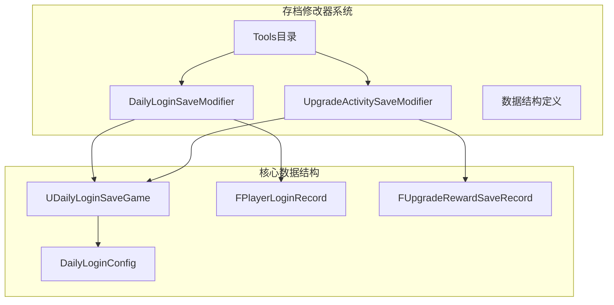
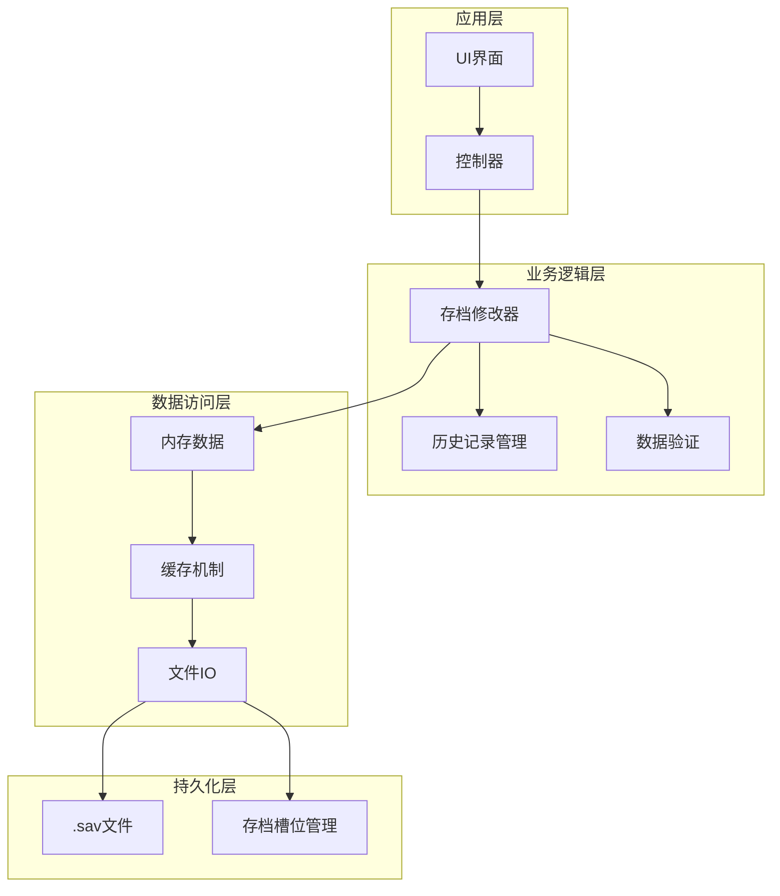
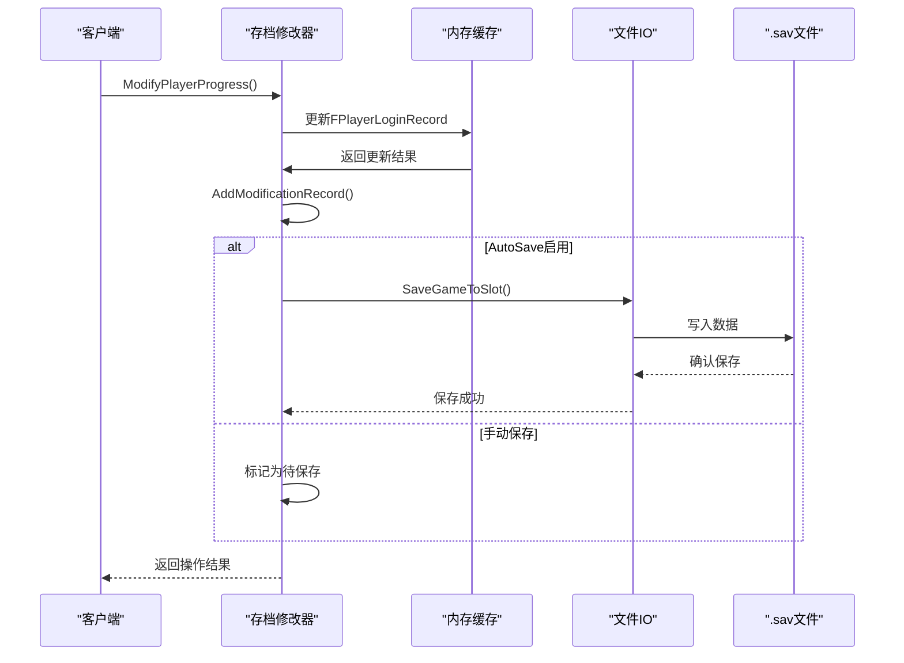
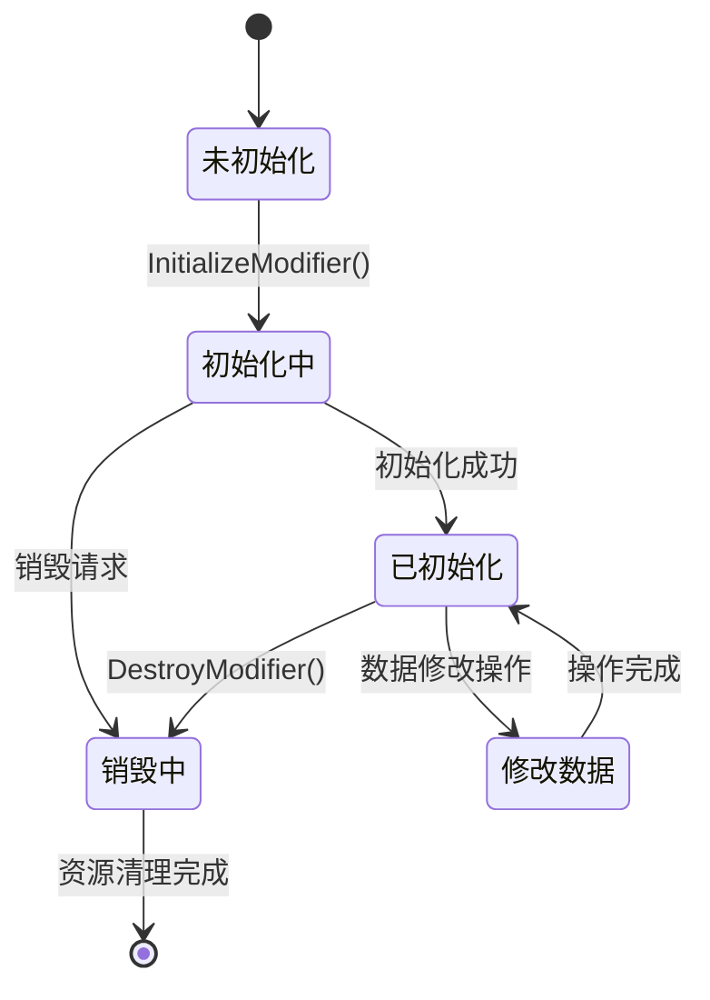
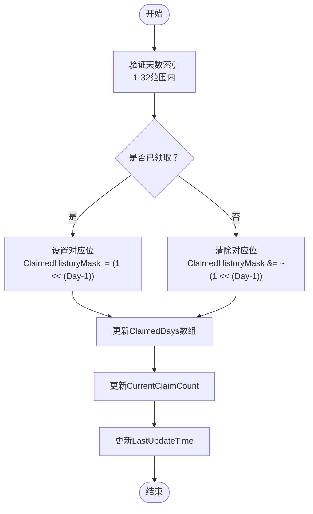
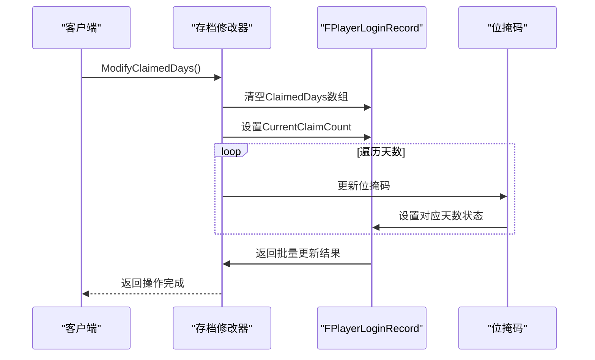
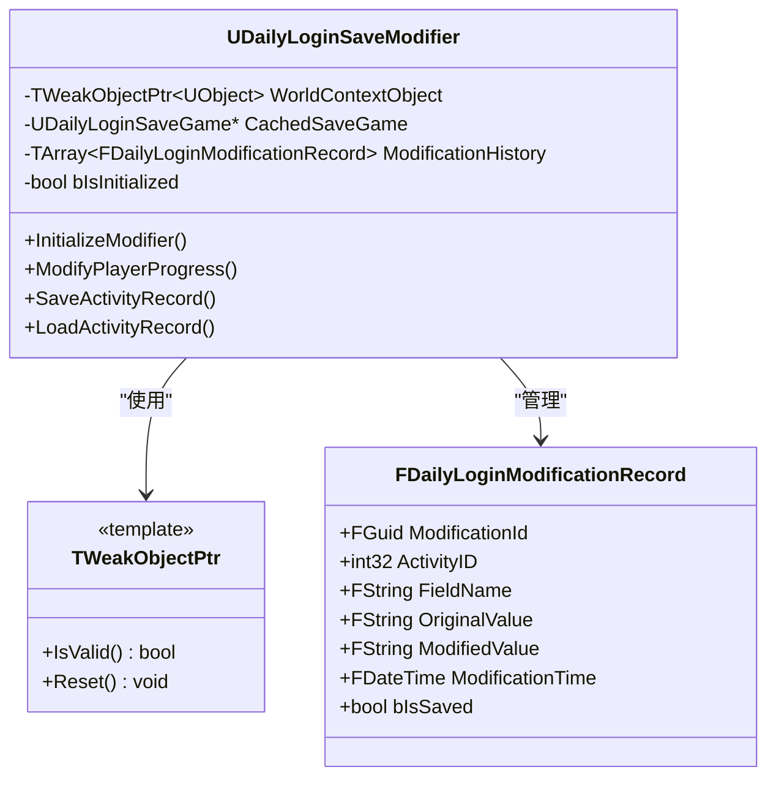
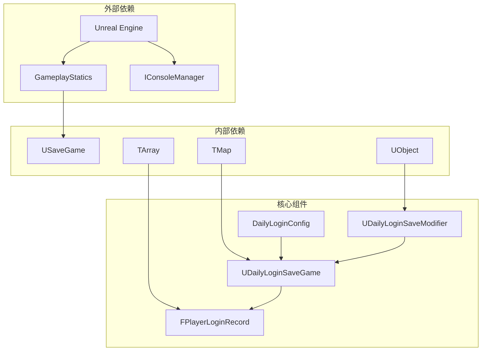

# 存档修改器

<cite>
**本文档引用的文件**
- [DailyLoginSaveModifier.cpp](file://MetalSlug01/Source/MetalSlug01/Private/Tools/DailyLoginSaveModifier.cpp)
- [DailyLoginSaveModifier.h](file://MetalSlug01/Source/MetalSlug01/Public/Tools/DailyLoginSaveModifier.h)
- [DailyLoginSave.h](file://MetalSlug01/Source/MetalSlug01/Public/UI/Activity/Data/DailyLoginSave.h)
- [README_DailyLoginSaveIntegration.md](file://MetalSlug01/Source/MetalSlug01/Public/Tools/README_DailyLoginSaveIntegration.md)
- [UpgradeActivitySaveModifier.cpp](file://MetalSlug01/Source/MetalSlug01/Private/Tools/UpgradeActivitySaveModifier.cpp)
- [UpgradeActivitySaveModifier.h](file://MetalSlug01/Source/MetalSlug01/Public/Tools/UpgradeActivitySaveModifier.h)
- [DailyLoginConfig.h](file://MetalSlug01/Source/MetalSlug01/Public/UI/Activity/Data/DailyLoginConfig.h)
</cite>

## 目录
1. [简介](#简介)
2. [项目结构](#项目结构)
3. [核心组件](#核心组件)
4. [架构概览](#架构概览)
5. [详细组件分析](#详细组件分析)
6. [依赖关系分析](#依赖关系分析)
7. [性能考虑](#性能考虑)
8. [故障排除指南](#故障排除指南)
9. [结论](#结论)
10. [附录](#附录)

## 简介

本文档深入解析MetalSlug项目中的存档修改器系统，重点介绍DailyLoginSaveModifier存档修改器的核心功能和实现原理。该系统提供了运行时修改玩家动态数据的能力，支持自动保存到.sav文件，具备完善的错误处理和历史记录追踪机制。

存档修改器系统采用模块化设计，包含两个主要组件：
- **DailyLoginSaveModifier**：专门处理每日登录活动的存档修改
- **UpgradeActivitySaveModifier**：处理升级奖励活动的存档修改

系统遵循"所有动态表结构体放入DailyLoginSave.h"的项目规范，确保数据结构的一致性和可维护性。

## 项目结构

存档修改器系统位于MetalSlug01项目的Tools目录下，采用清晰的分层组织：



**图表来源**
- [DailyLoginSaveModifier.h](file://MetalSlug01/Source/MetalSlug01/Public/Tools/DailyLoginSaveModifier.h#L72-L97)
- [DailyLoginSave.h](file://MetalSlug01/Source/MetalSlug01/Public/UI/Activity/Data/DailyLoginSave.h#L352-L373)

**章节来源**
- [DailyLoginSaveModifier.h](file://MetalSlug01/Source/MetalSlug01/Public/Tools/DailyLoginSaveModifier.h#L1-L294)
- [DailyLoginSave.h](file://MetalSlug01/Source/MetalSlug01/Public/UI/Activity/Data/DailyLoginSave.h#L1-L373)

## 核心组件

### DailyLoginSaveModifier主类

UDailyLoginSaveModifier是存档修改器系统的核心类，提供完整的数据修改、查询、保存和历史记录功能。

#### 主要功能特性

1. **数据修改接口**
   - 修改玩家进度（ModifyPlayerProgress）
   - 修改领取状态（ModifyDayClaimedStatus）
   - 批量修改已领取天数（ModifyClaimedDays）
   - 修改当前领取次数（ModifyCurrentClaimCount）
   - 重置玩家记录（ResetPlayerRecord）

2. **查询接口**
   - 获取玩家进度（GetPlayerProgress）
   - 获取已领取天数（GetClaimedDays）
   - 检查某天是否已领取（IsDayClaimed）
   - 获取当前领取次数（GetCurrentClaimCount）

3. **保存和加载机制**
   - 保存指定活动记录（SaveActivityRecord）
   - 保存所有记录（SaveAllRecords）
   - 加载活动记录（LoadActivityRecord）

4. **历史记录追踪**
   - 修改历史记录（GetModificationHistory）
   - 清除历史记录（ClearModificationHistory）

**章节来源**
- [DailyLoginSaveModifier.h](file://MetalSlug01/Source/MetalSlug01/Public/Tools/DailyLoginSaveModifier.h#L100-L226)
- [DailyLoginSaveModifier.cpp](file://MetalSlug01/Source/MetalSlug01/Private/Tools/DailyLoginSaveModifier.cpp#L60-L307)

### 数据结构定义

系统采用强类型的数据结构设计，确保数据的完整性和一致性：

#### FPlayerLoginRecord结构

FPlayerLoginRecord是每日登录活动的核心数据结构，包含以下关键字段：

- **ActivityID**：活动唯一标识符
- **PlayerID**：玩家ID
- **Progress**：当前进度（已领取到第几天）
- **CurrentClaimCount**：当前已领取次数
- **ClaimedHistoryMask**：已领取历史掩码（位运算优化）
- **ClaimedDays**：已领取的天数数组
- **LastClaimTimestamp**：最后领取时间戳
- **LastUpdateTime**：最后更新时间戳

#### UDailyLoginSaveGame类

UDailyLoginSaveGame继承自USaveGame，负责管理所有活动的玩家进度数据：

- **ActivityRecords**：玩家所有活动的进度记录映射表
- **UpgradeRewardRecords**：升级奖励活动存档记录映射表
- **NavigationItemsCache**：UI导航项缓存（运行时数据，不保存到磁盘）

**章节来源**
- [DailyLoginSave.h](file://MetalSlug01/Source/MetalSlug01/Public/UI/Activity/Data/DailyLoginSave.h#L85-L161)
- [DailyLoginSave.h](file://MetalSlug01/Source/MetalSlug01/Public/UI/Activity/Data/DailyLoginSave.h#L352-L373)

## 架构概览

存档修改器系统采用分层架构设计，实现了数据访问层、业务逻辑层和持久化层的有效分离：



**图表来源**
- [DailyLoginSaveModifier.cpp](file://MetalSlug01/Source/MetalSlug01/Private/Tools/DailyLoginSaveModifier.cpp#L22-L58)
- [DailyLoginSaveModifier.cpp](file://MetalSlug01/Source/MetalSlug01/Private/Tools/DailyLoginSaveModifier.cpp#L487-L529)

### 数据流处理机制

系统实现了完整的数据流处理机制，确保数据在内存、缓存和磁盘之间的正确流转：



**图表来源**
- [DailyLoginSaveModifier.cpp](file://MetalSlug01/Source/MetalSlug01/Private/Tools/DailyLoginSaveModifier.cpp#L60-L97)
- [DailyLoginSaveModifier.cpp](file://MetalSlug01/Source/MetalSlug01/Private/Tools/DailyLoginSaveModifier.cpp#L400-L430)

**章节来源**
- [DailyLoginSaveModifier.cpp](file://MetalSlug01/Source/MetalSlug01/Private/Tools/DailyLoginSaveModifier.cpp#L400-L483)

## 详细组件分析

### DailyLoginSaveModifier类实现

#### 生命周期管理

存档修改器采用标准的生命周期管理模式：



**图表来源**
- [DailyLoginSaveModifier.cpp](file://MetalSlug01/Source/MetalSlug01/Private/Tools/DailyLoginSaveModifier.cpp#L22-L58)

#### 数据修改流程

每个数据修改操作都遵循统一的处理流程：

1. **参数验证**：检查输入参数的有效性
2. **数据获取**：获取或创建存档实例
3. **原始数据记录**：记录修改前的状态
4. **数据修改**：执行具体的修改操作
5. **历史记录**：添加修改历史记录
6. **自动保存**：根据配置决定是否自动保存
7. **日志记录**：记录操作结果

**章节来源**
- [DailyLoginSaveModifier.cpp](file://MetalSlug01/Source/MetalSlug01/Private/Tools/DailyLoginSaveModifier.cpp#L60-L167)

### 数据格式转换实现

系统实现了多种数据格式转换机制：

#### 掩码转换机制

FPlayerLoginRecord使用位掩码优化存储空间：



**图表来源**
- [DailyLoginSave.h](file://MetalSlug01/Source/MetalSlug01/Public/UI/Activity/Data/DailyLoginSave.h#L138-L160)

#### 批量数据处理

系统支持批量数据处理，提高操作效率：



**图表来源**
- [DailyLoginSaveModifier.cpp](file://MetalSlug01/Source/MetalSlug01/Private/Tools/DailyLoginSaveModifier.cpp#L169-L227)

**章节来源**
- [DailyLoginSaveModifier.cpp](file://MetalSlug01/Source/MetalSlug01/Private/Tools/DailyLoginSaveModifier.cpp#L169-L227)

### 并发访问控制

系统采用弱引用指针和单例模式确保线程安全：

#### 并发控制机制



**图表来源**
- [DailyLoginSaveModifier.h](file://MetalSlug01/Source/MetalSlug01/Public/Tools/DailyLoginSaveModifier.h#L24-L66)
- [DailyLoginSaveModifier.h](file://MetalSlug01/Source/MetalSlug01/Public/Tools/DailyLoginSaveModifier.h#L230-L243)

**章节来源**
- [DailyLoginSaveModifier.h](file://MetalSlug01/Source/MetalSlug01/Public/Tools/DailyLoginSaveModifier.h#L230-L243)

### 错误处理策略

系统实现了多层次的错误处理机制：

#### 错误处理层次

1. **输入验证层**：检查参数的有效性
2. **状态检查层**：验证修改器的初始化状态
3. **数据完整性层**：确保数据结构的完整性
4. **持久化层**：处理文件IO异常
5. **日志记录层**：记录详细的错误信息

**章节来源**
- [DailyLoginSaveModifier.cpp](file://MetalSlug01/Source/MetalSlug01/Private/Tools/DailyLoginSaveModifier.cpp#L27-L40)

## 依赖关系分析

存档修改器系统具有清晰的依赖关系：



**图表来源**
- [DailyLoginSaveModifier.h](file://MetalSlug01/Source/MetalSlug01/Public/Tools/DailyLoginSaveModifier.h#L14-L18)
- [DailyLoginSave.h](file://MetalSlug01/Source/MetalSlug01/Public/UI/Activity/Data/DailyLoginSave.h#L15-L18)

### 组件耦合度分析

系统采用低耦合设计原则：

- **修改器与数据结构**：通过接口分离，便于扩展
- **修改器与UI**：通过蓝图接口交互，保持松耦合
- **修改器与文件系统**：通过GameplayStatics封装，隐藏实现细节
- **修改器与配置**：通过枚举和结构体定义，确保类型安全

**章节来源**
- [DailyLoginSaveModifier.h](file://MetalSlug01/Source/MetalSlug01/Public/Tools/DailyLoginSaveModifier.h#L14-L18)
- [DailyLoginSave.h](file://MetalSlug01/Source/MetalSlug01/Public/UI/Activity/Data/DailyLoginSave.h#L15-L18)

## 性能考虑

### 内存优化策略

系统采用了多项内存优化技术：

1. **位掩码存储**：使用整数位操作存储32天的领取状态
2. **弱引用指针**：避免循环引用导致的内存泄漏
3. **延迟加载**：按需加载存档数据，减少内存占用
4. **历史记录限制**：限制历史记录数量，防止内存膨胀

### I/O性能优化

1. **批量保存**：支持批量保存多个活动记录
2. **增量更新**：只保存修改过的数据
3. **异步操作**：避免阻塞主线程
4. **缓存机制**：减少重复的文件读取操作

## 故障排除指南

### 常见问题及解决方案

#### 1. 修改器未初始化错误

**症状**：调用任何修改接口都返回false

**原因**：InitializeModifier()未正确调用或WorldContext为空

**解决方案**：
```cpp
// 确保正确初始化
if (!SaveModifier->InitializeModifier(this))
{
    UE_LOG(LogTemp, Error, TEXT("初始化失败"));
    return;
}
```

#### 2. 存档文件损坏

**症状**：LoadGameFromSlot()返回null

**原因**：.sav文件被意外修改或损坏

**解决方案**：
```cpp
// 检查存档是否存在
if (!UGameplayStatics::DoesSaveGameExist(SaveSlotName, 0))
{
    // 创建新的存档
    CachedSaveGame = GetOrCreateSaveGame(ActivityID);
}
```

#### 3. 数据不一致问题

**症状**：UI显示与实际数据不符

**原因**：内存数据与磁盘数据不同步

**解决方案**：
```cpp
// 强制刷新UI
ForceRefreshAllPages();
// 或者重新加载数据
LoadActivityRecord(ActivityID);
```

#### 4. 内存泄漏问题

**症状**：长时间运行后内存持续增长

**原因**：未正确调用DestroyModifier()

**解决方案**：
```cpp
// 在适当的时候销毁修改器
if (SaveModifier)
{
    SaveModifier->DestroyModifier();
    SaveModifier = nullptr;
}
```

**章节来源**
- [DailyLoginSaveModifier.cpp](file://MetalSlug01/Source/MetalSlug01/Private/Tools/DailyLoginSaveModifier.cpp#L42-L58)

### 调试技巧

#### 1. 启用详细日志

系统提供了多级别的日志输出：
- **Error**：严重错误，需要立即处理
- **Warning**：警告信息，可能影响功能
- **Log**：常规操作信息
- **Verbose**：详细调试信息

#### 2. 使用控制台命令

系统提供了丰富的控制台命令用于调试：

```bash
# 设置玩家进度
DailyLogin.SetProgress 7 5

# 设置某天领取状态
DailyLogin.SetDayClaimed 7 3 1

# 重置数据
DailyLogin.Reset 7

# 显示信息
DailyLogin.ShowInfo 7
```

#### 3. 历史记录分析

通过查看修改历史记录可以追踪数据变更过程：
```cpp
// 获取最近的修改记录
auto history = SaveModifier->GetModificationHistory(50);
for (const auto& record : history)
{
    UE_LOG(LogTemp, Log, TEXT("修改: %s -> %s"), 
           *record.OriginalValue, *record.ModifiedValue);
}
```

**章节来源**
- [DailyLoginSaveModifier.cpp](file://MetalSlug01/Source/MetalSlug01/Private/Tools/DailyLoginSaveModifier.cpp#L559-L664)

## 结论

存档修改器系统是一个设计精良、功能完备的运行时数据修改框架。其核心优势包括：

1. **模块化设计**：清晰的职责分离和低耦合架构
2. **类型安全**：强类型的数据结构和严格的参数验证
3. **持久化保障**：自动保存机制确保数据安全
4. **扩展性强**：易于添加新的数据修改功能
5. **性能优化**：内存和I/O层面的多重优化

该系统为游戏开发提供了强大的调试和测试能力，同时保持了对现有业务逻辑的最小影响。通过合理的错误处理和历史记录机制，确保了系统的稳定性和可维护性。

## 附录

### 使用示例

#### 基本使用流程

```cpp
// 1. 初始化修改器
auto saveModifier = NewObject<UDailyLoginSaveModifier>(this);
saveModifier->InitializeModifier(this);

// 2. 修改玩家进度
saveModifier->ModifyPlayerProgress(7, 5, true);

// 3. 批量设置已领取天数
TArray<int32> days = {1, 2, 3, 5};
saveModifier->ModifyClaimedDays(7, days, true);

// 4. 销毁修改器
saveModifier->DestroyModifier();
```

#### 高级功能使用

```cpp
// 1. 获取修改历史
auto history = saveModifier->GetModificationHistory(100);
for (const auto& record : history)
{
    UE_LOG(LogTemp, Log, TEXT("[%s] %s: %s -> %s"),
           *record.ModificationTime.ToString(),
           *record.FieldName,
           *record.OriginalValue,
           *record.ModifiedValue);
}

// 2. 清除历史记录
saveModifier->ClearModificationHistory();

// 3. 手动保存所有数据
saveModifier->SaveAllRecords();
```

### 扩展开发指南

#### 自定义存档格式支持

要添加新的存档格式支持，需要：

1. **定义数据结构**：在DailyLoginSave.h中添加新的结构体
2. **实现修改器**：创建对应的修改器类
3. **注册接口**：在ActivitySubsystem中注册新的修改接口
4. **测试验证**：编写单元测试确保功能正确

#### 批量数据处理优化

对于大量数据的批量处理，建议：

1. **分批处理**：避免一次性处理过多数据
2. **异步操作**：使用异步方式处理耗时操作
3. **进度反馈**：提供处理进度的用户反馈
4. **错误恢复**：实现部分失败时的恢复机制

#### 性能优化建议

1. **内存池管理**：对于频繁创建的对象使用内存池
2. **缓存策略**：合理使用缓存减少重复计算
3. **批量操作**：合并多次操作为单次批量操作
4. **延迟初始化**：按需初始化昂贵的资源