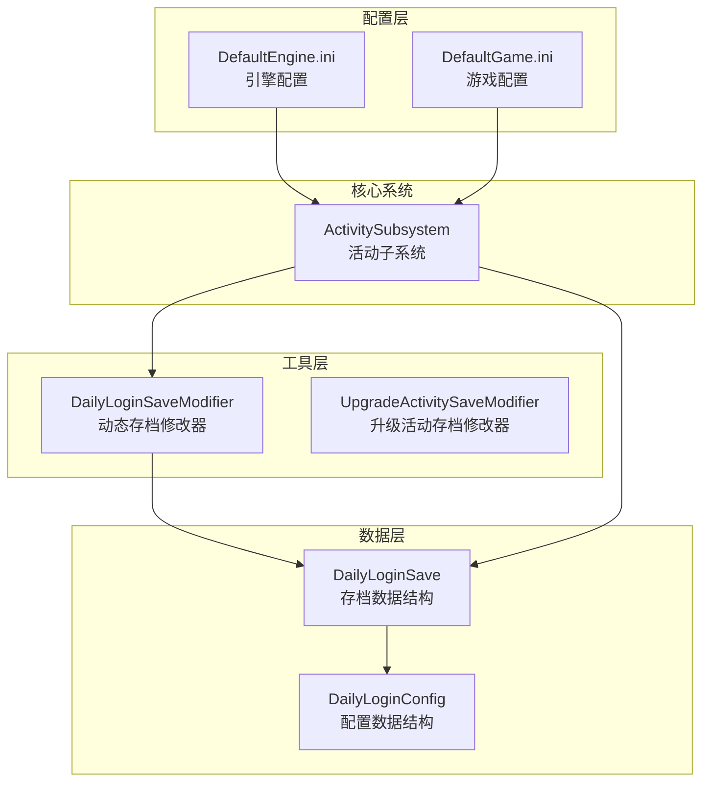
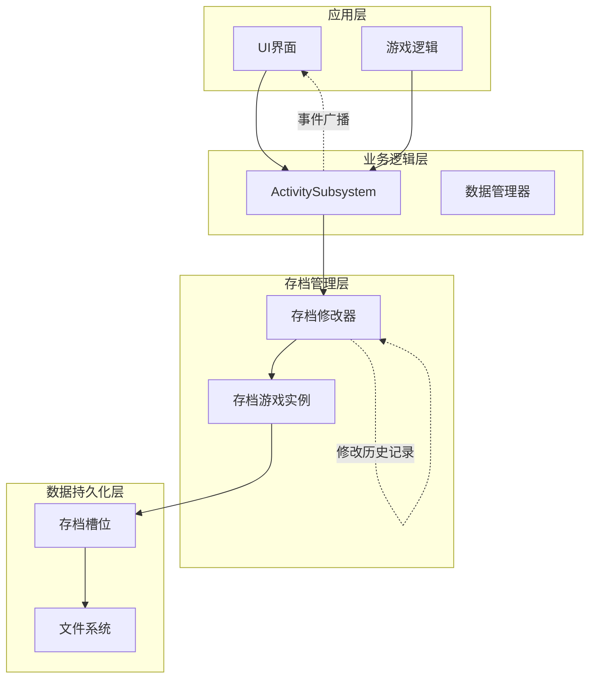
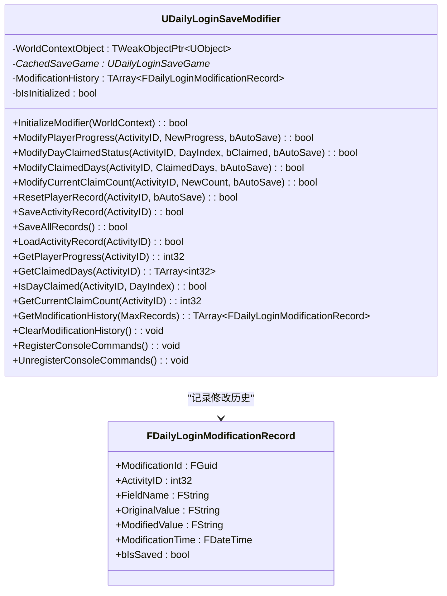
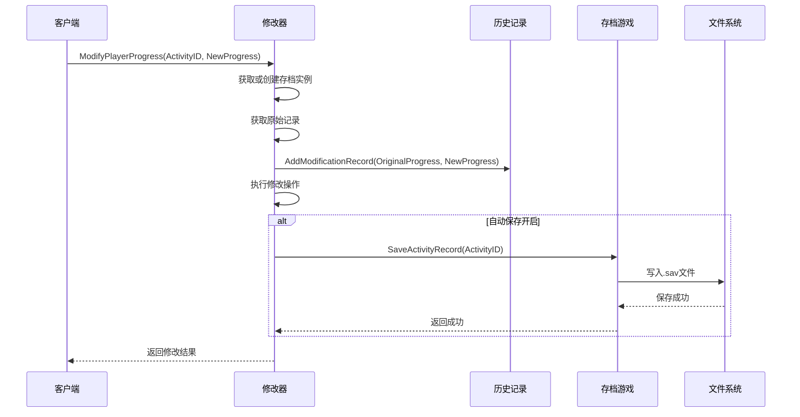
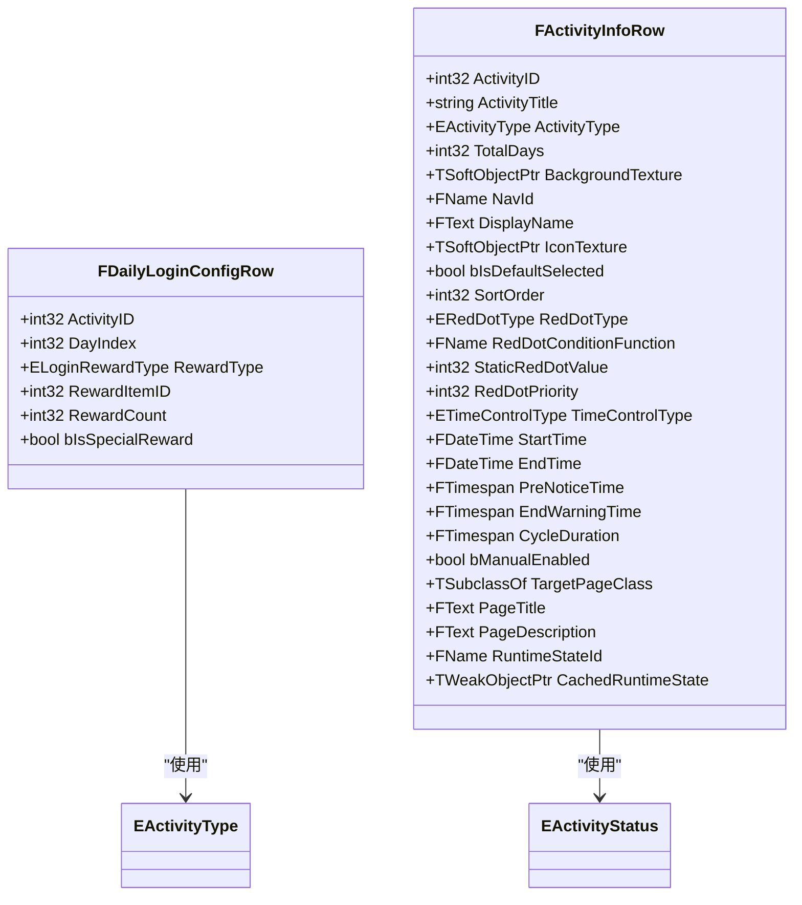
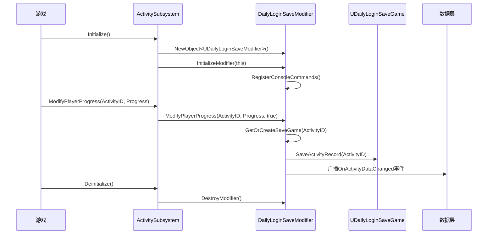
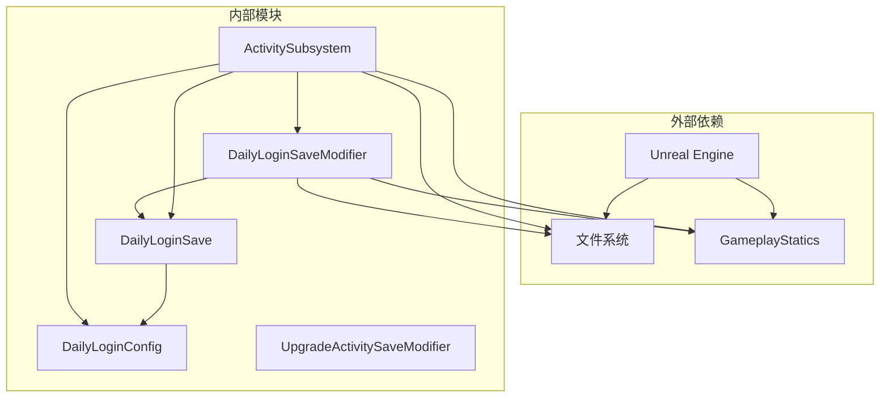

# 存档系统

<cite>
**本文档引用的文件**
- [DailyLoginSaveModifier.h](file://MetalSlug01/Source/MetalSlug01/Public/Tools/DailyLoginSaveModifier.h)
- [DailyLoginSaveModifier.cpp](file://MetalSlug01/Source/MetalSlug01/Private/Tools/DailyLoginSaveModifier.cpp)
- [DailyLoginSave.h](file://MetalSlug01/Source/MetalSlug01/Public/UI/Activity/Data/DailyLoginSave.h)
- [DailyLoginConfig.h](file://MetalSlug01/Source/MetalSlug01/Public/UI/Activity/Data/DailyLoginConfig.h)
- [ActivitySubsystem.cpp](file://MetalSlug01/Source/MetalSlug01/Private/UI/Activity/Core/ActivitySubsystem.cpp)
- [README_DailyLoginSaveIntegration.md](file://MetalSlug01/Source/MetalSlug01/Public/Tools/README_DailyLoginSaveIntegration.md)
- [DefaultEngine.ini](file://MetalSlug01/Config/DefaultEngine.ini)
- [DefaultGame.ini](file://MetalSlug01/Config/DefaultGame.ini)
</cite>

## 目录
1. [简介](#简介)
2. [项目结构](#项目结构)
3. [核心组件](#核心组件)
4. [架构概览](#架构概览)
5. [详细组件分析](#详细组件分析)
6. [依赖关系分析](#依赖关系分析)
7. [性能考虑](#性能考虑)
8. [故障排除指南](#故障排除指南)
9. [结论](#结论)
10. [附录](#附录)

## 简介
本文档详细介绍了MetalSlug游戏中的存档系统，特别是每日登录活动的存档管理机制。该系统实现了运行时动态修改玩家进度数据的能力，支持自动保存到.sav文件，并提供了完整的数据持久化策略。系统采用分层架构设计，将静态配置数据与动态运行时数据分离，确保了数据的一致性和可维护性。

## 项目结构
存档系统主要分布在以下目录结构中：



**图表来源**
- [DailyLoginSaveModifier.h](file://MetalSlug01/Source/MetalSlug01/Public/Tools/DailyLoginSaveModifier.h#L1-L294)
- [DailyLoginSave.h](file://MetalSlug01/Source/MetalSlug01/Public/UI/Activity/Data/DailyLoginSave.h#L1-L373)
- [ActivitySubsystem.cpp](file://MetalSlug01/Source/MetalSlug01/Private/UI/Activity/Core/ActivitySubsystem.cpp#L1-L599)

**章节来源**
- [DailyLoginSaveModifier.h](file://MetalSlug01/Source/MetalSlug01/Public/Tools/DailyLoginSaveModifier.h#L1-L294)
- [DailyLoginSave.h](file://MetalSlug01/Source/MetalSlug01/Public/UI/Activity/Data/DailyLoginSave.h#L1-L373)
- [ActivitySubsystem.cpp](file://MetalSlug01/Source/MetalSlug01/Private/UI/Activity/Core/ActivitySubsystem.cpp#L1-L599)

## 核心组件
存档系统由以下核心组件构成：

### 1. 存档数据结构层
- **FPlayerLoginRecord**: 玩家每日登录进度记录
- **UDailyLoginSaveGame**: 主存档类，管理所有活动的玩家进度数据
- **FActivityRuntimeState**: 活动运行时状态结构
- **FUpgradeRewardSaveRecord**: 升级奖励活动存档记录

### 2. 配置管理层
- **FDailyLoginConfigRow**: 每日登录配置表结构
- **FActivityInfoRow**: 活动信息表结构
- **EActivityType/EActivityStatus**: 活动类型和状态枚举

### 3. 动态修改器层
- **UDailyLoginSaveModifier**: 每日登录存档动态修改器
- **UUpgradeActivitySaveModifier**: 升级活动存档修改器

**章节来源**
- [DailyLoginSave.h](file://MetalSlug01/Source/MetalSlug01/Public/UI/Activity/Data/DailyLoginSave.h#L80-L373)
- [DailyLoginConfig.h](file://MetalSlug01/Source/MetalSlug01/Public/UI/Activity/Data/DailyLoginConfig.h#L19-L635)
- [DailyLoginSaveModifier.h](file://MetalSlug01/Source/MetalSlug01/Public/Tools/DailyLoginSaveModifier.h#L72-L294)

## 架构概览
存档系统采用分层架构设计，实现了数据持久化、动态修改和配置管理的分离：



**图表来源**
- [ActivitySubsystem.cpp](file://MetalSlug01/Source/MetalSlug01/Private/UI/Activity/Core/ActivitySubsystem.cpp#L1-L599)
- [DailyLoginSaveModifier.cpp](file://MetalSlug01/Source/MetalSlug01/Private/Tools/DailyLoginSaveModifier.cpp#L1-L778)

## 详细组件分析

### DailyLoginSaveModifier 动态修改器

#### 类结构设计


**图表来源**
- [DailyLoginSaveModifier.h](file://MetalSlug01/Source/MetalSlug01/Public/Tools/DailyLoginSaveModifier.h#L72-L294)
- [DailyLoginSaveModifier.h](file://MetalSlug01/Source/MetalSlug01/Public/Tools/DailyLoginSaveModifier.h#L24-L66)

#### 核心功能实现

##### 数据修改接口
系统提供了完整的数据修改接口，支持多种修改操作：

| 修改类型 | 方法名 | 描述 | 自动保存 |
|---------|--------|------|----------|
| 玩家进度 | ModifyPlayerProgress | 修改当前进度值 | ✓ |
| 领取状态 | ModifyDayClaimedStatus | 修改指定天数领取状态 | ✓ |
| 批量修改 | ModifyClaimedDays | 批量设置已领取天数 | ✓ |
| 领取次数 | ModifyCurrentClaimCount | 修改当前领取次数 | ✓ |
| 重置记录 | ResetPlayerRecord | 重置玩家记录到初始状态 | ✓ |

##### 修改历史追踪机制


**图表来源**
- [DailyLoginSaveModifier.cpp](file://MetalSlug01/Source/MetalSlug01/Private/Tools/DailyLoginSaveModifier.cpp#L60-L97)
- [DailyLoginSaveModifier.cpp](file://MetalSlug01/Source/MetalSlug01/Private/Tools/DailyLoginSaveModifier.cpp#L531-L546)

**章节来源**
- [DailyLoginSaveModifier.cpp](file://MetalSlug01/Source/MetalSlug01/Private/Tools/DailyLoginSaveModifier.cpp#L60-L307)
- [DailyLoginSaveModifier.h](file://MetalSlug01/Source/MetalSlug01/Public/Tools/DailyLoginSaveModifier.h#L100-L149)

### DailyLoginSave 存档数据结构

#### FPlayerLoginRecord 数据模型
```mermaid
erDiagram
FPlayerLoginRecord {
int32 ActivityID
string PlayerID
int32 Progress
int32 CurrentClaimCount
int32 ClaimedHistoryMask
array ClaimedDays
int64 LastClaimTimestamp
datetime LastUpdateTime
}
FPlayerLoginRecord ||--|| UDailyLoginSaveGame : "包含在"
FPlayerLoginRecord {
+IsDayClaimed(DayIndex): bool
+SetDayClaimed(DayIndex, bClaimed): void
}
```

**图表来源**
- [DailyLoginSave.h](file://MetalSlug01/Source/MetalSlug01/Public/UI/Activity/Data/DailyLoginSave.h#L85-L161)

#### 存档持久化策略
系统采用以下持久化策略：

1. **文件命名规则**: `DailyLogin_{ActivityID}.sav`
2. **保存时机**: 
   - 自动保存：每次修改操作完成后
   - 手动保存：SaveAllRecords() 批量保存
3. **数据完整性**: 使用原子性保存确保数据一致性

**章节来源**
- [DailyLoginSave.h](file://MetalSlug01/Source/MetalSlug01/Public/UI/Activity/Data/DailyLoginSave.h#L347-L373)
- [DailyLoginSaveModifier.cpp](file://MetalSlug01/Source/MetalSlug01/Private/Tools/DailyLoginSaveModifier.cpp#L400-L457)

### DailyLoginConfig 配置管理系统

#### 配置数据结构
系统提供了完整的配置管理框架：



**图表来源**
- [DailyLoginConfig.h](file://MetalSlug01/Source/MetalSlug01/Public/UI/Activity/Data/DailyLoginConfig.h#L196-L242)
- [DailyLoginConfig.h](file://MetalSlug01/Source/MetalSlug01/Public/UI/Activity/Data/DailyLoginConfig.h#L249-L420)

#### 配置加载机制
系统通过以下方式实现配置加载：

1. **静态配置加载**: 从DataTable资源文件加载
2. **动态配置生成**: 运行时根据静态配置生成动态数据
3. **配置验证**: 确保配置数据的完整性和有效性

**章节来源**
- [DailyLoginConfig.h](file://MetalSlug01/Source/MetalSlug01/Public/UI/Activity/Data/DailyLoginConfig.h#L196-L420)

### ActivitySubsystem 集成层

#### 子系统架构


**图表来源**
- [ActivitySubsystem.cpp](file://MetalSlug01/Source/MetalSlug01/Private/UI/Activity/Core/ActivitySubsystem.cpp#L7-L39)
- [ActivitySubsystem.cpp](file://MetalSlug01/Source/MetalSlug01/Private/UI/Activity/Core/ActivitySubsystem.cpp#L506-L527)

#### 集成优势
- **解耦设计**: 存档修改器独立于UI界面
- **事件驱动**: 通过事件广播通知UI更新
- **资源管理**: 自动管理修改器的生命周期

**章节来源**
- [ActivitySubsystem.cpp](file://MetalSlug01/Source/MetalSlug01/Private/UI/Activity/Core/ActivitySubsystem.cpp#L7-L599)
- [README_DailyLoginSaveIntegration.md](file://MetalSlug01/Source/MetalSlug01/Public/Tools/README_DailyLoginSaveIntegration.md#L1-L170)

## 依赖关系分析

### 组件依赖图


**图表来源**
- [DailyLoginSaveModifier.h](file://MetalSlug01/Source/MetalSlug01/Public/Tools/DailyLoginSaveModifier.h#L14-L18)
- [ActivitySubsystem.cpp](file://MetalSlug01/Source/MetalSlug01/Private/UI/Activity/Core/ActivitySubsystem.cpp#L1-L5)

### 关键依赖关系
1. **存档修改器依赖**: UDailyLoginSaveModifier 依赖 UDailyLoginSaveGame 和 GameplayStatics
2. **子系统依赖**: ActivitySubsystem 依赖 DailyLoginSaveModifier 和各种配置数据结构
3. **配置依赖**: 存档数据结构依赖配置枚举和数据表结构

**章节来源**
- [DailyLoginSaveModifier.h](file://MetalSlug01/Source/MetalSlug01/Public/Tools/DailyLoginSaveModifier.h#L14-L18)
- [DailyLoginSave.h](file://MetalSlug01/Source/MetalSlug01/Public/UI/Activity/Data/DailyLoginSave.h#L15-L18)

## 性能考虑

### 存储性能优化
1. **延迟加载**: 存档实例按需加载，减少内存占用
2. **批量保存**: 支持批量保存操作，减少磁盘IO次数
3. **缓存机制**: 使用缓存避免重复的文件读取操作

### 内存管理
1. **弱引用**: 使用 TWeakObjectPtr 避免循环引用
2. **智能指针**: 自动管理存档实例的生命周期
3. **历史记录限制**: 限制修改历史记录的数量，防止内存泄漏

### 并发安全
1. **线程安全**: 存档操作在主线程执行，避免并发问题
2. **原子性**: 保存操作保证数据的原子性
3. **错误处理**: 完善的错误处理机制确保系统稳定性

## 故障排除指南

### 常见问题及解决方案

#### 1. 存档文件损坏
**症状**: 无法加载存档文件
**解决方案**:
- 检查存档文件是否存在且可读
- 删除损坏的存档文件，系统会自动创建新的
- 验证磁盘空间充足

#### 2. 修改器初始化失败
**症状**: ModifyPlayerProgress 返回 false
**解决方案**:
- 确认 WorldContext 参数有效
- 检查子系统是否正确初始化
- 验证控制台命令注册状态

#### 3. 数据不持久化
**症状**: 重启游戏后数据丢失
**解决方案**:
- 检查自动保存功能是否启用
- 验证文件权限设置
- 确认游戏正常退出流程

**章节来源**
- [DailyLoginSaveModifier.cpp](file://MetalSlug01/Source/MetalSlug01/Private/Tools/DailyLoginSaveModifier.cpp#L27-L58)
- [ActivitySubsystem.cpp](file://MetalSlug01/Source/MetalSlug01/Private/UI/Activity/Core/ActivitySubsystem.cpp#L23-L39)

### 调试工具
系统提供了丰富的调试工具：

1. **控制台命令**: 支持实时修改和查询存档数据
2. **日志系统**: 详细的日志输出便于问题诊断
3. **修改历史**: 记录所有修改操作，便于审计

## 结论
MetalSlug的存档系统通过精心设计的分层架构，实现了动态数据修改、配置管理、数据持久化等功能的有机结合。系统具有以下特点：

1. **模块化设计**: 各组件职责清晰，易于维护和扩展
2. **数据完整性**: 通过原子性保存和验证机制确保数据安全
3. **性能优化**: 采用延迟加载、批量处理等技术提升性能
4. **易用性**: 提供丰富的API和调试工具，便于开发和测试

该系统为游戏提供了可靠的存档管理能力，支持复杂的动态数据修改需求，同时保持了良好的性能和稳定性。

## 附录

### API 参考

#### DailyLoginSaveModifier API
| 方法名 | 参数 | 返回值 | 描述 |
|--------|------|--------|------|
| InitializeModifier | WorldContext: UObject* | bool | 初始化修改器 |
| ModifyPlayerProgress | ActivityID: int32, NewProgress: int32, bAutoSave: bool | bool | 修改玩家进度 |
| ModifyDayClaimedStatus | ActivityID: int32, DayIndex: int32, bClaimed: bool, bAutoSave: bool | bool | 修改领取状态 |
| ModifyClaimedDays | ActivityID: int32, ClaimedDays: TArray<int32>, bAutoSave: bool | bool | 批量修改已领取天数 |
| ResetPlayerRecord | ActivityID: int32, bAutoSave: bool | bool | 重置玩家记录 |
| SaveActivityRecord | ActivityID: int32 | bool | 保存指定活动记录 |
| SaveAllRecords | - | bool | 保存所有记录 |
| LoadActivityRecord | ActivityID: int32 | bool | 加载活动记录 |

#### 数据模型说明

**FPlayerLoginRecord 字段说明**:
- `ActivityID`: 活动唯一标识符
- `PlayerID`: 玩家标识符
- `Progress`: 当前进度（已领取到第几天）
- `CurrentClaimCount`: 当前已领取次数
- `ClaimedHistoryMask`: 领取历史位掩码
- `ClaimedDays`: 已领取天数数组
- `LastClaimTimestamp`: 最后领取时间戳
- `LastUpdateTime`: 最后更新时间

**章节来源**
- [DailyLoginSaveModifier.h](file://MetalSlug01/Source/MetalSlug01/Public/Tools/DailyLoginSaveModifier.h#L100-L225)
- [DailyLoginSave.h](file://MetalSlug01/Source/MetalSlug01/Public/UI/Activity/Data/DailyLoginSave.h#L85-L161)

### 扩展开发指南

#### 添加新的存档数据类型
1. 在 DailyLoginSave.h 中定义新的数据结构
2. 在 UDailyLoginSaveGame 中添加相应的字段
3. 实现相应的修改器接口
4. 更新配置管理系统以支持新类型

#### 自定义存档格式
1. 继承 USaveGame 基类
2. 实现序列化和反序列化逻辑
3. 更新存档槽位命名规则
4. 实现相应的加载和保存机制

#### 集成新功能
1. 在 ActivitySubsystem 中添加新的接口方法
2. 实现功能的具体逻辑
3. 更新事件广播机制
4. 添加相应的测试和调试工具

**章节来源**
- [README_DailyLoginSaveIntegration.md](file://MetalSlug01/Source/MetalSlug01/Public/Tools/README_DailyLoginSaveIntegration.md#L55-L91)