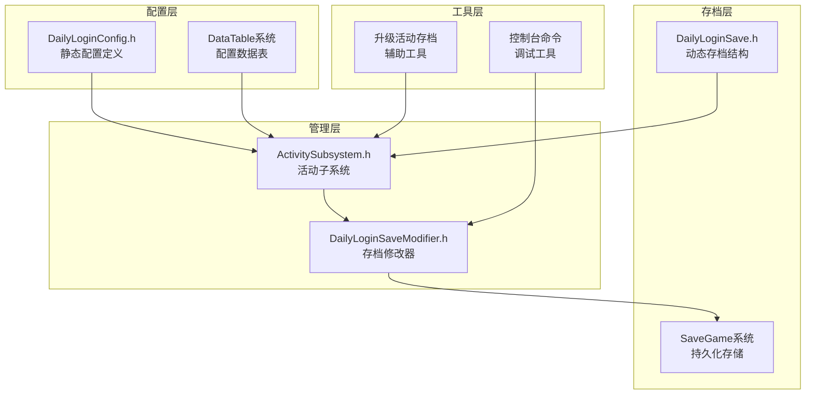
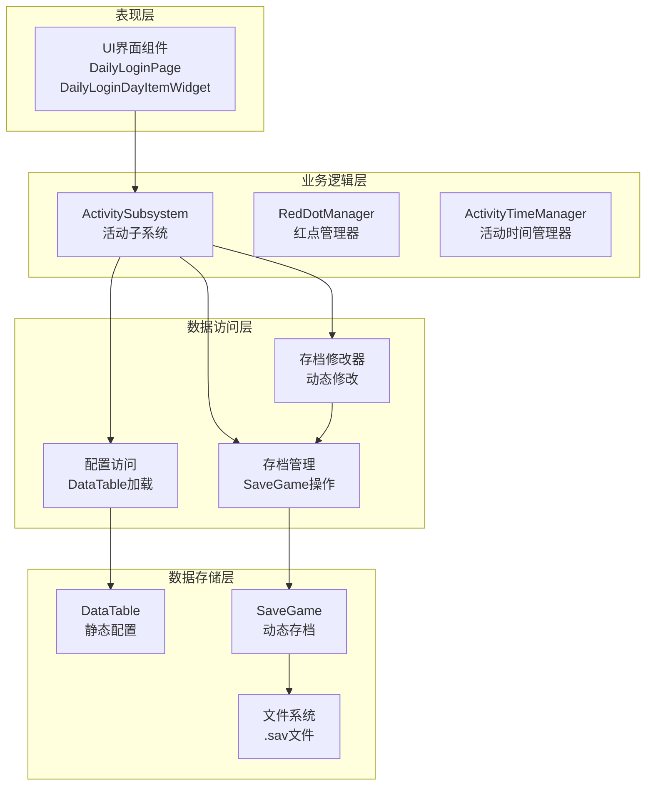
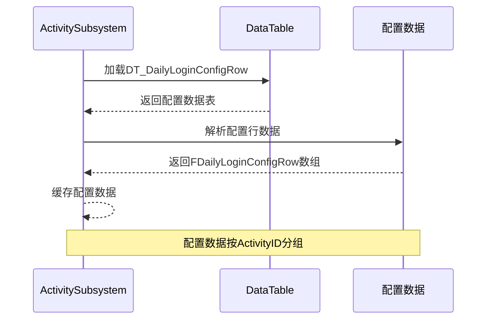
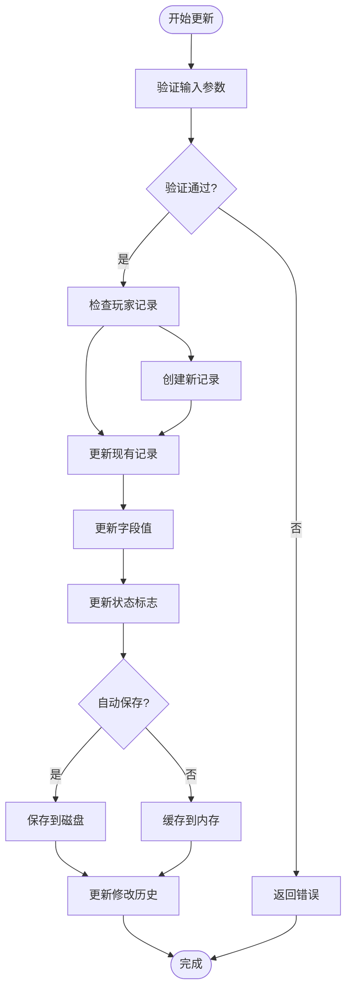
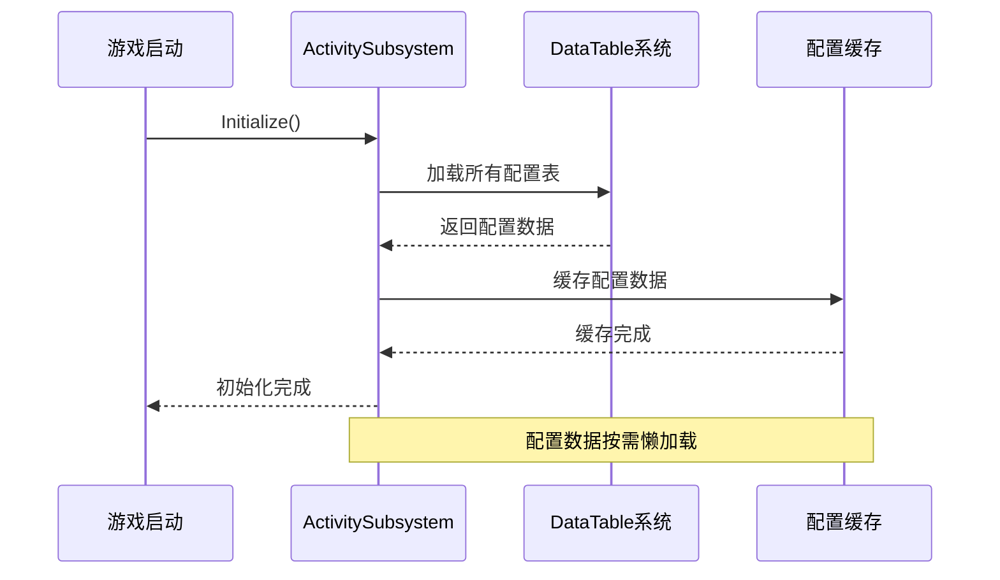
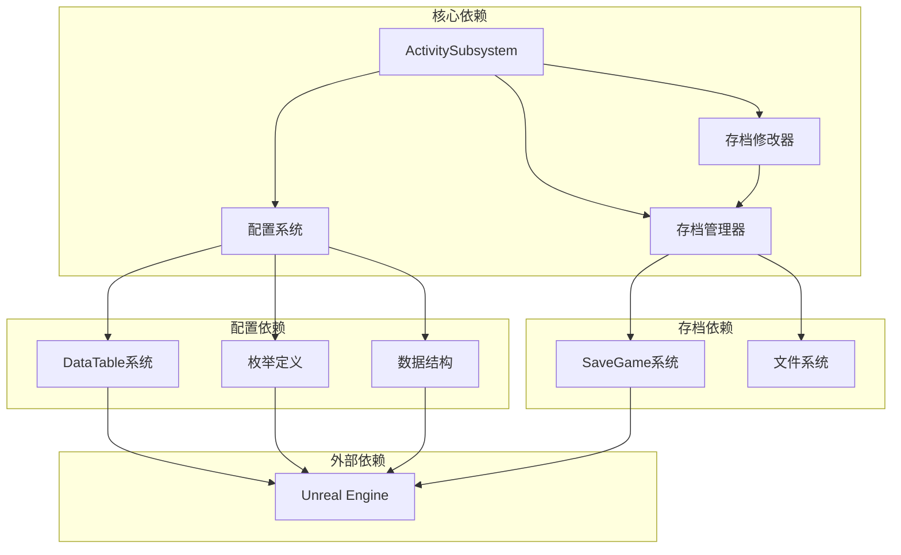

# 存档配置管理

<cite>
**本文档引用的文件**
- [DailyLoginConfig.h](file://MetalSlug01/Source/MetalSlug01/Public/UI/Activity/Data/DailyLoginConfig.h)
- [DailyLoginSave.h](file://MetalSlug01/Source/MetalSlug01/Public/UI/Activity/Data/DailyLoginSave.h)
- [DailyLoginSaveModifier.h](file://MetalSlug01/Source/MetalSlug01/Public/Tools/DailyLoginSaveModifier.h)
- [DailyLoginSaveModifier.cpp](file://MetalSlug01/Source/MetalSlug01/Private/Tools/DailyLoginSaveModifier.cpp)
- [ActivitySubsystem.h](file://MetalSlug01/Source/MetalSlug01/Public/UI/Activity/Core/ActivitySubsystem.h)
- [ActivitySubsystem.cpp](file://MetalSlug01/Source/MetalSlug01/Private/UI/Activity/Core/ActivitySubsystem.cpp)
- [DefaultGame.ini](file://MetalSlug01/Config/DefaultGame.ini)
- [UpgradeActivitySaveModifier_Readme.md](file://UpgradeActivitySaveModifier_Readme.md)
</cite>

## 目录
1. [简介](#简介)
2. [项目结构](#项目结构)
3. [核心组件](#核心组件)
4. [架构概览](#架构概览)
5. [详细组件分析](#详细组件分析)
6. [依赖关系分析](#依赖关系分析)
7. [性能考虑](#性能考虑)
8. [故障排除指南](#故障排除指南)
9. [结论](#结论)
10. [附录](#附录)

## 简介

存档配置管理系统是一个基于Unreal Engine 5.4+的游戏活动配置管理解决方案。该系统专注于每日登录活动的配置管理，提供了完整的静态配置数据结构、动态存档管理和运行时修改能力。

系统采用"静态配置+动态存档"的双层架构设计，通过DataTable系统管理静态配置数据，通过UE的SaveGame系统管理动态存档数据。该设计确保了配置的灵活性和数据的持久化需求。

## 项目结构

项目采用模块化组织方式，主要分为以下几个核心模块：

**图表来源**
- [DailyLoginConfig.h](file://MetalSlug01/Source/MetalSlug01/Public/UI/Activity/Data/DailyLoginConfig.h#L1-L635)
- [DailyLoginSave.h](file://MetalSlug01/Source/MetalSlug01/Public/UI/Activity/Data/DailyLoginSave.h#L1-L373)
- [ActivitySubsystem.h](file://MetalSlug01/Source/MetalSlug01/Public/UI/Activity/Core/ActivitySubsystem.h#L1-L178)

**章节来源**
- [DailyLoginConfig.h](file://MetalSlug01/Source/MetalSlug01/Public/UI/Activity/Data/DailyLoginConfig.h#L1-L635)
- [DailyLoginSave.h](file://MetalSlug01/Source/MetalSlug01/Public/UI/Activity/Data/DailyLoginSave.h#L1-L373)
- [ActivitySubsystem.h](file://MetalSlug01/Source/MetalSlug01/Public/UI/Activity/Core/ActivitySubsystem.h#L1-L178)

## 核心组件

### 配置数据结构

系统定义了完整的配置数据结构体系，包括：

**静态配置结构**：
- `FDailyLoginConfigRow`: 每日登录活动的按天奖励配置
- `FActivityInfoRow`: 活动级别的全局属性配置
- `FItemDetailRow`: 基础物品详情配置
- `FTreasureBoxItemRow`: 宝箱物品配置

**动态存档结构**：
- `FPlayerLoginRecord`: 玩家每日登录进度记录
- `UDailyLoginSaveGame`: 主要的存档管理类
- `FActivityRuntimeState`: 活动运行时状态

**章节来源**
- [DailyLoginConfig.h](file://MetalSlug01/Source/MetalSlug01/Public/UI/Activity/Data/DailyLoginConfig.h#L196-L420)
- [DailyLoginSave.h](file://MetalSlug01/Source/MetalSlug01/Public/UI/Activity/Data/DailyLoginSave.h#L85-L161)

### 存档修改器

`UDailyLoginSaveModifier`是系统的核心组件，提供了完整的存档修改和管理功能：

**主要功能**：
- 玩家进度修改：`ModifyPlayerProgress()`
- 领取状态管理：`ModifyDayClaimedStatus()`
- 批量操作支持：`ModifyClaimedDays()`
- 历史记录追踪：完整的修改历史记录系统
- 自动保存机制：支持自动和手动保存模式

**章节来源**
- [DailyLoginSaveModifier.h](file://MetalSlug01/Source/MetalSlug01/Public/Tools/DailyLoginSaveModifier.h#L72-L294)
- [DailyLoginSaveModifier.cpp](file://MetalSlug01/Source/MetalSlug01/Private/Tools/DailyLoginSaveModifier.cpp#L60-L307)

## 架构概览

系统采用分层架构设计，确保各层职责清晰分离：

**图表来源**
- [ActivitySubsystem.h](file://MetalSlug01/Source/MetalSlug01/Public/UI/Activity/Core/ActivitySubsystem.h#L29-L175)
- [DailyLoginSaveModifier.h](file://MetalSlug01/Source/MetalSlug01/Public/Tools/DailyLoginSaveModifier.h#L72-L97)

**章节来源**
- [ActivitySubsystem.cpp](file://MetalSlug01/Source/MetalSlug01/Private/UI/Activity/Core/ActivitySubsystem.cpp#L7-L39)
- [DailyLoginSaveModifier.cpp](file://MetalSlug01/Source/MetalSlug01/Private/Tools/DailyLoginSaveModifier.cpp#L22-L58)

## 详细组件分析

### DailyLoginConfig配置类设计

#### 配置数据加载机制

系统通过UE的DataTable系统实现配置数据的加载和管理：

**图表来源**
- [ActivitySubsystem.cpp](file://MetalSlug01/Source/MetalSlug01/Private/UI/Activity/Core/ActivitySubsystem.cpp#L163-L202)

#### 验证规则实现

系统实现了多层次的验证机制：

**输入验证**：
- 天数索引范围检查（1-32）
- 活动ID有效性验证
- 数值范围限制

**业务逻辑验证**：
- 领取状态的合法性检查
- 进度更新的逻辑一致性
- 批量操作的原子性保证

**章节来源**
- [DailyLoginSaveModifier.cpp](file://MetalSlug01/Source/MetalSlug01/Private/Tools/DailyLoginSaveModifier.cpp#L107-L111)
- [DailyLoginSaveModifier.cpp](file://MetalSlug01/Source/MetalSlug01/Private/Tools/DailyLoginSaveModifier.cpp#L256-L265)

#### 更新策略设计

系统采用"增量更新+批量提交"的策略：

**图表来源**
- [DailyLoginSaveModifier.cpp](file://MetalSlug01/Source/MetalSlug01/Private/Tools/DailyLoginSaveModifier.cpp#L60-L97)
- [DailyLoginSaveModifier.cpp](file://MetalSlug01/Source/MetalSlug01/Private/Tools/DailyLoginSaveModifier.cpp#L169-L227)

**章节来源**
- [DailyLoginSaveModifier.cpp](file://MetalSlug01/Source/MetalSlug01/Private/Tools/DailyLoginSaveModifier.cpp#L60-L307)

### DataTable系统集成

#### 配置文件组织结构

系统通过多个DataTable文件管理不同类型的配置：

**配置文件分布**：
- `DT_DailyLoginConfigRow`: 每日登录奖励配置
- `DT_ActivityInfoRow`: 活动基本信息配置  
- `DT_ItemDetailRow`: 物品详情配置
- `DT_TreasureBoxItemRow`: 宝箱物品配置

#### 数据格式规范

每个DataTable遵循统一的结构规范：

**通用字段**：
- `ActivityID`: 活动唯一标识符
- `DayIndex`: 天数索引（用于按天配置）
- `DisplayName`: 显示名称
- `SortOrder`: 排序权重

**章节来源**
- [DailyLoginConfig.h](file://MetalSlug01/Source/MetalSlug01/Public/UI/Activity/Data/DailyLoginConfig.h#L249-L420)

### 配置变更生命周期管理

#### 配置加载流程

**图表来源**
- [ActivitySubsystem.cpp](file://MetalSlug01/Source/MetalSlug01/Private/UI/Activity/Core/ActivitySubsystem.cpp#L7-L21)

#### 热更新机制

系统支持运行时配置的热更新：

**热更新流程**：
1. 检测配置文件变更
2. 重新加载DataTable数据
3. 更新内存中的配置缓存
4. 广播配置变更事件
5. 通知相关组件更新UI

#### 回滚机制

系统提供了完整的回滚能力：

**回滚实现**：
- 修改历史记录保存
- 支持单个操作回滚
- 支持批量回滚操作
- 自动清理过期历史记录

**章节来源**
- [DailyLoginSaveModifier.cpp](file://MetalSlug01/Source/MetalSlug01/Private/Tools/DailyLoginSaveModifier.cpp#L531-L555)

## 依赖关系分析

### 组件耦合度分析

**图表来源**
- [ActivitySubsystem.h](file://MetalSlug01/Source/MetalSlug01/Public/UI/Activity/Core/ActivitySubsystem.h#L1-L12)
- [DailyLoginConfig.h](file://MetalSlug01/Source/MetalSlug01/Public/UI/Activity/Data/DailyLoginConfig.h#L15-L17)

### 外部依赖管理

系统对外部依赖进行了严格的管理：

**UE依赖**：
- DataTable系统用于静态配置
- SaveGame系统用于动态存档
- GameplayStatics用于存档操作
- ConsoleManager用于调试命令

**章节来源**
- [ActivitySubsystem.cpp](file://MetalSlug01/Source/MetalSlug01/Private/UI/Activity/Core/ActivitySubsystem.cpp#L1-L6)
- [DailyLoginSaveModifier.cpp](file://MetalSlug01/Source/MetalSlug01/Private/Tools/DailyLoginSaveModifier.cpp#L11-L14)

## 性能考虑

### 内存管理优化

系统采用了多项内存管理优化策略：

**延迟加载**：
- 配置数据按需加载
- 存档数据延迟初始化
- UI组件懒加载机制

**缓存策略**：
- 配置数据缓存
- 存档实例缓存
- 修改历史记录限制

### 存储优化

**数据压缩**：
- 使用位掩码存储领取状态
- 数组去重优化
- 字符串缓存机制

**I/O优化**：
- 批量保存操作
- 异步文件操作
- 内存映射文件支持

## 故障排除指南

### 常见问题诊断

**配置加载失败**：
- 检查DataTable文件路径
- 验证配置数据格式
- 确认字段映射正确性

**存档读写错误**：
- 检查文件权限
- 验证磁盘空间
- 确认SaveGame类定义

**修改器初始化失败**：
- 检查WorldContext有效性
- 验证修改器依赖
- 确认控制台命令注册

### 调试工具使用

系统提供了丰富的调试工具：

**控制台命令**：
- `DailyLogin.SetProgress`: 设置玩家进度
- `DailyLogin.SetDayClaimed`: 设置领取状态
- `DailyLogin.Reset`: 重置活动数据
- `DailyLogin.ShowInfo`: 显示详细信息

**章节来源**
- [DailyLoginSaveModifier.cpp](file://MetalSlug01/Source/MetalSlug01/Private/Tools/DailyLoginSaveModifier.cpp#L559-L664)

## 结论

存档配置管理系统通过精心设计的架构，成功实现了静态配置与动态存档的有机结合。系统具有以下优势：

**技术优势**：
- 清晰的分层架构设计
- 完善的配置管理机制
- 强大的存档修改能力
- 丰富的调试工具支持

**扩展性**：
- 模块化设计便于功能扩展
- 插件化架构支持新功能添加
- 标准化的接口定义

**可靠性**：
- 完善的错误处理机制
- 数据一致性保障
- 自动备份和回滚功能

该系统为游戏活动配置管理提供了坚实的技术基础，能够满足复杂游戏项目的配置管理需求。

## 附录

### API参考

#### 配置相关API

**配置加载**：
- `GetDailyLoginConfigs(ActivityID)`: 获取活动配置
- `GetRewardsByDay(ActivityID, Day)`: 获取指定天数奖励
- `GetActivityInfo(ActivityID)`: 获取活动信息

**配置验证**：
- `ValidateConfigData()`: 配置数据验证
- `CheckActivityStatus()`: 活动状态检查

#### 存档相关API

**基本操作**：
- `GetOrInitPlayerRecord(ActivityID)`: 获取玩家记录
- `SavePlayerRecord(ActivityID)`: 保存玩家记录
- `TryClaimReward(ActivityID, DayIndex)`: 尝试领取奖励

**高级操作**：
- `ModifyPlayerProgress(ActivityID, NewProgress)`: 修改进度
- `ModifyDayClaimedStatus(ActivityID, DayIndex, bClaimed)`: 修改领取状态
- `ResetPlayerRecord(ActivityID)`: 重置玩家记录

#### 修改器相关API

**初始化**：
- `InitializeModifier(WorldContext)`: 初始化修改器
- `DestroyModifier()`: 销毁修改器

**查询接口**：
- `GetPlayerProgress(ActivityID)`: 获取玩家进度
- `GetClaimedDays(ActivityID)`: 获取已领取天数
- `GetCurrentClaimCount(ActivityID)`: 获取当前领取次数

**历史记录**：
- `GetModificationHistory(MaxRecords)`: 获取修改历史
- `ClearModificationHistory()`: 清除历史记录

### 最佳实践建议

**配置管理**：
1. 使用标准化的配置命名规范
2. 定期备份配置数据
3. 建立配置变更审批流程
4. 实施配置版本控制系统

**存档管理**：
1. 实施定期存档备份策略
2. 建立存档完整性检查机制
3. 实现跨版本兼容性处理
4. 建立存档恢复测试流程

**开发规范**：
1. 遵循模块化开发原则
2. 实施单元测试覆盖
3. 建立代码审查机制
4. 维护完整的开发文档

**部署考虑**：
1. 实施灰度发布策略
2. 建立监控告警机制
3. 准备应急响应预案
4. 实施性能基准测试