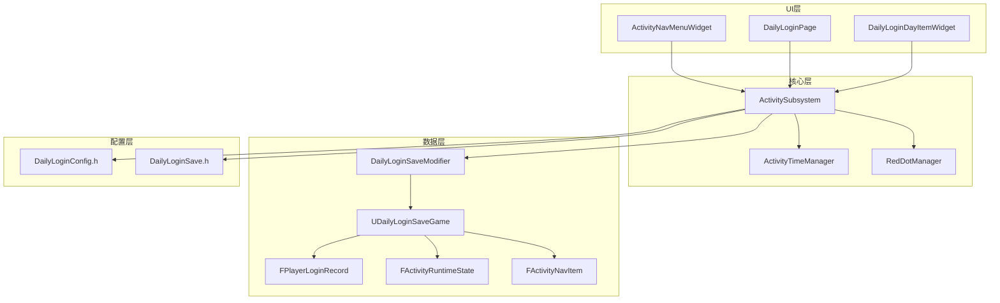
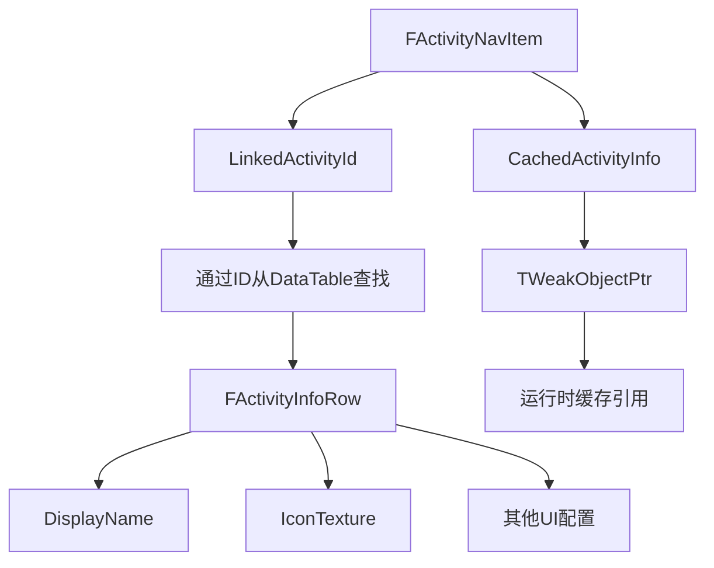
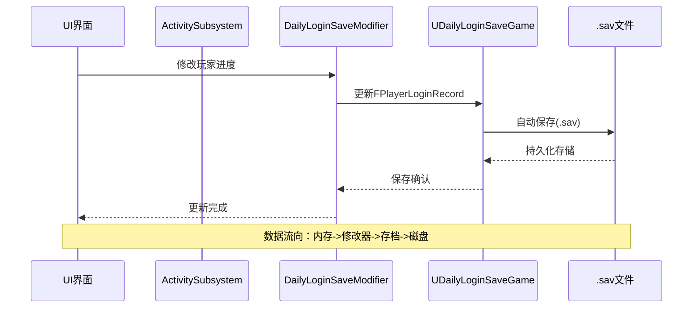
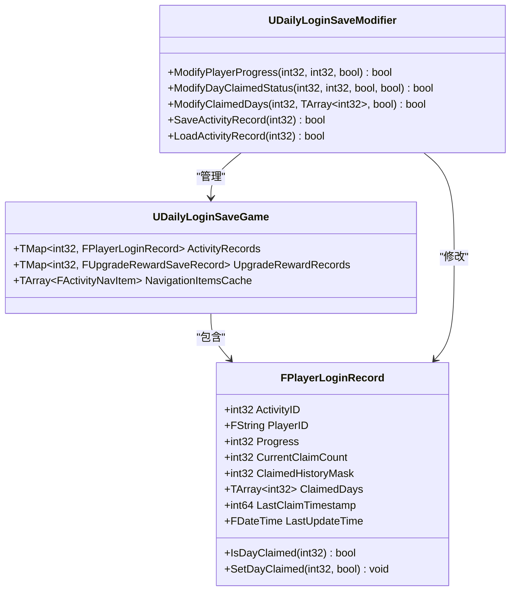
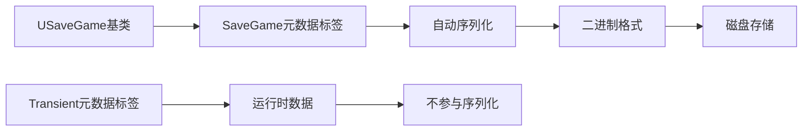
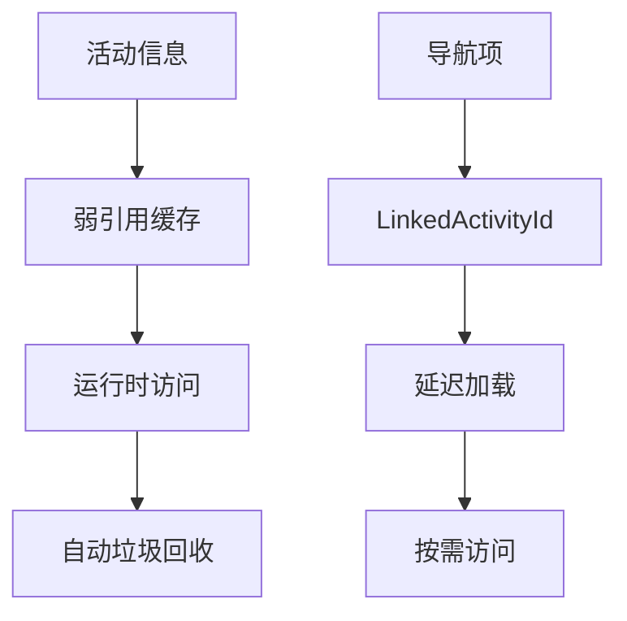
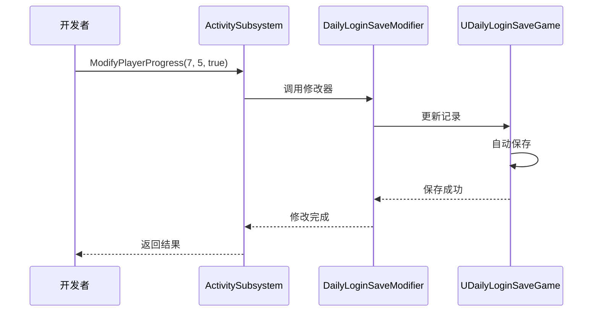
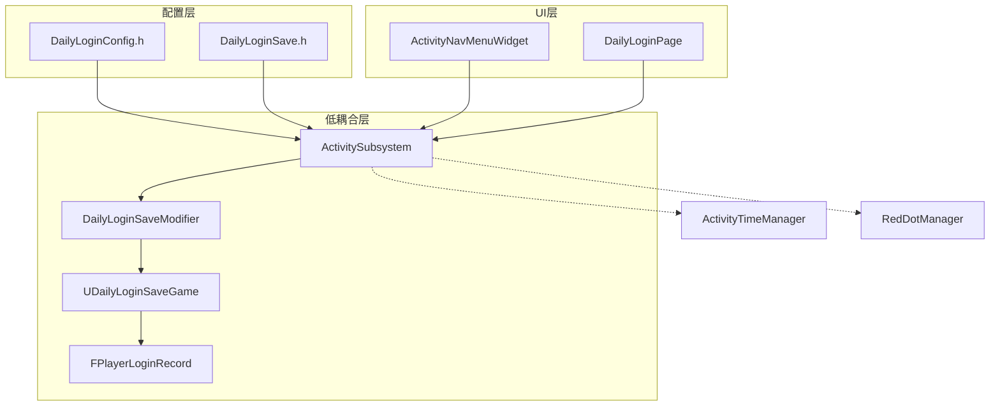

# 每日登录存档数据

<cite>
**本文档引用的文件**
- [DailyLoginSave.h](file://MetalSlug01/Source/MetalSlug01/Public/UI/Activity/Data/DailyLoginSave.h)
- [DailyLoginSaveModifier.h](file://MetalSlug01/Source/MetalSlug01/Public/Tools/DailyLoginSaveModifier.h)
- [DailyLoginSaveModifier.cpp](file://MetalSlug01/Source/MetalSlug01/Private/Tools/DailyLoginSaveModifier.cpp)
- [DailyLoginConfig.h](file://MetalSlug01/Source/MetalSlug01/Public/UI/Activity/Data/DailyLoginConfig.h)
- [README_DailyLoginSaveIntegration.md](file://MetalSlug01/Source/MetalSlug01/Public/Tools/README_DailyLoginSaveIntegration.md)
- [ActivitySubsystem.h](file://MetalSlug01/Source/MetalSlug01/Public/UI/Activity/Core/ActivitySubsystem.h)
- [ActivityTimeManager.h](file://MetalSlug01/Source/MetalSlug01/Public/UI/Activity/Managers/ActivityTimeManager.h)
- [ActivityTimeManager.cpp](file://MetalSlug01/Source/MetalSlug01/Private/UI/Activity/Managers/ActivityTimeManager.cpp)
- [ActivityNavMenuWidget.h](file://MetalSlug01/Source/MetalSlug01/Public/UI/Activity/Pages/Navigation/ActivityNavMenuWidget.h)
- [ActivityNavMenuWidget.cpp](file://MetalSlug01/Source/MetalSlug01/Private/UI/Activity/Pages/Navigation/ActivityNavMenuWidget.cpp)
</cite>

## 目录
1. [简介](#简介)
2. [项目结构](#项目结构)
3. [核心组件](#核心组件)
4. [架构概览](#架构概览)
5. [详细组件分析](#详细组件分析)
6. [依赖关系分析](#依赖关系分析)
7. [性能考虑](#性能考虑)
8. [故障排除指南](#故障排除指南)
9. [结论](#结论)

## 简介
本文档深入解析了MetalSlug游戏中每日登录存档数据系统的设计与实现。该系统提供了完整的玩家登录进度跟踪、奖励领取管理以及数据持久化机制。重点涵盖了FPlayerLoginRecord玩家登录记录结构、FActivityRuntimeState活动运行时状态、FActivityNavItem导航项数据结构等核心组件的设计理念和实现细节。

## 项目结构
该项目采用模块化架构，将活动系统分为多个层次：



**图表来源**
- [ActivityNavMenuWidget.h](file://MetalSlug01/Source/MetalSlug01/Public/UI/Activity/Pages/Navigation/ActivityNavMenuWidget.h#L35-L78)
- [ActivitySubsystem.h](file://MetalSlug01/Source/MetalSlug01/Public/UI/Activity/Core/ActivitySubsystem.h#L29-L175)
- [DailyLoginSaveModifier.h](file://MetalSlug01/Source/MetalSlug01/Public/Tools/DailyLoginSaveModifier.h#L72-L294)

**章节来源**
- [ActivityNavMenuWidget.h](file://MetalSlug01/Source/MetalSlug01/Public/UI/Activity/Pages/Navigation/ActivityNavMenuWidget.h#L35-L78)
- [ActivitySubsystem.h](file://MetalSlug01/Source/MetalSlug01/Public/UI/Activity/Core/ActivitySubsystem.h#L29-L175)

## 核心组件

### FPlayerLoginRecord - 玩家登录记录结构
FPlayerLoginRecord是每日登录系统的核心数据结构，负责存储玩家的登录进度和奖励领取状态。

**关键属性说明**：
- **ActivityID**: 活动唯一标识符，用于区分不同的活动
- **PlayerID**: 玩家标识符，默认为"DefaultPlayer"
- **Progress**: 当前进度（已领取到第几天），用于UI显示和逻辑判断
- **CurrentClaimCount**: 当前已领取次数，用于统计和验证
- **ClaimedHistoryMask**: 历史掩码，使用位运算优化存储空间
- **ClaimedDays**: 已领取天数数组，提供直观的数据访问
- **LastClaimTimestamp**: 最后领取时间戳，用于时间验证
- **LastUpdateTime**: 最后更新时间戳，用于数据同步

**章节来源**
- [DailyLoginSave.h](file://MetalSlug01/Source/MetalSlug01/Public/UI/Activity/Data/DailyLoginSave.h#L85-L161)

### FActivityRuntimeState - 活动运行时状态
FActivityRuntimeState封装了活动的动态运行时信息，这些状态在程序运行时动态计算和更新。

**时间状态管理**：
- **CurrentStatus**: 活动当前状态（Active、Upcoming、EndingSoon、Ended）
- **TimeUntilStart**: 距离开始的剩余时间（秒）
- **TimeUntilEnd**: 距离结束的剩余时间（秒）
- **bInPreNoticePeriod**: 是否处于开始前提醒期
- **bInEndWarningPeriod**: 是否处于结束前提醒期
- **CurrentCycleIndex**: 当前循环周期索引

**UI显示状态**：
- **bIsSelectedInUI**: 在UI中是否被选中
- **UIDotData**: UI显示的红点数据
- **bShowInNavigation**: 是否在导航中显示

**章节来源**
- [DailyLoginSave.h](file://MetalSlug01/Source/MetalSlug01/Public/UI/Activity/Data/DailyLoginSave.h#L27-L78)

### FActivityNavItem - 导航项数据结构
FActivityNavItem是优化版的导航项显示数据结构，通过引用避免数据冗余。

**优化设计原理**：
- **LinkedActivityId**: 通过活动ID关联，避免DisplayName等字段的冗余存储
- **CachedActivityInfo**: 缓存的活动信息指针，提高运行时访问效率
- **IconTexture**: 导航项图标资源，支持动态加载

**引用避免机制**：


**图表来源**
- [DailyLoginSave.h](file://MetalSlug01/Source/MetalSlug01/Public/UI/Activity/Data/DailyLoginSave.h#L168-L226)

**章节来源**
- [DailyLoginSave.h](file://MetalSlug01/Source/MetalSlug01/Public/UI/Activity/Data/DailyLoginSave.h#L168-L226)

## 架构概览

### 数据流架构
系统采用分层架构，实现了数据的完整生命周期管理：



**图表来源**
- [DailyLoginSaveModifier.cpp](file://MetalSlug01/Source/MetalSlug01/Private/Tools/DailyLoginSaveModifier.cpp#L60-L97)
- [DailyLoginSaveModifier.cpp](file://MetalSlug01/Source/MetalSlug01/Private/Tools/DailyLoginSaveModifier.cpp#L400-L430)

### 存档系统架构


**图表来源**
- [DailyLoginSave.h](file://MetalSlug01/Source/MetalSlug01/Public/UI/Activity/Data/DailyLoginSave.h#L352-L373)
- [DailyLoginSaveModifier.h](file://MetalSlug01/Source/MetalSlug01/Public/Tools/DailyLoginSaveModifier.h#L72-L294)

**章节来源**
- [DailyLoginSave.h](file://MetalSlug01/Source/MetalSlug01/Public/UI/Activity/Data/DailyLoginSave.h#L352-L373)
- [DailyLoginSaveModifier.h](file://MetalSlug01/Source/MetalSlug01/Public/Tools/DailyLoginSaveModifier.h#L72-L294)

## 详细组件分析

### 数据序列化机制

#### SaveGame标记使用
系统使用USaveGame基类和SaveGame元数据标签实现自动序列化：



**图表来源**
- [DailyLoginSave.h](file://MetalSlug01/Source/MetalSlug01/Public/UI/Activity/Data/DailyLoginSave.h#L92-L121)
- [DailyLoginSave.h](file://MetalSlug01/Source/MetalSlug01/Public/UI/Activity/Data/DailyLoginSave.h#L371-L372)

#### 数据持久化策略
系统采用以下持久化策略：

1. **自动保存机制**：每次数据修改后自动保存到.sav文件
2. **手动保存接口**：提供SaveAllRecords()批量保存功能
3. **版本兼容性**：支持数据结构演进和向后兼容
4. **错误恢复**：自动处理加载失败的情况

**章节来源**
- [DailyLoginSaveModifier.cpp](file://MetalSlug01/Source/MetalSlug01/Private/Tools/DailyLoginSaveModifier.cpp#L400-L457)

### 内存管理优化

#### 弱引用机制
系统广泛使用TWeakObjectPtr避免循环引用和内存泄漏：



**图表来源**
- [DailyLoginSave.h](file://MetalSlug01/Source/MetalSlug01/Public/UI/Activity/Data/DailyLoginSave.h#L195-L196)
- [DailyLoginConfig.h](file://MetalSlug01/Source/MetalSlug01/Public/UI/Activity/Data/DailyLoginConfig.h#L368-L369)

#### 数据冗余避免
通过引用而非复制的方式避免数据冗余：

**章节来源**
- [DailyLoginSave.h](file://MetalSlug01/Source/MetalSlug01/Public/UI/Activity/Data/DailyLoginSave.h#L190-L208)

### 核心算法实现

#### 掩码算法详解
FPlayerLoginRecord使用位掩码优化存储空间：

```mermaid
flowchart TD
A[天数索引] --> B[DayIndex]
B --> C[DayIndex-1]
C --> D[左移位运算]
D --> E[1 << (DayIndex-1)]
E --> F[掩码设置]
G[检查领取状态] --> H[DayIndex-1]
H --> I[位运算]
I --> J[(ClaimedHistoryMask & (1 << (DayIndex-1))) != 0]
K[批量设置] --> L[循环遍历天数]
L --> M[逐个设置掩码]
```

**图表来源**
- [DailyLoginSave.h](file://MetalSlug01/Source/MetalSlug01/Public/UI/Activity/Data/DailyLoginSave.h#L138-L160)

**章节来源**
- [DailyLoginSave.h](file://MetalSlug01/Source/MetalSlug01/Public/UI/Activity/Data/DailyLoginSave.h#L138-L160)

### 使用场景示例

#### 日常开发场景
1. **进度跟踪**：监控玩家登录进度和奖励领取状态
2. **测试验证**：快速设置测试数据验证功能正确性
3. **数据恢复**：处理玩家数据异常和恢复场景
4. **统计分析**：基于历史数据进行用户行为分析

#### 集成使用方式


**图表来源**
- [README_DailyLoginSaveIntegration.md](file://MetalSlug01/Source/MetalSlug01/Public/Tools/README_DailyLoginSaveIntegration.md#L23-L36)

**章节来源**
- [README_DailyLoginSaveIntegration.md](file://MetalSlug01/Source/MetalSlug01/Public/Tools/README_DailyLoginSaveIntegration.md#L23-L36)

## 依赖关系分析

### 组件耦合度
系统采用松耦合设计，各组件职责清晰：



**图表来源**
- [ActivitySubsystem.h](file://MetalSlug01/Source/MetalSlug01/Public/UI/Activity/Core/ActivitySubsystem.h#L154-L175)
- [DailyLoginSaveModifier.h](file://MetalSlug01/Source/MetalSlug01/Public/Tools/DailyLoginSaveModifier.h#L14-L18)

### 外部依赖
- **Unreal Engine框架**：USaveGame、UObject、UGameplayStatics
- **数据结构库**：TMap、TArray、TWeakObjectPtr
- **时间处理**：FDateTime、FTimespan
- **资源管理**：TSoftObjectPtr

**章节来源**
- [DailyLoginSaveModifier.h](file://MetalSlug01/Source/MetalSlug01/Public/Tools/DailyLoginSaveModifier.h#L14-L18)

## 性能考虑

### 内存优化策略
1. **弱引用缓存**：避免强引用导致的内存泄漏
2. **延迟加载**：通过LinkedActivityId实现按需加载
3. **位运算优化**：使用掩码替代数组存储减少内存占用
4. **批量操作**：提供批量修改接口减少序列化次数

### 并发安全
- **线程安全**：所有数据访问通过ActivitySubsystem统一管理
- **原子操作**：关键数据修改使用原子操作保证一致性
- **事务性**：批量修改操作支持回滚机制

### 缓存策略
- **运行时缓存**：CachedSaveGame减少磁盘I/O
- **弱引用缓存**：CachedActivityInfo避免内存泄漏
- **时间状态缓存**：TimeInfoCache提升查询性能

## 故障排除指南

### 常见问题及解决方案

#### 数据加载失败
**症状**：无法加载.sav文件或数据丢失
**原因**：文件损坏、权限问题、路径错误
**解决**：检查文件完整性，验证存储权限，确认路径正确

#### 内存泄漏
**症状**：长时间运行后内存持续增长
**原因**：强引用循环、未释放的资源
**解决**：使用弱引用，及时清理缓存，检查引用计数

#### 序列化错误
**症状**：数据保存失败或格式错误
**原因**：数据结构不兼容、元数据标签错误
**解决**：检查SaveGame标签，验证数据结构兼容性

**章节来源**
- [DailyLoginSaveModifier.cpp](file://MetalSlug01/Source/MetalSlug01/Private/Tools/DailyLoginSaveModifier.cpp#L487-L529)

### 调试工具
1. **控制台命令**：提供DailyLogin.SetProgress、DailyLogin.Reset等调试命令
2. **日志系统**：详细的操作日志便于问题定位
3. **状态监控**：实时监控数据变化和保存状态

**章节来源**
- [DailyLoginSaveModifier.cpp](file://MetalSlug01/Source/MetalSlug01/Private/Tools/DailyLoginSaveModifier.cpp#L559-L664)

## 结论

每日登录存档数据系统展现了优秀的软件工程实践，通过精心设计的数据结构、高效的序列化机制和完善的错误处理，为游戏提供了可靠的玩家进度管理能力。

**主要优势**：
1. **设计理念先进**：采用位掩码优化、弱引用缓存等现代技术
2. **架构清晰**：分层设计，职责分离，易于维护和扩展
3. **性能优异**：内存优化和缓存策略确保高效运行
4. **可靠性强**：完善的错误处理和数据恢复机制

**技术亮点**：
- FPlayerLoginRecord的位掩码算法实现
- FActivityNavItem的引用优化设计
- UDailyLoginSaveModifier的动态修改器模式
- 完整的存档生命周期管理

该系统为类似的游戏活动系统提供了优秀的参考模板，其设计理念和实现细节值得在其他项目中借鉴和应用。