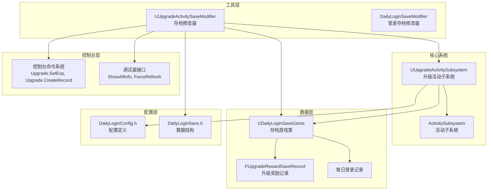
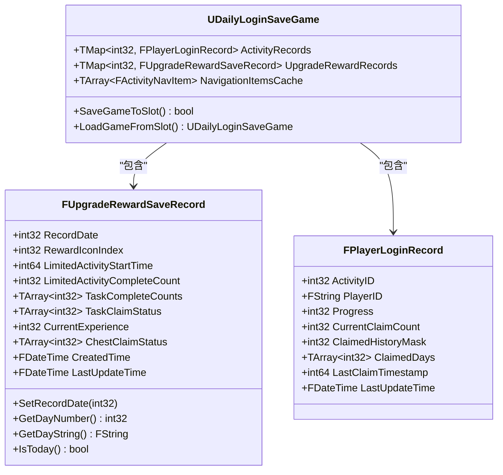
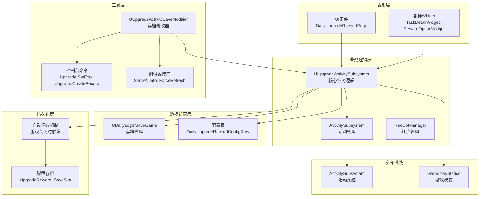
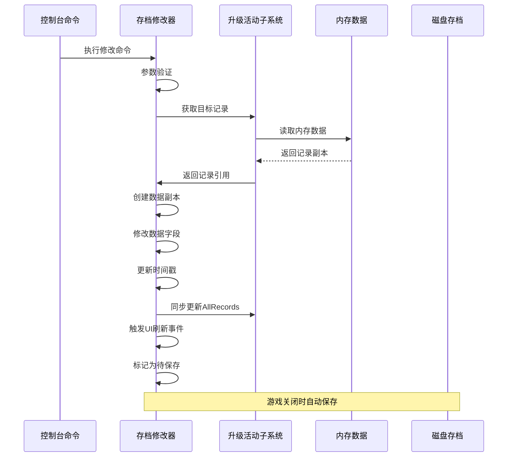
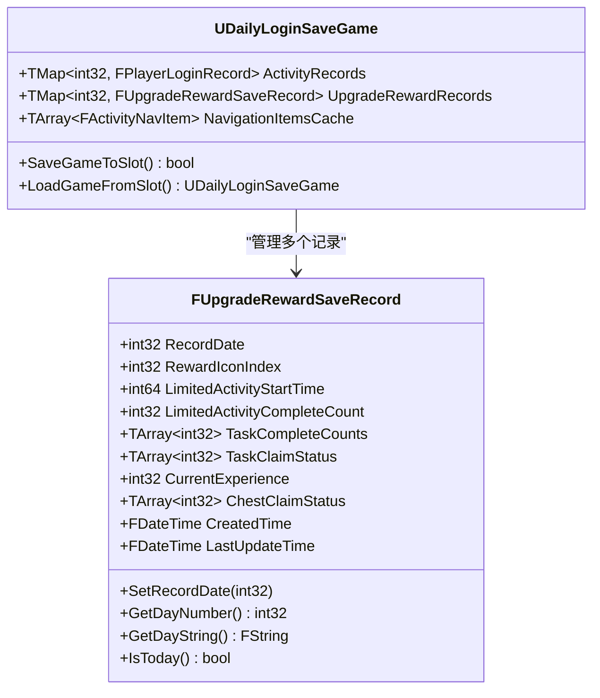
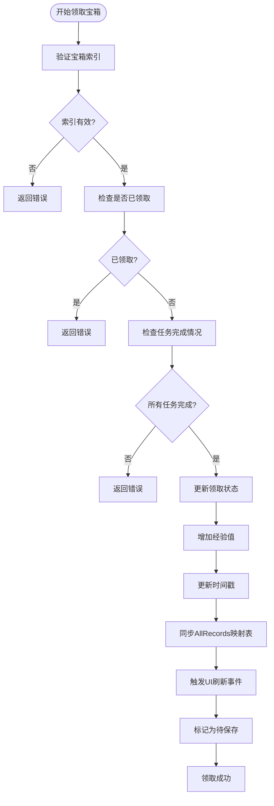
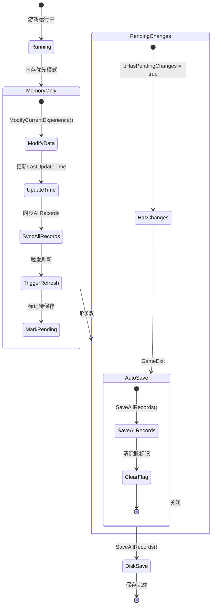
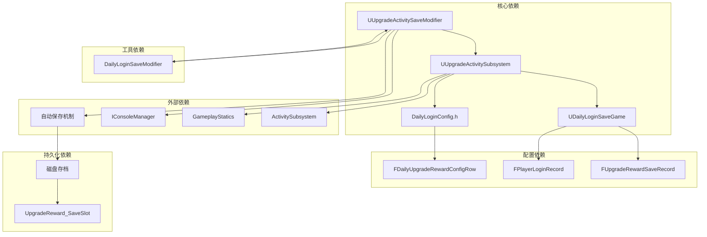

# 升级活动存档修改器

<cite>
**本文档引用的文件**
- [UpgradeActivitySaveModifier.h](file://MetalSlug01/Source/MetalSlug01/Public/Tools/UpgradeActivitySaveModifier.h)
- [UpgradeActivitySaveModifier.cpp](file://MetalSlug01/Source/MetalSlug01/Private/Tools/UpgradeActivitySaveModifier.cpp)
- [UpgradeActivitySubsystem.h](file://MetalSlug01/Source/MetalSlug01/Public/UI/Activity/Core/UpgradeActivitySubsystem.h)
- [DailyLoginSave.h](file://MetalSlug01/Source/MetalSlug01/Public/UI/Activity/Data/DailyLoginSave.h)
- [UpgradeActivitySaveModifier_Readme.md](file://UpgradeActivitySaveModifier_Readme.md)
</cite>

## 更新摘要
**变更内容**
- 更新了内存优先操作模式的详细说明
- 新增了自动磁盘持久化机制的架构分析
- 增强了控制台命令系统的功能说明
- 更新了数据同步机制的实现细节
- 完善了故障排除指南和最佳实践

## 目录
1. [简介](#简介)
2. [项目结构](#项目结构)
3. [核心组件](#核心组件)
4. [架构概览](#架构概览)
5. [详细组件分析](#详细组件分析)
6. [依赖关系分析](#依赖关系分析)
7. [性能考虑](#性能考虑)
8. [故障排除指南](#故障排除指南)
9. [结论](#结论)

## 简介

升级活动存档修改器是一个专为MetalSlug游戏设计的高级调试工具，用于动态修改和管理升级活动系统的存档数据。该修改器实现了革命性的"内存优先、自动持久化"架构，在游戏运行时完全操作内存中的数据，避免频繁的磁盘I/O操作，同时在游戏关闭时自动保存所有修改到磁盘。

**重大重构特性**：
- **完全内存操作**：所有修改在内存中进行，提升响应速度
- **自动磁盘持久化**：游戏关闭时自动保存到磁盘，无需手动干预
- **任意日期修改**：支持修改任意历史日期的数据，突破传统限制
- **内存与持久存储同步**：确保内存数据与磁盘数据实时同步
- **智能事件驱动**：修改后自动触发UI刷新事件

## 项目结构

项目采用模块化架构设计，实现了高度解耦的组件分离：

**图表来源**
- [UpgradeActivitySaveModifier.h](file://MetalSlug01/Source/MetalSlug01/Public/Tools/UpgradeActivitySaveModifier.h#L1-L347)
- [UpgradeActivitySubsystem.h](file://MetalSlug01/Source/MetalSlug01/Public/UI/Activity/Core/UpgradeActivitySubsystem.h#L1-L499)

**章节来源**
- [UpgradeActivitySaveModifier.h](file://MetalSlug01/Source/MetalSlug01/Public/Tools/UpgradeActivitySaveModifier.h#L1-L347)
- [UpgradeActivitySubsystem.h](file://MetalSlug01/Source/MetalSlug01/Public/UI/Activity/Core/UpgradeActivitySubsystem.h#L1-L499)

## 核心组件

### 升级活动存档修改器 (UUpgradeActivitySaveModifier)

**重大重构后的核心特性**：

- **内存优先操作**：所有修改都在内存中进行，避免频繁磁盘I/O
- **控制台命令系统**：提供完整的调试命令集，支持快速修改各种数据
- **数据验证机制**：内置完整的参数验证和边界检查
- **事件驱动刷新**：修改后自动触发UI刷新事件
- **自动持久化**：游戏关闭时自动保存所有修改到磁盘
- **任意日期支持**：支持修改任意历史日期的数据

### 升级活动子系统 (UUpgradeActivitySubsystem)

**核心业务逻辑**：
- **数据持久化**：负责将内存数据保存到磁盘
- **业务逻辑处理**：处理宝箱领取、任务完成等核心业务
- **配置数据管理**：管理活动配置和奖励配置
- **UI状态同步**：维护UI组件的状态和显示逻辑
- **存档管理**：提供完整的存档加载、保存功能

### 存档数据结构

系统使用统一的存档结构来管理所有活动数据：

**图表来源**
- [DailyLoginSave.h](file://MetalSlug01/Source/MetalSlug01/Public/UI/Activity/Data/DailyLoginSave.h#L233-L373)

**章节来源**
- [DailyLoginSave.h](file://MetalSlug01/Source/MetalSlug01/Public/UI/Activity/Data/DailyLoginSave.h#L233-L373)

## 架构概览

**重大重构后的系统架构**：

**系统关键设计原则**：

1. **内存优先设计**：运行时操作内存，关闭时统一持久化
2. **事件驱动架构**：通过委托事件通知UI组件刷新
3. **配置驱动逻辑**：业务逻辑通过配置表驱动，便于调整
4. **自动持久化机制**：确保数据安全性和一致性
5. **任意日期支持**：突破传统日期限制，支持历史数据修改

**章节来源**
- [UpgradeActivitySubsystem.h](file://MetalSlug01/Source/MetalSlug01/Public/UI/Activity/Core/UpgradeActivitySubsystem.h#L1-L499)
- [UpgradeActivitySaveModifier.cpp](file://MetalSlug01/Source/MetalSlug01/Private/Tools/UpgradeActivitySaveModifier.cpp#L686-L1036)

## 详细组件分析

### 控制台命令系统

**重构后的完整命令集**：

#### 基础修改命令

| 命令 | 参数 | 功能 | 示例 |
|------|------|------|------|
| Upgrade.SetExp | `[记录日期] [经验值]` | 设置指定日期的经验值 | `Upgrade.SetExp 1 150` |
| Upgrade.SetIcon | `[记录日期] [图标索引]` | 设置奖励图标索引 | `Upgrade.SetIcon 1 2` |
| Upgrade.SetChest | `[记录日期] [宝箱索引] [状态]` | 设置宝箱领取状态 | `Upgrade.SetChest 1 0 1` |
| Upgrade.SetTaskCount | `[记录日期] [任务索引] [完成次数]` | 设置任务完成次数 | `Upgrade.SetTaskCount 1 0 5` |

#### 高级操作命令

| 命令 | 参数 | 功能 | 示例 |
|------|------|------|------|
| Upgrade.CreateRecord | `[记录日期] [继承参数]` | 创建新记录 | `Upgrade.CreateRecord 2 1` |
| Upgrade.Reset | `[记录日期]` | 重置记录数据 | `Upgrade.Reset 1` |
| Upgrade.ShowInfo | `[记录日期]` | 显示记录信息 | `Upgrade.ShowInfo 1` |
| Upgrade.ShowAllInfo | `无参数` | 显示所有记录信息 | `Upgrade.ShowAllInfo` |

#### 新增功能命令

| 命令 | 参数 | 功能 | 示例 |
|------|------|------|------|
| Upgrade.SetTaskCount | `[记录日期] [任务索引] [完成次数]` | 设置任务完成次数 | `Upgrade.SetTaskCount 1 0 5` |

**章节来源**
- [UpgradeActivitySaveModifier_Readme.md](file://UpgradeActivitySaveModifier_Readme.md#L9-L189)

### 数据修改流程

**重构后的数据修改流程**：

**图表来源**
- [UpgradeActivitySaveModifier.cpp](file://MetalSlug01/Source/MetalSlug01/Private/Tools/UpgradeActivitySaveModifier.cpp#L86-L130)
- [UpgradeActivitySaveModifier.cpp](file://MetalSlug01/Source/MetalSlug01/Private/Tools/UpgradeActivitySaveModifier.cpp#L172-L217)

### 数据结构设计

**重构后的数据结构**：

#### 升级奖励记录结构

| 字段 | 类型 | 描述 | 默认值 |
|------|------|------|--------|
| RecordDate | int32 | 记录天数（1-7） | 1 |
| RewardIconIndex | int32 | 奖励图标索引 | 0 |
| LimitedActivityStartTime | int64 | 限时活动开始时间戳 | 0 |
| LimitedActivityCompleteCount | int32 | 限时活动完成次数 | 0 |
| TaskCompleteCounts | TArray<int32> | 任务完成次数数组 | 空数组 |
| TaskClaimStatus | TArray<int32> | 任务领取状态数组 | 空数组 |
| CurrentExperience | int32 | 当前累计经验值 | 0 |
| ChestClaimStatus | TArray<int32> | 宝箱领取状态数组 | 空数组 |
| CreatedTime | FDateTime | 记录创建时间 | 当前时间 |
| LastUpdateTime | FDateTime | 最后更新时间 | 当前时间 |

#### 存档管理结构

**重构后的存档类**：

**图表来源**
- [DailyLoginSave.h](file://MetalSlug01/Source/MetalSlug01/Public/UI/Activity/Data/DailyLoginSave.h#L352-L373)
- [DailyLoginSave.h](file://MetalSlug01/Source/MetalSlug01/Public/UI/Activity/Data/DailyLoginSave.h#L233-L343)

**章节来源**
- [DailyLoginSave.h](file://MetalSlug01/Source/MetalSlug01/Public/UI/Activity/Data/DailyLoginSave.h#L233-L343)

### 业务逻辑处理

**重构后的业务逻辑**：

#### 宝箱领取逻辑

**图表来源**
- [UpgradeActivitySubsystem.cpp](file://MetalSlug01/Source/MetalSlug01/Private/UI/Activity/Core/UpgradeActivitySubsystem.cpp#L235-L247)

#### 自动持久化机制

**新增的自动保存流程**：

**图表来源**
- [UpgradeActivitySaveModifier.cpp](file://MetalSlug01/Source/MetalSlug01/Private/Tools/UpgradeActivitySaveModifier.cpp#L592-L617)

**章节来源**
- [UpgradeActivitySubsystem.cpp](file://MetalSlug01/Source/MetalSlug01/Private/UI/Activity/Core/UpgradeActivitySubsystem.cpp#L235-L340)

## 依赖关系分析

**重构后的依赖关系**：

**图表来源**
- [UpgradeActivitySaveModifier.h](file://MetalSlug01/Source/MetalSlug01/Public/Tools/UpgradeActivitySaveModifier.h#L15-L19)
- [UpgradeActivitySubsystem.h](file://MetalSlug01/Source/MetalSlug01/Public/UI/Activity/Core/UpgradeActivitySubsystem.h#L14-L18)

**系统依赖特点**：

1. **单向依赖**：修改器依赖子系统，但子系统不依赖修改器
2. **接口隔离**：通过接口定义清晰的依赖边界
3. **配置驱动**：业务逻辑通过配置表驱动，减少硬编码
4. **事件解耦**：通过委托事件实现组件间的松耦合通信
5. **自动持久化**：新增的自动保存机制确保数据安全

**章节来源**
- [UpgradeActivitySaveModifier.h](file://MetalSlug01/Source/MetalSlug01/Public/Tools/UpgradeActivitySaveModifier.h#L15-L19)
- [UpgradeActivitySubsystem.h](file://MetalSlug01/Source/MetalSlug01/Public/UI/Activity/Core/UpgradeActivitySubsystem.h#L14-L18)

## 性能考虑

**重构后的性能优化策略**：

### 内存管理优化

1. **延迟持久化**：所有修改在内存中进行，游戏关闭时统一保存
2. **数据副本机制**：避免直接修改引用，防止数据竞争
3. **智能缓存**：配置表和常用数据进行内存缓存
4. **内存映射优化**：直接操作子系统的内存数据，避免重复加载

### 磁盘I/O优化

1. **批量保存**：避免频繁的磁盘写入操作
2. **增量更新**：只保存有修改的数据
3. **异步处理**：保存操作不影响游戏主线程
4. **自动持久化**：减少手动保存操作

### 网络和并发优化

1. **线程安全**：所有数据访问都经过同步保护
2. **原子操作**：关键数据修改采用原子操作
3. **死锁预防**：避免循环依赖和死锁情况
4. **事件驱动**：通过委托事件实现组件间通信

## 故障排除指南

### 常见问题及解决方案

#### 初始化失败

**问题症状**：修改器无法初始化，控制台命令不可用

**可能原因**：
1. WorldContext为空
2. GameInstance获取失败
3. Subsystem实例不存在
4. 内存映射失败

**解决步骤**：
1. 检查游戏是否正确加载
2. 确认Subsystem已正确初始化
3. 验证WorldContext的有效性
4. 查看控制台错误日志

#### 数据修改无效

**问题症状**：修改命令执行后数据没有变化

**可能原因**：
1. 记录日期不存在
2. 参数验证失败
3. 内存数据同步问题
4. 自动保存机制异常

**解决步骤**：
1. 使用`Upgrade.ShowAllInfo`查看当前数据状态
2. 确认记录日期的正确性
3. 检查参数范围和格式
4. 验证AllRecords映射表状态

#### 存档加载失败

**问题症状**：游戏重启后数据丢失

**可能原因**：
1. 磁盘保存失败
2. 存档文件损坏
3. 权限问题
4. 自动保存机制失效

**解决步骤**：
1. 检查磁盘空间和权限
2. 验证存档文件完整性
3. 查看控制台错误日志
4. 手动触发SaveAllRecords()

### 调试技巧

1. **使用ShowAllInfo命令**：查看所有记录的完整状态
2. **监控日志输出**：关注修改器的详细日志信息
3. **验证数据一致性**：确保内存和磁盘数据同步
4. **检查自动保存状态**：确认bHasPendingChanges标志

**章节来源**
- [UpgradeActivitySaveModifier_Readme.md](file://UpgradeActivitySaveModifier_Readme.md#L162-L189)

## 结论

升级活动存档修改器经过重大重构后，实现了革命性的"内存优先、自动持久化"架构。该系统成功地平衡了开发便利性和系统稳定性，通过采用内存优先的操作模式、完善的事件驱动机制和严格的参数验证，为开发者提供了强大而安全的调试能力。

**重构后的系统优势**：

1. **性能大幅提升**：内存操作避免了频繁磁盘I/O
2. **数据安全性增强**：自动持久化确保数据不会丢失
3. **功能更加完善**：支持任意日期修改和批量操作
4. **用户体验改善**：自动保存机制减少了手动操作
5. **架构更加清晰**：模块化设计支持功能扩展

**系统的主要改进**：

1. **内存优先设计**：所有修改在内存中进行，提升响应速度
2. **自动持久化机制**：游戏关闭时自动保存，无需手动干预
3. **任意日期支持**：突破传统日期限制，支持历史数据修改
4. **智能事件驱动**：修改后自动触发UI刷新
5. **完整的错误处理**：完善的日志记录和错误恢复机制

该系统不仅满足了当前的调试需求，也为未来的功能扩展奠定了坚实的基础。通过持续的优化和完善，它将成为游戏开发过程中的重要工具，为开发者提供更加高效、可靠的调试体验。