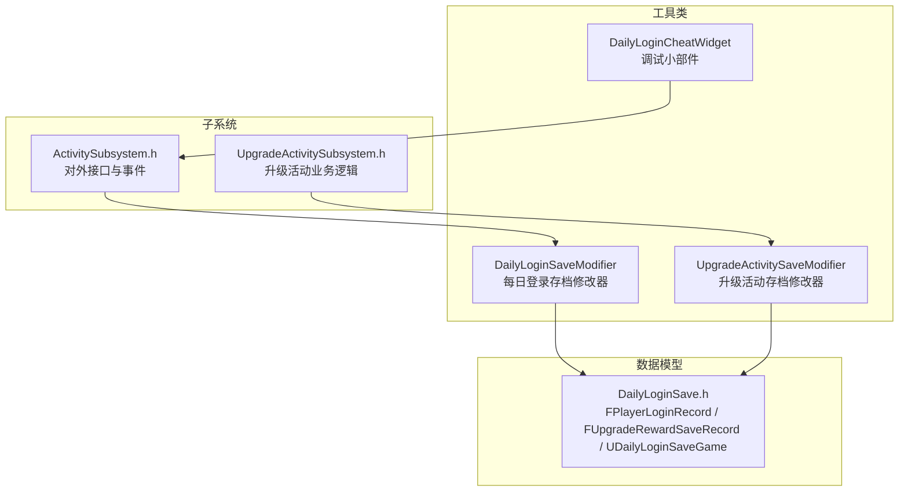
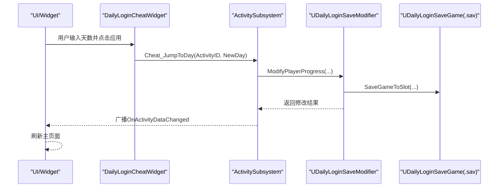
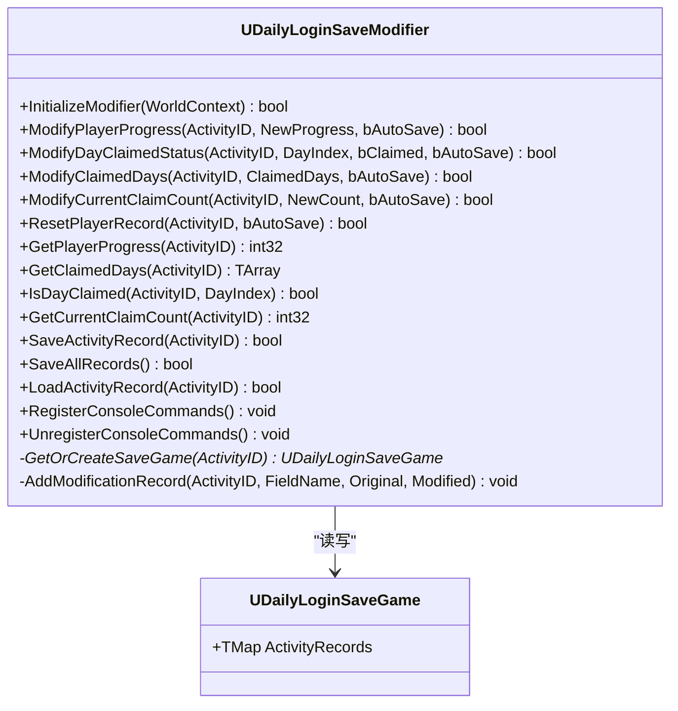
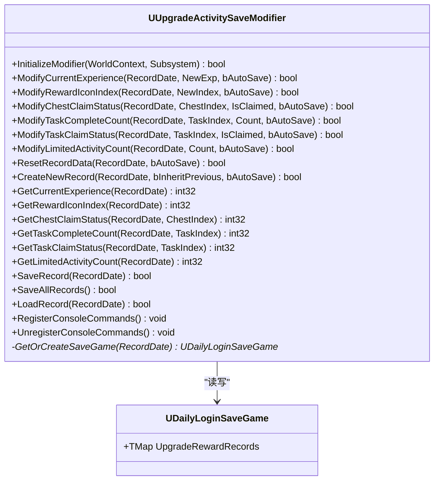
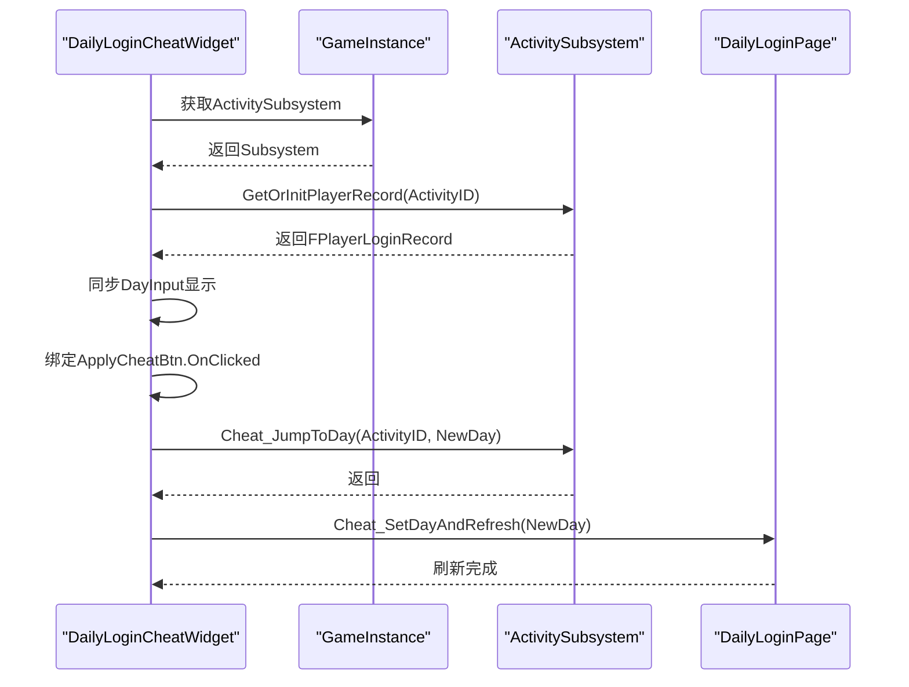
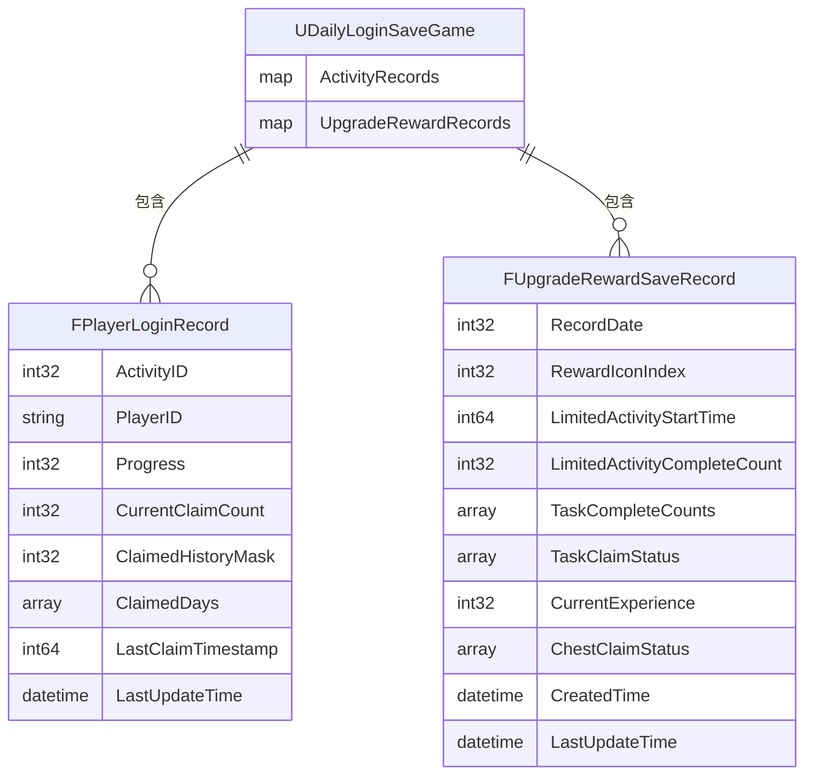
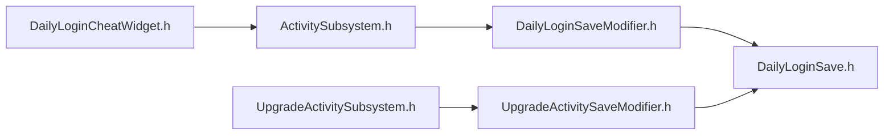

# 工具类

<cite>
**本文引用的文件**   
- [DailyLoginSaveModifier.cpp](file://MetalSlug01/Source/MetalSlug01/Private/Tools/DailyLoginSaveModifier.cpp)
- [DailyLoginSaveModifier.h](file://MetalSlug01/Source/MetalSlug01/Public/Tools/DailyLoginSaveModifier.h)
- [UpgradeActivitySaveModifier.cpp](file://MetalSlug01/Source/MetalSlug01/Private/Tools/UpgradeActivitySaveModifier.cpp)
- [UpgradeActivitySaveModifier.h](file://MetalSlug01/Source/MetalSlug01/Public/Tools/UpgradeActivitySaveModifier.h)
- [DailyLoginCheatWidget.cpp](file://MetalSlug01/Source/MetalSlug01/Private/UI/Activity/Pages/DemoWidget/DailyLoginCheatWidget.cpp)
- [DailyLoginCheatWidget.h](file://MetalSlug01/Source/MetalSlug01/Public/UI/Activity/Pages/DemoWidget/DailyLoginCheatWidget.h)
- [DailyLoginSave.h](file://MetalSlug01/Source/MetalSlug01/Public/UI/Activity/Data/DailyLoginSave.h)
- [ActivitySubsystem.h](file://MetalSlug01/Source/MetalSlug01/Public/UI/Activity/Core/ActivitySubsystem.h)
- [UpgradeActivitySubsystem.h](file://MetalSlug01/Source/MetalSlug01/Public/UI/Activity/Core/UpgradeActivitySubsystem.h)
- [README_DailyLoginSaveIntegration.md](file://MetalSlug01/Source/MetalSlug01/Public/Tools/README_DailyLoginSaveIntegration.md)
- [UpgradeActivitySaveModifier_Readme.md](file://UpgradeActivitySaveModifier_Readme.md)
</cite>

## 目录
1. [简介](#简介)
2. [项目结构](#项目结构)
3. [核心组件](#核心组件)
4. [架构总览](#架构总览)
5. [详细组件分析](#详细组件分析)
6. [依赖关系分析](#依赖关系分析)
7. [性能考量](#性能考量)
8. [故障排查指南](#故障排查指南)
9. [结论](#结论)
10. [附录](#附录)

## 简介
本文件面向MetalSlug项目的“工具类”模块，系统化梳理并解释以下内容：
- 存档集成工具：针对每日登录与升级奖励活动的运行时数据修改与持久化能力
- 调试工具：基于控制台命令与UI调试小部件的快速验证与辅助
- 开发辅助工具：面向扩展与二次开发的接口与最佳实践
- 工具与主系统的集成方式：API调用、数据共享、事件通信
- 工具使用的最佳实践与注意事项
- 完整的工具API参考与使用示例

## 项目结构
工具类主要分布在以下目录与文件中：
- Tools：提供两类存档修改器，分别用于每日登录与升级奖励活动
- UI/Activity/Pages/DemoWidget：提供调试小部件，便于快速切换与验证
- UI/Activity/Data：定义存档数据结构体与存档类
- UI/Activity/Core：子系统负责业务编排与对外接口

**图表来源**
- [DailyLoginSaveModifier.h](file://MetalSlug01/Source/MetalSlug01/Public/Tools/DailyLoginSaveModifier.h#L72-L294)
- [UpgradeActivitySaveModifier.h](file://MetalSlug01/Source/MetalSlug01/Public/Tools/UpgradeActivitySaveModifier.h#L34-L347)
- [DailyLoginCheatWidget.h](file://MetalSlug01/Source/MetalSlug01/Public/UI/Activity/Pages/DemoWidget/DailyLoginCheatWidget.h#L10-L34)
- [DailyLoginSave.h](file://MetalSlug01/Source/MetalSlug01/Public/UI/Activity/Data/DailyLoginSave.h#L85-L373)
- [ActivitySubsystem.h](file://MetalSlug01/Source/MetalSlug01/Public/UI/Activity/Core/ActivitySubsystem.h#L29-L178)
- [UpgradeActivitySubsystem.h](file://MetalSlug01/Source/MetalSlug01/Public/UI/Activity/Core/UpgradeActivitySubsystem.h#L35-L476)

**章节来源**
- [DailyLoginSaveModifier.h](file://MetalSlug01/Source/MetalSlug01/Public/Tools/DailyLoginSaveModifier.h#L1-L294)
- [UpgradeActivitySaveModifier.h](file://MetalSlug01/Source/MetalSlug01/Public/Tools/UpgradeActivitySaveModifier.h#L1-L347)
- [DailyLoginCheatWidget.h](file://MetalSlug01/Source/MetalSlug01/Public/UI/Activity/Pages/DemoWidget/DailyLoginCheatWidget.h#L1-L34)
- [DailyLoginSave.h](file://MetalSlug01/Source/MetalSlug01/Public/UI/Activity/Data/DailyLoginSave.h#L1-L373)
- [ActivitySubsystem.h](file://MetalSlug01/Source/MetalSlug01/Public/UI/Activity/Core/ActivitySubsystem.h#L1-L178)
- [UpgradeActivitySubsystem.h](file://MetalSlug01/Source/MetalSlug01/Public/UI/Activity/Core/UpgradeActivitySubsystem.h#L1-L476)

## 核心组件
- 每日登录存档修改器（UDailyLoginSaveModifier）
  - 提供运行时修改FPlayerLoginRecord的能力，支持进度、领取状态、批量天数、计数等修改
  - 自动保存至.sav文件，支持查询与历史记录追踪
  - 提供控制台命令注册与注销
- 升级活动存档修改器（UUpgradeActivitySaveModifier）
  - 提供运行时修改FUpgradeRewardSaveRecord的能力，支持经验值、图标索引、宝箱状态、任务状态、限时活动次数等
  - 与UpgradeActivitySubsystem解耦，专注数据修改与持久化
  - 支持创建新记录、重置记录、保存/加载、控制台命令
- 调试小部件（UDailyLoginCheatWidget）
  - 通过输入框与按钮，快速设置当前登录天数并触发主页面刷新
  - 与ActivitySubsystem交互，调用作弊接口并广播刷新
- 数据模型（DailyLoginSave.h）
  - 定义FPlayerLoginRecord、FUpgradeRewardSaveRecord、UDailyLoginSaveGame等结构
  - 作为存档与运行时数据的桥梁

**章节来源**
- [DailyLoginSaveModifier.h](file://MetalSlug01/Source/MetalSlug01/Public/Tools/DailyLoginSaveModifier.h#L72-L294)
- [UpgradeActivitySaveModifier.h](file://MetalSlug01/Source/MetalSlug01/Public/Tools/UpgradeActivitySaveModifier.h#L34-L347)
- [DailyLoginCheatWidget.h](file://MetalSlug01/Source/MetalSlug01/Public/UI/Activity/Pages/DemoWidget/DailyLoginCheatWidget.h#L10-L34)
- [DailyLoginSave.h](file://MetalSlug01/Source/MetalSlug01/Public/UI/Activity/Data/DailyLoginSave.h#L85-L373)

## 架构总览
工具类与主系统的集成采用“子系统对外暴露接口 + 修改器内部实现”的分层设计：
- ActivitySubsystem对外提供蓝图/代码接口，内部持有并转发到UDailyLoginSaveModifier
- UpgradeActivitySubsystem对外提供业务接口，内部持有并转发到UUpgradeActivitySaveModifier
- 两者均通过事件广播通知UI刷新
- 控制台命令通过修改器注册，直接驱动内存与持久化

**图表来源**
- [DailyLoginCheatWidget.cpp](file://MetalSlug01/Source/MetalSlug01/Private/UI/Activity/Pages/DemoWidget/DailyLoginCheatWidget.cpp#L41-L58)
- [ActivitySubsystem.h](file://MetalSlug01/Source/MetalSlug01/Public/UI/Activity/Core/ActivitySubsystem.h#L70-L71)
- [DailyLoginSaveModifier.cpp](file://MetalSlug01/Source/MetalSlug01/Private/Tools/DailyLoginSaveModifier.cpp#L60-L97)
- [DailyLoginSaveModifier.cpp](file://MetalSlug01/Source/MetalSlug01/Private/Tools/DailyLoginSaveModifier.cpp#L400-L430)

**章节来源**
- [ActivitySubsystem.h](file://MetalSlug01/Source/MetalSlug01/Public/UI/Activity/Core/ActivitySubsystem.h#L86-L142)
- [DailyLoginSaveModifier.cpp](file://MetalSlug01/Source/MetalSlug01/Private/Tools/DailyLoginSaveModifier.cpp#L27-L58)
- [DailyLoginSaveModifier.cpp](file://MetalSlug01/Source/MetalSlug01/Private/Tools/DailyLoginSaveModifier.cpp#L559-L664)

## 详细组件分析

### 每日登录存档修改器（UDailyLoginSaveModifier）
- 设计要点
  - 以FPlayerLoginRecord为核心修改目标，支持进度、领取状态、计数、历史掩码等字段
  - 通过缓存UDailyLoginSaveGame与UGameplayStatics实现自动保存
  - 提供修改历史记录追踪，便于审计与回溯
  - 提供控制台命令，便于快速调试
- 关键接口
  - InitializeModifier/DestroyModifier：生命周期管理
  - ModifyPlayerProgress/ModifyDayClaimedStatus/ModifyClaimedDays/ModifyCurrentClaimCount/ResetPlayerRecord：数据修改
  - GetPlayerProgress/GetClaimedDays/IsDayClaimed/GetCurrentClaimCount：数据查询
  - SaveActivityRecord/SaveAllRecords/LoadActivityRecord：存档读写
  - RegisterConsoleCommands/UnregisterConsoleCommands：控制台命令注册
- 控制台命令
  - DailyLogin.SetProgress、DailyLogin.SetDayClaimed、DailyLogin.Reset、DailyLogin.ShowInfo

**图表来源**
- [DailyLoginSaveModifier.h](file://MetalSlug01/Source/MetalSlug01/Public/Tools/DailyLoginSaveModifier.h#L72-L294)
- [DailyLoginSave.h](file://MetalSlug01/Source/MetalSlug01/Public/UI/Activity/Data/DailyLoginSave.h#L352-L373)

**章节来源**
- [DailyLoginSaveModifier.h](file://MetalSlug01/Source/MetalSlug01/Public/Tools/DailyLoginSaveModifier.h#L72-L294)
- [DailyLoginSaveModifier.cpp](file://MetalSlug01/Source/MetalSlug01/Private/Tools/DailyLoginSaveModifier.cpp#L22-L58)
- [DailyLoginSaveModifier.cpp](file://MetalSlug01/Source/MetalSlug01/Private/Tools/DailyLoginSaveModifier.cpp#L60-L307)
- [DailyLoginSaveModifier.cpp](file://MetalSlug01/Source/MetalSlug01/Private/Tools/DailyLoginSaveModifier.cpp#L400-L483)
- [DailyLoginSaveModifier.cpp](file://MetalSlug01/Source/MetalSlug01/Private/Tools/DailyLoginSaveModifier.cpp#L559-L664)

### 升级活动存档修改器（UUpgradeActivitySaveModifier）
- 设计要点
  - 与UpgradeActivitySubsystem解耦，直接操作内存中的记录，游戏关闭时统一持久化
  - 支持经验值、图标索引、宝箱状态、任务状态、限时活动次数等字段修改
  - 提供创建新记录、重置记录、保存/加载、控制台命令
- 关键接口
  - InitializeModifier/DestroyModifier：生命周期管理
  - ModifyCurrentExperience/ModifyRewardIconIndex/ModifyChestClaimStatus/ModifyTaskCompleteCount/ModifyTaskClaimStatus/ModifyLimitedActivityCount/ResetRecordData/CreateNewRecord：数据修改
  - GetCurrentExperience/GetRewardIconIndex/GetChestClaimStatus/GetTaskCompleteCount/GetTaskClaimStatus/GetLimitedActivityCount：数据查询
  - SaveRecord/SaveAllRecords/LoadRecord/SavePendingChangesOnShutdown：存档读写
  - RegisterConsoleCommands/UnregisterConsoleCommands：控制台命令注册
- 控制台命令
  - Upgrade.SetExp、Upgrade.SetIcon、Upgrade.SetChest、Upgrade.CreateRecord、Upgrade.Reset、Upgrade.ShowInfo、Upgrade.ShowAllInfo

**图表来源**
- [UpgradeActivitySaveModifier.h](file://MetalSlug01/Source/MetalSlug01/Public/Tools/UpgradeActivitySaveModifier.h#L34-L347)
- [DailyLoginSave.h](file://MetalSlug01/Source/MetalSlug01/Public/UI/Activity/Data/DailyLoginSave.h#L233-L373)

**章节来源**
- [UpgradeActivitySaveModifier.h](file://MetalSlug01/Source/MetalSlug01/Public/Tools/UpgradeActivitySaveModifier.h#L34-L347)
- [UpgradeActivitySaveModifier.cpp](file://MetalSlug01/Source/MetalSlug01/Private/Tools/UpgradeActivitySaveModifier.cpp#L25-L84)
- [UpgradeActivitySaveModifier.cpp](file://MetalSlug01/Source/MetalSlug01/Private/Tools/UpgradeActivitySaveModifier.cpp#L86-L420)
- [UpgradeActivitySaveModifier.cpp](file://MetalSlug01/Source/MetalSlug01/Private/Tools/UpgradeActivitySaveModifier.cpp#L547-L644)
- [UpgradeActivitySaveModifier.cpp](file://MetalSlug01/Source/MetalSlug01/Private/Tools/UpgradeActivitySaveModifier.cpp#L686-L744)

### 调试小部件（DailyLoginCheatWidget）
- 功能概述
  - 读取ActivitySubsystem中的真实进度，展示在输入框
  - 用户输入目标天数后，调用Cheat_JumpToDay并触发主页面刷新
- 关键流程

**图表来源**
- [DailyLoginCheatWidget.cpp](file://MetalSlug01/Source/MetalSlug01/Private/UI/Activity/Pages/DemoWidget/DailyLoginCheatWidget.cpp#L11-L76)
- [ActivitySubsystem.h](file://MetalSlug01/Source/MetalSlug01/Public/UI/Activity/Core/ActivitySubsystem.h#L70-L71)

**章节来源**
- [DailyLoginCheatWidget.h](file://MetalSlug01/Source/MetalSlug01/Public/UI/Activity/Pages/DemoWidget/DailyLoginCheatWidget.h#L10-L34)
- [DailyLoginCheatWidget.cpp](file://MetalSlug01/Source/MetalSlug01/Private/UI/Activity/Pages/DemoWidget/DailyLoginCheatWidget.cpp#L11-L76)
- [ActivitySubsystem.h](file://MetalSlug01/Source/MetalSlug01/Public/UI/Activity/Core/ActivitySubsystem.h#L70-L71)

### 数据模型（DailyLoginSave.h）
- FPlayerLoginRecord：每日登录进度记录，包含进度、计数、历史掩码、已领取天数等
- FUpgradeRewardSaveRecord：升级奖励活动记录，包含经验、图标索引、任务状态、宝箱状态、限时活动次数等
- UDailyLoginSaveGame：存档类，包含上述记录的映射表

**图表来源**
- [DailyLoginSave.h](file://MetalSlug01/Source/MetalSlug01/Public/UI/Activity/Data/DailyLoginSave.h#L85-L373)

**章节来源**
- [DailyLoginSave.h](file://MetalSlug01/Source/MetalSlug01/Public/UI/Activity/Data/DailyLoginSave.h#L85-L373)

## 依赖关系分析
- UDailyLoginSaveModifier依赖DailyLoginSave.h中的FPlayerLoginRecord与UDailyLoginSaveGame
- UUpgradeActivitySaveModifier依赖DailyLoginSave.h中的FUpgradeRewardSaveRecord与UDailyLoginSaveGame
- ActivitySubsystem持有并转发UDailyLoginSaveModifier的接口
- UpgradeActivitySubsystem持有并转发UUpgradeActivitySaveModifier的接口
- DailyLoginCheatWidget通过GameInstance获取ActivitySubsystem并调用作弊接口

**图表来源**
- [ActivitySubsystem.h](file://MetalSlug01/Source/MetalSlug01/Public/UI/Activity/Core/ActivitySubsystem.h#L11-L11)
- [UpgradeActivitySubsystem.h](file://MetalSlug01/Source/MetalSlug01/Public/UI/Activity/Core/UpgradeActivitySubsystem.h#L17-L17)
- [DailyLoginSaveModifier.h](file://MetalSlug01/Source/MetalSlug01/Public/Tools/DailyLoginSaveModifier.h#L16-L17)
- [UpgradeActivitySaveModifier.h](file://MetalSlug01/Source/MetalSlug01/Public/Tools/UpgradeActivitySaveModifier.h#L16-L17)
- [DailyLoginCheatWidget.h](file://MetalSlug01/Source/MetalSlug01/Public/UI/Activity/Pages/DemoWidget/DailyLoginCheatWidget.h#L7-L8)

**章节来源**
- [ActivitySubsystem.h](file://MetalSlug01/Source/MetalSlug01/Public/UI/Activity/Core/ActivitySubsystem.h#L11-L11)
- [UpgradeActivitySubsystem.h](file://MetalSlug01/Source/MetalSlug01/Public/UI/Activity/Core/UpgradeActivitySubsystem.h#L17-L17)
- [DailyLoginSaveModifier.h](file://MetalSlug01/Source/MetalSlug01/Public/Tools/DailyLoginSaveModifier.h#L16-L17)
- [UpgradeActivitySaveModifier.h](file://MetalSlug01/Source/MetalSlug01/Public/Tools/UpgradeActivitySaveModifier.h#L16-L17)
- [DailyLoginCheatWidget.h](file://MetalSlug01/Source/MetalSlug01/Public/UI/Activity/Pages/DemoWidget/DailyLoginCheatWidget.h#L7-L8)

## 性能考量
- 自动保存策略
  - UDailyLoginSaveModifier：每次修改可选择自动保存，减少频繁IO
  - UUpgradeActivitySaveModifier：运行时仅内存操作，游戏关闭时统一保存，降低运行时IO压力
- 历史记录与日志
  - 修改历史记录上限控制，避免无限增长
  - 控制台命令输出详细日志，便于定位问题但需注意日志级别
- UI刷新
  - 通过事件广播触发全局刷新，建议在批量修改时合并刷新以减少UI抖动

[本节为通用指导，无需特定文件引用]

## 故障排查指南
- 初始化失败
  - 检查WorldContext是否为空，确保在有效的GameInstance/World上下文中初始化
- 修改器未初始化
  - 确认InitializeModifier返回true，且DestroyModifier在合适时机调用
- 控制台命令无效
  - 确认命令已注册，且参数格式正确；参考控制台命令手册
- 数据未持久化
  - UDailyLoginSaveModifier：确认bAutoSave或显式调用SaveAllRecords
  - UUpgradeActivitySaveModifier：确认游戏关闭时触发SavePendingChangesOnShutdown
- UI未刷新
  - 确认事件广播正常，订阅者正确响应

**章节来源**
- [DailyLoginSaveModifier.cpp](file://MetalSlug01/Source/MetalSlug01/Private/Tools/DailyLoginSaveModifier.cpp#L27-L40)
- [UpgradeActivitySaveModifier.cpp](file://MetalSlug01/Source/MetalSlug01/Private/Tools/UpgradeActivitySaveModifier.cpp#L30-L66)
- [UpgradeActivitySaveModifier.cpp](file://MetalSlug01/Source/MetalSlug01/Private/Tools/UpgradeActivitySaveModifier.cpp#L592-L617)
- [UpgradeActivitySaveModifier_Readme.md](file://UpgradeActivitySaveModifier_Readme.md#L134-L189)

## 结论
本工具类通过“修改器 + 子系统 + 控制台命令 + UI调试小部件”的组合，提供了灵活、安全、可审计的运行时数据修改能力：
- 不侵入原有业务逻辑，保证稳定性
- 支持自动保存与历史记录，提升可维护性
- 提供丰富的调试手段，加速开发与测试
- 为后续扩展新工具功能提供清晰的接口与模式

[本节为总结性内容，无需特定文件引用]

## 附录

### 工具API参考与使用示例

- 每日登录存档修改器（UDailyLoginSaveModifier）
  - 接口概览
    - InitializeModifier/DestroyModifier：生命周期管理
    - ModifyPlayerProgress/ModifyDayClaimedStatus/ModifyClaimedDays/ModifyCurrentClaimCount/ResetPlayerRecord：数据修改
    - GetPlayerProgress/GetClaimedDays/IsDayClaimed/GetCurrentClaimCount：数据查询
    - SaveActivityRecord/SaveAllRecords/LoadActivityRecord：存档读写
    - RegisterConsoleCommands/UnregisterConsoleCommands：控制台命令注册
  - 示例（概念性）
    - 在蓝图中调用ModifyPlayerProgress设置进度
    - 使用DailyLogin.ShowInfo查看当前记录
  - 参考路径
    - [DailyLoginSaveModifier.h](file://MetalSlug01/Source/MetalSlug01/Public/Tools/DailyLoginSaveModifier.h#L72-L294)
    - [DailyLoginSaveModifier.cpp](file://MetalSlug01/Source/MetalSlug01/Private/Tools/DailyLoginSaveModifier.cpp#L60-L307)
    - [DailyLoginSaveModifier.cpp](file://MetalSlug01/Source/MetalSlug01/Private/Tools/DailyLoginSaveModifier.cpp#L400-L483)
    - [DailyLoginSaveModifier.cpp](file://MetalSlug01/Source/MetalSlug01/Private/Tools/DailyLoginSaveModifier.cpp#L559-L664)

- 升级活动存档修改器（UUpgradeActivitySaveModifier）
  - 接口概览
    - InitializeModifier/DestroyModifier：生命周期管理
    - ModifyCurrentExperience/ModifyRewardIconIndex/ModifyChestClaimStatus/ModifyTaskCompleteCount/ModifyTaskClaimStatus/ModifyLimitedActivityCount/ResetRecordData/CreateNewRecord：数据修改
    - GetCurrentExperience/GetRewardIconIndex/GetChestClaimStatus/GetTaskCompleteCount/GetTaskClaimStatus/GetLimitedActivityCount：数据查询
    - SaveRecord/SaveAllRecords/LoadRecord/SavePendingChangesOnShutdown：存档读写
    - RegisterConsoleCommands/UnregisterConsoleCommands：控制台命令注册
  - 示例（概念性）
    - 使用Upgrade.SetExp设置经验值
    - 使用Upgrade.CreateRecord创建新记录
  - 参考路径
    - [UpgradeActivitySaveModifier.h](file://MetalSlug01/Source/MetalSlug01/Public/Tools/UpgradeActivitySaveModifier.h#L34-L347)
    - [UpgradeActivitySaveModifier.cpp](file://MetalSlug01/Source/MetalSlug01/Private/Tools/UpgradeActivitySaveModifier.cpp#L86-L420)
    - [UpgradeActivitySaveModifier.cpp](file://MetalSlug01/Source/MetalSlug01/Private/Tools/UpgradeActivitySaveModifier.cpp#L547-L644)
    - [UpgradeActivitySaveModifier.cpp](file://MetalSlug01/Source/MetalSlug01/Private/Tools/UpgradeActivitySaveModifier.cpp#L686-L744)

- 调试小部件（DailyLoginCheatWidget）
  - 接口概览
    - NativeConstruct：初始化并绑定事件
    - OnApplyClicked：应用输入并调用作弊接口
    - NotifyMainPageRefresh：通知主页面刷新
  - 参考路径
    - [DailyLoginCheatWidget.h](file://MetalSlug01/Source/MetalSlug01/Public/UI/Activity/Pages/DemoWidget/DailyLoginCheatWidget.h#L10-L34)
    - [DailyLoginCheatWidget.cpp](file://MetalSlug01/Source/MetalSlug01/Private/UI/Activity/Pages/DemoWidget/DailyLoginCheatWidget.cpp#L11-L76)

- 子系统集成参考
  - ActivitySubsystem对外暴露存档修改器接口，便于蓝图与代码统一调用
  - UpgradeActivitySubsystem对外暴露业务接口，内部持有修改器
  - 参考路径
    - [ActivitySubsystem.h](file://MetalSlug01/Source/MetalSlug01/Public/UI/Activity/Core/ActivitySubsystem.h#L86-L142)
    - [UpgradeActivitySubsystem.h](file://MetalSlug01/Source/MetalSlug01/Public/UI/Activity/Core/UpgradeActivitySubsystem.h#L412-L476)

- 控制台命令手册
  - 每日登录：DailyLogin.SetProgress、DailyLogin.SetDayClaimed、DailyLogin.Reset、DailyLogin.ShowInfo
  - 升级活动：Upgrade.SetExp、Upgrade.SetIcon、Upgrade.SetChest、Upgrade.CreateRecord、Upgrade.Reset、Upgrade.ShowInfo、Upgrade.ShowAllInfo
  - 参考路径
    - [UpgradeActivitySaveModifier_Readme.md](file://UpgradeActivitySaveModifier_Readme.md#L1-L189)
    - [README_DailyLoginSaveIntegration.md](file://MetalSlug01/Source/MetalSlug01/Public/Tools/README_DailyLoginSaveIntegration.md#L1-L170)

### 扩展开发指南
- 新增工具功能步骤
  - 定义数据结构：在DailyLoginSave.h中新增结构体或扩展现有结构
  - 实现修改器：新建或复用修改器类，提供数据修改、查询、保存接口
  - 子系统集成：在对应子系统中暴露接口，转发到修改器
  - 控制台命令：注册新命令，便于快速调试
  - UI集成：如需可视化，新增Widget并通过子系统接口交互
- 自定义工具界面
  - 建议遵循现有Widget命名与绑定规范
  - 通过GameInstance获取子系统实例，调用公开接口
  - 使用事件广播驱动UI刷新，避免直接耦合

**章节来源**
- [DailyLoginSave.h](file://MetalSlug01/Source/MetalSlug01/Public/UI/Activity/Data/DailyLoginSave.h#L85-L373)
- [DailyLoginSaveModifier.h](file://MetalSlug01/Source/MetalSlug01/Public/Tools/DailyLoginSaveModifier.h#L72-L294)
- [UpgradeActivitySaveModifier.h](file://MetalSlug01/Source/MetalSlug01/Public/Tools/UpgradeActivitySaveModifier.h#L34-L347)
- [ActivitySubsystem.h](file://MetalSlug01/Source/MetalSlug01/Public/UI/Activity/Core/ActivitySubsystem.h#L86-L142)
- [UpgradeActivitySubsystem.h](file://MetalSlug01/Source/MetalSlug01/Public/UI/Activity/Core/UpgradeActivitySubsystem.h#L412-L476)