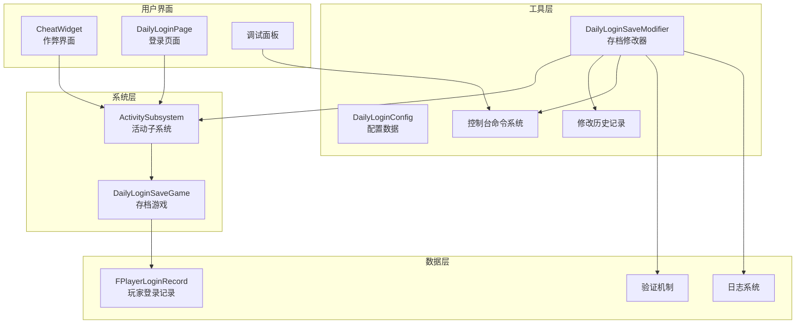
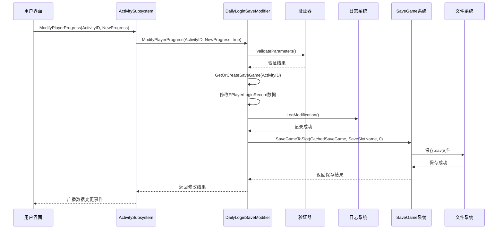
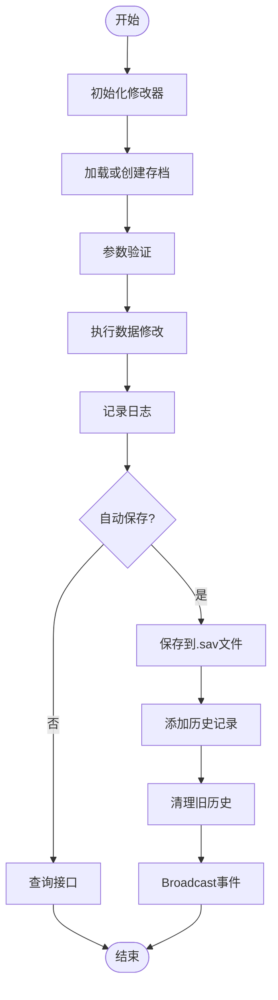
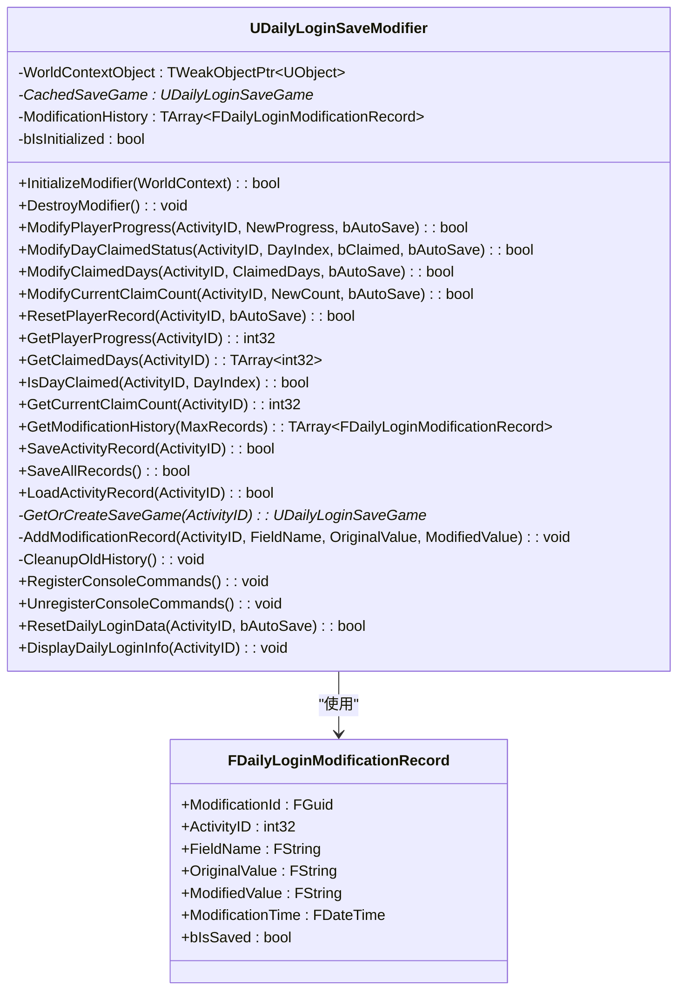
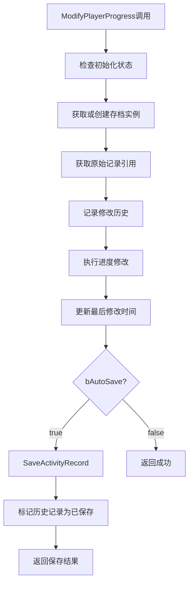
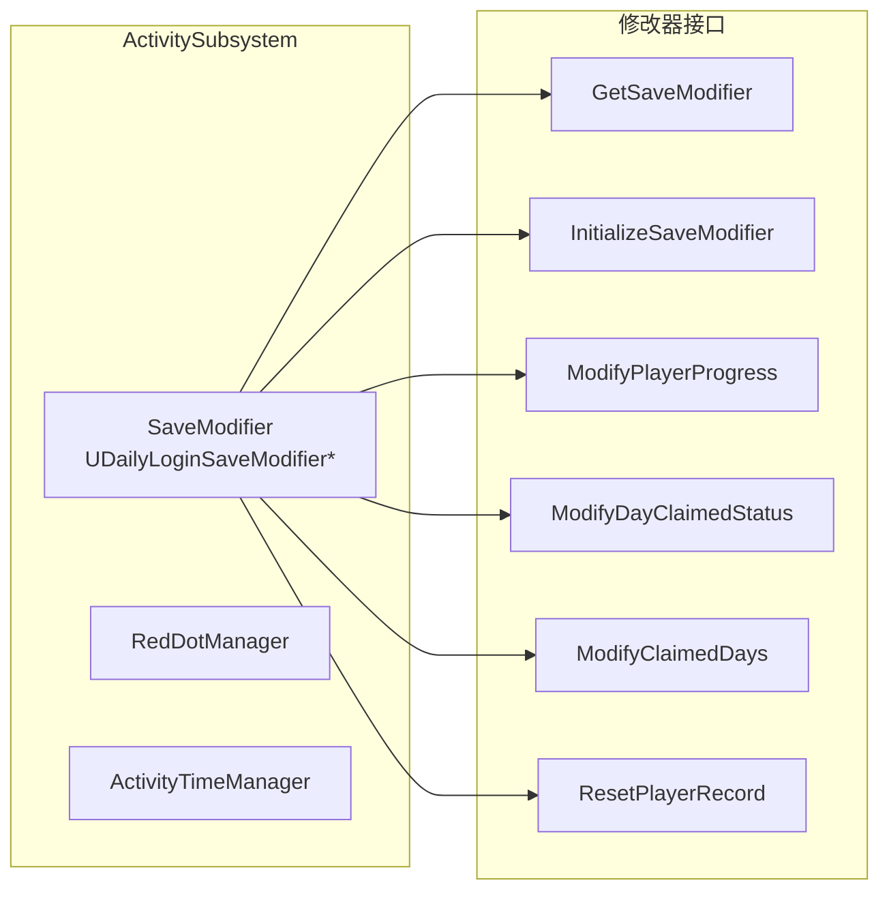
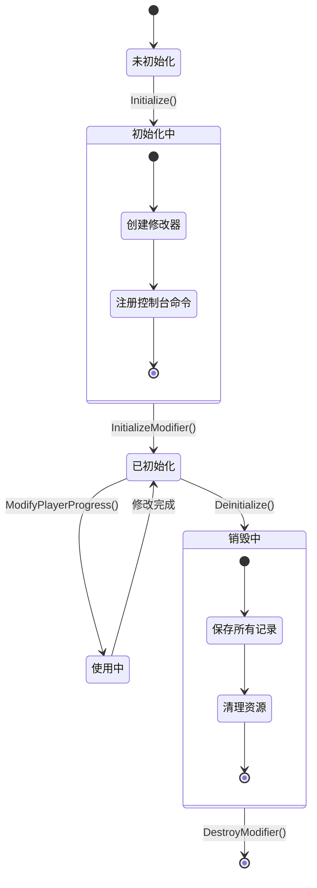
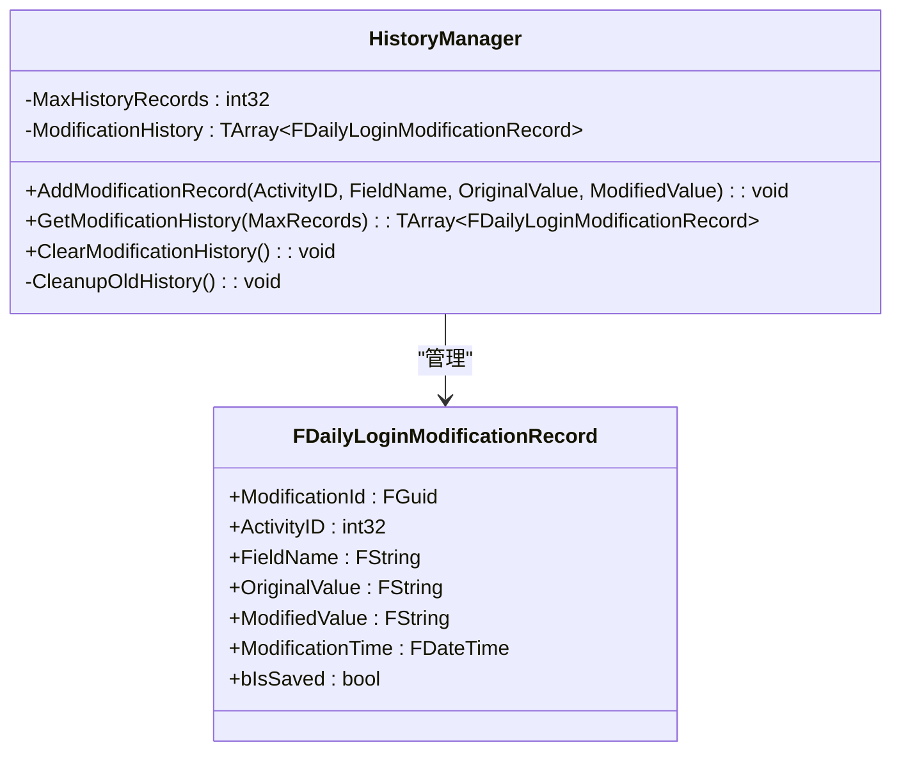
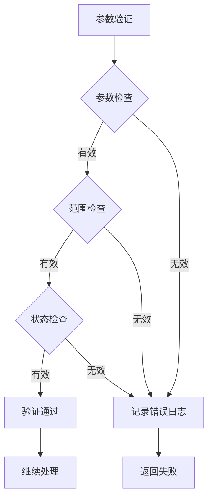
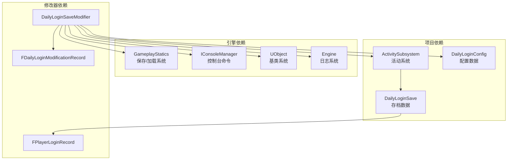

# 每日登录存档修改器

<cite>
**本文档引用的文件**
- [DailyLoginSaveModifier.h](file://MetalSlug01/Source/MetalSlug01/Public/Tools/DailyLoginSaveModifier.h)
- [DailyLoginSaveModifier.cpp](file://MetalSlug01/Source/MetalSlug01/Private/Tools/DailyLoginSaveModifier.cpp)
- [ActivitySubsystem.h](file://MetalSlug01/Source/MetalSlug01/Public/UI/Activity/Core/ActivitySubsystem.h)
- [ActivitySubsystem.cpp](file://MetalSlug01/Source/MetalSlug01/Private/UI/Activity/Core/ActivitySubsystem.cpp)
- [DailyLoginSave.h](file://MetalSlug01/Source/MetalSlug01/Public/UI/Activity/Data/DailyLoginSave.h)
- [README_DailyLoginSaveIntegration.md](file://MetalSlug01/Source/MetalSlug01/Public/Tools/README_DailyLoginSaveIntegration.md)
- [DailyLoginCheatWidget.cpp](file://MetalSlug01/Source/MetalSlug01/Private/UI/Activity/Pages/DemoWidget/DailyLoginCheatWidget.cpp)
- [UpgradeActivitySaveModifier.h](file://MetalSlug01/Source/MetalSlug01/Public/Tools/UpgradeActivitySaveModifier.h)
- [UpgradeActivitySaveModifier_Readme.md](file://UpgradeActivitySaveModifier_Readme.md)
</cite>

## 更新摘要
**变更内容**
- 新增了改进的调试和验证机制
- 增强了控制台命令功能和日志记录
- 完善了错误处理和边界检查
- 添加了历史记录追踪和清理机制
- 优化了性能监控和资源管理

## 目录
1. [简介](#简介)
2. [项目结构](#项目结构)
3. [核心组件](#核心组件)
4. [架构概览](#架构概览)
5. [详细组件分析](#详细组件分析)
6. [依赖关系分析](#依赖关系分析)
7. [性能考虑](#性能考虑)
8. [故障排除指南](#故障排除指南)
9. [结论](#结论)
10. [附录](#附录)

## 简介

每日登录存档修改器是一个专为MetalSlug游戏设计的运行时数据修改工具，用于动态修改DailyLoginSaveGame中的玩家进度数据。该修改器提供了完整的数据修改、自动保存和历史追踪功能，支持在游戏运行时对玩家的每日登录进度进行精确控制。

**更新** 该修改器现已集成了改进的调试和验证机制，提供了更强大的错误处理能力和更详细的日志记录功能。

该系统的核心价值在于：
- **实时数据修改**：无需重启游戏即可修改玩家进度
- **自动持久化**：所有修改自动保存到.sav文件
- **历史追踪**：完整记录每次修改操作的详细信息
- **安全验证**：提供输入验证和边界检查
- **无缝集成**：与ActivitySubsystem完美集成
- **增强调试**：完善的控制台命令和日志系统

## 项目结构

该项目采用模块化架构设计，主要包含以下核心模块：



**图表来源**
- [DailyLoginSaveModifier.h](file://MetalSlug01/Source/MetalSlug01/Public/Tools/DailyLoginSaveModifier.h#L1-L294)
- [ActivitySubsystem.h](file://MetalSlug01/Source/MetalSlug01/Public/UI/Activity/Core/ActivitySubsystem.h#L1-L178)
- [DailyLoginSave.h](file://MetalSlug01/Source/MetalSlug01/Public/UI/Activity/Data/DailyLoginSave.h#L1-L373)

**章节来源**
- [DailyLoginSaveModifier.h](file://MetalSlug01/Source/MetalSlug01/Public/Tools/DailyLoginSaveModifier.h#L1-L294)
- [ActivitySubsystem.h](file://MetalSlug01/Source/MetalSlug01/Public/UI/Activity/Core/ActivitySubsystem.h#L1-L178)
- [DailyLoginSave.h](file://MetalSlug01/Source/MetalSlug01/Public/UI/Activity/Data/DailyLoginSave.h#L1-L373)

## 核心组件

### FPlayerLoginRecord数据结构

FPlayerLoginRecord是每日登录系统的核心数据结构，包含以下关键字段：

| 字段名称 | 类型 | 描述 | 默认值 |
|---------|------|------|--------|
| ActivityID | int32 | 活动唯一标识符 | 0 |
| PlayerID | FString | 玩家ID | "DefaultPlayer" |
| Progress | int32 | 当前进度（已领取到第几天） | 0 |
| CurrentClaimCount | int32 | 当前已领取次数 | 0 |
| ClaimedHistoryMask | int32 | 已领取历史掩码 | 0 |
| ClaimedDays | TArray<int32> | 已领取的天数数组 | 空数组 |
| LastClaimTimestamp | int64 | 最后领取时间戳 | 0 |
| LastUpdateTime | FDateTime | 最后更新时间 | 当前时间 |

### 修改器核心功能

DailyLoginSaveModifier提供以下核心功能：

1. **数据修改接口**：支持修改玩家进度、领取状态等
2. **自动保存机制**：修改后自动保存到.sav文件
3. **查询接口**：提供数据查询和状态检查功能
4. **历史记录追踪**：记录所有修改操作的详细信息
5. **控制台命令**：提供便捷的调试和测试功能
6. **增强验证机制**：完善的输入验证和边界检查
7. **日志记录系统**：详细的调试信息输出

**更新** 新增了增强的验证机制，包括参数验证、边界检查和状态验证，确保数据完整性。

**章节来源**
- [DailyLoginSave.h](file://MetalSlug01/Source/MetalSlug01/Public/UI/Activity/Data/DailyLoginSave.h#L85-L161)
- [DailyLoginSaveModifier.h](file://MetalSlug01/Source/MetalSlug01/Public/Tools/DailyLoginSaveModifier.h#L68-L294)

## 架构概览

### 系统架构图



**图表来源**
- [ActivitySubsystem.cpp](file://MetalSlug01/Source/MetalSlug01/Private/UI/Activity/Core/ActivitySubsystem.cpp#L506-L527)
- [DailyLoginSaveModifier.cpp](file://MetalSlug01/Source/MetalSlug01/Private/Tools/DailyLoginSaveModifier.cpp#L400-L430)

### 数据流图



**图表来源**
- [DailyLoginSaveModifier.cpp](file://MetalSlug01/Source/MetalSlug01/Private/Tools/DailyLoginSaveModifier.cpp#L27-L97)
- [DailyLoginSaveModifier.cpp](file://MetalSlug01/Source/MetalSlug01/Private/Tools/DailyLoginSaveModifier.cpp#L400-L457)

## 详细组件分析

### DailyLoginSaveModifier类分析

#### 类结构图



**图表来源**
- [DailyLoginSaveModifier.h](file://MetalSlug01/Source/MetalSlug01/Public/Tools/DailyLoginSaveModifier.h#L72-L294)

#### 核心修改方法实现

##### ModifyPlayerProgress方法流程



**图表来源**
- [DailyLoginSaveModifier.cpp](file://MetalSlug01/Source/MetalSlug01/Private/Tools/DailyLoginSaveModifier.cpp#L60-L97)

**章节来源**
- [DailyLoginSaveModifier.cpp](file://MetalSlug01/Source/MetalSlug01/Private/Tools/DailyLoginSaveModifier.cpp#L60-L97)

### ActivitySubsystem集成分析

#### 集成架构图



**图表来源**
- [ActivitySubsystem.h](file://MetalSlug01/Source/MetalSlug01/Public/UI/Activity/Core/ActivitySubsystem.h#L86-L175)

#### 生命周期管理



**图表来源**
- [ActivitySubsystem.cpp](file://MetalSlug01/Source/MetalSlug01/Private/UI/Activity/Core/ActivitySubsystem.cpp#L7-L39)

**章节来源**
- [ActivitySubsystem.cpp](file://MetalSlug01/Source/MetalSlug01/Private/UI/Activity/Core/ActivitySubsystem.cpp#L7-L39)

### 数据结构深度分析

#### FPlayerLoginRecord字段详解

| 字段 | 类型 | 用途 | 修改方法 | 性能影响 |
|------|------|------|----------|----------|
| Progress | int32 | 当前进度 | ModifyPlayerProgress | O(1) |
| ClaimedDays | TArray<int32> | 已领取天数列表 | ModifyClaimedDays | O(n) |
| CurrentClaimCount | int32 | 领取次数统计 | ModifyDayClaimedStatus | O(1) |
| ClaimedHistoryMask | int32 | 掩码快速检查 | SetDayClaimed/IsDayClaimed | O(1) |
| LastUpdateTime | FDateTime | 时间戳 | 所有修改 | O(1) |

#### 修改历史记录机制



**图表来源**
- [DailyLoginSaveModifier.h](file://MetalSlug01/Source/MetalSlug01/Public/Tools/DailyLoginSaveModifier.h#L24-L66)

**章节来源**
- [DailyLoginSaveModifier.h](file://MetalSlug01/Source/MetalSlug01/Public/Tools/DailyLoginSaveModifier.h#L24-L66)

### 增强的调试和验证机制

#### 验证机制架构



**图表来源**
- [DailyLoginSaveModifier.cpp](file://MetalSlug01/Source/MetalSlug01/Private/Tools/DailyLoginSaveModifier.cpp#L107-L111)

#### 控制台命令系统

**更新** 新增了完整的控制台命令系统，提供便捷的调试功能：

| 命令 | 参数 | 功能 | 示例 |
|------|------|------|------|
| DailyLogin.SetProgress | ActivityID, ProgressValue | 设置每日登录进度 | `DailyLogin.SetProgress 101 5` |
| DailyLogin.SetDayClaimed | ActivityID, DayIndex, IsClaimed | 设置某天领取状态 | `DailyLogin.SetDayClaimed 101 3 1` |
| DailyLogin.Reset | ActivityID | 重置每日登录数据 | `DailyLogin.Reset 101` |
| DailyLogin.ShowInfo | ActivityID | 显示每日登录信息 | `DailyLogin.ShowInfo 101` |

**章节来源**
- [DailyLoginSaveModifier.cpp](file://MetalSlug01/Source/MetalSlug01/Private/Tools/DailyLoginSaveModifier.cpp#L559-L664)

## 依赖关系分析

### 外部依赖关系



**图表来源**
- [DailyLoginSaveModifier.h](file://MetalSlug01/Source/MetalSlug01/Public/Tools/DailyLoginSaveModifier.h#L14-L18)
- [ActivitySubsystem.h](file://MetalSlug01/Source/MetalSlug01/Public/UI/Activity/Core/ActivitySubsystem.h#L5-L11)

### 内部耦合度分析

| 组件 | 耦合类型 | 影响程度 | 说明 |
|------|----------|----------|------|
| DailyLoginSaveModifier | 低耦合 | ✓ | 专注于数据修改功能 |
| ActivitySubsystem | 中等耦合 | ✓ | 作为管理层协调各组件 |
| FPlayerLoginRecord | 低耦合 | ✓ | 纯数据结构，无副作用 |
| FDailyLoginModificationRecord | 低耦合 | ✓ | 简单数据传输对象 |
| SaveGame系统 | 低耦合 | ✓ | 通过引擎API间接访问 |

**章节来源**
- [DailyLoginSaveModifier.cpp](file://MetalSlug01/Source/MetalSlug01/Private/Tools/DailyLoginSaveModifier.cpp#L11-L14)
- [ActivitySubsystem.cpp](file://MetalSlug01/Source/MetalSlug01/Private/UI/Activity/Core/ActivitySubsystem.cpp#L1-L5)

## 性能考虑

### 时间复杂度分析

| 操作 | 时间复杂度 | 空间复杂度 | 优化建议 |
|------|------------|------------|----------|
| ModifyPlayerProgress | O(1) | O(1) | 已优化，无需额外分配 |
| ModifyDayClaimedStatus | O(1) | O(1) | 掩码操作O(1)，数组操作O(n) |
| ModifyClaimedDays | O(n) | O(n) | n为天数数量，可批量优化 |
| GetPlayerProgress | O(1) | O(1) | 直接访问映射表 |
| SaveActivityRecord | O(1) | O(1) | 引擎序列化开销 |
| GetModificationHistory | O(k) | O(k) | k为返回记录数 |

### 内存使用优化

1. **弱引用管理**：使用TWeakObjectPtr避免循环引用
2. **历史记录限制**：最大100条记录，防止内存泄漏
3. **延迟初始化**：仅在需要时创建存档实例
4. **批量操作**：支持批量修改减少IO操作
5. **资源清理**：析构时自动清理所有资源

### 并发安全性

- **线程安全**：修改器设计为单线程使用
- **状态检查**：所有操作前检查初始化状态
- **资源清理**：析构时自动清理所有资源
- **异常处理**：完善的错误捕获和恢复机制

**更新** 新增了增强的错误处理和异常恢复机制，确保系统稳定性。

## 故障排除指南

### 常见问题及解决方案

#### 1. 修改器未初始化错误

**症状**：调用任何修改方法都返回false

**原因**：
- WorldContext为空
- 修改器未正确初始化

**解决方案**：
```cpp
// 确保正确初始化
if (!ActivitySubsystem->InitializeSaveModifier(WorldContext)) {
    UE_LOG(LogTemp, Error, TEXT("初始化失败"));
    return;
}
```

#### 2. 存档加载失败

**症状**：无法获取或创建存档实例

**原因**：
- .sav文件损坏
- 权限不足
- 磁盘空间不足

**解决方案**：
```cpp
// 检查存档状态
if (!SaveModifier->LoadActivityRecord(ActivityID)) {
    UE_LOG(LogTemp, Warning, TEXT("存档不存在，将创建新记录"));
}
```

#### 3. 修改历史记录过多

**症状**：内存使用增加

**原因**：历史记录超过100条限制

**解决方案**：
```cpp
// 清理历史记录
SaveModifier->ClearModificationHistory();
```

#### 4. 控制台命令不可用

**症状**：输入控制台命令无响应

**原因**：
- 修改器未注册控制台命令
- 引擎未启用控制台
- 参数格式错误

**解决方案**：
```cpp
// 确保控制台命令已注册
SaveModifier->RegisterConsoleCommands();

// 检查命令格式
// 正确格式: DailyLogin.SetProgress 101 5
```

#### 5. 验证失败错误

**症状**：修改操作被拒绝

**原因**：
- 参数超出有效范围
- 状态不符合预期
- 权限不足

**解决方案**：
```cpp
// 检查参数有效性
if (DayIndex <= 0 || DayIndex > 32) {
    UE_LOG(LogTemp, Error, TEXT("天数索引无效: %d"), DayIndex);
    return false;
}
```

**章节来源**
- [DailyLoginSaveModifier.cpp](file://MetalSlug01/Source/MetalSlug01/Private/Tools/DailyLoginSaveModifier.cpp#L27-L58)
- [DailyLoginSaveModifier.cpp](file://MetalSlug01/Source/MetalSlug01/Private/Tools/DailyLoginSaveModifier.cpp#L559-L664)

## 结论

每日登录存档修改器是一个设计精良的运行时数据修改工具，具有以下优势：

### 技术优势
- **模块化设计**：清晰的职责分离和低耦合架构
- **完整功能**：涵盖数据修改、自动保存、历史追踪等核心功能
- **安全可靠**：完善的输入验证和错误处理机制
- **易于扩展**：良好的接口设计支持未来功能扩展
- **增强调试**：完整的控制台命令和日志系统

### 应用价值
- **开发效率**：大幅提高游戏测试和调试效率
- **用户体验**：为运营活动提供灵活的数据管理能力
- **系统稳定性**：自动保存机制防止数据丢失
- **维护便利**：完善的错误处理和恢复机制

### 改进建议
1. **并发支持**：考虑添加多线程安全机制
2. **性能监控**：添加详细的性能指标收集
3. **配置管理**：支持通过配置文件定制行为
4. **日志增强**：提供更多详细的调试信息
5. **验证扩展**：支持自定义验证规则

该修改器为MetalSlug项目提供了强大的运行时数据管理能力，是活动系统的重要组成部分。

## 附录

### API使用示例

#### 基本使用模式

```cpp
// 获取修改器实例
UDailyLoginSaveModifier* Modifier = ActivitySubsystem->GetSaveModifier();

// 修改玩家进度
Modifier->ModifyPlayerProgress(101, 5, true);

// 修改天数领取状态
Modifier->ModifyDayClaimedStatus(101, 3, true, true);

// 批量修改已领取天数
TArray<int32> Days = {1, 2, 3, 5};
Modifier->ModifyClaimedDays(101, Days, true);

// 重置玩家记录
Modifier->ResetPlayerRecord(101, true);
```

#### 高级功能使用

```cpp
// 查询当前进度
int32 Progress = Modifier->GetPlayerProgress(101);

// 查询已领取天数
TArray<int32> ClaimedDays = Modifier->GetClaimedDays(101);

// 检查某天是否已领取
bool bClaimed = Modifier->IsDayClaimed(101, 3);

// 获取修改历史
TArray<FDailyLoginModificationRecord> History = 
    Modifier->GetModificationHistory(50);
```

#### 控制台命令使用

```bash
# 设置玩家进度
DailyLogin.SetProgress 101 5

# 设置某天领取状态
DailyLogin.SetDayClaimed 101 3 1

# 重置玩家数据
DailyLogin.Reset 101

# 显示当前信息
DailyLogin.ShowInfo 101
```

#### 调试和日志使用

```cpp
// 显示详细信息
Modifier->DisplayDailyLoginInfo(101);

// 清理历史记录
Modifier->ClearModificationHistory();

// 获取修改历史
auto History = Modifier->GetModificationHistory(100);
for (const auto& Record : History) {
    UE_LOG(LogTemp, Log, TEXT("修改记录: %s -> %s at %s"), 
           *Record.OriginalValue, *Record.ModifiedValue, 
           *Record.ModificationTime.ToString());
}
```

**章节来源**
- [README_DailyLoginSaveIntegration.md](file://MetalSlug01/Source/MetalSlug01/Public/Tools/README_DailyLoginSaveIntegration.md#L20-L53)
- [DailyLoginCheatWidget.cpp](file://MetalSlug01/Source/MetalSlug01/Private/UI/Activity/Pages/DemoWidget/DailyLoginCheatWidget.cpp#L41-L58)
- [UpgradeActivitySaveModifier_Readme.md](file://UpgradeActivitySaveModifier_Readme.md#L1-L189)