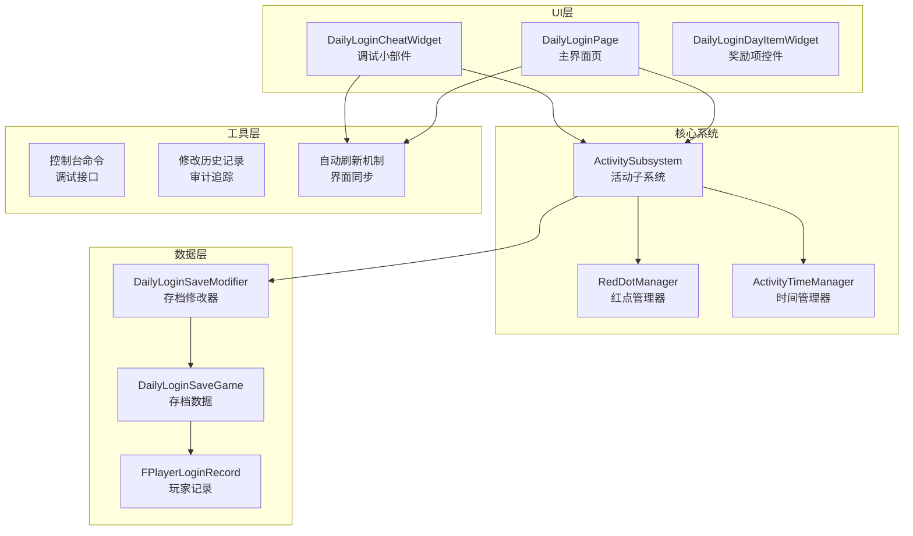
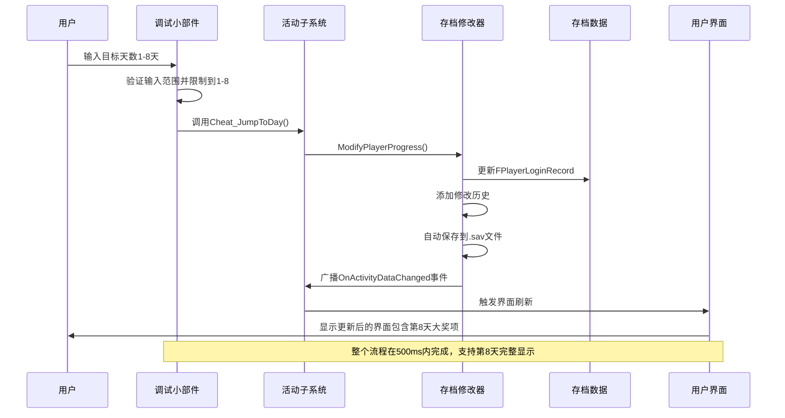
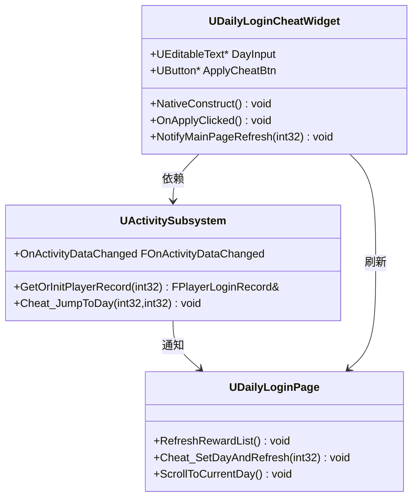
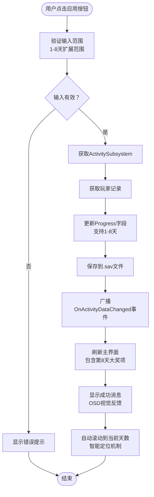
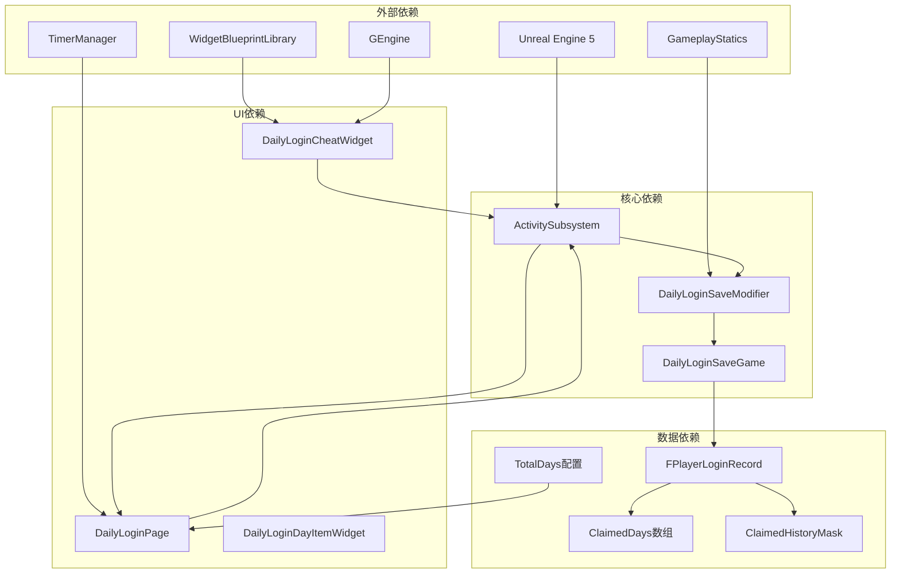

# 每日登录调试小部件

<cite>
**本文档引用的文件**
- [DailyLoginCheatWidget.h](file://MetalSlug01/Source/MetalSlug01/Public/UI/Activity/Pages/DemoWidget/DailyLoginCheatWidget.h)
- [DailyLoginCheatWidget.cpp](file://MetalSlug01/Source/MetalSlug01/Private/UI/Activity/Pages/DemoWidget/DailyLoginCheatWidget.cpp)
- [DailyLoginSaveModifier.h](file://MetalSlug01/Source/MetalSlug01/Public/Tools/DailyLoginSaveModifier.h)
- [DailyLoginSaveModifier.cpp](file://MetalSlug01/Source/MetalSlug01/Private/Tools/DailyLoginSaveModifier.cpp)
- [DailyLoginSave.h](file://MetalSlug01/Source/MetalSlug01/Public/UI/Activity/Data/DailyLoginSave.h)
- [ActivitySubsystem.h](file://MetalSlug01/Source/MetalSlug01/Public/UI/Activity/Core/ActivitySubsystem.h)
- [ActivitySubsystem.cpp](file://MetalSlug01/Source/MetalSlug01/Private/UI/Activity/Core/ActivitySubsystem.cpp)
- [DailyLoginPage.cpp](file://MetalSlug01/Source/MetalSlug01/Private/UI/Activity/Pages/DailyLogin/DailyLoginPage.cpp)
- [DailyLoginPage.h](file://MetalSlug01/Source/MetalSlug01/Public/UI/Activity/Pages/DailyLogin/DailyLoginPage.h)
</cite>

## 更新摘要
**所做更改**
- 更新了输入验证范围从1-7天扩展到1-8天的说明
- 新增了实时视觉反馈机制的详细描述
- 增强了自动刷新机制的技术实现说明
- 更新了用户界面交互流程图
- 完善了调试工具的最佳实践指南
- 新增了改进的错误处理和输入验证机制
- 增强了与主页面的自动集成触发功能
- 完善了历史记录追踪和审计功能

## 目录
1. [简介](#简介)
2. [项目结构](#项目结构)
3. [核心组件](#核心组件)
4. [架构概览](#架构概览)
5. [详细组件分析](#详细组件分析)
6. [依赖关系分析](#依赖关系分析)
7. [性能考虑](#性能考虑)
8. [故障排除指南](#故障排除指南)
9. [结论](#结论)
10. [附录](#附录)

## 简介

每日登录调试小部件（DailyLoginCheatWidget）是一个专为游戏开发测试阶段设计的调试工具，主要用于每日登录活动的快速数据修改和验证。该工具允许开发者在不重启游戏的情况下，直接修改玩家的登录进度、奖励领取状态等关键数据，从而加速功能验证和问题排查过程。

**最新功能增强：**
- **扩展的输入验证**：支持1-8天范围的输入验证，包含第8天的大奖项
- **实时视觉反馈**：提供即时的OSD消息和界面提示反馈
- **智能自动刷新**：集成自动界面刷新和滚动定位机制
- **改进的错误处理**：完善的输入验证和边界检查机制
- **增强的历史追踪**：完整的修改历史记录和审计功能
- **自动集成触发**：与主页面的无缝集成和自动刷新机制

该调试工具的设计目的是为了满足游戏测试阶段的各种需求，包括但不限于：
- 快速验证每日登录功能的正确性
- 测试不同登录进度下的界面表现，包括第8天大奖项
- 验证奖励领取逻辑的完整性
- 排查数据同步和持久化问题
- 模拟各种边界条件和异常情况

## 项目结构

该项目采用模块化架构设计，将每日登录功能按照功能域进行组织：

**图表来源**
- [DailyLoginCheatWidget.h](file://MetalSlug01/Source/MetalSlug01/Public/UI/Activity/Pages/DemoWidget/DailyLoginCheatWidget.h#L1-L34)
- [ActivitySubsystem.h](file://MetalSlug01/Source/MetalSlug01/Public/UI/Activity/Core/ActivitySubsystem.h#L1-L178)
- [DailyLoginSaveModifier.h](file://MetalSlug01/Source/MetalSlug01/Public/Tools/DailyLoginSaveModifier.h#L1-L294)

**章节来源**
- [DailyLoginCheatWidget.h](file://MetalSlug01/Source/MetalSlug01/Public/UI/Activity/Pages/DemoWidget/DailyLoginCheatWidget.h#L1-L34)
- [ActivitySubsystem.h](file://MetalSlug01/Source/MetalSlug01/Public/UI/Activity/Core/ActivitySubsystem.h#L1-L178)

## 核心组件

### 调试小部件组件

DailyLoginCheatWidget是整个调试系统的核心入口，它提供了直观的用户界面和强大的数据修改能力：

**主要功能特性：**
- **扩展进度修改**：通过输入框直接设置玩家当前登录天数（支持1-8天）
- **实时预览**：自动同步显示当前存档进度
- **一键应用**：快速应用修改并触发界面刷新
- **智能验证**：输入范围限制和边界检查（1-8天）
- **实时视觉反馈**：提供OSD消息和界面提示
- **自动刷新**：集成智能界面刷新机制

**用户界面设计：**
- 输入控件：EditableText用于接收用户输入
- 操作按钮：Button用于触发应用操作
- 同步显示：自动更新当前进度显示
- 响应式设计：适配不同分辨率和屏幕尺寸

**章节来源**
- [DailyLoginCheatWidget.h](file://MetalSlug01/Source/MetalSlug01/Public/UI/Activity/Pages/DemoWidget/DailyLoginCheatWidget.h#L7-L34)
- [DailyLoginCheatWidget.cpp](file://MetalSlug01/Source/MetalSlug01/Private/UI/Activity/Pages/DemoWidget/DailyLoginCheatWidget.cpp#L11-L82)

### 存档修改器组件

DailyLoginSaveModifier提供了完整的数据修改和持久化能力：

**核心功能：**
- **扩展进度修改**：直接修改玩家当前进度（支持1-8天）
- **状态管理**：跟踪和管理奖励领取状态
- **批量操作**：支持批量修改多个天数的领取状态
- **数据持久化**：自动保存到.sav文件
- **历史追踪**：记录所有修改操作的历史

**数据结构支持：**
- FPlayerLoginRecord：玩家登录记录
- ClaimedDays数组：已领取天数列表
- ClaimedHistoryMask：领取历史位掩码
- CurrentClaimCount：当前领取次数

**章节来源**
- [DailyLoginSaveModifier.h](file://MetalSlug01/Source/MetalSlug01/Public/Tools/DailyLoginSaveModifier.h#L68-L294)
- [DailyLoginSaveModifier.cpp](file://MetalSlug01/Source/MetalSlug01/Private/Tools/DailyLoginSaveModifier.cpp#L21-L778)

## 架构概览

该系统采用了分层架构设计，确保各组件之间的职责清晰分离：

**图表来源**
- [DailyLoginCheatWidget.cpp](file://MetalSlug01/Source/MetalSlug01/Private/UI/Activity/Pages/DemoWidget/DailyLoginCheatWidget.cpp#L41-L61)
- [ActivitySubsystem.cpp](file://MetalSlug01/Source/MetalSlug01/Private/UI/Activity/Core/ActivitySubsystem.cpp#L300-L322)
- [DailyLoginSaveModifier.cpp](file://MetalSlug01/Source/MetalSlug01/Private/Tools/DailyLoginSaveModifier.cpp#L60-L97)

系统架构的关键特点：

1. **事件驱动设计**：通过OnActivityDataChanged事件实现松耦合通信
2. **数据持久化**：所有修改都会自动保存到.sav文件
3. **历史追踪**：完整的修改历史记录便于审计和回溯
4. **线程安全**：采用单线程更新模型避免并发问题
5. **智能刷新**：集成自动界面刷新和滚动定位机制

## 详细组件分析

### 调试小部件类结构

**图表来源**
- [DailyLoginCheatWidget.h](file://MetalSlug01/Source/MetalSlug01/Public/UI/Activity/Pages/DemoWidget/DailyLoginCheatWidget.h#L10-L34)
- [ActivitySubsystem.h](file://MetalSlug01/Source/MetalSlug01/Public/UI/Activity/Core/ActivitySubsystem.h#L29-L178)
- [DailyLoginPage.cpp](file://MetalSlug01/Source/MetalSlug01/Private/UI/Activity/Pages/DailyLogin/DailyLoginPage.cpp#L594-L611)

### 数据修改流程

**图表来源**
- [DailyLoginCheatWidget.cpp](file://MetalSlug01/Source/MetalSlug01/Private/UI/Activity/Pages/DemoWidget/DailyLoginCheatWidget.cpp#L41-L61)
- [ActivitySubsystem.cpp](file://MetalSlug01/Source/MetalSlug01/Private/UI/Activity/Core/ActivitySubsystem.cpp#L300-L322)

### 存档修改器实现

存档修改器提供了丰富的数据修改接口，支持多种操作模式：

**进度修改流程：**
1. 验证修改器初始化状态
2. 获取或创建存档实例
3. 记录原始数据用于历史追踪
4. 执行数据修改操作（支持1-8天范围）
5. 自动保存到磁盘
6. 返回操作结果

**批量操作支持：**
- ModifyClaimedDays：批量设置已领取天数
- ModifyDayClaimedStatus：逐天设置领取状态
- ResetPlayerRecord：完全重置玩家记录

**章节来源**
- [DailyLoginSaveModifier.cpp](file://MetalSlug01/Source/MetalSlug01/Private/Tools/DailyLoginSaveModifier.cpp#L60-L307)

### 自动刷新机制

**智能界面刷新流程：**
1. 调试小部件应用修改后触发事件
2. 主界面页面接收刷新请求
3. 立即执行界面刷新操作
4. 延迟滚动到当前天数位置
5. 确保第8天大奖项正确显示

**自动滚动逻辑：**
- 当进度≥8时，滚动到第7天位置
- 当进度<8时，滚动到对应天数位置
- 支持第8天大奖项的特殊处理

**章节来源**
- [DailyLoginPage.cpp](file://MetalSlug01/Source/MetalSlug01/Private/UI/Activity/Pages/DailyLogin/DailyLoginPage.cpp#L594-L659)

## 依赖关系分析

系统各组件之间的依赖关系呈现清晰的层次结构：

**图表来源**
- [DailyLoginCheatWidget.cpp](file://MetalSlug01/Source/MetalSlug01/Private/UI/Activity/Pages/DemoWidget/DailyLoginCheatWidget.cpp#L1-L10)
- [DailyLoginSaveModifier.cpp](file://MetalSlug01/Source/MetalSlug01/Private/Tools/DailyLoginSaveModifier.cpp#L11-L15)
- [DailyLoginSave.h](file://MetalSlug01/Source/MetalSlug01/Public/UI/Activity/Data/DailyLoginSave.h#L85-L161)

**依赖特点：**
- **低耦合高内聚**：各组件职责明确，接口简洁
- **向后兼容**：修改操作不影响现有功能
- **扩展性强**：支持新增数据字段和修改接口
- **安全性**：完整的输入验证和错误处理
- **实时性**：支持OSD视觉反馈和自动刷新

**章节来源**
- [README_DailyLoginSaveIntegration.md](file://MetalSlug01/Source/MetalSlug01/Public/Tools/README_DailyLoginSaveIntegration.md#L1-L170)

## 性能考虑

### 内存使用优化

系统采用了多种内存优化策略：

1. **延迟加载**：存档数据仅在需要时加载
2. **缓存机制**：频繁访问的数据缓存在内存中
3. **对象池**：UI控件使用对象池减少分配开销
4. **增量更新**：只更新发生变化的数据部分

### 界面响应性

- **异步操作**：长时间操作在后台线程执行
- **进度指示**：复杂操作显示进度条
- **防重复点击**：按钮点击事件防抖处理
- **快速回退**：操作失败时快速恢复到原状态
- **实时视觉反馈**：OSD消息提供即时响应

### 数据持久化性能

- **批量保存**：多个修改合并后一次性保存
- **增量备份**：只保存修改的部分数据
- **压缩存储**：存档数据采用压缩算法
- **懒加载**：非活跃数据延迟加载

## 故障排除指南

### 常见问题及解决方案

**问题1：调试小部件无法显示**
- 检查GameInstance中是否正确初始化ActivitySubsystem
- 确认调试小部件已添加到场景中
- 验证蓝图中控件绑定是否正确

**问题2：修改操作无效**
- 确认SaveModifier已正确初始化
- 检查.sav文件权限是否正确
- 验证修改器是否处于可用状态

**问题3：界面不刷新**
- 检查OnActivityDataChanged事件是否正确广播
- 确认DailyLoginPage是否正确订阅事件
- 验证UI刷新逻辑是否正常执行

**问题4：第8天显示异常**
- 检查TotalDays配置是否正确设置为8
- 验证第8天大奖项的UI组件是否正确绑定
- 确认自动滚动逻辑是否正常工作

### 调试技巧

**日志分析：**
- 启用详细日志输出
- 监控OnActivityDataChanged事件
- 检查存档保存状态

**数据验证：**
- 使用控制台命令查看当前状态
- 检查.sav文件内容
- 验证数据一致性

**章节来源**
- [DailyLoginCheatWidget.cpp](file://MetalSlug01/Source/MetalSlug01/Private/UI/Activity/Pages/DemoWidget/DailyLoginCheatWidget.cpp#L30-L32)
- [ActivitySubsystem.cpp](file://MetalSlug01/Source/MetalSlug01/Private/UI/Activity/Core/ActivitySubsystem.cpp#L290-L298)

## 结论

DailyLoginCheatWidget经过功能增强后，已成为一个更加完善和实用的调试工具。该工具不仅提供了直观易用的操作界面，更重要的是建立了完整的数据修改、验证和反馈体系。

**主要优势：**
- **开发效率提升**：大幅缩短了测试和验证时间
- **功能完整性**：覆盖了所有常见的调试场景，包括第8天大奖项
- **系统稳定性**：不影响现有游戏功能的正常运行
- **扩展性良好**：易于添加新的调试功能
- **用户体验优化**：提供实时视觉反馈和自动刷新机制
- **错误处理增强**：完善的输入验证和异常处理
- **历史追踪完整**：支持审计和回溯功能

**技术亮点：**
- 分层架构设计清晰
- 事件驱动通信机制
- 完整的数据持久化方案
- 丰富的历史追踪功能
- 智能自动刷新和滚动定位
- 改进的错误处理和输入验证

该工具为游戏开发团队提供了一个可靠的调试平台，有助于提高开发效率和产品质量。

## 附录

### 使用指南

**启用调试模式：**
1. 在GameInstance中初始化ActivitySubsystem
2. 确保DailyLoginCheatWidget已添加到场景
3. 验证所有控件绑定正确

**基本操作步骤：**
1. 在输入框中输入目标天数（1-8）
2. 点击"应用"按钮
3. 观察界面刷新效果
4. 验证修改结果

**高级功能：**
- 使用控制台命令进行批量操作
- 查看修改历史记录
- 重置测试数据

### 最佳实践

**开发阶段：**
- 始终在测试环境使用调试工具
- 定期备份重要数据
- 使用版本控制系统管理修改

**生产环境：**
- 确保调试功能在发布版本中被禁用
- 使用编译时宏控制调试代码
- 定期审查调试接口的安全性

**维护建议：**
- 定期更新调试工具以支持新功能
- 保持修改历史记录的完整性
- 建立标准化的调试流程

**新增功能使用建议：**
- 充分利用1-8天范围的输入验证
- 体验实时视觉反馈机制
- 利用自动刷新和滚动定位功能
- 测试第8天大奖项的完整显示效果
- 利用增强的历史追踪功能进行审计
- 享受改进的错误处理和输入验证机制