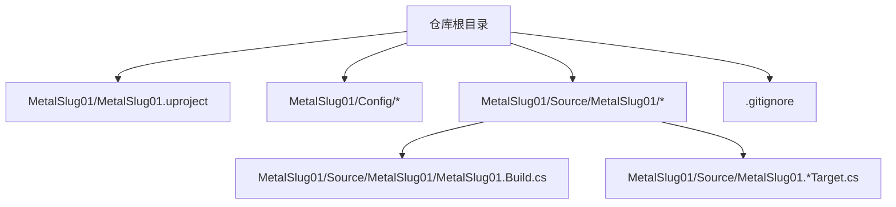
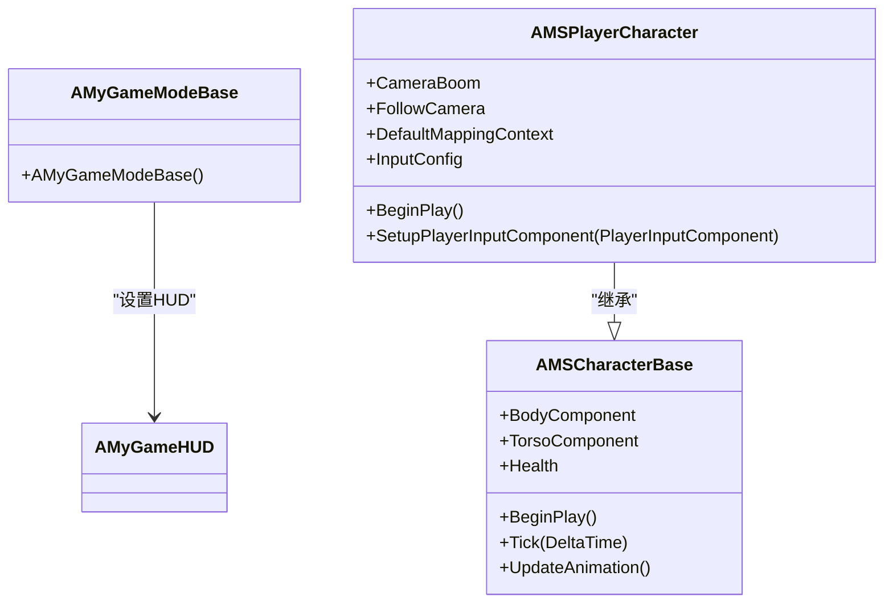
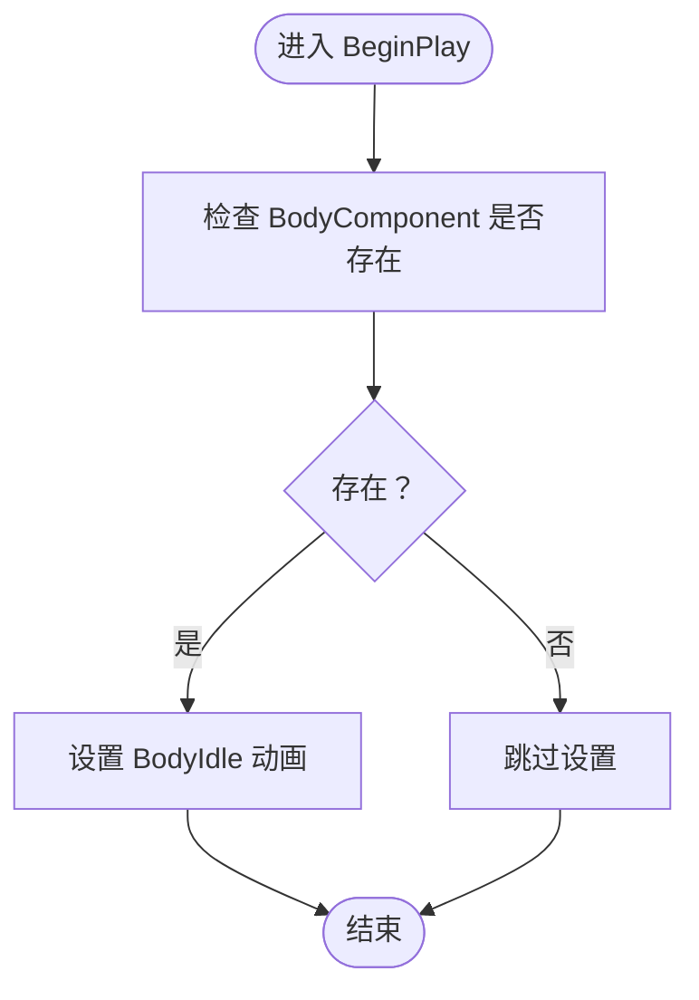
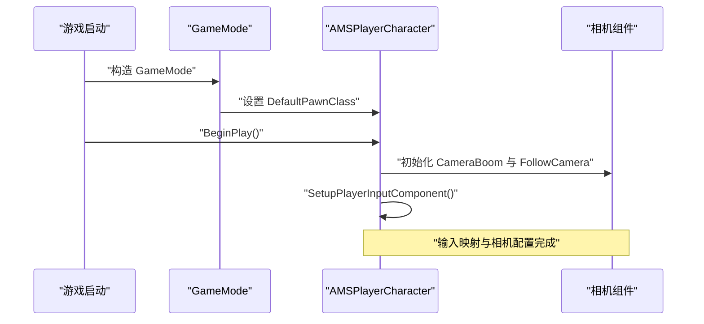
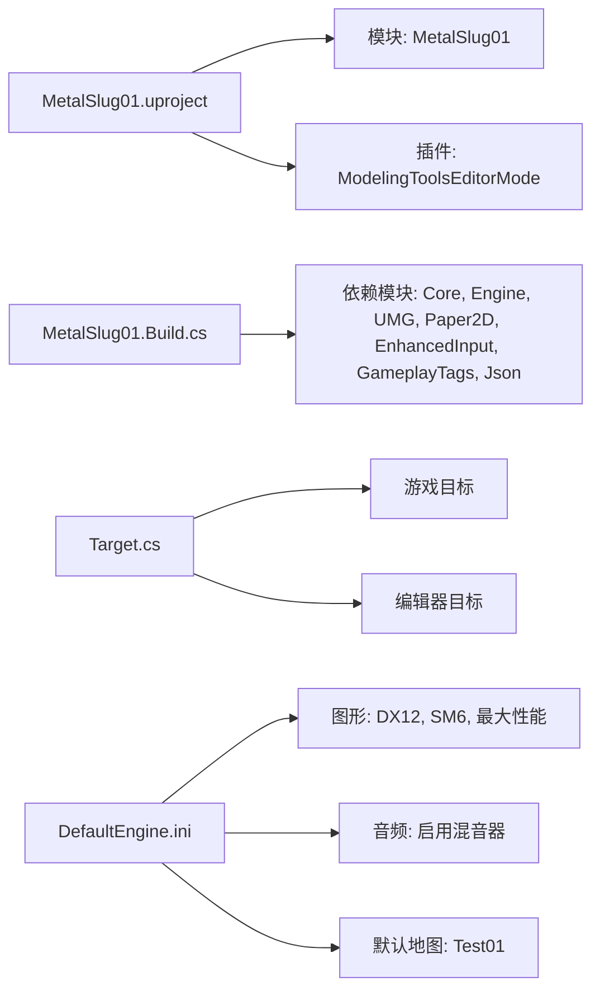

# 快速开始

<cite>
**本文引用的文件**
- [MetalSlug01.uproject](file://MetalSlug01/MetalSlug01.uproject)
- [DefaultEngine.ini](file://MetalSlug01/Config/DefaultEngine.ini)
- [DefaultGame.ini](file://MetalSlug01/Config/DefaultGame.ini)
- [MetalSlug01.Build.cs](file://MetalSlug01/Source/MetalSlug01/MetalSlug01.Build.cs)
- [MetalSlug01.Target.cs](file://MetalSlug01/Source/MetalSlug01.Target.cs)
- [MetalSlug01Editor.Target.cs](file://MetalSlug01/Source/MetalSlug01Editor.Target.cs)
- [.gitignore](file://.gitignore)
- [UpgradeActivitySaveModifier_Readme.md](file://UpgradeActivitySaveModifier_Readme.md)
- [MSCharacterBase.h](file://MetalSlug01/Source/MetalSlug01/Public/Characters/MSCharacterBase.h)
- [MSPlayerCharacter.h](file://MetalSlug01/Source/MetalSlug01/Public/Characters/MSPlayerCharacter.h)
- [MSCharacterBase.cpp](file://MetalSlug01/Source/MetalSlug01/Private/Characters/MSCharacterBase.cpp)
- [MSPlayerCharacter.cpp](file://MetalSlug01/Source/MetalSlug01/Private/Characters/MSPlayerCharacter.cpp)
- [MetalSlug01GameModeBase.h](file://MetalSlug01/Source/MetalSlug01/MetalSlug01GameModeBase.h)
- [MetalSlug01GameModeBase.cpp](file://MetalSlug01/Source/MetalSlug01/MetalSlug01GameModeBase.cpp)
</cite>

## 目录
1. [简介](#简介)
2. [项目结构](#项目结构)
3. [核心组件](#核心组件)
4. [架构总览](#架构总览)
5. [详细组件分析](#详细组件分析)
6. [依赖分析](#依赖分析)
7. [性能考虑](#性能考虑)
8. [故障排除指南](#故障排除指南)
9. [结论](#结论)
10. [附录](#附录)

## 简介
本指南面向首次接触 MetalSlug 项目的开发者，目标是帮助你在最短时间内完成开发环境搭建、项目导入、编译与运行，并理解项目的基本结构与常用调试命令。项目基于 Unreal Engine 5.6，采用 C++ 开发，使用 Paper2D 进行 2D 渲染，结合 UMG 和增强输入系统实现角色控制与 UI。

## 项目结构
项目采用标准的 Unreal Engine 5 工程目录组织方式，核心模块位于 MetalSlug01/Source/MetalSlug01 下，配置文件集中在 MetalSlug01/Config。根目录包含版本控制与忽略规则等通用文件。

图表来源
- [MetalSlug01.uproject](file://MetalSlug01/MetalSlug01.uproject#L1-L22)
- [MetalSlug01.Build.cs](file://MetalSlug01/Source/MetalSlug01/MetalSlug01.Build.cs#L1-L24)
- [MetalSlug01.Target.cs](file://MetalSlug01/Source/MetalSlug01.Target.cs#L1-L16)
- [MetalSlug01Editor.Target.cs](file://MetalSlug01/Source/MetalSlug01Editor.Target.cs#L1-L16)
- [.gitignore](file://.gitignore#L1-L93)

章节来源
- [MetalSlug01.uproject](file://MetalSlug01/MetalSlug01.uproject#L1-L22)
- [DefaultEngine.ini](file://MetalSlug01/Config/DefaultEngine.ini#L1-L58)
- [DefaultGame.ini](file://MetalSlug01/Config/DefaultGame.ini#L1-L6)
- [MetalSlug01.Build.cs](file://MetalSlug01/Source/MetalSlug01/MetalSlug01.Build.cs#L1-L24)
- [MetalSlug01.Target.cs](file://MetalSlug01/Source/MetalSlug01.Target.cs#L1-L16)
- [MetalSlug01Editor.Target.cs](file://MetalSlug01/Source/MetalSlug01Editor.Target.cs#L1-L16)
- [.gitignore](file://.gitignore#L1-L93)

## 核心组件
- 引擎关联与模块
  - 引擎版本：5.6
  - 模块名称：MetalSlug01（运行时）
  - 插件：ModelingToolsEditorMode（启用）
- 构建配置
  - 依赖模块：Core、CoreUObject、Engine、InputCore、UMG、Paper2D、EnhancedInput、GameplayTags、Json、JsonUtilities
  - 目标类型：游戏（Game）与编辑器（Editor）
- 配置要点
  - 默认地图：Test01
  - 图形：DX12、SM6、最大性能
  - 音频：启用音频混音器
  - UI：禁用自动变量创建

章节来源
- [MetalSlug01.uproject](file://MetalSlug01/MetalSlug01.uproject#L3-L21)
- [MetalSlug01.Build.cs](file://MetalSlug01/Source/MetalSlug01/MetalSlug01.Build.cs#L11-L13)
- [DefaultEngine.ini](file://MetalSlug01/Config/DefaultEngine.ini#L6-L30)
- [DefaultEngine.ini](file://MetalSlug01/Config/DefaultEngine.ini#L54-L57)
- [DefaultGame.ini](file://MetalSlug01/Config/DefaultGame.ini#L1-L6)

## 架构总览
下图展示了项目启动流程与关键类之间的关系：GameMode 负责默认 Pawn 与 HUD 的设置；角色基类提供 2D 动画与物理组件；玩家角色扩展输入映射与相机系统。

图表来源
- [MetalSlug01GameModeBase.cpp](file://MetalSlug01/Source/MetalSlug01/MetalSlug01GameModeBase.cpp#L9-L26)
- [MSCharacterBase.h](file://MetalSlug01/Source/MetalSlug01/Public/Characters/MSCharacterBase.h#L10-L50)
- [MSPlayerCharacter.h](file://MetalSlug01/Source/MetalSlug01/Public/Characters/MSPlayerCharacter.h#L13-L41)

章节来源
- [MetalSlug01GameModeBase.h](file://MetalSlug01/Source/MetalSlug01/MetalSlug01GameModeBase.h#L9-L16)
- [MetalSlug01GameModeBase.cpp](file://MetalSlug01/Source/MetalSlug01/MetalSlug01GameModeBase.cpp#L9-L26)
- [MSCharacterBase.h](file://MetalSlug01/Source/MetalSlug01/Public/Characters/MSCharacterBase.h#L10-L50)
- [MSPlayerCharacter.h](file://MetalSlug01/Source/MetalSlug01/Public/Characters/MSPlayerCharacter.h#L13-L41)

## 详细组件分析

### 角色基类（2D Paper2D）
- 组件职责
  - 身体与躯干动画组件：用于分层渲染与动画切换
  - 物理移动：平面约束、蹲伏高度与速度配置
  - 首帧强制赋图：避免黑屏或首帧延迟
- 关键点
  - 使用 PaperFlipbookComponent 管理动画资源
  - 在 BeginPlay 中确保动画初始状态正确

图表来源
- [MSCharacterBase.cpp](file://MetalSlug01/Source/MetalSlug01/Private/Characters/MSCharacterBase.cpp#L31-L39)

章节来源
- [MSCharacterBase.h](file://MetalSlug01/Source/MetalSlug01/Public/Characters/MSCharacterBase.h#L22-L49)
- [MSCharacterBase.cpp](file://MetalSlug01/Source/MetalSlug01/Private/Characters/MSCharacterBase.cpp#L7-L39)

### 玩家角色（输入与相机）
- 组件职责
  - 相机臂与跟随相机：正交投影、固定宽高
  - 输入映射上下文与输入配置：增强输入系统
  - 自动接管玩家输入：保证按键响应
- 关键点
  - 使用 EnhancedInput 与 InputMappingContext
  - 相机投影模式为 Orthographic

图表来源
- [MetalSlug01GameModeBase.cpp](file://MetalSlug01/Source/MetalSlug01/MetalSlug01GameModeBase.cpp#L9-L26)
- [MSPlayerCharacter.cpp](file://MetalSlug01/Source/MetalSlug01/Private/Characters/MSPlayerCharacter.cpp#L10-L25)

章节来源
- [MSPlayerCharacter.h](file://MetalSlug01/Source/MetalSlug01/Public/Characters/MSPlayerCharacter.h#L25-L41)
- [MSPlayerCharacter.cpp](file://MetalSlug01/Source/MetalSlug01/Private/Characters/MSPlayerCharacter.cpp#L10-L32)

### 升级活动调试工具（控制台命令）
- 用途
  - 快速调试升级活动系统的数据与状态
  - 支持设置经验值、奖励图标、宝箱领取状态、创建记录、重置数据、查看信息等
- 常用命令
  - 设置经验值、设置奖励图标、设置宝箱状态、创建记录、重置记录、显示单条/全部信息
- 使用建议
  - 打开编辑器控制台（波浪号键），按顺序设置数据并使用 ShowInfo 验证
  - 多记录批量查看时可先创建新记录再设置

章节来源
- [UpgradeActivitySaveModifier_Readme.md](file://UpgradeActivitySaveModifier_Readme.md#L1-L189)

## 依赖分析
- 引擎版本与模块
  - 引擎版本：5.6
  - 运行时模块：MetalSlug01
  - 依赖模块：UMG、Paper2D、EnhancedInput、GameplayTags、Json、JsonUtilities
- 目标类型
  - 游戏目标：MetalSlug01Target
  - 编辑器目标：MetalSlug01EditorTarget
- 配置文件
  - DefaultEngine.ini：图形、音频、默认地图
  - DefaultGame.ini：项目标识、UI 设置

图表来源
- [MetalSlug01.uproject](file://MetalSlug01/MetalSlug01.uproject#L3-L21)
- [MetalSlug01.Build.cs](file://MetalSlug01/Source/MetalSlug01/MetalSlug01.Build.cs#L11-L13)
- [MetalSlug01.Target.cs](file://MetalSlug01/Source/MetalSlug01.Target.cs#L10-L14)
- [MetalSlug01Editor.Target.cs](file://MetalSlug01/Source/MetalSlug01Editor.Target.cs#L10-L14)
- [DefaultEngine.ini](file://MetalSlug01/Config/DefaultEngine.ini#L6-L30)
- [DefaultEngine.ini](file://MetalSlug01/Config/DefaultEngine.ini#L54-L57)

章节来源
- [MetalSlug01.uproject](file://MetalSlug01/MetalSlug01.uproject#L3-L21)
- [MetalSlug01.Build.cs](file://MetalSlug01/Source/MetalSlug01/MetalSlug01.Build.cs#L11-L13)
- [MetalSlug01.Target.cs](file://MetalSlug01/Source/MetalSlug01.Target.cs#L10-L14)
- [MetalSlug01Editor.Target.cs](file://MetalSlug01/Source/MetalSlug01Editor.Target.cs#L10-L14)
- [DefaultEngine.ini](file://MetalSlug01/Config/DefaultEngine.ini#L6-L30)
- [DefaultEngine.ini](file://MetalSlug01/Config/DefaultEngine.ini#L54-L57)

## 性能考虑
- 图形设置
  - 默认桌面硬件类与最大性能，适合开发阶段
  - 启用光线追踪与距离场等特性，建议在发布版本按平台调整
- 音频
  - 启用音频混音器，注意资源占用与播放优化
- 地图与加载
  - 默认地图为 Test01，建议在开发中拆分关卡以提升加载效率

章节来源
- [DefaultEngine.ini](file://MetalSlug01/Config/DefaultEngine.ini#L6-L10)
- [DefaultEngine.ini](file://MetalSlug01/Config/DefaultEngine.ini#L18-L30)
- [DefaultEngine.ini](file://MetalSlug01/Config/DefaultEngine.ini#L54-L57)

## 故障排除指南
- 无法打开项目或引擎版本不匹配
  - 确认已安装 UE 5.6，并在引擎版本选择器中正确关联
  - 检查 MetalSlug01.uproject 中的 EngineAssociation 字段
- 编译失败或模块缺失
  - 确认 MetalSlug01.Build.cs 中依赖模块齐全
  - 若使用在线子系统，按注释启用相应模块
- 相机或输入无响应
  - 确保玩家角色已设置为 DefaultPawnClass
  - 检查输入映射上下文与输入配置是否正确绑定
- 资源加载异常
  - 确认默认地图路径与资源存在
  - 清理中间文件与缓存后重新生成
- 版本控制与构建产物
  - .gitignore 已屏蔽 Binaries、Intermediate、Saved、Build 等目录，避免提交无关文件

章节来源
- [MetalSlug01.uproject](file://MetalSlug01/MetalSlug01.uproject#L3)
- [MetalSlug01.Build.cs](file://MetalSlug01/Source/MetalSlug01/MetalSlug01.Build.cs#L11-L13)
- [MetalSlug01GameModeBase.cpp](file://MetalSlug01/Source/MetalSlug01/MetalSlug01GameModeBase.cpp#L12-L19)
- [DefaultEngine.ini](file://MetalSlug01/Config/DefaultEngine.ini#L54-L57)
- [.gitignore](file://.gitignore#L1-L27)

## 结论
通过本指南，你可以完成 MetalSlug 项目的环境准备、导入与运行，并对项目结构与核心组件有初步认识。建议在开发过程中充分利用控制台调试命令快速验证升级活动相关逻辑，并根据实际平台需求调整图形与性能设置。

## 附录

### 开发环境与前置条件
- Unreal Engine 5.6
- Visual Studio（与引擎配套的 MSVC 工具链）
- Git（版本控制）
- Windows 64 位

章节来源
- [MetalSlug01.uproject](file://MetalSlug01/MetalSlug01.uproject#L3)
- [.gitignore](file://.gitignore#L1-L93)

### 分步安装与运行
- 步骤 1：克隆仓库并打开项目
  - 使用 Git 克隆仓库至本地
  - 双击 MetalSlug01/MetalSlug01.uproject 打开项目
- 步骤 2：生成 VS 工程
  - 在项目右上角选择“Generate”生成 Visual Studio 工程文件
- 步骤 3：编译与运行
  - 在 VS 中选择目标平台（例如 Win64）与配置（Development 或 Debug）
  - 生成解决方案并启动编辑器
- 步骤 4：运行游戏
  - 在编辑器中点击“Play”按钮，或使用快捷键运行默认地图

章节来源
- [MetalSlug01.uproject](file://MetalSlug01/MetalSlug01.uproject#L1-L22)
- [DefaultEngine.ini](file://MetalSlug01/Config/DefaultEngine.ini#L54-L57)

### 常用构建与运行命令
- 生成工程：在项目根目录执行引擎提供的 Generate 命令
- 编译：在 Visual Studio 中生成解决方案
- 运行：在编辑器中点击“Play”，或通过命令行启动默认地图

章节来源
- [DefaultEngine.ini](file://MetalSlug01/Config/DefaultEngine.ini#L54-L57)

### 项目结构概览
- 配置文件
  - DefaultEngine.ini：图形、音频、默认地图
  - DefaultGame.ini：项目标识、UI 设置
- 源码模块
  - MetalSlug01：运行时模块
  - MetalSlug01.Target.cs / MetalSlug01Editor.Target.cs：目标配置
- 角色与输入
  - 角色基类：Paper2D 动画与物理
  - 玩家角色：输入映射、相机系统

章节来源
- [DefaultEngine.ini](file://MetalSlug01/Config/DefaultEngine.ini#L1-L58)
- [DefaultGame.ini](file://MetalSlug01/Config/DefaultGame.ini#L1-L6)
- [MetalSlug01.Build.cs](file://MetalSlug01/Source/MetalSlug01/MetalSlug01.Build.cs#L1-L24)
- [MetalSlug01.Target.cs](file://MetalSlug01/Source/MetalSlug01.Target.cs#L1-L16)
- [MetalSlug01Editor.Target.cs](file://MetalSlug01/Source/MetalSlug01Editor.Target.cs#L1-L16)
- [MSCharacterBase.h](file://MetalSlug01/Source/MetalSlug01/Public/Characters/MSCharacterBase.h#L10-L50)
- [MSPlayerCharacter.h](file://MetalSlug01/Source/MetalSlug01/Public/Characters/MSPlayerCharacter.h#L13-L41)