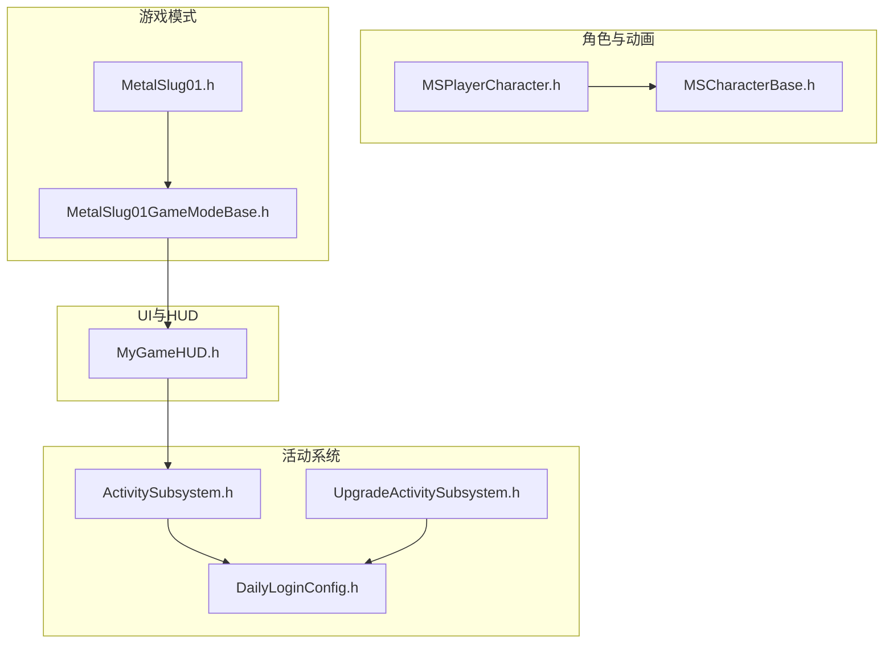
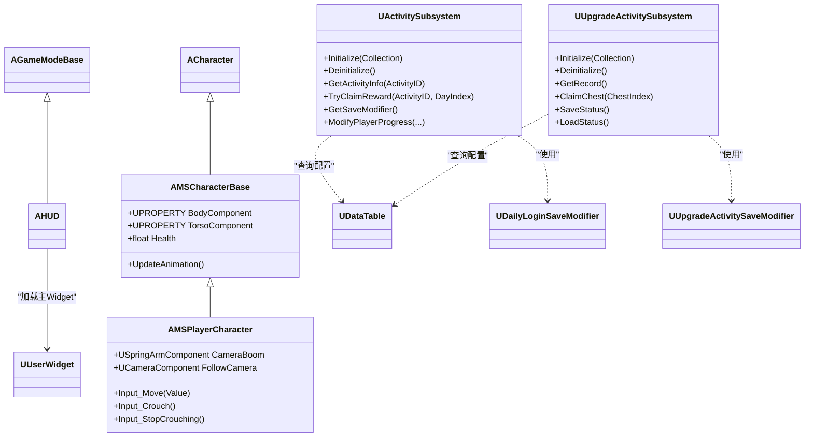
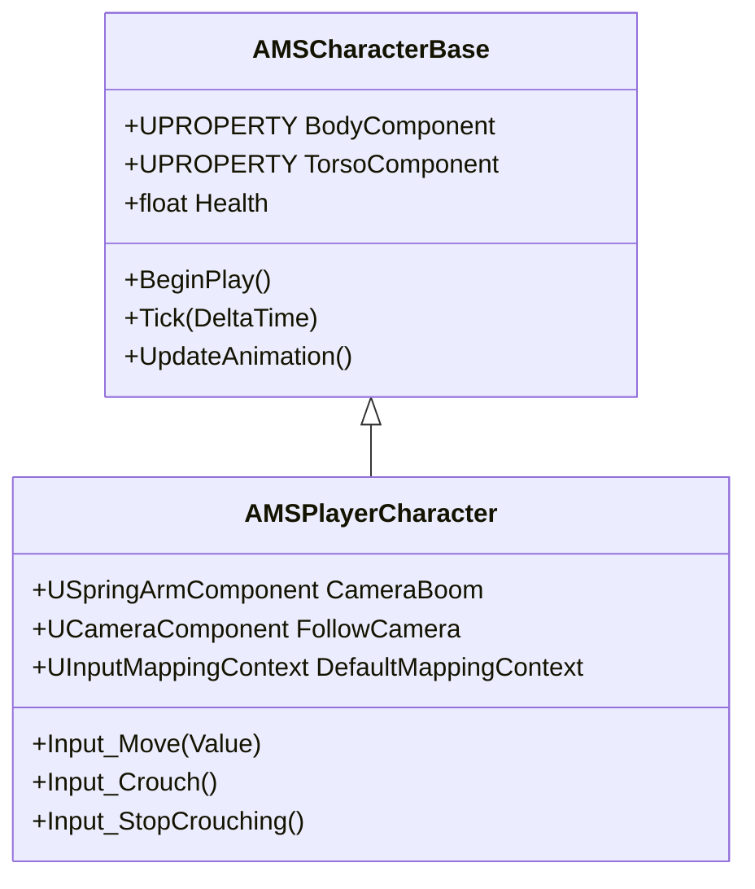
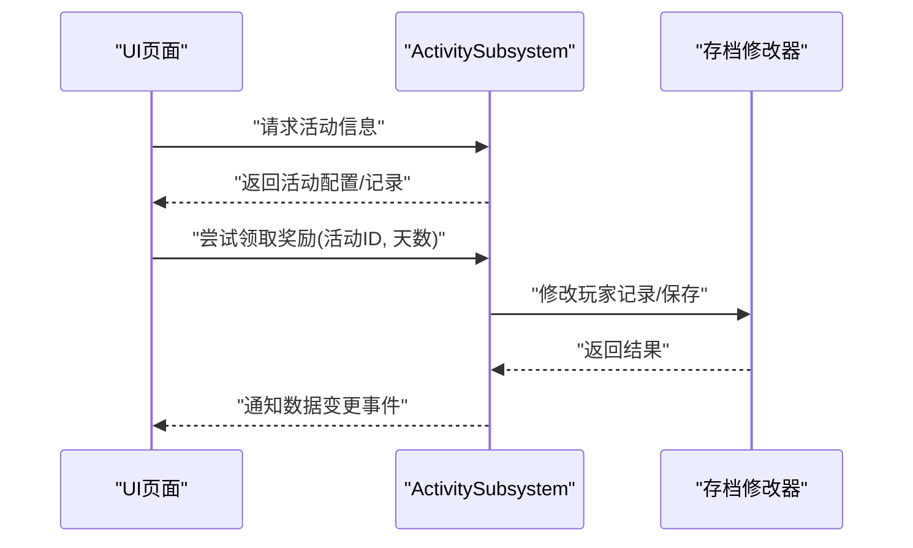
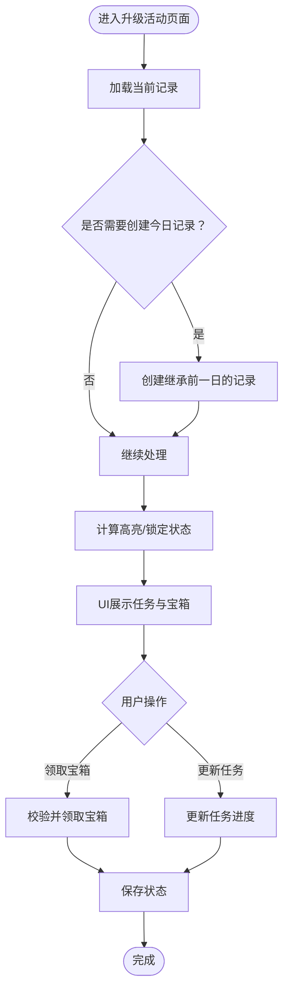
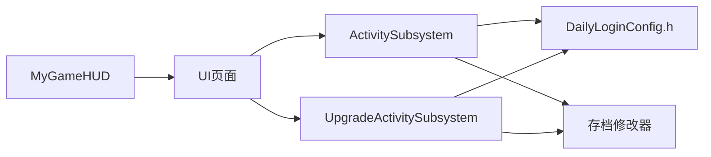

# 扩展开发

<cite>
**本文引用的文件**
- [MetalSlug01.h](file://MetalSlug01/Source/MetalSlug01/MetalSlug01.h)
- [MetalSlug01GameModeBase.h](file://MetalSlug01/Source/MetalSlug01/MetalSlug01GameModeBase.h)
- [MyGameHUD.h](file://MetalSlug01/Source/MetalSlug01/Public/UI/MyGameHUD.h)
- [MSCharacterBase.h](file://MetalSlug01/Source/MetalSlug01/Public/Characters/MSCharacterBase.h)
- [MSPlayerCharacter.h](file://MetalSlug01/Source/MetalSlug01/Public/Characters/MSPlayerCharacter.h)
- [ActivitySubsystem.h](file://MetalSlug01/Source/MetalSlug01/Public/UI/Activity/Core/ActivitySubsystem.h)
- [UpgradeActivitySubsystem.h](file://MetalSlug01/Source/MetalSlug01/Public/UI/Activity/Core/UpgradeActivitySubsystem.h)
- [DailyLoginConfig.h](file://MetalSlug01/Source/MetalSlug01/Public/UI/Activity/Data/DailyLoginConfig.h)
</cite>

## 目录
1. [简介](#简介)
2. [项目结构](#项目结构)
3. [核心组件](#核心组件)
4. [架构总览](#架构总览)
5. [组件详解](#组件详解)
6. [依赖关系分析](#依赖关系分析)
7. [性能考量](#性能考量)
8. [故障排查指南](#故障排查指南)
9. [结论](#结论)
10. [附录](#附录)

## 简介
本技术指南面向MetalSlug扩展开发，围绕“如何继承现有类、扩展现有系统、添加新模块”三大主题展开；深入讲解插件系统的设计与实现（模块化架构、接口定义、依赖管理）；阐述自定义活动开发的完整流程（活动类型定义、数据模型设计、UI实现、存档集成）；解释蓝图与C++的集成方式（C++暴露给蓝图的接口、蓝图回调机制、数据传递）。文档同时提供最佳实践与设计原则，并给出可直接参考的代码模板路径。

## 项目结构
项目采用基于功能域的分层组织：角色与动画（Characters）、UI与活动系统（UI/Activity）、工具与存档（Tools）、以及游戏模式与HUD等顶层入口。核心扩展点集中在：
- 角色基类与玩家角色：提供可继承的角色体系
- 活动子系统：统一管理活动Track、时间与红点、存档修改器
- 数据表结构：定义活动、物品、宝箱、升级奖励等静态配置
- HUD与Widget：承载UI页面与交互

图表来源
- [MSCharacterBase.h](file://MetalSlug01/Source/MetalSlug01/Public/Characters/MSCharacterBase.h#L1-L50)
- [MSPlayerCharacter.h](file://MetalSlug01/Source/MetalSlug01/Public/Characters/MSPlayerCharacter.h#L1-L41)
- [ActivitySubsystem.h](file://MetalSlug01/Source/MetalSlug01/Public/UI/Activity/Core/ActivitySubsystem.h#L1-L178)
- [UpgradeActivitySubsystem.h](file://MetalSlug01/Source/MetalSlug01/Public/UI/Activity/Core/UpgradeActivitySubsystem.h#L1-L476)
- [DailyLoginConfig.h](file://MetalSlug01/Source/MetalSlug01/Public/UI/Activity/Data/DailyLoginConfig.h#L1-L635)
- [MyGameHUD.h](file://MetalSlug01/Source/MetalSlug01/Public/UI/MyGameHUD.h#L1-L23)
- [MetalSlug01GameModeBase.h](file://MetalSlug01/Source/MetalSlug01/MetalSlug01GameModeBase.h#L1-L17)
- [MetalSlug01.h](file://MetalSlug01/Source/MetalSlug01/MetalSlug01.h#L1-L10)

章节来源
- [MetalSlug01.h](file://MetalSlug01/Source/MetalSlug01/MetalSlug01.h#L1-L10)
- [MetalSlug01GameModeBase.h](file://MetalSlug01/Source/MetalSlug01/MetalSlug01GameModeBase.h#L1-L17)
- [MyGameHUD.h](file://MetalSlug01/Source/MetalSlug01/Public/UI/MyGameHUD.h#L1-L23)
- [MSCharacterBase.h](file://MetalSlug01/Source/MetalSlug01/Public/Characters/MSCharacterBase.h#L1-L50)
- [MSPlayerCharacter.h](file://MetalSlug01/Source/MetalSlug01/Public/Characters/MSPlayerCharacter.h#L1-L41)
- [ActivitySubsystem.h](file://MetalSlug01/Source/MetalSlug01/Public/UI/Activity/Core/ActivitySubsystem.h#L1-L178)
- [UpgradeActivitySubsystem.h](file://MetalSlug01/Source/MetalSlug01/Public/UI/Activity/Core/UpgradeActivitySubsystem.h#L1-L476)
- [DailyLoginConfig.h](file://MetalSlug01/Source/MetalSlug01/Public/UI/Activity/Data/DailyLoginConfig.h#L1-L635)

## 核心组件
- 角色体系
  - 基类角色：提供渲染组件、动画槽位、基础属性与动画更新逻辑
  - 玩家角色：在基类基础上增加相机、输入映射与输入回调
- 活动子系统
  - ActivitySubsystem：统一管理活动Track、导航、时间与红点、存档修改器接口
  - UpgradeActivitySubsystem：负责升级奖励活动的数据访问、业务接口与存档持久化
- 数据模型
  - DailyLoginConfig：定义活动类型、状态、时间控制、红点、奖励、物品、宝箱、升级奖励等结构
- UI与HUD
  - MyGameHUD：在BeginPlay中加载主Widget，作为UI入口

章节来源
- [MSCharacterBase.h](file://MetalSlug01/Source/MetalSlug01/Public/Characters/MSCharacterBase.h#L1-L50)
- [MSPlayerCharacter.h](file://MetalSlug01/Source/MetalSlug01/Public/Characters/MSPlayerCharacter.h#L1-L41)
- [ActivitySubsystem.h](file://MetalSlug01/Source/MetalSlug01/Public/UI/Activity/Core/ActivitySubsystem.h#L1-L178)
- [UpgradeActivitySubsystem.h](file://MetalSlug01/Source/MetalSlug01/Public/UI/Activity/Core/UpgradeActivitySubsystem.h#L1-L476)
- [DailyLoginConfig.h](file://MetalSlug01/Source/MetalSlug01/Public/UI/Activity/Data/DailyLoginConfig.h#L1-L635)
- [MyGameHUD.h](file://MetalSlug01/Source/MetalSlug01/Public/UI/MyGameHUD.h#L1-L23)

## 架构总览
活动系统采用“子系统+数据表+Widget”的模块化架构：
- 子系统负责业务逻辑与数据聚合，不直接操作UI
- 数据表提供静态配置与运行时查询
- Widget负责UI呈现与用户交互
- 存档修改器提供动态存档能力，支持蓝图调用

图表来源
- [MetalSlug01GameModeBase.h](file://MetalSlug01/Source/MetalSlug01/MetalSlug01GameModeBase.h#L1-L17)
- [MyGameHUD.h](file://MetalSlug01/Source/MetalSlug01/Public/UI/MyGameHUD.h#L1-L23)
- [MSCharacterBase.h](file://MetalSlug01/Source/MetalSlug01/Public/Characters/MSCharacterBase.h#L1-L50)
- [MSPlayerCharacter.h](file://MetalSlug01/Source/MetalSlug01/Public/Characters/MSPlayerCharacter.h#L1-L41)
- [ActivitySubsystem.h](file://MetalSlug01/Source/MetalSlug01/Public/UI/Activity/Core/ActivitySubsystem.h#L1-L178)
- [UpgradeActivitySubsystem.h](file://MetalSlug01/Source/MetalSlug01/Public/UI/Activity/Core/UpgradeActivitySubsystem.h#L1-L476)
- [DailyLoginConfig.h](file://MetalSlug01/Source/MetalSlug01/Public/UI/Activity/Data/DailyLoginConfig.h#L1-L635)

## 组件详解

### 角色与输入系统（继承与扩展）
- 继承模式
  - 在现有角色基类上新增派生类，复用渲染与动画组件，扩展输入回调与相机配置
- 输入绑定
  - 在玩家角色中绑定移动、蹲伏、停止蹲伏等输入动作，形成可扩展的输入体系
- 动画与属性
  - 通过蓝图或C++设置动画资源槽位，统一管理角色属性与动画更新

图表来源
- [MSCharacterBase.h](file://MetalSlug01/Source/MetalSlug01/Public/Characters/MSCharacterBase.h#L1-L50)
- [MSPlayerCharacter.h](file://MetalSlug01/Source/MetalSlug01/Public/Characters/MSPlayerCharacter.h#L1-L41)

章节来源
- [MSCharacterBase.h](file://MetalSlug01/Source/MetalSlug01/Public/Characters/MSCharacterBase.h#L1-L50)
- [MSPlayerCharacter.h](file://MetalSlug01/Source/MetalSlug01/Public/Characters/MSPlayerCharacter.h#L1-L41)

### 活动子系统（ActivitySubsystem）
- 职责边界
  - 统一管理活动Track、导航、时间与红点；不直接操作UI，仅提供数据与事件
- 接口要点
  - 生命周期：Initialize/Deinitialize
  - 查询接口：导航项、活动信息、玩家记录、奖励查询与领取
  - 存档修改器：蓝图可调用的进度修改、批量领取、重置等接口
  - 事件：活动数据变更事件，供蓝图订阅

图表来源
- [ActivitySubsystem.h](file://MetalSlug01/Source/MetalSlug01/Public/UI/Activity/Core/ActivitySubsystem.h#L1-L178)

章节来源
- [ActivitySubsystem.h](file://MetalSlug01/Source/MetalSlug01/Public/UI/Activity/Core/ActivitySubsystem.h#L1-L178)

### 升级奖励子系统（UpgradeActivitySubsystem）
- 职责边界
  - 管理升级奖励活动的记录、任务、宝箱、经验与奖励图标索引
- 接口要点
  - 数据访问：按天获取记录、任务描述处理、高亮与锁定状态
  - 业务接口：领取宝箱、更新任务进度、领取任务奖励
  - 存档：保存/加载/重新加载最新记录、处理跨日逻辑
  - 事件：奖励图标索引更新、全局刷新

图表来源
- [UpgradeActivitySubsystem.h](file://MetalSlug01/Source/MetalSlug01/Public/UI/Activity/Core/UpgradeActivitySubsystem.h#L1-L476)

章节来源
- [UpgradeActivitySubsystem.h](file://MetalSlug01/Source/MetalSlug01/Public/UI/Activity/Core/UpgradeActivitySubsystem.h#L1-L476)

### 数据模型（DailyLoginConfig）
- 枚举与结构
  - 活动类型、状态、时间控制、红点类型、奖励类型、游戏模式、任务类型、奖励状态
  - 活动信息、每日登录配置、物品详情、宝箱物品、每日升级奖励配置
- 设计原则
  - 所有静态配置集中于单一文件，便于维护与蓝图访问
  - 使用软引用资源（TSoftObjectPtr）降低编译耦合

章节来源
- [DailyLoginConfig.h](file://MetalSlug01/Source/MetalSlug01/Public/UI/Activity/Data/DailyLoginConfig.h#L1-L635)

### HUD与UI入口（MyGameHUD）
- 职责
  - 在BeginPlay中加载主Widget，作为UI入口
- 扩展建议
  - 通过蓝图设置MainWidgetClass，实现页面切换与导航

章节来源
- [MyGameHUD.h](file://MetalSlug01/Source/MetalSlug01/Public/UI/MyGameHUD.h#L1-L23)

## 依赖关系分析
- 组件耦合
  - 子系统与数据表解耦：通过查询接口访问配置，避免硬编码
  - 子系统与存档修改器：通过蓝图可调用接口实现动态存档
  - UI与子系统：通过事件与查询接口交互，保持UI无状态
- 外部依赖
  - 软资源引用：使用TSoftObjectPtr管理纹理与动画资源
  - 数据表：通过UPROPERTY引用DataTable，支持运行时查询

图表来源
- [ActivitySubsystem.h](file://MetalSlug01/Source/MetalSlug01/Public/UI/Activity/Core/ActivitySubsystem.h#L1-L178)
- [UpgradeActivitySubsystem.h](file://MetalSlug01/Source/MetalSlug01/Public/UI/Activity/Core/UpgradeActivitySubsystem.h#L1-L476)
- [DailyLoginConfig.h](file://MetalSlug01/Source/MetalSlug01/Public/UI/Activity/Data/DailyLoginConfig.h#L1-L635)
- [MyGameHUD.h](file://MetalSlug01/Source/MetalSlug01/Public/UI/MyGameHUD.h#L1-L23)

章节来源
- [ActivitySubsystem.h](file://MetalSlug01/Source/MetalSlug01/Public/UI/Activity/Core/ActivitySubsystem.h#L1-L178)
- [UpgradeActivitySubsystem.h](file://MetalSlug01/Source/MetalSlug01/Public/UI/Activity/Core/UpgradeActivitySubsystem.h#L1-L476)
- [DailyLoginConfig.h](file://MetalSlug01/Source/MetalSlug01/Public/UI/Activity/Data/DailyLoginConfig.h#L1-L635)
- [MyGameHUD.h](file://MetalSlug01/Source/MetalSlug01/Public/UI/MyGameHUD.h#L1-L23)

## 性能考量
- 资源加载
  - 使用软资源引用延迟加载，减少启动开销
- 数据查询
  - 将常用查询结果缓存于子系统，避免重复DataTable扫描
- UI刷新
  - 通过事件驱动UI更新，避免轮询
- 存档写入
  - 批量修改后统一保存，减少I/O次数

## 故障排查指南
- UI不显示
  - 检查HUD是否正确设置MainWidgetClass并在BeginPlay中加载
- 活动不可领取
  - 核对活动状态、时间控制与红点条件
  - 通过子系统接口验证玩家记录与奖励状态
- 存档未生效
  - 确认调用了存档修改器的自动保存或手动SaveStatus
  - 检查存档槽名与用户索引一致性

章节来源
- [MyGameHUD.h](file://MetalSlug01/Source/MetalSlug01/Public/UI/MyGameHUD.h#L1-L23)
- [ActivitySubsystem.h](file://MetalSlug01/Source/MetalSlug01/Public/UI/Activity/Core/ActivitySubsystem.h#L1-L178)
- [UpgradeActivitySubsystem.h](file://MetalSlug01/Source/MetalSlug01/Public/UI/Activity/Core/UpgradeActivitySubsystem.h#L1-L476)

## 结论
MetalSlug扩展开发遵循“子系统聚合业务、数据表驱动配置、Widget承载界面”的模块化架构。通过继承角色基类、扩展输入与动画、利用子系统接口与蓝图回调机制，可高效实现新功能与新模块。建议在扩展中坚持职责分离、事件驱动与数据驱动，确保可维护性与可扩展性。

## 附录

### 开发流程与最佳实践
- 继承与扩展
  - 在角色基类上新增派生类，复用渲染与动画组件，扩展输入与相机
  - 通过蓝图设置动画资源槽位，统一管理属性与动画更新
- 插件系统设计
  - 子系统作为业务中枢，不直接操作UI；UI通过事件与查询接口交互
  - 数据表集中管理静态配置，使用软资源引用降低耦合
  - 存档修改器提供蓝图可调用接口，支持动态存档
- 自定义活动开发
  - 定义活动类型与状态枚举，设计活动信息与配置结构
  - 在子系统中实现数据访问与业务接口，提供事件通知
  - 在Widget中实现UI交互，通过事件驱动刷新
  - 集成存档：提供保存/加载/重载接口，处理跨日逻辑
- 蓝图与C++集成
  - 使用UFUNCTION(BlueprintCallable)暴露接口
  - 使用DECLARE_DYNAMIC_MULTICAST_DELEGATE定义事件
  - 使用TSoftObjectPtr传递资源引用，避免编译期强依赖

### 代码模板路径（示例）
- 角色基类继承
  - [MSCharacterBase.h](file://MetalSlug01/Source/MetalSlug01/Public/Characters/MSCharacterBase.h#L1-L50)
  - [MSPlayerCharacter.h](file://MetalSlug01/Source/MetalSlug01/Public/Characters/MSPlayerCharacter.h#L1-L41)
- 活动子系统接口
  - [ActivitySubsystem.h](file://MetalSlug01/Source/MetalSlug01/Public/UI/Activity/Core/ActivitySubsystem.h#L1-L178)
  - [UpgradeActivitySubsystem.h](file://MetalSlug01/Source/MetalSlug01/Public/UI/Activity/Core/UpgradeActivitySubsystem.h#L1-L476)
- 数据模型定义
  - [DailyLoginConfig.h](file://MetalSlug01/Source/MetalSlug01/Public/UI/Activity/Data/DailyLoginConfig.h#L1-L635)
- HUD与UI入口
  - [MyGameHUD.h](file://MetalSlug01/Source/MetalSlug01/Public/UI/MyGameHUD.h#L1-L23)
- 游戏模式入口
  - [MetalSlug01GameModeBase.h](file://MetalSlug01/Source/MetalSlug01/MetalSlug01GameModeBase.h#L1-L17)
  - [MetalSlug01.h](file://MetalSlug01/Source/MetalSlug01/MetalSlug01.h#L1-L10)