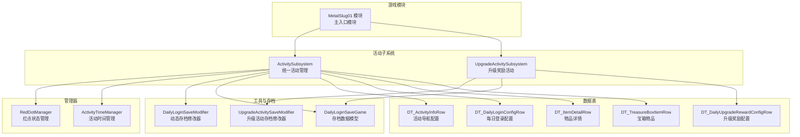
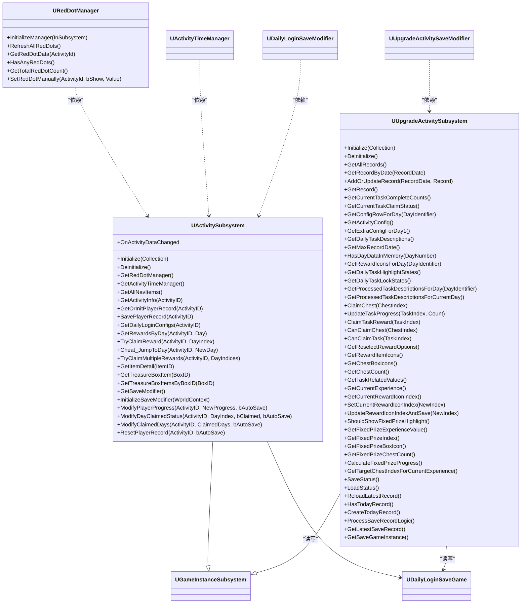
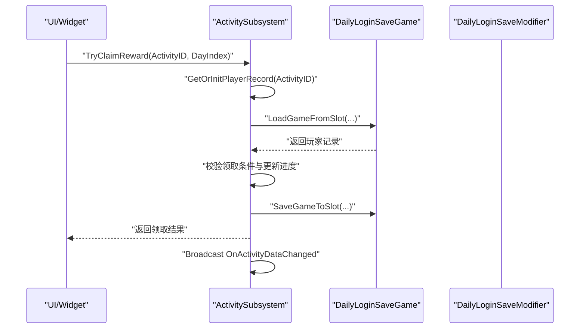
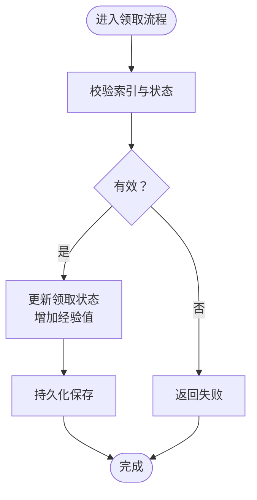
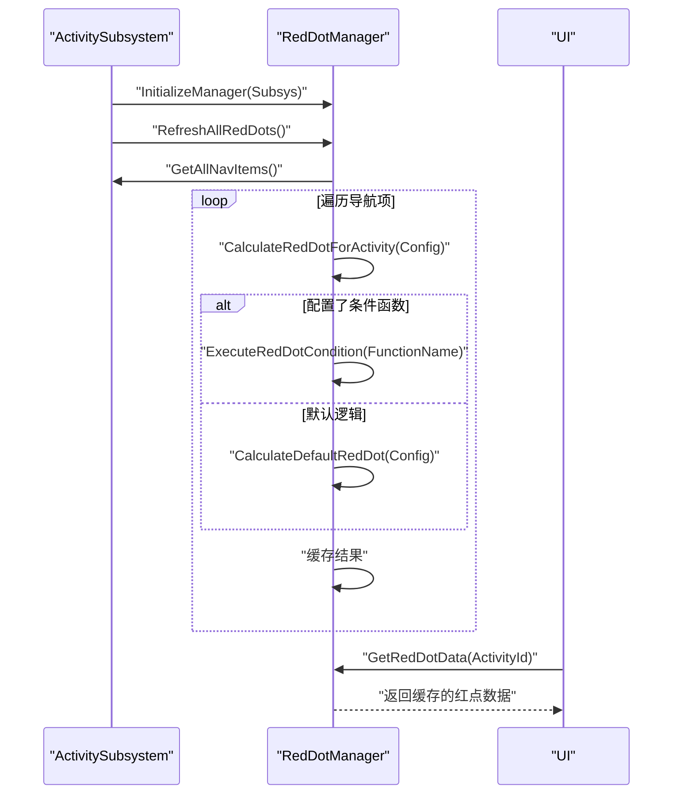
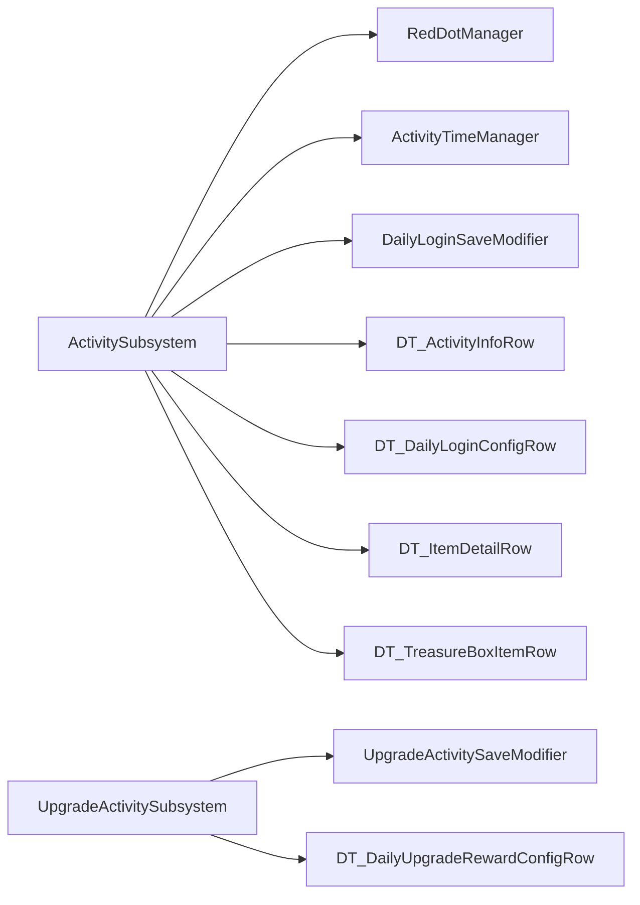

# 插件系统扩展

<cite>
**本文引用的文件**
- [MetalSlug01.h](file://MetalSlug01/Source/MetalSlug01/MetalSlug01.h)
- [MetalSlug01.cpp](file://MetalSlug01/Source/MetalSlug01/MetalSlug01.cpp)
- [ActivitySubsystem.h](file://MetalSlug01/Source/MetalSlug01/Public/UI/Activity/Core/ActivitySubsystem.h)
- [ActivitySubsystem.cpp](file://MetalSlug01/Source/MetalSlug01/Private/UI/Activity/Core/ActivitySubsystem.cpp)
- [RedDotManager.h](file://MetalSlug01/Source/MetalSlug01/Public/UI/Activity/Core/RedDotManager.h)
- [RedDotManager.cpp](file://MetalSlug01/Source/MetalSlug01/Private/UI/Activity/Core/RedDotManager.cpp)
- [UpgradeActivitySubsystem.h](file://MetalSlug01/Source/MetalSlug01/Public/UI/Activity/Core/UpgradeActivitySubsystem.h)
- [UpgradeActivitySubsystem.cpp](file://MetalSlug01/Source/MetalSlug01/Private/UI/Activity/Core/UpgradeActivitySubsystem.cpp)
- [ActivityTimeManager.h](file://MetalSlug01/Source/MetalSlug01/Public/UI/Activity/Managers/ActivityTimeManager.h)
- [ActivityTimeManager.cpp](file://MetalSlug01/Source/MetalSlug01/Private/UI/Activity/Managers/ActivityTimeManager.cpp)
- [DailyLoginSaveModifier.h](file://MetalSlug01/Source/MetalSlug01/Public/Tools/DailyLoginSaveModifier.h)
- [DailyLoginSaveModifier.cpp](file://MetalSlug01/Source/MetalSlug01/Private/Tools/DailyLoginSaveModifier.cpp)
- [UpgradeActivitySaveModifier.h](file://MetalSlug01/Source/MetalSlug01/Public/Tools/UpgradeActivitySaveModifier.h)
- [UpgradeActivitySaveModifier.cpp](file://MetalSlug01/Source/MetalSlug01/Private/Tools/UpgradeActivitySaveModifier.cpp)
- [DailyLoginSave.h](file://MetalSlug01/Source/MetalSlug01/Public/UI/Activity/Data/DailyLoginSave.h)
- [DailyLoginConfig.h](file://MetalSlug01/Source/MetalSlug01/Public/UI/Activity/Data/DailyLoginConfig.h)
</cite>

## 目录
1. [简介](#简介)
2. [项目结构](#项目结构)
3. [核心组件](#核心组件)
4. [架构总览](#架构总览)
5. [详细组件分析](#详细组件分析)
6. [依赖关系分析](#依赖关系分析)
7. [性能考量](#性能考量)
8. [故障排查指南](#故障排查指南)
9. [结论](#结论)
10. [附录](#附录)

## 简介
本技术文档围绕 MetalSlug 插件系统的扩展设计展开，重点阐释基于 Subsystems 模式的模块化架构与扩展方法，涵盖以下主题：
- Subsystems 模式实现原理与扩展路径
- 新子系统模块的创建流程：注册、依赖注入、生命周期管理
- 插件系统接口定义规范：公共接口设计、版本兼容性管理、模块间通信机制
- 完整的插件开发示例：构建配置、模块初始化、功能集成
- 依赖管理与冲突解决策略

## 项目结构
项目采用基于功能域的分层组织方式，核心插件系统位于 UI/Activity/Core 下，配套管理器、工具类与数据表支撑模块化能力。

图表来源
- [MetalSlug01.cpp](file://MetalSlug01/Source/MetalSlug01/MetalSlug01.cpp#L1-L11)
- [ActivitySubsystem.h](file://MetalSlug01/Source/MetalSlug01/Public/UI/Activity/Core/ActivitySubsystem.h#L1-L178)
- [ActivitySubsystem.cpp](file://MetalSlug01/Source/MetalSlug01/Private/UI/Activity/Core/ActivitySubsystem.cpp#L1-L599)
- [UpgradeActivitySubsystem.h](file://MetalSlug01/Source/MetalSlug01/Public/UI/Activity/Core/UpgradeActivitySubsystem.h#L1-L476)
- [UpgradeActivitySubsystem.cpp](file://MetalSlug01/Source/MetalSlug01/Private/UI/Activity/Core/UpgradeActivitySubsystem.cpp#L1-L800)

章节来源
- [MetalSlug01.h](file://MetalSlug01/Source/MetalSlug01/MetalSlug01.h#L1-L10)
- [MetalSlug01.cpp](file://MetalSlug01/Source/MetalSlug01/MetalSlug01.cpp#L1-L11)

## 核心组件
- 活动子系统（ActivitySubsystem）
  - 职责：统一管理活动 Track、生命周期、为 UI 提供访问入口；不直接做业务判断与 UI 操作
  - 关键能力：导航项获取、活动信息查询、玩家记录存取、奖励领取、动态存档修改器接口
- 升级奖励活动子系统（UpgradeActivitySubsystem）
  - 职责：管理升级奖励活动的配置、进度、奖励领取、存档持久化
  - 关键能力：每日任务高亮/锁定状态、任务描述占位符替换、宝箱领取、经验值管理
- 红点管理器（RedDotManager）
  - 职责：计算并缓存各活动的红点状态，支持默认与条件函数两种计算路径
- 活动时间管理器（ActivityTimeManager）
  - 职责：提供活动时间相关的辅助能力（如时间校验、格式化等）
- 动态存档修改器
  - DailyLoginSaveModifier：为活动子系统提供动态修改玩家进度与领取状态的能力，并注册控制台命令
  - UpgradeActivitySaveModifier：为升级活动子系统提供动态修改与持久化能力，并注册控制台命令

章节来源
- [ActivitySubsystem.h](file://MetalSlug01/Source/MetalSlug01/Public/UI/Activity/Core/ActivitySubsystem.h#L17-L178)
- [ActivitySubsystem.cpp](file://MetalSlug01/Source/MetalSlug01/Private/UI/Activity/Core/ActivitySubsystem.cpp#L7-L39)
- [UpgradeActivitySubsystem.h](file://MetalSlug01/Source/MetalSlug01/Public/UI/Activity/Core/UpgradeActivitySubsystem.h#L31-L476)
- [UpgradeActivitySubsystem.cpp](file://MetalSlug01/Source/MetalSlug01/Private/UI/Activity/Core/UpgradeActivitySubsystem.cpp#L32-L89)
- [RedDotManager.h](file://MetalSlug01/Source/MetalSlug01/Public/UI/Activity/Core/RedDotManager.h#L12-L100)
- [RedDotManager.cpp](file://MetalSlug01/Source/MetalSlug01/Private/UI/Activity/Core/RedDotManager.cpp#L5-L36)
- [ActivityTimeManager.h](file://MetalSlug01/Source/MetalSlug01/Public/UI/Activity/Managers/ActivityTimeManager.h)
- [ActivityTimeManager.cpp](file://MetalSlug01/Source/MetalSlug01/Private/UI/Activity/Managers/ActivityTimeManager.cpp)

## 架构总览
插件系统采用“子系统 + 管理器 + 工具 + 数据表”的分层架构，子系统负责业务编排与状态管理，管理器负责特定领域的计算与缓存，工具类负责动态修改与持久化，数据表提供配置与资源数据。

图表来源
- [ActivitySubsystem.h](file://MetalSlug01/Source/MetalSlug01/Public/UI/Activity/Core/ActivitySubsystem.h#L29-L175)
- [ActivitySubsystem.cpp](file://MetalSlug01/Source/MetalSlug01/Private/UI/Activity/Core/ActivitySubsystem.cpp#L7-L39)
- [UpgradeActivitySubsystem.h](file://MetalSlug01/Source/MetalSlug01/Public/UI/Activity/Core/UpgradeActivitySubsystem.h#L35-L476)
- [UpgradeActivitySubsystem.cpp](file://MetalSlug01/Source/MetalSlug01/Private/UI/Activity/Core/UpgradeActivitySubsystem.cpp#L32-L89)
- [RedDotManager.h](file://MetalSlug01/Source/MetalSlug01/Public/UI/Activity/Core/RedDotManager.h#L16-L99)
- [ActivityTimeManager.h](file://MetalSlug01/Source/MetalSlug01/Public/UI/Activity/Managers/ActivityTimeManager.h)
- [DailyLoginSaveModifier.h](file://MetalSlug01/Source/MetalSlug01/Public/Tools/DailyLoginSaveModifier.h)
- [UpgradeActivitySaveModifier.h](file://MetalSlug01/Source/MetalSlug01/Public/Tools/UpgradeActivitySaveModifier.h)
- [DailyLoginSave.h](file://MetalSlug01/Source/MetalSlug01/Public/UI/Activity/Data/DailyLoginSave.h)

## 详细组件分析

### 活动子系统（ActivitySubsystem）
- 生命周期管理
  - Initialize：创建并初始化红点管理器、活动时间管理器与动态存档修改器，注册控制台命令
  - Deinitialize：销毁管理器与修改器，清理缓存
- 数据访问与业务接口
  - 导航项与活动信息：从数据表加载活动配置
  - 玩家记录：基于 SaveGame 的存取与持久化
  - 奖励领取：顺序与跳跃式领取、批量领取、进度智能更新
  - 动态存档修改器：提供进度修改、领取状态修改、批量修改与重置
- 事件机制
  - OnActivityDataChanged：数据变更广播，驱动 UI 同步

图表来源
- [ActivitySubsystem.cpp](file://MetalSlug01/Source/MetalSlug01/Private/UI/Activity/Core/ActivitySubsystem.cpp#L247-L298)
- [ActivitySubsystem.cpp](file://MetalSlug01/Source/MetalSlug01/Private/UI/Activity/Core/ActivitySubsystem.cpp#L101-L161)

章节来源
- [ActivitySubsystem.h](file://MetalSlug01/Source/MetalSlug01/Public/UI/Activity/Core/ActivitySubsystem.h#L34-L175)
- [ActivitySubsystem.cpp](file://MetalSlug01/Source/MetalSlug01/Private/UI/Activity/Core/ActivitySubsystem.cpp#L7-L39)
- [ActivitySubsystem.cpp](file://MetalSlug01/Source/MetalSlug01/Private/UI/Activity/Core/ActivitySubsystem.cpp#L101-L161)
- [ActivitySubsystem.cpp](file://MetalSlug01/Source/MetalSlug01/Private/UI/Activity/Core/ActivitySubsystem.cpp#L247-L298)
- [ActivitySubsystem.cpp](file://MetalSlug01/Source/MetalSlug01/Private/UI/Activity/Core/ActivitySubsystem.cpp#L486-L598)

### 升级奖励活动子系统（UpgradeActivitySubsystem）
- 生命周期管理
  - Initialize：预加载配置表、检查并创建初始记录、初始化存档修改器并注册控制台命令
  - Deinitialize：保存数据、清理修改器
- 核心业务接口
  - 宝箱领取：验证状态、更新领取状态与经验值、持久化
  - 任务进度更新与奖励领取：校验完成度、更新状态、增加经验值
  - UI 状态计算：每日任务高亮/锁定状态、任务描述占位符替换
- 数据持久化
  - 与每日登录系统共享存档，按天记录并保存最新记录

图表来源
- [UpgradeActivitySubsystem.cpp](file://MetalSlug01/Source/MetalSlug01/Private/UI/Activity/Core/UpgradeActivitySubsystem.cpp#L235-L247)
- [UpgradeActivitySubsystem.cpp](file://MetalSlug01/Source/MetalSlug01/Private/UI/Activity/Core/UpgradeActivitySubsystem.cpp#L290-L340)

章节来源
- [UpgradeActivitySubsystem.h](file://MetalSlug01/Source/MetalSlug01/Public/UI/Activity/Core/UpgradeActivitySubsystem.h#L51-L476)
- [UpgradeActivitySubsystem.cpp](file://MetalSlug01/Source/MetalSlug01/Private/UI/Activity/Core/UpgradeActivitySubsystem.cpp#L32-L89)
- [UpgradeActivitySubsystem.cpp](file://MetalSlug01/Source/MetalSlug01/Private/UI/Activity/Core/UpgradeActivitySubsystem.cpp#L235-L340)
- [UpgradeActivitySubsystem.cpp](file://MetalSlug01/Source/MetalSlug01/Private/UI/Activity/Core/UpgradeActivitySubsystem.cpp#L423-L437)

### 红点管理器（RedDotManager）
- 职责：计算并缓存各活动的红点状态，支持默认逻辑与条件函数两种路径
- 关键流程：初始化绑定子系统、刷新所有红点、按需计算与缓存

图表来源
- [RedDotManager.h](file://MetalSlug01/Source/MetalSlug01/Public/UI/Activity/Core/RedDotManager.h#L26-L99)
- [RedDotManager.cpp](file://MetalSlug01/Source/MetalSlug01/Private/UI/Activity/Core/RedDotManager.cpp#L5-L36)
- [RedDotManager.cpp](file://MetalSlug01/Source/MetalSlug01/Private/UI/Activity/Core/RedDotManager.cpp#L91-L160)

章节来源
- [RedDotManager.h](file://MetalSlug01/Source/MetalSlug01/Public/UI/Activity/Core/RedDotManager.h#L12-L100)
- [RedDotManager.cpp](file://MetalSlug01/Source/MetalSlug01/Private/UI/Activity/Core/RedDotManager.cpp#L5-L36)
- [RedDotManager.cpp](file://MetalSlug01/Source/MetalSlug01/Private/UI/Activity/Core/RedDotManager.cpp#L91-L160)

### 动态存档修改器（SaveModifier）
- 职责：为子系统提供动态修改玩家进度与领取状态的能力，并注册控制台命令便于调试
- 使用方式：子系统内部创建并初始化，通过接口暴露修改能力

章节来源
- [DailyLoginSaveModifier.h](file://MetalSlug01/Source/MetalSlug01/Public/Tools/DailyLoginSaveModifier.h)
- [DailyLoginSaveModifier.cpp](file://MetalSlug01/Source/MetalSlug01/Private/Tools/DailyLoginSaveModifier.cpp)
- [UpgradeActivitySaveModifier.h](file://MetalSlug01/Source/MetalSlug01/Public/Tools/UpgradeActivitySaveModifier.h)
- [UpgradeActivitySaveModifier.cpp](file://MetalSlug01/Source/MetalSlug01/Private/Tools/UpgradeActivitySaveModifier.cpp)

## 依赖关系分析
- 子系统与管理器
  - ActivitySubsystem 依赖 RedDotManager 与 ActivityTimeManager
  - 二者均通过子系统提供的接口访问活动配置与存档
- 子系统与工具
  - ActivitySubsystem 与 UpgradeActivitySubsystem 分别依赖各自的 SaveModifier
  - SaveModifier 通过子系统暴露的接口进行数据修改与持久化
- 数据表依赖
  - ActivitySubsystem 依赖活动导航、每日登录配置、物品详情与宝箱物品数据表
  - UpgradeActivitySubsystem 依赖升级奖励配置数据表

图表来源
- [ActivitySubsystem.h](file://MetalSlug01/Source/MetalSlug01/Public/UI/Activity/Core/ActivitySubsystem.h#L5-L12)
- [UpgradeActivitySubsystem.h](file://MetalSlug01/Source/MetalSlug01/Public/UI/Activity/Core/UpgradeActivitySubsystem.h#L13-L18)
- [DailyLoginConfig.h](file://MetalSlug01/Source/MetalSlug01/Public/UI/Activity/Data/DailyLoginConfig.h)
- [DailyLoginSave.h](file://MetalSlug01/Source/MetalSlug01/Public/UI/Activity/Data/DailyLoginSave.h)

章节来源
- [ActivitySubsystem.h](file://MetalSlug01/Source/MetalSlug01/Public/UI/Activity/Core/ActivitySubsystem.h#L5-L12)
- [UpgradeActivitySubsystem.h](file://MetalSlug01/Source/MetalSlug01/Public/UI/Activity/Core/UpgradeActivitySubsystem.h#L13-L18)

## 性能考量
- 配置表缓存
  - UpgradeActivitySubsystem 在初始化阶段预加载配置表，减少运行时 IO 开销
- 数据访问优化
  - ActivitySubsystem 通过缓存 SaveGame 实例与数据表，降低重复加载成本
- 红点计算缓存
  - RedDotManager 缓存计算结果，避免重复计算
- 持久化策略
  - 子系统在关键节点（如领取成功、进度更新）进行保存，兼顾一致性与性能

章节来源
- [UpgradeActivitySubsystem.cpp](file://MetalSlug01/Source/MetalSlug01/Private/UI/Activity/Core/UpgradeActivitySubsystem.cpp#L32-L66)
- [ActivitySubsystem.cpp](file://MetalSlug01/Source/MetalSlug01/Private/UI/Activity/Core/ActivitySubsystem.cpp#L101-L161)
- [RedDotManager.cpp](file://MetalSlug01/Source/MetalSlug01/Private/UI/Activity/Core/RedDotManager.cpp#L20-L36)

## 故障排查指南
- 存档加载失败
  - 现象：无法获取玩家记录或初始化失败
  - 排查：确认存档槽位与用户索引正确，检查 SaveGame 实例是否创建成功
  - 参考路径：[ActivitySubsystem.cpp](file://MetalSlug01/Source/MetalSlug01/Private/UI/Activity/Core/ActivitySubsystem.cpp#L101-L161)、[UpgradeActivitySubsystem.cpp](file://MetalSlug01/Source/MetalSlug01/Private/UI/Activity/Core/UpgradeActivitySubsystem.cpp#L100-L159)
- 红点状态异常
  - 现象：红点未正确显示或数值不正确
  - 排查：检查条件函数是否正确返回、默认逻辑是否符合预期、缓存是否及时刷新
  - 参考路径：[RedDotManager.cpp](file://MetalSlug01/Source/MetalSlug01/Private/UI/Activity/Core/RedDotManager.cpp#L91-L160)
- 奖励领取失败
  - 现象：领取接口返回失败
  - 排查：确认领取条件（进度、是否已领取）、更新逻辑与持久化是否成功
  - 参考路径：[ActivitySubsystem.cpp](file://MetalSlug01/Source/MetalSlug01/Private/UI/Activity/Core/ActivitySubsystem.cpp#L247-L298)、[UpgradeActivitySubsystem.cpp](file://MetalSlug01/Source/MetalSlug01/Private/UI/Activity/Core/UpgradeActivitySubsystem.cpp#L290-L340)
- 控制台命令无效
  - 现象：修改器未生效
  - 排查：确认修改器已初始化并注册控制台命令
  - 参考路径：[ActivitySubsystem.cpp](file://MetalSlug01/Source/MetalSlug01/Private/UI/Activity/Core/ActivitySubsystem.cpp#L15-L21)、[UpgradeActivitySubsystem.cpp](file://MetalSlug01/Source/MetalSlug01/Private/UI/Activity/Core/UpgradeActivitySubsystem.cpp#L62-L66)

章节来源
- [ActivitySubsystem.cpp](file://MetalSlug01/Source/MetalSlug01/Private/UI/Activity/Core/ActivitySubsystem.cpp#L101-L161)
- [UpgradeActivitySubsystem.cpp](file://MetalSlug01/Source/MetalSlug01/Private/UI/Activity/Core/UpgradeActivitySubsystem.cpp#L100-L159)
- [RedDotManager.cpp](file://MetalSlug01/Source/MetalSlug01/Private/UI/Activity/Core/RedDotManager.cpp#L91-L160)
- [ActivitySubsystem.cpp](file://MetalSlug01/Source/MetalSlug01/Private/UI/Activity/Core/ActivitySubsystem.cpp#L15-L21)
- [UpgradeActivitySubsystem.cpp](file://MetalSlug01/Source/MetalSlug01/Private/UI/Activity/Core/UpgradeActivitySubsystem.cpp#L62-L66)

## 结论
MetalSlug 插件系统通过 Subsystems 模式实现了清晰的职责分离与模块化扩展能力。ActivitySubsystem 与 UpgradeActivitySubsystem 分别承载不同活动域的业务编排，配合 RedDotManager、ActivityTimeManager 等管理器与 SaveModifier 工具，形成稳定、可扩展的插件体系。建议在新增子系统时遵循现有生命周期、依赖注入与事件广播模式，确保与既有模块的兼容与协作。

## 附录

### 新子系统模块创建指南
- 模块注册
  - 继承 UGameInstanceSubsystem，实现 Initialize 与 Deinitialize
  - 在 Initialize 中创建并注入依赖（管理器、修改器、数据表）
- 依赖注入
  - 通过 NewObject 创建管理器与修改器实例，绑定到子系统
  - 通过数据表路径加载配置，必要时进行缓存
- 生命周期管理
  - 在 Initialize 中完成初始化，在 Deinitialize 中清理资源与注销控制台命令
- 事件与通信
  - 通过多播委托广播数据变更，供 UI 或其他子系统订阅
- 开发示例参考
  - 活动子系统初始化与存档修改器注册：[ActivitySubsystem.cpp](file://MetalSlug01/Source/MetalSlug01/Private/UI/Activity/Core/ActivitySubsystem.cpp#L7-L21)
  - 升级活动子系统初始化与存档修改器注册：[UpgradeActivitySubsystem.cpp](file://MetalSlug01/Source/MetalSlug01/Private/UI/Activity/Core/UpgradeActivitySubsystem.cpp#L32-L66)

章节来源
- [ActivitySubsystem.cpp](file://MetalSlug01/Source/MetalSlug01/Private/UI/Activity/Core/ActivitySubsystem.cpp#L7-L21)
- [UpgradeActivitySubsystem.cpp](file://MetalSlug01/Source/MetalSlug01/Private/UI/Activity/Core/UpgradeActivitySubsystem.cpp#L32-L66)