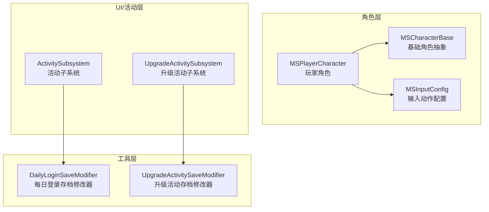
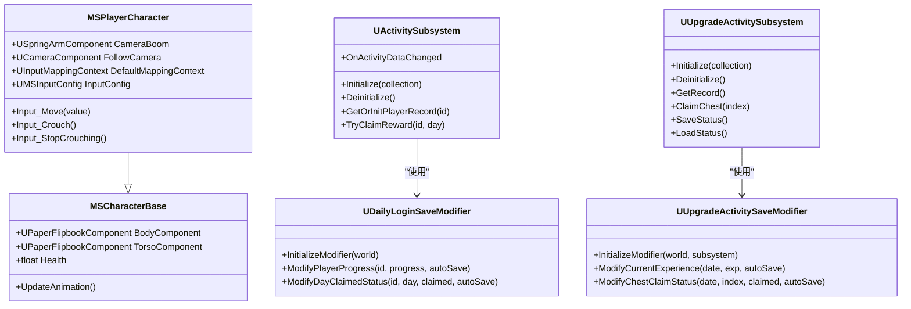
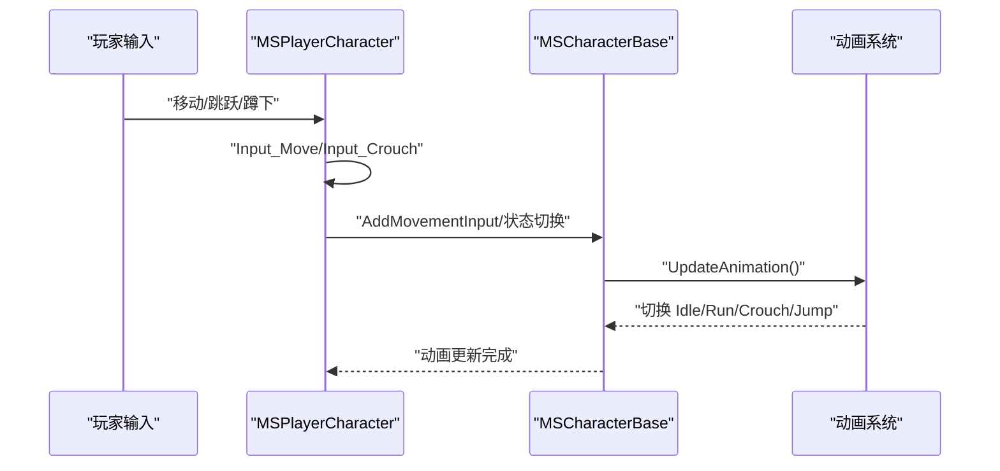
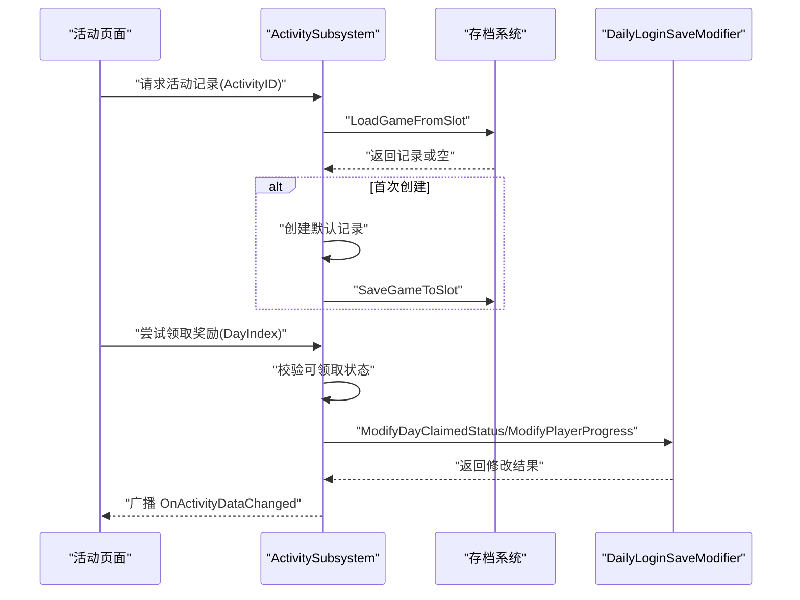
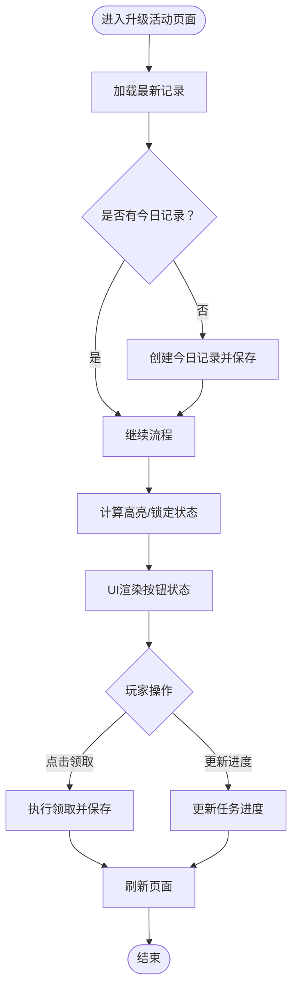
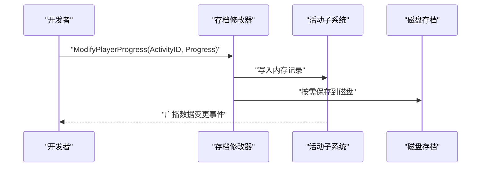
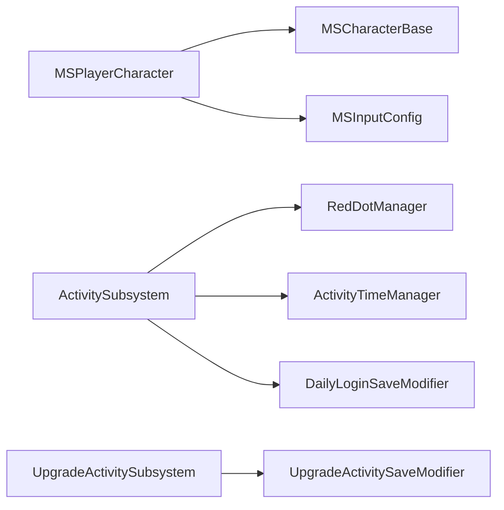

# 新功能开发

<cite>
**本文引用的文件**
- [MSCharacterBase.h](file://MetalSlug01/Source/MetalSlug01/Public/Characters/MSCharacterBase.h)
- [MSCharacterBase.cpp](file://MetalSlug01/Source/MetalSlug01/Private/Characters/MSCharacterBase.cpp)
- [MSPlayerCharacter.h](file://MetalSlug01/Source/MetalSlug01/Public/Characters/MSPlayerCharacter.h)
- [MSPlayerCharacter.cpp](file://MetalSlug01/Source/MetalSlug01/Private/Characters/MSPlayerCharacter.cpp)
- [MSInputConfig.h](file://MetalSlug01/Source/MetalSlug01/Public/Data/MSInputConfig.h)
- [ActivitySubsystem.h](file://MetalSlug01/Source/MetalSlug01/Public/UI/Activity/Core/ActivitySubsystem.h)
- [ActivitySubsystem.cpp](file://MetalSlug01/Source/MetalSlug01/Private/UI/Activity/Core/ActivitySubsystem.cpp)
- [UpgradeActivitySubsystem.h](file://MetalSlug01/Source/MetalSlug01/Public/UI/Activity/Core/UpgradeActivitySubsystem.h)
- [UpgradeActivitySubsystem.cpp](file://MetalSlug01/Source/MetalSlug01/Private/UI/Activity/Core/UpgradeActivitySubsystem.cpp)
- [DailyLoginSaveModifier.h](file://MetalSlug01/Source/MetalSlug01/Public/Tools/DailyLoginSaveModifier.h)
- [DailyLoginSaveModifier.cpp](file://MetalSlug01/Source/MetalSlug01/Private/Tools/DailyLoginSaveModifier.cpp)
- [UpgradeActivitySaveModifier.h](file://MetalSlug01/Source/MetalSlug01/Public/Tools/UpgradeActivitySaveModifier.h)
- [UpgradeActivitySaveModifier.cpp](file://MetalSlug01/Source/MetalSlug01/Private/Tools/UpgradeActivitySaveModifier.cpp)
</cite>

## 目录
1. [简介](#简介)
2. [项目结构](#项目结构)
3. [核心组件](#核心组件)
4. [架构总览](#架构总览)
5. [详细组件分析](#详细组件分析)
6. [依赖关系分析](#依赖关系分析)
7. [性能考虑](#性能考虑)
8. [故障排查指南](#故障排查指南)
9. [结论](#结论)
10. [附录](#附录)

## 简介
本指南面向在 MetalSlug 项目中新增角色类型与活动类型的开发者，提供从继承基类到动画系统集成、输入处理定制，再到活动子系统扩展的完整开发流程。文档基于现有代码结构，给出可复用的设计模式、最佳实践与可视化图示，帮助快速、安全地集成新功能。

## 项目结构
项目采用分层+特性模块组织方式：
- 角色层：MSCharacterBase 为基础角色抽象，MSPlayerCharacter 继承之并接入输入系统与相机。
- UI/活动层：ActivitySubsystem 与 UpgradeActivitySubsystem 分别管理不同活动类型的数据与生命周期。
- 工具层：存档修改器（DailyLoginSaveModifier、UpgradeActivitySaveModifier）提供动态存档修改能力，并注册控制台命令便于调试。

**图表来源**
- [MSCharacterBase.h](file://MetalSlug01/Source/MetalSlug01/Public/Characters/MSCharacterBase.h#L10-L50)
- [MSPlayerCharacter.h](file://MetalSlug01/Source/MetalSlug01/Public/Characters/MSPlayerCharacter.h#L13-L41)
- [MSInputConfig.h](file://MetalSlug01/Source/MetalSlug01/Public/Data/MSInputConfig.h#L12-L29)
- [ActivitySubsystem.h](file://MetalSlug01/Source/MetalSlug01/Public/UI/Activity/Core/ActivitySubsystem.h#L29-L178)
- [UpgradeActivitySubsystem.h](file://MetalSlug01/Source/MetalSlug01/Public/UI/Activity/Core/UpgradeActivitySubsystem.h#L35-L476)
- [DailyLoginSaveModifier.h](file://MetalSlug01/Source/MetalSlug01/Public/Tools/DailyLoginSaveModifier.h)
- [UpgradeActivitySaveModifier.h](file://MetalSlug01/Source/MetalSlug01/Public/Tools/UpgradeActivitySaveModifier.h)

**章节来源**
- [MSCharacterBase.h](file://MetalSlug01/Source/MetalSlug01/Public/Characters/MSCharacterBase.h#L10-L50)
- [MSPlayerCharacter.h](file://MetalSlug01/Source/MetalSlug01/Public/Characters/MSPlayerCharacter.h#L13-L41)
- [ActivitySubsystem.h](file://MetalSlug01/Source/MetalSlug01/Public/UI/Activity/Core/ActivitySubsystem.h#L17-L28)
- [UpgradeActivitySubsystem.h](file://MetalSlug01/Source/MetalSlug01/Public/UI/Activity/Core/UpgradeActivitySubsystem.h#L20-L34)

## 核心组件
- 角色基类与玩家角色
  - MSCharacterBase 提供 Flipbook 渲染组件、基础属性与动画切换逻辑。
  - MSPlayerCharacter 在其基础上增加相机、增强输入绑定与移动方向翻转。
- 输入配置
  - MSInputConfig 将所有输入动作集中为 DataAsset，便于策划在编辑器中配置。
- 活动子系统
  - ActivitySubsystem：统一管理活动导航、记录加载/保存、奖励领取、动态存档修改器集成。
  - UpgradeActivitySubsystem：管理升级奖励活动的配置、记录、领取与状态持久化。
- 存档修改器
  - DailyLoginSaveModifier：为 ActivitySubsystem 提供动态修改玩家记录的能力。
  - UpgradeActivitySaveModifier：为 UpgradeActivitySubsystem 提供内存映射与动态修改能力。

**章节来源**
- [MSCharacterBase.cpp](file://MetalSlug01/Source/MetalSlug01/Private/Characters/MSCharacterBase.cpp#L7-L64)
- [MSPlayerCharacter.cpp](file://MetalSlug01/Source/MetalSlug01/Private/Characters/MSPlayerCharacter.cpp#L10-L62)
- [MSInputConfig.h](file://MetalSlug01/Source/MetalSlug01/Public/Data/MSInputConfig.h#L12-L29)
- [ActivitySubsystem.cpp](file://MetalSlug01/Source/MetalSlug01/Private/UI/Activity/Core/ActivitySubsystem.cpp#L7-L39)
- [UpgradeActivitySubsystem.cpp](file://MetalSlug01/Source/MetalSlug01/Private/UI/Activity/Core/UpgradeActivitySubsystem.cpp#L32-L89)
- [DailyLoginSaveModifier.cpp](file://MetalSlug01/Source/MetalSlug01/Private/Tools/DailyLoginSaveModifier.cpp#L27-L40)
- [UpgradeActivitySaveModifier.cpp](file://MetalSlug01/Source/MetalSlug01/Private/Tools/UpgradeActivitySaveModifier.cpp#L30-L66)

## 架构总览
新角色与新活动的开发遵循“继承-扩展-集成”的三层模式：
- 继承角色基类：在 MSCharacterBase 基础上扩展属性与行为。
- 扩展活动子系统：在 ActivitySubsystem/UpgradeActivitySubsystem 中新增活动类型与数据表。
- 集成存档修改器：通过动态修改器实现运行时调试与数据变更。

**图表来源**
- [MSCharacterBase.h](file://MetalSlug01/Source/MetalSlug01/Public/Characters/MSCharacterBase.h#L10-L50)
- [MSPlayerCharacter.h](file://MetalSlug01/Source/MetalSlug01/Public/Characters/MSPlayerCharacter.h#L13-L41)
- [ActivitySubsystem.h](file://MetalSlug01/Source/MetalSlug01/Public/UI/Activity/Core/ActivitySubsystem.h#L29-L178)
- [UpgradeActivitySubsystem.h](file://MetalSlug01/Source/MetalSlug01/Public/UI/Activity/Core/UpgradeActivitySubsystem.h#L35-L476)
- [DailyLoginSaveModifier.h](file://MetalSlug01/Source/MetalSlug01/Public/Tools/DailyLoginSaveModifier.h)
- [UpgradeActivitySaveModifier.h](file://MetalSlug01/Source/MetalSlug01/Public/Tools/UpgradeActivitySaveModifier.h)

## 详细组件分析

### 角色系统：继承 MSCharacterBase 开发新角色类型
- 继承与扩展
  - 新角色类需继承 MSCharacterBase，并在构造函数中初始化必要的渲染组件与物理移动参数。
  - 可在蓝图中配置 Body/Torso 的 Idle/Run/Crouch/Jump 动画资源槽位，以适配不同角色风格。
- 动画系统集成
  - UpdateAnimation 依据速度与状态切换动画；若角色具备特殊动作（如射击、跳跃），可在子类中扩展状态判断分支。
- 输入处理定制
  - 若角色需要额外输入（如射击），建议在子类中新增 Input_* 方法并通过增强输入绑定到 MSInputConfig 的动作。
  - 移动方向翻转逻辑可参考 MSPlayerCharacter 的实现，按角色朝向调整 BodyComponent 的缩放。

**图表来源**
- [MSPlayerCharacter.cpp](file://MetalSlug01/Source/MetalSlug01/Private/Characters/MSPlayerCharacter.cpp#L29-L62)
- [MSCharacterBase.cpp](file://MetalSlug01/Source/MetalSlug01/Private/Characters/MSCharacterBase.cpp#L47-L64)
- [MSInputConfig.h](file://MetalSlug01/Source/MetalSlug01/Public/Data/MSInputConfig.h#L12-L29)

**章节来源**
- [MSCharacterBase.h](file://MetalSlug01/Source/MetalSlug01/Public/Characters/MSCharacterBase.h#L10-L50)
- [MSCharacterBase.cpp](file://MetalSlug01/Source/MetalSlug01/Private/Characters/MSCharacterBase.cpp#L7-L64)
- [MSPlayerCharacter.h](file://MetalSlug01/Source/MetalSlug01/Public/Characters/MSPlayerCharacter.h#L13-L41)
- [MSPlayerCharacter.cpp](file://MetalSlug01/Source/MetalSlug01/Private/Characters/MSPlayerCharacter.cpp#L29-L62)
- [MSInputConfig.h](file://MetalSlug01/Source/MetalSlug01/Public/Data/MSInputConfig.h#L12-L29)

### 活动系统：扩展现有 ActivitySubsystem 添加新活动类型
- 活动生命周期管理
  - 初始化：在 ActivitySubsystem::Initialize 中创建并初始化 RedDotManager、ActivityTimeManager 与 DailyLoginSaveModifier。
  - 去初始化：在 Deinitialize 中清理资源并销毁存档修改器。
- 状态同步与数据访问
  - GetOrInitPlayerRecord：按 ActivityID 获取或创建玩家记录，首次创建默认进度与领取历史。
  - SavePlayerRecord：将当前记录保存至磁盘存档槽位。
  - TryClaimReward：校验可领取范围与状态，更新进度与领取历史，并广播 OnActivityDataChanged。
- UI 集成
  - 通过导航菜单与页面组件访问活动信息与奖励配置，实现 UI 与数据层解耦。

**图表来源**
- [ActivitySubsystem.cpp](file://MetalSlug01/Source/MetalSlug01/Private/UI/Activity/Core/ActivitySubsystem.cpp#L101-L161)
- [ActivitySubsystem.cpp](file://MetalSlug01/Source/MetalSlug01/Private/UI/Activity/Core/ActivitySubsystem.cpp#L247-L298)
- [DailyLoginSaveModifier.cpp](file://MetalSlug01/Source/MetalSlug01/Private/Tools/DailyLoginSaveModifier.cpp#L60-L97)

**章节来源**
- [ActivitySubsystem.h](file://MetalSlug01/Source/MetalSlug01/Public/UI/Activity/Core/ActivitySubsystem.h#L35-L178)
- [ActivitySubsystem.cpp](file://MetalSlug01/Source/MetalSlug01/Private/UI/Activity/Core/ActivitySubsystem.cpp#L7-L39)
- [ActivitySubsystem.cpp](file://MetalSlug01/Source/MetalSlug01/Private/UI/Activity/Core/ActivitySubsystem.cpp#L101-L161)
- [ActivitySubsystem.cpp](file://MetalSlug01/Source/MetalSlug01/Private/UI/Activity/Core/ActivitySubsystem.cpp#L247-L298)
- [DailyLoginSaveModifier.cpp](file://MetalSlug01/Source/MetalSlug01/Private/Tools/DailyLoginSaveModifier.cpp#L27-L40)
- [DailyLoginSaveModifier.cpp](file://MetalSlug01/Source/MetalSlug01/Private/Tools/DailyLoginSaveModifier.cpp#L60-L97)

### 升级活动子系统：扩展 UpgradeActivitySubsystem
- 生命周期与数据加载
  - Initialize：预加载配置表、检查并创建初始记录、初始化 UpgradeActivitySaveModifier。
  - Deinitialize：保存数据并销毁修改器。
- 核心业务接口
  - ClaimChest/ClaimTaskReward：校验状态并执行领取。
  - UpdateTaskProgress：更新任务完成次数。
  - GetDailyTaskHighlightStates/GetDailyTaskLockStates：计算 UI 高亮与锁定状态。
- 数据持久化
  - SaveStatus/LoadStatus/ReloadLatestRecord：保证数据一致性与可恢复性。

**图表来源**
- [UpgradeActivitySubsystem.cpp](file://MetalSlug01/Source/MetalSlug01/Private/UI/Activity/Core/UpgradeActivitySubsystem.cpp#L32-L89)
- [UpgradeActivitySubsystem.cpp](file://MetalSlug01/Source/MetalSlug01/Private/UI/Activity/Core/UpgradeActivitySubsystem.cpp#L105-L159)
- [UpgradeActivitySubsystem.h](file://MetalSlug01/Source/MetalSlug01/Public/UI/Activity/Core/UpgradeActivitySubsystem.h#L198-L234)

**章节来源**
- [UpgradeActivitySubsystem.h](file://MetalSlug01/Source/MetalSlug01/Public/UI/Activity/Core/UpgradeActivitySubsystem.h#L51-L174)
- [UpgradeActivitySubsystem.cpp](file://MetalSlug01/Source/MetalSlug01/Private/UI/Activity/Core/UpgradeActivitySubsystem.cpp#L32-L89)
- [UpgradeActivitySubsystem.cpp](file://MetalSlug01/Source/MetalSlug01/Private/UI/Activity/Core/UpgradeActivitySubsystem.cpp#L105-L159)

### 存档修改器：动态修改与控制台调试
- DailyLoginSaveModifier
  - 为 ActivitySubsystem 提供 ModifyPlayerProgress、ModifyDayClaimedStatus、ModifyClaimedDays 等接口，支持自动保存与手动保存。
  - InitializeModifier/DestroyModifier 管理生命周期，RegisterConsoleCommands 注册调试命令。
- UpgradeActivitySaveModifier
  - 通过 InitializeModifier 映射 UpgradeActivitySubsystem 内存数据，支持 ModifyCurrentExperience、ModifyChestClaimStatus 等运行时修改。
  - ForceRefreshAllPages 通知 UI 刷新，确保状态一致。

**图表来源**
- [DailyLoginSaveModifier.cpp](file://MetalSlug01/Source/MetalSlug01/Private/Tools/DailyLoginSaveModifier.cpp#L60-L97)
- [UpgradeActivitySaveModifier.cpp](file://MetalSlug01/Source/MetalSlug01/Private/Tools/UpgradeActivitySaveModifier.cpp#L86-L130)
- [ActivitySubsystem.cpp](file://MetalSlug01/Source/MetalSlug01/Private/UI/Activity/Core/ActivitySubsystem.cpp#L506-L527)

**章节来源**
- [DailyLoginSaveModifier.h](file://MetalSlug01/Source/MetalSlug01/Public/Tools/DailyLoginSaveModifier.h)
- [DailyLoginSaveModifier.cpp](file://MetalSlug01/Source/MetalSlug01/Private/Tools/DailyLoginSaveModifier.cpp#L27-L40)
- [UpgradeActivitySaveModifier.h](file://MetalSlug01/Source/MetalSlug01/Public/Tools/UpgradeActivitySaveModifier.h)
- [UpgradeActivitySaveModifier.cpp](file://MetalSlug01/Source/MetalSlug01/Private/Tools/UpgradeActivitySaveModifier.cpp#L30-L66)

## 依赖关系分析
- 角色层
  - MSPlayerCharacter 依赖 MSCharacterBase、MSInputConfig、相机组件。
- 活动层
  - ActivitySubsystem 依赖 RedDotManager、ActivityTimeManager、DailyLoginSaveModifier。
  - UpgradeActivitySubsystem 依赖配置表、存档修改器、GameplayStatics。
- 工具层
  - 两个存档修改器分别与对应子系统耦合，提供动态修改与控制台命令。

**图表来源**
- [MSPlayerCharacter.h](file://MetalSlug01/Source/MetalSlug01/Public/Characters/MSPlayerCharacter.h#L13-L41)
- [ActivitySubsystem.h](file://MetalSlug01/Source/MetalSlug01/Public/UI/Activity/Core/ActivitySubsystem.h#L14-L17)
- [UpgradeActivitySubsystem.h](file://MetalSlug01/Source/MetalSlug01/Public/UI/Activity/Core/UpgradeActivitySubsystem.h#L14-L18)

**章节来源**
- [MSPlayerCharacter.h](file://MetalSlug01/Source/MetalSlug01/Public/Characters/MSPlayerCharacter.h#L13-L41)
- [ActivitySubsystem.h](file://MetalSlug01/Source/MetalSlug01/Public/UI/Activity/Core/ActivitySubsystem.h#L14-L17)
- [UpgradeActivitySubsystem.h](file://MetalSlug01/Source/MetalSlug01/Public/UI/Activity/Core/UpgradeActivitySubsystem.h#L14-L18)

## 性能考虑
- 预加载配置表：UpgradeActivitySubsystem 在 Initialize 中预加载配置表，减少运行时 IO。
- 缓存存档实例：ActivitySubsystem 缓存 UDailyLoginSaveGame，避免重复加载。
- 动画切换优化：MSCharacterBase 的 UpdateAnimation 仅在状态变化时切换动画，降低不必要的 SetFlipbook 调用。
- 批量操作：UpgradeActivitySubsystem 支持批量领取与状态更新，减少 UI 刷新频率。

[本节为通用指导，无需列出具体文件来源]

## 故障排查指南
- 存档修改器未初始化
  - 症状：ModifyPlayerProgress/ModifyDayClaimedStatus 返回失败。
  - 排查：确认 ActivitySubsystem::InitializeSaveModifier 已调用，且 WorldContext 有效。
- 记录加载失败
  - 症状：GetOrInitPlayerRecord 返回空或创建默认记录。
  - 排查：检查存档槽位名称与 ActivityID 是否匹配，确认 SaveGame 文件存在。
- UI 未刷新
  - 症状：领取后界面状态未更新。
  - 排查：确认 OnActivityDataChanged 已广播，UI 订阅了该事件。
- 控制台命令无效
  - 症状：RegisterConsoleCommands 后命令不可用。
  - 排查：确认修改器已初始化并注册命令，引擎控制台已启用。

**章节来源**
- [ActivitySubsystem.cpp](file://MetalSlug01/Source/MetalSlug01/Private/UI/Activity/Core/ActivitySubsystem.cpp#L486-L504)
- [DailyLoginSaveModifier.cpp](file://MetalSlug01/Source/MetalSlug01/Private/Tools/DailyLoginSaveModifier.cpp#L27-L40)
- [UpgradeActivitySaveModifier.cpp](file://MetalSlug01/Source/MetalSlug01/Private/Tools/UpgradeActivitySaveModifier.cpp#L30-L66)

## 结论
通过继承 MSCharacterBase 与扩展 ActivitySubsystem/UpgradeActivitySubsystem，结合存档修改器的动态能力，可以高效地在 MetalSlug 中添加新角色与新活动。遵循本文提供的架构与最佳实践，可确保新功能与现有系统高度解耦、易于维护与扩展。

[本节为总结性内容，无需列出具体文件来源]

## 附录
- 开发步骤清单
  - 角色开发
    - 新建角色类继承 MSCharacterBase，配置动画资源槽位。
    - 在 MSPlayerCharacter 中绑定新增输入动作（如射击）。
    - 在蓝图中为角色分配 Flipbook 动画与属性。
  - 活动开发
    - 在 ActivitySubsystem 中新增活动导航项与配置表。
    - 实现活动领取逻辑与状态更新，确保广播数据变更事件。
    - 为活动注册存档修改器，提供控制台调试命令。
  - 升级活动开发
    - 在 UpgradeActivitySubsystem 中加载配置表并实现核心业务接口。
    - 管理记录的创建、加载与保存，确保数据一致性。
    - 提供 UI 需要的状态数组（高亮/锁定/描述）。

[本节为概念性内容，无需列出具体文件来源]