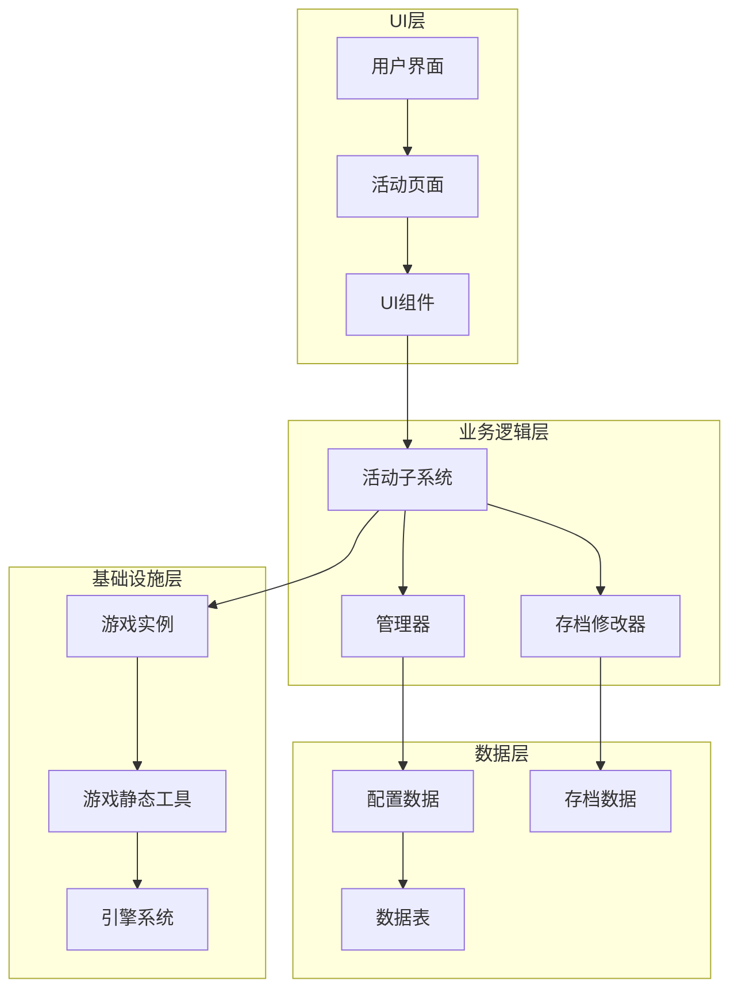
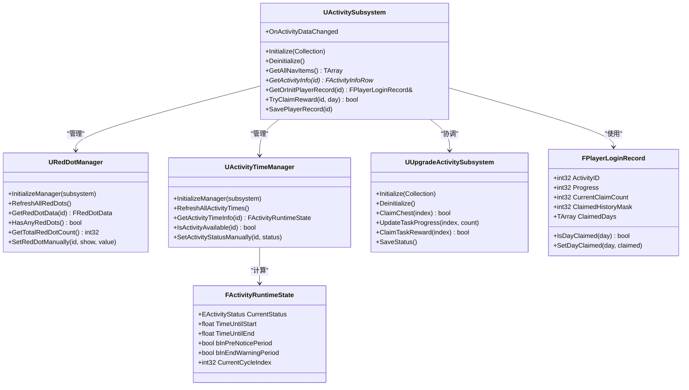
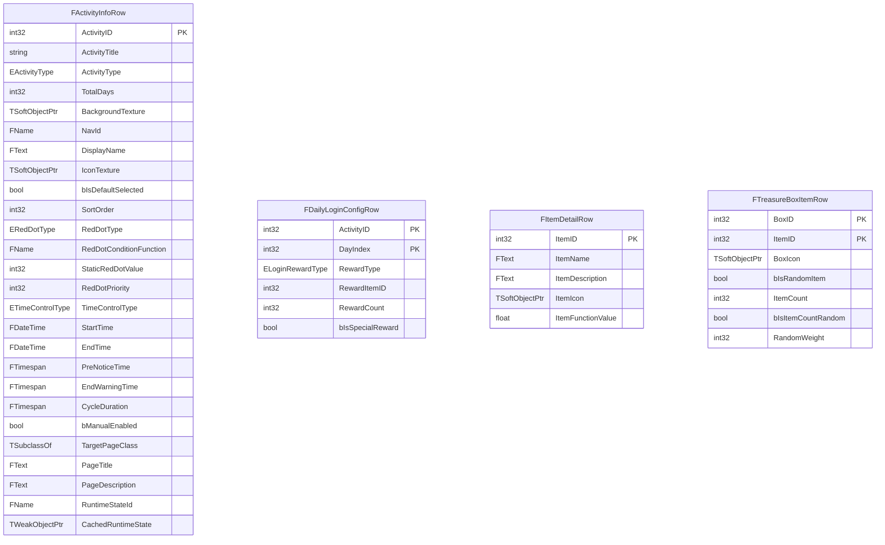
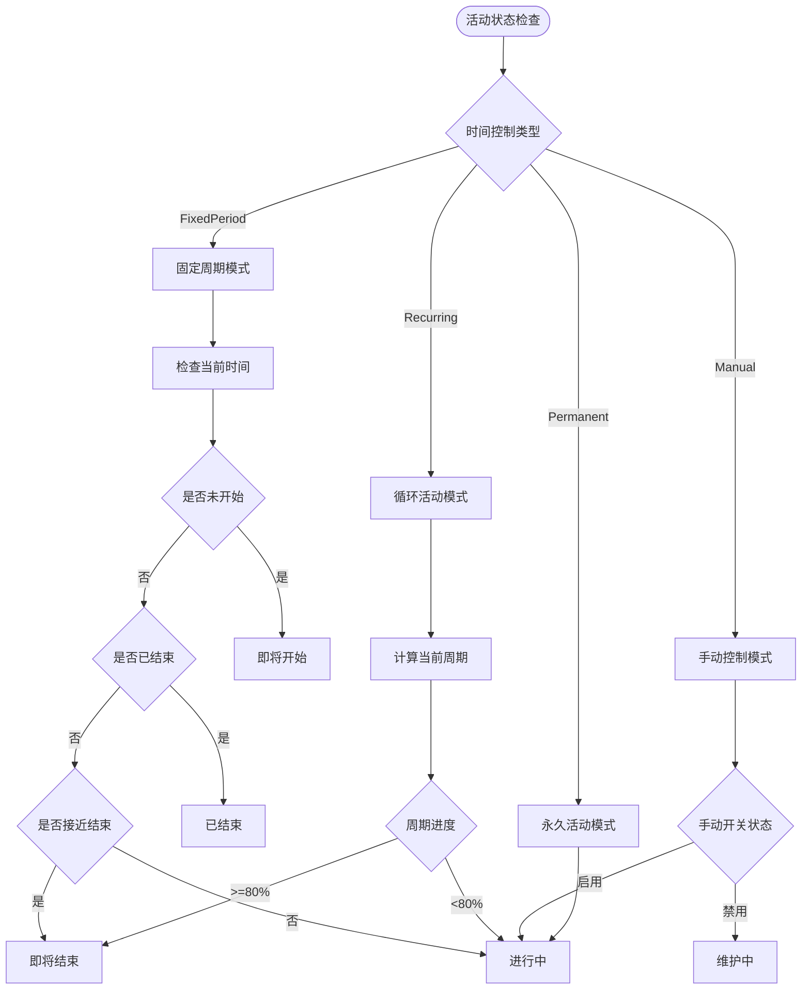
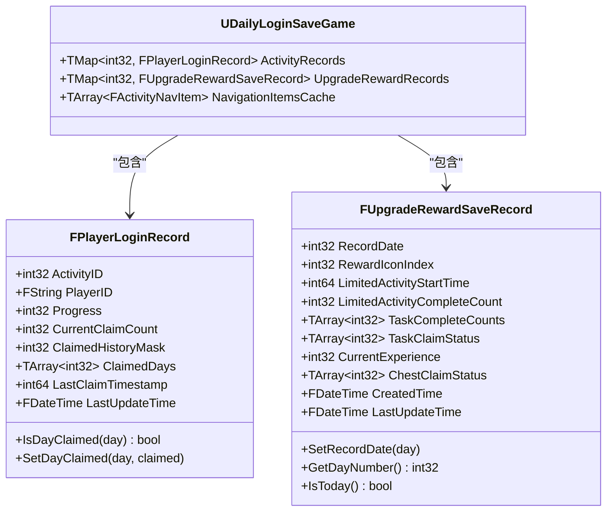
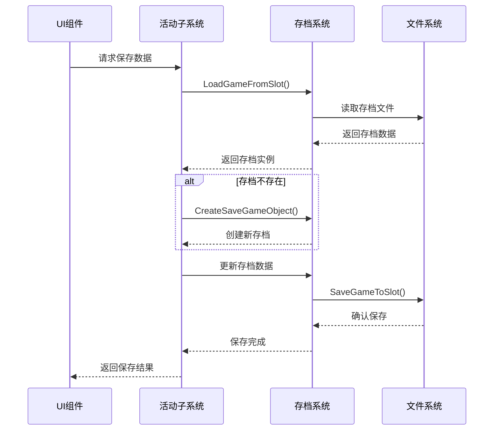
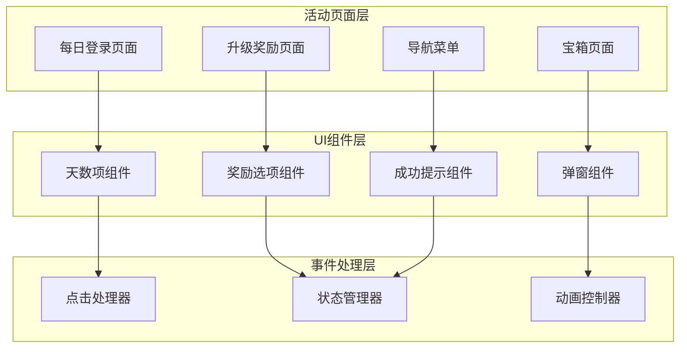
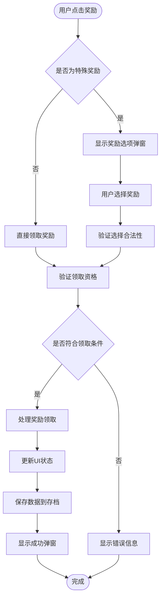
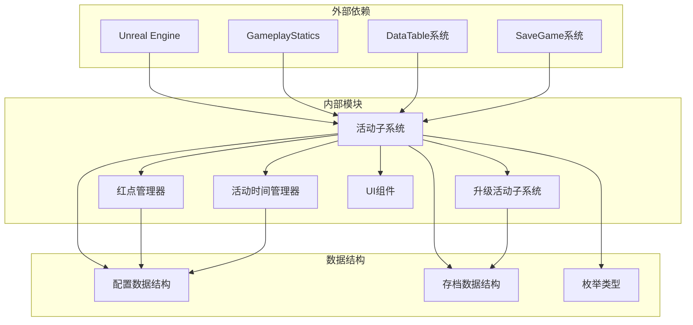

# 自定义活动开发

<cite>
**本文档引用的文件**
- [ActivitySubsystem.cpp](file://MetalSlug01/Source/MetalSlug01/Private/UI/Activity/Core/ActivitySubsystem.cpp)
- [ActivitySubsystem.h](file://MetalSlug01/Source/MetalSlug01/Public/UI/Activity/Core/ActivitySubsystem.h)
- [UpgradeActivitySubsystem.cpp](file://MetalSlug01/Source/MetalSlug01/Private/UI/Activity/Core/UpgradeActivitySubsystem.cpp)
- [ActivityTimeManager.cpp](file://MetalSlug01/Source/MetalSlug01/Private/UI/Activity/Managers/ActivityTimeManager.cpp)
- [DailyLoginConfig.h](file://MetalSlug01/Source/MetalSlug01/Public/UI/Activity/Data/DailyLoginConfig.h)
- [DailyLoginSave.h](file://MetalSlug01/Source/MetalSlug01/Public/UI/Activity/Data/DailyLoginSave.h)
- [RedDotManager.cpp](file://MetalSlug01/Source/MetalSlug01/Private/UI/Activity/Core/RedDotManager.cpp)
- [RedDotManager.h](file://MetalSlug01/Source/MetalSlug01/Public/UI/Activity/Core/RedDotManager.h)
- [DailyLoginPage.cpp](file://MetalSlug01/Source/MetalSlug01/Private/UI/Activity/Pages/DailyLogin/DailyLoginPage.cpp)
- [DailyLoginPage.h](file://MetalSlug01/Source/MetalSlug01/Public/UI/Activity/Pages/DailyLogin/DailyLoginPage.h)
</cite>

## 目录
1. [简介](#简介)
2. [项目结构](#项目结构)
3. [核心组件](#核心组件)
4. [架构概览](#架构概览)
5. [详细组件分析](#详细组件分析)
6. [依赖关系分析](#依赖关系分析)
7. [性能考虑](#性能考虑)
8. [故障排除指南](#故障排除指南)
9. [结论](#结论)
10. [附录](#附录)

## 简介

MetalSlug项目的活动系统是一个高度模块化的游戏活动管理框架，专为支持多种活动类型（如每日登录、升级奖励等）而设计。该系统采用Unreal Engine的子系统架构，提供了完整的活动生命周期管理、数据持久化和UI集成解决方案。

活动系统的核心设计理念是"解耦与复用"，通过将活动配置、运行时状态、数据持久化等功能分离到不同的组件中，实现了高度的模块化和可扩展性。系统支持动态活动配置、实时状态更新、多类型奖励管理和丰富的UI交互体验。

## 项目结构

活动系统采用分层架构设计，主要分为以下几个层次：



**图表来源**
- [ActivitySubsystem.cpp](file://MetalSlug01/Source/MetalSlug01/Private/UI/Activity/Core/ActivitySubsystem.cpp#L1-L599)
- [DailyLoginConfig.h](file://MetalSlug01/Source/MetalSlug01/Public/UI/Activity/Data/DailyLoginConfig.h#L1-L635)
- [DailyLoginSave.h](file://MetalSlug01/Source/MetalSlug01/Public/UI/Activity/Data/DailyLoginSave.h#L1-L373)

**章节来源**
- [ActivitySubsystem.cpp](file://MetalSlug01/Source/MetalSlug01/Private/UI/Activity/Core/ActivitySubsystem.cpp#L1-L50)
- [DailyLoginConfig.h](file://MetalSlug01/Source/MetalSlug01/Public/UI/Activity/Data/DailyLoginConfig.h#L1-L50)

## 核心组件

### 活动子系统 (ActivitySubsystem)

活动子系统是整个活动系统的核心协调者，负责管理所有活动相关的功能和服务。它继承自UGameInstanceSubsystem，提供了统一的接口来访问各种活动功能。

#### 主要职责
- 活动配置管理：加载和缓存活动配置数据
- 玩家进度跟踪：管理玩家在各个活动中的进度状态
- 数据持久化：处理活动数据的序列化和反序列化
- UI集成：为UI组件提供数据访问接口
- 事件管理：广播活动状态变化事件

#### 关键接口
- `GetAllNavItems()`：获取所有导航项配置
- `GetActivityInfo()`：获取特定活动的配置信息
- `GetOrInitPlayerRecord()`：获取或初始化玩家记录
- `TryClaimReward()`：尝试领取奖励
- `SavePlayerRecord()`：保存玩家记录

**章节来源**
- [ActivitySubsystem.h](file://MetalSlug01/Source/MetalSlug01/Public/UI/Activity/Core/ActivitySubsystem.h#L29-L178)
- [ActivitySubsystem.cpp](file://MetalSlug01/Source/MetalSlug01/Private/UI/Activity/Core/ActivitySubsystem.cpp#L7-L175)

### 红点管理器 (RedDotManager)

红点管理器专门负责活动系统的红点状态计算和管理。它能够根据配置的条件函数或静态值来计算每个活动的红点状态。

#### 核心功能
- 红点状态计算：支持动态条件函数和静态值两种计算方式
- 红点缓存：缓存计算结果以提高性能
- 手动控制：支持手动设置红点状态用于测试或特殊逻辑
- 总数统计：提供红点总数的统计功能

**章节来源**
- [RedDotManager.h](file://MetalSlug01/Source/MetalSlug01/Public/UI/Activity/Core/RedDotManager.h#L12-L100)
- [RedDotManager.cpp](file://MetalSlug01/Source/MetalSlug01/Private/UI/Activity/Core/RedDotManager.cpp#L1-L160)

### 活动时间管理器 (ActivityTimeManager)

活动时间管理器负责活动的时间控制和状态管理，包括活动的自动上下架、倒计时显示等功能。

#### 主要特性
- 时间状态计算：根据当前时间计算活动状态
- 周期管理：支持固定周期和循环活动的时间控制
- 提醒机制：提供活动开始和结束前提醒功能
- 手动控制：支持运维手动控制活动状态

**章节来源**
- [ActivityTimeManager.cpp](file://MetalSlug01/Source/MetalSlug01/Private/UI/Activity/Managers/ActivityTimeManager.cpp#L1-L235)

### 升级活动子系统 (UpgradeActivitySubsystem)

升级活动子系统是活动系统的一个重要扩展，专门处理升级奖励活动的复杂逻辑。

#### 核心功能
- 多天数支持：支持7天的升级奖励活动
- 任务管理系统：管理不同类型的任务完成情况
- 经验值系统：处理玩家经验值的累积和管理
- 宝箱领取：支持宝箱奖励的领取和管理

**章节来源**
- [UpgradeActivitySubsystem.cpp](file://MetalSlug01/Source/MetalSlug01/Private/UI/Activity/Core/UpgradeActivitySubsystem.cpp#L1-L800)

## 架构概览

活动系统采用分层架构设计，各层之间通过清晰的接口进行通信，实现了高度的模块化和可维护性。



**图表来源**
- [ActivitySubsystem.h](file://MetalSlug01/Source/MetalSlug01/Public/UI/Activity/Core/ActivitySubsystem.h#L30-L178)
- [RedDotManager.h](file://MetalSlug01/Source/MetalSlug01/Public/UI/Activity/Core/RedDotManager.h#L16-L100)
- [DailyLoginSave.h](file://MetalSlug01/Source/MetalSlug01/Public/UI/Activity/Data/DailyLoginSave.h#L27-L373)

## 详细组件分析

### 活动配置系统

活动配置系统采用数据驱动的设计理念，通过数据表来定义活动的各种属性和行为。

#### 配置数据结构



**图表来源**
- [DailyLoginConfig.h](file://MetalSlug01/Source/MetalSlug01/Public/UI/Activity/Data/DailyLoginConfig.h#L196-L622)

#### 时间控制机制

活动系统支持多种时间控制模式，包括固定周期、循环活动、永久活动和手动控制。



**图表来源**
- [ActivityTimeManager.cpp](file://MetalSlug01/Source/MetalSlug01/Private/UI/Activity/Managers/ActivityTimeManager.cpp#L162-L235)

**章节来源**
- [DailyLoginConfig.h](file://MetalSlug01/Source/MetalSlug01/Public/UI/Activity/Data/DailyLoginConfig.h#L19-L124)
- [ActivityTimeManager.cpp](file://MetalSlug01/Source/MetalSlug01/Private/UI/Activity/Managers/ActivityTimeManager.cpp#L101-L235)

### 数据持久化系统

活动系统的数据持久化采用Unreal Engine的SaveGame机制，支持玩家进度的完整序列化和反序列化。

#### 存档数据结构



**图表来源**
- [DailyLoginSave.h](file://MetalSlug01/Source/MetalSlug01/Public/UI/Activity/Data/DailyLoginSave.h#L352-L373)
- [DailyLoginSave.h](file://MetalSlug01/Source/MetalSlug01/Public/UI/Activity/Data/DailyLoginSave.h#L85-L343)

#### 存档管理流程



**图表来源**
- [ActivitySubsystem.cpp](file://MetalSlug01/Source/MetalSlug01/Private/UI/Activity/Core/ActivitySubsystem.cpp#L101-L161)

**章节来源**
- [DailyLoginSave.h](file://MetalSlug01/Source/MetalSlug01/Public/UI/Activity/Data/DailyLoginSave.h#L345-L373)
- [ActivitySubsystem.cpp](file://MetalSlug01/Source/MetalSlug01/Private/UI/Activity/Core/ActivitySubsystem.cpp#L101-L161)

### UI集成与交互

活动系统的UI层采用模块化设计，每个活动都有独立的页面组件，通过统一的接口与业务逻辑层交互。

#### UI组件架构



**图表来源**
- [DailyLoginPage.cpp](file://MetalSlug01/Source/MetalSlug01/Private/UI/Activity/Pages/DailyLogin/DailyLoginPage.cpp#L24-L292)

#### 奖励领取流程



**图表来源**
- [DailyLoginPage.cpp](file://MetalSlug01/Source/MetalSlug01/Private/UI/Activity/Pages/DailyLogin/DailyLoginPage.cpp#L780-L800)

**章节来源**
- [DailyLoginPage.h](file://MetalSlug01/Source/MetalSlug01/Public/UI/Activity/Pages/DailyLogin/DailyLoginPage.h#L9-L101)
- [DailyLoginPage.cpp](file://MetalSlug01/Source/MetalSlug01/Private/UI/Activity/Pages/DailyLogin/DailyLoginPage.cpp#L74-L292)

## 依赖关系分析

活动系统的依赖关系相对简单且清晰，主要遵循单向依赖原则，避免了循环依赖问题。



**图表来源**
- [ActivitySubsystem.cpp](file://MetalSlug01/Source/MetalSlug01/Private/UI/Activity/Core/ActivitySubsystem.cpp#L1-L10)
- [DailyLoginConfig.h](file://MetalSlug01/Source/MetalSlug01/Public/UI/Activity/Data/DailyLoginConfig.h#L15-L18)

### 模块耦合度分析

活动系统在设计上实现了良好的模块内聚和低耦合：

- **ActivitySubsystem** 作为核心协调者，与其他模块保持松耦合关系
- **RedDotManager** 专注于红点计算，不依赖具体的UI实现
- **ActivityTimeManager** 独立处理时间逻辑，与业务逻辑分离
- **UpgradeActivitySubsystem** 专门处理升级活动的复杂逻辑
- **UI组件** 通过接口与业务逻辑层交互，实现完全解耦

**章节来源**
- [ActivitySubsystem.h](file://MetalSlug01/Source/MetalSlug01/Public/UI/Activity/Core/ActivitySubsystem.h#L17-L28)
- [RedDotManager.h](file://MetalSlug01/Source/MetalSlug01/Public/UI/Activity/Core/RedDotManager.h#L12-L16)

## 性能考虑

活动系统在设计时充分考虑了性能优化，采用了多种策略来确保系统的高效运行。

### 缓存策略

系统实现了多层次的缓存机制：

1. **配置表缓存**：活动配置数据在首次加载后缓存在内存中
2. **红点状态缓存**：红点计算结果缓存，避免重复计算
3. **玩家记录缓存**：最近使用的玩家记录缓存在内存中
4. **UI组件缓存**：频繁使用的UI组件实例进行缓存

### 异步处理

对于耗时的操作，系统采用了异步处理策略：

- 数据加载采用延迟加载策略
- 复杂的计算操作在后台线程执行
- UI更新采用批量处理减少重绘次数

### 内存管理

系统实现了智能的内存管理：

- 使用弱引用避免循环引用
- 及时清理不再使用的对象
- 合理使用TArray和TMap减少内存碎片

## 故障排除指南

### 常见问题及解决方案

#### 活动配置加载失败

**问题症状**：活动页面显示空白或报错

**可能原因**：
1. 数据表路径配置错误
2. 数据表格式不正确
3. 资源引用失效

**解决步骤**：
1. 检查数据表路径是否正确
2. 验证数据表字段类型和格式
3. 确认资源文件是否存在于打包中

#### 玩家数据丢失

**问题症状**：重启游戏后进度消失

**可能原因**：
1. 存档文件损坏
2. 保存时机不当
3. 存档槽位冲突

**解决步骤**：
1. 检查SaveGame文件是否存在
2. 验证存档数据完整性
3. 确认存档槽位使用正确

#### UI状态不同步

**问题症状**：UI显示与实际状态不符

**可能原因**：
1. 事件广播未正确触发
2. 状态更新时机错误
3. 缓存数据未及时刷新

**解决步骤**：
1. 检查OnActivityDataChanged事件绑定
2. 验证状态更新逻辑
3. 清理相关缓存数据

**章节来源**
- [ActivitySubsystem.cpp](file://MetalSlug01/Source/MetalSlug01/Private/UI/Activity/Core/ActivitySubsystem.cpp#L101-L161)
- [RedDotManager.cpp](file://MetalSlug01/Source/MetalSlug01/Private/UI/Activity/Core/RedDotManager.cpp#L12-L36)

### 调试技巧

#### 日志调试

系统提供了丰富的日志输出，便于问题定位：

```cpp
// 常用调试日志
UE_LOG(LogTemp, Warning, TEXT("ActivitySubsystem: 活动ID=%d的配置加载成功"), ActivityID);
UE_LOG(LogTemp, Error, TEXT("ActivitySubsystem: 无法加载活动配置"));
UE_LOG(LogTemp, Log, TEXT("ActivitySubsystem: 玩家进度更新到第%d天"), NewProgress);
```

#### 断点调试

推荐在以下关键位置设置断点：
1. 活动子系统的Initialize和Deinitialize函数
2. 数据加载和保存的关键节点
3. UI事件处理函数的入口
4. 红点状态计算的逻辑分支

#### 性能监控

使用Unreal Engine的性能分析工具监控：
1. 内存使用情况
2. CPU占用率
3. 磁盘I/O操作
4. 网络请求（如有）

## 结论

MetalSlug项目的活动系统是一个设计精良、功能完善的活动管理框架。通过采用模块化架构、数据驱动设计和高效的缓存策略，系统实现了高度的可扩展性和维护性。

系统的主要优势包括：
- **模块化设计**：清晰的职责分离和接口定义
- **数据驱动**：通过配置表实现灵活的活动定制
- **高性能**：多层缓存和异步处理机制
- **易扩展**：插件化的架构支持新活动类型的快速集成

对于开发者来说，理解活动系统的核心概念和架构设计是成功开发自定义活动的基础。通过参考现有的活动实现（如每日登录和升级奖励活动），可以快速掌握活动开发的最佳实践。

## 附录

### 开发最佳实践

#### 活动类型设计建议

1. **明确活动边界**：每个活动应该有清晰的功能边界和职责范围
2. **配置优先**：尽量通过配置表定义活动行为，减少硬编码
3. **状态管理**：合理设计活动状态，确保状态转换的正确性
4. **数据一致性**：保证活动数据的完整性和一致性

#### UI组件开发指南

1. **接口标准化**：UI组件应该通过统一的接口与业务逻辑交互
2. **事件处理**：正确处理用户交互事件，及时更新状态
3. **性能优化**：避免不必要的UI重绘和数据刷新
4. **错误处理**：优雅地处理各种异常情况

#### 测试策略

1. **单元测试**：为关键业务逻辑编写单元测试
2. **集成测试**：测试组件间的协作和数据流
3. **性能测试**：监控系统在高负载下的表现
4. **回归测试**：确保新功能不影响现有功能

### 常用工具和资源

#### 开发工具
- Unreal Engine 4.27+
- Visual Studio 2019+
- Git版本控制系统

#### 资源管理
- 数据表编辑器
- 蓝图可视化编程
- 内存分析工具
- 性能监控工具

#### 参考文档
- Unreal Engine官方文档
- C++编程规范
- UI设计指南
- 性能优化最佳实践