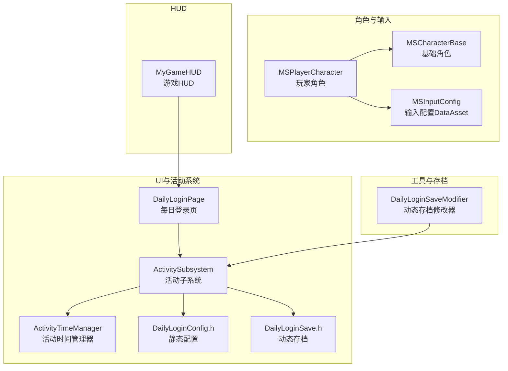
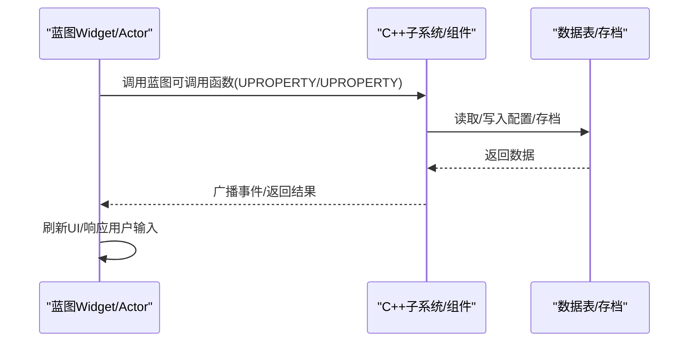
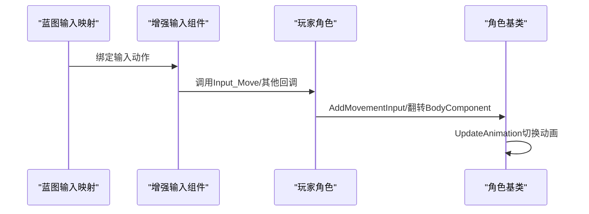
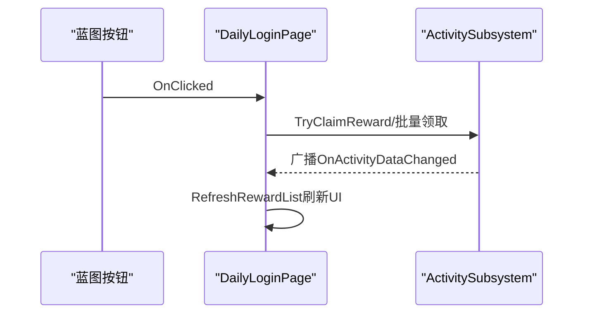
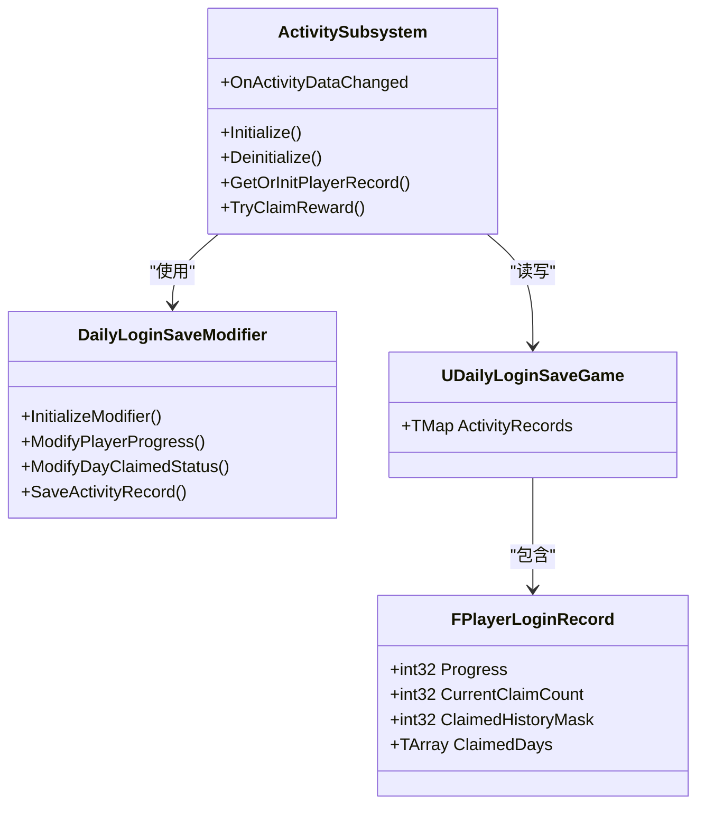
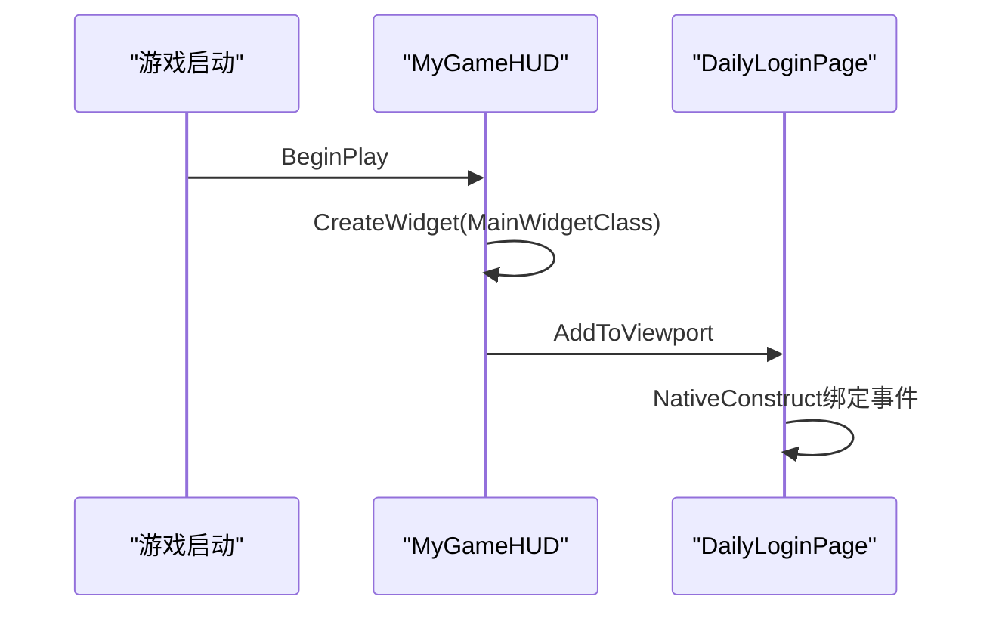
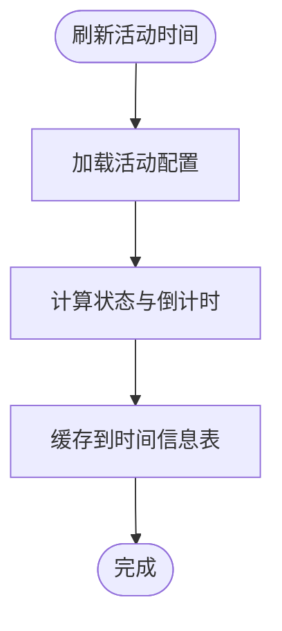
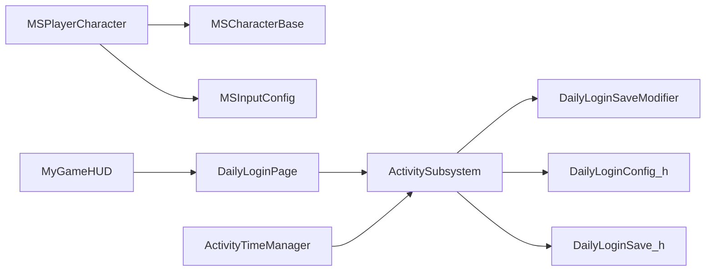

# 蓝图与C++集成

<cite>
**本文引用的文件**
- [MSCharacterBase.h](file://MetalSlug01/Source/MetalSlug01/Public/Characters/MSCharacterBase.h)
- [MSCharacterBase.cpp](file://MetalSlug01/Source/MetalSlug01/Private/Characters/MSCharacterBase.cpp)
- [MSPlayerCharacter.h](file://MetalSlug01/Source/MetalSlug01/Public/Characters/MSPlayerCharacter.h)
- [MSPlayerCharacter.cpp](file://MetalSlug01/Source/MetalSlug01/Private/Characters/MSPlayerCharacter.cpp)
- [MyGameHUD.h](file://MetalSlug01/Source/MetalSlug01/Public/UI/MyGameHUD.h)
- [MyGameHUD.cpp](file://MetalSlug01/Source/MetalSlug01/Private/UI/MyGameHUD.cpp)
- [ActivitySubsystem.h](file://MetalSlug01/Source/MetalSlug01/Public/UI/Activity/Core/ActivitySubsystem.h)
- [ActivitySubsystem.cpp](file://MetalSlug01/Source/MetalSlug01/Private/UI/Activity/Core/ActivitySubsystem.cpp)
- [DailyLoginConfig.h](file://MetalSlug01/Source/MetalSlug01/Public/UI/Activity/Data/DailyLoginConfig.h)
- [DailyLoginSave.h](file://MetalSlug01/Source/MetalSlug01/Public/UI/Activity/Data/DailyLoginSave.h)
- [MSInputConfig.h](file://MetalSlug01/Source/MetalSlug01/Public/Data/MSInputConfig.h)
- [DailyLoginPage.h](file://MetalSlug01/Source/MetalSlug01/Public/UI/Activity/Pages/DailyLogin/DailyLoginPage.h)
- [DailyLoginPage.cpp](file://MetalSlug01/Source/MetalSlug01/Private/UI/Activity/Pages/DailyLogin/DailyLoginPage.cpp)
- [ActivityTimeManager.h](file://MetalSlug01/Source/MetalSlug01/Public/UI/Activity/Managers/ActivityTimeManager.h)
- [ActivityTimeManager.cpp](file://MetalSlug01/Source/MetalSlug01/Private/UI/Activity/Managers/ActivityTimeManager.cpp)
- [DailyLoginSaveModifier.h](file://MetalSlug01/Source/MetalSlug01/Public/Tools/DailyLoginSaveModifier.h)
- [DailyLoginSaveModifier.cpp](file://MetalSlug01/Source/MetalSlug01/Private/Tools/DailyLoginSaveModifier.cpp)
</cite>

## 目录
1. [简介](#简介)
2. [项目结构](#项目结构)
3. [核心组件](#核心组件)
4. [架构总览](#架构总览)
5. [详细组件分析](#详细组件分析)
6. [依赖关系分析](#依赖关系分析)
7. [性能考虑](#性能考虑)
8. [故障排查指南](#故障排查指南)
9. [结论](#结论)
10. [附录](#附录)

## 简介
本指南面向希望在MetalSlug项目中实现蓝图与C++深度集成的开发者，系统讲解如何通过UCLASS、UPROPERTY、UFUNCTION等宏将C++类暴露给蓝图；如何在蓝图中绑定事件、使用委托进行数据传递；以及C++与蓝图之间变量共享、函数调用与对象传递的完整流程。文档还提供了角色控制、UI交互、活动系统等场景下的蓝图与C++协作范式，并总结性能优化与调试技巧。

## 项目结构
项目采用“按功能域分层”的组织方式：
- 角色与输入：Characters目录包含基础角色与玩家角色，配合输入配置DataAsset
- UI与活动系统：UI/Activity目录包含页面、子系统、数据表与管理器
- 工具与存档：Tools目录提供动态存档修改器，支撑活动系统的运行时修改
- HUD：MyGameHUD负责主界面UI挂载

图表来源
- [MSCharacterBase.h](file://MetalSlug01/Source/MetalSlug01/Public/Characters/MSCharacterBase.h#L10-L50)
- [MSPlayerCharacter.h](file://MetalSlug01/Source/MetalSlug01/Public/Characters/MSPlayerCharacter.h#L13-L41)
- [MSInputConfig.h](file://MetalSlug01/Source/MetalSlug01/Public/Data/MSInputConfig.h#L12-L29)
- [ActivitySubsystem.h](file://MetalSlug01/Source/MetalSlug01/Public/UI/Activity/Core/ActivitySubsystem.h#L29-L178)
- [DailyLoginPage.h](file://MetalSlug01/Source/MetalSlug01/Public/UI/Activity/Pages/DailyLogin/DailyLoginPage.h#L9-L101)
- [ActivityTimeManager.h](file://MetalSlug01/Source/MetalSlug01/Public/UI/Activity/Managers/ActivityTimeManager.h#L18-L117)
- [DailyLoginSaveModifier.h](file://MetalSlug01/Source/MetalSlug01/Public/Tools/DailyLoginSaveModifier.h#L72-L294)
- [MyGameHUD.h](file://MetalSlug01/Source/MetalSlug01/Public/UI/MyGameHUD.h#L7-L23)

章节来源
- [MSCharacterBase.h](file://MetalSlug01/Source/MetalSlug01/Public/Characters/MSCharacterBase.h#L1-L50)
- [MSPlayerCharacter.h](file://MetalSlug01/Source/MetalSlug01/Public/Characters/MSPlayerCharacter.h#L1-L41)
- [ActivitySubsystem.h](file://MetalSlug01/Source/MetalSlug01/Public/UI/Activity/Core/ActivitySubsystem.h#L1-L178)
- [DailyLoginPage.h](file://MetalSlug01/Source/MetalSlug01/Public/UI/Activity/Pages/DailyLogin/DailyLoginPage.h#L1-L101)
- [DailyLoginSaveModifier.h](file://MetalSlug01/Source/MetalSlug01/Public/Tools/DailyLoginSaveModifier.h#L1-L294)
- [MyGameHUD.h](file://MetalSlug01/Source/MetalSlug01/Public/UI/MyGameHUD.h#L1-L23)

## 核心组件
- 角色基类与玩家角色：通过UPROPERTY公开渲染组件与动画资源，通过UFUNCTION绑定输入回调，实现蓝图与C++的输入联动
- 活动子系统：统一管理活动数据、时间状态与存档修改器，提供蓝图可调用的接口与事件广播
- UI页面：通过蓝图类暴露函数与绑定事件，C++侧通过子系统接口驱动数据刷新与交互
- HUD：负责主界面UI挂载，桥接页面与子系统
- 输入配置：将输入动作集中到DataAsset，便于蓝图直接配置

章节来源
- [MSCharacterBase.h](file://MetalSlug01/Source/MetalSlug01/Public/Characters/MSCharacterBase.h#L10-L50)
- [MSPlayerCharacter.h](file://MetalSlug01/Source/MetalSlug01/Public/Characters/MSPlayerCharacter.h#L13-L41)
- [ActivitySubsystem.h](file://MetalSlug01/Source/MetalSlug01/Public/UI/Activity/Core/ActivitySubsystem.h#L29-L178)
- [DailyLoginPage.h](file://MetalSlug01/Source/MetalSlug01/Public/UI/Activity/Pages/DailyLogin/DailyLoginPage.h#L9-L101)
- [MyGameHUD.h](file://MetalSlug01/Source/MetalSlug01/Public/UI/MyGameHUD.h#L7-L23)
- [MSInputConfig.h](file://MetalSlug01/Source/MetalSlug01/Public/Data/MSInputConfig.h#L12-L29)

## 架构总览
蓝图与C++的集成遵循“蓝图负责表现与交互、C++负责逻辑与数据”的分层原则。蓝图通过UPROPERTY暴露变量、通过UFUNCTION暴露函数，C++通过委托广播事件，蓝图订阅事件实现解耦交互。

图表来源
- [ActivitySubsystem.h](file://MetalSlug01/Source/MetalSlug01/Public/UI/Activity/Core/ActivitySubsystem.h#L92-L142)
- [DailyLoginPage.cpp](file://MetalSlug01/Source/MetalSlug01/Private/UI/Activity/Pages/DailyLogin/DailyLoginPage.cpp#L24-L72)
- [DailyLoginSaveModifier.h](file://MetalSlug01/Source/MetalSlug01/Public/Tools/DailyLoginSaveModifier.h#L108-L149)

## 详细组件分析

### 角色控制：蓝图与C++输入绑定
- 角色基类通过UPROPERTY公开渲染组件与动画资源，蓝图可直接配置
- 玩家角色通过SetupPlayerInputComponent绑定增强输入动作，将输入值传递给C++处理函数
- C++侧根据输入值调用移动与翻转逻辑，同时驱动动画切换

图表来源
- [MSPlayerCharacter.cpp](file://MetalSlug01/Source/MetalSlug01/Private/Characters/MSPlayerCharacter.cpp#L29-L62)
- [MSCharacterBase.cpp](file://MetalSlug01/Source/MetalSlug01/Private/Characters/MSPlayerCharacter.cpp#L47-L64)

章节来源
- [MSCharacterBase.h](file://MetalSlug01/Source/MetalSlug01/Public/Characters/MSCharacterBase.h#L23-L49)
- [MSCharacterBase.cpp](file://MetalSlug01/Source/MetalSlug01/Private/Characters/MSCharacterBase.cpp#L47-L64)
- [MSPlayerCharacter.h](file://MetalSlug01/Source/MetalSlug01/Public/Characters/MSPlayerCharacter.h#L37-L41)
- [MSPlayerCharacter.cpp](file://MetalSlug01/Source/MetalSlug01/Private/Characters/MSPlayerCharacter.cpp#L29-L62)

### UI交互：蓝图回调与委托
- 页面类通过UPROPERTY(meta=(BindWidget))与蓝图控件绑定
- 通过AddDynamic绑定按钮点击等事件，C++侧实现处理逻辑并刷新UI
- 子系统通过DECLARE_DYNAMIC_MULTICAST_DELEGATE广播数据变更，页面订阅刷新

图表来源
- [DailyLoginPage.cpp](file://MetalSlug01/Source/MetalSlug01/Private/UI/Activity/Pages/DailyLogin/DailyLoginPage.cpp#L34-L46)
- [ActivitySubsystem.h](file://MetalSlug01/Source/MetalSlug01/Public/UI/Activity/Core/ActivitySubsystem.h#L149-L152)
- [DailyLoginPage.cpp](file://MetalSlug01/Source/MetalSlug01/Private/UI/Activity/Pages/DailyLogin/DailyLoginPage.cpp#L611-L645)

章节来源
- [DailyLoginPage.h](file://MetalSlug01/Source/MetalSlug01/Public/UI/Activity/Pages/DailyLogin/DailyLoginPage.h#L62-L96)
- [DailyLoginPage.cpp](file://MetalSlug01/Source/MetalSlug01/Private/UI/Activity/Pages/DailyLogin/DailyLoginPage.cpp#L24-L72)
- [ActivitySubsystem.h](file://MetalSlug01/Source/MetalSlug01/Public/UI/Activity/Core/ActivitySubsystem.h#L149-L152)

### 活动系统：数据模型与运行时修改
- 静态配置与动态存档分离：静态配置定义在DailyLoginConfig.h，动态存档定义在DailyLoginSave.h
- 子系统统一管理活动信息、玩家记录与时间状态，提供蓝图可调用接口
- 动态存档修改器支持运行时修改玩家进度、领取状态并自动保存

图表来源
- [ActivitySubsystem.h](file://MetalSlug01/Source/MetalSlug01/Public/UI/Activity/Core/ActivitySubsystem.h#L29-L178)
- [DailyLoginSaveModifier.h](file://MetalSlug01/Source/MetalSlug01/Public/Tools/DailyLoginSaveModifier.h#L72-L294)
- [DailyLoginSave.h](file://MetalSlug01/Source/MetalSlug01/Public/UI/Activity/Data/DailyLoginSave.h#L352-L373)

章节来源
- [DailyLoginConfig.h](file://MetalSlug01/Source/MetalSlug01/Public/UI/Activity/Data/DailyLoginConfig.h#L19-L139)
- [DailyLoginSave.h](file://MetalSlug01/Source/MetalSlug01/Public/UI/Activity/Data/DailyLoginSave.h#L85-L161)
- [ActivitySubsystem.cpp](file://MetalSlug01/Source/MetalSlug01/Private/UI/Activity/Core/ActivitySubsystem.cpp#L101-L161)
- [DailyLoginSaveModifier.cpp](file://MetalSlug01/Source/MetalSlug01/Private/Tools/DailyLoginSaveModifier.cpp#L60-L97)

### HUD与页面挂载
- HUD在BeginPlay阶段创建并挂载主页面Widget
- 页面通过子系统接口获取数据并刷新UI

图表来源
- [MyGameHUD.cpp](file://MetalSlug01/Source/MetalSlug01/Private/UI/MyGameHUD.cpp#L4-L18)
- [DailyLoginPage.cpp](file://MetalSlug01/Source/MetalSlug01/Private/UI/Activity/Pages/DailyLogin/DailyLoginPage.cpp#L24-L72)

章节来源
- [MyGameHUD.h](file://MetalSlug01/Source/MetalSlug01/Public/UI/MyGameHUD.h#L16-L22)
- [MyGameHUD.cpp](file://MetalSlug01/Source/MetalSlug01/Private/UI/MyGameHUD.cpp#L4-L18)
- [DailyLoginPage.cpp](file://MetalSlug01/Source/MetalSlug01/Private/UI/Activity/Pages/DailyLogin/DailyLoginPage.cpp#L24-L72)

### 时间管理与状态控制
- 时间管理器负责计算活动状态、倒计时与维护状态
- 支持手动设置活动状态与获取服务器时间

图表来源
- [ActivityTimeManager.cpp](file://MetalSlug01/Source/MetalSlug01/Private/UI/Activity/Managers/ActivityTimeManager.cpp#L23-L47)
- [ActivityTimeManager.cpp](file://MetalSlug01/Source/MetalSlug01/Private/UI/Activity/Managers/ActivityTimeManager.cpp#L101-L160)

章节来源
- [ActivityTimeManager.h](file://MetalSlug01/Source/MetalSlug01/Public/UI/Activity/Managers/ActivityTimeManager.h#L18-L117)
- [ActivityTimeManager.cpp](file://MetalSlug01/Source/MetalSlug01/Private/UI/Activity/Managers/ActivityTimeManager.cpp#L16-L99)

## 依赖关系分析
- 角色体系依赖Paper2D渲染组件与CharacterMovement
- UI页面依赖子系统与存档数据结构
- 子系统依赖时间管理器与动态存档修改器
- HUD依赖页面类与蓝图Widget

图表来源
- [MSPlayerCharacter.h](file://MetalSlug01/Source/MetalSlug01/Public/Characters/MSPlayerCharacter.h#L13-L41)
- [MSCharacterBase.h](file://MetalSlug01/Source/MetalSlug01/Public/Characters/MSCharacterBase.h#L10-L50)
- [DailyLoginPage.h](file://MetalSlug01/Source/MetalSlug01/Public/UI/Activity/Pages/DailyLogin/DailyLoginPage.h#L9-L101)
- [ActivitySubsystem.h](file://MetalSlug01/Source/MetalSlug01/Public/UI/Activity/Core/ActivitySubsystem.h#L29-L178)
- [ActivityTimeManager.h](file://MetalSlug01/Source/MetalSlug01/Public/UI/Activity/Managers/ActivityTimeManager.h#L18-L117)
- [MyGameHUD.h](file://MetalSlug01/Source/MetalSlug01/Public/UI/MyGameHUD.h#L7-L23)

章节来源
- [MSPlayerCharacter.cpp](file://MetalSlug01/Source/MetalSlug01/Private/Characters/MSPlayerCharacter.cpp#L10-L25)
- [DailyLoginPage.cpp](file://MetalSlug01/Source/MetalSlug01/Private/UI/Activity/Pages/DailyLogin/DailyLoginPage.cpp#L10-L22)
- [ActivitySubsystem.cpp](file://MetalSlug01/Source/MetalSlug01/Private/UI/Activity/Core/ActivitySubsystem.cpp#L7-L39)

## 性能考虑
- 动画切换：在Tick中统一调用UpdateAnimation，避免在输入回调中频繁切换动画
- UI刷新：批量领取与状态变更后统一刷新，减少多次Rebuild
- 存档写入：动态修改器支持批量保存，避免频繁IO
- 时间刷新：时间管理器设置合理刷新间隔，避免每帧计算

## 故障排查指南
- 输入绑定失效：确认玩家角色的AutoPossessPlayer设置与输入组件绑定
- UI控件未绑定：检查蓝图中控件名称与meta=(BindWidget)一致
- 委托未触发：确认AddDynamic绑定与事件签名一致，避免重复绑定导致的异常
- 存档未保存：检查动态修改器初始化与SaveGame槽位命名

章节来源
- [MSPlayerCharacter.cpp](file://MetalSlug01/Source/MetalSlug01/Private/Characters/MSPlayerCharacter.cpp#L23-L25)
- [DailyLoginPage.cpp](file://MetalSlug01/Source/MetalSlug01/Private/UI/Activity/Pages/DailyLogin/DailyLoginPage.cpp#L40-L50)
- [DailyLoginSaveModifier.cpp](file://MetalSlug01/Source/MetalSlug01/Private/Tools/DailyLoginSaveModifier.cpp#L27-L40)

## 结论
通过合理的蓝图与C++分工、清晰的数据模型与事件机制，MetalSlug实现了高内聚低耦合的UI与逻辑协作。蓝图负责表现与交互，C++负责数据与逻辑，配合委托与存档系统，既保证了开发效率也兼顾了运行时性能。

## 附录
- 蓝图与C++宏使用建议
  - UCLASS：抽象类使用Abstract，蓝图可继承扩展
  - UPROPERTY：VisibleAnywhere/BlueprintReadWrite用于蓝图配置；EditDefaultsOnly用于DataAsset
  - UFUNCTION：BlueprintCallable用于蓝图直接调用；蓝图事件函数用于回调
  - DECLARE_DYNAMIC_MULTICAST_DELEGATE：用于跨模块广播事件
- 数据交互最佳实践
  - 变量共享：通过UPROPERTY公开，蓝图直接读写
  - 函数调用：通过UFUNCTION暴露，避免直接跨模块访问私有成员
  - 对象传递：通过TObjectPtr/UPROPERTY传递，注意生命周期与空值检查
- 调试技巧
  - 使用日志输出关键流程与状态变化
  - 使用控制台命令快速验证存档修改器
  - 分步断点定位蓝图与C++交互问题