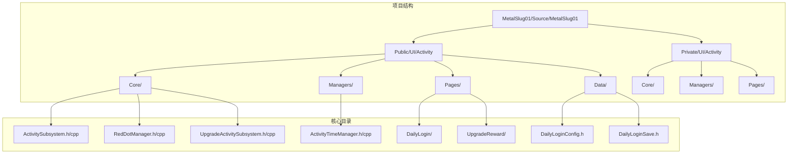
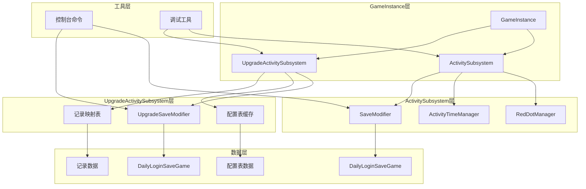
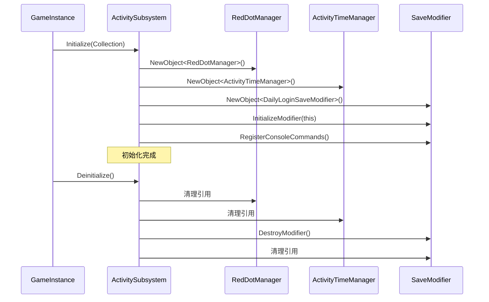
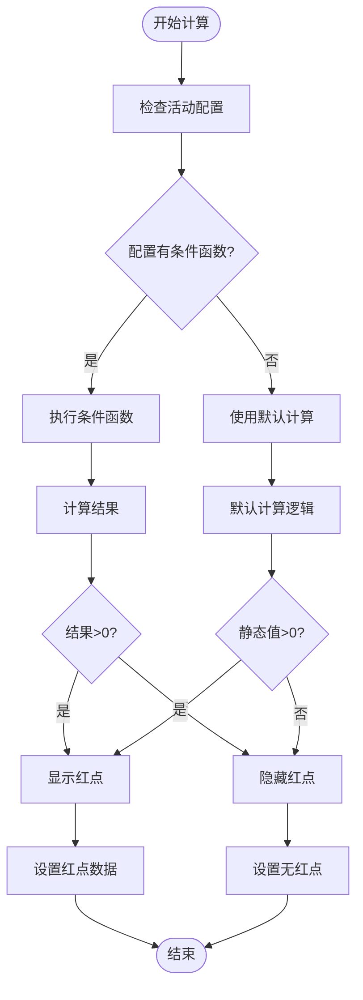
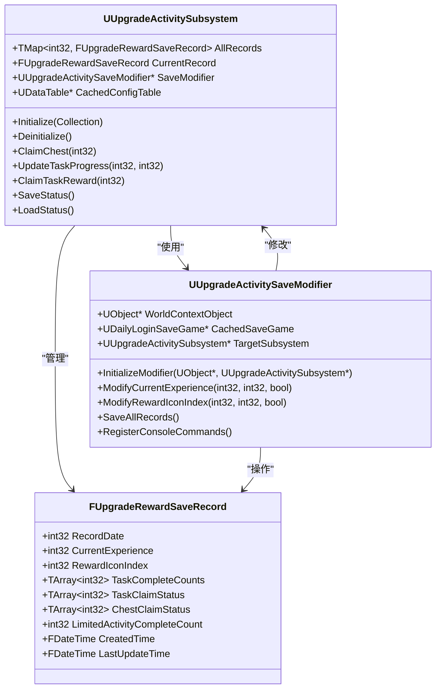
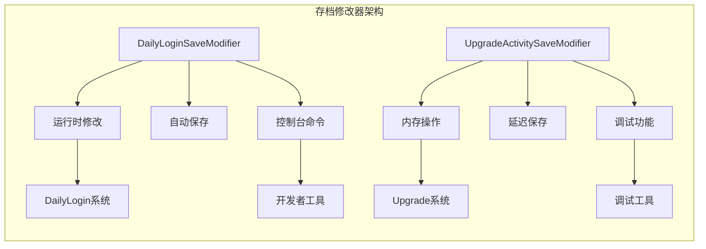
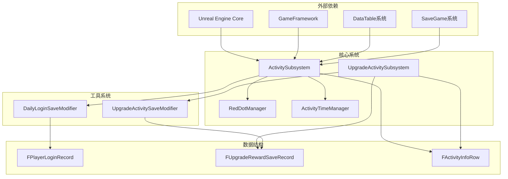
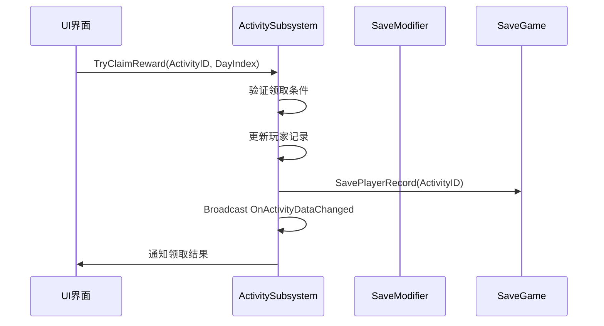

# Subsystems模式详解

<cite>
**本文档引用的文件**
- [ActivitySubsystem.h](file://MetalSlug01/Source/MetalSlug01/Public/UI/Activity/Core/ActivitySubsystem.h)
- [ActivitySubsystem.cpp](file://MetalSlug01/Source/MetalSlug01/Private/UI/Activity/Core/ActivitySubsystem.cpp)
- [RedDotManager.h](file://MetalSlug01/Source/MetalSlug01/Public/UI/Activity/Core/RedDotManager.h)
- [RedDotManager.cpp](file://MetalSlug01/Source/MetalSlug01/Private/UI/Activity/Core/RedDotManager.cpp)
- [UpgradeActivitySubsystem.h](file://MetalSlug01/Source/MetalSlug01/Public/UI/Activity/Core/UpgradeActivitySubsystem.h)
- [UpgradeActivitySubsystem.cpp](file://MetalSlug01/Source/MetalSlug01/Private/UI/Activity/Core/UpgradeActivitySubsystem.cpp)
- [ActivityTimeManager.h](file://MetalSlug01/Source/MetalSlug01/Public/UI/Activity/Managers/ActivityTimeManager.h)
- [ActivityTimeManager.cpp](file://MetalSlug01/Source/MetalSlug01/Private/UI/Activity/Managers/ActivityTimeManager.cpp)
- [DailyLoginSaveModifier.h](file://MetalSlug01/Source/MetalSlug01/Public/Tools/DailyLoginSaveModifier.h)
- [DailyLoginSaveModifier.cpp](file://MetalSlug01/Source/MetalSlug01/Private/Tools/DailyLoginSaveModifier.cpp)
- [UpgradeActivitySaveModifier.h](file://MetalSlug01/Source/MetalSlug01/Public/Tools/UpgradeActivitySaveModifier.h)
- [UpgradeActivitySaveModifier.cpp](file://MetalSlug01/Source/MetalSlug01/Private/Tools/UpgradeActivitySaveModifier.cpp)
</cite>

## 目录
1. [简介](#简介)
2. [项目结构](#项目结构)
3. [核心组件](#核心组件)
4. [架构概览](#架构概览)
5. [详细组件分析](#详细组件分析)
6. [依赖关系分析](#依赖关系分析)
7. [性能考虑](#性能考虑)
8. [故障排除指南](#故障排除指南)
9. [结论](#结论)
10. [附录](#附录)

## 简介

MetalSlug项目采用Unreal Engine的Subsystems架构模式，构建了一个高度模块化的活动管理系统。该系统通过GameInstance级别的子系统管理各种活动功能，实现了清晰的职责分离和松耦合的设计。

本项目的核心创新在于将传统的活动系统重构为基于Subsystems的架构，通过ActivitySubsystem作为中央协调器，管理多个专用子系统，包括RedDotManager（红点管理）、ActivityTimeManager（时间管理）和UpgradeActivitySubsystem（升级奖励活动）。这种设计模式不仅提高了代码的可维护性，还为未来的功能扩展提供了良好的基础。

## 项目结构

项目采用按功能域划分的目录结构，核心活动系统位于`UI/Activity`目录下：

**图表来源**
- [ActivitySubsystem.h](file://MetalSlug01/Source/MetalSlug01/Public/UI/Activity/Core/ActivitySubsystem.h#L1-L178)
- [UpgradeActivitySubsystem.h](file://MetalSlug01/Source/MetalSlug01/Public/UI/Activity/Core/UpgradeActivitySubsystem.h#L1-L476)

**章节来源**
- [ActivitySubsystem.h](file://MetalSlug01/Source/MetalSlug01/Public/UI/Activity/Core/ActivitySubsystem.h#L1-L178)
- [UpgradeActivitySubsystem.h](file://MetalSlug01/Source/MetalSlug01/Public/UI/Activity/Core/UpgradeActivitySubsystem.h#L1-L476)

## 核心组件

### ActivitySubsystem - 中央协调器

ActivitySubsystem作为整个活动系统的核心协调器，承担着以下关键职责：

- **统一管理所有Activity Track**
- **负责Track的创建和生命周期管理**
- **为Page/UI提供Track访问入口**
- **规则约束：Subsystem不做业务判断，不直接操作UI**

该设计遵循了Subsystems架构的最佳实践，确保了职责分离和代码的可测试性。

**章节来源**
- [ActivitySubsystem.h](file://MetalSlug01/Source/MetalSlug01/Public/UI/Activity/Core/ActivitySubsystem.h#L17-L28)
- [ActivitySubsystem.cpp](file://MetalSlug01/Source/MetalSlug01/Private/UI/Activity/Core/ActivitySubsystem.cpp#L7-L39)

### RedDotManager - 红点管理系统

RedDotManager专门负责计算和管理所有活动项的红点状态，具有以下特性：

- **动态红点计算**：支持通过条件函数进行动态计算
- **多类型红点支持**：SimpleDot、NumberBadge、ProgressBadge等
- **优先级管理**：支持红点优先级排序
- **缓存机制**：优化性能，避免重复计算

**章节来源**
- [RedDotManager.h](file://MetalSlug01/Source/MetalSlug01/Public/UI/Activity/Core/RedDotManager.h#L12-L16)
- [RedDotManager.cpp](file://MetalSlug01/Source/MetalSlug01/Private/UI/Activity/Core/RedDotManager.cpp#L91-L160)

### UpgradeActivitySubsystem - 升级奖励活动系统

UpgradeActivitySubsystem管理升级奖励活动的核心业务逻辑，包括：

- **数据持久化管理**：经验数据、奖励图标、任务进度等
- **宝箱领取功能**：20点经验奖励机制
- **任务奖励系统**：50点经验奖励机制
- **重选奖励功能**：支持玩家重新选择奖励

**章节来源**
- [UpgradeActivitySubsystem.h](file://MetalSlug01/Source/MetalSlug01/Public/UI/Activity/Core/UpgradeActivitySubsystem.h#L20-L34)
- [UpgradeActivitySubsystem.cpp](file://MetalSlug01/Source/MetalSlug01/Private/UI/Activity/Core/UpgradeActivitySubsystem.cpp#L32-L89)

## 架构概览

项目采用分层架构设计，通过Subsystems实现模块间的松耦合：

**图表来源**
- [ActivitySubsystem.cpp](file://MetalSlug01/Source/MetalSlug01/Private/UI/Activity/Core/ActivitySubsystem.cpp#L12-L17)
- [UpgradeActivitySubsystem.cpp](file://MetalSlug01/Source/MetalSlug01/Private/UI/Activity/Core/UpgradeActivitySubsystem.cpp#L63-L65)

## 详细组件分析

### ActivitySubsystem生命周期管理

ActivitySubsystem的生命周期管理遵循Unreal Engine的Subsystems标准流程：

**图表来源**
- [ActivitySubsystem.cpp](file://MetalSlug01/Source/MetalSlug01/Private/UI/Activity/Core/ActivitySubsystem.cpp#L7-L39)

**章节来源**
- [ActivitySubsystem.cpp](file://MetalSlug01/Source/MetalSlug01/Private/UI/Activity/Core/ActivitySubsystem.cpp#L7-L39)

### RedDotManager红点计算算法

RedDotManager实现了灵活的红点计算机制：

**图表来源**
- [RedDotManager.cpp](file://MetalSlug01/Source/MetalSlug01/Private/UI/Activity/Core/RedDotManager.cpp#L91-L160)

**章节来源**
- [RedDotManager.cpp](file://MetalSlug01/Source/MetalSlug01/Private/UI/Activity/Core/RedDotManager.cpp#L91-L160)

### UpgradeActivitySubsystem数据流

UpgradeActivitySubsystem的数据流设计体现了良好的封装性：

**图表来源**
- [UpgradeActivitySubsystem.h](file://MetalSlug01/Source/MetalSlug01/Public/UI/Activity/Core/UpgradeActivitySubsystem.h#L413-L476)
- [UpgradeActivitySaveModifier.h](file://MetalSlug01/Source/MetalSlug01/Public/Tools/UpgradeActivitySaveModifier.h#L34-L347)

**章节来源**
- [UpgradeActivitySubsystem.h](file://MetalSlug01/Source/MetalSlug01/Public/UI/Activity/Core/UpgradeActivitySubsystem.h#L413-L476)
- [UpgradeActivitySaveModifier.h](file://MetalSlug01/Source/MetalSlug01/Public/Tools/UpgradeActivitySaveModifier.h#L34-L347)

### 存档修改器架构

项目实现了两个专用的存档修改器，提供运行时数据修改能力：

**图表来源**
- [DailyLoginSaveModifier.cpp](file://MetalSlug01/Source/MetalSlug01/Private/Tools/DailyLoginSaveModifier.cpp#L559-L664)
- [UpgradeActivitySaveModifier.cpp](file://MetalSlug01/Source/MetalSlug01/Private/Tools/UpgradeActivitySaveModifier.cpp#L686-L744)

**章节来源**
- [DailyLoginSaveModifier.cpp](file://MetalSlug01/Source/MetalSlug01/Private/Tools/DailyLoginSaveModifier.cpp#L559-L664)
- [UpgradeActivitySaveModifier.cpp](file://MetalSlug01/Source/MetalSlug01/Private/Tools/UpgradeActivitySaveModifier.cpp#L686-L744)

## 依赖关系分析

项目中的组件依赖关系体现了清晰的层次结构：

**图表来源**
- [ActivitySubsystem.h](file://MetalSlug01/Source/MetalSlug01/Public/UI/Activity/Core/ActivitySubsystem.h#L5-L12)
- [UpgradeActivitySubsystem.h](file://MetalSlug01/Source/MetalSlug01/Public/UI/Activity/Core/UpgradeActivitySubsystem.h#L13-L18)

**章节来源**
- [ActivitySubsystem.h](file://MetalSlug01/Source/MetalSlug01/Public/UI/Activity/Core/ActivitySubsystem.h#L5-L12)
- [UpgradeActivitySubsystem.h](file://MetalSlug01/Source/MetalSlug01/Public/UI/Activity/Core/UpgradeActivitySubsystem.h#L13-L18)

## 性能考虑

### 缓存策略

项目采用了多层次的缓存机制来优化性能：

1. **配置表缓存**：UpgradeActivitySubsystem预加载配置表到内存
2. **红点状态缓存**：RedDotManager缓存计算结果
3. **存档实例缓存**：存档修改器缓存当前存档实例

### 异步处理

- **时间管理器**：支持定时刷新，避免频繁计算
- **数据持久化**：批量保存减少磁盘I/O操作

### 内存管理

- **弱引用**：使用TWeakObjectPtr避免循环引用
- **智能指针**：合理使用智能指针管理资源生命周期

## 故障排除指南

### 常见问题及解决方案

#### 子系统初始化失败
**症状**：子系统无法正常工作
**原因**：依赖的配置表或存档文件缺失
**解决**：检查资源路径和存档文件完整性

#### 红点状态异常
**症状**：红点显示不符合预期
**原因**：红点计算逻辑错误或缓存失效
**解决**：调用RefreshAllRedDots()重新计算

#### 数据保存失败
**症状**：游戏退出后数据丢失
**原因**：存档修改器未正确初始化
**解决**：检查InitializeModifier()调用和控制台命令注册

**章节来源**
- [RedDotManager.cpp](file://MetalSlug01/Source/MetalSlug01/Private/UI/Activity/Core/RedDotManager.cpp#L12-L36)
- [DailyLoginSaveModifier.cpp](file://MetalSlug01/Source/MetalSlug01/Private/Tools/DailyLoginSaveModifier.cpp#L27-L40)

## 结论

MetalSlug项目的Subsystems架构模式展现了现代游戏开发的最佳实践。通过将复杂的活动系统分解为多个专门的子系统，项目实现了：

1. **清晰的职责分离**：每个子系统专注于特定功能
2. **良好的可扩展性**：新增功能不影响现有代码
3. **优秀的可维护性**：模块间松耦合，便于测试和调试
4. **高效的性能表现**：合理的缓存和异步处理机制

这种架构模式为类似的游戏项目提供了宝贵的参考，特别是在活动系统、数据管理和用户界面交互方面。

## 附录

### 开发最佳实践

#### 子系统注册和查询
- 使用GameInstance::GetSubsystem<T>()获取子系统实例
- 避免在构造函数中直接依赖其他子系统
- 使用弱引用避免循环依赖

#### 事件传递模式
- 使用UPROPERTY(BlueprintAssignable)声明事件
- 通过Broadcast()方法触发事件
- 在Deinitialize()中清理事件绑定

#### 自定义子系统开发指南
1. 继承UGameInstanceSubsystem
2. 实现Initialize()和Deinitialize()
3. 提供清晰的公共接口
4. 实现适当的错误处理
5. 考虑性能优化和内存管理

### 使用场景示例

#### 活动奖励领取流程

**图表来源**
- [ActivitySubsystem.cpp](file://MetalSlug01/Source/MetalSlug01/Private/UI/Activity/Core/ActivitySubsystem.cpp#L247-L298)