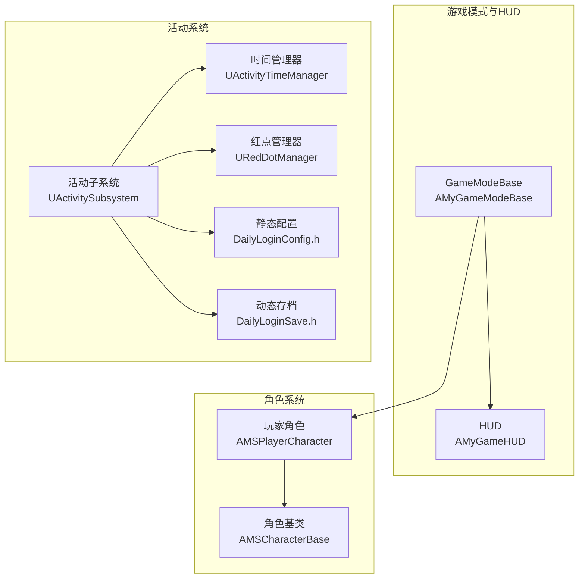
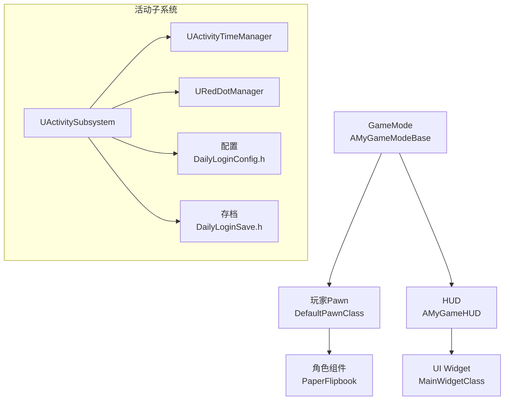
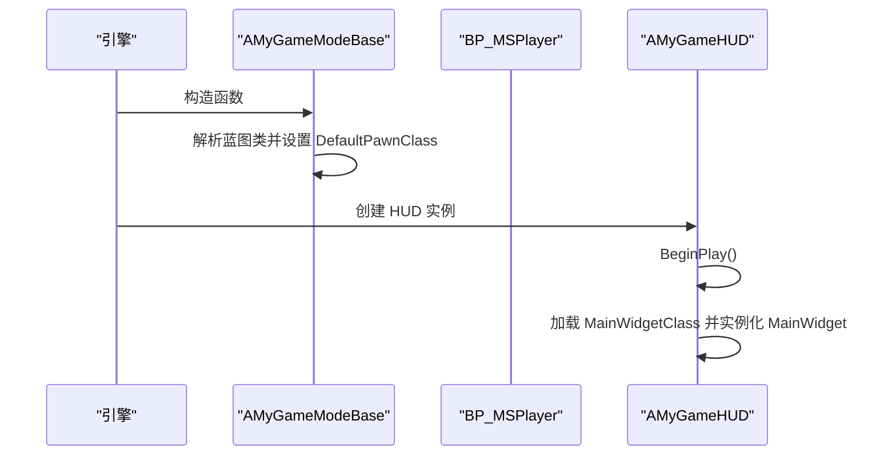
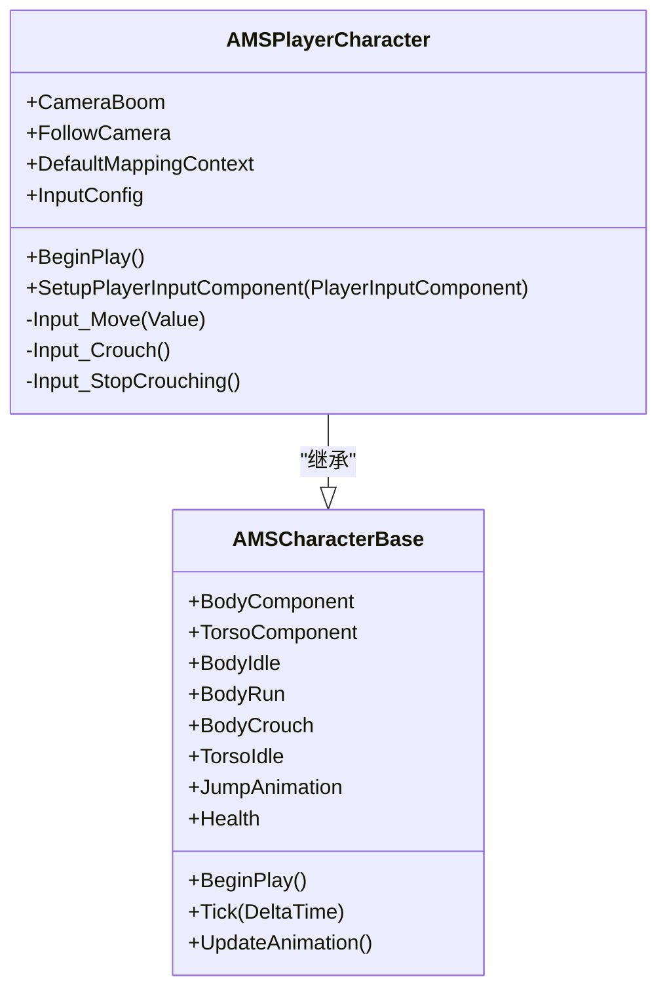
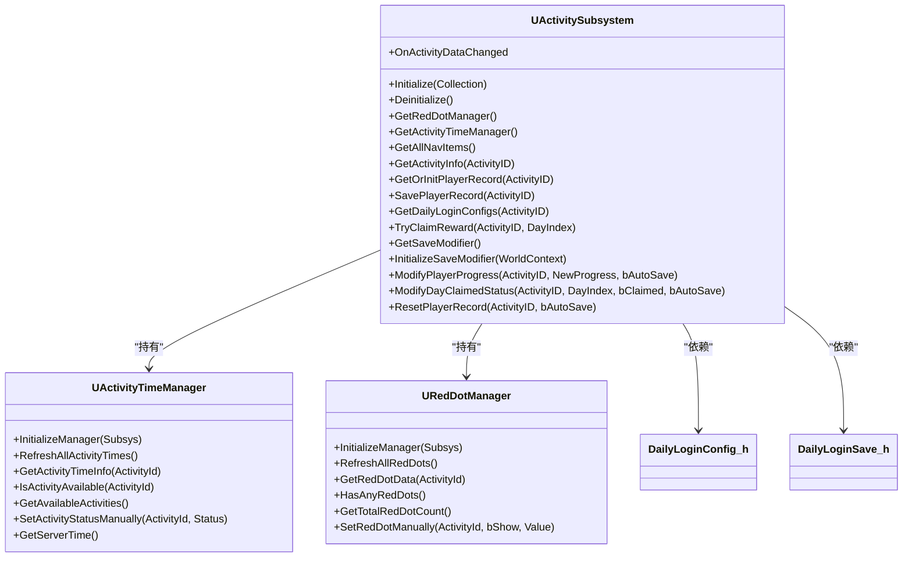
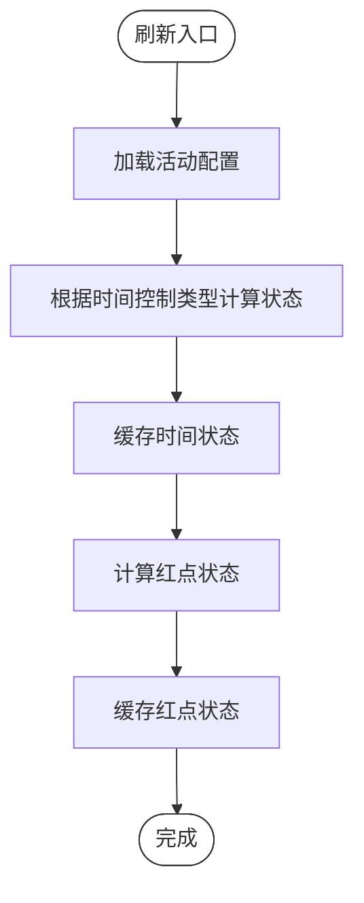
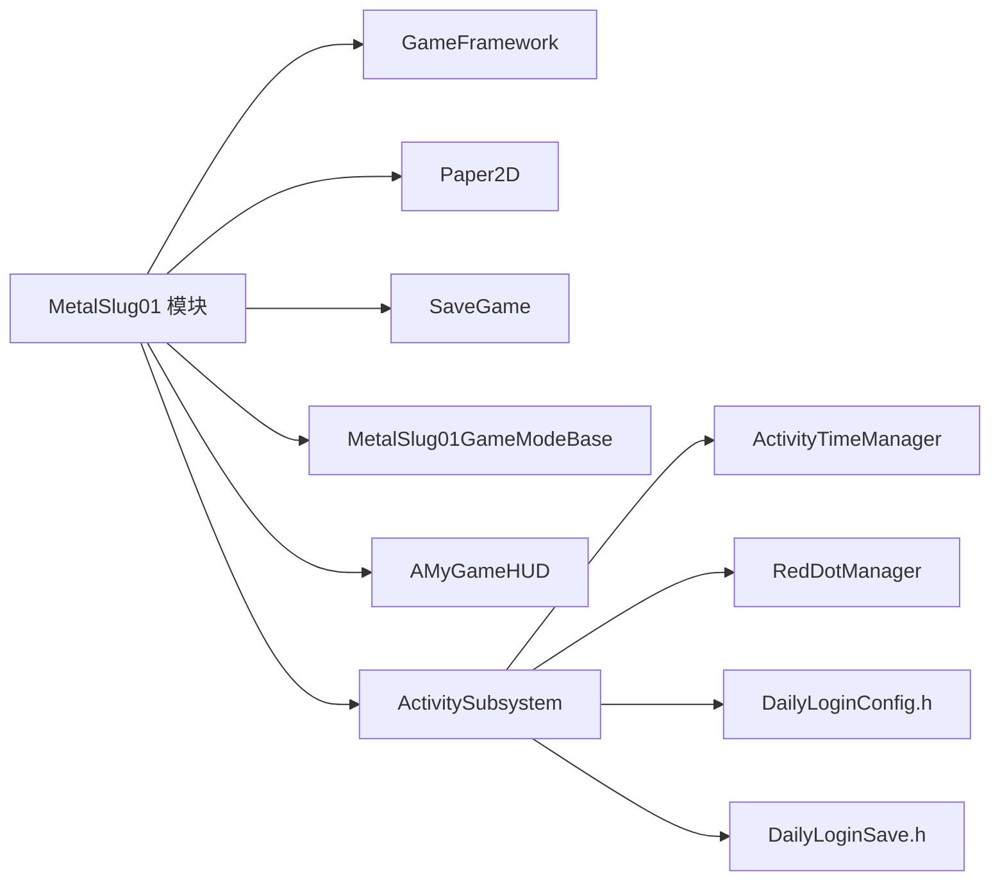

# 整体架构概览

<cite>
**本文引用的文件**
- [MetalSlug01GameModeBase.h](file://MetalSlug01/Source/MetalSlug01/MetalSlug01GameModeBase.h)
- [MetalSlug01GameModeBase.cpp](file://MetalSlug01/Source/MetalSlug01/MetalSlug01GameModeBase.cpp)
- [MyGameHUD.h](file://MetalSlug01/Source/MetalSlug01/Public/UI/MyGameHUD.h)
- [MSCharacterBase.h](file://MetalSlug01/Source/MetalSlug01/Public/Characters/MSCharacterBase.h)
- [MSPlayerCharacter.h](file://MetalSlug01/Source/MetalSlug01/Public/Characters/MSPlayerCharacter.h)
- [ActivitySubsystem.h](file://MetalSlug01/Source/MetalSlug01/Public/UI/Activity/Core/ActivitySubsystem.h)
- [DailyLoginConfig.h](file://MetalSlug01/Source/MetalSlug01/Public/UI/Activity/Data/DailyLoginConfig.h)
- [DailyLoginSave.h](file://MetalSlug01/Source/MetalSlug01/Public/UI/Activity/Data/DailyLoginSave.h)
- [ActivityTimeManager.h](file://MetalSlug01/Source/MetalSlug01/Public/UI/Activity/Managers/ActivityTimeManager.h)
- [RedDotManager.h](file://MetalSlug01/Source/MetalSlug01/Public/UI/Activity/Core/RedDotManager.h)
- [MetalSlug01.h](file://MetalSlug01/Source/MetalSlug01/MetalSlug01.h)
- [MetalSlug01.cpp](file://MetalSlug01/Source/MetalSlug01/MetalSlug01.cpp)
</cite>

## 目录
1. [简介](#简介)
2. [项目结构](#项目结构)
3. [核心组件](#核心组件)
4. [架构总览](#架构总览)
5. [详细组件分析](#详细组件分析)
6. [依赖关系分析](#依赖关系分析)
7. [性能考虑](#性能考虑)
8. [故障排查指南](#故障排查指南)
9. [结论](#结论)
10. [附录](#附录)

## 简介
本文件为 MetalSlug 项目的整体架构概览文档，聚焦于高层架构设计、MVC 模式应用、模块化理念与系统边界定义；重点阐释游戏模式基类（GameModeBase）的设计思路与职责划分；梳理核心组件之间的交互关系与数据流向；总结架构决策的技术考量与权衡；并提供系统上下文图与组件分解图，覆盖性能优化与可扩展性设计等跨领域关注点。同时给出基于仓库现有代码的演进建议与最佳实践指引。

## 项目结构
项目采用以“功能域”为主的模块化组织方式，核心模块包括：
- 游戏模式与HUD：负责关卡与界面层的入口与渲染
- 角色系统：角色基类与玩家角色，封装动画与输入
- 活动系统（Activity）：以子系统为核心，统一管理活动、时间、红点与存档等

图表来源
- [MetalSlug01GameModeBase.h](file://MetalSlug01/Source/MetalSlug01/MetalSlug01GameModeBase.h#L9-L16)
- [MetalSlug01GameModeBase.cpp](file://MetalSlug01/Source/MetalSlug01/MetalSlug01GameModeBase.cpp#L9-L26)
- [MyGameHUD.h](file://MetalSlug01/Source/MetalSlug01/Public/UI/MyGameHUD.h#L7-L22)
- [MSCharacterBase.h](file://MetalSlug01/Source/MetalSlug01/Public/Characters/MSCharacterBase.h#L10-L49)
- [MSPlayerCharacter.h](file://MetalSlug01/Source/MetalSlug01/Public/Characters/MSPlayerCharacter.h#L13-L41)
- [ActivitySubsystem.h](file://MetalSlug01/Source/MetalSlug01/Public/UI/Activity/Core/ActivitySubsystem.h#L29-L175)
- [ActivityTimeManager.h](file://MetalSlug01/Source/MetalSlug01/Public/UI/Activity/Managers/ActivityTimeManager.h#L18-L117)
- [RedDotManager.h](file://MetalSlug01/Source/MetalSlug01/Public/UI/Activity/Core/RedDotManager.h#L16-L100)
- [DailyLoginConfig.h](file://MetalSlug01/Source/MetalSlug01/Public/UI/Activity/Data/DailyLoginConfig.h#L19-L139)
- [DailyLoginSave.h](file://MetalSlug01/Source/MetalSlug01/Public/UI/Activity/Data/DailyLoginSave.h#L27-L161)

章节来源
- [MetalSlug01GameModeBase.h](file://MetalSlug01/Source/MetalSlug01/MetalSlug01GameModeBase.h#L1-L17)
- [MetalSlug01GameModeBase.cpp](file://MetalSlug01/Source/MetalSlug01/MetalSlug01GameModeBase.cpp#L1-L26)
- [MyGameHUD.h](file://MetalSlug01/Source/MetalSlug01/Public/UI/MyGameHUD.h#L1-L23)
- [MSCharacterBase.h](file://MetalSlug01/Source/MetalSlug01/Public/Characters/MSCharacterBase.h#L1-L50)
- [MSPlayerCharacter.h](file://MetalSlug01/Source/MetalSlug01/Public/Characters/MSPlayerCharacter.h#L1-L41)
- [ActivitySubsystem.h](file://MetalSlug01/Source/MetalSlug01/Public/UI/Activity/Core/ActivitySubsystem.h#L1-L178)
- [DailyLoginConfig.h](file://MetalSlug01/Source/MetalSlug01/Public/UI/Activity/Data/DailyLoginConfig.h#L1-L635)
- [DailyLoginSave.h](file://MetalSlug01/Source/MetalSlug01/Public/UI/Activity/Data/DailyLoginSave.h#L1-L373)
- [ActivityTimeManager.h](file://MetalSlug01/Source/MetalSlug01/Public/UI/Activity/Managers/ActivityTimeManager.h#L1-L117)
- [RedDotManager.h](file://MetalSlug01/Source/MetalSlug01/Public/UI/Activity/Core/RedDotManager.h#L1-L100)

## 核心组件
- 游戏模式基类（AMyGameModeBase）
  - 职责：设置默认生成的玩家Pawn类与HUD类，作为关卡启动时的系统入口
  - 关键点：通过蓝图类引用设置 DefaultPawnClass，并指定 HUD 类型
- HUD（AMyGameHUD）
  - 职责：在 BeginPlay 中加载并展示主页面 Widget
  - 关键点：MainWidgetClass 作为可编辑的 UI 入口，MainWidget 为运行时实例
- 角色系统（AMSCharacterBase / AMSPlayerCharacter）
  - 职责：封装角色渲染组件（PaperFlipbook）、动画槽位、基础属性与输入回调
  - 关键点：抽象基类集中管理动画与渲染，派生类补充输入与相机组件
- 活动子系统（UActivitySubsystem）
  - 职责：统一管理活动Track、生命周期、为页面/UI提供访问入口；不直接做业务判断与UI操作
  - 关键点：提供红点与时间管理器访问、活动配置查询、玩家记录读写、动态存档修改器接口
- 时间管理器（UActivityTimeManager）
  - 职责：计算并缓存活动时间状态，支持刷新、可用性检查与手动状态设置
- 红点管理器（URedDotManager）
  - 职责：计算并缓存各活动的红点状态，支持刷新、汇总与手动设置
- 配置与存档（DailyLoginConfig.h / DailyLoginSave.h）
  - 职责：定义静态配置结构（枚举、行结构）与动态运行时数据（玩家记录、导航项、存档类）

章节来源
- [MetalSlug01GameModeBase.cpp](file://MetalSlug01/Source/MetalSlug01/MetalSlug01GameModeBase.cpp#L9-L26)
- [MyGameHUD.h](file://MetalSlug01/Source/MetalSlug01/Public/UI/MyGameHUD.h#L7-L22)
- [MSCharacterBase.h](file://MetalSlug01/Source/MetalSlug01/Public/Characters/MSCharacterBase.h#L10-L49)
- [MSPlayerCharacter.h](file://MetalSlug01/Source/MetalSlug01/Public/Characters/MSPlayerCharacter.h#L13-L41)
- [ActivitySubsystem.h](file://MetalSlug01/Source/MetalSlug01/Public/UI/Activity/Core/ActivitySubsystem.h#L17-L84)
- [ActivityTimeManager.h](file://MetalSlug01/Source/MetalSlug01/Public/UI/Activity/Managers/ActivityTimeManager.h#L18-L117)
- [RedDotManager.h](file://MetalSlug01/Source/MetalSlug01/Public/UI/Activity/Core/RedDotManager.h#L16-L100)
- [DailyLoginConfig.h](file://MetalSlug01/Source/MetalSlug01/Public/UI/Activity/Data/DailyLoginConfig.h#L19-L139)
- [DailyLoginSave.h](file://MetalSlug01/Source/MetalSlug01/Public/UI/Activity/Data/DailyLoginSave.h#L27-L161)

## 架构总览
MetalSlug 采用“游戏模式（GameMode）+ 角色（Character）+ HUD（HUD）+ 活动子系统（Subsystem）”的分层架构，遵循 MVC 思想：
- Model：活动配置与存档（DailyLoginConfig.h / DailyLoginSave.h），以及角色属性与动画槽位
- View：HUD 与 UI Widget（AMyGameHUD + 各页面Widget）
- Controller：GameMode 负责系统入口与Pawn/HUD绑定；角色输入控制器负责输入与行为；活动子系统协调管理器与数据

图表来源
- [MetalSlug01GameModeBase.cpp](file://MetalSlug01/Source/MetalSlug01/MetalSlug01GameModeBase.cpp#L9-L26)
- [MyGameHUD.h](file://MetalSlug01/Source/MetalSlug01/Public/UI/MyGameHUD.h#L7-L22)
- [MSCharacterBase.h](file://MetalSlug01/Source/MetalSlug01/Public/Characters/MSCharacterBase.h#L23-L43)
- [ActivitySubsystem.h](file://MetalSlug01/Source/MetalSlug01/Public/UI/Activity/Core/ActivitySubsystem.h#L29-L175)
- [ActivityTimeManager.h](file://MetalSlug01/Source/MetalSlug01/Public/UI/Activity/Managers/ActivityTimeManager.h#L18-L117)
- [RedDotManager.h](file://MetalSlug01/Source/MetalSlug01/Public/UI/Activity/Core/RedDotManager.h#L16-L100)
- [DailyLoginConfig.h](file://MetalSlug01/Source/MetalSlug01/Public/UI/Activity/Data/DailyLoginConfig.h#L19-L139)
- [DailyLoginSave.h](file://MetalSlug01/Source/MetalSlug01/Public/UI/Activity/Data/DailyLoginSave.h#L27-L161)

## 详细组件分析

### 游戏模式基类（AMyGameModeBase）
- 设计思路
  - 通过蓝图类引用设置 DefaultPawnClass，确保运行时使用正确的玩家Pawn蓝图
  - 指定 HUD 类型，保证游戏启动后立即加载 UI
- 职责划分
  - GameMode：系统入口与生命周期钩子
  - Pawn：玩家实体
  - HUD：UI 展示
- 数据流
  - GameMode 在构造阶段解析蓝图类并赋给 DefaultPawnClass
  - HUD 在 BeginPlay 中加载 MainWidgetClass 并实例化 MainWidget

图表来源
- [MetalSlug01GameModeBase.cpp](file://MetalSlug01/Source/MetalSlug01/MetalSlug01GameModeBase.cpp#L9-L26)
- [MyGameHUD.h](file://MetalSlug01/Source/MetalSlug01/Public/UI/MyGameHUD.h#L12-L22)

章节来源
- [MetalSlug01GameModeBase.h](file://MetalSlug01/Source/MetalSlug01/MetalSlug01GameModeBase.h#L9-L16)
- [MetalSlug01GameModeBase.cpp](file://MetalSlug01/Source/MetalSlug01/MetalSlug01GameModeBase.cpp#L9-L26)
- [MyGameHUD.h](file://MetalSlug01/Source/MetalSlug01/Public/UI/MyGameHUD.h#L7-L22)

### 角色系统（AMSCharacterBase / AMSPlayerCharacter）
- 设计思路
  - 抽象基类集中管理渲染组件与动画槽位，派生类补充输入与相机
  - 通过蓝图与配置驱动动画切换，降低硬编码耦合
- 职责划分
  - 基类：动画更新、渲染组件、基础属性
  - 派生类：输入组件、相机组件、输入回调
- 数据流
  - Tick 中触发 UpdateAnimation，根据输入与状态切换动画
  - 输入回调在 SetupPlayerInputComponent 中注册

图表来源
- [MSCharacterBase.h](file://MetalSlug01/Source/MetalSlug01/Public/Characters/MSCharacterBase.h#L10-L49)
- [MSPlayerCharacter.h](file://MetalSlug01/Source/MetalSlug01/Public/Characters/MSPlayerCharacter.h#L13-L41)

章节来源
- [MSCharacterBase.h](file://MetalSlug01/Source/MetalSlug01/Public/Characters/MSCharacterBase.h#L10-L49)
- [MSPlayerCharacter.h](file://MetalSlug01/Source/MetalSlug01/Public/Characters/MSPlayerCharacter.h#L13-L41)

### 活动子系统（UActivitySubsystem）
- 设计思路
  - 子系统作为“控制器”，统一管理活动Track、生命周期与数据访问
  - 将业务判断与UI解耦，通过管理器（时间/红点）与配置/存档协作
- 职责划分
  - 生命周期：Initialize/Deinitialize
  - 管理器访问：红点、时间、导航项、活动信息
  - 数据访问：玩家记录、奖励配置、物品详情、宝箱配置
  - 存档修改器：提供运行时修改玩家进度与领取状态的能力
- 数据流
  - 通过配置表（静态）与存档（动态）协同，管理活动状态与玩家进度

图表来源
- [ActivitySubsystem.h](file://MetalSlug01/Source/MetalSlug01/Public/UI/Activity/Core/ActivitySubsystem.h#L29-L175)
- [ActivityTimeManager.h](file://MetalSlug01/Source/MetalSlug01/Public/UI/Activity/Managers/ActivityTimeManager.h#L18-L117)
- [RedDotManager.h](file://MetalSlug01/Source/MetalSlug01/Public/UI/Activity/Core/RedDotManager.h#L16-L100)
- [DailyLoginConfig.h](file://MetalSlug01/Source/MetalSlug01/Public/UI/Activity/Data/DailyLoginConfig.h#L19-L139)
- [DailyLoginSave.h](file://MetalSlug01/Source/MetalSlug01/Public/UI/Activity/Data/DailyLoginSave.h#L27-L161)

章节来源
- [ActivitySubsystem.h](file://MetalSlug01/Source/MetalSlug01/Public/UI/Activity/Core/ActivitySubsystem.h#L17-L175)
- [ActivityTimeManager.h](file://MetalSlug01/Source/MetalSlug01/Public/UI/Activity/Managers/ActivityTimeManager.h#L18-L117)
- [RedDotManager.h](file://MetalSlug01/Source/MetalSlug01/Public/UI/Activity/Core/RedDotManager.h#L16-L100)
- [DailyLoginConfig.h](file://MetalSlug01/Source/MetalSlug01/Public/UI/Activity/Data/DailyLoginConfig.h#L19-L139)
- [DailyLoginSave.h](file://MetalSlug01/Source/MetalSlug01/Public/UI/Activity/Data/DailyLoginSave.h#L27-L161)

### 时间与红点管理流程
- 时间管理器
  - 根据配置的时间控制类型（固定周期、循环、永久、手动）计算活动状态
  - 支持定时刷新与手动设置，兼顾性能与运维灵活性
- 红点管理器
  - 通过条件函数或默认逻辑计算红点状态，支持汇总与手动设置

图表来源
- [ActivityTimeManager.h](file://MetalSlug01/Source/MetalSlug01/Public/UI/Activity/Managers/ActivityTimeManager.h#L94-L117)
- [RedDotManager.h](file://MetalSlug01/Source/MetalSlug01/Public/UI/Activity/Core/RedDotManager.h#L86-L100)

章节来源
- [ActivityTimeManager.h](file://MetalSlug01/Source/MetalSlug01/Public/UI/Activity/Managers/ActivityTimeManager.h#L75-L117)
- [RedDotManager.h](file://MetalSlug01/Source/MetalSlug01/Public/UI/Activity/Core/RedDotManager.h#L74-L100)

## 依赖关系分析
- 模块内聚与解耦
  - GameMode 仅负责系统入口与Pawn/HUD绑定，不涉及业务逻辑
  - 角色系统通过蓝图与配置驱动，减少硬编码
  - 活动子系统通过管理器与配置/存档协作，职责清晰
- 外部依赖
  - 引擎模块：GameFramework、Paper2D（Flipbook）、SaveGame
  - 项目模块：MetalSlug01 主模块

图表来源
- [MetalSlug01.cpp](file://MetalSlug01/Source/MetalSlug01/MetalSlug01.cpp#L10-L11)
- [ActivitySubsystem.h](file://MetalSlug01/Source/MetalSlug01/Public/UI/Activity/Core/ActivitySubsystem.h#L5-L12)

章节来源
- [MetalSlug01.cpp](file://MetalSlug01/Source/MetalSlug01/MetalSlug01.cpp#L6-L11)
- [ActivitySubsystem.h](file://MetalSlug01/Source/MetalSlug01/Public/UI/Activity/Core/ActivitySubsystem.h#L5-L12)

## 性能考虑
- 动画与渲染
  - 使用 PaperFlipbook 组件集中管理动画槽位，避免每帧复杂分支判断
  - 在 Tick 中按需更新动画，避免频繁对象创建
- UI 与存档
  - HUD 仅在 BeginPlay 加载一次主 Widget，减少运行时开销
  - 活动子系统通过缓存（时间状态、红点状态）降低重复计算
- 时间与红点刷新
  - 时间管理器与红点管理器支持定时刷新与手动刷新，平衡实时性与性能
- 输入与相机
  - 输入映射上下文与相机组件分离，便于按需启用与优化

## 故障排查指南
- GameMode 无法正确加载玩家Pawn
  - 检查蓝图类路径是否正确且以_C结尾
  - 确认 DefaultPawnClass 是否在构造函数中被赋值
- HUD 未显示主页面
  - 检查 MainWidgetClass 是否在编辑器中设置
  - 确认 BeginPlay 中是否成功实例化 MainWidget
- 活动状态异常
  - 检查时间控制类型与配置时间范围
  - 使用时间管理器的手动设置接口临时修复
- 红点不显示
  - 检查红点条件函数名称与返回值
  - 使用红点管理器的手动设置接口验证

章节来源
- [MetalSlug01GameModeBase.cpp](file://MetalSlug01/Source/MetalSlug01/MetalSlug01GameModeBase.cpp#L9-L26)
- [MyGameHUD.h](file://MetalSlug01/Source/MetalSlug01/Public/UI/MyGameHUD.h#L12-L22)
- [ActivityTimeManager.h](file://MetalSlug01/Source/MetalSlug01/Public/UI/Activity/Managers/ActivityTimeManager.h#L61-L73)
- [RedDotManager.h](file://MetalSlug01/Source/MetalSlug01/Public/UI/Activity/Core/RedDotManager.h#L58-L64)

## 结论
MetalSlug 项目采用清晰的分层与模块化架构，GameMode 作为系统入口，角色系统通过蓝图与配置驱动，活动子系统以子系统为核心协调管理器与数据，形成“模型-视图-控制器”的 MVC 分离。该架构在可维护性、可扩展性与性能之间取得良好平衡，适合持续迭代与功能扩展。

## 附录
- 架构演进建议
  - 引入事件总线或委托机制，进一步解耦模块间通信
  - 将活动配置与存档拆分为更细粒度的数据表，提升可维护性
  - 增加单元测试与集成测试，保障活动逻辑稳定性
- 最佳实践
  - 保持子系统不直接操作UI，通过管理器与配置协作
  - 使用蓝图与配置驱动角色动画，减少C++硬编码
  - 合理使用缓存与定时刷新，平衡实时性与性能