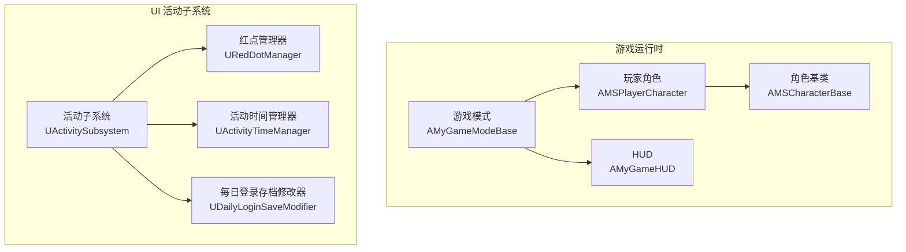
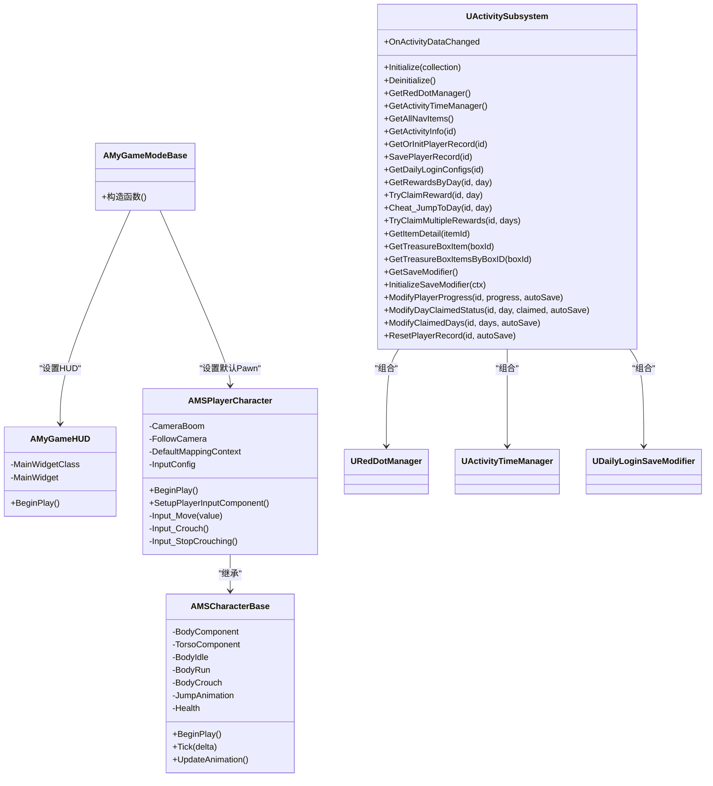
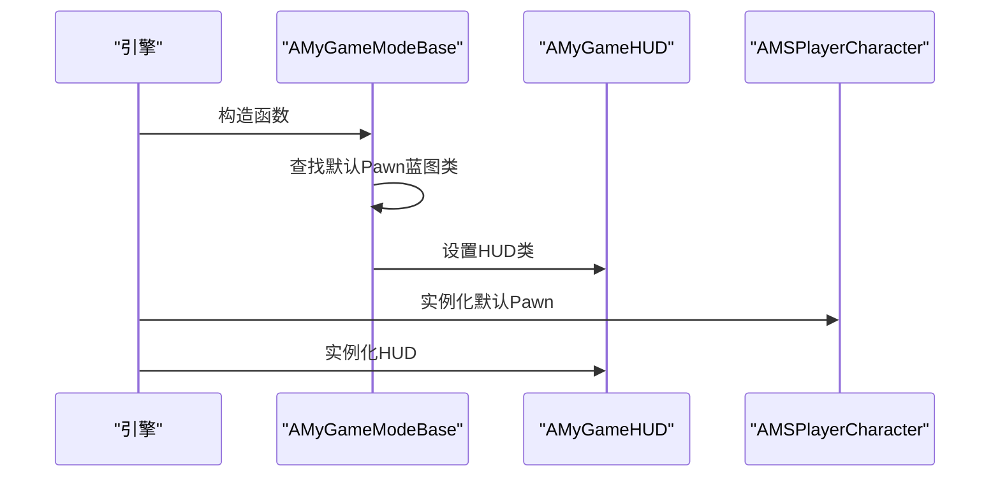
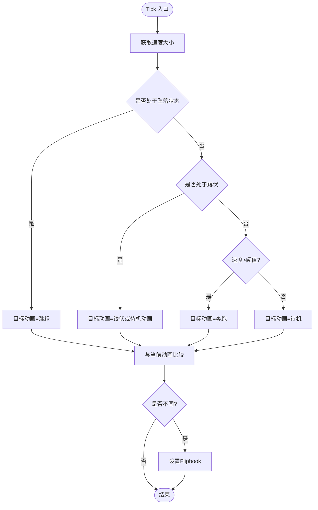
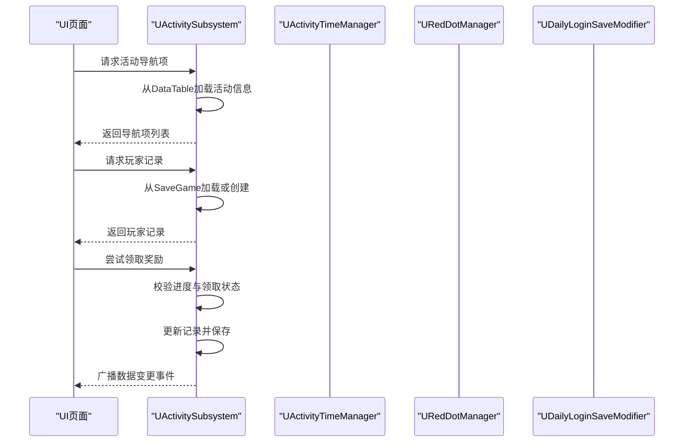
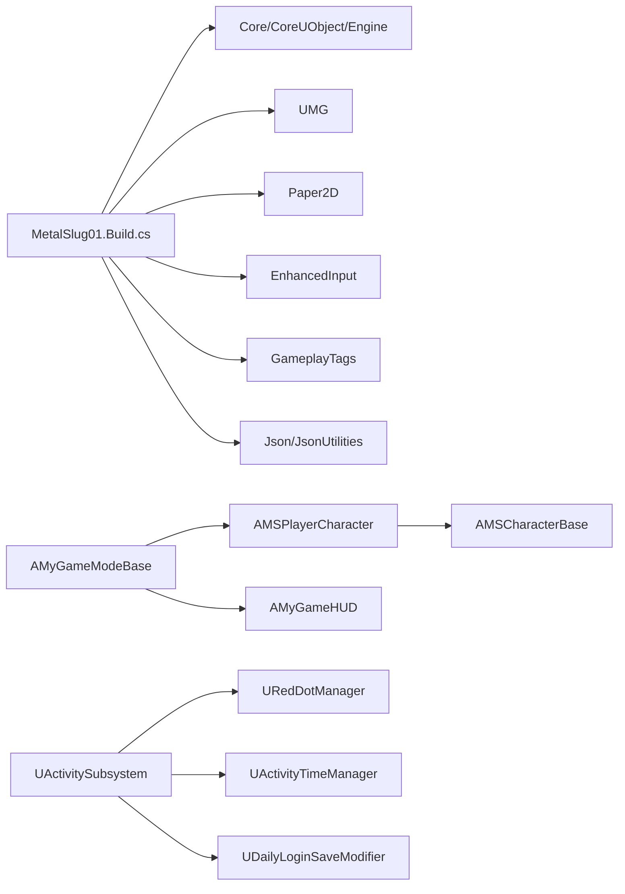

# 核心架构设计

<cite>
**本文引用的文件**
- [MetalSlug01GameModeBase.h](file://MetalSlug01/Source/MetalSlug01/MetalSlug01GameModeBase.h)
- [MetalSlug01GameModeBase.cpp](file://MetalSlug01/Source/MetalSlug01/MetalSlug01GameModeBase.cpp)
- [MSCharacterBase.h](file://MetalSlug01/Source/MetalSlug01/Public/Characters/MSCharacterBase.h)
- [MSCharacterBase.cpp](file://MetalSlug01/Source/MetalSlug01/Private/Characters/MSCharacterBase.cpp)
- [MSPlayerCharacter.h](file://MetalSlug01/Source/MetalSlug01/Public/Characters/MSPlayerCharacter.h)
- [MSPlayerCharacter.cpp](file://MetalSlug01/Source/MetalSlug01/Private/Characters/MSPlayerCharacter.cpp)
- [MyGameHUD.h](file://MetalSlug01/Source/MetalSlug01/Public/UI/MyGameHUD.h)
- [MyGameHUD.cpp](file://MetalSlug01/Source/MetalSlug01/Private/UI/MyGameHUD.cpp)
- [ActivitySubsystem.h](file://MetalSlug01/Source/MetalSlug01/Public/UI/Activity/Core/ActivitySubsystem.h)
- [ActivitySubsystem.cpp](file://MetalSlug01/Source/MetalSlug01/Private/UI/Activity/Core/ActivitySubsystem.cpp)
- [MSInputConfig.h](file://MetalSlug01/Source/MetalSlug01/Public/Data/MSInputConfig.h)
- [MetalSlug01.Build.cs](file://MetalSlug01/Source/MetalSlug01/MetalSlug01.Build.cs)
- [DefaultGame.ini](file://MetalSlug01/Config/DefaultGame.ini)
</cite>

## 目录
1. [简介](#简介)
2. [项目结构](#项目结构)
3. [核心组件](#核心组件)
4. [架构总览](#架构总览)
5. [详细组件分析](#详细组件分析)
6. [依赖关系分析](#依赖关系分析)
7. [性能考虑](#性能考虑)
8. [故障排查指南](#故障排查指南)
9. [结论](#结论)
10. [附录](#附录)

## 简介
本文件为 MetalSlug 项目的“核心架构设计”文档，聚焦于整体架构概览、MVC 模式与模块化设计理念、Subsystems 模式的应用、游戏模式基类设计、组件交互与数据流、技术决策与权衡、系统边界与高层设计图、跨领域关注点（性能、可扩展性）、架构演进与未来规划，以及最佳实践与参考路径。

## 项目结构
项目采用基于功能域的分层组织方式：
- Source/MetalSlug01/Public 与 Private 下按功能域划分：Characters、UI、Data、Tools
- GameMode 与 HUD 位于模块根目录，作为系统入口与顶层视图容器
- UI/Activity/Core 为 Subsystems 层，承载业务子系统与管理器
- Data 与 Tools 提供配置与工具能力

图表来源
- [MetalSlug01GameModeBase.cpp](file://MetalSlug01/Source/MetalSlug01/MetalSlug01GameModeBase.cpp#L9-L26)
- [MyGameHUD.cpp](file://MetalSlug01/Source/MetalSlug01/Private/UI/MyGameHUD.cpp#L4-L18)
- [MSPlayerCharacter.cpp](file://MetalSlug01/Source/MetalSlug01/Private/Characters/MSPlayerCharacter.cpp#L10-L25)
- [ActivitySubsystem.cpp](file://MetalSlug01/Source/MetalSlug01/Private/UI/Activity/Core/ActivitySubsystem.cpp#L7-L39)

章节来源
- [MetalSlug01GameModeBase.h](file://MetalSlug01/Source/MetalSlug01/MetalSlug01GameModeBase.h#L9-L16)
- [MetalSlug01GameModeBase.cpp](file://MetalSlug01/Source/MetalSlug01/MetalSlug01GameModeBase.cpp#L9-L26)
- [MyGameHUD.h](file://MetalSlug01/Source/MetalSlug01/Public/UI/MyGameHUD.h#L7-L22)
- [MyGameHUD.cpp](file://MetalSlug01/Source/MetalSlug01/Private/UI/MyGameHUD.cpp#L4-L18)
- [MSPlayerCharacter.h](file://MetalSlug01/Source/MetalSlug01/Public/Characters/MSPlayerCharacter.h#L13-L41)
- [MSPlayerCharacter.cpp](file://MetalSlug01/Source/MetalSlug01/Private/Characters/MSPlayerCharacter.cpp#L10-L25)
- [ActivitySubsystem.h](file://MetalSlug01/Source/MetalSlug01/Public/UI/Activity/Core/ActivitySubsystem.h#L29-L32)
- [ActivitySubsystem.cpp](file://MetalSlug01/Source/MetalSlug01/Private/UI/Activity/Core/ActivitySubsystem.cpp#L7-L39)

## 核心组件
- 游戏模式基类：负责默认 Pawn 与 HUD 的装配，作为关卡启动的入口
- 角色体系：抽象角色基类提供动画与渲染骨架；具体玩家角色扩展输入与摄像机
- HUD：负责主界面 Widget 的加载与展示
- 活动子系统：基于 GameInstance Subsystem 的统一活动管理入口，聚合红点、时间、存档修改器等管理器

章节来源
- [MetalSlug01GameModeBase.cpp](file://MetalSlug01/Source/MetalSlug01/MetalSlug01GameModeBase.cpp#L9-L26)
- [MSCharacterBase.h](file://MetalSlug01/Source/MetalSlug01/Public/Characters/MSCharacterBase.h#L10-L50)
- [MSCharacterBase.cpp](file://MetalSlug01/Source/MetalSlug01/Private/Characters/MSCharacterBase.cpp#L7-L64)
- [MSPlayerCharacter.h](file://MetalSlug01/Source/MetalSlug01/Public/Characters/MSPlayerCharacter.h#L13-L41)
- [MSPlayerCharacter.cpp](file://MetalSlug01/Source/MetalSlug01/Private/Characters/MSPlayerCharacter.cpp#L29-L62)
- [MyGameHUD.h](file://MetalSlug01/Source/MetalSlug01/Public/UI/MyGameHUD.h#L7-L22)
- [MyGameHUD.cpp](file://MetalSlug01/Source/MetalSlug01/Private/UI/MyGameHUD.cpp#L4-L18)
- [ActivitySubsystem.h](file://MetalSlug01/Source/MetalSlug01/Public/UI/Activity/Core/ActivitySubsystem.h#L29-L32)
- [ActivitySubsystem.cpp](file://MetalSlug01/Source/MetalSlug01/Private/UI/Activity/Core/ActivitySubsystem.cpp#L7-L39)

## 架构总览
MetalSlug 采用“游戏模式驱动 + 角色体系 + UI 子系统”的分层架构：
- MVC 视角
  - Model：角色属性、动画资源、活动数据（存档/配置表）
  - View：Paper2D Flipbook 渲染、UMG Widget
  - Controller：玩家输入映射、角色移动与动作
- 模块化与 Subsystems
  - UActivitySubsystem 作为活动域的统一入口，隔离业务逻辑与 UI，遵循“子系统不做业务判断、不直接操作 UI”的规则
- 数据流
  - 输入 → 控制器 → 角色移动/动画 → 渲染
  - 活动数据 → 子系统 → 管理器 → UI 页面
- 系统边界
  - 游戏模式与 HUD：系统入口与顶层视图
  - 角色体系：运动、动画、渲染
  - 活动子系统：活动数据、存档、红点、时间管理

图表来源
- [MetalSlug01GameModeBase.h](file://MetalSlug01/Source/MetalSlug01/MetalSlug01GameModeBase.h#L9-L16)
- [MyGameHUD.h](file://MetalSlug01/Source/MetalSlug01/Public/UI/MyGameHUD.h#L7-L22)
- [MSCharacterBase.h](file://MetalSlug01/Source/MetalSlug01/Public/Characters/MSCharacterBase.h#L10-L50)
- [MSPlayerCharacter.h](file://MetalSlug01/Source/MetalSlug01/Public/Characters/MSPlayerCharacter.h#L13-L41)
- [ActivitySubsystem.h](file://MetalSlug01/Source/MetalSlug01/Public/UI/Activity/Core/ActivitySubsystem.h#L29-L178)

## 详细组件分析

### 游戏模式基类（AMyGameModeBase）
- 职责：设置默认 Pawn 类与 HUD 类，作为关卡启动的入口
- 关键点：通过蓝图类查找器绑定默认玩家 Pawn；设置 HUD 类型
- 交互：与玩家角色、HUD 协作，形成运行时对象树

图表来源
- [MetalSlug01GameModeBase.cpp](file://MetalSlug01/Source/MetalSlug01/MetalSlug01GameModeBase.cpp#L9-L26)

章节来源
- [MetalSlug01GameModeBase.h](file://MetalSlug01/Source/MetalSlug01/MetalSlug01GameModeBase.h#L9-L16)
- [MetalSlug01GameModeBase.cpp](file://MetalSlug01/Source/MetalSlug01/MetalSlug01GameModeBase.cpp#L9-L26)

### 角色基类与玩家角色（AMSCharacterBase / AMSPlayerCharacter）
- 角色基类
  - 提供 Paper2D Flipbook 渲染骨架（身体/躯干组件）
  - 配置 CharacterMovement 的平面约束、蹲伏参数
  - 在 BeginPlay 强制设置初始动画，避免首帧黑屏
  - Tick 中驱动 UpdateAnimation，根据速度与状态切换动画
- 玩家角色
  - 扩展输入绑定（增强输入系统、动作映射）
  - 添加摄像机臂与正交投影相机
  - 输入回调中处理移动方向翻转与移动输入

图表来源
- [MSCharacterBase.cpp](file://MetalSlug01/Source/MetalSlug01/Private/Characters/MSCharacterBase.cpp#L47-L64)

章节来源
- [MSCharacterBase.h](file://MetalSlug01/Source/MetalSlug01/Public/Characters/MSCharacterBase.h#L10-L50)
- [MSCharacterBase.cpp](file://MetalSlug01/Source/MetalSlug01/Private/Characters/MSCharacterBase.cpp#L7-L64)
- [MSPlayerCharacter.h](file://MetalSlug01/Source/MetalSlug01/Public/Characters/MSPlayerCharacter.h#L13-L41)
- [MSPlayerCharacter.cpp](file://MetalSlug01/Source/MetalSlug01/Private/Characters/MSPlayerCharacter.cpp#L10-L62)

### HUD（AMyGameHUD）
- 职责：在 BeginPlay 加载并添加主 Widget 到视口
- 关键点：MainWidgetClass 由配置注入，支持运行时切换

章节来源
- [MyGameHUD.h](file://MetalSlug01/Source/MetalSlug01/Public/UI/MyGameHUD.h#L7-L22)
- [MyGameHUD.cpp](file://MetalSlug01/Source/MetalSlug01/Private/UI/MyGameHUD.cpp#L4-L18)

### 活动子系统（UActivitySubsystem）与管理器
- 设计理念
  - Subsystem 作为活动域的统一入口，职责清晰：创建与生命周期管理、对外暴露访问接口、事件广播
  - 遵循“子系统不做业务判断、不直接操作 UI”的原则，业务逻辑下沉至管理器
- 管理器
  - 红点管理器：用于活动页签的红点提示
  - 活动时间管理器：活动时间窗口与状态管理
  - 存档修改器：动态修改存档，支持作弊与调试
- 数据流
  - UI 通过子系统接口获取活动信息、配置、存档记录
  - 子系统内部加载 DataTable、维护缓存、持久化 SaveGame，并广播数据变更事件

图表来源
- [ActivitySubsystem.h](file://MetalSlug01/Source/MetalSlug01/Public/UI/Activity/Core/ActivitySubsystem.h#L41-L84)
- [ActivitySubsystem.cpp](file://MetalSlug01/Source/MetalSlug01/Private/UI/Activity/Core/ActivitySubsystem.cpp#L51-L161)
- [ActivitySubsystem.cpp](file://MetalSlug01/Source/MetalSlug01/Private/UI/Activity/Core/ActivitySubsystem.cpp#L247-L298)

章节来源
- [ActivitySubsystem.h](file://MetalSlug01/Source/MetalSlug01/Public/UI/Activity/Core/ActivitySubsystem.h#L17-L28)
- [ActivitySubsystem.h](file://MetalSlug01/Source/MetalSlug01/Public/UI/Activity/Core/ActivitySubsystem.h#L29-L32)
- [ActivitySubsystem.h](file://MetalSlug01/Source/MetalSlug01/Public/UI/Activity/Core/ActivitySubsystem.h#L41-L84)
- [ActivitySubsystem.cpp](file://MetalSlug01/Source/MetalSlug01/Private/UI/Activity/Core/ActivitySubsystem.cpp#L7-L39)
- [ActivitySubsystem.cpp](file://MetalSlug01/Source/MetalSlug01/Private/UI/Activity/Core/ActivitySubsystem.cpp#L101-L161)
- [ActivitySubsystem.cpp](file://MetalSlug01/Source/MetalSlug01/Private/UI/Activity/Core/ActivitySubsystem.cpp#L247-L298)

### 输入配置（UMSInputConfig）
- 设计：将所有 InputAction 整合到一个 DataAsset，便于策划在编辑器中直接配置，无需改动 C++ 代码
- 作用：为玩家角色的增强输入系统提供动作映射

章节来源
- [MSInputConfig.h](file://MetalSlug01/Source/MetalSlug01/Public/Data/MSInputConfig.h#L8-L29)

## 依赖关系分析
- 模块依赖
  - MetalSlug01.Build.cs 显式依赖：Core、CoreUObject、Engine、InputCore、UMG、Paper2D、EnhancedInput、GameplayTags、Json、JsonUtilities
- 组件耦合
  - 游戏模式与角色/HUD：低耦合，通过类指针装配
  - 角色与输入：通过增强输入系统解耦
  - 活动子系统与管理器：组合关系，弱化 UI 依赖

图表来源
- [MetalSlug01.Build.cs](file://MetalSlug01/Source/MetalSlug01/MetalSlug01.Build.cs#L11-L13)
- [MetalSlug01GameModeBase.cpp](file://MetalSlug01/Source/MetalSlug01/MetalSlug01GameModeBase.cpp#L9-L26)
- [ActivitySubsystem.cpp](file://MetalSlug01/Source/MetalSlug01/Private/UI/Activity/Core/ActivitySubsystem.cpp#L7-L39)

章节来源
- [MetalSlug01.Build.cs](file://MetalSlug01/Source/MetalSlug01/MetalSlug01.Build.cs#L11-L13)

## 性能考虑
- 渲染与动画
  - 使用 Paper2D Flipbook，按速度与状态切换动画，减少不必要的资源切换
  - 首帧强制设置动画，避免黑屏与延迟
- 输入与移动
  - 增强输入系统减少重复绑定与回调开销
  - 角色移动使用平面约束与合理的蹲伏速度，降低物理计算复杂度
- 存档与数据
  - 活动子系统对 SaveGame 进行缓存，批量保存与懒加载，减少 IO 压力
  - DataTable 按需加载与缓存，避免频繁静态加载
- UI
  - HUD 在 BeginPlay 一次性加载主 Widget，避免运行时频繁创建销毁

章节来源
- [MSCharacterBase.cpp](file://MetalSlug01/Source/MetalSlug01/Private/Characters/MSCharacterBase.cpp#L31-L45)
- [MSPlayerCharacter.cpp](file://MetalSlug01/Source/MetalSlug01/Private/Characters/MSPlayerCharacter.cpp#L29-L43)
- [ActivitySubsystem.cpp](file://MetalSlug01/Source/MetalSlug01/Private/UI/Activity/Core/ActivitySubsystem.cpp#L101-L161)

## 故障排查指南
- 默认 Pawn 未生效
  - 检查蓝图路径与类后缀是否正确
  - 确认蓝图类查找器返回有效类
- HUD 未显示主 Widget
  - 检查 MainWidgetClass 是否在关卡中正确赋值
  - 确认 BeginPlay 中创建与添加到视口流程
- 动画不切换或黑屏
  - 确保 BeginPlay 中设置初始 Flipbook
  - 检查速度阈值与状态判断逻辑
- 活动存档异常
  - 检查 SaveGame Slot 名称与路径
  - 确认活动 ID 与记录键一致
  - 关注日志输出定位加载/保存失败原因

章节来源
- [MetalSlug01GameModeBase.cpp](file://MetalSlug01/Source/MetalSlug01/MetalSlug01GameModeBase.cpp#L14-L19)
- [MyGameHUD.cpp](file://MetalSlug01/Source/MetalSlug01/Private/UI/MyGameHUD.cpp#L13-L17)
- [MSCharacterBase.cpp](file://MetalSlug01/Source/MetalSlug01/Private/Characters/MSCharacterBase.cpp#L31-L39)
- [ActivitySubsystem.cpp](file://MetalSlug01/Source/MetalSlug01/Private/UI/Activity/Core/ActivitySubsystem.cpp#L101-L161)

## 结论
MetalSlug 采用清晰的分层与模块化设计：游戏模式驱动运行时对象树，角色体系提供稳定的运动与动画骨架，活动子系统以 Subsystems 模式统一管理活动域的数据与行为。该架构在可维护性、可扩展性与跨领域关注点（性能、存档、UI）上取得良好平衡。建议后续在 UI 与活动域进一步细化领域模型与事件总线，提升解耦与测试性。

## 附录
- 最佳实践
  - 输入配置集中化：通过 DataAsset 管理动作映射，便于策划与美术协作
  - 子系统职责单一：业务下沉到管理器，子系统仅负责装配与协调
  - 数据持久化缓存：SaveGame 与 DataTable 双缓存策略，减少 IO 与加载压力
  - 日志可观测：在关键路径输出日志，便于问题定位
- 参考路径
  - 游戏模式装配与 HUD 设置：[MetalSlug01GameModeBase.cpp](file://MetalSlug01/Source/MetalSlug01/MetalSlug01GameModeBase.cpp#L9-L26)
  - 角色动画切换逻辑：[MSCharacterBase.cpp](file://MetalSlug01/Source/MetalSlug01/Private/Characters/MSCharacterBase.cpp#L47-L64)
  - 玩家输入绑定与摄像机：[MSPlayerCharacter.cpp](file://MetalSlug01/Source/MetalSlug01/Private/Characters/MSPlayerCharacter.cpp#L29-L43)
  - 活动子系统接口与事件广播：[ActivitySubsystem.h](file://MetalSlug01/Source/MetalSlug01/Public/UI/Activity/Core/ActivitySubsystem.h#L41-L153)
  - 活动数据加载与存档：[ActivitySubsystem.cpp](file://MetalSlug01/Source/MetalSlug01/Private/UI/Activity/Core/ActivitySubsystem.cpp#L101-L161)
  - 输入配置 DataAsset：[MSInputConfig.h](file://MetalSlug01/Source/MetalSlug01/Public/Data/MSInputConfig.h#L8-L29)
  - 项目模块依赖：[MetalSlug01.Build.cs](file://MetalSlug01/Source/MetalSlug01/MetalSlug01.Build.cs#L11-L13)
  - 项目通用设置：[DefaultGame.ini](file://MetalSlug01/Config/DefaultGame.ini#L1-L6)