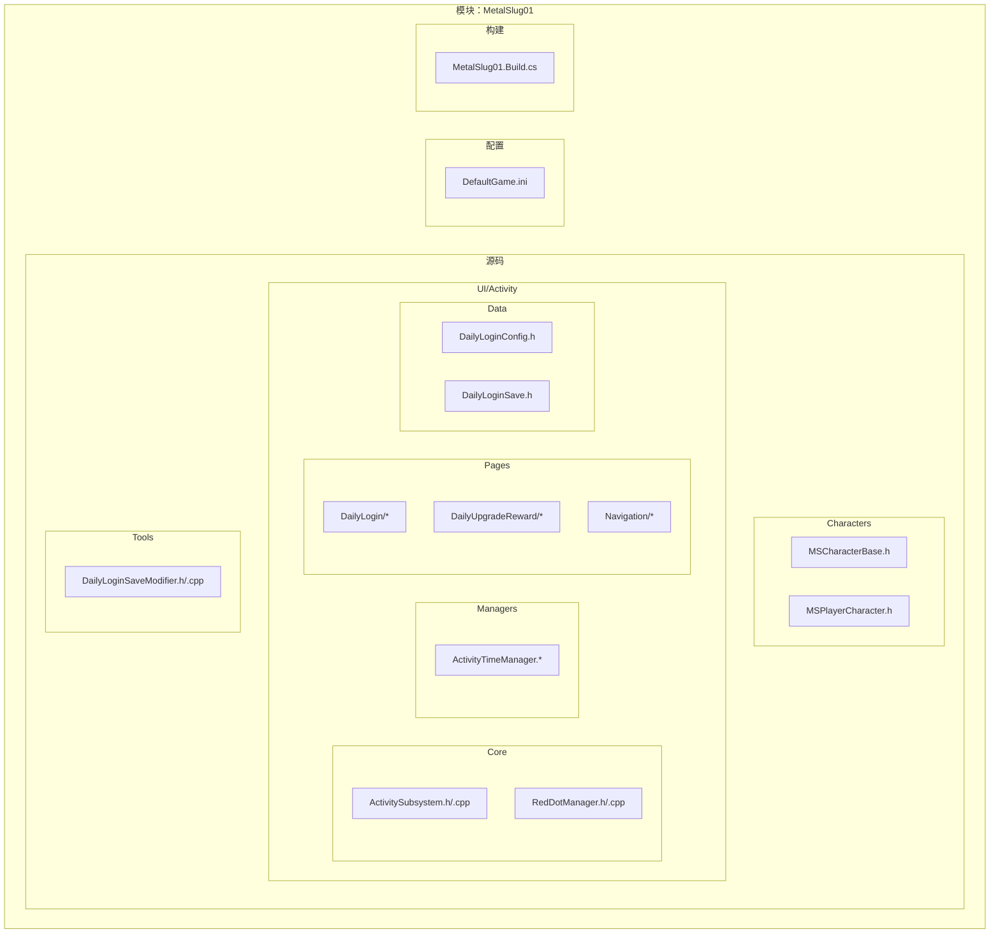
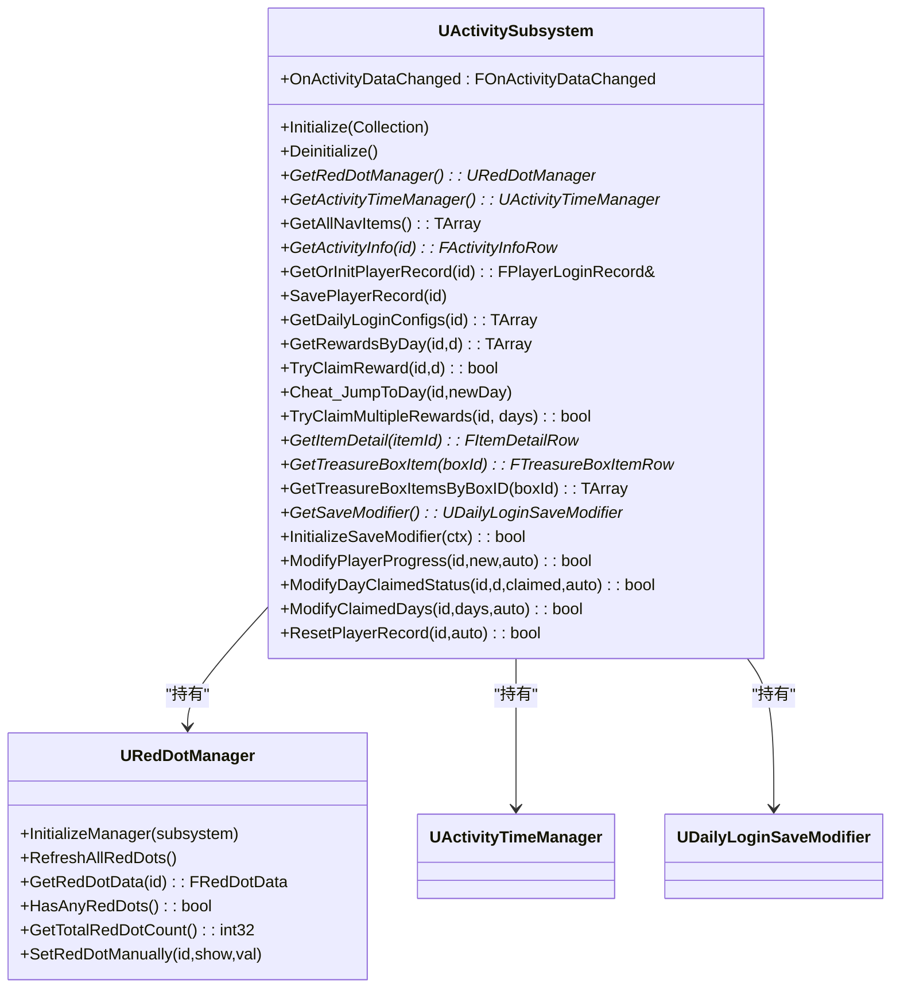
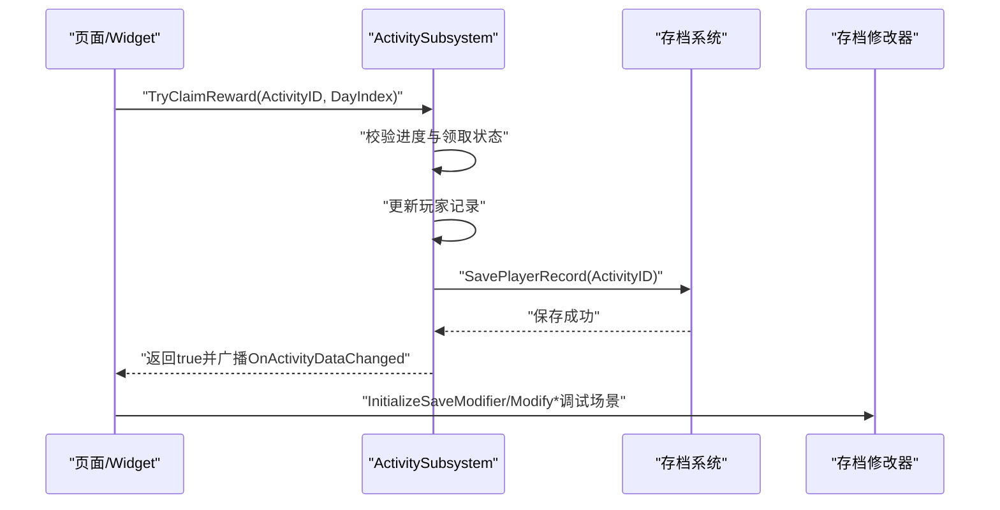
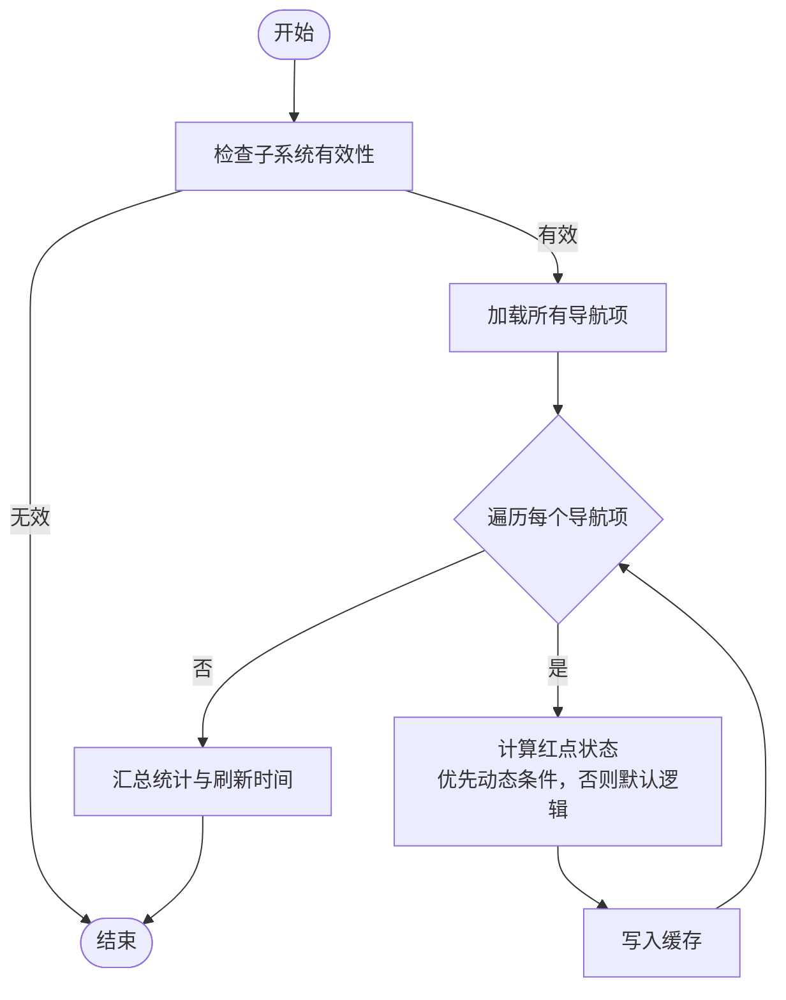
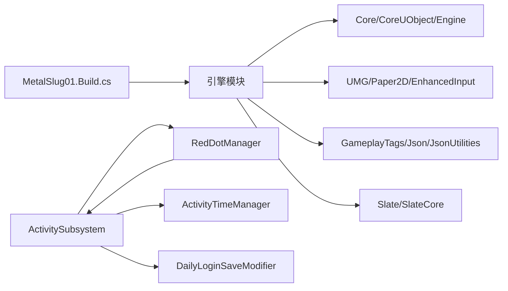

# 模块化设计原则

<cite>
**本文引用的文件**
- [MetalSlug01.Build.cs](file://MetalSlug01/Source/MetalSlug01/MetalSlug01.Build.cs)
- [MetalSlug01.h](file://MetalSlug01/Source/MetalSlug01/MetalSlug01.h)
- [MetalSlug01GameModeBase.h](file://MetalSlug01/Source/MetalSlug01/MetalSlug01GameModeBase.h)
- [ActivitySubsystem.h](file://MetalSlug01/Source/MetalSlug01/Public/UI/Activity/Core/ActivitySubsystem.h)
- [ActivitySubsystem.cpp](file://MetalSlug01/Source/MetalSlug01/Private/UI/Activity/Core/ActivitySubsystem.cpp)
- [RedDotManager.h](file://MetalSlug01/Source/MetalSlug01/Public/UI/Activity/Core/RedDotManager.h)
- [RedDotManager.cpp](file://MetalSlug01/Source/MetalSlug01/Private/UI/Activity/Core/RedDotManager.cpp)
- [MSCharacterBase.h](file://MetalSlug01/Source/MetalSlug01/Public/Characters/MSCharacterBase.h)
- [MSPlayerCharacter.h](file://MetalSlug01/Source/MetalSlug01/Public/Characters/MSPlayerCharacter.h)
- [DefaultGame.ini](file://MetalSlug01/Config/DefaultGame.ini)
</cite>

## 目录
1. [简介](#简介)
2. [项目结构](#项目结构)
3. [核心组件](#核心组件)
4. [架构总览](#架构总览)
5. [详细组件分析](#详细组件分析)
6. [依赖关系分析](#依赖关系分析)
7. [性能考量](#性能考量)
8. [故障排查指南](#故障排查指南)
9. [结论](#结论)
10. [附录](#附录)

## 简介
本文件系统化阐述 MetalSlug 项目的模块化设计原则与实现策略，聚焦于“活动系统”（Activity System）的子系统化组织方式，包括模块边界定义、职责分离、接口设计、依赖关系与解耦机制，并结合实际代码路径给出可视化图示与实操建议。同时覆盖构建系统配置、模块加载机制、新模块开发指南、模块间通信与数据共享策略，以及模块化重构案例与最佳实践。

## 项目结构
项目采用基于功能域的分层组织方式：
- 源码根目录按模块/功能域划分，如 Characters、UI、Tools 等；
- UI 活动系统进一步细分为 Core（子系统）、Managers（管理器）、Pages（页面）、Data（数据表）等子目录；
- 构建配置集中于模块 Build.cs，声明公共/私有模块依赖；
- 配置文件位于 Config，包含引擎与项目设置。

图表来源
- [MetalSlug01.Build.cs](file://MetalSlug01/Source/MetalSlug01/MetalSlug01.Build.cs#L1-L24)
- [ActivitySubsystem.h](file://MetalSlug01/Source/MetalSlug01/Public/UI/Activity/Core/ActivitySubsystem.h#L1-L178)
- [ActivitySubsystem.cpp](file://MetalSlug01/Source/MetalSlug01/Private/UI/Activity/Core/ActivitySubsystem.cpp#L1-L599)
- [RedDotManager.h](file://MetalSlug01/Source/MetalSlug01/Public/UI/Activity/Core/RedDotManager.h#L1-L100)
- [RedDotManager.cpp](file://MetalSlug01/Source/MetalSlug01/Private/UI/Activity/Core/RedDotManager.cpp#L1-L160)
- [MSCharacterBase.h](file://MetalSlug01/Source/MetalSlug01/Public/Characters/MSCharacterBase.h#L1-L50)
- [MSPlayerCharacter.h](file://MetalSlug01/Source/MetalSlug01/Public/Characters/MSPlayerCharacter.h#L1-L41)
- [DefaultGame.ini](file://MetalSlug01/Config/DefaultGame.ini#L1-L6)

章节来源
- [MetalSlug01.Build.cs](file://MetalSlug01/Source/MetalSlug01/MetalSlug01.Build.cs#L1-L24)
- [DefaultGame.ini](file://MetalSlug01/Config/DefaultGame.ini#L1-L6)

## 核心组件
- 模块主头文件与游戏模式基类：提供模块入口与基础框架。
- 活动子系统（ActivitySubsystem）：作为 UI 活动系统的中枢，负责生命周期管理、数据访问、事件广播与外部工具（存档修改器）集成。
- 红点管理器（RedDotManager）：负责计算与缓存各活动的红点状态，支持动态条件与默认逻辑。
- 角色基类与玩家角色：提供角色行为与输入绑定的基础抽象，便于扩展不同角色类型。

章节来源
- [MetalSlug01.h](file://MetalSlug01/Source/MetalSlug01/MetalSlug01.h#L1-L10)
- [MetalSlug01GameModeBase.h](file://MetalSlug01/Source/MetalSlug01/MetalSlug01GameModeBase.h#L1-L17)
- [ActivitySubsystem.h](file://MetalSlug01/Source/MetalSlug01/Public/UI/Activity/Core/ActivitySubsystem.h#L1-L178)
- [ActivitySubsystem.cpp](file://MetalSlug01/Source/MetalSlug01/Private/UI/Activity/Core/ActivitySubsystem.cpp#L1-L599)
- [RedDotManager.h](file://MetalSlug01/Source/MetalSlug01/Public/UI/Activity/Core/RedDotManager.h#L1-L100)
- [RedDotManager.cpp](file://MetalSlug01/Source/MetalSlug01/Private/UI/Activity/Core/RedDotManager.cpp#L1-L160)
- [MSCharacterBase.h](file://MetalSlug01/Source/MetalSlug01/Public/Characters/MSCharacterBase.h#L1-L50)
- [MSPlayerCharacter.h](file://MetalSlug01/Source/MetalSlug01/Public/Characters/MSPlayerCharacter.h#L1-L41)

## 架构总览
活动系统采用“子系统 + 管理器 + 数据表 + 页面”的分层架构：
- 子系统（GameInstance Subsystem）统一管理生命周期与资源；
- 管理器（如红点管理器、时间管理器）承担具体领域逻辑；
- 数据表驱动 UI 与业务规则；
- 页面通过子系统暴露的接口访问数据与触发事件；
- 存档修改器以插件式方式接入，提供运行时调试与数据修改能力。

图表来源
- [ActivitySubsystem.h](file://MetalSlug01/Source/MetalSlug01/Public/UI/Activity/Core/ActivitySubsystem.h#L1-L178)
- [ActivitySubsystem.cpp](file://MetalSlug01/Source/MetalSlug01/Private/UI/Activity/Core/ActivitySubsystem.cpp#L1-L599)
- [RedDotManager.h](file://MetalSlug01/Source/MetalSlug01/Public/UI/Activity/Core/RedDotManager.h#L1-L100)
- [RedDotManager.cpp](file://MetalSlug01/Source/MetalSlug01/Private/UI/Activity/Core/RedDotManager.cpp#L1-L160)

## 详细组件分析

### 活动子系统（ActivitySubsystem）
- 职责边界
  - 统一管理活动 Track 的创建与生命周期；
  - 为页面与 UI 提供活动数据访问入口；
  - 通过事件广播通知数据变更；
  - 与存档修改器协作，提供运行时调试与批量修改能力。
- 接口设计原则
  - 明确的公开接口与蓝图可调用标记；
  - 通过弱引用与缓存减少跨模块耦合；
  - 事件广播避免 UI 直接依赖业务逻辑。
- 关键流程（领取奖励）

图表来源
- [ActivitySubsystem.cpp](file://MetalSlug01/Source/MetalSlug01/Private/UI/Activity/Core/ActivitySubsystem.cpp#L247-L298)
- [ActivitySubsystem.h](file://MetalSlug01/Source/MetalSlug01/Public/UI/Activity/Core/ActivitySubsystem.h#L67-L141)

章节来源
- [ActivitySubsystem.h](file://MetalSlug01/Source/MetalSlug01/Public/UI/Activity/Core/ActivitySubsystem.h#L17-L178)
- [ActivitySubsystem.cpp](file://MetalSlug01/Source/MetalSlug01/Private/UI/Activity/Core/ActivitySubsystem.cpp#L1-L599)

### 红点管理器（RedDotManager）
- 职责边界
  - 计算并缓存各活动的红点状态；
  - 支持动态条件函数与默认逻辑；
  - 提供汇总统计与手动设置能力。
- 解耦机制
  - 通过弱引用持有子系统，避免循环依赖；
  - 缓存最近刷新结果，降低重复计算成本；
  - 通过蓝图接口暴露必要能力。
- 流程图（刷新红点）

图表来源
- [RedDotManager.cpp](file://MetalSlug01/Source/MetalSlug01/Private/UI/Activity/Core/RedDotManager.cpp#L12-L36)
- [RedDotManager.h](file://MetalSlug01/Source/MetalSlug01/Public/UI/Activity/Core/RedDotManager.h#L12-L100)

章节来源
- [RedDotManager.h](file://MetalSlug01/Source/MetalSlug01/Public/UI/Activity/Core/RedDotManager.h#L1-L100)
- [RedDotManager.cpp](file://MetalSlug01/Source/MetalSlug01/Private/UI/Activity/Core/RedDotManager.cpp#L1-L160)

### 角色系统（MSCharacterBase / MSPlayerCharacter）
- 职责分离
  - 基类负责通用角色属性与动画更新；
  - 玩家角色负责输入映射与相机绑定；
  - 通过蓝图与配置类解耦输入行为。
- 模块边界
  - 与活动系统无直接耦合，仅在游戏模式层面交互；
  - 可独立演进，便于复用与替换。

章节来源
- [MSCharacterBase.h](file://MetalSlug01/Source/MetalSlug01/Public/Characters/MSCharacterBase.h#L1-L50)
- [MSPlayerCharacter.h](file://MetalSlug01/Source/MetalSlug01/Public/Characters/MSPlayerCharacter.h#L1-L41)

## 依赖关系分析
- 构建依赖（模块层）
  - 公共依赖：Core、CoreUObject、Engine、InputCore、UMG、Paper2D、EnhancedInput、GameplayTags、Json、JsonUtilities；
  - 私有依赖：Slate、SlateCore；
  - 未启用在线功能与 Steam 插件（注释保留）。
- 运行时依赖（代码层）
  - 活动子系统依赖红点管理器、时间管理器与存档修改器；
  - 红点管理器依赖子系统提供的导航项与数据表；
  - 页面通过子系统接口访问数据，避免直接依赖数据表。

图表来源
- [MetalSlug01.Build.cs](file://MetalSlug01/Source/MetalSlug01/MetalSlug01.Build.cs#L11-L13)
- [ActivitySubsystem.h](file://MetalSlug01/Source/MetalSlug01/Public/UI/Activity/Core/ActivitySubsystem.h#L6-L11)
- [RedDotManager.h](file://MetalSlug01/Source/MetalSlug01/Public/UI/Activity/Core/RedDotManager.h#L1-L6)

章节来源
- [MetalSlug01.Build.cs](file://MetalSlug01/Source/MetalSlug01/MetalSlug01.Build.cs#L1-L24)
- [ActivitySubsystem.h](file://MetalSlug01/Source/MetalSlug01/Public/UI/Activity/Core/ActivitySubsystem.h#L6-L11)
- [RedDotManager.h](file://MetalSlug01/Source/MetalSlug01/Public/UI/Activity/Core/RedDotManager.h#L1-L6)

## 性能考量
- 数据表访问
  - 子系统对数据表的加载与遍历应避免频繁调用；可通过缓存与延迟加载策略降低开销。
- 红点计算
  - 使用缓存与刷新时间戳控制刷新频率，避免每帧重复计算。
- 存档写入
  - 批量修改后统一保存，减少磁盘 IO 次数；提供自动保存开关以平衡一致性与性能。
- UI 刷新
  - 通过事件广播最小化 UI 依赖，避免不必要的重绘与布局计算。

## 故障排查指南
- 存档加载失败
  - 现象：无法加载或创建玩家记录；
  - 排查：确认 SaveGame Slot 名称与路径一致；检查数据表路径与名称；查看日志输出定位问题。
- 红点状态异常
  - 现象：红点不更新或显示错误；
  - 排查：确认子系统已初始化；检查动态条件函数是否存在；验证默认逻辑分支。
- 领取奖励失败
  - 现象：进度未更新或重复领取；
  - 排查：核对领取条件（进度、状态掩码）；检查保存流程与事件广播。

章节来源
- [ActivitySubsystem.cpp](file://MetalSlug01/Source/MetalSlug01/Private/UI/Activity/Core/ActivitySubsystem.cpp#L101-L161)
- [RedDotManager.cpp](file://MetalSlug01/Source/MetalSlug01/Private/UI/Activity/Core/RedDotManager.cpp#L12-L36)

## 结论
MetalSlug 的模块化设计以“子系统为中心”的活动系统为核心，通过明确的职责边界、清晰的接口契约与事件驱动的解耦机制，实现了可维护、可测试与可扩展的架构。配合构建系统与配置文件，项目具备良好的工程化基础。建议在新增模块时遵循本文的设计原则与最佳实践，确保模块边界清晰、依赖可控、接口稳定。

## 附录

### 模块化重构案例
- 将“活动配置表加载”封装为独立服务，减少子系统中的重复逻辑；
- 将“红点条件函数”迁移至可插拔的策略对象，支持热更新或动态注册；
- 将“批量修改存档”抽象为命令模式，统一事务与回滚处理。

### 最佳实践
- 单一职责：每个模块/类仅负责一个明确领域；
- 依赖倒置：高层模块不依赖低层模块，二者都依赖抽象；
- 接口最小化：对外暴露必要的蓝图/接口，内部细节封装；
- 事件驱动：通过事件解耦模块间直接调用；
- 缓存与懒加载：对昂贵资源进行缓存与延迟初始化；
- 可测试性：为关键流程提供可注入的依赖与桩对象。

### 构建系统配置与模块加载机制
- 构建配置
  - 在模块 Build.cs 中声明公共/私有依赖，确保编译期可见性；
  - 未启用的在线功能与插件保持注释，避免误用。
- 模块加载
  - 子系统在 GameInstance 生命周期内初始化，确保全局可用；
  - 管理器与修改器由子系统创建与销毁，遵循生命周期管理。

章节来源
- [MetalSlug01.Build.cs](file://MetalSlug01/Source/MetalSlug01/MetalSlug01.Build.cs#L11-L13)
- [ActivitySubsystem.cpp](file://MetalSlug01/Source/MetalSlug01/Private/UI/Activity/Core/ActivitySubsystem.cpp#L7-L39)

### 新模块开发指南与集成方法
- 设计阶段
  - 明确模块边界与职责，定义对外接口；
  - 评估与现有模块的依赖关系，尽量通过事件或弱引用解耦。
- 开发阶段
  - 在模块 Build.cs 中添加必要依赖；
  - 如需全局访问，在 GameInstance 中注册子系统或管理器；
  - 提供蓝图可调用接口，便于 UI 快速集成。
- 集成阶段
  - 通过子系统或服务单例访问模块能力；
  - 对外广播事件，避免 UI 直接依赖内部实现。

### 模块间通信模式与数据共享策略
- 事件广播：子系统通过多播委托向 UI 通知数据变化；
- 弱引用：管理器持有子系统弱引用，避免循环依赖；
- 数据表驱动：通过数据表集中管理配置，页面通过子系统接口读取；
- 存档修改器：以插件式方式提供运行时调试与批量修改能力，不侵入主流程。

章节来源
- [ActivitySubsystem.h](file://MetalSlug01/Source/MetalSlug01/Public/UI/Activity/Core/ActivitySubsystem.h#L149-L152)
- [RedDotManager.h](file://MetalSlug01/Source/MetalSlug01/Public/UI/Activity/Core/RedDotManager.h#L74-L75)
- [ActivitySubsystem.cpp](file://MetalSlug01/Source/MetalSlug01/Private/UI/Activity/Core/ActivitySubsystem.cpp#L481-L504)