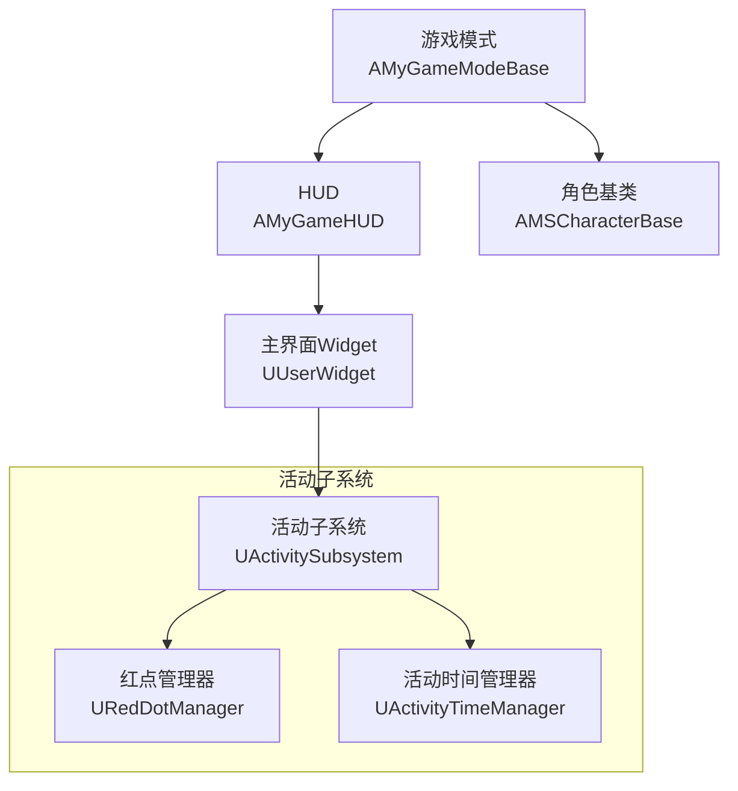
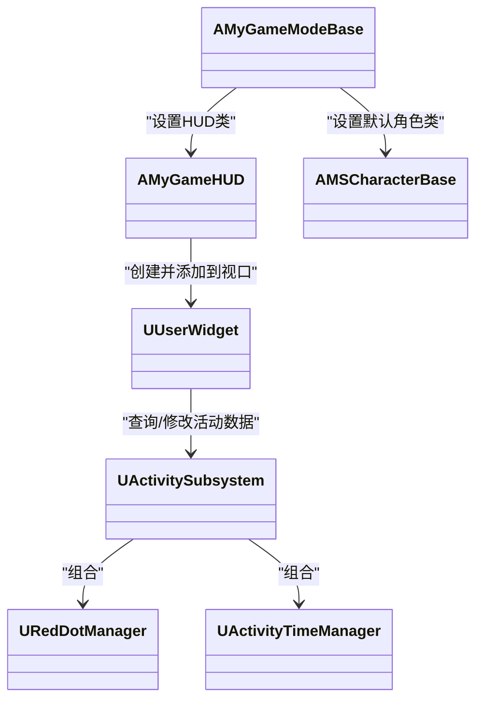
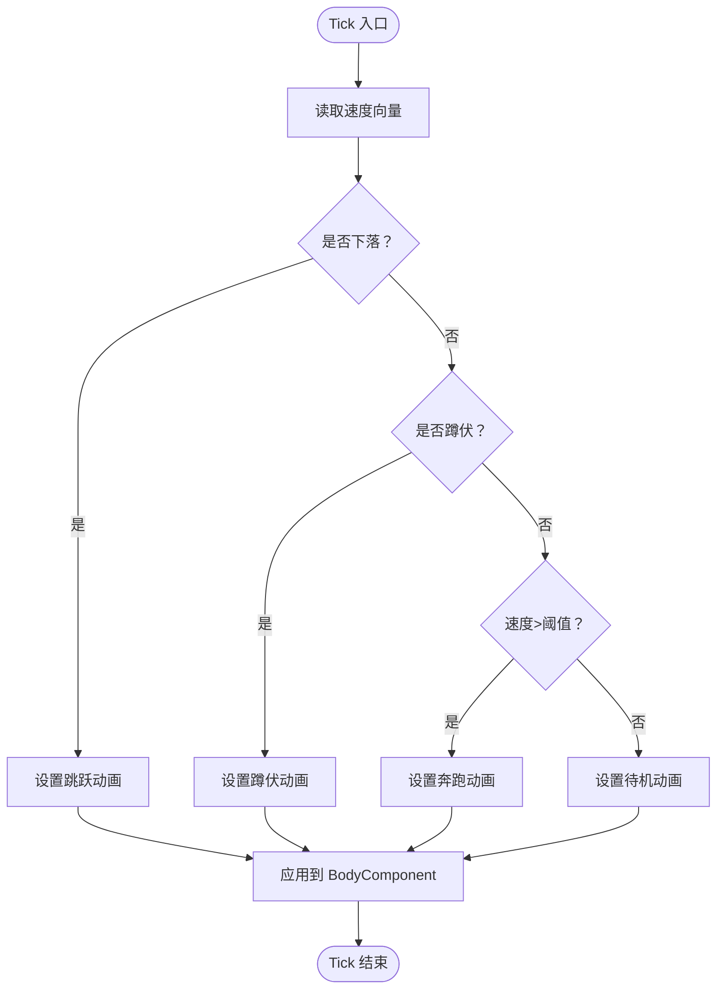
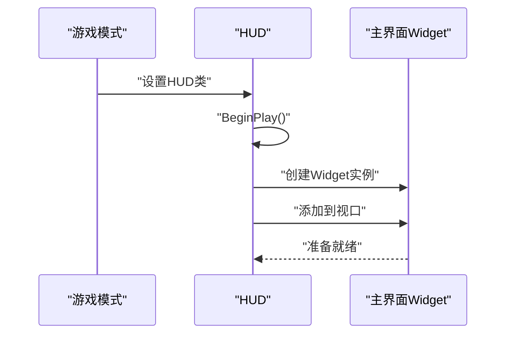
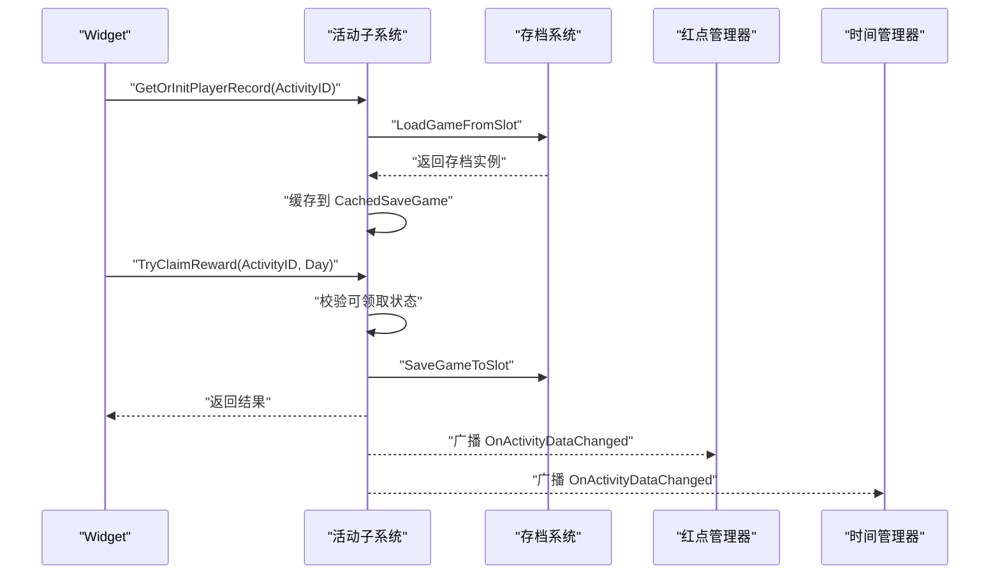
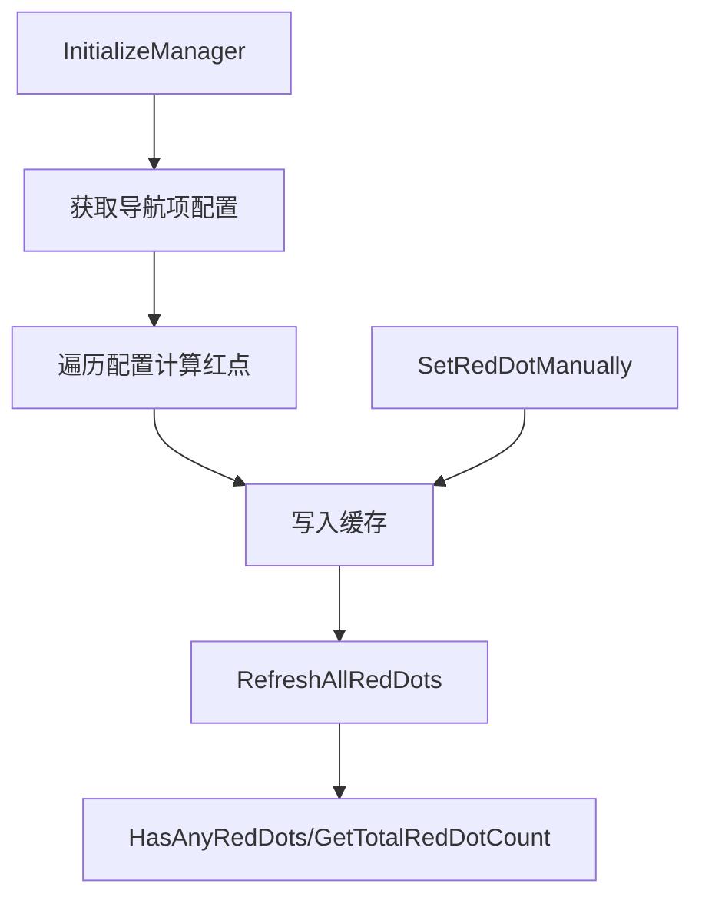
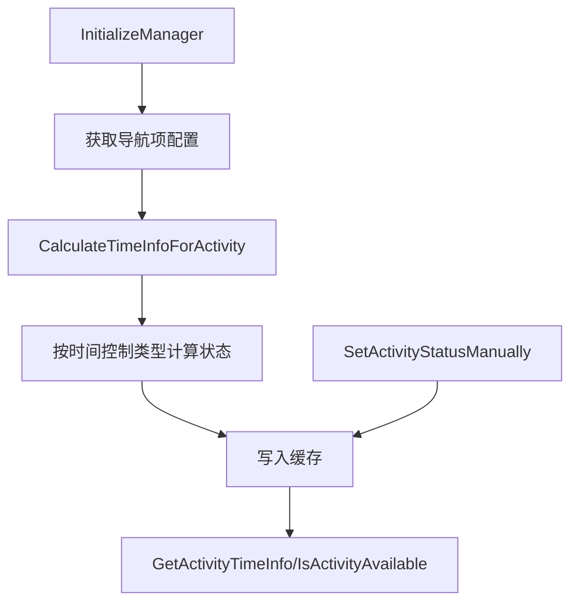
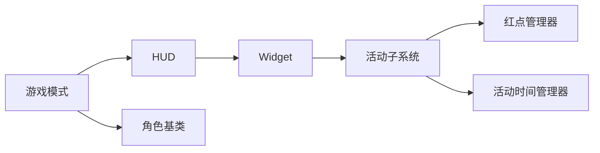

# 组件交互关系

<cite>
**本文引用的文件**
- [MetalSlug01GameModeBase.h](file://MetalSlug01/Source/MetalSlug01/MetalSlug01GameModeBase.h)
- [MetalSlug01GameModeBase.cpp](file://MetalSlug01/Source/MetalSlug01/MetalSlug01GameModeBase.cpp)
- [MyGameHUD.h](file://MetalSlug01/Source/MetalSlug01/Public/UI/MyGameHUD.h)
- [MyGameHUD.cpp](file://MetalSlug01/Source/MetalSlug01/Private/UI/MyGameHUD.cpp)
- [MSCharacterBase.h](file://MetalSlug01/Source/MetalSlug01/Public/Characters/MSCharacterBase.h)
- [MSCharacterBase.cpp](file://MetalSlug01/Source/MetalSlug01/Private/Characters/MSCharacterBase.cpp)
- [ActivitySubsystem.h](file://MetalSlug01/Source/MetalSlug01/Public/UI/Activity/Core/ActivitySubsystem.h)
- [ActivitySubsystem.cpp](file://MetalSlug01/Source/MetalSlug01/Private/UI/Activity/Core/ActivitySubsystem.cpp)
- [RedDotManager.h](file://MetalSlug01/Source/MetalSlug01/Public/UI/Activity/Core/RedDotManager.h)
- [RedDotManager.cpp](file://MetalSlug01/Source/MetalSlug01/Private/UI/Activity/Core/RedDotManager.cpp)
- [ActivityTimeManager.h](file://MetalSlug01/Source/MetalSlug01/Public/UI/Activity/Managers/ActivityTimeManager.h)
- [ActivityTimeManager.cpp](file://MetalSlug01/Source/MetalSlug01/Private/UI/Activity/Managers/ActivityTimeManager.cpp)
</cite>

## 目录
1. [简介](#简介)
2. [项目结构](#项目结构)
3. [核心组件](#核心组件)
4. [架构总览](#架构总览)
5. [详细组件分析](#详细组件分析)
6. [依赖分析](#依赖分析)
7. [性能考虑](#性能考虑)
8. [故障排查指南](#故障排查指南)
9. [结论](#结论)
10. [附录](#附录)

## 简介
本文件聚焦于 MetalSlug 项目中的组件交互关系，系统化梳理角色系统、UI 系统、输入系统与存档系统的协作方式，解释依赖注入、事件传递与状态同步机制，描述数据流与控制流，并给出调试方法与性能优化建议。文档以实际源码为依据，配合多种可视化图表帮助不同背景读者理解。

## 项目结构
项目采用基于功能域的分层组织：
- 游戏模式与HUD：负责场景装配与顶层UI展示
- 角色系统：基于 Character 的角色基类与动画驱动
- 活动子系统：统一管理活动、红点、时间与存档修改器
- UI 页面与导航：通过 HUD 加载主界面，页面由活动子系统驱动

**图表来源**
- [MetalSlug01GameModeBase.cpp](file://MetalSlug01/Source/MetalSlug01/MetalSlug01GameModeBase.cpp#L9-L26)
- [MyGameHUD.h](file://MetalSlug01/Source/MetalSlug01/Public/UI/MyGameHUD.h#L7-L22)
- [MyGameHUD.cpp](file://MetalSlug01/Source/MetalSlug01/Private/UI/MyGameHUD.cpp#L4-L18)
- [MSCharacterBase.h](file://MetalSlug01/Source/MetalSlug01/Public/Characters/MSCharacterBase.h#L10-L50)
- [ActivitySubsystem.h](file://MetalSlug01/Source/MetalSlug01/Public/UI/Activity/Core/ActivitySubsystem.h#L29-L178)
- [RedDotManager.h](file://MetalSlug01/Source/MetalSlug01/Public/UI/Activity/Core/RedDotManager.h#L16-L100)
- [ActivityTimeManager.h](file://MetalSlug01/Source/MetalSlug01/Public/UI/Activity/Managers/ActivityTimeManager.h#L18-L117)

**章节来源**
- [MetalSlug01GameModeBase.h](file://MetalSlug01/Source/MetalSlug01/MetalSlug01GameModeBase.h#L9-L16)
- [MetalSlug01GameModeBase.cpp](file://MetalSlug01/Source/MetalSlug01/MetalSlug01GameModeBase.cpp#L9-L26)
- [MyGameHUD.h](file://MetalSlug01/Source/MetalSlug01/Public/UI/MyGameHUD.h#L7-L22)
- [MyGameHUD.cpp](file://MetalSlug01/Source/MetalSlug01/Private/UI/MyGameHUD.cpp#L4-L18)
- [MSCharacterBase.h](file://MetalSlug01/Source/MetalSlug01/Public/Characters/MSCharacterBase.h#L10-L50)

## 核心组件
- 游戏模式与HUD
  - 游戏模式设置默认角色类与HUD类，完成场景装配
  - HUD 在 BeginPlay 中根据配置创建并添加主界面 Widget 到视口
- 角色系统
  - 角色基类封装渲染组件、动画资产槽位与基础属性
  - Tick 中驱动动画更新，依据速度、下落与姿态切换动画
- 活动子系统
  - 生命周期：Initialize/Deinitialize 管理内部管理器与存档修改器
  - 数据访问：提供导航项、活动配置、奖励查询、领取与批量领取
  - 存档：加载/创建/保存玩家记录；支持动态修改器接口
  - 事件：数据变更广播
- 红点与时间管理器
  - 红点：根据配置与条件函数计算红点状态，支持手动覆盖
  - 时间：根据时间控制类型计算活动状态、倒计时与预热/末尾提醒

**章节来源**
- [MetalSlug01GameModeBase.cpp](file://MetalSlug01/Source/MetalSlug01/MetalSlug01GameModeBase.cpp#L9-L26)
- [MyGameHUD.cpp](file://MetalSlug01/Source/MetalSlug01/Private/UI/MyGameHUD.cpp#L4-L18)
- [MSCharacterBase.cpp](file://MetalSlug01/Source/MetalSlug01/Private/Characters/MSCharacterBase.cpp#L31-L64)
- [ActivitySubsystem.h](file://MetalSlug01/Source/MetalSlug01/Public/UI/Activity/Core/ActivitySubsystem.h#L29-L178)
- [ActivitySubsystem.cpp](file://MetalSlug01/Source/MetalSlug01/Private/UI/Activity/Core/ActivitySubsystem.cpp#L7-L39)
- [RedDotManager.h](file://MetalSlug01/Source/MetalSlug01/Public/UI/Activity/Core/RedDotManager.h#L16-L100)
- [ActivityTimeManager.h](file://MetalSlug01/Source/MetalSlug01/Public/UI/Activity/Managers/ActivityTimeManager.h#L18-L117)

## 架构总览
组件间交互遵循“子系统集中管理 + 管理器职责分离 + 事件广播”的模式：
- 游戏模式装配角色与HUD
- HUD 加载主界面 Widget
- Widget 通过活动子系统访问数据与触发行为
- 活动子系统内部组合红点与时间管理器，统一对外提供接口
- 存档修改器通过子系统暴露的接口对存档进行动态修改

**图表来源**
- [MetalSlug01GameModeBase.cpp](file://MetalSlug01/Source/MetalSlug01/MetalSlug01GameModeBase.cpp#L9-L26)
- [MyGameHUD.cpp](file://MetalSlug01/Source/MetalSlug01/Private/UI/MyGameHUD.cpp#L4-L18)
- [ActivitySubsystem.cpp](file://MetalSlug01/Source/MetalSlug01/Private/UI/Activity/Core/ActivitySubsystem.cpp#L7-L39)
- [RedDotManager.h](file://MetalSlug01/Source/MetalSlug01/Public/UI/Activity/Core/RedDotManager.h#L16-L100)
- [ActivityTimeManager.h](file://MetalSlug01/Source/MetalSlug01/Public/UI/Activity/Managers/ActivityTimeManager.h#L18-L117)

## 详细组件分析

### 角色系统（AMSCharacterBase）
- 组件职责
  - 渲染：Body/Torso Flipbook 组件挂载在角色根上
  - 动作：基于速度、下落与姿态选择 Idle/Run/Jump/Crouch 动画
  - 移动：约束平面运动、允许蹲伏、设置蹲伏速度
- 生命周期
  - BeginPlay 强制设置初始动画，避免首帧黑屏
  - Tick 中调用 UpdateAnimation 实时切换动画
- 交互要点
  - 动画切换依赖角色运动组件的状态
  - UI 与角色系统无直接耦合，通过 Gameplay 与蓝图交互

**图表来源**
- [MSCharacterBase.cpp](file://MetalSlug01/Source/MetalSlug01/Private/Characters/MSCharacterBase.cpp#L41-L64)

**章节来源**
- [MSCharacterBase.h](file://MetalSlug01/Source/MetalSlug01/Public/Characters/MSCharacterBase.h#L10-L50)
- [MSCharacterBase.cpp](file://MetalSlug01/Source/MetalSlug01/Private/Characters/MSCharacterBase.cpp#L31-L64)

### UI 系统（HUD 与主界面）
- 组件职责
  - HUD 在 BeginPlay 中根据配置创建并添加主界面 Widget 到视口
- 交互要点
  - HUD 仅负责装配，不参与业务逻辑
  - Widget 通过活动子系统访问数据与触发行为

**图表来源**
- [MetalSlug01GameModeBase.cpp](file://MetalSlug01/Source/MetalSlug01/MetalSlug01GameModeBase.cpp#L9-L26)
- [MyGameHUD.cpp](file://MetalSlug01/Source/MetalSlug01/Private/UI/MyGameHUD.cpp#L4-L18)

**章节来源**
- [MyGameHUD.h](file://MetalSlug01/Source/MetalSlug01/Public/UI/MyGameHUD.h#L7-L22)
- [MyGameHUD.cpp](file://MetalSlug01/Source/MetalSlug01/Private/UI/MyGameHUD.cpp#L4-L18)

### 活动子系统（UActivitySubsystem）
- 组件职责
  - 生命周期管理：Initialize/Deinitialize 内部管理器与存档修改器
  - 数据访问：导航项、活动配置、奖励查询、领取与批量领取
  - 存档：加载/创建/保存玩家记录；支持动态修改器接口
  - 事件：数据变更广播
- 依赖注入
  - 红点管理器与时间管理器通过 NewObject 在 Initialize 中注入
  - 存档修改器通过 InitializeModifier 注入并注册控制台命令
- 事件传递
  - TryClaimReward/ModifyPlayerProgress 等成功后广播 OnActivityDataChanged
- 状态同步
  - 通过 CachedSaveGame 缓存当前活动的存档实例，保证读写一致性

**图表来源**
- [ActivitySubsystem.cpp](file://MetalSlug01/Source/MetalSlug01/Private/UI/Activity/Core/ActivitySubsystem.cpp#L101-L161)
- [ActivitySubsystem.cpp](file://MetalSlug01/Source/MetalSlug01/Private/UI/Activity/Core/ActivitySubsystem.cpp#L247-L298)
- [ActivitySubsystem.h](file://MetalSlug01/Source/MetalSlug01/Public/UI/Activity/Core/ActivitySubsystem.h#L149-L152)

**章节来源**
- [ActivitySubsystem.h](file://MetalSlug01/Source/MetalSlug01/Public/UI/Activity/Core/ActivitySubsystem.h#L29-L178)
- [ActivitySubsystem.cpp](file://MetalSlug01/Source/MetalSlug01/Private/UI/Activity/Core/ActivitySubsystem.cpp#L7-L39)
- [ActivitySubsystem.cpp](file://MetalSlug01/Source/MetalSlug01/Private/UI/Activity/Core/ActivitySubsystem.cpp#L101-L161)
- [ActivitySubsystem.cpp](file://MetalSlug01/Source/MetalSlug01/Private/UI/Activity/Core/ActivitySubsystem.cpp#L247-L298)

### 红点管理器（URedDotManager）
- 组件职责
  - 根据活动配置与条件函数计算红点状态
  - 支持手动覆盖与汇总统计
- 交互要点
  - 依赖活动子系统提供的导航项配置
  - 缓存计算结果，降低重复计算开销

**图表来源**
- [RedDotManager.cpp](file://MetalSlug01/Source/MetalSlug01/Private/UI/Activity/Core/RedDotManager.cpp#L12-L36)
- [RedDotManager.cpp](file://MetalSlug01/Source/MetalSlug01/Private/UI/Activity/Core/RedDotManager.cpp#L38-L89)

**章节来源**
- [RedDotManager.h](file://MetalSlug01/Source/MetalSlug01/Public/UI/Activity/Core/RedDotManager.h#L16-L100)
- [RedDotManager.cpp](file://MetalSlug01/Source/MetalSlug01/Private/UI/Activity/Core/RedDotManager.cpp#L12-L89)

### 活动时间管理器（UActivityTimeManager）
- 组件职责
  - 计算活动状态（进行中/预告/结束/维护）
  - 提供倒计时与预热/末尾提醒
- 交互要点
  - 依赖活动子系统提供的导航项配置
  - 支持手动设置状态用于紧急维护

**图表来源**
- [ActivityTimeManager.cpp](file://MetalSlug01/Source/MetalSlug01/Private/UI/Activity/Managers/ActivityTimeManager.cpp#L23-L47)
- [ActivityTimeManager.cpp](file://MetalSlug01/Source/MetalSlug01/Private/UI/Activity/Managers/ActivityTimeManager.cpp#L101-L160)
- [ActivityTimeManager.cpp](file://MetalSlug01/Source/MetalSlug01/Private/UI/Activity/Managers/ActivityTimeManager.cpp#L162-L235)

**章节来源**
- [ActivityTimeManager.h](file://MetalSlug01/Source/MetalSlug01/Public/UI/Activity/Managers/ActivityTimeManager.h#L18-L117)
- [ActivityTimeManager.cpp](file://MetalSlug01/Source/MetalSlug01/Private/UI/Activity/Managers/ActivityTimeManager.cpp#L23-L99)

## 依赖分析
- 组件内聚与耦合
  - 活动子系统聚合红点与时间管理器，对外提供统一接口，降低 UI 与数据层耦合
  - HUD 与角色系统与业务层解耦，仅承担装配职责
- 直接与间接依赖
  - Widget 间接依赖活动子系统与存档系统
  - 管理器依赖活动子系统提供的配置与数据
- 循环依赖
  - 未发现循环依赖；管理器通过弱引用指向活动子系统，避免强耦合

**图表来源**
- [ActivitySubsystem.h](file://MetalSlug01/Source/MetalSlug01/Public/UI/Activity/Core/ActivitySubsystem.h#L29-L178)
- [RedDotManager.h](file://MetalSlug01/Source/MetalSlug01/Public/UI/Activity/Core/RedDotManager.h#L67-L75)
- [ActivityTimeManager.h](file://MetalSlug01/Source/MetalSlug01/Public/UI/Activity/Managers/ActivityTimeManager.h#L76-L86)
- [MyGameHUD.cpp](file://MetalSlug01/Source/MetalSlug01/Private/UI/MyGameHUD.cpp#L4-L18)
- [MetalSlug01GameModeBase.cpp](file://MetalSlug01/Source/MetalSlug01/MetalSlug01GameModeBase.cpp#L9-L26)

**章节来源**
- [ActivitySubsystem.h](file://MetalSlug01/Source/MetalSlug01/Public/UI/Activity/Core/ActivitySubsystem.h#L29-L178)
- [RedDotManager.h](file://MetalSlug01/Source/MetalSlug01/Public/UI/Activity/Core/RedDotManager.h#L67-L75)
- [ActivityTimeManager.h](file://MetalSlug01/Source/MetalSlug01/Public/UI/Activity/Managers/ActivityTimeManager.h#L76-L86)

## 性能考虑
- 动画更新
  - 在 Tick 中进行动画切换，建议在角色移动频繁场景中减少不必要的 SetFlipbook 调用，可通过比较当前动画与目标动画避免重复设置
- 红点与时间计算
  - 管理器使用缓存与定时刷新，建议合理设置刷新间隔，避免高频刷新造成卡顿
- 存档读写
  - 存档保存在领取奖励或进度变更后立即触发，建议合并多次变更后再保存，减少磁盘 IO
- UI 加载
  - HUD 在 BeginPlay 中一次性创建主界面 Widget，避免在运行时频繁创建销毁对象

[本节为通用指导，无需列出章节来源]

## 故障排查指南
- HUD 未显示主界面
  - 检查 HUD 的 MainWidgetClass 是否正确配置
  - 确认 BeginPlay 中创建与添加到视口的流程未被中断
- 角色动画不更新
  - 检查角色移动组件状态与速度阈值
  - 确认 BodyComponent 已正确挂载并设置初始动画
- 活动数据未变化
  - 确认领取流程调用 TryClaimReward 后是否保存存档
  - 检查 OnActivityDataChanged 是否被正确广播
- 红点状态异常
  - 检查红点条件函数是否正确返回值
  - 确认手动设置是否覆盖了默认逻辑
- 时间状态异常
  - 检查时间控制类型与配置时间范围
  - 确认手动设置状态是否生效

**章节来源**
- [MyGameHUD.cpp](file://MetalSlug01/Source/MetalSlug01/Private/UI/MyGameHUD.cpp#L4-L18)
- [MSCharacterBase.cpp](file://MetalSlug01/Source/MetalSlug01/Private/Characters/MSCharacterBase.cpp#L41-L64)
- [ActivitySubsystem.cpp](file://MetalSlug01/Source/MetalSlug01/Private/UI/Activity/Core/ActivitySubsystem.cpp#L247-L298)
- [RedDotManager.cpp](file://MetalSlug01/Source/MetalSlug01/Private/UI/Activity/Core/RedDotManager.cpp#L119-L141)
- [ActivityTimeManager.cpp](file://MetalSlug01/Source/MetalSlug01/Private/UI/Activity/Managers/ActivityTimeManager.cpp#L84-L92)

## 结论
本项目通过“游戏模式装配 + HUD 展示 + 活动子系统集中管理 + 管理器职责分离”的架构，实现了角色系统、UI 系统、输入系统与存档系统的清晰解耦。活动子系统承担数据与状态的核心协调，红点与时间管理器分别提供视觉反馈与生命周期控制，事件广播确保 UI 与数据层的松耦合同步。建议在高频更新场景中进一步优化缓存与保存策略，以提升整体性能与稳定性。

[本节为总结性内容，无需列出章节来源]

## 附录
- 组件生命周期管理
  - 游戏模式：设置默认角色类与 HUD 类
  - HUD：BeginPlay 创建并添加主界面 Widget
  - 活动子系统：Initialize 注入管理器与修改器，Deinitialize 清理资源
- 资源协调策略
  - 使用弱引用避免循环依赖
  - 缓存配置与存档实例，减少重复加载
  - 合并事件广播，避免 UI 频繁刷新

[本节为补充说明，无需列出章节来源]