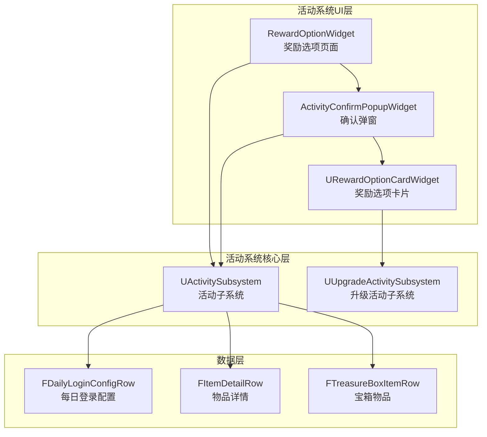
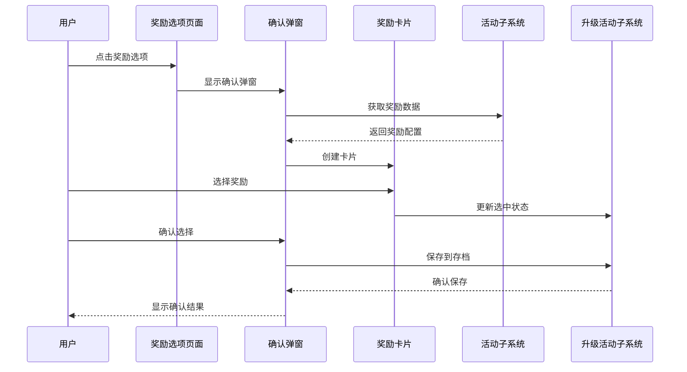
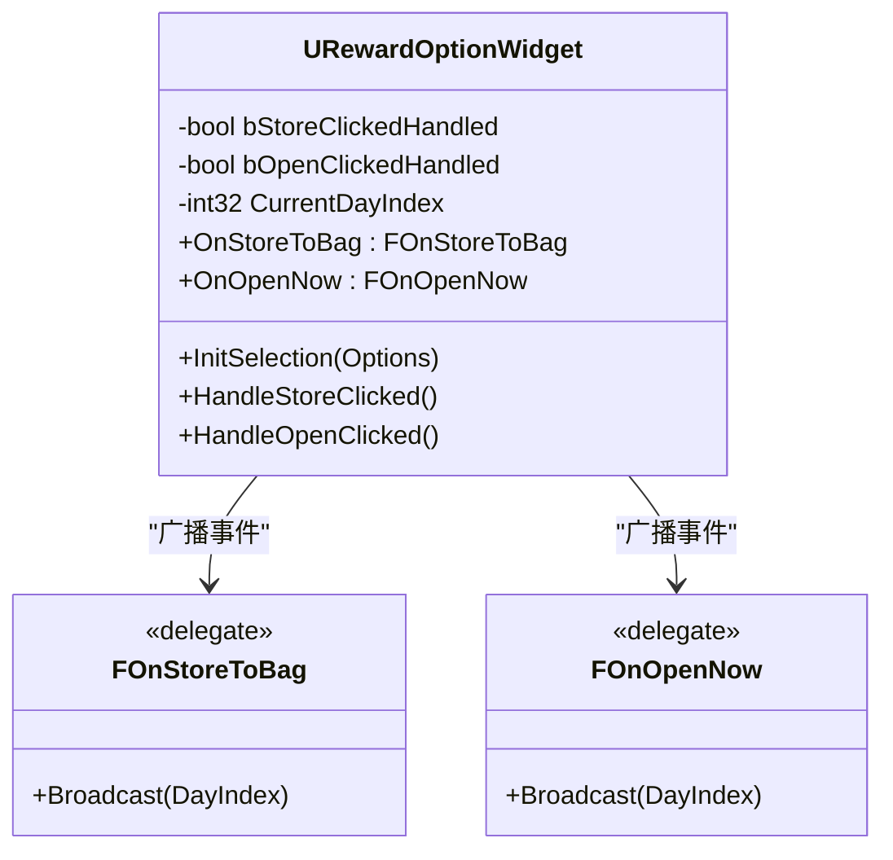
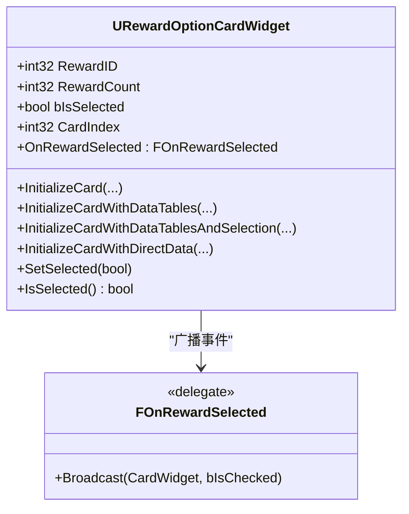
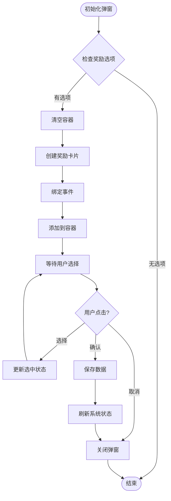
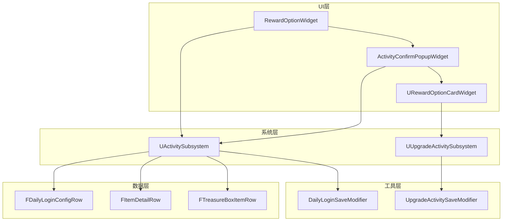

# 奖励选项页面

<cite>
**本文档引用的文件**
- [RewardOptionWidget.cpp](file://MetalSlug01/Source/MetalSlug01/Private/UI/Activity/Pages/ClaimBox/RewardOptionWidget.cpp)
- [RewardOptionWidget.h](file://MetalSlug01/Source/MetalSlug01/Public/UI/Activity/Pages/ClaimBox/RewardOptionWidget.h)
- [RewardOptionCardWidget.cpp](file://MetalSlug01/Source/MetalSlug01/Private/UI/Activity/Pages/SelectMultiplePopup/RewardOptionCardWidget.cpp)
- [RewardOptionCardWidget.h](file://MetalSlug01/Source/MetalSlug01/Public/UI/Activity/Pages/SelectMultiplePopup/RewardOptionCardWidget.h)
- [ActivityConfirmPopupWidget.cpp](file://MetalSlug01/Source/MetalSlug01/Private/UI/Activity/Pages/SelectMultiplePopup/ActivityConfirmPopupWidget.cpp)
- [ActivityConfirmPopupWidget.h](file://MetalSlug01/Source/MetalSlug01/Public/UI/Activity/Pages/SelectMultiplePopup/ActivityConfirmPopupWidget.h)
- [DailyLoginConfig.h](file://MetalSlug01/Source/MetalSlug01/Public/UI/Activity/Data/DailyLoginConfig.h)
- [ActivitySubsystem.h](file://MetalSlug01/Source/MetalSlug01/Public/UI/Activity/Core/ActivitySubsystem.h)
- [UpgradeActivitySubsystem.h](file://MetalSlug01/Source/MetalSlug01/Public/UI/Activity/Core/UpgradeActivitySubsystem.h)
- [DailyUpgradeRewardPage.cpp](file://MetalSlug01/Source/MetalSlug01/Private/UI/Activity/Pages/DailyUpgradeReward/DailyUpgradeRewardPage.cpp)
</cite>

## 目录
1. [简介](#简介)
2. [项目结构](#项目结构)
3. [核心组件](#核心组件)
4. [架构概览](#架构概览)
5. [详细组件分析](#详细组件分析)
6. [依赖关系分析](#依赖关系分析)
7. [性能考虑](#性能考虑)
8. [故障排除指南](#故障排除指南)
9. [结论](#结论)
10. [附录](#附录)

## 简介

奖励选项页面(RewardOptionWidget)是MetalSlug游戏中活动系统的重要组成部分，负责处理奖励选择弹窗的显示和交互。该系统采用模块化设计，通过多层组件协作实现复杂的奖励选择功能。

本系统主要包含三个核心组件：
- **奖励选项页面**：主页面控制器，处理用户交互和事件分发
- **奖励选项卡片**：单个奖励选项的UI组件，支持选择状态管理
- **确认弹窗**：多选项选择对话框，提供奖励确认功能

系统通过ActivitySubsystem和UpgradeActivitySubsystem实现数据持久化和状态同步，确保用户的选择能够正确保存到游戏存档中。

## 项目结构

奖励选项页面位于活动系统的UI层，采用分层架构设计：

**图表来源**
- [RewardOptionWidget.cpp](file://MetalSlug01/Source/MetalSlug01/Private/UI/Activity/Pages/ClaimBox/RewardOptionWidget.cpp#L1-L160)
- [ActivityConfirmPopupWidget.cpp](file://MetalSlug01/Source/MetalSlug01/Private/UI/Activity/Pages/SelectMultiplePopup/ActivityConfirmPopupWidget.cpp#L1-L365)
- [RewardOptionCardWidget.cpp](file://MetalSlug01/Source/MetalSlug01/Private/UI/Activity/Pages/SelectMultiplePopup/RewardOptionCardWidget.cpp#L1-L308)

**章节来源**
- [RewardOptionWidget.h](file://MetalSlug01/Source/MetalSlug01/Public/UI/Activity/Pages/ClaimBox/RewardOptionWidget.h#L1-L57)
- [ActivityConfirmPopupWidget.h](file://MetalSlug01/Source/MetalSlug01/Public/UI/Activity/Pages/SelectMultiplePopup/ActivityConfirmPopupWidget.h#L1-L127)
- [RewardOptionCardWidget.h](file://MetalSlug01/Source/MetalSlug01/Public/UI/Activity/Pages/SelectMultiplePopup/RewardOptionCardWidget.h#L1-L137)

## 核心组件

### 奖励选项页面 (RewardOptionWidget)

RewardOptionWidget是奖励选项页面的主要控制器，负责处理用户交互和事件分发。该组件实现了防重复调用机制，确保用户操作的稳定性。

**关键特性：**
- 防重复调用保护机制
- 事件广播系统
- UI状态管理
- 与升级活动子系统的集成

**主要功能：**
- 处理"存储到背包"按钮点击事件
- 处理"立即开启"按钮点击事件  
- 广播奖励选择事件
- 触发全局页面刷新

**章节来源**
- [RewardOptionWidget.cpp](file://MetalSlug01/Source/MetalSlug01/Private/UI/Activity/Pages/ClaimBox/RewardOptionWidget.cpp#L6-L160)
- [RewardOptionWidget.h](file://MetalSlug01/Source/MetalSlug01/Public/UI/Activity/Pages/ClaimBox/RewardOptionWidget.h#L11-L57)

### 奖励选项卡片 (URewardOptionCardWidget)

URewardOptionCardWidget是单个奖励选项的UI组件，提供卡片式的奖励展示和选择功能。该组件支持多种初始化方式和状态管理。

**核心功能：**
- 多种初始化方法支持
- 选择状态管理
- 事件广播机制
- 与升级活动系统的数据同步

**初始化方式：**
1. 直接数据初始化
2. 数据表初始化
3. 带选择状态的数据表初始化

**章节来源**
- [RewardOptionCardWidget.cpp](file://MetalSlug01/Source/MetalSlug01/Private/UI/Activity/Pages/SelectMultiplePopup/RewardOptionCardWidget.cpp#L38-L308)
- [RewardOptionCardWidget.h](file://MetalSlug01/Source/MetalSlug01/Public/UI/Activity/Pages/SelectMultiplePopup/RewardOptionCardWidget.h#L17-L137)

### 确认弹窗 (ActivityConfirmPopupWidget)

ActivityConfirmPopupWidget提供多选项选择的确认对话框，支持奖励选项的动态生成和用户选择。

**主要特性：**
- 动态奖励卡片生成
- 多选项选择支持
- 临时选中状态跟踪
- 数据持久化机制

**工作流程：**
1. 接收奖励选项数据
2. 创建奖励卡片
3. 处理用户选择
4. 更新系统状态
5. 保存到存档

**章节来源**
- [ActivityConfirmPopupWidget.cpp](file://MetalSlug01/Source/MetalSlug01/Private/UI/Activity/Pages/SelectMultiplePopup/ActivityConfirmPopupWidget.cpp#L55-L365)
- [ActivityConfirmPopupWidget.h](file://MetalSlug01/Source/MetalSlug01/Public/UI/Activity/Pages/SelectMultiplePopup/ActivityConfirmPopupWidget.h#L16-L127)

## 架构概览

奖励选项页面采用分层架构设计，各层职责清晰分离：

**图表来源**
- [RewardOptionWidget.cpp](file://MetalSlug01/Source/MetalSlug01/Private/UI/Activity/Pages/ClaimBox/RewardOptionWidget.cpp#L61-L147)
- [ActivityConfirmPopupWidget.cpp](file://MetalSlug01/Source/MetalSlug01/Private/UI/Activity/Pages/SelectMultiplePopup/ActivityConfirmPopupWidget.cpp#L270-L313)
- [RewardOptionCardWidget.cpp](file://MetalSlug01/Source/MetalSlug01/Private/UI/Activity/Pages/SelectMultiplePopup/RewardOptionCardWidget.cpp#L87-L103)

## 详细组件分析

### 奖励选项页面组件分析

**图表来源**
- [RewardOptionWidget.h](file://MetalSlug01/Source/MetalSlug01/Public/UI/Activity/Pages/ClaimBox/RewardOptionWidget.h#L8-L27)

**处理流程分析：**

1. **防重复调用机制**
   - 使用布尔标志防止重复点击
   - 确保事件处理的完整性
   - 提供安全的UI状态管理

2. **事件广播系统**
   - 存储到背包事件
   - 立即开启事件
   - 参数化事件传递

**章节来源**
- [RewardOptionWidget.cpp](file://MetalSlug01/Source/MetalSlug01/Private/UI/Activity/Pages/ClaimBox/RewardOptionWidget.cpp#L61-L147)

### 奖励选项卡片组件分析

**图表来源**
- [RewardOptionCardWidget.h](file://MetalSlug01/Source/MetalSlug01/Public/UI/Activity/Pages/SelectMultiplePopup/RewardOptionCardWidget.h#L57-L61)

**初始化流程分析：**

1. **直接数据初始化**
   - 使用已获取的数据结构
   - 快速创建卡片实例
   - 适用于已有数据场景

2. **数据表初始化**
   - 通过ActivitySubsystem查询数据
   - 自动获取物品详情和宝箱配置
   - 支持动态数据加载

3. **带选择状态初始化**
   - 集成UpgradeActivitySubsystem状态
   - 自动同步当前选中状态
   - 支持奖励图标索引更新

**章节来源**
- [RewardOptionCardWidget.cpp](file://MetalSlug01/Source/MetalSlug01/Private/UI/Activity/Pages/SelectMultiplePopup/RewardOptionCardWidget.cpp#L105-L186)

### 确认弹窗组件分析

**图表来源**
- [ActivityConfirmPopupWidget.cpp](file://MetalSlug01/Source/MetalSlug01/Private/UI/Activity/Pages/SelectMultiplePopup/ActivityConfirmPopupWidget.cpp#L55-L184)

**数据流分析：**

1. **奖励数据获取**
   - 通过ActivitySubsystem查询宝箱物品
   - 获取物品详细信息
   - 支持多奖励项配置

2. **卡片状态管理**
   - 临时选中状态跟踪
   - 即时状态同步
   - 防止状态冲突

3. **数据持久化**
   - 更新UpgradeActivitySubsystem状态
   - 保存到游戏存档
   - 触发全局状态刷新

**章节来源**
- [ActivityConfirmPopupWidget.cpp](file://MetalSlug01/Source/MetalSlug01/Private/UI/Activity/Pages/SelectMultiplePopup/ActivityConfirmPopupWidget.cpp#L270-L313)

## 依赖关系分析

奖励选项页面的依赖关系体现了清晰的分层架构：

**图表来源**
- [ActivitySubsystem.h](file://MetalSlug01/Source/MetalSlug01/Public/UI/Activity/Core/ActivitySubsystem.h#L14-L175)
- [UpgradeActivitySubsystem.h](file://MetalSlug01/Source/MetalSlug01/Public/UI/Activity/Core/UpgradeActivitySubsystem.h#L35-L476)

**依赖特点：**
- **低耦合高内聚**：各组件职责明确，相互依赖最小化
- **数据驱动**：通过数据表和配置实现功能扩展
- **事件驱动**：基于委托事件实现松耦合通信
- **状态管理**：通过子系统统一管理游戏状态

**章节来源**
- [DailyLoginConfig.h](file://MetalSlug01/Source/MetalSlug01/Public/UI/Activity/Data/DailyLoginConfig.h#L196-L242)

## 性能考虑

奖励选项页面在设计时充分考虑了性能优化：

### 内存管理
- **对象池模式**：奖励卡片采用复用机制，减少频繁创建销毁
- **延迟加载**：数据通过子系统按需加载，避免不必要的资源占用
- **弱引用**：使用TWeakObjectPtr管理外部引用，防止循环引用

### 渲染优化
- **批量更新**：UI状态变更采用批量处理，减少重绘次数
- **虚拟化**：对于大量奖励选项，采用虚拟化技术提升渲染效率
- **缓存机制**：常用数据通过缓存机制避免重复查询

### 网络和存档
- **增量保存**：只保存变更的数据，减少存档IO操作
- **异步处理**：耗时操作采用异步执行，避免阻塞主线程
- **压缩存储**：存档数据采用压缩算法，减少存储空间

## 故障排除指南

### 常见问题及解决方案

**问题1：按钮未绑定**
- **症状**：日志显示按钮未绑定警告
- **原因**：蓝图中控件名称不匹配
- **解决方案**：检查蓝图中按钮的名称和元数据绑定

**问题2：事件未触发**
- **症状**：点击按钮无响应
- **原因**：事件委托未正确绑定
- **解决方案**：确认OnClicked事件绑定和事件处理函数实现

**问题3：数据不同步**
- **症状**：选择状态与实际存档不一致
- **原因**：UpgradeActivitySubsystem状态未正确更新
- **解决方案**：检查UpdateRewardIconIndexAndSave方法调用

**问题4：卡片显示异常**
- **症状**：奖励卡片图标或文本显示错误
- **原因**：数据表查询失败或数据格式不正确
- **解决方案**：验证ActivitySubsystem数据查询和数据表配置

**章节来源**
- [RewardOptionWidget.cpp](file://MetalSlug01/Source/MetalSlug01/Private/UI/Activity/Pages/ClaimBox/RewardOptionWidget.cpp#L16-L52)
- [RewardOptionCardWidget.cpp](file://MetalSlug01/Source/MetalSlug01/Private/UI/Activity/Pages/SelectMultiplePopup/RewardOptionCardWidget.cpp#L64-L85)

## 结论

奖励选项页面(RewardOptionWidget)系统通过精心设计的分层架构和模块化组件，实现了功能丰富且性能优异的奖励选择功能。系统的关键优势包括：

1. **清晰的架构设计**：分层架构确保了代码的可维护性和可扩展性
2. **完善的事件系统**：基于委托的事件机制提供了灵活的组件间通信
3. **强大的数据管理**：通过子系统统一管理游戏状态和数据持久化
4. **优秀的用户体验**：流畅的动画效果和即时的状态反馈

该系统为后续的功能扩展和定制提供了良好的基础，开发者可以根据需求轻松添加新的奖励类型和自定义选项。

## 附录

### API参考

#### 奖励选项页面API
- `InitSelection(const TArray<FDailyLoginConfigRow>& Options)` - 初始化奖励选项
- `HandleStoreClicked()` - 处理存储到背包事件
- `HandleOpenClicked()` - 处理立即开启事件

#### 奖励选项卡片API
- `InitializeCard(int32 InRewardID, int32 InRewardCount, const FText& InRewardName, UTexture2D* InRewardIcon)`
- `InitializeCardWithDataTables(int32 InItemID, int32 InBoxID)`
- `InitializeCardWithDataTablesAndSelection(int32 InItemID, int32 InBoxID, int32 InCardIndex, bool bShouldBeSelected)`
- `InitializeCardWithDirectData(const FItemDetailRow* InItemDetail, const FTreasureBoxItemRow* InTreasureBoxItem)`

#### 确认弹窗API
- `InitializePopup(const TArray<FDailyLoginConfigRow>& InRewardOptions, int32 InSelectedIndex = 1)`
- `SetSelectedIndex(int32 Index)`
- `GetSelectedIndex() const`

### 集成示例

#### 基本集成步骤
1. 在蓝图中创建RewardOptionWidget实例
2. 绑定StoreBtn和OpenBtn控件
3. 调用InitSelection方法初始化选项
4. 绑定OnStoreToBag和OnOpenNow事件处理器

#### 自定义奖励类型
1. 在FDailyLoginConfigRow中添加新的奖励类型枚举
2. 实现相应的数据表配置
3. 在RewardOptionCardWidget中添加新的初始化方法
4. 更新UI样式和交互逻辑