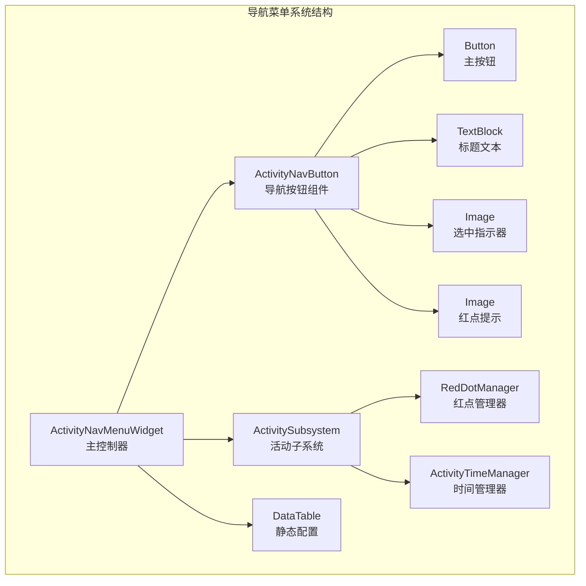
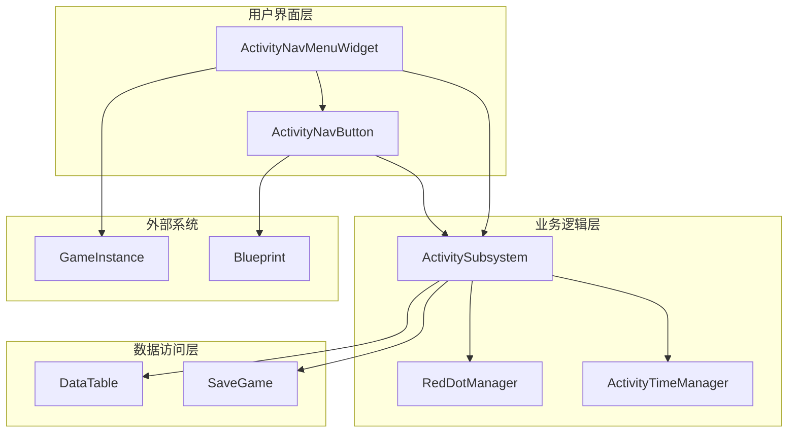
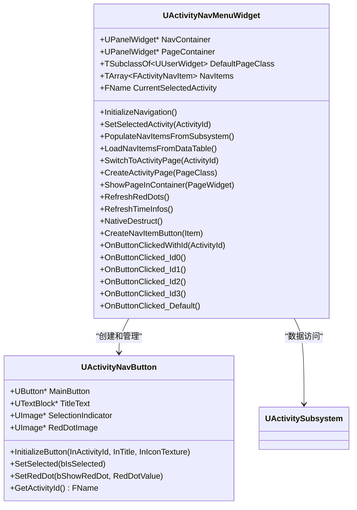
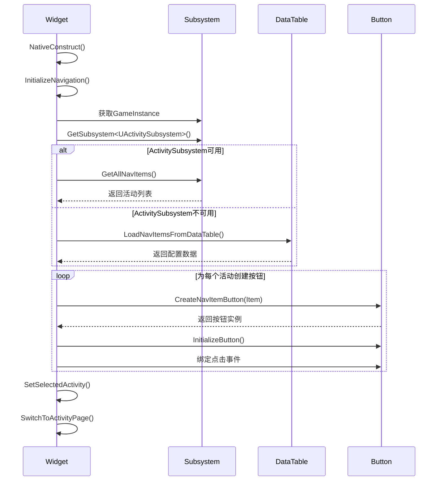
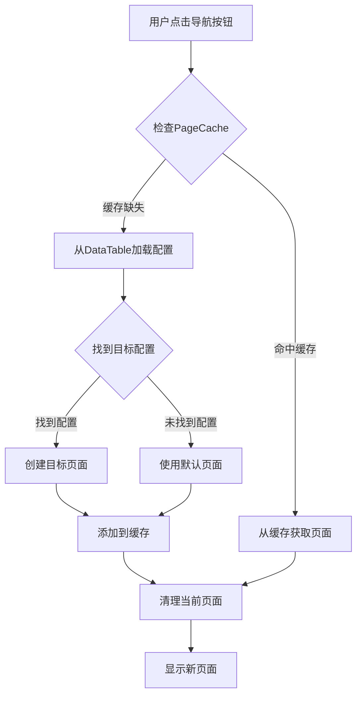
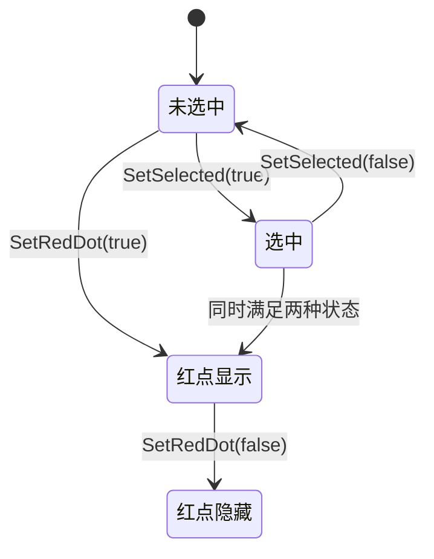
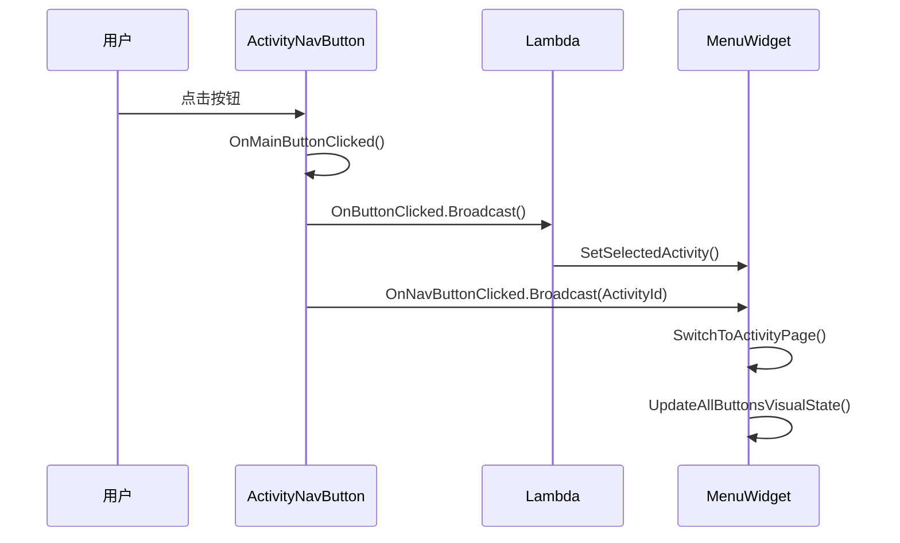
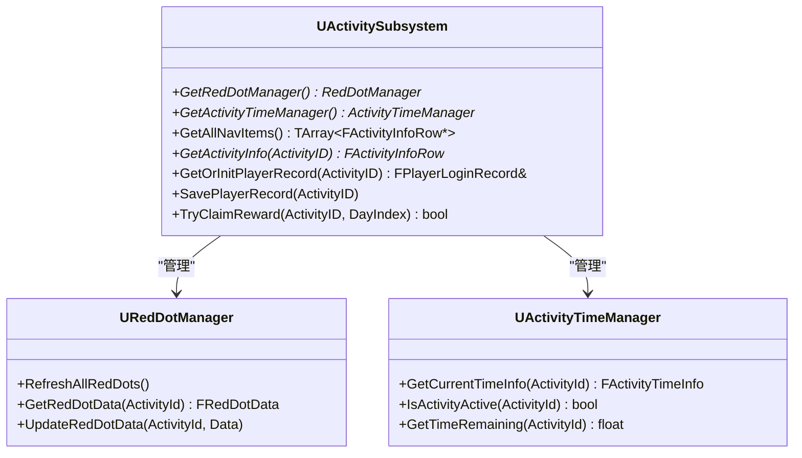
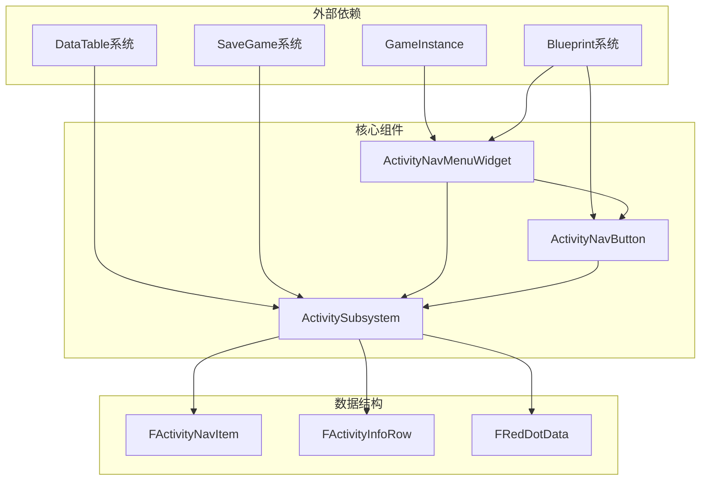
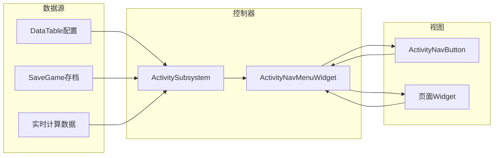

# 导航菜单页面

<cite>
**本文档引用的文件**
- [ActivityNavMenuWidget.h](file://MetalSlug01/Source/MetalSlug01/Public/UI/Activity/Pages/Navigation/ActivityNavMenuWidget.h)
- [ActivityNavMenuWidget.cpp](file://MetalSlug01/Source/MetalSlug01/Private/UI/Activity/Pages/Navigation/ActivityNavMenuWidget.cpp)
- [ActivityNavButton.h](file://MetalSlug01/Source/MetalSlug01/Public/UI/Activity/Pages/Navigation/ActivityNavButton.h)
- [ActivityNavButton.cpp](file://MetalSlug01/Source/MetalSlug01/Private/UI/Activity/Pages/Navigation/ActivityNavButton.cpp)
- [ActivitySubsystem.h](file://MetalSlug01/Source/MetalSlug01/Public/UI/Activity/Core/ActivitySubsystem.h)
- [ActivitySubsystem.cpp](file://MetalSlug01/Source/MetalSlug01/Private/UI/Activity/Core/ActivitySubsystem.cpp)
- [DailyLoginSave.h](file://MetalSlug01/Source/MetalSlug01/Public/UI/Activity/Data/DailyLoginSave.h)
- [DailyLoginConfig.h](file://MetalSlug01/Source/MetalSlug01/Public/UI/Activity/Data/DailyLoginConfig.h)
</cite>

## 更新摘要
**变更内容**
- 增强了错误处理机制，包括更完善的空指针检查和资源清理
- 改进了日志记录系统，增加了详细的调试信息输出
- 优化了资源管理，特别是在页面缓存和定时器清理方面
- 新增了多个按钮点击处理函数，支持不同索引的导航按钮
- 改进了页面切换机制，增强了容错能力

## 目录
1. [简介](#简介)
2. [项目结构](#项目结构)
3. [核心组件](#核心组件)
4. [架构概览](#架构概览)
5. [详细组件分析](#详细组件分析)
6. [依赖关系分析](#依赖关系分析)
7. [性能考虑](#性能考虑)
8. [故障排除指南](#故障排除指南)
9. [结论](#结论)
10. [附录](#附录)

## 简介
本文档深入解析MetalSlug项目中的导航菜单页面系统，重点涵盖ActivityNavMenuWidget和ActivityNavButton两个核心组件。该系统实现了活动导航菜单的完整功能，包括菜单布局管理、按钮状态控制、页面路由切换、红点提醒系统以及与ActivitySubsystem的深度集成。

系统采用模块化设计，通过ActivityNavMenuWidget作为主控制器，ActivityNavButton作为独立的导航按钮组件，两者协同工作实现高效的活动导航体验。导航菜单支持多种数据源，包括ActivitySubsystem动态数据、DataTable静态配置以及测试数据，确保系统的灵活性和可扩展性。

**更新** 本版本包含了对ActivityNavMenuWidget.cpp的重大改进，包括增强的错误处理、改进的日志记录和更好的资源管理机制。

## 项目结构
导航菜单系统位于项目的UI/Activity/Pages/Navigation目录下，采用清晰的分层架构：

**图表来源**
- [ActivityNavMenuWidget.h](file://MetalSlug01/Source/MetalSlug01/Public/UI/Activity/Pages/Navigation/ActivityNavMenuWidget.h#L16-L201)
- [ActivityNavButton.h](file://MetalSlug01/Source/MetalSlug01/Public/UI/Activity/Pages/Navigation/ActivityNavButton.h#L15-L96)
- [ActivitySubsystem.h](file://MetalSlug01/Source/MetalSlug01/Public/UI/Activity/Core/ActivitySubsystem.h#L29-L178)

**章节来源**
- [ActivityNavMenuWidget.h](file://MetalSlug01/Source/MetalSlug01/Public/UI/Activity/Pages/Navigation/ActivityNavMenuWidget.h#L1-L201)
- [ActivityNavButton.h](file://MetalSlug01/Source/MetalSlug01/Public/UI/Activity/Pages/Navigation/ActivityNavButton.h#L1-L96)
- [ActivitySubsystem.h](file://MetalSlug01/Source/MetalSlug01/Public/UI/Activity/Core/ActivitySubsystem.h#L1-L178)

## 核心组件
导航菜单系统由三个核心组件构成，每个组件都有明确的职责分工：

### ActivityNavMenuWidget - 主控制器
作为导航菜单的中央控制器，负责整体的导航逻辑管理和状态同步。主要功能包括：
- 导航项数据管理（从ActivitySubsystem或DataTable获取）
- 页面路由和切换机制
- 按钮状态同步和视觉反馈
- 红点提醒系统的集成
- 定时刷新机制
- **新增** 增强的错误处理和资源管理
- **新增** 改进的日志记录系统

### ActivityNavButton - 导航按钮组件
独立的UI组件，专注于单个导航项的显示和交互。核心特性：
- 图标、标题和选中状态的可视化展示
- 红点状态的动态更新
- 点击事件的处理和传播
- 与主控制器的状态同步

### ActivitySubsystem - 活动子系统
提供活动数据的统一管理入口，包含：
- 活动信息的查询和管理
- 红点管理器的访问接口
- 活动时间管理功能
- 动态存档修改器的支持

**章节来源**
- [ActivityNavMenuWidget.h](file://MetalSlug01/Source/MetalSlug01/Public/UI/Activity/Pages/Navigation/ActivityNavMenuWidget.h#L16-L201)
- [ActivityNavButton.h](file://MetalSlug01/Source/MetalSlug01/Public/UI/Activity/Pages/Navigation/ActivityNavButton.h#L15-L96)
- [ActivitySubsystem.h](file://MetalSlug01/Source/MetalSlug01/Public/UI/Activity/Core/ActivitySubsystem.h#L29-L178)

## 架构概览
导航菜单系统采用分层架构设计，确保各组件间的松耦合和高内聚：

**图表来源**
- [ActivityNavMenuWidget.cpp](file://MetalSlug01/Source/MetalSlug01/Private/UI/Activity/Pages/Navigation/ActivityNavMenuWidget.cpp#L1-L967)
- [ActivitySubsystem.cpp](file://MetalSlug01/Source/MetalSlug01/Private/UI/Activity/Core/ActivitySubsystem.cpp#L1-L599)

系统架构的关键特点：
1. **分层解耦**：UI层、业务逻辑层和数据访问层职责明确分离
2. **事件驱动**：通过委托和事件实现组件间通信
3. **数据驱动**：主要配置来源于DataTable，支持动态更新
4. **状态管理**：统一的状态管理模式确保UI一致性
5. **资源管理**：改进的资源清理和缓存管理机制

**章节来源**
- [ActivityNavMenuWidget.cpp](file://MetalSlug01/Source/MetalSlug01/Private/UI/Activity/Pages/Navigation/ActivityNavMenuWidget.cpp#L14-L152)
- [ActivitySubsystem.cpp](file://MetalSlug01/Source/MetalSlug01/Private/UI/Activity/Core/ActivitySubsystem.cpp#L7-L39)

## 详细组件分析

### ActivityNavMenuWidget 详细分析

#### 组件结构图

**图表来源**
- [ActivityNavMenuWidget.h](file://MetalSlug01/Source/MetalSlug01/Public/UI/Activity/Pages/Navigation/ActivityNavMenuWidget.h#L16-L201)
- [ActivityNavButton.h](file://MetalSlug01/Source/MetalSlug01/Public/UI/Activity/Pages/Navigation/ActivityNavButton.h#L15-L96)

#### 初始化流程
导航菜单的初始化过程遵循严格的步骤顺序：

**图表来源**
- [ActivityNavMenuWidget.cpp](file://MetalSlug01/Source/MetalSlug01/Private/UI/Activity/Pages/Navigation/ActivityNavMenuWidget.cpp#L56-L152)

#### 页面切换机制
页面切换采用智能缓存策略，避免重复创建相同的页面：

**图表来源**
- [ActivityNavMenuWidget.cpp](file://MetalSlug01/Source/MetalSlug01/Private/UI/Activity/Pages/Navigation/ActivityNavMenuWidget.cpp#L729-L861)

**更新** 新增了多个按钮点击处理函数，支持不同索引的导航按钮：
- `OnButtonClicked_Id0()` - 处理索引0的按钮点击
- `OnButtonClicked_Id1()` - 处理索引1的按钮点击  
- `OnButtonClicked_Id2()` - 处理索引2的按钮点击
- `OnButtonClicked_Id3()` - 处理索引3的按钮点击
- `OnButtonClicked_Default()` - 处理默认按钮点击

**章节来源**
- [ActivityNavMenuWidget.cpp](file://MetalSlug01/Source/MetalSlug01/Private/UI/Activity/Pages/Navigation/ActivityNavMenuWidget.cpp#L56-L152)
- [ActivityNavMenuWidget.cpp](file://MetalSlug01/Source/MetalSlug01/Private/UI/Activity/Pages/Navigation/ActivityNavMenuWidget.cpp#L729-L967)

### ActivityNavButton 组件分析

#### 按钮状态管理系统
ActivityNavButton实现了完整的状态管理机制：

**图表来源**
- [ActivityNavButton.cpp](file://MetalSlug01/Source/MetalSlug01/Private/UI/Activity/Pages/Navigation/ActivityNavButton.cpp#L46-L69)

#### 事件处理流程
按钮的事件处理采用双层委托机制，确保向后兼容性：

**图表来源**
- [ActivityNavButton.cpp](file://MetalSlug01/Source/MetalSlug01/Private/UI/Activity/Pages/Navigation/ActivityNavButton.cpp#L71-L80)
- [ActivityNavMenuWidget.cpp](file://MetalSlug01/Source/MetalSlug01/Private/UI/Activity/Pages/Navigation/ActivityNavMenuWidget.cpp#L295-L304)

**章节来源**
- [ActivityNavButton.h](file://MetalSlug01/Source/MetalSlug01/Public/UI/Activity/Pages/Navigation/ActivityNavButton.h#L15-L96)
- [ActivityNavButton.cpp](file://MetalSlug01/Source/MetalSlug01/Private/UI/Activity/Pages/Navigation/ActivityNavButton.cpp#L1-L88)

### ActivitySubsystem 集成分析

#### 数据管理架构
ActivitySubsystem作为数据访问层的核心，提供了统一的数据管理接口：

**图表来源**
- [ActivitySubsystem.h](file://MetalSlug01/Source/MetalSlug01/Public/UI/Activity/Core/ActivitySubsystem.h#L29-L178)

**章节来源**
- [ActivitySubsystem.cpp](file://MetalSlug01/Source/MetalSlug01/Private/UI/Activity/Core/ActivitySubsystem.cpp#L41-L75)

## 依赖关系分析

### 组件依赖图
导航菜单系统的依赖关系呈现清晰的层次结构：

**图表来源**
- [DailyLoginSave.h](file://MetalSlug01/Source/MetalSlug01/Public/UI/Activity/Data/DailyLoginSave.h#L168-L226)
- [DailyLoginConfig.h](file://MetalSlug01/Source/MetalSlug01/Public/UI/Activity/Data/DailyLoginConfig.h#L249-L420)

### 数据流分析
系统中的数据流向体现了典型的MVC模式：

**图表来源**
- [ActivityNavMenuWidget.cpp](file://MetalSlug01/Source/MetalSlug01/Private/UI/Activity/Pages/Navigation/ActivityNavMenuWidget.cpp#L463-L507)
- [ActivitySubsystem.cpp](file://MetalSlug01/Source/MetalSlug01/Private/UI/Activity/Core/ActivitySubsystem.cpp#L51-L75)

**章节来源**
- [ActivityNavMenuWidget.cpp](file://MetalSlug01/Source/MetalSlug01/Private/UI/Activity/Pages/Navigation/ActivityNavMenuWidget.cpp#L463-L507)
- [ActivitySubsystem.cpp](file://MetalSlug01/Source/MetalSlug01/Private/UI/Activity/Core/ActivitySubsystem.cpp#L51-L75)

## 性能考虑
导航菜单系统在设计时充分考虑了性能优化：

### 内存管理
- **页面缓存机制**：使用TMap<FName, TWeakObjectPtr<UUserWidget>> PageCache避免重复创建页面实例
- **弱引用管理**：通过TWeakObjectPtr防止内存泄漏
- **定时器清理**：在NativeDestruct中清理所有定时器和缓存
- **资源清理**：改进的析构函数确保所有资源得到正确释放

### 渲染优化
- **延迟加载**：按钮图标和页面仅在需要时加载
- **可见性控制**：精确控制组件的显示和隐藏状态
- **批量更新**：通过UpdateAllButtonsVisualState统一更新所有按钮状态

### 数据访问优化
- **数据预加载**：在初始化阶段一次性加载所需数据
- **缓存策略**：ActivityNavItem结构使用LinkedActivityId避免数据冗余
- **懒加载模式**：图标纹理采用延迟加载方式

**更新** 新增了增强的资源管理机制：
- 改进的页面缓存清理逻辑
- 更完善的定时器管理
- 增强的错误处理和资源释放

## 故障排除指南

### 常见问题诊断
1. **导航按钮不显示**
   - 检查NavContainer是否正确绑定
   - 验证ActivityNavItem数据是否正确加载
   - 确认按钮模板类路径是否正确

2. **页面切换失败**
   - 检查TargetPageClass配置是否正确
   - 验证页面类是否正确继承UUserWidget
   - 确认页面缓存机制是否正常工作

3. **红点显示异常**
   - 检查ActivitySubsystem是否正确初始化
   - 验证RedDotManager的数据更新逻辑
   - 确认定时刷新机制是否正常

4. **内存泄漏问题**
   - 检查NativeDestruct函数是否正确清理资源
   - 验证PageCache中的弱引用是否正确管理
   - 确认定时器是否正确清理

### 调试建议
- 启用详细的日志输出，重点关注InitializeNavigation和SwitchToActivityPage函数
- 使用断点跟踪按钮点击事件的完整流程
- 监控内存使用情况，特别是页面缓存的大小
- 验证数据加载的完整性和一致性
- **新增** 检查错误处理分支的执行情况

**章节来源**
- [ActivityNavMenuWidget.cpp](file://MetalSlug01/Source/MetalSlug01/Private/UI/Activity/Pages/Navigation/ActivityNavMenuWidget.cpp#L14-L54)
- [ActivityNavButton.cpp](file://MetalSlug01/Source/MetalSlug01/Private/UI/Activity/Pages/Navigation/ActivityNavButton.cpp#L4-L22)

## 结论
导航菜单系统展现了优秀的软件工程实践，通过清晰的分层架构、完善的组件设计和高效的性能优化，实现了复杂活动导航功能的稳定运行。系统的主要优势包括：

1. **模块化设计**：ActivityNavMenuWidget和ActivityNavButton职责明确，便于维护和扩展
2. **数据驱动**：基于DataTable的配置管理，支持动态更新和热重载
3. **状态管理**：统一的状态管理模式确保UI一致性和用户体验
4. **性能优化**：智能缓存和延迟加载机制保证系统响应速度
5. **错误处理**：完善的错误检测和恢复机制提升系统稳定性
6. **资源管理**：改进的资源清理和缓存管理机制确保内存安全

**更新** 本版本的重大改进包括：
- 增强的错误处理机制，包括更完善的空指针检查
- 改进的日志记录系统，提供详细的调试信息
- 更好的资源管理，特别是在页面缓存和定时器清理方面
- 新增的多索引按钮点击处理函数
- 改进的页面切换容错能力

该系统为类似的游戏活动导航需求提供了优秀的参考实现，其设计理念和架构模式具有广泛的适用性和推广价值。

## 附录

### API 参考

#### ActivityNavMenuWidget 主要接口
- `InitializeNavigation()` - 初始化导航系统
- `SetSelectedActivity(FName)` - 设置选中活动
- `SwitchToActivityPage(FName)` - 切换到指定活动页面
- `PopulateNavItemsFromSubsystem()` - 从ActivitySubsystem填充导航项
- `LoadNavItemsFromDataTable()` - 从DataTable加载导航项
- **新增** `OnButtonClicked_Id0()` - 处理索引0的按钮点击
- **新增** `OnButtonClicked_Id1()` - 处理索引1的按钮点击
- **新增** `OnButtonClicked_Id2()` - 处理索引2的按钮点击
- **新增** `OnButtonClicked_Id3()` - 处理索引3的按钮点击
- **新增** `OnButtonClicked_Default()` - 处理默认按钮点击

#### ActivityNavButton 主要接口
- `InitializeButton(FName, FText, UTexture2D*)` - 初始化按钮
- `SetSelected(bool)` - 设置选中状态
- `SetRedDot(bool, int32)` - 设置红点状态
- `GetActivityId() FName` - 获取活动ID

### 集成示例
系统支持多种集成方式：
1. **蓝图集成**：通过UPROPERTY绑定实现可视化配置
2. **C++编程**：通过委托和事件实现程序化控制
3. **配置驱动**：通过DataTable实现动态配置管理
4. **存档集成**：与SaveGame系统无缝集成

### 定制指南
1. **添加新菜单项**：在DataTable中添加新的FActivityInfoRow记录
2. **自定义样式**：通过蓝图修改按钮的外观和行为
3. **调整导航逻辑**：通过重写相关函数实现自定义导航规则
4. **扩展功能**：基于现有架构添加新的导航功能
5. **新增按钮索引**：利用新增的索引处理函数支持更多导航按钮