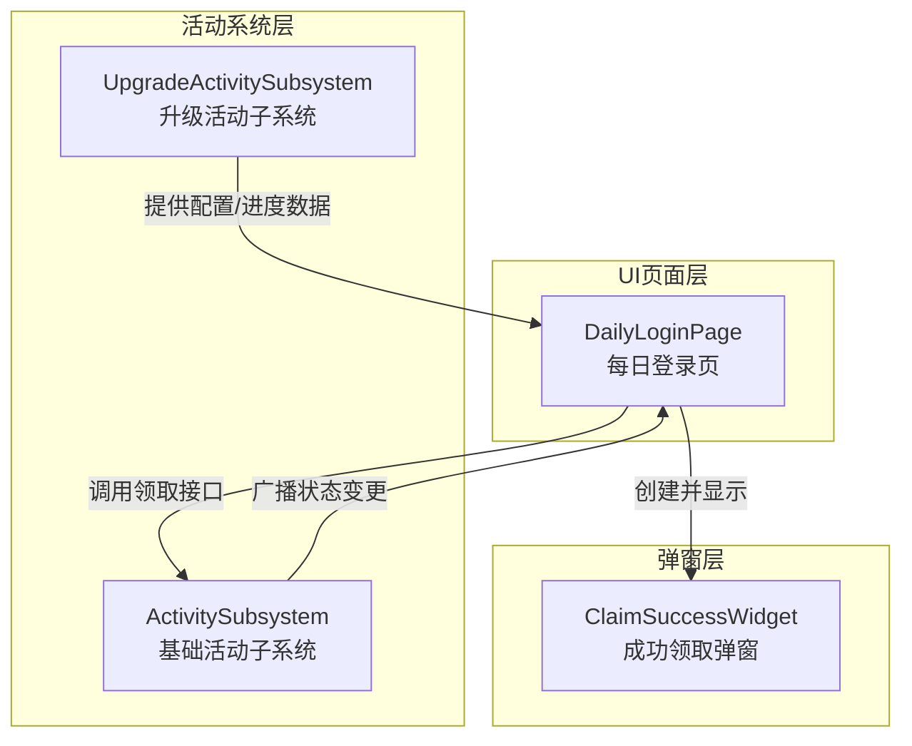
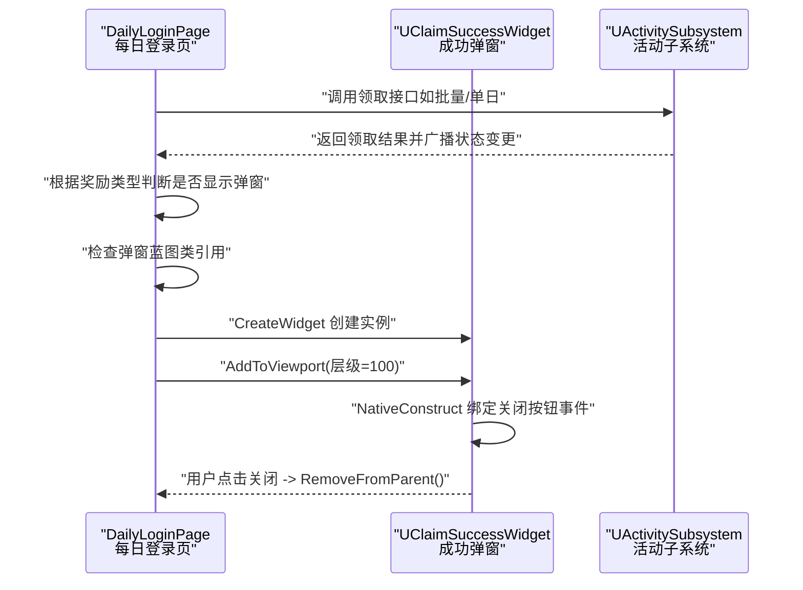
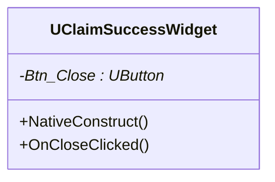
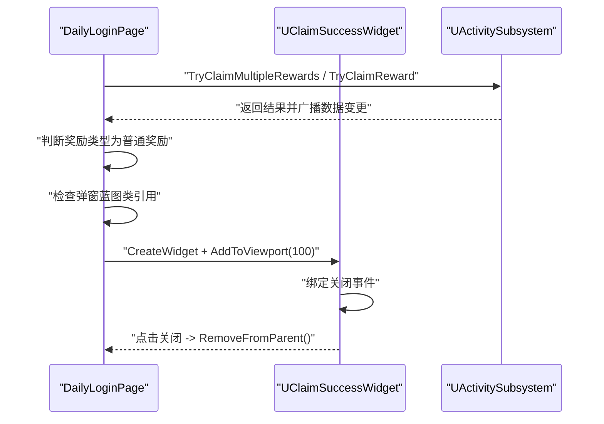
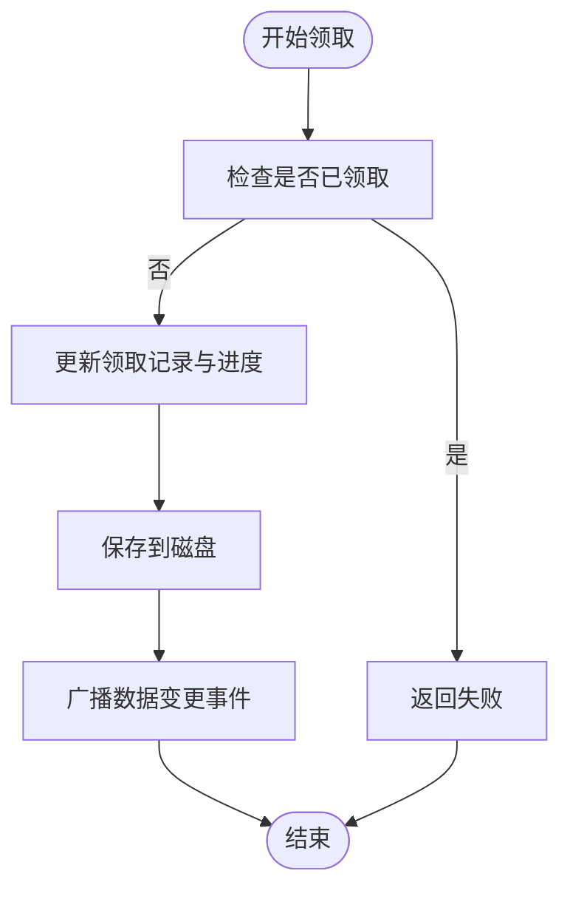
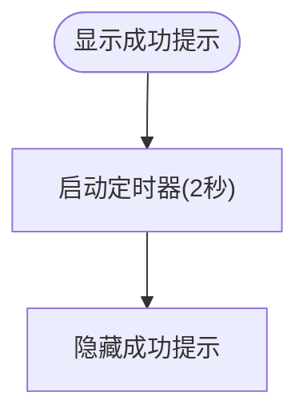
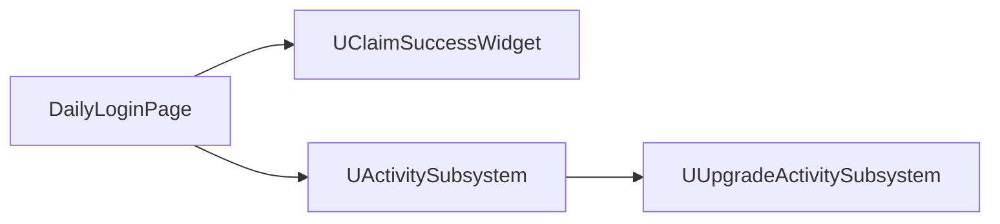

# 成功领取页面

<cite>
**本文引用的文件**
- [ClaimSuccessWidget.h](file://MetalSlug01/Source/MetalSlug01/Public/UI/Activity/Pages/ClaimSuccess/ClaimSuccessWidget.h)
- [ClaimSuccessWidget.cpp](file://MetalSlug01/Source/MetalSlug01/Private/UI/Activity/Pages/ClaimSuccess/ClaimSuccessWidget.cpp)
- [DailyLoginPage.h](file://MetalSlug01/Source/MetalSlug01/Public/UI/Activity/Pages/DailyLogin/DailyLoginPage.h)
- [DailyLoginPage.cpp](file://MetalSlug01/Source/MetalSlug01/Private/UI/Activity/Pages/DailyLogin/DailyLoginPage.cpp)
- [ActivitySubsystem.h](file://MetalSlug01/Source/MetalSlug01/Public/UI/Activity/Core/ActivitySubsystem.h)
- [ActivitySubsystem.cpp](file://MetalSlug01/Source/MetalSlug01/Private/UI/Activity/Core/ActivitySubsystem.cpp)
- [UpgradeActivitySubsystem.h](file://MetalSlug01/Source/MetalSlug01/Public/UI/Activity/Core/UpgradeActivitySubsystem.h)
- [UpgradeActivitySubsystem.cpp](file://MetalSlug01/Source/MetalSlug01/Private/UI/Activity/Core/UpgradeActivitySubsystem.cpp)
- [ExperienceChestClaimWidget.h](file://MetalSlug01/Source/MetalSlug01/Public/UI/Activity/Pages/DailyUpgradeReward/ExperienceChestClaimWidget.h)
- [ExperienceChestClaimWidget.cpp](file://MetalSlug01/Source/MetalSlug01/Private/UI/Activity/Pages/DailyUpgradeReward/ExperienceChestClaimWidget.cpp)
</cite>

## 目录
1. [简介](#简介)
2. [项目结构](#项目结构)
3. [核心组件](#核心组件)
4. [架构总览](#架构总览)
5. [详细组件分析](#详细组件分析)
6. [依赖关系分析](#依赖关系分析)
7. [性能考虑](#性能考虑)
8. [故障排查指南](#故障排查指南)
9. [结论](#结论)
10. [附录](#附录)

## 简介
本文件针对“成功领取页面”（ClaimSuccessWidget）进行深入技术说明，涵盖其设计与实现细节，包括：
- 弹窗动画与视觉反馈
- 奖励展示与信息呈现
- 确认按钮交互与关闭机制
- 页面状态管理与生命周期
- 与活动系统的交互流程（领取结果通知、状态同步、后续处理）
- 用户体验设计要点（视觉反馈、操作引导、错误处理）
- 页面定制指南（自定义成功动画、调整展示内容、修改关闭逻辑）
- 完整的API参考与使用示例

## 项目结构
成功领取页面位于活动系统UI模块中，采用“页面-弹窗”的分层组织方式：
- 页面层：每日登录页（DailyLoginPage）负责触发弹窗显示
- 弹窗层：成功领取弹窗（ClaimSuccessWidget）负责展示与交互
- 活动系统层：ActivitySubsystem/UpgradeActivitySubsystem负责数据与状态管理

图表来源
- [DailyLoginPage.cpp](file://MetalSlug01/Source/MetalSlug01/Private/UI/Activity/Pages/DailyLogin/DailyLoginPage.cpp#L747-L778)
- [ClaimSuccessWidget.cpp](file://MetalSlug01/Source/MetalSlug01/Private/UI/Activity/Pages/ClaimSuccess/ClaimSuccessWidget.cpp#L1-L28)
- [ActivitySubsystem.cpp](file://MetalSlug01/Source/MetalSlug01/Private/UI/Activity/Core/ActivitySubsystem.cpp#L257-L299)
- [UpgradeActivitySubsystem.cpp](file://MetalSlug01/Source/MetalSlug01/Private/UI/Activity/Core/UpgradeActivitySubsystem.cpp#L32-L36)

章节来源
- [DailyLoginPage.h](file://MetalSlug01/Source/MetalSlug01/Public/UI/Activity/Pages/DailyLogin/DailyLoginPage.h#L1-L51)
- [DailyLoginPage.cpp](file://MetalSlug01/Source/MetalSlug01/Private/UI/Activity/Pages/DailyLogin/DailyLoginPage.cpp#L747-L778)
- [ClaimSuccessWidget.h](file://MetalSlug01/Source/MetalSlug01/Public/UI/Activity/Pages/ClaimSuccess/ClaimSuccessWidget.h#L1-L21)
- [ClaimSuccessWidget.cpp](file://MetalSlug01/Source/MetalSlug01/Private/UI/Activity/Pages/ClaimSuccess/ClaimSuccessWidget.cpp#L1-L28)

## 核心组件
- 成功领取弹窗（UClaimSuccessWidget）
  - 职责：接收并响应关闭按钮事件，负责弹窗的显示与移除
  - 关键点：在构造阶段绑定按钮事件；点击后从父容器移除
- 每日登录页（UDailyLoginPage）
  - 职责：根据奖励类型决定是否显示成功弹窗；负责创建并显示弹窗
  - 关键点：持有弹窗蓝图类引用；通过CreateWidget创建实例并添加到视口
- 活动系统（UActivitySubsystem/UUpgradeActivitySubsystem）
  - 职责：维护玩家领取状态、进度、时间戳；广播数据变更事件
  - 关键点：批量领取、单日领取、进度智能更新、存档与广播

章节来源
- [ClaimSuccessWidget.h](file://MetalSlug01/Source/MetalSlug01/Public/UI/Activity/Pages/ClaimSuccess/ClaimSuccessWidget.h#L7-L21)
- [ClaimSuccessWidget.cpp](file://MetalSlug01/Source/MetalSlug01/Private/UI/Activity/Pages/ClaimSuccess/ClaimSuccessWidget.cpp#L7-L28)
- [DailyLoginPage.h](file://MetalSlug01/Source/MetalSlug01/Public/UI/Activity/Pages/DailyLogin/DailyLoginPage.h#L28-L34)
- [DailyLoginPage.cpp](file://MetalSlug01/Source/MetalSlug01/Private/UI/Activity/Pages/DailyLogin/DailyLoginPage.cpp#L747-L778)
- [ActivitySubsystem.h](file://MetalSlug01/Source/MetalSlug01/Public/UI/Activity/Core/ActivitySubsystem.h#L35-L47)
- [UpgradeActivitySubsystem.h](file://MetalSlug01/Source/MetalSlug01/Public/UI/Activity/Core/UpgradeActivitySubsystem.h#L35-L47)

## 架构总览
成功领取弹窗的交互流程如下：

图表来源
- [DailyLoginPage.cpp](file://MetalSlug01/Source/MetalSlug01/Private/UI/Activity/Pages/DailyLogin/DailyLoginPage.cpp#L747-L778)
- [ClaimSuccessWidget.cpp](file://MetalSlug01/Source/MetalSlug01/Private/UI/Activity/Pages/ClaimSuccess/ClaimSuccessWidget.cpp#L7-L28)
- [ActivitySubsystem.cpp](file://MetalSlug01/Source/MetalSlug01/Private/UI/Activity/Core/ActivitySubsystem.cpp#L257-L299)

## 详细组件分析

### 成功领取弹窗（UClaimSuccessWidget）
- 生命周期与事件绑定
  - 在NativeConstruct中清理旧绑定并绑定关闭按钮事件
  - OnCloseClicked触发后从父容器移除，完成弹窗关闭
- 视觉与交互
  - 仅包含一个关闭按钮（Btn_Close），命名需与蓝图一致
  - 无内置动画或奖励展示逻辑，主要承担交互入口
- 扩展建议
  - 如需动画：可在OnCloseClicked前播放淡出/缩放动画，完成后移除
  - 如需奖励展示：可引入奖励列表控件并在弹窗内布局

图表来源
- [ClaimSuccessWidget.h](file://MetalSlug01/Source/MetalSlug01/Public/UI/Activity/Pages/ClaimSuccess/ClaimSuccessWidget.h#L7-L21)
- [ClaimSuccessWidget.cpp](file://MetalSlug01/Source/MetalSlug01/Private/UI/Activity/Pages/ClaimSuccess/ClaimSuccessWidget.cpp#L7-L28)

章节来源
- [ClaimSuccessWidget.h](file://MetalSlug01/Source/MetalSlug01/Public/UI/Activity/Pages/ClaimSuccess/ClaimSuccessWidget.h#L7-L21)
- [ClaimSuccessWidget.cpp](file://MetalSlug01/Source/MetalSlug01/Private/UI/Activity/Pages/ClaimSuccess/ClaimSuccessWidget.cpp#L7-L28)

### 每日登录页（UDailyLoginPage）与弹窗显示
- 触发逻辑
  - HandleRewardClick根据奖励类型决定是否显示成功弹窗
  - ShowClaimSuccessPopup负责创建并显示弹窗
- 创建与显示
  - 检查弹窗蓝图类引用是否设置
  - 通过CreateWidget创建实例并AddToViewport(层级=100)
- 状态联动
  - 弹窗显示前已完成领取动作（如批量领取），弹窗仅作结果反馈

图表来源
- [DailyLoginPage.cpp](file://MetalSlug01/Source/MetalSlug01/Private/UI/Activity/Pages/DailyLogin/DailyLoginPage.cpp#L611-L645)
- [DailyLoginPage.cpp](file://MetalSlug01/Source/MetalSlug01/Private/UI/Activity/Pages/DailyLogin/DailyLoginPage.cpp#L747-L778)
- [ActivitySubsystem.cpp](file://MetalSlug01/Source/MetalSlug01/Private/UI/Activity/Core/ActivitySubsystem.cpp#L257-L299)

章节来源
- [DailyLoginPage.h](file://MetalSlug01/Source/MetalSlug01/Public/UI/Activity/Pages/DailyLogin/DailyLoginPage.h#L28-L34)
- [DailyLoginPage.cpp](file://MetalSlug01/Source/MetalSlug01/Private/UI/Activity/Pages/DailyLogin/DailyLoginPage.cpp#L611-L645)
- [DailyLoginPage.cpp](file://MetalSlug01/Source/MetalSlug01/Private/UI/Activity/Pages/DailyLogin/DailyLoginPage.cpp#L747-L778)

### 活动系统（UActivitySubsystem/UUpgradeActivitySubsystem）
- 数据与状态管理
  - 维护玩家领取记录、进度、最后领取时间戳
  - 智能进度更新：顺序领取推进进度，跳跃式领取保持原进度
  - 批量领取接口：TryClaimMultipleRewards
- 广播与同步
  - 领取成功后广播OnActivityDataChanged，页面监听并刷新UI
- 升级活动扩展
  - UpgradeActivitySubsystem提供配置与进度数据，供其他页面复用

图表来源
- [ActivitySubsystem.cpp](file://MetalSlug01/Source/MetalSlug01/Private/UI/Activity/Core/ActivitySubsystem.cpp#L257-L299)

章节来源
- [ActivitySubsystem.h](file://MetalSlug01/Source/MetalSlug01/Public/UI/Activity/Core/ActivitySubsystem.h#L35-L47)
- [ActivitySubsystem.cpp](file://MetalSlug01/Source/MetalSlug01/Private/UI/Activity/Core/ActivitySubsystem.cpp#L257-L299)
- [UpgradeActivitySubsystem.h](file://MetalSlug01/Source/MetalSlug01/Public/UI/Activity/Core/UpgradeActivitySubsystem.h#L35-L47)
- [UpgradeActivitySubsystem.cpp](file://MetalSlug01/Source/MetalSlug01/Private/UI/Activity/Core/UpgradeActivitySubsystem.cpp#L32-L36)

### 奖励展示与视觉反馈（对比参考：ExperienceChestClaimWidget）
虽然成功弹窗本身不展示奖励，但可参考经验宝箱领取控件的视觉反馈模式：
- 成功提示文本可见性控制
- 自动定时隐藏（如2秒后隐藏）
- 进度条与图标颜色随状态变化

图表来源
- [ExperienceChestClaimWidget.cpp](file://MetalSlug01/Source/MetalSlug01/Private/UI/Activity/Pages/DailyUpgradeReward/ExperienceChestClaimWidget.cpp#L258-L276)

章节来源
- [ExperienceChestClaimWidget.h](file://MetalSlug01/Source/MetalSlug01/Public/UI/Activity/Pages/DailyUpgradeReward/ExperienceChestClaimWidget.h#L1-L303)
- [ExperienceChestClaimWidget.cpp](file://MetalSlug01/Source/MetalSlug01/Private/UI/Activity/Pages/DailyUpgradeReward/ExperienceChestClaimWidget.cpp#L258-L276)

## 依赖关系分析
- 组件耦合
  - DailyLoginPage对UClaimSuccessWidget存在强依赖（蓝图类引用）
  - UClaimSuccessWidget对UButton存在绑定依赖（Btn_Close命名约束）
  - DailyLoginPage依赖UActivitySubsystem进行领取操作与状态同步
- 外部依赖
  - UUpgradeActivitySubsystem为升级活动提供配置数据，间接影响页面行为

图表来源
- [DailyLoginPage.h](file://MetalSlug01/Source/MetalSlug01/Public/UI/Activity/Pages/DailyLogin/DailyLoginPage.h#L1-L51)
- [ClaimSuccessWidget.h](file://MetalSlug01/Source/MetalSlug01/Public/UI/Activity/Pages/ClaimSuccess/ClaimSuccessWidget.h#L1-L21)
- [ActivitySubsystem.h](file://MetalSlug01/Source/MetalSlug01/Public/UI/Activity/Core/ActivitySubsystem.h#L35-L47)
- [UpgradeActivitySubsystem.h](file://MetalSlug01/Source/MetalSlug01/Public/UI/Activity/Core/UpgradeActivitySubsystem.h#L35-L47)

章节来源
- [DailyLoginPage.h](file://MetalSlug01/Source/MetalSlug01/Public/UI/Activity/Pages/DailyLogin/DailyLoginPage.h#L1-L51)
- [ClaimSuccessWidget.h](file://MetalSlug01/Source/MetalSlug01/Public/UI/Activity/Pages/ClaimSuccess/ClaimSuccessWidget.h#L1-L21)
- [ActivitySubsystem.h](file://MetalSlug01/Source/MetalSlug01/Public/UI/Activity/Core/ActivitySubsystem.h#L35-L47)
- [UpgradeActivitySubsystem.h](file://MetalSlug01/Source/MetalSlug01/Public/UI/Activity/Core/UpgradeActivitySubsystem.h#L35-L47)

## 性能考虑
- 弹窗创建成本低：仅包含按钮绑定与移除，开销极小
- 事件绑定清理：在NativeConstruct中移除旧绑定，避免重复绑定导致的性能问题
- 状态广播：活动系统在领取后广播事件，页面按需刷新，避免全量重绘
- 建议
  - 若未来增加复杂动画，优先使用蓝图动画或轻量级插值，避免在C++中做重型计算
  - 控制弹窗层级，避免与更高层级UI产生遮挡冲突

## 故障排查指南
- 弹窗未显示
  - 检查DailyLoginPage中弹窗蓝图类引用是否设置
  - 确认ShowClaimSuccessPopup被正确调用（HandleRewardClick中对普通奖励类型）
- 关闭按钮无效
  - 确认蓝图中按钮命名为Btn_Close
  - 检查NativeConstruct是否成功绑定事件
- 领取状态异常
  - 查看活动系统日志，确认领取接口返回值与进度更新逻辑
  - 检查批量领取是否成功，以及数据变更广播是否触发

章节来源
- [DailyLoginPage.cpp](file://MetalSlug01/Source/MetalSlug01/Private/UI/Activity/Pages/DailyLogin/DailyLoginPage.cpp#L747-L778)
- [ClaimSuccessWidget.cpp](file://MetalSlug01/Source/MetalSlug01/Private/UI/Activity/Pages/ClaimSuccess/ClaimSuccessWidget.cpp#L7-L28)
- [ActivitySubsystem.cpp](file://MetalSlug01/Source/MetalSlug01/Private/UI/Activity/Core/ActivitySubsystem.cpp#L257-L299)

## 结论
成功领取弹窗（UClaimSuccessWidget）以简洁为核心设计理念：仅承载关闭交互，其余状态与数据由页面与活动系统协同完成。其与DailyLoginPage的配合实现了“领取即反馈”的用户体验，同时通过蓝图类引用与事件广播维持了良好的解耦与可扩展性。

## 附录

### API参考

- UClaimSuccessWidget
  - NativeConstruct()
    - 作用：在构造阶段绑定关闭按钮事件
    - 参数：无
    - 返回：无
  - OnCloseClicked()
    - 作用：移除弹窗
    - 参数：无
    - 返回：无
  - 成员变量
    - Btn_Close : UButton*（蓝图绑定）

- UDailyLoginPage
  - ShowClaimSuccessPopup()
    - 作用：创建并显示成功弹窗
    - 参数：无
    - 返回：无
  - HandleRewardClick(DayIndex, RewardType)
    - 作用：根据奖励类型决定是否显示成功弹窗
    - 参数：DayIndex（天数）、RewardType（奖励类型）
    - 返回：无
  - 成员变量
    - ClaimSuccessPopClass : TSubclassOf<UUserWidget>（蓝图类引用）

- UActivitySubsystem
  - TryClaimReward(ActivityID, DayIndex) : bool
    - 作用：单日领取奖励
    - 参数：ActivityID（活动ID）、DayIndex（天数）
    - 返回：是否成功
  - TryClaimMultipleRewards(ActivityID, DayIndices) : bool
    - 作用：批量领取奖励
    - 参数：ActivityID（活动ID）、DayIndices（天数数组）
    - 返回：是否全部成功
  - 广播事件：OnActivityDataChanged

- UUpgradeActivitySubsystem
  - Initialize(...)
    - 作用：预加载配置与历史记录，确保系统可用
    - 参数：FSubsystemCollectionBase
    - 返回：无

章节来源
- [ClaimSuccessWidget.h](file://MetalSlug01/Source/MetalSlug01/Public/UI/Activity/Pages/ClaimSuccess/ClaimSuccessWidget.h#L7-L21)
- [ClaimSuccessWidget.cpp](file://MetalSlug01/Source/MetalSlug01/Private/UI/Activity/Pages/ClaimSuccess/ClaimSuccessWidget.cpp#L7-L28)
- [DailyLoginPage.h](file://MetalSlug01/Source/MetalSlug01/Public/UI/Activity/Pages/DailyLogin/DailyLoginPage.h#L28-L34)
- [DailyLoginPage.cpp](file://MetalSlug01/Source/MetalSlug01/Private/UI/Activity/Pages/DailyLogin/DailyLoginPage.cpp#L747-L778)
- [ActivitySubsystem.h](file://MetalSlug01/Source/MetalSlug01/Public/UI/Activity/Core/ActivitySubsystem.h#L35-L47)
- [ActivitySubsystem.cpp](file://MetalSlug01/Source/MetalSlug01/Private/UI/Activity/Core/ActivitySubsystem.cpp#L257-L299)
- [UpgradeActivitySubsystem.h](file://MetalSlug01/Source/MetalSlug01/Public/UI/Activity/Core/UpgradeActivitySubsystem.h#L35-L47)
- [UpgradeActivitySubsystem.cpp](file://MetalSlug01/Source/MetalSlug01/Private/UI/Activity/Core/UpgradeActivitySubsystem.cpp#L32-L36)

### 使用示例

- 在蓝图中设置弹窗类引用
  - 在DailyLoginPage蓝图中设置ClaimSuccessPopClass为WBP_ClaimSuccessPop
- 触发成功弹窗
  - 在HandleRewardClick中，当奖励类型为普通奖励时调用ShowClaimSuccessPopup
- 自定义关闭逻辑
  - 在UClaimSuccessWidget中扩展OnCloseClicked：先播放动画，再RemoveFromParent

章节来源
- [DailyLoginPage.cpp](file://MetalSlug01/Source/MetalSlug01/Private/UI/Activity/Pages/DailyLogin/DailyLoginPage.cpp#L747-L778)
- [ClaimSuccessWidget.cpp](file://MetalSlug01/Source/MetalSlug01/Private/UI/Activity/Pages/ClaimSuccess/ClaimSuccessWidget.cpp#L24-L28)