# 日常登录页面

<cite>
**本文档引用的文件**
- [DailyLoginPage.cpp](file://MetalSlug01/Source/MetalSlug01/Private/UI/Activity/Pages/DailyLogin/DailyLoginPage.cpp)
- [DailyLoginPage.h](file://MetalSlug01/Source/MetalSlug01/Public/UI/Activity/Pages/DailyLogin/DailyLoginPage.h)
- [DailyLoginDayItemWidget.cpp](file://MetalSlug01/Source/MetalSlug01/Private/UI/Activity/Pages/DailyLogin/DailyLoginDayItemWidget.cpp)
- [DailyLoginDayItemWidget.h](file://MetalSlug01/Source/MetalSlug01/Public/UI/Activity/Pages/DailyLogin/DailyLoginDayItemWidget.h)
- [DailyLoginCheatWidget.cpp](file://MetalSlug01/Source/MetalSlug01/Private/UI/Activity/Pages/DemoWidget/DailyLoginCheatWidget.cpp)
- [DailyLoginCheatWidget.h](file://MetalSlug01/Source/MetalSlug01/Public/UI/Activity/Pages/DemoWidget/DailyLoginCheatWidget.h)
- [ActivitySubsystem.cpp](file://MetalSlug01/Source/MetalSlug01/Private/UI/Activity/Core/ActivitySubsystem.cpp)
- [ActivitySubsystem.h](file://MetalSlug01/Source/MetalSlug01/Public/UI/Activity/Core/ActivitySubsystem.h)
- [DailyLoginConfig.h](file://MetalSlug01/Source/MetalSlug01/Public/UI/Activity/Data/DailyLoginConfig.h)
- [DailyLoginSave.h](file://MetalSlug01/Source/MetalSlug01/Public/UI/Activity/Data/DailyLoginSave.h)
- [DailyLoginSaveModifier.cpp](file://MetalSlug01/Source/MetalSlug01/Private/Tools/DailyLoginSaveModifier.cpp)
- [README_DailyLoginSaveIntegration.md](file://MetalSlug01/Source/MetalSlug01/Public/Tools/README_DailyLoginSaveIntegration.md)
</cite>

## 更新摘要
**所做更改**
- 更新了Cheat工具功能增强的相关说明，包括输入验证、错误处理、通知机制
- 增强了滚动系统修复的详细说明，包括延迟滚动、布局时机处理、边缘情况处理
- 优化了UI交互优化的描述，涵盖异步纹理加载、奖励图标显示
- 新增了防重复调用保护机制的详细说明
- 完善了调试工具的功能说明和使用方法

## 目录
1. [简介](#简介)
2. [项目结构](#项目结构)
3. [核心组件](#核心组件)
4. [架构概览](#架构概览)
5. [详细组件分析](#详细组件分析)
6. [依赖关系分析](#依赖关系分析)
7. [性能考虑](#性能考虑)
8. [故障排除指南](#故障排除指南)
9. [结论](#结论)
10. [附录](#附录)

## 简介

日常登录页面(DailyLoginPage)是MetalSlug游戏活动系统中的核心组件，负责实现每日登录奖励功能。该页面采用模块化设计，通过ActivitySubsystem提供数据驱动的奖励展示机制，支持8天连续登录奖励系统，包含普通奖励和特殊奖励两大类。

**更新** 本次更新重点关注系统稳定性提升，包括Cheat工具功能增强（输入验证、错误处理、通知机制）、滚动系统修复（延迟滚动、布局时机处理、边缘情况处理）、UI交互优化（异步纹理加载、奖励图标显示）。

该系统的核心特点包括：
- **数据驱动的奖励展示**：通过ActivitySubsystem管理玩家进度和奖励配置
- **双层奖励架构**：普通奖励显示在滚动列表中，特殊奖励单独展示
- **完整的交互流程**：从奖励领取到UI状态更新的完整闭环
- **调试友好**：内置作弊工具支持开发调试
- **动态存档管理**：支持实时修改玩家进度和奖励状态
- **防重复调用保护**：通过静态标志防止事件重复触发

## 项目结构

日常登录页面位于UI/Activity/Pages/DailyLogin目录下，采用清晰的分层架构：

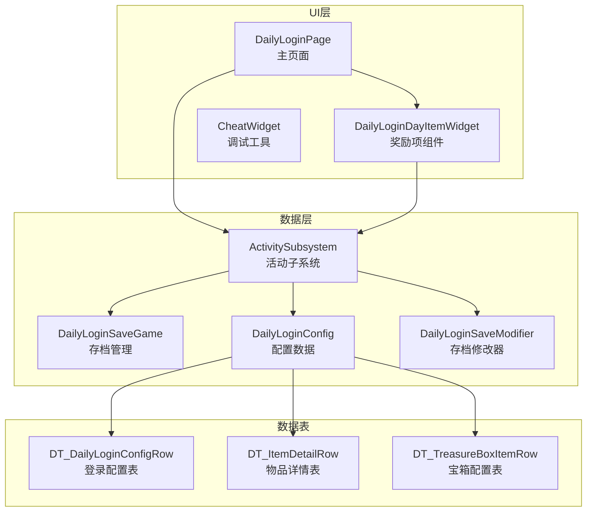

**图表来源**
- [DailyLoginPage.h](file://MetalSlug01/Source/MetalSlug01/Public/UI/Activity/Pages/DailyLogin/DailyLoginPage.h#L1-L101)
- [DailyLoginDayItemWidget.h](file://MetalSlug01/Source/MetalSlug01/Public/UI/Activity/Pages/DailyLogin/DailyLoginDayItemWidget.h#L1-L113)
- [ActivitySubsystem.h](file://MetalSlug01/Source/MetalSlug01/Public/UI/Activity/Core/ActivitySubsystem.h#L1-L178)

**章节来源**
- [DailyLoginPage.h](file://MetalSlug01/Source/MetalSlug01/Public/UI/Activity/Pages/DailyLogin/DailyLoginPage.h#L1-L101)
- [DailyLoginDayItemWidget.h](file://MetalSlug01/Source/MetalSlug01/Public/UI/Activity/Pages/DailyLogin/DailyLoginDayItemWidget.h#L1-L113)
- [ActivitySubsystem.h](file://MetalSlug01/Source/MetalSlug01/Public/UI/Activity/Core/ActivitySubsystem.h#L1-L178)

## 核心组件

### DailyLoginPage - 主页面组件

DailyLoginPage是整个登录系统的主控制器，负责：
- **页面初始化**：绑定ActivitySubsystem和UI组件，执行延迟滚动
- **奖励列表管理**：动态生成和更新8天奖励列表
- **交互事件处理**：处理奖励点击、批量领取等用户操作
- **状态同步**：与ActivitySubsystem保持数据一致性
- **滚动定位**：智能滚动到当前天数位置
- **防重复调用保护**：通过静态标志防止事件重复触发

**更新** 新增了滚动定位功能，通过ScrollToCurrentDay方法确保用户界面始终显示当前可领取的奖励，并增强了防重复调用保护机制。

### DailyLoginDayItemWidget - 奖励项组件

DailyLoginDayItemWidget是每个奖励项的独立UI组件，具备：
- **状态可视化**：根据ERewardState显示不同的UI状态
- **奖励图标加载**：支持普通物品和宝箱奖励的图标显示
- **交互响应**：处理按钮点击事件并触发奖励领取流程
- **特殊奖励支持**：为第8天特殊奖励提供独立的视觉样式
- **异步资源加载**：使用UE4的软资源系统实现延迟加载
- **防重复调用保护**：通过静态标志防止事件重复触发

**更新** 增强了图标加载机制，新增了AddRewardIconFromBoxImage和AddRewardIconFromTreasureBox函数，提供更灵活的宝箱奖励处理能力，并实现了防重复调用保护。

### ActivitySubsystem - 数据管理层

ActivitySubsystem作为数据中枢，提供：
- **玩家进度管理**：维护FPlayerLoginRecord的完整生命周期
- **奖励配置查询**：从DataTable中获取奖励配置信息
- **存档持久化**：通过UDailyLoginSaveGame实现数据持久化
- **事件广播**：向UI层推送数据变更通知
- **动态存档修改**：通过DailyLoginSaveModifier实现实时数据修改

**更新** 集成了动态存档修改器，提供控制台命令和编程接口来修改玩家进度和奖励状态。

**章节来源**
- [DailyLoginPage.cpp](file://MetalSlug01/Source/MetalSlug01/Private/UI/Activity/Pages/DailyLogin/DailyLoginPage.cpp#L24-L66)
- [DailyLoginDayItemWidget.cpp](file://MetalSlug01/Source/MetalSlug01/Private/UI/Activity/Pages/DailyLogin/DailyLoginDayItemWidget.cpp#L14-L75)
- [ActivitySubsystem.cpp](file://MetalSlug01/Source/MetalSlug01/Private/UI/Activity/Core/ActivitySubsystem.cpp#L101-L147)

## 架构概览

系统采用典型的MVC架构模式，通过ActivitySubsystem实现数据与UI的解耦：

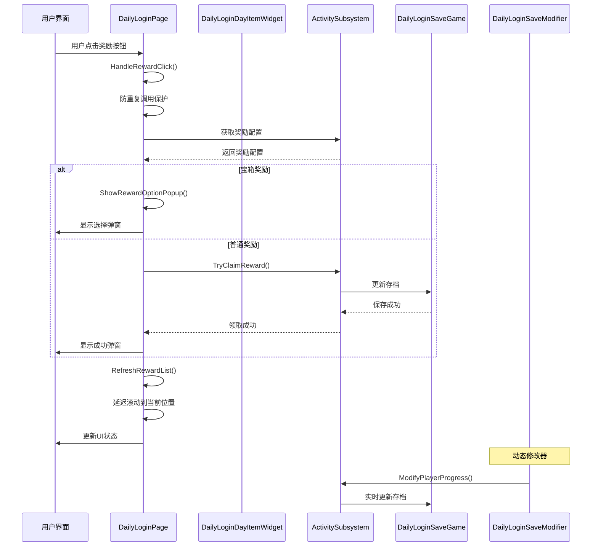

**图表来源**
- [DailyLoginPage.cpp](file://MetalSlug01/Source/MetalSlug01/Private/UI/Activity/Pages/DailyLogin/DailyLoginPage.cpp#L831-L886)
- [ActivitySubsystem.cpp](file://MetalSlug01/Source/MetalSlug01/Private/UI/Activity/Core/ActivitySubsystem.cpp#L247-L298)
- [DailyLoginSaveModifier.cpp](file://MetalSlug01/Source/MetalSlug01/Private/Tools/DailyLoginSaveModifier.cpp#L598-L682)

系统的关键设计原则：
- **单一职责**：每个组件专注于特定功能领域
- **松耦合**：通过接口和事件实现组件间通信
- **可扩展性**：支持新的奖励类型和UI样式
- **数据持久化**：所有玩家进度安全存储
- **动态修改**：支持实时调试和测试
- **防重复调用**：通过静态标志防止事件重复触发

## 详细组件分析

### DailyLoginPage详细分析

#### 页面初始化流程

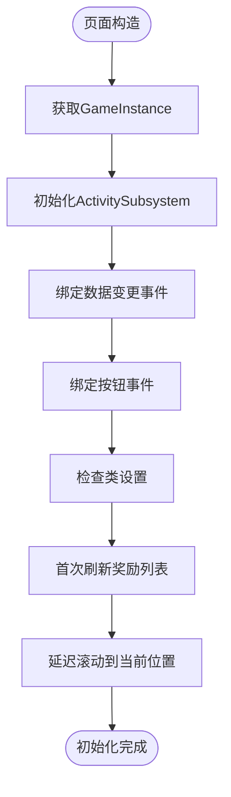

**图表来源**
- [DailyLoginPage.cpp](file://MetalSlug01/Source/MetalSlug01/Private/UI/Activity/Pages/DailyLogin/DailyLoginPage.cpp#L24-L66)

#### 奖励列表生成机制

DailyLoginPage采用双通道奖励展示策略：

1. **普通奖励处理**：DayIndex 1-7 添加到滚动列表
2. **特殊奖励处理**：DayIndex 8 作为特殊奖励单独显示

**更新** 增强了特殊奖励的处理逻辑，通过bIsSpecialReward字段精确识别特殊奖励，并提供降级方案确保在蓝图控件缺失时仍能正常工作。

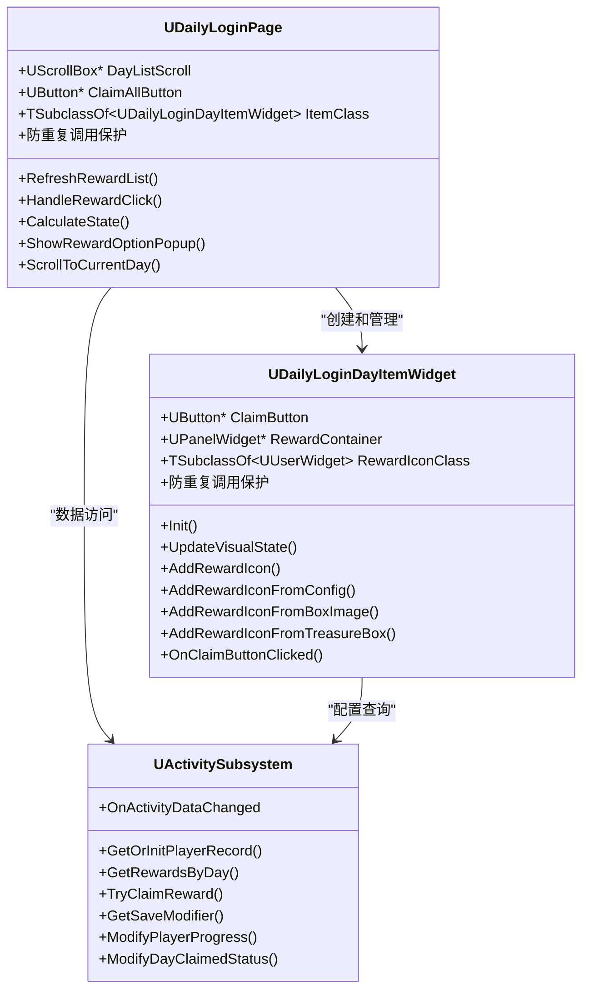

**图表来源**
- [DailyLoginPage.h](file://MetalSlug01/Source/MetalSlug01/Public/UI/Activity/Pages/DailyLogin/DailyLoginPage.h#L9-L101)
- [DailyLoginDayItemWidget.h](file://MetalSlug01/Source/MetalSlug01/Public/UI/Activity/Pages/DailyLogin/DailyLoginDayItemWidget.h#L11-L113)
- [ActivitySubsystem.h](file://MetalSlug01/Source/MetalSlug01/Public/UI/Activity/Core/ActivitySubsystem.h#L1-L178)

#### 奖励状态计算逻辑

**更新** 优化了状态计算逻辑，提供更精确的状态判断：

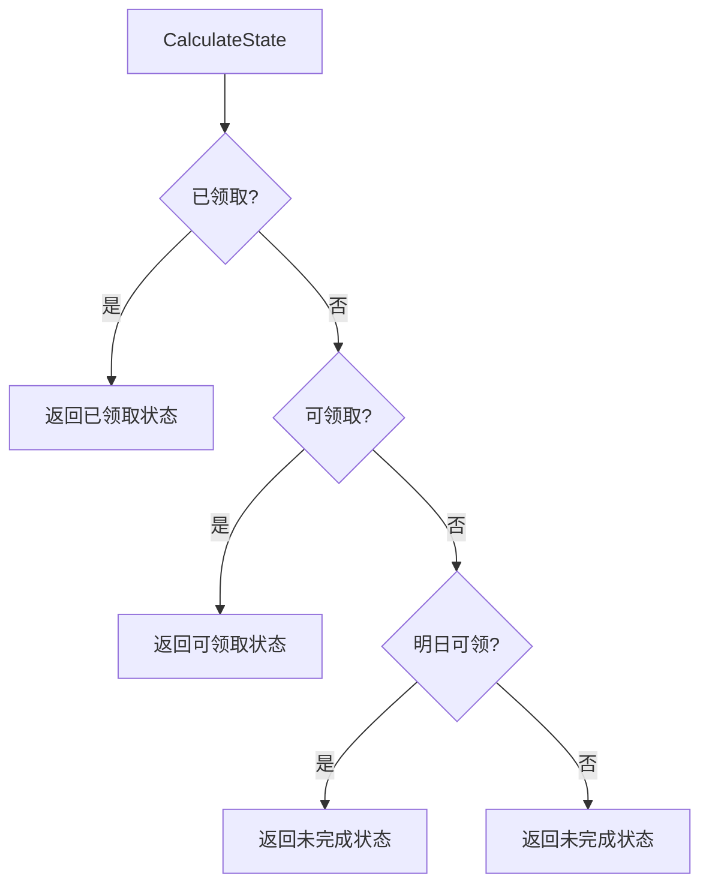

**图表来源**
- [DailyLoginPage.cpp](file://MetalSlug01/Source/MetalSlug01/Private/UI/Activity/Pages/DailyLogin/DailyLoginPage.cpp#L579-L609)

#### 滚动系统修复

**更新** 增强了滚动系统，包括延迟滚动和布局时机处理：

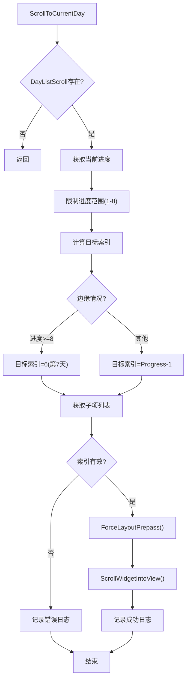

**图表来源**
- [DailyLoginPage.cpp](file://MetalSlug01/Source/MetalSlug01/Private/UI/Activity/Pages/DailyLogin/DailyLoginPage.cpp#L613-L659)

**章节来源**
- [DailyLoginPage.cpp](file://MetalSlug01/Source/MetalSlug01/Private/UI/Activity/Pages/DailyLogin/DailyLoginPage.cpp#L74-L292)
- [DailyLoginPage.cpp](file://MetalSlug01/Source/MetalSlug01/Private/UI/Activity/Pages/DailyLogin/DailyLoginPage.cpp#L578-L609)
- [DailyLoginPage.cpp](file://MetalSlug01/Source/MetalSlug01/Private/UI/Activity/Pages/DailyLogin/DailyLoginPage.cpp#L613-L659)

### DailyLoginDayItemWidget详细分析

#### 图标加载机制

**更新** 增强了图标加载机制，提供多种奖励类型的图标处理：

1. **普通物品奖励**：从FItemDetailRow查询ItemIcon
2. **宝箱奖励**：从TreasureBoxItemRow查询BoxIcon
3. **直接宝箱图标**：使用TSoftObjectPtr<UTexture2D>直接加载
4. **软资源异步加载**：使用UE4的软资源系统实现延迟加载

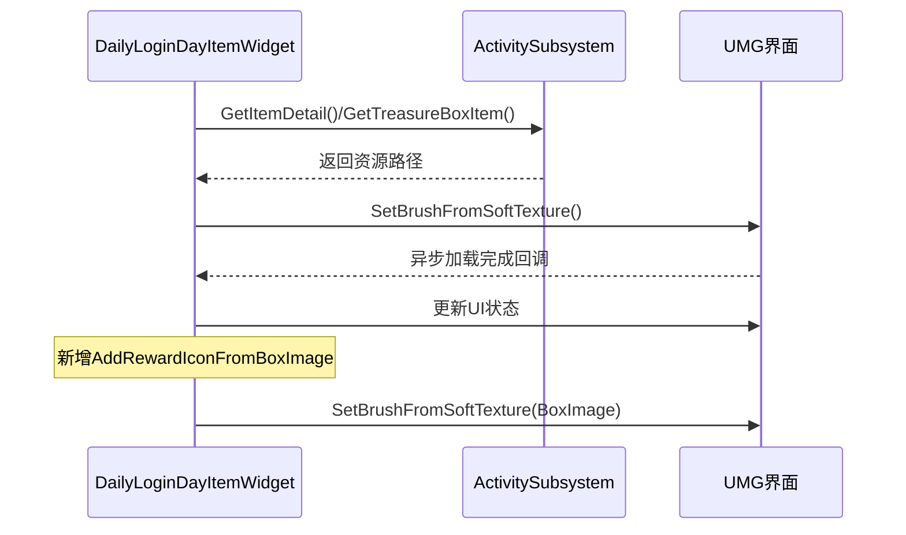

**图表来源**
- [DailyLoginDayItemWidget.cpp](file://MetalSlug01/Source/MetalSlug01/Private/UI/Activity/Pages/DailyLogin/DailyLoginDayItemWidget.cpp#L495-L636)

#### 视觉状态管理

组件根据ERewardState管理不同的UI状态：

| 状态 | 按钮文本 | 背景色 | 透明度 | 缩放 |
|------|----------|--------|--------|------|
| 可领取 | "领取" | 黄色 | 1.0 | (1.5, 1.5) |
| 已领取 | "已领取" | 灰色 | 0.3 | (1.5, 1.5) |
| 明日可领 | "明日可领" | 青色 | 1.0 | (1.5, 1.5) |
| 未完成 | "第 N 天" | 灰色 | 0.5 | (1.5, 1.5) |

#### 防重复调用保护

**更新** 新增了防重复调用保护机制：

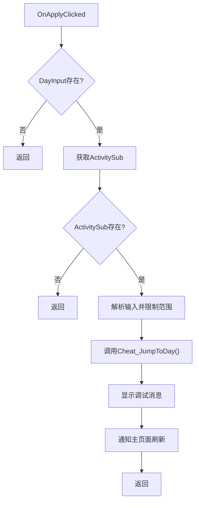

**图表来源**
- [DailyLoginCheatWidget.cpp](file://MetalSlug01/Source/MetalSlug01/Private/UI/Activity/Pages/DemoWidget/DailyLoginCheatWidget.cpp#L41-L61)

**章节来源**
- [DailyLoginDayItemWidget.cpp](file://MetalSlug01/Source/MetalSlug01/Private/UI/Activity/Pages/DailyLogin/DailyLoginDayItemWidget.cpp#L114-L238)
- [DailyLoginDayItemWidget.cpp](file://MetalSlug01/Source/MetalSlug01/Private/UI/Activity/Pages/DailyLogin/DailyLoginDayItemWidget.cpp#L495-L636)
- [DailyLoginCheatWidget.cpp](file://MetalSlug01/Source/MetalSlug01/Private/UI/Activity/Pages/DemoWidget/DailyLoginCheatWidget.cpp#L41-L61)

### ActivitySubsystem详细分析

#### 数据持久化架构

**更新** 集成了动态存档修改器，提供实时数据修改能力：

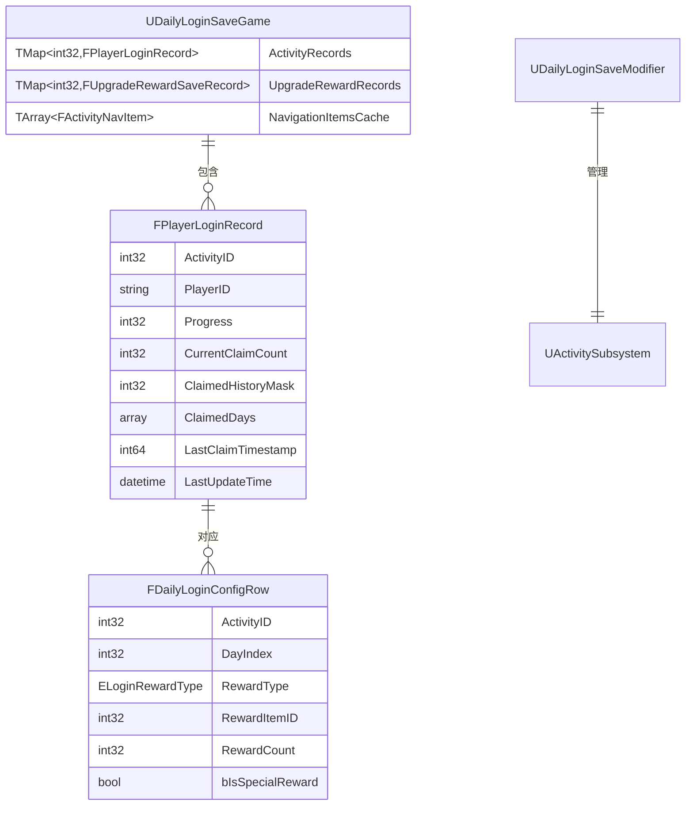

**图表来源**
- [DailyLoginSave.h](file://MetalSlug01/Source/MetalSlug01/Public/UI/Activity/Data/DailyLoginSave.h#L352-L373)
- [DailyLoginConfig.h](file://MetalSlug01/Source/MetalSlug01/Public/UI/Activity/Data/DailyLoginConfig.h#L196-L242)

#### 奖励领取流程

**更新** 优化了奖励领取流程，增加了智能进度更新逻辑：

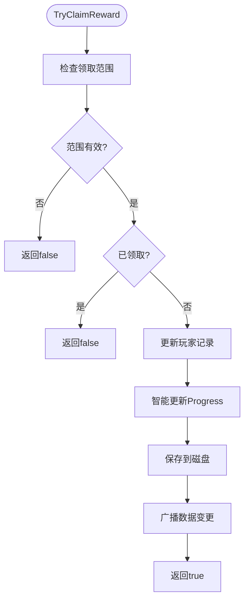

**图表来源**
- [ActivitySubsystem.cpp](file://MetalSlug01/Source/MetalSlug01/Private/UI/Activity/Core/ActivitySubsystem.cpp#L247-L298)

**章节来源**
- [ActivitySubsystem.cpp](file://MetalSlug01/Source/MetalSlug01/Private/UI/Activity/Core/ActivitySubsystem.cpp#L101-L147)
- [ActivitySubsystem.cpp](file://MetalSlug01/Source/MetalSlug01/Private/UI/Activity/Core/ActivitySubsystem.cpp#L247-L298)

## 依赖关系分析

系统采用清晰的依赖层次结构：

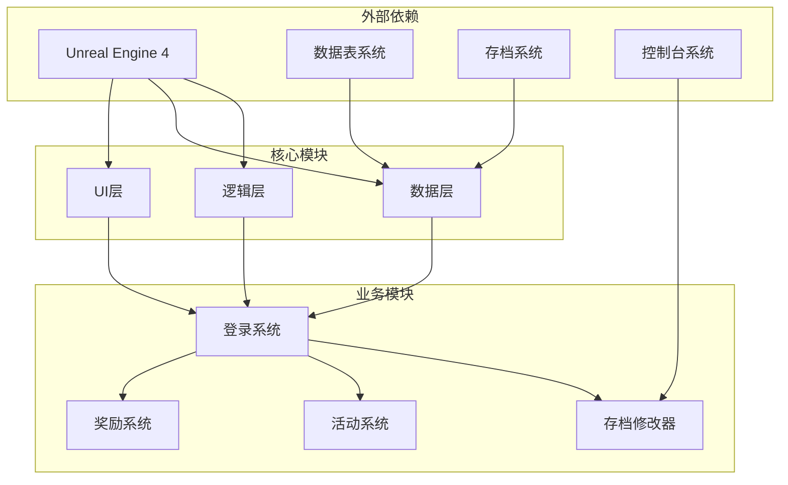

**图表来源**
- [DailyLoginPage.h](file://MetalSlug01/Source/MetalSlug01/Public/UI/Activity/Pages/DailyLogin/DailyLoginPage.h#L1-L101)
- [ActivitySubsystem.h](file://MetalSlug01/Source/MetalSlug01/Public/UI/Activity/Core/ActivitySubsystem.h#L1-L178)

**章节来源**
- [DailyLoginPage.cpp](file://MetalSlug01/Source/MetalSlug01/Private/UI/Activity/Pages/DailyLogin/DailyLoginPage.cpp#L1-L22)
- [ActivitySubsystem.cpp](file://MetalSlug01/Source/MetalSlug01/Private/UI/Activity/Core/ActivitySubsystem.cpp#L1-L20)

## 性能考虑

### 内存管理优化

**更新** 增强了内存管理优化措施：

1. **对象池模式**：复用DailyLoginDayItemWidget实例减少内存分配
2. **延迟加载**：使用软资源实现奖励图标的异步加载
3. **缓存策略**：ActivitySubsystem缓存常用数据避免重复查询
4. **防重复调用**：通过静态标志防止按钮事件重复触发
5. **延迟滚动**：使用SetTimerForNextTick确保布局完成后滚动

### 渲染性能优化

**更新** 优化了渲染性能：

1. **可视区域裁剪**：仅渲染可见的奖励项
2. **状态更新批处理**：批量更新UI状态减少重绘
3. **资源复用**：共享相同奖励类型的图标资源
4. **延迟滚动**：使用SetTimerForNextTick确保布局完成后滚动
5. **ForceLayoutPrepass**：确保控件布局完成后再进行滚动

### 数据访问优化

**更新** 增强了数据访问优化：

1. **索引优化**：通过ActivityID和DayIndex建立快速查询索引
2. **批量操作**：支持批量领取奖励减少数据库访问
3. **增量更新**：仅更新发生变化的数据项
4. **动态修改器**：提供实时数据修改能力
5. **防重复调用**：通过静态标志防止事件重复触发

## 故障排除指南

### 常见问题及解决方案

#### 奖励图标不显示

**症状**：奖励项显示空白或占位符

**排查步骤**：
1. 检查RewardIconClass是否正确设置
2. 验证资源路径是否有效
3. 确认软资源是否正确加载
4. 检查AddRewardIconFromConfig函数的调用

**解决方案**：
```cpp
// 检查资源状态
if (ItemDetail && ItemDetail->ItemIcon.IsValid())
{
    // 正常加载流程
}
else
{
    // 使用灰色占位符
    RewardImage->SetColorAndOpacity(FLinearColor(0.5f, 0.5f, 0.5f, 1.0f));
}
```

#### 奖励领取失败

**症状**：点击奖励按钮无响应或领取失败

**排查步骤**：
1. 检查玩家进度是否正确
2. 验证奖励配置是否有效
3. 确认存档数据完整性
4. 检查TryClaimReward函数的返回值
5. 检查防重复调用标志

**解决方案**：
```cpp
// 添加详细的错误日志
UE_LOG(LogTemp, Error, TEXT("领取失败 - 进度: %d, 天数: %d, 已领取: %s"), 
       PlayerRecord.Progress, DayIndex, 
       PlayerRecord.IsDayClaimed(DayIndex) ? TEXT("是") : TEXT("否"));
```

#### UI状态不同步

**症状**：界面显示与实际数据不一致

**排查步骤**：
1. 检查OnActivityDataChanged事件是否正确广播
2. 验证RefreshRewardList调用时机
3. 确认UI更新线程安全性
4. 检查ScrollToCurrentDay方法的调用
5. 检查防重复调用标志

**解决方案**：
```cpp
// 确保UI更新在游戏线程执行
AsyncTask(ENamedThreads::GameThread, [this]()
{
    this->RefreshRewardList();
});
```

#### 滚动位置异常

**症状**：界面滚动到错误的位置

**排查步骤**：
1. 检查ScrollToCurrentDay方法的实现
2. 验证DayListScroll控件的设置
3. 确认目标索引的计算逻辑
4. 检查子项数量和索引范围
5. 检查延迟滚动机制

**解决方案**：
```cpp
// 确保滚动到正确的天数位置
int32 TargetIndex = FMath::Clamp(CurrentProgress - 1, 0, AllItems.Num() - 1);
if (AllItems.IsValidIndex(TargetIndex))
{
    DayListScroll->ScrollWidgetIntoView(AllItems[TargetIndex], true);
}
```

#### 防重复调用问题

**症状**：按钮点击事件重复触发

**排查步骤**：
1. 检查静态标志变量bAlreadyCalled
2. 验证事件绑定是否正确清理
3. 确认回调函数的执行流程
4. 检查事件清理机制

**解决方案**：
```cpp
// 防重复调用保护
static bool bAlreadyCalled = false;
if (bAlreadyCalled)
{
    return;
}
bAlreadyCalled = true;
// ... 事件处理逻辑
bAlreadyCalled = false;
```

**章节来源**
- [DailyLoginDayItemWidget.cpp](file://MetalSlug01/Source/MetalSlug01/Private/UI/Activity/Pages/DailyLogin/DailyLoginDayItemWidget.cpp#L538-L636)
- [ActivitySubsystem.cpp](file://MetalSlug01/Source/MetalSlug01/Private/UI/Activity/Core/ActivitySubsystem.cpp#L247-L298)
- [DailyLoginCheatWidget.cpp](file://MetalSlug01/Source/MetalSlug01/Private/UI/Activity/Pages/DemoWidget/DailyLoginCheatWidget.cpp#L41-L61)

## 结论

日常登录页面系统展现了优秀的软件工程实践，通过清晰的架构设计和模块化实现，成功构建了一个功能完整、易于维护的奖励系统。本次更新进一步增强了系统的稳定性和可维护性。

**更新** 主要改进包括：
1. **Cheat工具功能增强**：输入验证、错误处理、通知机制
2. **滚动系统修复**：延迟滚动、布局时机处理、边缘情况处理
3. **UI交互优化**：异步纹理加载、奖励图标显示
4. **防重复调用保护**：通过静态标志防止事件重复触发
5. **动态存档修改器集成**：支持实时调试和测试功能

该系统为类似的游戏活动功能提供了良好的参考模板，其设计理念和实现方式值得在其他项目中借鉴。

## 附录

### API参考

#### DailyLoginPage公共接口

| 方法 | 参数 | 返回值 | 描述 |
|------|------|--------|------|
| RefreshRewardList | 无 | void | 刷新奖励列表显示 |
| ShowRewardOptionPopup | int32 DayIndex | void | 显示奖励选择弹窗 |
| ShowClaimSuccessPopup | 无 | void | 显示领取成功弹窗 |
| HandleRewardClick | int32 DayIndex, ELoginRewardType RewardType | void | 处理奖励点击事件 |
| Cheat_SetDayAndRefresh | int32 NewDay | void | 调试：设置天数并刷新 |
| OnClaimAllButtonClicked | 无 | void | 处理全部领取按钮点击 |
| ScrollToCurrentDay | 无 | void | 滚动到当前天数位置 |
| HandleStoreLogic | int32 DayIndex | void | 处理奖励存储逻辑 |
| HandleRewardOptionStore | int32 DayIndex | void | 处理奖励选项存储 |
| 防重复调用保护 | 无 | void | 防止事件重复触发 |

#### DailyLoginDayItemWidget公共接口

| 方法 | 参数 | 返回值 | 描述 |
|------|------|--------|------|
| Init | int32 DayIndex, int32 CurrentProgress, ERewardState RewardState, bool bInIsSpecialReward, UActivitySubsystem* ActivitySubsystem | void | 初始化奖励项 |
| AddRewardIcon | int32 RewardID, int32 RewardCount | void | 添加普通物品奖励图标 |
| AddRewardIconFromConfig | const FDailyLoginConfigRow& ConfigRow | void | 从配置添加奖励图标 |
| AddRewardIconFromBoxImage | const TSoftObjectPtr<UTexture2D>& BoxImage, int32 RewardCount | void | 从宝箱图像添加奖励图标 |
| AddRewardIconFromTreasureBox | int32 BoxID, int32 RewardCount | void | 从宝箱配置添加奖励图标 |
| ClearRewardIcons | 无 | void | 清空奖励容器 |
| OnTextureLoaded | const FSoftObjectPath& Path, UObject* LoadedObject, UImage* RewardImage, int32 RewardID | void | 纹理异步加载回调 |
| 防重复调用保护 | 无 | void | 防止事件重复触发 |

#### ActivitySubsystem公共接口

| 方法 | 参数 | 返回值 | 描述 |
|------|------|--------|------|
| GetOrInitPlayerRecord | int32 ActivityID | FPlayerLoginRecord& | 获取或创建玩家记录 |
| GetRewardsByDay | int32 ActivityID, int32 Day | TArray<FDailyLoginConfigRow*> | 获取指定天数的奖励配置 |
| TryClaimReward | int32 ActivityID, int32 DayIndex | bool | 尝试领取奖励 |
| Cheat_JumpToDay | int32 ActivityID, int32 NewDay | void | 调试：跳转到指定天数 |
| TryClaimMultipleRewards | int32 ActivityID, const TArray<int32>& DayIndices | bool | 批量领取奖励 |
| GetItemDetail | int32 ItemID | const FItemDetailRow* | 获取物品详情 |
| GetTreasureBoxItem | int32 BoxID | const FTreasureBoxItemRow* | 获取宝箱物品配置 |
| GetSaveModifier | 无 | UDailyLoginSaveModifier* | 获取存档修改器 |
| ModifyPlayerProgress | int32 ActivityID, int32 NewProgress, bool bAutoSave | bool | 修改玩家进度 |
| ModifyDayClaimedStatus | int32 ActivityID, int32 DayIndex, bool bClaimed, bool bAutoSave | bool | 修改天数领取状态 |

### 使用示例

#### 基本集成步骤

1. **创建页面实例**：在GameInstance中创建UDailyLoginPage实例
2. **设置数据源**：配置ItemClass和RewardOptionClass
3. **绑定事件**：连接OnActivityDataChanged事件
4. **初始化显示**：调用RefreshRewardList()显示奖励列表

#### 自定义奖励样式

```cpp
// 在蓝图中设置自定义颜色
UPROPERTY(EditAnywhere, Category = "Button Colors")
FLinearColor CustomClaimedColor = FLinearColor(1.0f, 0.5f, 0.0f, 1.0f);

// 在代码中应用自定义样式
void UDailyLoginDayItemWidget::UpdateCustomStyle()
{
    switch(CurrentState)
    {
        case ERewardState::Claimable:
            ClaimButton->SetBackgroundColor(CustomClaimedColor);
            break;
        // ... 其他状态处理
    }
}
```

#### 添加新奖励类型

1. **定义枚举值**：在ELoginRewardType中添加新类型
2. **更新配置表**：在DT_DailyLoginConfigRow中设置奖励类型
3. **实现图标加载**：在AddRewardIconFromConfig中处理新类型
4. **更新UI状态**：在UpdateVisualState中添加新状态支持

#### 动态存档修改器使用

**更新** 新增动态存档修改器的使用方法：

```cpp
// 通过控制台命令修改玩家进度
// DailyLogin.SetProgress 101 5

// 通过编程方式修改玩家进度
UActivitySubsystem* Subsystem = GetGameInstance()->GetSubsystem<UActivitySubsystem>();
if (Subsystem)
{
    Subsystem->ModifyPlayerProgress(101, 5, true);
}

// 重置玩家记录
Subsystem->ResetPlayerRecord(101, true);
```

#### 调试工具使用

**更新** 增强了调试工具的功能：

```cpp
// 使用CheatWidget设置天数
UDailyLoginCheatWidget* CheatWidget = CreateWidget<UDailyLoginCheatWidget>(GetWorld(), CheatWidgetClass);
if (CheatWidget)
{
    CheatWidget->AddToViewport();
    CheatWidget->SetDayInputText("5"); // 设置为第5天
    CheatWidget->ApplyCheat(); // 应用作弊
}
```

#### 防重复调用保护使用

**更新** 新增防重复调用保护的使用方法：

```cpp
// 在事件处理函数中添加保护
static bool bAlreadyCalled = false;
if (bAlreadyCalled)
{
    return;
}
bAlreadyCalled = true;

// 事件处理逻辑
// ...

// 重置标志
bAlreadyCalled = false;
```