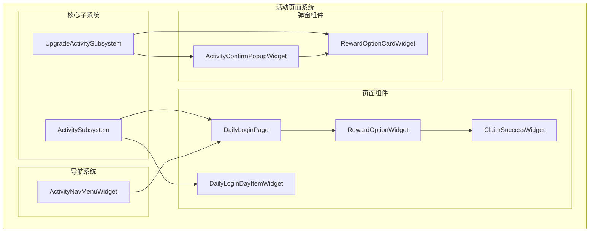
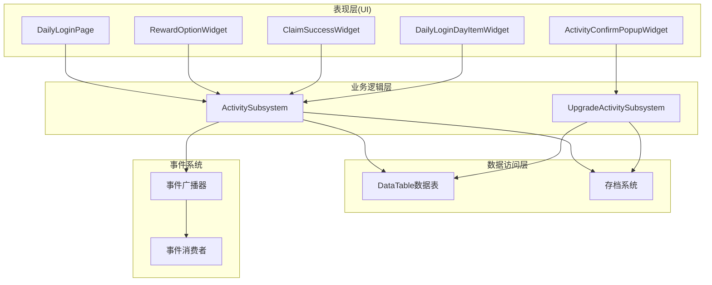
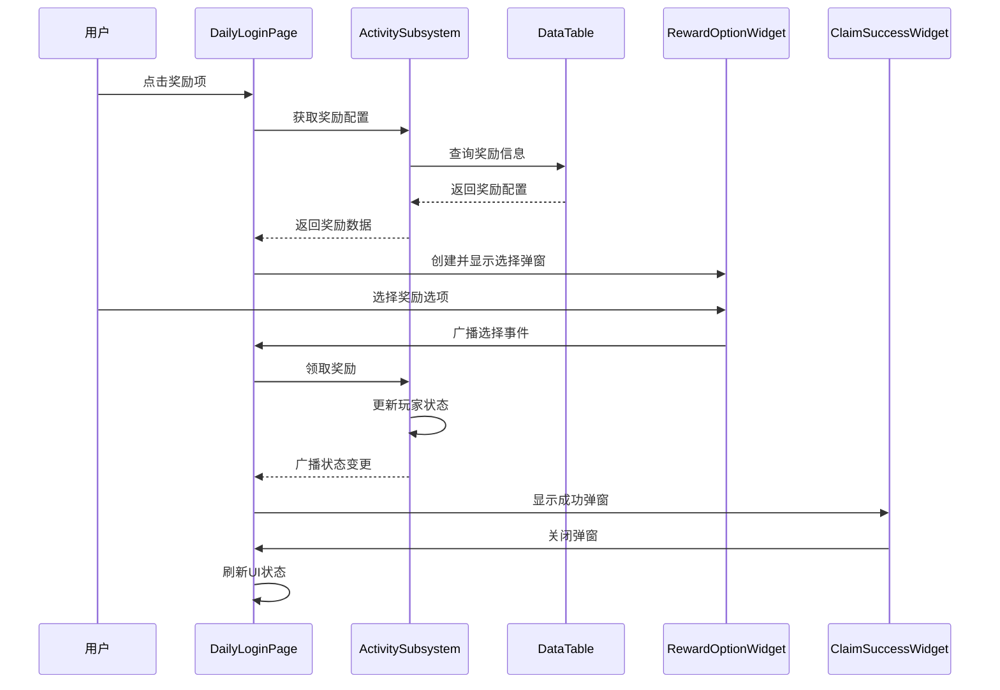
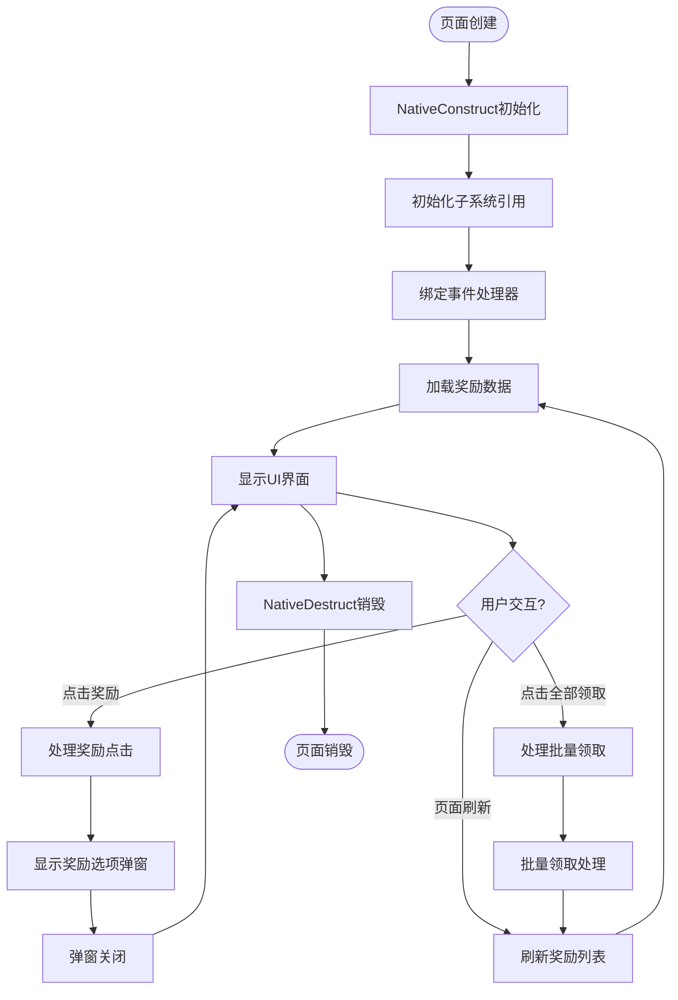
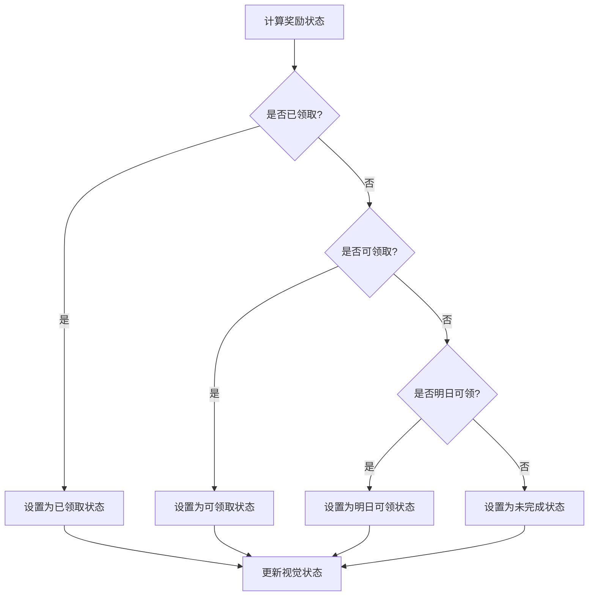
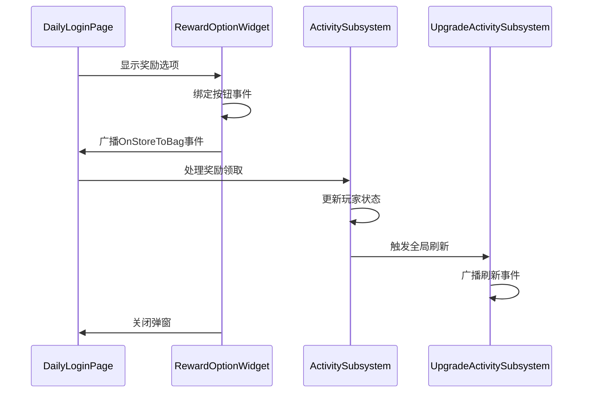
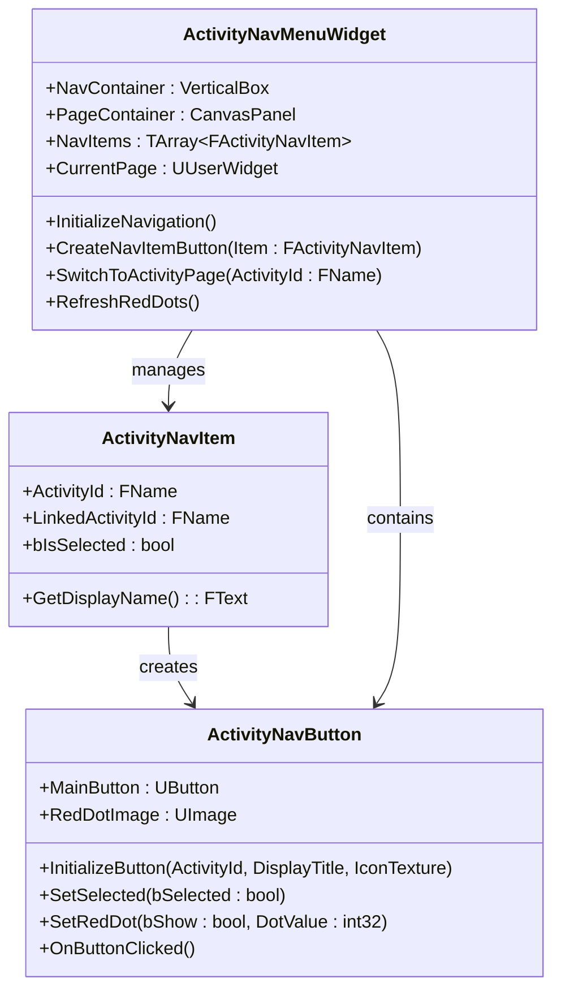
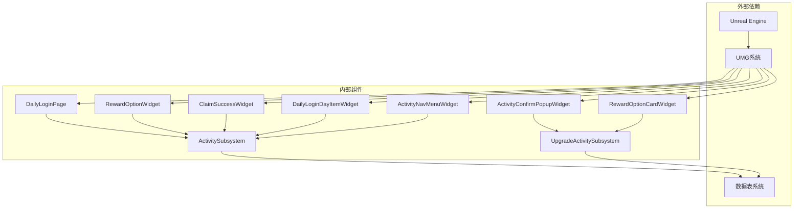

# 活动页面实现

<cite>
**本文档引用的文件**
- [DailyLoginPage.cpp](file://MetalSlug01/Source/MetalSlug01/Private/UI/Activity/Pages/DailyLogin/DailyLoginPage.cpp)
- [RewardOptionWidget.cpp](file://MetalSlug01/Source/MetalSlug01/Private/UI/Activity/Pages/ClaimBox/RewardOptionWidget.cpp)
- [ClaimSuccessWidget.cpp](file://MetalSlug01/Source/MetalSlug01/Private/UI/Activity/Pages/ClaimSuccess/ClaimSuccessWidget.cpp)
- [ActivitySubsystem.cpp](file://MetalSlug01/Source/MetalSlug01/Private/UI/Activity/Core/ActivitySubsystem.cpp)
- [UpgradeActivitySubsystem.cpp](file://MetalSlug01/Source/MetalSlug01/Private/UI/Activity/Core/UpgradeActivitySubsystem.cpp)
- [DailyLoginDayItemWidget.cpp](file://MetalSlug01/Source/MetalSlug01/Private/UI/Activity/Pages/DailyLogin/DailyLoginDayItemWidget.cpp)
- [ActivityNavMenuWidget.cpp](file://MetalSlug01/Source/MetalSlug01/Private/UI/Activity/Pages/Navigation/ActivityNavMenuWidget.cpp)
- [ActivityConfirmPopupWidget.cpp](file://MetalSlug01/Source/MetalSlug01/Private/UI/Activity/Pages/SelectMultiplePopup/ActivityConfirmPopupWidget.cpp)
- [RewardOptionCardWidget.cpp](file://MetalSlug01/Source/MetalSlug01/Private/UI/Activity/Pages/SelectMultiplePopup/RewardOptionCardWidget.cpp)
</cite>

## 目录
1. [简介](#简介)
2. [项目结构](#项目结构)
3. [核心组件](#核心组件)
4. [架构概览](#架构概览)
5. [详细组件分析](#详细组件分析)
6. [依赖关系分析](#依赖关系分析)
7. [性能考虑](#性能考虑)
8. [故障排除指南](#故障排除指南)
9. [结论](#结论)

## 简介

本技术文档深入解析MetalSlug活动页面系统的实现，重点涵盖日常登录页面(DailyLoginPage)、奖励选项页面(RewardOptionWidget)、成功领取页面(ClaimSuccessWidget)等核心UI组件。文档详细说明了页面间的导航逻辑、数据传递机制、状态管理实现细节，以及页面组件的生命周期管理。同时阐述了页面与活动子系统的交互方式，包括数据绑定、事件响应、状态同步等。

该系统采用Unreal Engine的UMG框架构建，通过ActivitySubsystem和UpgradeActivitySubsystem两个核心子系统实现数据管理和状态同步，确保活动页面的稳定运行和良好的用户体验。

## 项目结构

活动页面系统采用模块化设计，按照功能和层次进行组织：

**图表来源**
- [ActivitySubsystem.cpp](file://MetalSlug01/Source/MetalSlug01/Private/UI/Activity/Core/ActivitySubsystem.cpp#L1-L599)
- [UpgradeActivitySubsystem.cpp](file://MetalSlug01/Source/MetalSlug01/Private/UI/Activity/Core/UpgradeActivitySubsystem.cpp#L1-L800)

**章节来源**
- [ActivitySubsystem.cpp](file://MetalSlug01/Source/MetalSlug01/Private/UI/Activity/Core/ActivitySubsystem.cpp#L1-L599)
- [UpgradeActivitySubsystem.cpp](file://MetalSlug01/Source/MetalSlug01/Private/UI/Activity/Core/UpgradeActivitySubsystem.cpp#L1-L800)

## 核心组件

### ActivitySubsystem - 活动系统核心

ActivitySubsystem是整个活动系统的核心，负责管理所有活动相关的数据和逻辑：

- **数据管理**：处理玩家活动记录、奖励配置、物品详情等数据
- **状态同步**：维护活动状态并在UI间同步
- **存档管理**：负责数据的持久化存储
- **事件广播**：向所有监听者广播数据变更事件

### UpgradeActivitySubsystem - 升级活动子系统

专门处理升级奖励活动的子系统：

- **配置管理**：预加载和缓存活动配置数据
- **进度跟踪**：管理玩家的活动进度和状态
- **奖励系统**：处理宝箱领取和任务完成逻辑
- **数据持久化**：与存档系统集成

### DailyLoginPage - 日常登录页面

主要负责日常登录活动的UI展示和交互：

- **奖励列表管理**：动态生成和管理奖励列表
- **状态计算**：计算每个奖励的可领取状态
- **事件处理**：处理用户的各种交互事件
- **弹窗管理**：控制各种弹窗的显示和关闭

**章节来源**
- [ActivitySubsystem.cpp](file://MetalSlug01/Source/MetalSlug01/Private/UI/Activity/Core/ActivitySubsystem.cpp#L1-L599)
- [UpgradeActivitySubsystem.cpp](file://MetalSlug01/Source/MetalSlug01/Private/UI/Activity/Core/UpgradeActivitySubsystem.cpp#L1-L800)
- [DailyLoginPage.cpp](file://MetalSlug01/Source/MetalSlug01/Private/UI/Activity/Pages/DailyLogin/DailyLoginPage.cpp#L1-L835)

## 架构概览

系统采用分层架构设计，确保各组件职责清晰、耦合度低：

**图表来源**
- [ActivitySubsystem.cpp](file://MetalSlug01/Source/MetalSlug01/Private/UI/Activity/Core/ActivitySubsystem.cpp#L1-L599)
- [UpgradeActivitySubsystem.cpp](file://MetalSlug01/Source/MetalSlug01/Private/UI/Activity/Core/UpgradeActivitySubsystem.cpp#L1-L800)

系统的核心交互流程如下：

**图表来源**
- [DailyLoginPage.cpp](file://MetalSlug01/Source/MetalSlug01/Private/UI/Activity/Pages/DailyLogin/DailyLoginPage.cpp#L780-L835)
- [RewardOptionWidget.cpp](file://MetalSlug01/Source/MetalSlug01/Private/UI/Activity/Pages/ClaimBox/RewardOptionWidget.cpp#L61-L147)
- [ActivitySubsystem.cpp](file://MetalSlug01/Source/MetalSlug01/Private/UI/Activity/Core/ActivitySubsystem.cpp#L247-L298)

**章节来源**
- [DailyLoginPage.cpp](file://MetalSlug01/Source/MetalSlug01/Private/UI/Activity/Pages/DailyLogin/DailyLoginPage.cpp#L1-L835)
- [RewardOptionWidget.cpp](file://MetalSlug01/Source/MetalSlug01/Private/UI/Activity/Pages/ClaimBox/RewardOptionWidget.cpp#L1-L160)
- [ClaimSuccessWidget.cpp](file://MetalSlug01/Source/MetalSlug01/Private/UI/Activity/Pages/ClaimSuccess/ClaimSuccessWidget.cpp#L1-L28)

## 详细组件分析

### DailyLoginPage - 日常登录页面

DailyLoginPage是活动系统的核心页面，负责展示和管理日常登录奖励：

#### 生命周期管理

页面的生命周期严格按照Unreal Engine的Widget生命周期管理：

**图表来源**
- [DailyLoginPage.cpp](file://MetalSlug01/Source/MetalSlug01/Private/UI/Activity/Pages/DailyLogin/DailyLoginPage.cpp#L24-L72)

#### 奖励状态管理系统

系统实现了复杂的奖励状态计算逻辑：

**图表来源**
- [DailyLoginPage.cpp](file://MetalSlug01/Source/MetalSlug01/Private/UI/Activity/Pages/DailyLogin/DailyLoginPage.cpp#L578-L609)

#### 数据绑定机制

页面通过多种方式实现数据绑定：

1. **事件绑定**：使用`AddDynamic`方法绑定各种事件处理器
2. **属性绑定**：通过蓝图和C++代码结合实现UI属性绑定
3. **状态同步**：通过子系统的事件广播实现状态同步

**章节来源**
- [DailyLoginPage.cpp](file://MetalSlug01/Source/MetalSlug01/Private/UI/Activity/Pages/DailyLogin/DailyLoginPage.cpp#L24-L835)

### RewardOptionWidget - 奖励选项组件

RewardOptionWidget负责处理奖励选择和确认：

#### 事件处理流程

**图表来源**
- [RewardOptionWidget.cpp](file://MetalSlug01/Source/MetalSlug01/Private/UI/Activity/Pages/ClaimBox/RewardOptionWidget.cpp#L61-L147)

#### 防重复调用机制

为了防止用户重复点击导致的问题，系统实现了多重防重复机制：

- **静态标志位**：使用`static bool`变量防止同一函数重复执行
- **IsValid检查**：在移除Widget前检查对象有效性
- **事件清理**：在重新绑定前清理旧的事件绑定

**章节来源**
- [RewardOptionWidget.cpp](file://MetalSlug01/Source/MetalSlug01/Private/UI/Activity/Pages/ClaimBox/RewardOptionWidget.cpp#L1-L160)

### DailyLoginDayItemWidget - 日常登录项组件

DailyLoginDayItemWidget是单个奖励项的UI组件：

#### 视觉状态管理

组件实现了四种不同的视觉状态：

1. **可领取状态**：黄色背景，按钮可点击
2. **已领取状态**：灰色半透明，按钮禁用
3. **明日可领状态**：蓝色背景，显示"明日可领"
4. **未完成状态**：灰色背景，显示具体天数

#### 图标加载机制

系统支持两种奖励图标的加载方式：

1. **普通物品图标**：从`FItemDetailRow`表获取`ItemIcon`
2. **宝箱图标**：从`TreasureBoxItemRow`表获取`BoxIcon`

**章节来源**
- [DailyLoginDayItemWidget.cpp](file://MetalSlug01/Source/MetalSlug01/Private/UI/Activity/Pages/DailyLogin/DailyLoginDayItemWidget.cpp#L1-L665)

### ActivityNavMenuWidget - 活动导航菜单

ActivityNavMenuWidget提供活动页面间的导航功能：

#### 导航项管理

**图表来源**
- [ActivityNavMenuWidget.cpp](file://MetalSlug01/Source/MetalSlug01/Private/UI/Activity/Pages/Navigation/ActivityNavMenuWidget.cpp#L14-L800)

**章节来源**
- [ActivityNavMenuWidget.cpp](file://MetalSlug01/Source/MetalSlug01/Private/UI/Activity/Pages/Navigation/ActivityNavMenuWidget.cpp#L1-L939)

## 依赖关系分析

系统采用松耦合设计，通过接口和事件实现组件间的通信：

**图表来源**
- [ActivitySubsystem.cpp](file://MetalSlug01/Source/MetalSlug01/Private/UI/Activity/Core/ActivitySubsystem.cpp#L1-L599)
- [UpgradeActivitySubsystem.cpp](file://MetalSlug01/Source/MetalSlug01/Private/UI/Activity/Core/UpgradeActivitySubsystem.cpp#L1-L800)

**章节来源**
- [ActivitySubsystem.cpp](file://MetalSlug01/Source/MetalSlug01/Private/UI/Activity/Core/ActivitySubsystem.cpp#L1-L599)
- [UpgradeActivitySubsystem.cpp](file://MetalSlug01/Source/MetalSlug01/Private/UI/Activity/Core/UpgradeActivitySubsystem.cpp#L1-L800)

## 性能考虑

### 内存管理优化

1. **Widget缓存**：ActivityNavMenuWidget实现了页面缓存机制，避免重复创建Widget
2. **定时器管理**：合理使用定时器进行红点刷新，避免频繁的UI更新
3. **资源加载优化**：使用软引用进行纹理资源的异步加载

### 数据访问优化

1. **数据表缓存**：ActivitySubsystem缓存了常用的数据表，减少重复加载
2. **批量操作**：支持批量领取奖励，减少多次数据访问
3. **增量更新**：只更新发生变化的数据，避免全量刷新

### UI渲染优化

1. **延迟初始化**：使用定时器延迟设置按钮颜色，确保完全初始化后再设置样式
2. **条件渲染**：根据状态动态显示/隐藏UI元素
3. **层级管理**：合理设置Widget的ZOrder，避免不必要的重绘

## 故障排除指南

### 常见问题及解决方案

#### Widget未正确绑定

**问题症状**：
- 按钮点击无响应
- UI元素显示异常
- 控制台出现"未绑定"错误

**解决步骤**：
1. 检查蓝图中的控件名称是否正确
2. 确认`NativeConstruct`中的绑定代码是否执行
3. 验证控件的可见性和父级关系

#### 数据加载失败

**问题症状**：
- 奖励列表为空
- 物品图标显示为灰色占位符
- 控制台出现"无法加载"错误

**解决步骤**：
1. 检查DataTable路径是否正确
2. 验证数据表中是否存在对应的记录
3. 确认资源文件是否正确打包

#### 事件处理异常

**问题症状**：
- 事件重复触发
- 事件绑定失效
- 状态更新不同步

**解决步骤**：
1. 检查防重复调用机制是否正常工作
2. 确认事件清理和重新绑定的顺序
3. 验证事件广播的时机和参数

**章节来源**
- [DailyLoginDayItemWidget.cpp](file://MetalSlug01/Source/MetalSlug01/Private/UI/Activity/Pages/DailyLogin/DailyLoginDayItemWidget.cpp#L1-L665)
- [RewardOptionWidget.cpp](file://MetalSlug01/Source/MetalSlug01/Private/UI/Activity/Pages/ClaimBox/RewardOptionWidget.cpp#L1-L160)

## 结论

MetalSlug活动页面系统展现了优秀的软件工程实践，通过模块化设计、清晰的职责分离和完善的错误处理机制，实现了稳定可靠的活动功能。系统的主要优势包括：

1. **架构清晰**：采用分层架构，各组件职责明确
2. **扩展性强**：通过接口和事件机制支持功能扩展
3. **性能优化**：实现了多种性能优化策略
4. **用户体验**：提供了流畅的交互体验和及时的状态反馈

该系统为类似的游戏活动功能提供了良好的参考实现，开发者可以根据具体需求进行定制和扩展。