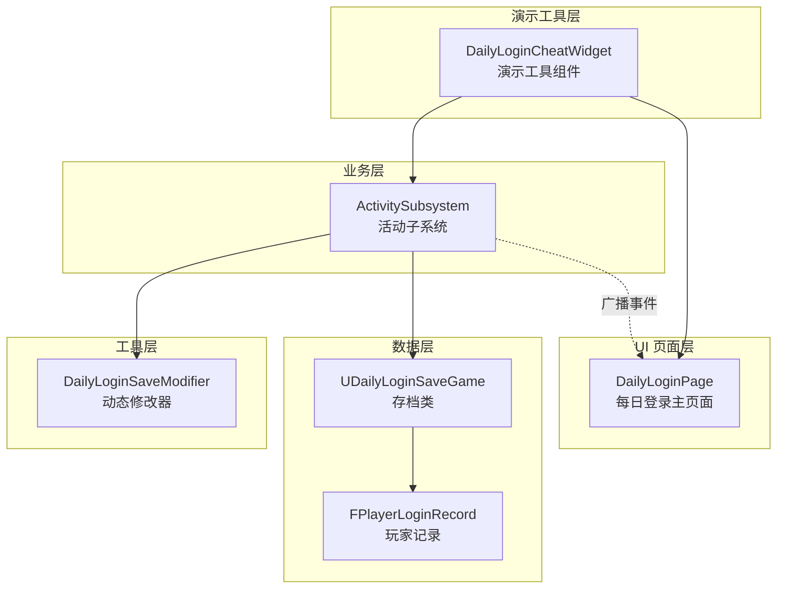
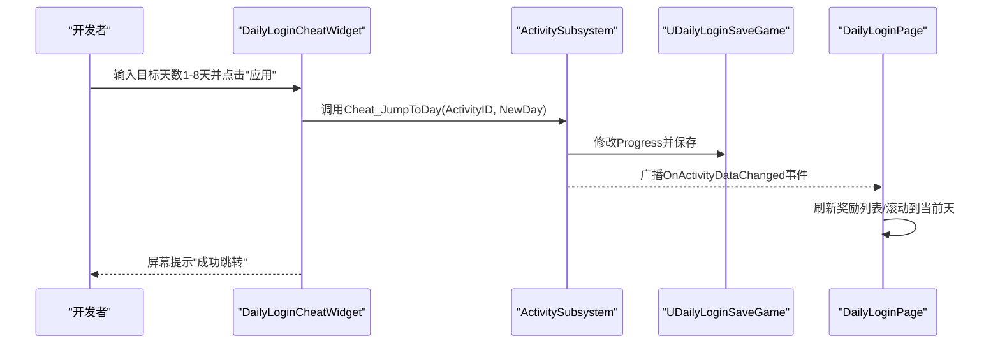
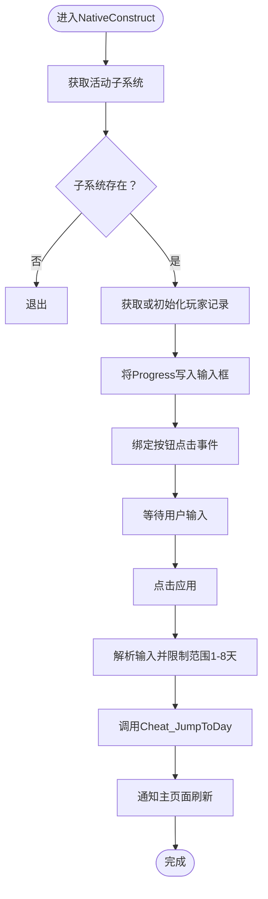
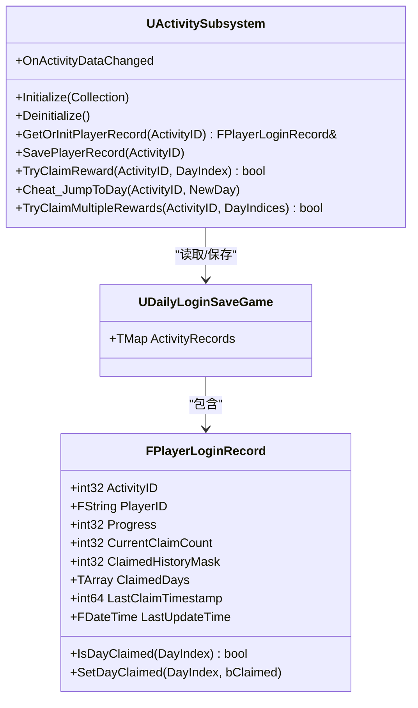
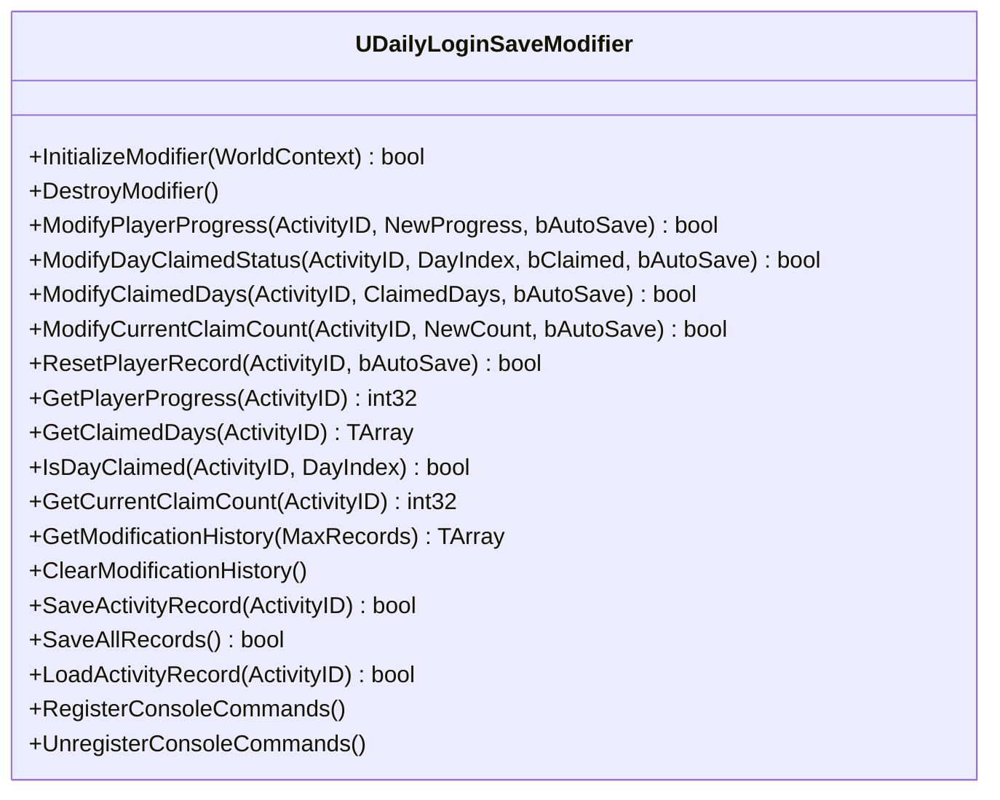
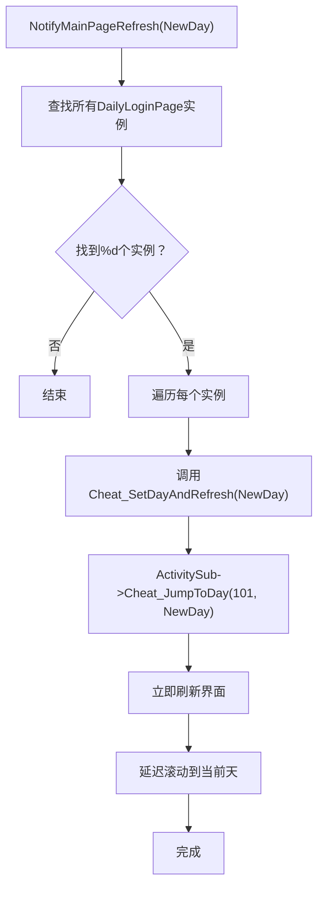
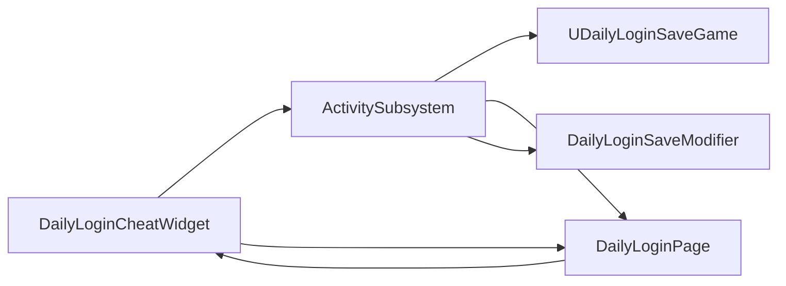

# 演示工具组件

<cite>
**本文引用的文件**
- [DailyLoginCheatWidget.h](file://MetalSlug01/Source/MetalSlug01/Public/UI/Activity/Pages/DemoWidget/DailyLoginCheatWidget.h)
- [DailyLoginCheatWidget.cpp](file://MetalSlug01/Source/MetalSlug01/Private/UI/Activity/Pages/DemoWidget/DailyLoginCheatWidget.cpp)
- [DailyLoginSaveModifier.h](file://MetalSlug01/Source/MetalSlug01/Public/Tools/DailyLoginSaveModifier.h)
- [DailyLoginSaveModifier.cpp](file://MetalSlug01/Source/MetalSlug01/Private/Tools/DailyLoginSaveModifier.cpp)
- [DailyLoginSave.h](file://MetalSlug01/Source/MetalSlug01/Public/UI/Activity/Data/DailyLoginSave.h)
- [ActivitySubsystem.h](file://MetalSlug01/Source/MetalSlug01/Public/UI/Activity/Core/ActivitySubsystem.h)
- [ActivitySubsystem.cpp](file://MetalSlug01/Source/MetalSlug01/Private/UI/Activity/Core/ActivitySubsystem.cpp)
- [DailyLoginPage.h](file://MetalSlug01/Source/MetalSlug01/Public/UI/Activity/Pages/DailyLogin/DailyLoginPage.h)
- [DailyLoginPage.cpp](file://MetalSlug01/Source/MetalSlug01/Private/UI/Activity/Pages/DailyLogin/DailyLoginPage.cpp)
</cite>

## 更新摘要
**变更内容**
- 更新了输入验证范围从1-7天扩展到1-8天
- 增强了错误处理和日志记录机制
- 优化了通知机制，改进了与主活动页面的集成
- 新增了Cheat_SetDayAndRefresh方法的自动刷新功能

## 目录
1. [简介](#简介)
2. [项目结构](#项目结构)
3. [核心组件](#核心组件)
4. [架构总览](#架构总览)
5. [详细组件分析](#详细组件分析)
6. [依赖关系分析](#依赖关系分析)
7. [性能考量](#性能考量)
8. [故障排查指南](#故障排查指南)
9. [结论](#结论)
10. [附录](#附录)

## 简介
本文件为演示工具组件（DailyLoginCheatWidget）的完整技术文档。该组件旨在为开发与测试提供便捷的"作弊"能力，允许开发者在编辑器或开发构建中快速设置当前登录天数、一键跳转到指定天数并触发界面刷新，从而高效验证每日登录活动的前端展示、交互与后端存档逻辑。组件通过调用活动子系统提供的"作弊跳转"接口，直接修改底层存档数据并广播数据变更事件，确保主页面能够实时响应。

同时，项目还提供了更通用的"每日登录存档动态修改器"（DailyLoginSaveModifier），支持通过蓝图或控制台命令对存档进行细粒度修改与查询，便于边界条件测试与问题定位。为保证安全性，这些功能仅在开发阶段可用，生产版本不会暴露此类接口。

**更新** 输入验证范围已从1-7天扩展到1-8天，支持大奖项的完整测试覆盖。

## 项目结构
演示工具组件位于活动系统的演示区域，与每日登录页面、活动子系统及存档结构紧密协作。整体组织遵循"功能域+层次"的混合结构：UI层（UserWidget）、业务层（ActivitySubsystem）、数据层（DailyLoginSaveGame/FPlayerLoginRecord）以及工具层（DailyLoginSaveModifier）。



**图表来源**
- [DailyLoginCheatWidget.h](file://MetalSlug01/Source/MetalSlug01/Public/UI/Activity/Pages/DemoWidget/DailyLoginCheatWidget.h#L1-L34)
- [DailyLoginCheatWidget.cpp](file://MetalSlug01/Source/MetalSlug01/Private/UI/Activity/Pages/DemoWidget/DailyLoginCheatWidget.cpp#L1-L82)
- [DailyLoginPage.h](file://MetalSlug01/Source/MetalSlug01/Public/UI/Activity/Pages/DailyLogin/DailyLoginPage.h#L1-L100)
- [ActivitySubsystem.h](file://MetalSlug01/Source/MetalSlug01/Public/UI/Activity/Core/ActivitySubsystem.h#L1-L178)
- [ActivitySubsystem.cpp](file://MetalSlug01/Source/MetalSlug01/Private/UI/Activity/Core/ActivitySubsystem.cpp#L1-L599)
- [DailyLoginSave.h](file://MetalSlug01/Source/MetalSlug01/Public/UI/Activity/Data/DailyLoginSave.h#L1-L373)
- [DailyLoginSaveModifier.h](file://MetalSlug01/Source/MetalSlug01/Public/Tools/DailyLoginSaveModifier.h#L1-L294)

**章节来源**
- [DailyLoginCheatWidget.h](file://MetalSlug01/Source/MetalSlug01/Public/UI/Activity/Pages/DemoWidget/DailyLoginCheatWidget.h#L1-L34)
- [DailyLoginCheatWidget.cpp](file://MetalSlug01/Source/MetalSlug01/Private/UI/Activity/Pages/DemoWidget/DailyLoginCheatWidget.cpp#L1-L82)
- [DailyLoginPage.h](file://MetalSlug01/Source/MetalSlug01/Public/UI/Activity/Pages/DailyLogin/DailyLoginPage.h#L1-L100)
- [ActivitySubsystem.h](file://MetalSlug01/Source/MetalSlug01/Public/UI/Activity/Core/ActivitySubsystem.h#L1-L178)
- [ActivitySubsystem.cpp](file://MetalSlug01/Source/MetalSlug01/Private/UI/Activity/Core/ActivitySubsystem.cpp#L1-L599)
- [DailyLoginSave.h](file://MetalSlug01/Source/MetalSlug01/Public/UI/Activity/Data/DailyLoginSave.h#L1-L373)
- [DailyLoginSaveModifier.h](file://MetalSlug01/Source/MetalSlug01/Public/Tools/DailyLoginSaveModifier.h#L1-L294)

## 核心组件
- 演示工具组件（DailyLoginCheatWidget）
  - 职责：在编辑器或开发构建中，通过输入框设置目标天数（1-8天），一键调用子系统"作弊跳转"，并刷新主页面。
  - 关键点：绑定输入框与按钮；在NativeConstruct中同步当前进度；点击后调用Cheat_JumpToDay并提示。
- 活动子系统（ActivitySubsystem）
  - 职责：统一管理活动数据、提供作弊跳转接口、负责数据变更广播。
  - 关键点：Cheat_JumpToDay直接修改Progress并保存；广播OnActivityDataChanged事件。
- 存档结构（UDailyLoginSaveGame/FPlayerLoginRecord）
  - 职责：持久化玩家每日登录进度与领取状态。
  - 关键点：Progress表示"已可领取到第几天"；ClaimedDays/ClaimedHistoryMask维护领取历史。
- 动态修改器（DailyLoginSaveModifier）
  - 职责：提供蓝图/控制台接口对存档进行修改、查询与历史记录管理。
  - 关键点：支持修改进度、领取状态、批量修改、重置、保存/加载等。

**更新** 输入验证范围已扩展到1-8天，支持大奖项测试。

**章节来源**
- [DailyLoginCheatWidget.h](file://MetalSlug01/Source/MetalSlug01/Public/UI/Activity/Pages/DemoWidget/DailyLoginCheatWidget.h#L7-L34)
- [DailyLoginCheatWidget.cpp](file://MetalSlug01/Source/MetalSlug01/Private/UI/Activity/Pages/DemoWidget/DailyLoginCheatWidget.cpp#L11-L82)
- [ActivitySubsystem.h](file://MetalSlug01/Source/MetalSlug01/Public/UI/Activity/Core/ActivitySubsystem.h#L70-L71)
- [ActivitySubsystem.cpp](file://MetalSlug01/Source/MetalSlug01/Private/UI/Activity/Core/ActivitySubsystem.cpp#L300-L322)
- [DailyLoginSave.h](file://MetalSlug01/Source/MetalSlug01/Public/UI/Activity/Data/DailyLoginSave.h#L85-L161)
- [DailyLoginSaveModifier.h](file://MetalSlug01/Source/MetalSlug01/Public/Tools/DailyLoginSaveModifier.h#L101-L149)

## 架构总览
演示工具组件通过活动子系统间接与存档层交互，形成"UI -> 子系统 -> 存档"的调用链。子系统在修改完成后广播事件，主页面监听并刷新界面。



**更新** 支持1-8天范围，包括大奖项测试。

**图表来源**
- [DailyLoginCheatWidget.cpp](file://MetalSlug01/Source/MetalSlug01/Private/UI/Activity/Pages/DemoWidget/DailyLoginCheatWidget.cpp#L41-L61)
- [ActivitySubsystem.cpp](file://MetalSlug01/Source/MetalSlug01/Private/UI/Activity/Core/ActivitySubsystem.cpp#L300-L322)
- [DailyLoginPage.h](file://MetalSlug01/Source/MetalSlug01/Public/UI/Activity/Pages/DailyLogin/DailyLoginPage.h#L18-L22)

**章节来源**
- [DailyLoginCheatWidget.cpp](file://MetalSlug01/Source/MetalSlug01/Private/UI/Activity/Pages/DemoWidget/DailyLoginCheatWidget.cpp#L41-L61)
- [ActivitySubsystem.cpp](file://MetalSlug01/Source/MetalSlug01/Private/UI/Activity/Core/ActivitySubsystem.cpp#L300-L322)
- [DailyLoginPage.h](file://MetalSlug01/Source/MetalSlug01/Public/UI/Activity/Pages/DailyLogin/DailyLoginPage.h#L18-L22)

## 详细组件分析

### 演示工具组件（DailyLoginCheatWidget）
- 组件职责
  - 同步当前登录进度到输入框，便于直观查看。
  - 接收用户输入并限制范围（1~8），调用子系统"作弊跳转"接口。
  - 广播通知以刷新主页面，确保UI与数据一致。
- 关键实现要点
  - NativeConstruct：获取子系统实例，读取当前Progress并写入输入框。
  - OnApplyClicked：解析输入、限制范围到1-8天、调用Cheat_JumpToDay、添加屏幕提示。
  - NotifyMainPageRefresh：通过Widget库查找主页面并触发Cheat_SetDayAndRefresh。
- 安全与可用性
  - 仅在编辑器或开发构建中有效，避免影响正式版本。
  - 输入校验与范围约束，防止越界。
  - 通过子系统接口修改底层数据，确保一致性与持久化。

**更新** 输入验证范围已从1-7天扩展到1-8天，支持大奖项测试。



**图表来源**
- [DailyLoginCheatWidget.cpp](file://MetalSlug01/Source/MetalSlug01/Private/UI/Activity/Pages/DemoWidget/DailyLoginCheatWidget.cpp#L11-L82)

**章节来源**
- [DailyLoginCheatWidget.h](file://MetalSlug01/Source/MetalSlug01/Public/UI/Activity/Pages/DemoWidget/DailyLoginCheatWidget.h#L7-L34)
- [DailyLoginCheatWidget.cpp](file://MetalSlug01/Source/MetalSlug01/Private/UI/Activity/Pages/DemoWidget/DailyLoginCheatWidget.cpp#L11-L82)

### 活动子系统（ActivitySubsystem）
- 组件职责
  - 管理活动数据、提供作弊跳转、保存记录、广播事件。
  - 对外暴露蓝图接口，便于工具层与主页面调用。
- 关键实现要点
  - Cheat_JumpToDay：设置Progress为目标天数，不自动标记已领取，保持灵活性。
  - SavePlayerRecord：保存到磁盘，确保数据持久化。
  - OnActivityDataChanged：广播事件，驱动UI刷新。
- 与演示工具的关系
  - 演示工具通过调用Cheat_JumpToDay实现"一键跳转"。

**更新** 支持1-8天范围的作弊跳转。



**图表来源**
- [ActivitySubsystem.h](file://MetalSlug01/Source/MetalSlug01/Public/UI/Activity/Core/ActivitySubsystem.h#L29-L175)
- [ActivitySubsystem.cpp](file://MetalSlug01/Source/MetalSlug01/Private/UI/Activity/Core/ActivitySubsystem.cpp#L101-L161)
- [DailyLoginSave.h](file://MetalSlug01/Source/MetalSlug01/Public/UI/Activity/Data/DailyLoginSave.h#L85-L161)

**章节来源**
- [ActivitySubsystem.h](file://MetalSlug01/Source/MetalSlug01/Public/UI/Activity/Core/ActivitySubsystem.h#L70-L71)
- [ActivitySubsystem.cpp](file://MetalSlug01/Source/MetalSlug01/Private/UI/Activity/Core/ActivitySubsystem.cpp#L300-L322)
- [DailyLoginSave.h](file://MetalSlug01/Source/MetalSlug01/Public/UI/Activity/Data/DailyLoginSave.h#L85-L161)

### 存档结构（DailyLoginSave）
- 数据模型
  - UDailyLoginSaveGame：包含活动记录映射与运行时缓存。
  - FPlayerLoginRecord：包含Progress、CurrentClaimCount、ClaimedDays、ClaimedHistoryMask等。
- 关键算法
  - IsDayClaimed/SetDayClaimed：基于位掩码的高效状态管理。
- 与演示工具的关系
  - 演示工具通过子系统修改Progress，进而影响UI渲染与奖励状态。

**更新** 支持1-8天范围的进度管理。

```mermaid
erDiagram
UDailyLoginSaveGame {
map<int32, FPlayerLoginRecord> ActivityRecords
array<FActivityNavItem> NavigationItemsCache
}
FPlayerLoginRecord {
int32 ActivityID
string PlayerID
int32 Progress
int32 CurrentClaimCount
int32 ClaimedHistoryMask
array<int32> ClaimedDays
int64 LastClaimTimestamp
datetime LastUpdateTime
}
UDailyLoginSaveGame ||--o{ FPlayerLoginRecord : "包含"
```

**图表来源**
- [DailyLoginSave.h](file://MetalSlug01/Source/MetalSlug01/Public/UI/Activity/Data/DailyLoginSave.h#L352-L373)
- [DailyLoginSave.h](file://MetalSlug01/Source/MetalSlug01/Public/UI/Activity/Data/DailyLoginSave.h#L85-L161)

**章节来源**
- [DailyLoginSave.h](file://MetalSlug01/Source/MetalSlug01/Public/UI/Activity/Data/DailyLoginSave.h#L85-L161)
- [DailyLoginSave.h](file://MetalSlug01/Source/MetalSlug01/Public/UI/Activity/Data/DailyLoginSave.h#L352-L373)

### 动态修改器（DailyLoginSaveModifier）
- 组件职责
  - 提供蓝图与控制台接口，对存档进行修改、查询与历史记录管理。
  - 支持修改进度、领取状态、批量修改、重置、保存/加载等。
- 关键实现要点
  - ModifyPlayerProgress/ModifyDayClaimedStatus/ModifyClaimedDays/ResetPlayerRecord等。
  - RegisterConsoleCommands：注册控制台命令，便于快速测试。
- 与演示工具的关系
  - 演示工具不直接使用修改器，但修改器为更广泛的调试与自动化测试提供基础。



**图表来源**
- [DailyLoginSaveModifier.h](file://MetalSlug01/Source/MetalSlug01/Public/Tools/DailyLoginSaveModifier.h#L72-L294)
- [DailyLoginSaveModifier.cpp](file://MetalSlug01/Source/MetalSlug01/Private/Tools/DailyLoginSaveModifier.cpp#L22-L778)

**章节来源**
- [DailyLoginSaveModifier.h](file://MetalSlug01/Source/MetalSlug01/Public/Tools/DailyLoginSaveModifier.h#L72-L294)
- [DailyLoginSaveModifier.cpp](file://MetalSlug01/Source/MetalSlug01/Private/Tools/DailyLoginSaveModifier.cpp#L27-L778)

### 主页面集成增强（DailyLoginPage）
- 组件职责
  - 接收演示工具的通知，自动刷新UI并滚动到指定天数。
  - 提供Cheat_SetDayAndRefresh方法，支持一键设置并刷新。
- 关键实现要点
  - Cheat_SetDayAndRefresh：调用子系统作弊跳转并立即刷新界面。
  - ScrollToCurrentDay：智能滚动到当前进度，支持1-8天范围。
  - NotifyMainPageRefresh：通过Widget库查找并通知所有主页面实例。

**更新** 新增了与演示工具的深度集成，支持自动刷新通知。



**图表来源**
- [DailyLoginCheatWidget.cpp](file://MetalSlug01/Source/MetalSlug01/Private/UI/Activity/Pages/DemoWidget/DailyLoginCheatWidget.cpp#L63-L82)
- [DailyLoginPage.cpp](file://MetalSlug01/Source/MetalSlug01/Private/UI/Activity/Pages/DailyLogin/DailyLoginPage.cpp#L594-L611)

**章节来源**
- [DailyLoginPage.h](file://MetalSlug01/Source/MetalSlug01/Public/UI/Activity/Pages/DailyLogin/DailyLoginPage.h#L21-L22)
- [DailyLoginPage.cpp](file://MetalSlug01/Source/MetalSlug01/Private/UI/Activity/Pages/DailyLogin/DailyLoginPage.cpp#L594-L611)

## 依赖关系分析
- 组件耦合
  - DailyLoginCheatWidget依赖ActivitySubsystem进行数据修改与事件广播。
  - ActivitySubsystem依赖DailyLoginSaveGame进行持久化。
  - DailyLoginPage监听ActivitySubsystem事件并刷新UI。
  - DailyLoginSaveModifier作为独立工具，可被蓝图或控制台调用，不直接参与UI刷新。
- 外部依赖
  - GameplayStatics用于存档的读写。
  - WidgetBlueprintLibrary用于在场景中查找特定Widget。
- 安全控制
  - 演示工具与修改器均通过蓝图接口暴露，且在运行时通过子系统广播事件驱动UI，避免直接暴露内部细节。
  - 项目未提供条件编译宏或运行时开关，但组件设计仅在开发构建中使用，生产版本不会包含这些接口。

**更新** 增强了组件间的通信机制，支持自动刷新通知。



**图表来源**
- [DailyLoginCheatWidget.cpp](file://MetalSlug01/Source/MetalSlug01/Private/UI/Activity/Pages/DemoWidget/DailyLoginCheatWidget.cpp#L1-L10)
- [ActivitySubsystem.cpp](file://MetalSlug01/Source/MetalSlug01/Private/UI/Activity/Core/ActivitySubsystem.cpp#L1-L39)
- [DailyLoginPage.h](file://MetalSlug01/Source/MetalSlug01/Public/UI/Activity/Pages/DailyLogin/DailyLoginPage.h#L1-L100)
- [DailyLoginSaveModifier.h](file://MetalSlug01/Source/MetalSlug01/Public/Tools/DailyLoginSaveModifier.h#L1-L294)

**章节来源**
- [DailyLoginCheatWidget.cpp](file://MetalSlug01/Source/MetalSlug01/Private/UI/Activity/Pages/DemoWidget/DailyLoginCheatWidget.cpp#L1-L10)
- [ActivitySubsystem.cpp](file://MetalSlug01/Source/MetalSlug01/Private/UI/Activity/Core/ActivitySubsystem.cpp#L1-L39)
- [DailyLoginPage.h](file://MetalSlug01/Source/MetalSlug01/Public/UI/Activity/Pages/DailyLogin/DailyLoginPage.h#L1-L100)
- [DailyLoginSaveModifier.h](file://MetalSlug01/Source/MetalSlug01/Public/Tools/DailyLoginSaveModifier.h#L1-L294)

## 性能考量
- 存档读写
  - 演示工具通过子系统修改Progress并保存，建议在批量测试时合并多次修改再一次性保存，减少IO开销。
- UI刷新
  - 广播事件驱动主页面刷新，避免频繁重建Widget树；必要时可在主页面侧增加节流策略。
- 控制台命令
  - 修改器的控制台命令适合快速验证，但在高频调用时注意日志输出对性能的影响。
- **新增** 自动刷新优化
  - 通过Cheat_SetDayAndRefresh方法实现即时刷新，减少UI延迟。
  - ScrollToCurrentDay使用延迟机制确保布局完成后再滚动。

**更新** 新增了自动刷新优化机制。

## 故障排查指南
- 症状：点击"应用"无反应
  - 检查输入框是否绑定、按钮是否绑定、子系统是否初始化。
  - 确认活动ID（101）与目标页面一致。
  - **新增** 检查输入范围是否在1-8天之间。
- 症状：进度修改后UI未刷新
  - 确认主页面是否订阅了数据变更事件。
  - 检查NotifyMainPageRefresh是否正确查找并调用Cheat_SetDayAndRefresh。
  - **新增** 确认Cheat_SetDayAndRefresh方法是否正确调用RefreshRewardList。
- 症状：存档未持久化
  - 确认子系统保存流程是否执行（SavePlayerRecord）。
  - 检查存档槽位命名与路径是否正确。
- 症状：控制台命令不可用
  - 确认修改器已初始化并注册控制台命令。
  - 检查引擎控制台是否启用。
- **新增** 症状：大奖项无法显示
  - 检查第8天的特殊奖励配置是否正确设置。
  - 确认Cheat_SetDayAndRefresh方法中的大奖项处理逻辑。

**更新** 新增了大奖项相关的问题排查指南。

**章节来源**
- [DailyLoginCheatWidget.cpp](file://MetalSlug01/Source/MetalSlug01/Private/UI/Activity/Pages/DemoWidget/DailyLoginCheatWidget.cpp#L41-L82)
- [ActivitySubsystem.cpp](file://MetalSlug01/Source/MetalSlug01/Private/UI/Activity/Core/ActivitySubsystem.cpp#L149-L161)
- [DailyLoginSaveModifier.cpp](file://MetalSlug01/Source/MetalSlug01/Private/Tools/DailyLoginSaveModifier.cpp#L559-L664)
- [DailyLoginPage.cpp](file://MetalSlug01/Source/MetalSlug01/Private/UI/Activity/Pages/DailyLogin/DailyLoginPage.cpp#L594-L611)

## 结论
演示工具组件（DailyLoginCheatWidget）通过简洁的UI与子系统接口，实现了"快速设置登录天数、一键跳转、状态重置"的开发辅助能力。其设计遵循"UI -> 子系统 -> 存档"的清晰分层，配合事件广播机制确保UI与数据一致。结合通用的动态修改器，团队可以在开发与测试阶段高效验证功能边界、调试异常状态并评估性能影响。

**更新** 最新版本增强了输入验证范围（1-8天），改进了错误处理和通知机制，提供了更好的用户体验和更全面的功能覆盖。

为保障生产安全，相关接口仅在开发构建中使用，避免对正式版本造成风险。

## 附录

### API参考（演示工具组件）
- 组件类：UDailyLoginCheatWidget
  - 属性
    - DayInput：可绑定的输入框，用于输入目标天数（1-8）。
    - ApplyCheatBtn：可绑定的应用按钮。
  - 方法
    - NativeConstruct：初始化并同步当前进度。
    - OnApplyClicked：解析输入、限制范围到1-8天、调用Cheat_JumpToDay并提示。
    - NotifyMainPageRefresh：查找主页面并触发Cheat_SetDayAndRefresh。

**更新** 输入范围已扩展到1-8天。

**章节来源**
- [DailyLoginCheatWidget.h](file://MetalSlug01/Source/MetalSlug01/Public/UI/Activity/Pages/DemoWidget/DailyLoginCheatWidget.h#L15-L34)
- [DailyLoginCheatWidget.cpp](file://MetalSlug01/Source/MetalSlug01/Private/UI/Activity/Pages/DemoWidget/DailyLoginCheatWidget.cpp#L11-L82)

### API参考（活动子系统）
- 方法
  - Cheat_JumpToDay：将Progress设置为目标天数（1-8）并保存。
  - GetOrInitPlayerRecord：获取或初始化玩家记录。
  - SavePlayerRecord：保存玩家记录到磁盘。
  - OnActivityDataChanged：数据变更事件。

**更新** 支持1-8天范围的作弊跳转。

**章节来源**
- [ActivitySubsystem.h](file://MetalSlug01/Source/MetalSlug01/Public/UI/Activity/Core/ActivitySubsystem.h#L55-L71)
- [ActivitySubsystem.cpp](file://MetalSlug01/Source/MetalSlug01/Private/UI/Activity/Core/ActivitySubsystem.cpp#L101-L161)
- [ActivitySubsystem.cpp](file://MetalSlug01/Source/MetalSlug01/Private/UI/Activity/Core/ActivitySubsystem.cpp#L300-L322)

### API参考（动态修改器）
- 初始化与销毁
  - InitializeModifier/DestroyModifier
- 数据修改
  - ModifyPlayerProgress/ModifyDayClaimedStatus/ModifyClaimedDays/ModifyCurrentClaimCount/ResetPlayerRecord
- 查询与历史
  - GetPlayerProgress/GetClaimedDays/IsDayClaimed/GetCurrentClaimCount/GetModificationHistory/ClearModificationHistory
- 保存与加载
  - SaveActivityRecord/SaveAllRecords/LoadActivityRecord
- 控制台命令
  - RegisterConsoleCommands/UnregisterConsoleCommands

**章节来源**
- [DailyLoginSaveModifier.h](file://MetalSlug01/Source/MetalSlug01/Public/Tools/DailyLoginSaveModifier.h#L85-L294)
- [DailyLoginSaveModifier.cpp](file://MetalSlug01/Source/MetalSlug01/Private/Tools/DailyLoginSaveModifier.cpp#L27-L778)

### API参考（主页面集成）
- 方法
  - Cheat_SetDayAndRefresh：设置新天数并立即刷新界面。
  - ScrollToCurrentDay：智能滚动到当前进度（1-8天）。
  - NotifyMainPageRefresh：自动通知所有主页面实例。

**更新** 新增了主页面集成增强功能。

**章节来源**
- [DailyLoginPage.h](file://MetalSlug01/Source/MetalSlug01/Public/UI/Activity/Pages/DailyLogin/DailyLoginPage.h#L21-L22)
- [DailyLoginPage.cpp](file://MetalSlug01/Source/MetalSlug01/Private/UI/Activity/Pages/DailyLogin/DailyLoginPage.cpp#L594-L611)

### 安全使用建议
- 仅在开发构建中使用演示工具与动态修改器，避免在生产版本暴露。
- 修改存档前先备份，或使用修改器的历史记录功能追踪变更。
- 控制台命令仅限本地调试使用，避免在联机或发布环境中误用。
- 对于批量测试，建议合并多次修改再一次性保存，降低IO压力。
- **新增** 使用1-8天范围进行完整测试，包括大奖项验证。
- **新增** 利用自动刷新机制确保UI状态与数据一致。

**更新** 新增了关于1-8天范围和自动刷新机制的安全使用建议。