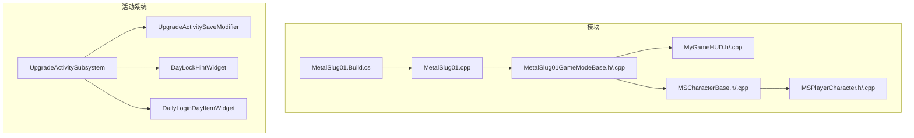
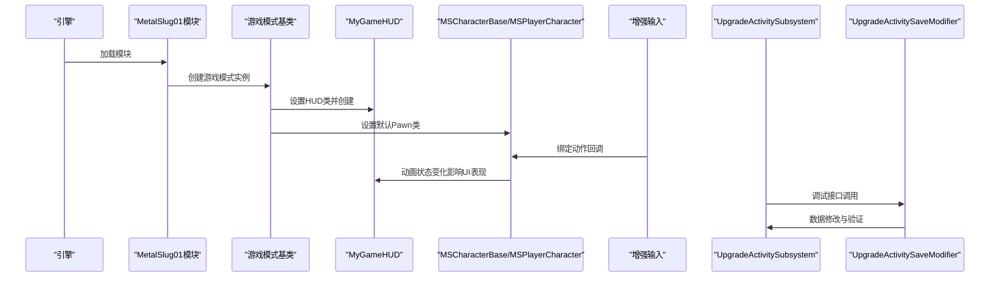
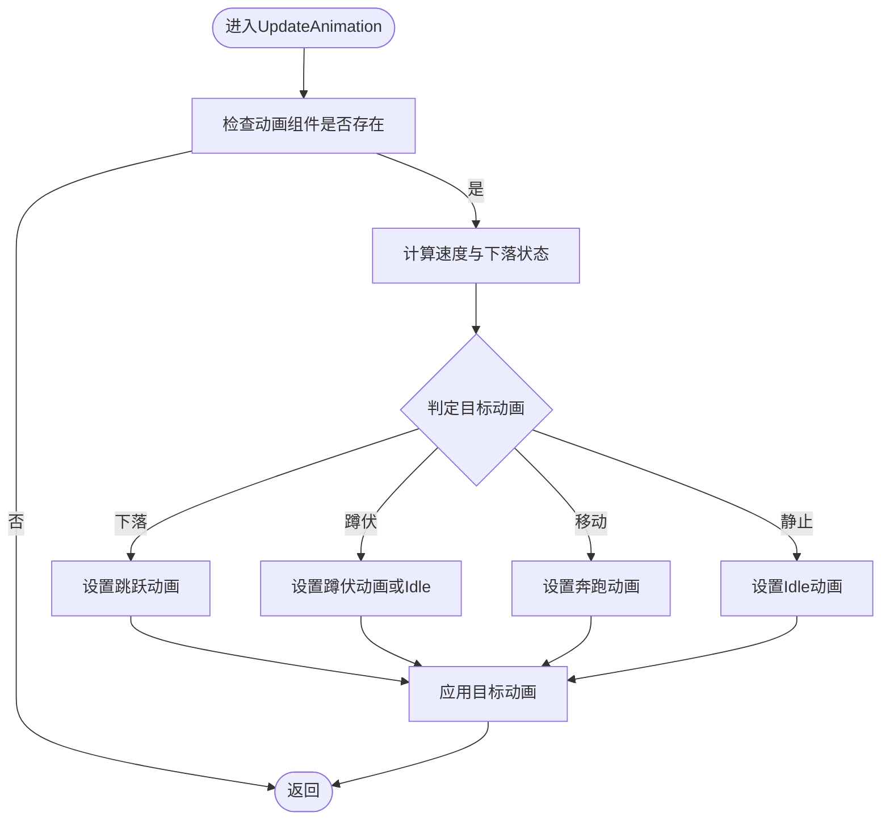
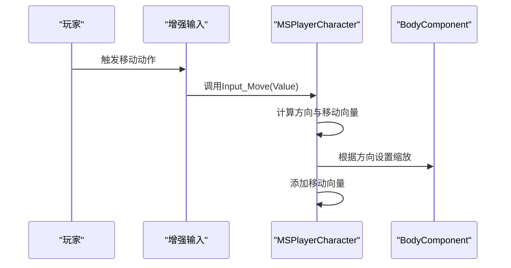
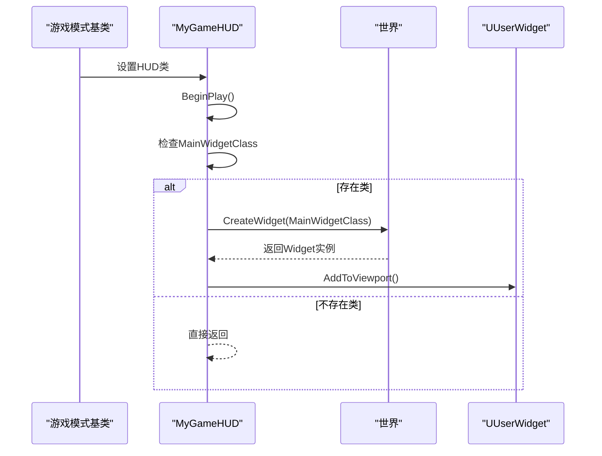
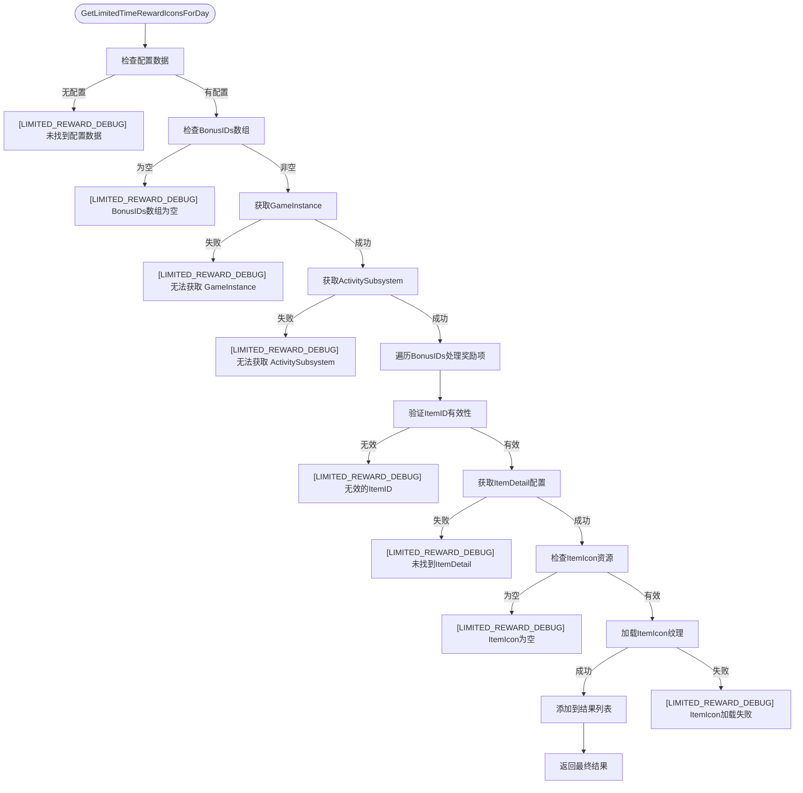
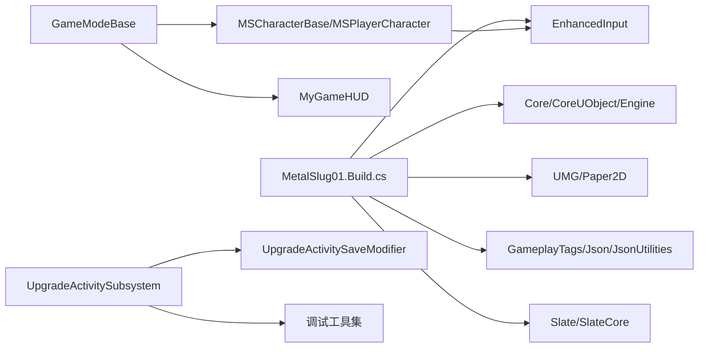

# 测试与调试

<cite>
**本文引用的文件**
- [MetalSlug01.Build.cs](file://MetalSlug01/Source/MetalSlug01/MetalSlug01.Build.cs)
- [MetalSlug01.cpp](file://MetalSlug01/Source/MetalSlug01/MetalSlug01.cpp)
- [MetalSlug01GameModeBase.h](file://MetalSlug01/Source/MetalSlug01/MetalSlug01GameModeBase.h)
- [MetalSlug01GameModeBase.cpp](file://MetalSlug01/Source/MetalSlug01/MetalSlug01GameModeBase.cpp)
- [MyGameHUD.h](file://MetalSlug01/Source/MetalSlug01/Public/UI/MyGameHUD.h)
- [MyGameHUD.cpp](file://MetalSlug01/Source/MetalSlug01/Private/UI/MyGameHUD.cpp)
- [MSCharacterBase.h](file://MetalSlug01/Source/MetalSlug01/Public/Characters/MSCharacterBase.h)
- [MSCharacterBase.cpp](file://MetalSlug01/Source/MetalSlug01/Private/Characters/MSCharacterBase.cpp)
- [MSPlayerCharacter.h](file://MetalSlug01/Source/MetalSlug01/Public/Characters/MSPlayerCharacter.h)
- [MSPlayerCharacter.cpp](file://MetalSlug01/Source/MetalSlug01/Private/Characters/MSPlayerCharacter.cpp)
- [UpgradeActivitySaveModifier.h](file://MetalSlug01/Source/MetalSlug01/Public/Tools/UpgradeActivitySaveModifier.h)
- [UpgradeActivitySaveModifier.cpp](file://MetalSlug01/Source/MetalSlug01/Private/Tools/UpgradeActivitySaveModifier.cpp)
- [UpgradeActivitySubsystem.h](file://MetalSlug01/Source/MetalSlug01/Public/UI/Activity/Core/UpgradeActivitySubsystem.h)
- [UpgradeActivitySubsystem.cpp](file://MetalSlug01/Source/MetalSlug01/Private/UI/Activity/Core/UpgradeActivitySubsystem.cpp)
- [DayLockHintWidget.h](file://MetalSlug01/Source/MetalSlug01/Public/UI/Activity/Pages/DailyUpgradeReward/DayLockHintWidget.h)
- [DayLockHintWidget.cpp](file://MetalSlug01/Source/MetalSlug01/Private/UI/Activity/Pages/DailyUpgradeReward/DayLockHintWidget.cpp)
- [DailyLoginDayItemWidget.h](file://MetalSlug01/Source/MetalSlug01/Public/UI/Activity/Pages/DailyLogin/DailyLoginDayItemWidget.h)
- [DailyLoginDayItemWidget.cpp](file://MetalSlug01/Source/MetalSlug01/Private/UI/Activity/Pages/DailyLogin/DailyLoginDayItemWidget.cpp)
- [ActivityConfirmPopupWidget.cpp](file://MetalSlug01/Source/MetalSlug01/Private/UI/Activity/Pages/SelectMultiplePopup/ActivityConfirmPopupWidget.cpp)
</cite>

## 更新摘要
**所做更改**
- 新增活动系统调试能力章节，详细介绍[LIMITED_REWARD_DEBUG]、[REWARD_ICON_DEBUG]、[REWARD_COUNT_DEBUG]等专用调试前缀
- 增强调试工具使用指南，涵盖奖励图标调试、限时奖励调试、奖励数量调试等专项调试方法
- 补充活动系统调试辅助功能，包括UpgradeActivitySaveModifier的调试接口和控制台命令
- 完善日志系统配置指南，提供活动系统专用的日志分类和调试输出策略

## 目录
1. [简介](#简介)
2. [项目结构](#项目结构)
3. [核心组件](#核心组件)
4. [架构总览](#架构总览)
5. [详细组件分析](#详细组件分析)
6. [活动系统调试能力增强](#活动系统调试能力增强)
7. [依赖分析](#依赖分析)
8. [性能考虑](#性能考虑)
9. [故障排除指南](#故障排除指南)
10. [结论](#结论)
11. [附录](#附录)

## 简介
本指南面向MetalSlug项目的测试与调试工作，聚焦于单元测试策略、自动化测试、调试技巧与工具、常见问题诊断与解决、日志系统使用与配置，以及测试驱动开发(TDD)的最佳实践。文档结合项目现有代码结构（角色、HUD、输入系统、动画更新）进行说明，并提供可直接落地的实践建议与流程图。

**更新** 本次更新重点增强了活动系统的调试能力，新增了专门的调试前缀[LIMITED_REWARD_DEBUG]、[REWARD_ICON_DEBUG]、[REWARD_COUNT_DEBUG]等，为开发者提供了更完善的调试工具和日志系统。

## 项目结构
项目采用Unreal Engine标准模块化组织方式，核心模块为MetalSlug01，包含游戏模式基类、HUD、角色基类与玩家角色、输入配置等。构建脚本定义了公共与私有依赖模块，确保UMG、Paper2D、EnhancedInput、GameplayTags、Json等子系统可用。

**图表来源**
- [MetalSlug01.Build.cs](file://MetalSlug01/Source/MetalSlug01/MetalSlug01.Build.cs#L1-L24)
- [MetalSlug01.cpp](file://MetalSlug01/Source/MetalSlug01/MetalSlug01.cpp#L1-L11)
- [UpgradeActivitySubsystem.h](file://MetalSlug01/Source/MetalSlug01/Public/UI/Activity/Core/UpgradeActivitySubsystem.h)
- [UpgradeActivitySaveModifier.h](file://MetalSlug01/Source/MetalSlug01/Public/Tools/UpgradeActivitySaveModifier.h)
- [DayLockHintWidget.h](file://MetalSlug01/Source/MetalSlug01/Public/UI/Activity/Pages/DailyUpgradeReward/DayLockHintWidget.h)
- [DailyLoginDayItemWidget.h](file://MetalSlug01/Source/MetalSlug01/Public/UI/Activity/Pages/DailyLogin/DailyLoginDayItemWidget.h)

**章节来源**
- [MetalSlug01.Build.cs](file://MetalSlug01/Source/MetalSlug01/MetalSlug01.Build.cs#L1-L24)
- [MetalSlug01.cpp](file://MetalSlug01/Source/MetalSlug01/MetalSlug01.cpp#L1-L11)

## 核心组件
- 游戏模块与入口
  - 模块实现与主入口负责加载模块并建立游戏生命周期入口点。
- 游戏模式基类
  - 负责设置默认Pawn类与HUD类，确保蓝图Pawn被正确解析并作为默认玩家单位。
- HUD系统
  - 在BeginPlay中根据配置创建并添加主界面Widget到视口。
- 角色系统
  - 角色基类：初始化Paper2D动画组件、设置平面约束与蹲伏参数、首帧强制赋动画避免黑屏。
  - 玩家角色：配置相机臂与正交摄像机、绑定增强输入动作、处理移动与朝向翻转。
- 输入系统
  - 使用EnhancedInput与输入配置对象，绑定移动、跳跃、蹲伏等动作回调。
- 活动系统
  - UpgradeActivitySubsystem：管理每日升级奖励活动的核心逻辑，包括奖励图标获取、限时奖励处理等。
  - UpgradeActivitySaveModifier：提供运行时修改活动数据的调试工具，支持经验值、奖励图标、任务进度等修改。

**章节来源**
- [MetalSlug01.cpp](file://MetalSlug01/Source/MetalSlug01/MetalSlug01.cpp#L1-L11)
- [MetalSlug01GameModeBase.cpp](file://MetalSlug01/Source/MetalSlug01/MetalSlug01GameModeBase.cpp#L1-L26)
- [MyGameHUD.cpp](file://MetalSlug01/Source/MetalSlug01/Private/UI/MyGameHUD.cpp#L1-L19)
- [MSCharacterBase.cpp](file://MetalSlug01/Source/MetalSlug01/Private/Characters/MSCharacterBase.cpp#L1-L64)
- [MSPlayerCharacter.cpp](file://MetalSlug01/Source/MetalSlug01/Private/Characters/MSPlayerCharacter.cpp#L1-L62)
- [UpgradeActivitySubsystem.cpp](file://MetalSlug01/Source/MetalSlug01/Private/UI/Activity/Core/UpgradeActivitySubsystem.cpp#L1-L200)
- [UpgradeActivitySaveModifier.cpp](file://MetalSlug01/Source/MetalSlug01/Private/Tools/UpgradeActivitySaveModifier.cpp#L1-L200)

## 架构总览
下图展示从模块入口到游戏模式、HUD与角色的交互关系，以及输入系统对角色行为的影响。同时体现了活动系统的调试能力增强。

**图表来源**
- [MetalSlug01.cpp](file://MetalSlug01/Source/MetalSlug01/MetalSlug01.cpp#L1-L11)
- [MetalSlug01GameModeBase.cpp](file://MetalSlug01/Source/MetalSlug01/MetalSlug01GameModeBase.cpp#L1-L26)
- [MyGameHUD.cpp](file://MetalSlug01/Source/MetalSlug01/Private/UI/MyGameHUD.cpp#L1-L19)
- [MSCharacterBase.cpp](file://MetalSlug01/Source/MetalSlug01/Private/Characters/MSCharacterBase.cpp#L1-L64)
- [MSPlayerCharacter.cpp](file://MetalSlug01/Source/MetalSlug01/Private/Characters/MSPlayerCharacter.cpp#L1-L62)
- [UpgradeActivitySubsystem.cpp](file://MetalSlug01/Source/MetalSlug01/Private/UI/Activity/Core/UpgradeActivitySubsystem.cpp#L1-L200)
- [UpgradeActivitySaveModifier.cpp](file://MetalSlug01/Source/MetalSlug01/Private/Tools/UpgradeActivitySaveModifier.cpp#L1-L200)

## 详细组件分析

### 角色动画与状态更新
- 更新逻辑要点
  - 在Tick中调用动画更新，依据速度、是否下落、是否蹲伏切换不同动画。
  - 首帧强制设置Idle动画，避免初始黑屏或延迟显示。
- 可测试关注点
  - 动画切换条件分支覆盖（静止、移动、下落、蹲伏）。
  - 速度阈值与下落检测的边界情况。
  - 组件有效性校验（动画组件存在性）。

**图表来源**
- [MSCharacterBase.cpp](file://MetalSlug01/Source/MetalSlug01/Private/Characters/MSCharacterBase.cpp#L47-L64)

**章节来源**
- [MSCharacterBase.h](file://MetalSlug01/Source/MetalSlug01/Public/Characters/MSCharacterBase.h#L1-L50)
- [MSCharacterBase.cpp](file://MetalSlug01/Source/MetalSlug01/Private/Characters/MSCharacterBase.cpp#L1-L64)

### 玩家输入与移动控制
- 输入绑定
  - 使用增强输入组件绑定移动、跳跃、蹲伏动作，回调至角色方法。
- 移动与朝向
  - 根据输入值添加移动向量，并按方向翻转角色模型X轴缩放。
- 可测试关注点
  - 输入值为零时的边界处理。
  - 控制器有效性与输入回调触发。
  - 朝向翻转与动画组件存在性的协同。

**图表来源**
- [MSPlayerCharacter.cpp](file://MetalSlug01/Source/MetalSlug01/Private/Characters/MSPlayerCharacter.cpp#L29-L62)

**章节来源**
- [MSPlayerCharacter.h](file://MetalSlug01/Source/MetalSlug01/Public/Characters/MSPlayerCharacter.h#L1-L41)
- [MSPlayerCharacter.cpp](file://MetalSlug01/Source/MetalSlug01/Private/Characters/MSPlayerCharacter.cpp#L1-L62)

### HUD与UI加载
- 加载流程
  - 在BeginPlay中检查主Widget类，若存在则创建并添加到视口。
- 可测试关注点
  - Widget类为空时的容错处理。
  - 创建成功后的添加到视口流程。

**图表来源**
- [MyGameHUD.cpp](file://MetalSlug01/Source/MetalSlug01/Private/UI/MyGameHUD.cpp#L1-L19)

**章节来源**
- [MyGameHUD.h](file://MetalSlug01/Source/MetalSlug01/Public/UI/MyGameHUD.h#L1-L23)
- [MyGameHUD.cpp](file://MetalSlug01/Source/MetalSlug01/Private/UI/MyGameHUD.cpp#L1-L19)

### 游戏模式基类与Pawn设置
- 关键职责
  - 解析蓝图Pawn类并设置为DefaultPawnClass。
  - 设置HUD类为自定义HUD。
- 可测试关注点
  - 蓝图类解析失败时的容错与日志记录。
  - HUD类设置的正确性。

**章节来源**
- [MetalSlug01GameModeBase.h](file://MetalSlug01/Source/MetalSlug01/MetalSlug01GameModeBase.h#L1-L17)
- [MetalSlug01GameModeBase.cpp](file://MetalSlug01/Source/MetalSlug01/MetalSlug01GameModeBase.cpp#L1-L26)

## 活动系统调试能力增强

### 专用调试前缀系统
活动系统新增了专门的调试前缀，为开发者提供精细化的调试输出：

- **[LIMITED_REWARD_DEBUG]**：限时奖励系统的专用调试前缀，用于追踪限时奖励图标的获取、加载和显示过程
- **[REWARD_ICON_DEBUG]**：奖励图标系统的调试前缀，用于监控奖励图标的创建、配置和容器管理
- **[REWARD_COUNT_DEBUG]**：奖励数量系统的调试前缀，用于跟踪奖励数量的解析、验证和显示

### 限时奖励调试功能
UpgradeActivitySubsystem增强了限时奖励的调试能力：

**图表来源**
- [UpgradeActivitySubsystem.cpp](file://MetalSlug01/Source/MetalSlug01/Private/UI/Activity/Core/UpgradeActivitySubsystem.cpp#L1620-L1695)

### 奖励图标调试功能
DayLockHintWidget实现了全面的奖励图标调试系统：

- **容器状态监控**：实时监控TaskRewardIconsContainer和LimitedTimeRewardIconsContainer的可见性和尺寸
- **图标创建追踪**：详细记录每个奖励图标的创建、配置和添加过程
- **数量显示验证**：验证奖励数量的解析和显示，处理数组越界等异常情况

### 奖励数量调试功能
活动确认弹窗Widget增强了奖励数量的调试能力：

- **数量解析追踪**：监控奖励数量字符串的解析过程，支持逗号分隔的多数值格式
- **索引边界检查**：验证奖励数量数组的边界，防止越界访问
- **动态数量更新**：实时显示和更新奖励数量，支持运行时修改

### 调试工具与辅助功能
UpgradeActivitySaveModifier提供了丰富的调试辅助功能：

- **强制刷新机制**：`ForceRefreshAllPages()`方法用于强制所有UI组件重新获取最新内存数据
- **验证日志系统**：`ValidateAndLog()`方法提供统一的初始化状态验证和日志记录
- **控制台命令注册**：支持注册和注销控制台命令，便于运行时调试
- **调试显示功能**：`ShowDailyUpgradePage()`方法用于显示每日升级奖励页面进行调试

**章节来源**
- [UpgradeActivitySubsystem.cpp](file://MetalSlug01/Source/MetalSlug01/Private/UI/Activity/Core/UpgradeActivitySubsystem.cpp#L1620-L1695)
- [DayLockHintWidget.cpp](file://MetalSlug01/Source/MetalSlug01/Private/UI/Activity/Pages/DailyUpgradeReward/DayLockHintWidget.cpp#L40-L239)
- [DailyLoginDayItemWidget.cpp](file://MetalSlug01/Source/MetalSlug01/Private/UI/Activity/Pages/DailyLogin/DailyLoginDayItemWidget.cpp#L495-L665)
- [ActivityConfirmPopupWidget.cpp](file://MetalSlug01/Source/MetalSlug01/Private/UI/Activity/Pages/SelectMultiplePopup/ActivityConfirmPopupWidget.cpp#L142-L170)
- [UpgradeActivitySaveModifier.h](file://MetalSlug01/Source/MetalSlug01/Public/Tools/UpgradeActivitySaveModifier.h#L1-L347)
- [UpgradeActivitySaveModifier.cpp](file://MetalSlug01/Source/MetalSlug01/Private/Tools/UpgradeActivitySaveModifier.cpp#L1-L200)

## 依赖分析
- 模块依赖
  - 公共依赖包含Core、CoreUObject、Engine、InputCore、UMG、Paper2D、EnhancedInput、GameplayTags、Json、JsonUtilities。
  - 私有依赖包含Slate、SlateCore，用于编辑器UI。
- 组件耦合
  - 游戏模式与HUD、角色之间通过类设置建立弱耦合关系。
  - 角色与输入系统通过增强输入组件解耦绑定。
  - 活动系统通过UpgradeActivitySaveModifier提供独立的调试接口，与核心系统解耦。

**图表来源**
- [MetalSlug01.Build.cs](file://MetalSlug01/Source/MetalSlug01/MetalSlug01.Build.cs#L1-L24)
- [MetalSlug01GameModeBase.cpp](file://MetalSlug01/Source/MetalSlug01/MetalSlug01GameModeBase.cpp#L1-L26)
- [UpgradeActivitySubsystem.h](file://MetalSlug01/Source/MetalSlug01/Public/UI/Activity/Core/UpgradeActivitySubsystem.h)
- [UpgradeActivitySaveModifier.h](file://MetalSlug01/Source/MetalSlug01/Public/Tools/UpgradeActivitySaveModifier.h)

**章节来源**
- [MetalSlug01.Build.cs](file://MetalSlug01/Source/MetalSlug01/MetalSlug01.Build.cs#L1-L24)

## 性能考虑
- 动画更新
  - 在Tick中调用UpdateAnimation，应避免在高频路径中执行昂贵操作；可将动画切换逻辑封装为轻量函数，减少每帧开销。
- 组件访问
  - 对BodyComponent的频繁访问可通过缓存指针或在构造函数中获取，降低运行时查找成本。
- 输入处理
  - 输入回调中仅做必要计算，避免在回调内进行复杂逻辑；将复杂逻辑移至Tick或事件队列。
- HUD加载
  - Widget创建与添加到视口为一次性操作，注意避免重复创建导致的内存与性能浪费。
- 活动系统调试
  - 调试日志输出应谨慎使用，避免在生产环境中产生过多日志输出影响性能。
  - 调试功能应在开发模式下启用，在发布版本中禁用以减少性能开销。

## 故障排除指南
- 编译错误
  - 头文件缺失：确保在需要操作Paper2D组件的源文件中包含相应头文件，例如玩家角色中对PaperFlipbookComponent的使用。
  - 蓝图类解析失败：检查蓝图Pawn路径与_C后缀是否正确，确保资源已导入且路径有效。
- 运行时异常
  - 动画组件为空：在UpdateAnimation中增加空指针保护，避免崩溃。
  - 输入回调未触发：确认增强输入组件已正确绑定，且控制器有效。
  - HUD未显示：检查MainWidgetClass是否设置，CreateWidget返回值是否为空。
  - 活动系统调试：检查调试前缀是否正确使用，验证日志输出是否正常。
- 性能问题
  - 动画切换卡顿：检查动画资源大小与数量，减少每帧动画切换频率。
  - 输入响应迟滞：优化输入回调内的计算，避免阻塞主线程。
  - 调试日志过多：合理使用调试前缀，避免在热路径中输出大量日志。

**章节来源**
- [MSPlayerCharacter.cpp](file://MetalSlug01/Source/MetalSlug01/Private/Characters/MSPlayerCharacter.cpp#L1-L62)
- [MSCharacterBase.cpp](file://MetalSlug01/Source/MetalSlug01/Private/Characters/MSCharacterBase.cpp#L1-L64)
- [MyGameHUD.cpp](file://MetalSlug01/Source/MetalSlug01/Private/UI/MyGameHUD.cpp#L1-L19)
- [MetalSlug01GameModeBase.cpp](file://MetalSlug01/Source/MetalSlug01/MetalSlug01GameModeBase.cpp#L1-L26)
- [UpgradeActivitySubsystem.cpp](file://MetalSlug01/Source/MetalSlug01/Private/UI/Activity/Core/UpgradeActivitySubsystem.cpp#L1620-L1695)

## 结论
本指南基于MetalSlug现有代码结构，给出了测试与调试的系统化方法。通过明确各组件职责、梳理数据流与控制流、识别可测试点与潜在风险，配合TDD实践与日志配置，可显著提升代码质量与开发效率。

**更新** 本次更新重点增强了活动系统的调试能力，新增了专门的调试前缀系统、奖励图标调试功能、限时奖励调试能力和调试工具辅助功能。这些增强为开发者提供了更完善的调试工具和日志系统，能够有效提升活动系统的开发和维护效率。

后续可在现有基础上扩展单元测试与自动化测试，完善日志体系与性能监控，特别是在活动系统的调试和性能优化方面。

## 附录

### 单元测试策略与实现方法
- 测试框架选择
  - 使用Unreal Engine内置的单元测试框架（如TestModule），针对纯C++逻辑编写可独立运行的测试用例。
- 测试用例设计
  - 角色动画：覆盖静止、移动、下落、蹲伏四类状态的切换条件与边界值。
  - 输入处理：验证输入值为正负与零时的行为差异，以及控制器有效性判断。
  - HUD加载：验证MainWidgetClass为空与非空两种场景下的行为。
  - 游戏模式：验证蓝图Pawn类解析与HUD类设置的正确性。
  - 活动系统：验证奖励图标获取、限时奖励处理、数据修改等功能的正确性。
- 自动化测试
  - 将测试集成到CI流水线，确保每次提交均运行关键测试集。

### 调试技巧与工具使用
- 断点设置
  - 在角色动画更新、输入回调、HUD创建等关键路径设置断点，观察状态变化。
  - 在活动系统的调试前缀输出处设置条件断点，仅在特定条件下触发。
- 变量监视
  - 监控速度、下落状态、输入值、组件指针等关键变量。
  - 监控活动系统的调试变量，如奖励图标索引、限时奖励状态等。
- 内存检查
  - 使用UE内存工具检查Widget与组件的生命周期，避免重复创建与泄漏。
  - 监控活动系统数据结构的内存使用情况。
- 性能分析
  - 使用GPU/帧时间分析工具定位热点，优化动画与输入处理。
  - 分析活动系统调试日志的性能影响，避免在生产环境使用过多调试输出。

### 日志系统使用与配置
- 调试输出
  - 在关键路径输出简明日志，包含状态、输入值、组件有效性等信息。
  - 使用专用调试前缀区分不同类型的操作，便于日志过滤和分析。
- 错误记录
  - 对解析失败、空指针等异常情况记录错误日志并提供上下文信息。
  - 活动系统错误日志应包含具体的配置数据和操作步骤。
- 性能监控
  - 记录关键函数耗时与调用频率，辅助性能优化。
  - 活动系统性能日志应包含奖励图标加载时间、数据查询耗时等指标。

### 测试驱动开发实践指南
- 先写测试再写实现
  - 明确期望行为与边界条件，编写最小可行测试，再实现对应功能。
  - 活动系统开发应先编写调试用例，验证调试功能的正确性。
- 小步快跑
  - 每次只增加一个测试与对应的实现，保持测试快速反馈。
  - 调试功能开发采用渐进式方法，逐步完善调试工具。
- 可维护性
  - 保持测试简洁、可读性强，避免过度耦合具体实现细节。
  - 调试工具应具有良好的API设计和清晰的文档说明。

### 活动系统调试最佳实践
- 调试前缀使用规范
  - 严格遵循[LIMITED_REWARD_DEBUG]、[REWARD_ICON_DEBUG]、[REWARD_COUNT_DEBUG]等专用前缀的使用场景。
  - 在开发阶段启用完整调试输出，在测试阶段适当精简日志。
- 调试工具配置
  - 合理配置UpgradeActivitySaveModifier的调试功能，避免影响正常游戏体验。
  - 使用控制台命令进行运行时调试，提高调试效率。
- 日志分析方法
  - 建立标准化的日志分析流程，快速定位活动系统问题。
  - 使用日志聚合工具分析调试日志，发现潜在的性能问题。