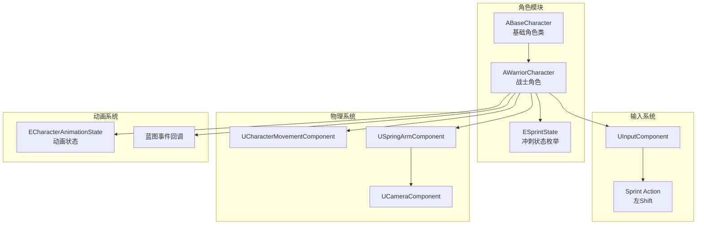
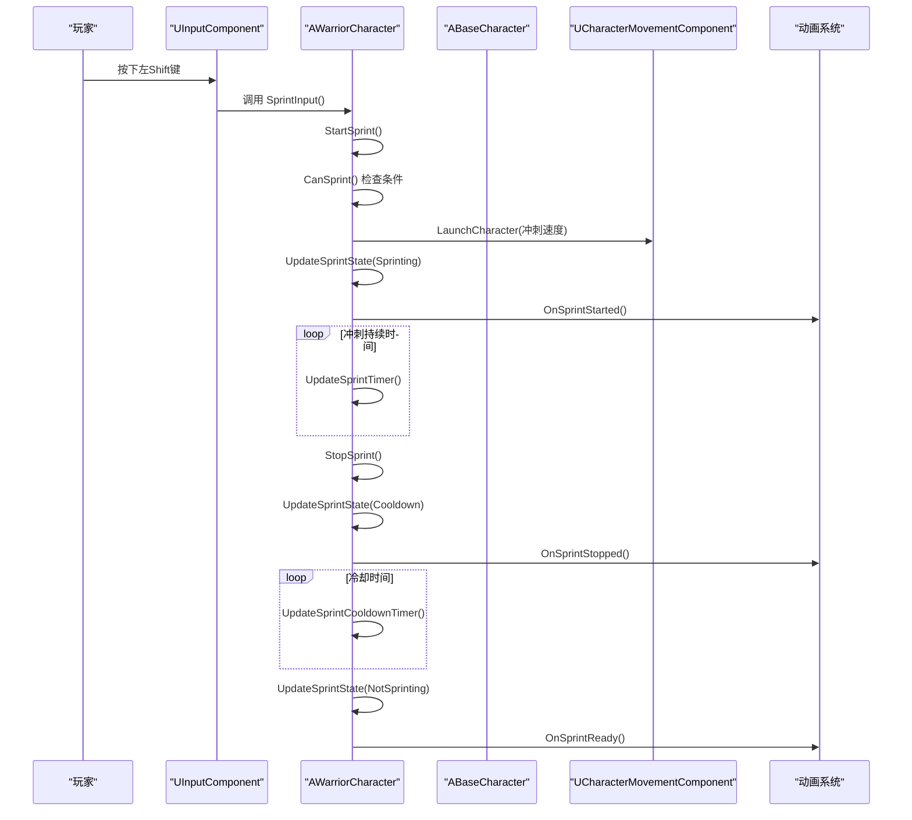
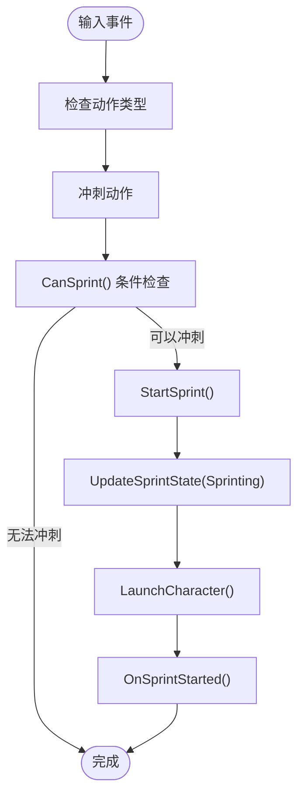
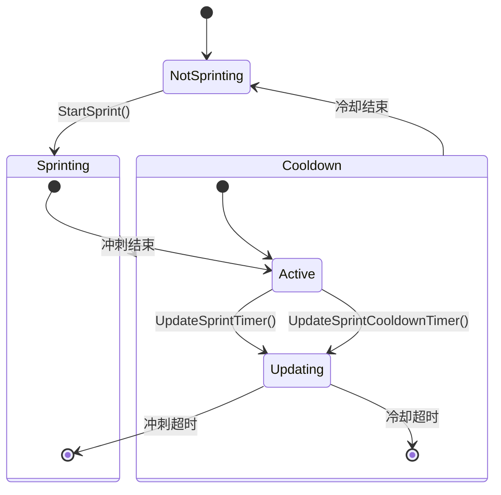
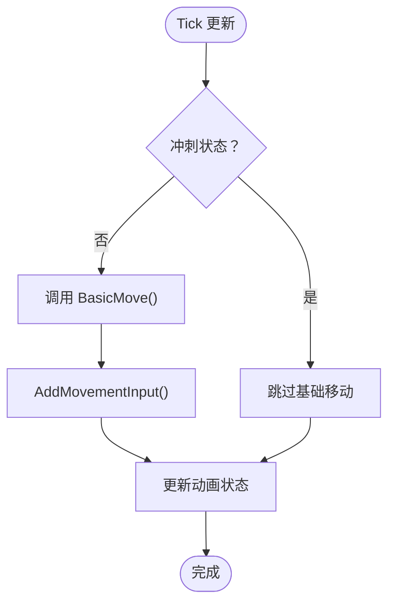
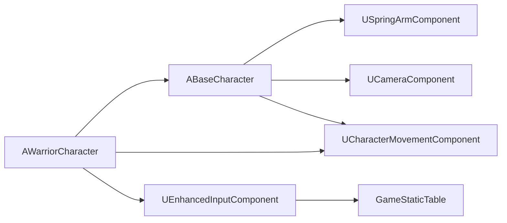

# 玩家角色 (WarriorCharacter)

<cite>
**本文引用的文件列表**
- [WarriorCharacter.h](file://MetalSlug01/Source/MetalSlug01/Public/Characters/WarriorCharacter.h)
- [WarriorCharacter.cpp](file://MetalSlug01/Source/MetalSlug01/Private/Characters/WarriorCharacter.cpp)
- [BaseCharacter.h](file://MetalSlug01/Source/MetalSlug01/Public/Characters/BaseCharacter.h)
- [BaseCharacter.cpp](file://MetalSlug01/Source/MetalSlug01/Private/Characters/BaseCharacter.cpp)
- [GameStaticTable.h](file://MetalSlug01/Source/MetalSlug01/Public/Data/GameStaticTable.h)
- [DefaultInput.ini](file://MetalSlug01/Config/DefaultInput.ini)
- [MyGameHUD.h](file://MetalSlug01/Source/MetalSlug01/Public/UI/MyGameHUD.h)
- [MyGameHUD.cpp](file://MetalSlug01/Source/MetalSlug01/Private/UI/MyGameHUD.cpp)
</cite>

## 目录
1. [简介](#简介)
2. [项目结构](#项目结构)
3. [核心组件](#核心组件)
4. [架构总览](#架构总览)
5. [详细组件分析](#详细组件分析)
6. [依赖关系分析](#依赖关系分析)
7. [性能考量](#性能考量)
8. [故障排查指南](#故障排查指南)
9. [结论](#结论)
10. [附录](#附录)

## 简介
本文件为 WarriorCharacter 玩家角色的全面技术文档，覆盖战士特有的冲刺系统、基础角色功能继承、输入处理系统集成、物理模拟（移动控制、跳跃机制、碰撞检测）、动画状态机、与游戏世界的交互逻辑（平台跳跃、地面检测、重力模拟），以及角色定制与扩展方法（移动参数、新增动画状态、冲刺技能扩展）。文档同时提供关键流程的时序图与类图，并给出可直接定位到源码的路径，便于快速查阅与二次开发。

## 项目结构
WarriorCharacter 位于 MetalSlug01 项目的角色模块中，继承自基础角色类 ABaseCharacter，实现了战士特有的冲刺技能系统。该系统包含完整的状态管理、计时器控制和动画事件回调，同时保留了基础角色的所有通用功能。

**图表来源**
- [WarriorCharacter.h](file://MetalSlug01/Source/MetalSlug01/Public/Characters/WarriorCharacter.h#L12-L117)
- [BaseCharacter.h](file://MetalSlug01/Source/MetalSlug01/Public/Characters/BaseCharacter.h#L9-L292)
- [DefaultInput.ini](file://MetalSlug01/Config/DefaultInput.ini#L80-L85)

**章节来源**
- [WarriorCharacter.h](file://MetalSlug01/Source/MetalSlug01/Public/Characters/WarriorCharacter.h#L1-L117)
- [WarriorCharacter.cpp](file://MetalSlug01/Source/MetalSlug01/Private/Characters/WarriorCharacter.cpp#L1-L280)
- [BaseCharacter.h](file://MetalSlug01/Source/MetalSlug01/Public/Characters/BaseCharacter.h#L1-L292)
- [BaseCharacter.cpp](file://MetalSlug01/Source/MetalSlug01/Private/Characters/BaseCharacter.cpp#L1-L462)
- [DefaultInput.ini](file://MetalSlug01/Config/DefaultInput.ini#L1-L91)

## 核心组件
- 基础角色类（ABaseCharacter）
  - 提供完整的角色管理系统，包括生命值、等级、动画状态、移动状态等。
  - 实现了基础移动控制（前后左右）、跳跃机制、地面检测、重力模拟。
  - 支持多种角色类型和玩家控制状态管理。
  - 提供丰富的蓝图事件回调接口。
- 战士角色类（AWarriorCharacter）
  - 继承自 ABaseCharacter，扩展了战士特有的冲刺系统。
  - 实现了完整的冲刺状态机，包含冲刺中、冷却中、未冲刺三种状态。
  - 提供冲刺输入处理、状态切换、计时器管理等功能。
  - 通过蓝图事件回调实现与动画系统的无缝集成。
- 冲刺系统
  - 支持配置化的冲刺参数（速度倍率、持续时间、冷却时间）。
  - 实现智能方向检测，支持静止冲刺和移动冲刺两种模式。
  - 提供完整的状态监控和事件通知机制。

**章节来源**
- [BaseCharacter.h](file://MetalSlug01/Source/MetalSlug01/Public/Characters/BaseCharacter.h#L9-L292)
- [BaseCharacter.cpp](file://MetalSlug01/Source/MetalSlug01/Private/Characters/BaseCharacter.cpp#L12-L462)
- [WarriorCharacter.h](file://MetalSlug01/Source/MetalSlug01/Public/Characters/WarriorCharacter.h#L12-L117)
- [WarriorCharacter.cpp](file://MetalSlug01/Source/MetalSlug01/Private/Characters/WarriorCharacter.cpp#L13-L280)

## 架构总览
WarriorCharacter 的运行时架构围绕"输入 -> 冲刺系统 -> 物理/动画 -> 渲染"的主循环展开。基础角色类提供通用的移动和状态管理，战士类在此基础上增加了冲刺功能。输入系统通过 Enhanced Input 组件绑定冲刺动作，冲刺系统管理状态转换和计时器，物理系统处理移动和碰撞，动画系统通过蓝图事件实现状态同步。

**图表来源**
- [WarriorCharacter.cpp](file://MetalSlug01/Source/MetalSlug01/Private/Characters/WarriorCharacter.cpp#L84-L158)
- [BaseCharacter.cpp](file://MetalSlug01/Source/MetalSlug01/Private/Characters/BaseCharacter.cpp#L68-L95)

## 详细组件分析

### 输入处理系统集成与响应机制
- 输入绑定
  - 使用 Enhanced Input 系统绑定 Sprint 动作到左Shift键，实现一键冲刺。
  - 基础角色类支持多玩家输入映射，可通过 PlayerIndex 参数区分不同玩家的控制。
  - 输入组件类为 UEnhancedInputComponent，提供更灵活的输入处理能力。
- 冲刺输入回调
  - SprintInput() 方法作为输入回调入口，直接调用 StartSprint() 开始冲刺。
  - 支持在蓝图中重写此方法以实现自定义的输入处理逻辑。
- 强制接收输入
  - 通过 AutoPossessPlayer 设置确保角色能持续接收输入。
  - 基础角色类提供了完整的输入组件初始化和绑定机制。

**图表来源**
- [WarriorCharacter.cpp](file://MetalSlug01/Source/MetalSlug01/Private/Characters/WarriorCharacter.cpp#L84-L134)
- [WarriorCharacter.h](file://MetalSlug01/Source/MetalSlug01/Public/Characters/WarriorCharacter.h#L32-L43)

**章节来源**
- [WarriorCharacter.cpp](file://MetalSlug01/Source/MetalSlug01/Private/Characters/WarriorCharacter.cpp#L79-L85)
- [BaseCharacter.cpp](file://MetalSlug01/Source/MetalSlug01/Private/Characters/BaseCharacter.cpp#L102-L135)
- [DefaultInput.ini](file://MetalSlug01/Config/DefaultInput.ini#L80-L85)

### 冲刺系统与状态管理
- 冲刺状态机
  - ESprintState 枚举定义了三种状态：NotSprinting、Sprinting、Cooldown。
  - 状态转换遵循严格的时序逻辑，确保不会出现冲突的状态。
  - 通过 UpdateSprintState() 统一管理状态转换和事件触发。
- 冲刺参数配置
  - SprintSpeedMultiplier：冲刺速度倍率，默认3000.0f。
  - SprintDuration：冲刺持续时间，默认0.3秒。
  - SprintCooldownDuration：冲刺冷却时间，默认1.0秒。
  - NormalMovementSpeed：正常移动速度，默认600.0f。
- 冲刺条件检查
  - CanSprint() 方法确保只有在满足条件时才能开始冲刺。
  - 条件包括：当前不在冲刺中、不在冷却中、移动组件存在、角色在地面上。
- 智能方向检测
  - StartSprint() 方法自动检测玩家的最后移动方向。
  - 如果玩家静止按冲刺，默认向角色正前方冲刺。
  - 对方向向量进行归一化处理，防止斜向冲刺速度异常。

**图表来源**
- [WarriorCharacter.h](file://MetalSlug01/Source/MetalSlug01/Public/Characters/WarriorCharacter.h#L82-L90)
- [WarriorCharacter.cpp](file://MetalSlug01/Source/MetalSlug01/Private/Characters/WarriorCharacter.cpp#L211-L270)

**章节来源**
- [WarriorCharacter.h](file://MetalSlug01/Source/MetalSlug01/Public/Characters/WarriorCharacter.h#L68-L117)
- [WarriorCharacter.cpp](file://MetalSlug01/Source/MetalSlug01/Private/Characters/WarriorCharacter.cpp#L164-L175)
- [WarriorCharacter.cpp](file://MetalSlug01/Source/MetalSlug01/Private/Characters/WarriorCharacter.cpp#L99-L158)

### 物理模拟与移动控制
- 基础移动系统
  - 继承自 ABaseCharacter，保留了完整的移动控制功能。
  - 支持前后左右四向移动，通过 MoveForward() 和 MoveRight() 处理输入。
  - 使用 AddMovementInput() 实现平滑的移动效果。
- 冲刺物理实现
  - 使用 LaunchCharacter() 函数实现瞬间冲刺效果。
  - 第二个参数表示覆盖XY轴速度，第三个参数表示覆盖Z轴速度。
  - 冲刺时会强制重置角色的物理速度，确保冲刺的即时性。
- 地面检测与重力
  - 通过 CharacterMovementComponent 的 IsMovingOnGround() 检测地面状态。
  - 基础角色类实现了完整的地面检测和重力模拟。
  - 动画状态机根据地面状态切换不同的动画。

**图表来源**
- [WarriorCharacter.cpp](file://MetalSlug01/Source/MetalSlug01/Private/Characters/WarriorCharacter.cpp#L181-L191)
- [BaseCharacter.cpp](file://MetalSlug01/Source/MetalSlug01/Private/Characters/BaseCharacter.cpp#L68-L95)

**章节来源**
- [BaseCharacter.cpp](file://MetalSlug01/Source/MetalSlug01/Private/Characters/BaseCharacter.cpp#L183-L191)
- [BaseCharacter.cpp](file://MetalSlug01/Source/MetalSlug01/Private/Characters/BaseCharacter.cpp#L68-L95)
- [WarriorCharacter.cpp](file://MetalSlug01/Source/MetalSlug01/Private/Characters/WarriorCharacter.cpp#L125-L130)

### 动画状态机与冲刺动画集成
- 动画状态继承
  - WarriorCharacter 继承自 ABaseCharacter，共享相同的动画状态系统。
  - ECharacterAnimationState 枚举包括 Idle、Running、Jumping、Falling、TakingDamage、Dying 等状态。
- 冲刺动画事件
  - OnSprintStarted()：冲刺开始时触发，可用于播放冲刺动画。
  - OnSprintStopped()：冲刺停止时触发，可用于播放冲刺结束动画。
  - OnSprintCooldownStarted()：冲刺冷却开始时触发，可用于播放冷却动画。
  - OnSprintReady()：冲刺准备就绪时触发，可用于播放待机动画。
- 动画状态同步
  - 基础角色类的 UpdateMovementState() 方法会根据移动状态自动切换动画。
  - 冲刺状态通过蓝图事件与动画系统解耦，便于自定义动画。
- 冲刺方向可视化
  - 冲刺时会根据玩家最后的移动方向确定冲刺方向。
  - 可以在动画系统中根据冲刺方向调整角色朝向。

**章节来源**
- [BaseCharacter.h](file://MetalSlug01/Source/MetalSlug01/Public/Characters/BaseCharacter.h#L98-L104)
- [BaseCharacter.cpp](file://MetalSlug01/Source/MetalSlug01/Private/Characters/BaseCharacter.cpp#L222-L231)
- [WarriorCharacter.h](file://MetalSlug01/Source/MetalSlug01/Public/Characters/WarriorCharacter.h#L96-L106)
- [WarriorCharacter.cpp](file://MetalSlug01/Source/MetalSlug01/Private/Characters/WarriorCharacter.cpp#L132-L133)

### 与游戏世界的交互逻辑
- 相机系统
  - 继承自 ABaseCharacter，使用 SpringArmComponent 和 CameraComponent 实现相机跟随。
  - 支持多玩家相机偏移，通过 PlayerIndex 参数区分不同玩家的视角。
  - 相机设置为固定距离和角度，适合2D平台游戏风格。
- 输入系统配置
  - DefaultInput.ini 配置了增强输入系统，支持键盘和手柄输入。
  - 冲刺键绑定为左Shift键，可随时在编辑器中修改。
  - 支持多平台输入设备，包括手柄、VR控制器等。
- HUD 与界面
  - MyGameHUD 负责主界面显示，与角色系统解耦。
  - 可以通过蓝图事件获取角色状态信息用于UI显示。
  - 支持多玩家状态显示和切换。

**章节来源**
- [BaseCharacter.cpp](file://MetalSlug01/Source/MetalSlug01/Private/Characters/BaseCharacter.cpp#L14-L48)
- [DefaultInput.ini](file://MetalSlug01/Config/DefaultInput.ini#L80-L85)
- [MyGameHUD.cpp](file://MetalSlug01/Source/MetalSlug01/Private/UI/MyGameHUD.cpp#L4-L18)

### 定制与扩展指导
- 冲刺系统定制
  - 修改 SprintSpeedMultiplier 可调整冲刺速度强度。
  - 调整 SprintDuration 可控制冲刺持续时间。
  - 修改 SprintCooldownDuration 可改变冷却时间。
  - 可以在蓝图中重写 CanSprint() 方法实现自定义的冲刺条件。
- 动画系统扩展
  - 在蓝图中为冲刺相关事件添加自定义动画逻辑。
  - 可以扩展 ESprintState 枚举以支持更多冲刺状态。
  - 可以在 OnSprintStarted() 中添加音效和粒子效果。
- 基础功能扩展
  - 可以在 WarriorCharacter 中添加新的移动能力，如跳跃、滑铲等。
  - 可以扩展输入系统以支持更多的动作组合。
  - 可以修改相机系统以适应不同的游戏视角需求。
- 多玩家支持
  - 可以通过 PlayerIndex 参数支持更多玩家。
  - 可以扩展角色切换系统以支持角色轮换。
  - 可以实现团队协作的冲刺配合机制。

**章节来源**
- [WarriorCharacter.h](file://MetalSlug01/Source/MetalSlug01/Public/Characters/WarriorCharacter.h#L68-L117)
- [BaseCharacter.h](file://MetalSlug01/Source/MetalSlug01/Public/Characters/BaseCharacter.h#L201-L292)
- [WarriorCharacter.cpp](file://MetalSlug01/Source/MetalSlug01/Private/Characters/WarriorCharacter.cpp#L164-L175)

## 依赖关系分析
- 组件依赖
  - AWarriorCharacter 依赖 ABaseCharacter 提供的基础功能。
  - 冲刺系统依赖 UCharacterMovementComponent 进行物理计算。
  - 输入系统依赖 UEnhancedInputComponent 进行事件处理。
  - 动画系统通过蓝图事件与角色系统解耦。
- 配置依赖
  - DefaultInput.ini 配置了输入映射和增强输入系统。
  - GameStaticTable.h 提供静态配置数据支持。
  - 通过编辑器可以修改各种参数而无需重新编译。
- 状态依赖
  - 冲刺状态机依赖严格的状态转换逻辑。
  - 动画状态与移动状态相互独立，通过事件进行通信。

**图表来源**
- [WarriorCharacter.h](file://MetalSlug01/Source/MetalSlug01/Public/Characters/WarriorCharacter.h#L4-L5)
- [BaseCharacter.h](file://MetalSlug01/Source/MetalSlug01/Public/Characters/BaseCharacter.h#L4-L6)
- [DefaultInput.ini](file://MetalSlug01/Config/DefaultInput.ini#L85-L86)

**章节来源**
- [WarriorCharacter.h](file://MetalSlug01/Source/MetalSlug01/Public/Characters/WarriorCharacter.h#L4-L5)
- [BaseCharacter.h](file://MetalSlug01/Source/MetalSlug01/Public/Characters/BaseCharacter.h#L4-L6)
- [DefaultInput.ini](file://MetalSlug01/Config/DefaultInput.ini#L85-L86)

## 性能考量
- 冲刺系统优化
  - 冲刺状态检查在 CanSprint() 中一次性完成，避免重复计算。
  - 计时器更新只在对应状态下进行，减少不必要的计算。
  - 冲刺时重置物理速度确保性能稳定。
- 动画系统优化
  - 动画状态切换通过蓝图事件实现，避免频繁的状态查询。
  - 基础角色类的动画更新逻辑经过优化，只在状态变化时触发。
- 输入系统优化
  - 增强输入系统提供更好的性能表现。
  - 输入回调函数保持简洁，避免复杂的逻辑处理。
- 内存管理
  - 所有参数都可以通过编辑器配置，减少运行时内存占用。
  - 蓝图事件回调避免了C++代码的频繁调用。

## 故障排查指南
- 冲刺功能异常
  - 检查 CanSprint() 返回值，确认角色在地面上且不在冷却中。
  - 验证 SprintSpeedMultiplier、SprintDuration、SprintCooldownDuration 参数设置。
  - 确认输入映射正确绑定到左Shift键。
- 动画不匹配
  - 检查蓝图事件回调是否正确实现。
  - 验证动画状态与移动状态的对应关系。
  - 确认 OnAnimationStateChanged() 事件正确触发。
- 相机问题
  - 检查 SpringArmComp 和 CameraComp 的初始化设置。
  - 验证相机偏移和旋转设置是否正确。
  - 确认多玩家相机偏移逻辑正常工作。
- 性能问题
  - 检查是否有过多的蓝图事件回调。
  - 验证计时器更新频率是否合理。
  - 确认动画状态切换是否过于频繁。

**章节来源**
- [WarriorCharacter.cpp](file://MetalSlug01/Source/MetalSlug01/Private/Characters/WarriorCharacter.cpp#L164-L175)
- [BaseCharacter.cpp](file://MetalSlug01/Source/MetalSlug01/Private/Characters/BaseCharacter.cpp#L222-L231)
- [DefaultInput.ini](file://MetalSlug01/Config/DefaultInput.ini#L80-L85)

## 结论
WarriorCharacter 通过继承 ABaseCharacter 实现了完整的角色系统，同时扩展了战士特有的冲刺功能。其架构设计充分考虑了可扩展性和可维护性，通过蓝图事件与动画系统解耦，使得开发者可以轻松定制动画效果和游戏玩法。完整的状态机设计确保了冲刺系统的稳定性和一致性，而配置化的参数设置为不同游戏需求提供了灵活的调整空间。

## 附录
- 关键实现路径参考
  - 冲刺输入绑定：[SetupPlayerInputComponent](file://MetalSlug01/Source/MetalSlug01/Private/Characters/WarriorCharacter.cpp#L79-L85)
  - 冲刺开始逻辑：[StartSprint](file://MetalSlug01/Source/MetalSlug01/Private/Characters/WarriorCharacter.cpp#L99-L134)
  - 冲刺停止逻辑：[StopSprint](file://MetalSlug01/Source/MetalSlug01/Private/Characters/WarriorCharacter.cpp#L139-L158)
  - 冲刺条件检查：[CanSprint](file://MetalSlug01/Source/MetalSlug01/Private/Characters/WarriorCharacter.cpp#L164-L175)
  - 冲刺状态更新：[UpdateSprintState](file://MetalSlug01/Source/MetalSlug01/Private/Characters/WarriorCharacter.cpp#L211-L233)
  - 基础移动继承：[BasicMove](file://MetalSlug01/Source/MetalSlug01/Private/Characters/WarriorCharacter.cpp#L181-L191)
  - 动画状态继承：[SetAnimationState](file://MetalSlug01/Source/MetalSlug01/Private/Characters/BaseCharacter.cpp#L222-L231)
  - 相机系统继承：[构造函数初始化](file://MetalSlug01/Source/MetalSlug01/Private/Characters/BaseCharacter.cpp#L14-L48)
  - 增强输入配置：[DefaultInput.ini](file://MetalSlug01/Config/DefaultInput.ini#L80-L85)