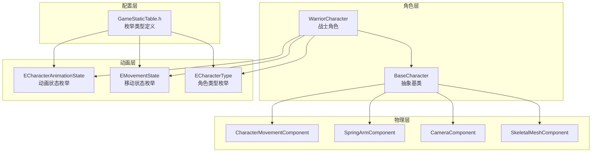
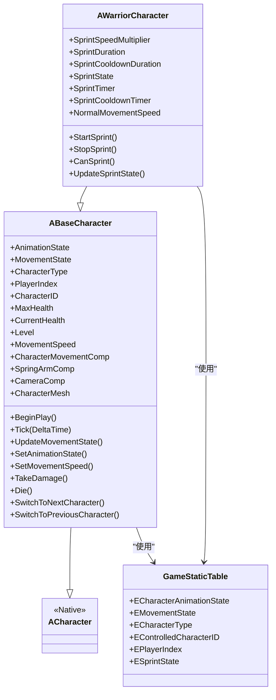
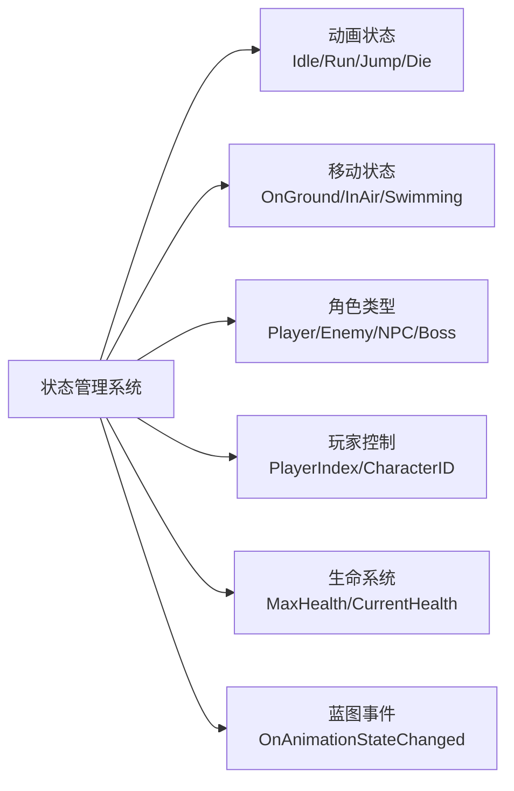
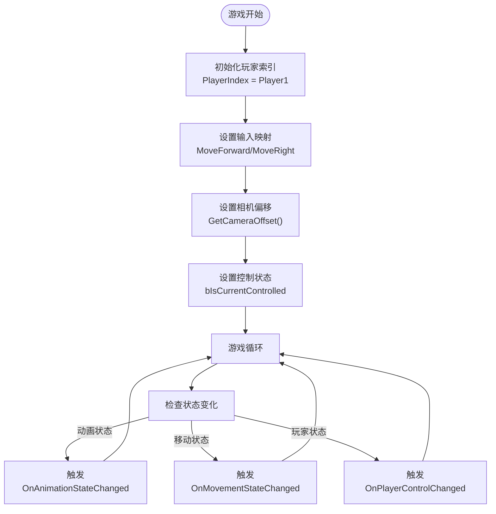
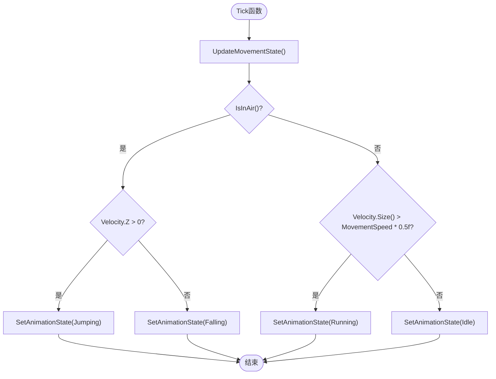
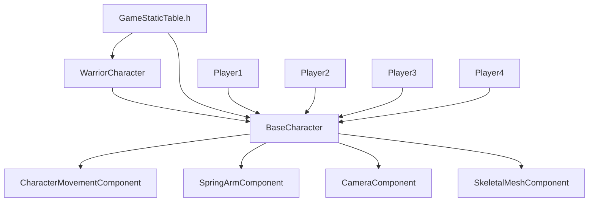

# 角色基类 (BaseCharacter)

<cite>
**本文引用的文件**
- [BaseCharacter.h](file://MetalSlug01/Source/MetalSlug01/Public/Characters/BaseCharacter.h)
- [BaseCharacter.cpp](file://MetalSlug01/Source/MetalSlug01/Private/Characters/BaseCharacter.cpp)
- [WarriorCharacter.h](file://MetalSlug01/Source/MetalSlug01/Public/Characters/WarriorCharacter.h)
- [WarriorCharacter.cpp](file://MetalSlug01/Source/MetalSlug01/Private/Characters/WarriorCharacter.cpp)
- [GameStaticTable.h](file://MetalSlug01/Source/MetalSlug01/Public/Data/GameStaticTable.h)
</cite>

## 更新摘要
**变更内容**
- MSCharacterBase类已完全移除，被新的BaseCharacter类替代
- 新架构采用更完整的角色管理系统，包含动画状态、移动状态、角色类型等丰富功能
- 新增战士角色(WarriorCharacter)作为具体实现示例
- 移除了Paper Flipbook动画系统，采用更现代的骨架动画系统
- 新增分屏支持、角色切换、冲刺等高级功能

## 目录
1. [简介](#简介)
2. [项目结构](#项目结构)
3. [核心组件](#核心组件)
4. [架构总览](#架构总览)
5. [详细组件分析](#详细组件分析)
6. [依赖关系分析](#依赖关系分析)
7. [性能考量](#性能考量)
8. [故障排查指南](#故障排查指南)
9. [结论](#结论)
10. [附录](#附录)

## 简介
本文件围绕 BaseCharacter 角色基类展开，系统性阐述其设计理念、架构职责与实现细节。该基类作为所有角色类型的父类，统一了完整的角色管理系统，包括动画状态管理、移动状态控制、角色类型识别、分屏支持等功能。新架构采用骨架动画系统替代了原有的Paper Flipbook系统，提供了更丰富的动画表现和更好的扩展性。同时，本文提供角色组件的配置方法与最佳实践，并通过具体代码路径示例展示如何正确继承与扩展该基类。

## 项目结构
该项目采用基于功能域的模块化组织方式，角色相关代码集中在 Characters 子目录中，游戏静态配置通过 GameStaticTable.h 统一管理。核心角色体系由 BaseCharacter 抽象基类与 WarriorCharacter 具体子类构成，配合分屏支持和角色切换系统形成完整的角色控制链路。

**图表来源**
- [BaseCharacter.h](file://MetalSlug01/Source/MetalSlug01/Public/Characters/BaseCharacter.h#L8-L292)
- [BaseCharacter.cpp](file://MetalSlug01/Source/MetalSlug01/Private/Characters/BaseCharacter.cpp#L12-L48)
- [WarriorCharacter.h](file://MetalSlug01/Source/MetalSlug01/Public/Characters/WarriorCharacter.h#L11-L117)
- [WarriorCharacter.cpp](file://MetalSlug01/Source/MetalSlug01/Private/Characters/WarriorCharacter.cpp#L13-L48)
- [GameStaticTable.h](file://MetalSlug01/Source/MetalSlug01/Public/Data/GameStaticTable.h#L6-L75)

**章节来源**
- [BaseCharacter.h](file://MetalSlug01/Source/MetalSlug01/Public/Characters/BaseCharacter.h#L1-L292)
- [BaseCharacter.cpp](file://MetalSlug01/Source/MetalSlug01/Private/Characters/BaseCharacter.cpp#L1-L462)
- [WarriorCharacter.h](file://MetalSlug01/Source/MetalSlug01/Public/Characters/WarriorCharacter.h#L1-L117)
- [WarriorCharacter.cpp](file://MetalSlug01/Source/MetalSlug01/Private/Characters/WarriorCharacter.cpp#L1-L280)
- [GameStaticTable.h](file://MetalSlug01/Source/MetalSlug01/Public/Data/GameStaticTable.h#L1-L75)

## 核心组件
- 抽象基类职责
  - 完整角色生命周期管理：BeginPlay、Tick 生命周期钩子，确保动画和状态更新在 Tick 中执行。
  - 综合状态管理系统：统一管理动画状态、移动状态、角色类型、玩家控制状态等。
  - 分屏支持：支持最多4个玩家的分屏游戏，每个玩家拥有独立的控制索引。
  - 角色切换：支持多个可控制角色之间的切换，包括角色ID管理和切换逻辑。
  - 基础属性系统：暴露生命值、等级、移动速度等基础属性，便于派生角色扩展。
  - 复杂移动能力：预留爬墙、滑铲、潜水等高级移动功能接口。

- 关键接口与成员
  - 状态管理：AnimationState、MovementState、CharacterType、PlayerIndex
  - 属性系统：MaxHealth、CurrentHealth、Level、MovementSpeed
  - 控制系统：CharacterID、bIsCurrentControlled、bIsAlive
  - 组件引用：CharacterMovementComp、SpringArmComp、CameraComp、CharacterMesh
  - 蓝图事件：OnAnimationStateChanged、OnMovementStateChanged、OnCharacterSwitched

**章节来源**
- [BaseCharacter.h](file://MetalSlug01/Source/MetalSlug01/Public/Characters/BaseCharacter.h#L13-L292)
- [BaseCharacter.cpp](file://MetalSlug01/Source/MetalSlug01/Private/Characters/BaseCharacter.cpp#L50-L95)

## 架构总览
BaseCharacter 作为所有角色类型的抽象父类，承担以下架构职责：
- 完整状态管理体系：统一管理动画、移动、角色类型、玩家控制等多种状态。
- 分屏游戏支持：通过 PlayerIndex 支持最多4个玩家的独立控制。
- 角色切换机制：通过 CharacterID 和角色切换事件实现多角色管理。
- 骨架动画系统：采用现代骨架动画替代Paper Flipbook，提供更丰富的动画表现。
- 可扩展性：通过蓝图事件和虚函数接口降低C++修改频率，提升扩展性。

**图表来源**
- [BaseCharacter.h](file://MetalSlug01/Source/MetalSlug01/Public/Characters/BaseCharacter.h#L8-L292)
- [BaseCharacter.cpp](file://MetalSlug01/Source/MetalSlug01/Private/Characters/BaseCharacter.cpp#L12-L48)
- [WarriorCharacter.h](file://MetalSlug01/Source/MetalSlug01/Public/Characters/WarriorCharacter.h#L11-L117)
- [WarriorCharacter.cpp](file://MetalSlug01/Source/MetalSlug01/Private/Characters/WarriorCharacter.cpp#L13-L48)
- [GameStaticTable.h](file://MetalSlug01/Source/MetalSlug01/Public/Data/GameStaticTable.h#L6-L75)

## 详细组件分析

### 完整状态管理系统
- 设计理念
  - 将角色的各种状态统一管理，包括动画状态、移动状态、角色类型、玩家控制状态等。
  - 通过蓝图事件实现状态变化的通知机制，便于蓝图逻辑响应。
  - 支持实时状态查询和状态切换，提供完整的状态控制接口。
- 优势
  - 提升代码组织性：状态管理集中在基类中，派生类只需关注特定功能。
  - 增强可扩展性：通过虚函数和蓝图事件接口，便于添加新的状态类型。
  - 改善调试体验：统一的状态查询接口便于调试和监控。

**图表来源**
- [BaseCharacter.h](file://MetalSlug01/Source/MetalSlug01/Public/Characters/BaseCharacter.h#L225-L279)
- [BaseCharacter.cpp](file://MetalSlug01/Source/MetalSlug01/Private/Characters/BaseCharacter.cpp#L265-L279)

**章节来源**
- [BaseCharacter.h](file://MetalSlug01/Source/MetalSlug01/Public/Characters/BaseCharacter.h#L225-L279)
- [BaseCharacter.cpp](file://MetalSlug01/Source/MetalSlug01/Private/Characters/BaseCharacter.cpp#L265-L279)

### 分屏游戏支持系统
- 设计理念
  - 通过 PlayerIndex 枚举支持最多4个玩家的分屏游戏。
  - 每个玩家拥有独立的输入映射、相机偏移和控制逻辑。
  - 支持动态切换玩家控制的角色，实现多角色管理。
- 优势
  - 提供完整的多人游戏基础设施，无需额外配置。
  - 通过蓝图事件实现玩家状态变化的通知。
  - 支持本地和远程玩家的区分处理。

**图表来源**
- [BaseCharacter.cpp](file://MetalSlug01/Source/MetalSlug01/Private/Characters/BaseCharacter.cpp#L102-L135)
- [BaseCharacter.cpp](file://MetalSlug01/Source/MetalSlug01/Private/Characters/BaseCharacter.cpp#L436-L456)

**章节来源**
- [BaseCharacter.cpp](file://MetalSlug01/Source/MetalSlug01/Private/Characters/BaseCharacter.cpp#L102-L135)
- [BaseCharacter.cpp](file://MetalSlug01/Source/MetalSlug01/Private/Characters/BaseCharacter.cpp#L436-L456)

### 骨架动画系统：状态管理与切换
- 状态判定
  - 空中状态：根据垂直速度判断跳跃或下落阶段。
  - 移动状态：根据速度大小判断奔跑或静止状态。
  - 动画状态：通过 SetAnimationState 统一管理各种动画状态。
- 切换策略
  - 每帧检查当前状态与目标状态是否一致，避免重复设置。
  - 通过蓝图事件通知状态变化，便于动画蓝图响应。
  - 支持动画状态的强制切换和条件切换。
- 扩展建议
  - 可在派生类中添加更多动画状态（如攻击、受伤、死亡等）。
  - 可通过蓝图事件实现复杂的动画混合和过渡效果。

**图表来源**
- [BaseCharacter.cpp](file://MetalSlug01/Source/MetalSlug01/Private/Characters/BaseCharacter.cpp#L68-L95)
- [BaseCharacter.cpp](file://MetalSlug01/Source/MetalSlug01/Private/Characters/BaseCharacter.cpp#L222-L231)

**章节来源**
- [BaseCharacter.cpp](file://MetalSlug01/Source/MetalSlug01/Private/Characters/BaseCharacter.cpp#L68-L95)
- [BaseCharacter.cpp](file://MetalSlug01/Source/MetalSlug01/Private/Characters/BaseCharacter.cpp#L222-L231)

### 基础属性系统：完整的生命值管理
- 定义与用途
  - MaxHealth 和 CurrentHealth 提供完整的生命值系统，默认值为100.f。
  - 支持生命值的获取、设置、扣减和回满功能。
  - 通过 TakeDamage 和 Die 函数实现伤害处理和死亡逻辑。
- 影响范围
  - 可被伤害系统、UI 系统、存档系统等模块访问与修改。
  - 通过蓝图事件通知生命值变化，便于UI实时更新。
- 最佳实践
  - 使用 UPROPERTY 的 BlueprintReadWrite 以便蓝图访问与调试。
  - 在 Tick 或事件回调中同步生命值到 UI，避免状态不同步。
  - 通过 LevelUp 函数实现角色成长系统。

**章节来源**
- [BaseCharacter.h](file://MetalSlug01/Source/MetalSlug01/Public/Characters/BaseCharacter.h#L209-L223)
- [BaseCharacter.cpp](file://MetalSlug01/Source/MetalSlug01/Private/Characters/BaseCharacter.cpp#L300-L339)

### 角色组件配置方法与最佳实践
- 组件配置
  - 在构造函数中初始化相机臂和相机组件，设置合适的偏航角旋转。
  - 配置 CharacterMovementComponent 的移动参数，包括最大步行速度、旋转速率等。
  - 设置角色网格体组件，用于骨架动画的显示。
- 状态管理配置
  - 在 BeginPlay 中初始化角色状态，设置初始生命值和动画状态。
  - 通过蓝图事件实现状态变化的响应逻辑。
- 输入系统配置
  - 通过 SetupPlayerInputComponent 支持分屏输入映射。
  - 支持不同玩家的独立输入处理。
- 蓝图集成
  - 通过蓝图事件实现复杂的逻辑处理。
  - 利用蓝图的可视化编辑器进行状态管理。

**章节来源**
- [BaseCharacter.cpp](file://MetalSlug01/Source/MetalSlug01/Private/Characters/BaseCharacter.cpp#L12-L48)
- [BaseCharacter.cpp](file://MetalSlug01/Source/MetalSlug01/Private/Characters/BaseCharacter.cpp#L50-L66)
- [BaseCharacter.cpp](file://MetalSlug01/Source/MetalSlug01/Private/Characters/BaseCharacter.cpp#L102-L135)

### 如何正确继承与扩展 BaseCharacter
- 继承步骤
  - 新建类继承自 ABaseCharacter，并在构造函数中初始化必要的组件。
  - 在 BeginPlay 中进行额外初始化，如注册蓝图事件、加载数据等。
  - 在 Tick 中调用父类逻辑，确保状态系统正常工作。
- 具体实现示例
  - 战士角色通过重载 BasicMove 和 SetMovementSpeed 实现冲刺功能。
  - 通过 ESprintState 枚举管理冲刺状态，提供完整的冲刺生命周期。
  - 通过蓝图事件实现冲刺开始、停止、冷却等逻辑。
- 示例路径
  - 基类定义与实现：[BaseCharacter.h](file://MetalSlug01/Source/MetalSlug01/Public/Characters/BaseCharacter.h#L8-L292)，[BaseCharacter.cpp](file://MetalSlug01/Source/MetalSlug01/Private/Characters/BaseCharacter.cpp#L12-L48)
  - 子类继承与实现：[WarriorCharacter.h](file://MetalSlug01/Source/MetalSlug01/Public/Characters/WarriorCharacter.h#L11-L117)，[WarriorCharacter.cpp](file://MetalSlug01/Source/MetalSlug01/Private/Characters/WarriorCharacter.cpp#L13-L48)

**章节来源**
- [BaseCharacter.h](file://MetalSlug01/Source/MetalSlug01/Public/Characters/BaseCharacter.h#L8-L292)
- [BaseCharacter.cpp](file://MetalSlug01/Source/MetalSlug01/Private/Characters/BaseCharacter.cpp#L12-L48)
- [WarriorCharacter.h](file://MetalSlug01/Source/MetalSlug01/Public/Characters/WarriorCharacter.h#L11-L117)
- [WarriorCharacter.cpp](file://MetalSlug01/Source/MetalSlug01/Private/Characters/WarriorCharacter.cpp#L13-L48)

## 依赖关系分析
- 组件耦合
  - BaseCharacter 与 CharacterMovementComponent、SpringArmComponent、CameraComponent 等引擎组件紧密耦合。
  - 通过蓝图事件实现与外部系统的松耦合交互。
- 外部依赖
  - GameStaticTable.h 提供枚举类型定义，支持完整的状态管理系统。
  - 支持最多4个玩家的分屏游戏配置。
- 循环依赖
  - 当前结构未发现循环依赖，基类与子类单向继承，配置文件为纯数据定义。

**图表来源**
- [BaseCharacter.cpp](file://MetalSlug01/Source/MetalSlug01/Private/Characters/BaseCharacter.cpp#L12-L48)
- [WarriorCharacter.cpp](file://MetalSlug01/Source/MetalSlug01/Private/Characters/WarriorCharacter.cpp#L13-L48)
- [GameStaticTable.h](file://MetalSlug01/Source/MetalSlug01/Public/Data/GameStaticTable.h#L6-L75)

**章节来源**
- [BaseCharacter.cpp](file://MetalSlug01/Source/MetalSlug01/Private/Characters/BaseCharacter.cpp#L12-L48)
- [WarriorCharacter.cpp](file://MetalSlug01/Source/MetalSlug01/Private/Characters/WarriorCharacter.cpp#L13-L48)
- [GameStaticTable.h](file://MetalSlug01/Source/MetalSlug01/Public/Data/GameStaticTable.h#L6-L75)

## 性能考量
- 状态更新优化
  - UpdateMovementState 中先检查状态变化，避免重复触发蓝图事件。
  - 通过静态变量缓存上次状态，减少不必要的状态切换。
- 动画系统优化
  - 采用骨架动画系统替代Paper Flipbook，提供更好的性能表现。
  - 通过蓝图事件实现动画状态切换，减少C++代码的复杂度。
- 内存管理
  - 通过 UPROPERTY 的 VisibleAnywhere 属性优化蓝图访问性能。
  - 合理使用 BlueprintImplementableEvent 减少蓝图编译时间。

## 故障排查指南
- 状态不更新
  - 检查 Tick 函数是否被正确调用，确保 UpdateMovementState 被执行。
  - 确认 SetAnimationState 是否被正确调用，避免状态冲突。
- 分屏问题
  - 检查 PlayerIndex 设置是否正确，确保输入映射区分。
  - 确认相机偏移设置是否针对不同玩家进行了调整。
- 动画不切换
  - 检查动画状态枚举定义是否正确，确保 ECharacterAnimationState 包含所需状态。
  - 确认蓝图事件 OnAnimationStateChanged 是否被正确实现。
- 冲刺功能异常
  - 检查 CanSprint 条件判断，确保角色在地面上且不在冷却中。
  - 确认 SprintSpeedMultiplier 和 SprintDuration 参数设置合理。

**章节来源**
- [BaseCharacter.cpp](file://MetalSlug01/Source/MetalSlug01/Private/Characters/BaseCharacter.cpp#L68-L95)
- [BaseCharacter.cpp](file://MetalSlug01/Source/MetalSlug01/Private/Characters/BaseCharacter.cpp#L267-L298)
- [WarriorCharacter.cpp](file://MetalSlug01/Source/MetalSlug01/Private/Characters/WarriorCharacter.cpp#L164-L175)

## 结论
BaseCharacter 通过完整的状态管理系统和现代化的骨架动画系统，为角色系统提供了更强大和灵活的抽象与良好的扩展性。相比原有的 MSCharacterBase，新架构支持分屏游戏、角色切换、复杂移动能力等高级功能，同时保持了良好的性能和可维护性。建议在派生类中遵循现有模式，合理扩展动画状态、移动能力和属性系统，并通过蓝图事件实现复杂的逻辑处理，提升团队协作效率。

## 附录
- 配置文件参考
  - 游戏静态配置：[GameStaticTable.h](file://MetalSlug01/Source/MetalSlug01/Public/Data/GameStaticTable.h#L6-L75)
- 相关类与文件
  - 基类与实现：[BaseCharacter.h](file://MetalSlug01/Source/MetalSlug01/Public/Characters/BaseCharacter.h#L8-L292)，[BaseCharacter.cpp](file://MetalSlug01/Source/MetalSlug01/Private/Characters/BaseCharacter.cpp#L12-L48)
  - 子类与实现：[WarriorCharacter.h](file://MetalSlug01/Source/MetalSlug01/Public/Characters/WarriorCharacter.h#L11-L117)，[WarriorCharacter.cpp](file://MetalSlug01/Source/MetalSlug01/Private/Characters/WarriorCharacter.cpp#L13-L48)