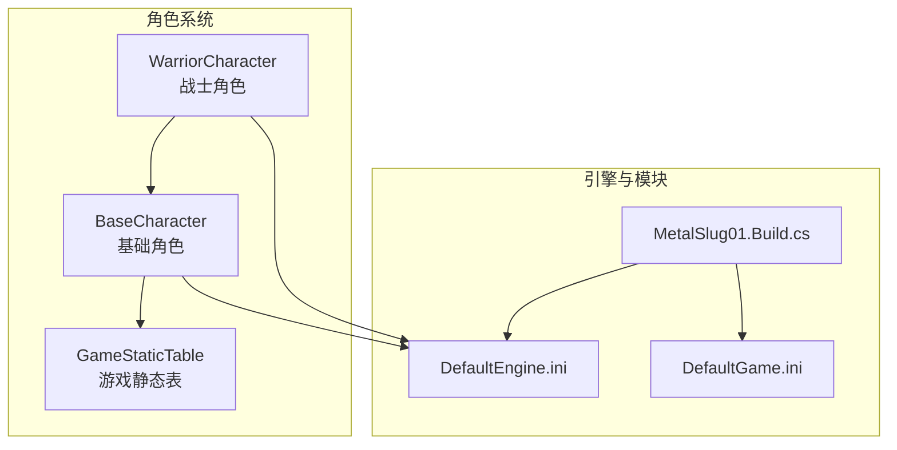
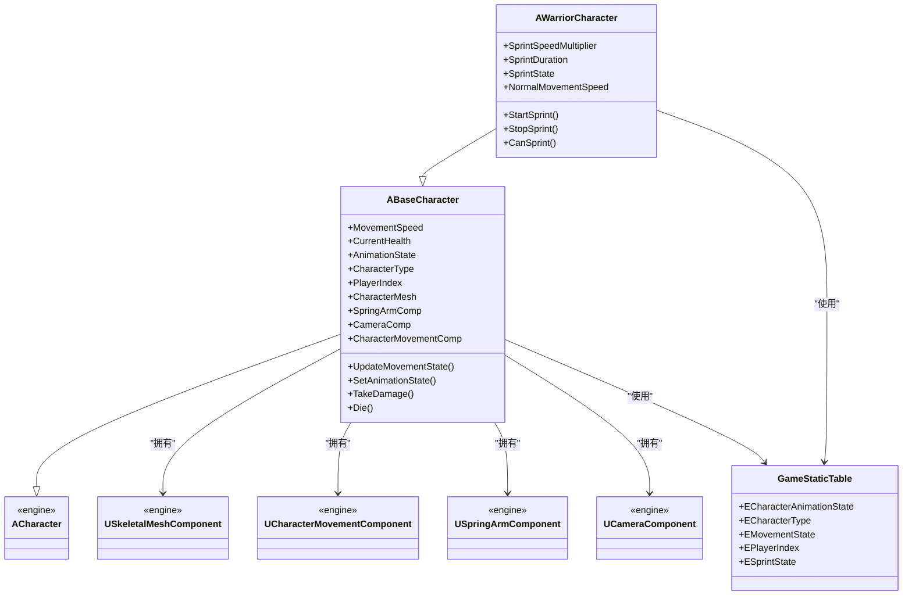
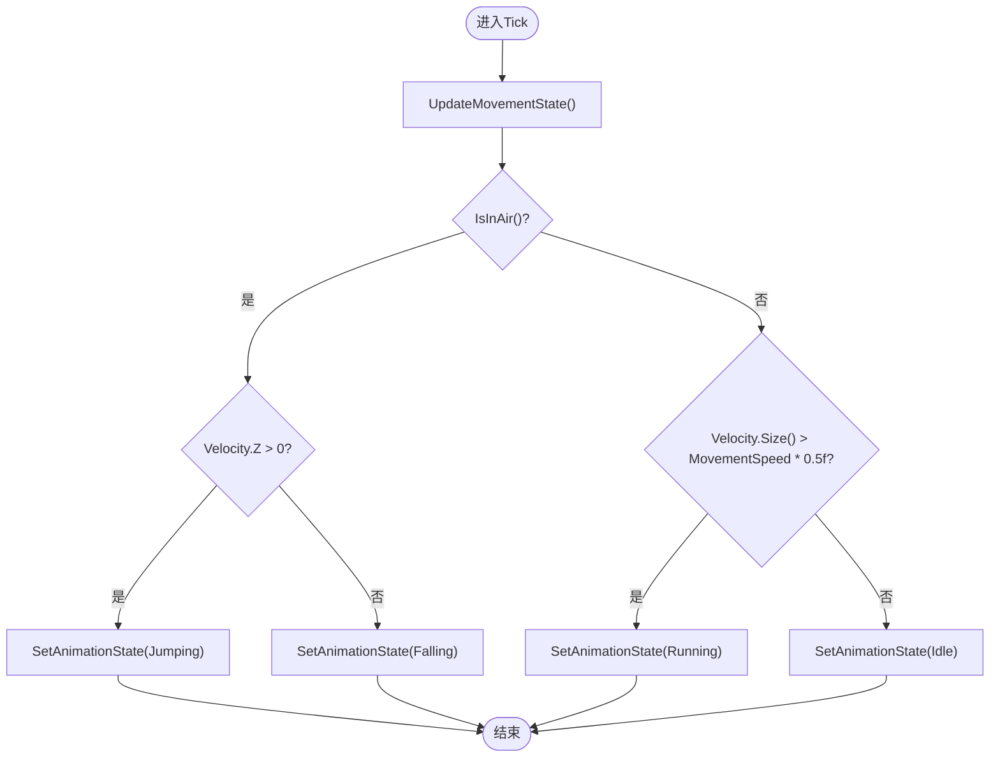
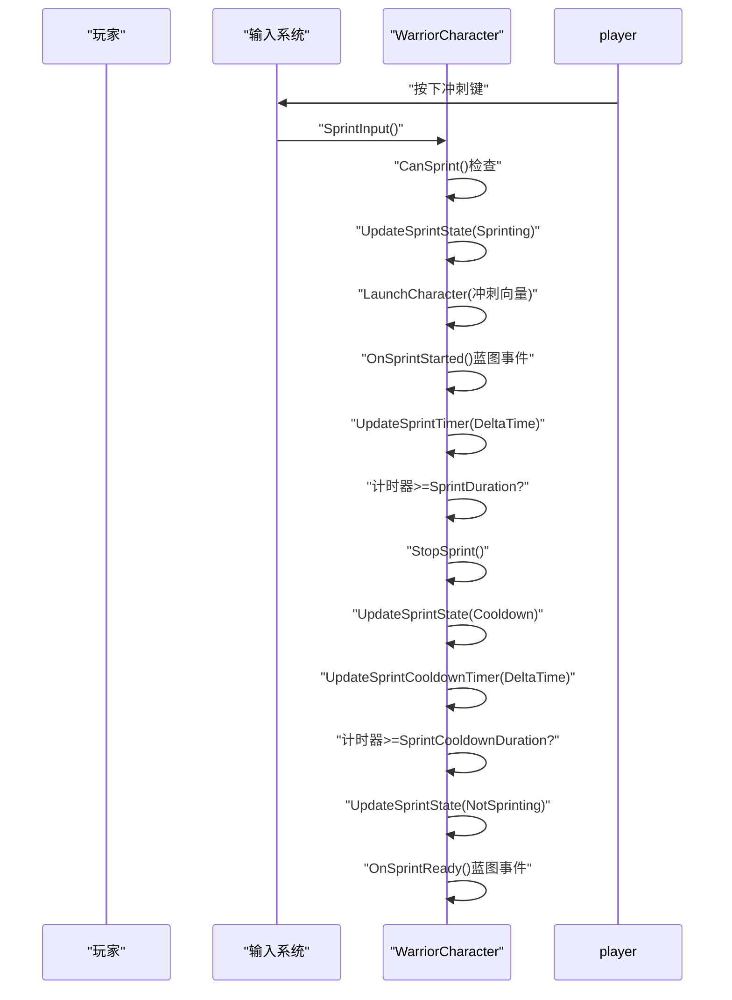
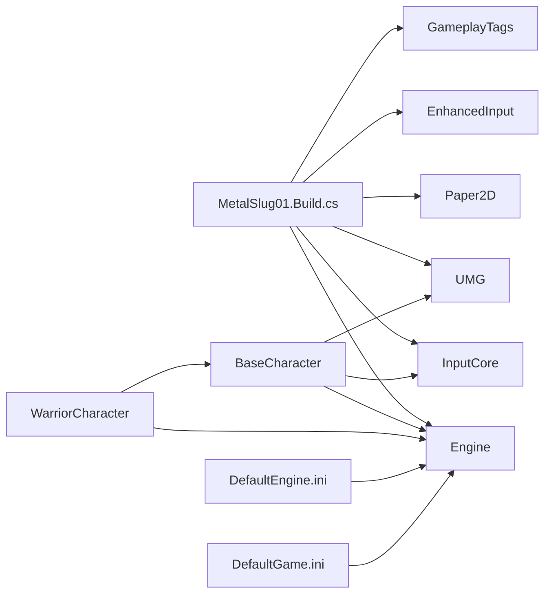

# 角色系统

<cite>
**本文引用的文件列表**
- [BaseCharacter.h](file://MetalSlug01/Source/MetalSlug01/Public/Characters/BaseCharacter.h)
- [BaseCharacter.cpp](file://MetalSlug01/Source/MetalSlug01/Private/Characters/BaseCharacter.cpp)
- [WarriorCharacter.h](file://MetalSlug01/Source/MetalSlug01/Public/Characters/WarriorCharacter.h)
- [WarriorCharacter.cpp](file://MetalSlug01/Source/MetalSlug01/Private/Characters/WarriorCharacter.cpp)
- [GameStaticTable.h](file://MetalSlug01/Source/MetalSlug01/Public/Data/GameStaticTable.h)
- [MetalSlug01.Build.cs](file://MetalSlug01/Source/MetalSlug01/MetalSlug01.Build.cs)
- [DefaultEngine.ini](file://MetalSlug01/Config/DefaultEngine.ini)
- [DefaultGame.ini](file://MetalSlug01/Config/DefaultGame.ini)
</cite>

## 更新摘要
**变更内容**
- 完全重构角色系统，从Paper2D系统迁移到Unreal Engine Character系统
- 新增BaseCharacter和WarriorCharacter类，替代原有的MSCharacterBase和MSPlayerCharacter
- 采用UE原生Character类和SkeletalMesh组件，移除PaperFlipbook动画系统
- 新增完整的属性管理系统、状态控制、分屏支持等功能
- 更新输入系统，支持多玩家控制和角色切换

## 目录
1. [简介](#简介)
2. [项目结构](#项目结构)
3. [核心组件](#核心组件)
4. [架构总览](#架构总览)
5. [详细组件分析](#详细组件分析)
6. [依赖关系分析](#依赖关系分析)
7. [性能考量](#性能考量)
8. [故障排查指南](#故障排查指南)
9. [结论](#结论)
10. [附录](#附录)

## 简介
本技术文档围绕 MetalSlug 的角色系统展开，重点解析 BaseCharacter 基类与 WarriorCharacter 玩家角色的实现，涵盖UE原生Character系统集成、属性管理、状态控制、输入处理、物理模拟与相机跟随等核心能力。文档同时提供角色组件组织结构说明、属性系统设计、扩展开发指南以及实际使用模式，帮助开发者快速理解并进行二次开发。

## 项目结构
角色系统位于 MetalSlug01 模块中，采用"按功能分层"的组织方式：
- Public/Characters：对外公开的基类与派生类接口（头文件）
- Private/Characters：具体实现（源文件）
- Public/Data：游戏静态表（包含各种枚举定义）
- Config：引擎与游戏配置（DefaultEngine.ini、DefaultGame.ini）
- Source/MetalSlug01.Build.cs：模块依赖声明（包含 Paper2D、EnhancedInput 等）

**图表来源**
- [BaseCharacter.h](file://MetalSlug01/Source/MetalSlug01/Public/Characters/BaseCharacter.h#L1-L292)
- [WarriorCharacter.h](file://MetalSlug01/Source/MetalSlug01/Public/Characters/WarriorCharacter.h#L1-L117)
- [GameStaticTable.h](file://MetalSlug01/Source/MetalSlug01/Public/Data/GameStaticTable.h#L1-L75)
- [DefaultEngine.ini](file://MetalSlug01/Config/DefaultEngine.ini#L1-L60)
- [DefaultGame.ini](file://MetalSlug01/Config/DefaultGame.ini#L1-L6)
- [MetalSlug01.Build.cs](file://MetalSlug01/Source/MetalSlug01/MetalSlug01.Build.cs#L1-L24)

**章节来源**
- [BaseCharacter.h](file://MetalSlug01/Source/MetalSlug01/Public/Characters/BaseCharacter.h#L1-L292)
- [WarriorCharacter.h](file://MetalSlug01/Source/MetalSlug01/Public/Characters/WarriorCharacter.h#L1-L117)
- [GameStaticTable.h](file://MetalSlug01/Source/MetalSlug01/Public/Data/GameStaticTable.h#L1-L75)
- [DefaultEngine.ini](file://MetalSlug01/Config/DefaultEngine.ini#L1-L60)
- [DefaultGame.ini](file://MetalSlug01/Config/DefaultGame.ini#L1-L6)
- [MetalSlug01.Build.cs](file://MetalSlug01/Source/MetalSlug01/MetalSlug01.Build.cs#L1-L24)

## 核心组件
- BaseCharacter（基础角色基类）：负责角色的基础渲染组件（SkeletalMeshComponent）、动画状态机、物理约束与属性管理。
- WarriorCharacter（战士角色）：在基础角色基础上增加冲刺功能、高级移动能力与角色切换机制。
- GameStaticTable（游戏静态表）：集中管理动画状态、角色类型、移动状态、玩家索引、冲刺状态等枚举定义。

**章节来源**
- [BaseCharacter.h](file://MetalSlug01/Source/MetalSlug01/Public/Characters/BaseCharacter.h#L8-L292)
- [BaseCharacter.cpp](file://MetalSlug01/Source/MetalSlug01/Private/Characters/BaseCharacter.cpp#L12-L462)
- [WarriorCharacter.h](file://MetalSlug01/Source/MetalSlug01/Public/Characters/WarriorCharacter.h#L11-L117)
- [WarriorCharacter.cpp](file://MetalSlug01/Source/MetalSlug01/Private/Characters/WarriorCharacter.cpp#L13-L280)
- [GameStaticTable.h](file://MetalSlug01/Source/MetalSlug01/Public/Data/GameStaticTable.h#L6-L75)

## 架构总览
角色系统采用"基类抽象 + 派生类扩展"的分层设计：
- 基类统一管理角色外观与动画状态，派生类专注于特定功能扩展。
- 使用UE原生Character系统提供物理模拟、碰撞检测与动画蓝图支持。
- 通过蓝图事件实现C++与蓝图的解耦交互，支持复杂的角色行为逻辑。

**图表来源**
- [BaseCharacter.h](file://MetalSlug01/Source/MetalSlug01/Public/Characters/BaseCharacter.h#L8-L292)
- [BaseCharacter.cpp](file://MetalSlug01/Source/MetalSlug01/Private/Characters/BaseCharacter.cpp#L12-L462)
- [WarriorCharacter.h](file://MetalSlug01/Source/MetalSlug01/Public/Characters/WarriorCharacter.h#L11-L117)
- [WarriorCharacter.cpp](file://MetalSlug01/Source/MetalSlug01/Private/Characters/WarriorCharacter.cpp#L13-L280)
- [GameStaticTable.h](file://MetalSlug01/Source/MetalSlug01/Public/Data/GameStaticTable.h#L6-L75)

## 详细组件分析

### BaseCharacter 基础角色
- 设计理念
  - 基于UE原生ACharacter类构建，提供完整的角色功能框架。
  - 通过SkeletalMeshComponent实现3D角色模型，支持动画蓝图与材质系统。
  - 统一管理角色属性（生命值、移动速度、等级等）与状态机。
- 关键实现要点
  - 组件初始化：SpringArmComponent、CameraComponent、CharacterMovementComponent、SkeletalMeshComponent的创建与配置。
  - 属性管理：MaxHealth、CurrentHealth、MovementSpeed、Level等核心属性的管理。
  - 状态控制：AnimationState、MovementState、CharacterType等状态的更新与同步。
  - 物理模拟：CharacterMovementComponent提供移动、跳跃、爬墙等物理行为支持。
- 复杂度与性能
  - Tick函数中进行状态更新，复杂度为O(1)。
  - 通过蓝图事件实现与蓝图的解耦交互，避免频繁的C++调用。

**图表来源**
- [BaseCharacter.cpp](file://MetalSlug01/Source/MetalSlug01/Private/Characters/BaseCharacter.cpp#L68-L95)

**章节来源**
- [BaseCharacter.h](file://MetalSlug01/Source/MetalSlug01/Public/Characters/BaseCharacter.h#L8-L292)
- [BaseCharacter.cpp](file://MetalSlug01/Source/MetalSlug01/Private/Characters/BaseCharacter.cpp#L12-L462)

### WarriorCharacter 战士角色
- 设计理念
  - 继承自BaseCharacter，专注于战士特有的冲刺能力。
  - 通过ESprintState枚举管理冲刺状态，提供完整的冲刺生命周期管理。
  - 支持冲刺冷却机制，确保游戏平衡性。
- 关键实现要点
  - 冲刺系统：SprintSpeedMultiplier、SprintDuration、SprintCooldownDuration等参数控制。
  - 冲刺状态管理：NotSprinting、Sprinting、Cooldown三种状态的切换逻辑。
  - 冲刺输入处理：通过LaunchCharacter实现瞬间冲刺效果。
  - 冲刺冷却：自动冷却机制，提供OnSprintReady蓝图事件。
- 复杂度与性能
  - 冲刺状态更新为O(1)，通过计时器管理实现非阻塞的冷却系统。
  - 冲刺过程中禁用传统移动，避免物理冲突。

**图表来源**
- [WarriorCharacter.cpp](file://MetalSlug01/Source/MetalSlug01/Private/Characters/WarriorCharacter.cpp#L99-L280)

**章节来源**
- [WarriorCharacter.h](file://MetalSlug01/Source/MetalSlug01/Public/Characters/WarriorCharacter.h#L11-L117)
- [WarriorCharacter.cpp](file://MetalSlug01/Source/MetalSlug01/Private/Characters/WarriorCharacter.cpp#L13-L280)

### 角色组件组织结构
- SkeletalMeshComponent（角色网格体组件）
  - 作为角色的主要渲染组件，承载3D模型与动画系统。
  - 支持材质实例与动画蓝图的动态切换。
- CharacterMovementComponent（角色移动组件）
  - 提供物理移动、跳跃、爬墙、滑行等基础移动能力。
  - 支持平面约束与旋转控制，适应2D平台游戏需求。
- SpringArmComponent（弹簧臂组件）
  - 作为相机支撑，提供灵活的相机角度控制。
  - 支持相机偏移与旋转同步。
- CameraComponent（相机组件）
  - 提供跟随相机功能，支持不同玩家的相机偏移。

**章节来源**
- [BaseCharacter.h](file://MetalSlug01/Source/MetalSlug01/Public/Characters/BaseCharacter.h#L250-L263)
- [BaseCharacter.cpp](file://MetalSlug01/Source/MetalSlug01/Private/Characters/BaseCharacter.cpp#L14-L47)

### 角色属性系统
- 基础属性
  - Health：角色生命值系统，包含MaxHealth与CurrentHealth属性。
  - Movement：MovementSpeed、CurrentMovementSpeed控制角色移动能力。
  - Level：角色等级系统，支持LevelUp()方法提升等级。
- 状态管理
  - AnimationState：当前动画状态，支持Idle、Running、Jumping等状态。
  - MovementState：当前移动状态，支持OnGround、InAir、Swimming等状态。
  - CharacterType：角色类型，支持Player、Enemy、NPC、Boss等类型。
- 扩展建议
  - 可引入GameplayTags系统实现更复杂的属性组合。
  - 可结合GameplayEffects实现动态属性修改。

**章节来源**
- [BaseCharacter.h](file://MetalSlug01/Source/MetalSlug01/Public/Characters/BaseCharacter.h#L201-L247)
- [BaseCharacter.cpp](file://MetalSlug01/Source/MetalSlug01/Private/Characters/BaseCharacter.cpp#L32-L44)
- [GameStaticTable.h](file://MetalSlug01/Source/MetalSlug01/Public/Data/GameStaticTable.h#L6-L75)

### 输入系统与多玩家支持
- 输入绑定
  - 支持多玩家输入映射：MoveForward、MoveRight、Jump等轴向输入。
  - 不同玩家使用不同的输入名称：MoveForward_P2、MoveRight_P2等。
- 角色切换
  - 支持EControlledCharacterID枚举：Character1、Character2、Character3。
  - 提供SwitchToNextCharacter()和SwitchToPreviousCharacter()方法。
- 控制器管理
  - 支持本地玩家与远程玩家控制的区别。
  - 提供GetPlayerID()方法获取玩家控制器信息。

**章节来源**
- [BaseCharacter.cpp](file://MetalSlug01/Source/MetalSlug01/Private/Characters/BaseCharacter.cpp#L102-L135)
- [BaseCharacter.h](file://MetalSlug01/Source/MetalSlug01/Public/Characters/BaseCharacter.h#L148-L195)
- [GameStaticTable.h](file://MetalSlug01/Source/MetalSlug01/Public/Data/GameStaticTable.h#L37-L65)

### 扩展开发指南
- 继承BaseCharacter创建自定义角色
  - 步骤
    - 新建类继承自BaseCharacter。
    - 在蓝图中为CharacterMesh指定3D模型资源。
    - 在蓝图中设置动画蓝图与材质。
    - 如需特殊能力，重写虚函数或添加蓝图事件。
  - 注意事项
    - 确保BeginPlay中正确初始化角色状态。
    - 如角色有特殊物理行为，重写UpdateMovementState()。
- 与WarriorCharacter的差异
  - WarriorCharacter已内置冲刺功能，适合需要快速移动的游戏场景。
  - 如需简单角色，可直接使用BaseCharacter并自行扩展。

**章节来源**
- [BaseCharacter.h](file://MetalSlug01/Source/MetalSlug01/Public/Characters/BaseCharacter.h#L8-L292)
- [WarriorCharacter.h](file://MetalSlug01/Source/MetalSlug01/Public/Characters/WarriorCharacter.h#L11-L117)

## 依赖关系分析
- 模块依赖
  - Engine：提供ACharacter、UCharacterMovementComponent等核心功能。
  - InputCore：提供输入系统支持。
  - UMG：提供用户界面系统。
  - Paper2D：仍保留以支持可能的2D元素。
  - EnhancedInput：提供增强型输入系统。
  - GameplayTags：提供标签系统支持。
- 配置文件
  - DefaultEngine.ini：包含类重定向，将旧的MSCharacterBase重定向到新的CharacterBase。
  - DefaultGame.ini：项目通用配置。

**图表来源**
- [MetalSlug01.Build.cs](file://MetalSlug01/Source/MetalSlug01/MetalSlug01.Build.cs#L11-L11)
- [DefaultEngine.ini](file://MetalSlug01/Config/DefaultEngine.ini#L59-L60)

**章节来源**
- [MetalSlug01.Build.cs](file://MetalSlug01/Source/MetalSlug01/MetalSlug01.Build.cs#L11-L11)
- [DefaultEngine.ini](file://MetalSlug01/Config/DefaultEngine.ini#L59-L60)
- [DefaultGame.ini](file://MetalSlug01/Config/DefaultGame.ini#L1-L6)

## 性能考量
- 动画系统优化
  - 使用蓝图事件而非频繁的C++调用，减少函数调用开销。
  - 动画状态切换通过SetAnimationState()统一管理，避免重复设置。
- 物理模拟
  - CharacterMovementComponent提供高效的物理计算。
  - 平面约束与旋转控制减少不必要的物理计算。
- 冲刺系统
  - 冲刺使用LaunchCharacter实现瞬时效果，避免复杂的物理计算。
  - 冷却系统通过计时器管理，非阻塞实现。

## 故障排查指南
- 角色不显示或模型缺失
  - 检查CharacterMesh组件是否正确创建与配置。
  - 确认3D模型资源已在蓝图中正确设置。
- 移动异常
  - 检查CharacterMovementComponent的配置，特别是bOrientRotationToMovement设置。
  - 确认输入绑定是否正确，特别是多玩家输入映射。
- 冲刺功能失效
  - 检查CanSprint()条件，确保角色在地面上且不在冷却中。
  - 确认SprintSpeedMultiplier和SprintDuration参数设置合理。
- 动画状态不同步
  - 检查OnAnimationStateChanged蓝图事件是否正确触发。
  - 确认AnimationState属性的设置逻辑。

**章节来源**
- [BaseCharacter.cpp](file://MetalSlug01/Source/MetalSlug01/Private/Characters/BaseCharacter.cpp#L50-L66)
- [WarriorCharacter.cpp](file://MetalSlug01/Source/MetalSlug01/Private/Characters/WarriorCharacter.cpp#L164-L175)
- [BaseCharacter.cpp](file://MetalSlug01/Source/MetalSlug01/Private/Characters/BaseCharacter.cpp#L222-L231)

## 结论
MetalSlug 的角色系统经过完全重构，从Paper2D系统迁移至UE原生Character系统，提供了更强大和灵活的角色管理能力。BaseCharacter作为基础角色类，通过SkeletalMesh组件与蓝图事件实现了完整的角色功能框架。WarriorCharacter在基础上增加了冲刺系统，展示了如何通过继承扩展角色能力。该设计具备良好的扩展性，开发者可基于BaseCharacter快速创建自定义角色，并通过蓝图与C++的混合开发实现复杂的游戏功能。

## 附录
- 使用模式建议
  - 在蓝图中为角色指定3D模型与动画蓝图，确保CharacterMesh配置正确。
  - 使用GameStaticTable中的枚举定义，保持代码一致性。
  - 如需扩展角色能力，优先考虑继承BaseCharacter并重写虚函数。
- 相关文件路径参考
  - [BaseCharacter.h](file://MetalSlug01/Source/MetalSlug01/Public/Characters/BaseCharacter.h#L1-L292)
  - [BaseCharacter.cpp](file://MetalSlug01/Source/MetalSlug01/Private/Characters/BaseCharacter.cpp#L1-L462)
  - [WarriorCharacter.h](file://MetalSlug01/Source/MetalSlug01/Public/Characters/WarriorCharacter.h#L1-L117)
  - [WarriorCharacter.cpp](file://MetalSlug01/Source/MetalSlug01/Private/Characters/WarriorCharacter.cpp#L1-L280)
  - [GameStaticTable.h](file://MetalSlug01/Source/MetalSlug01/Public/Data/GameStaticTable.h#L1-L75)
  - [DefaultEngine.ini](file://MetalSlug01/Config/DefaultEngine.ini#L1-L60)
  - [DefaultGame.ini](file://MetalSlug01/Config/DefaultGame.ini#L1-L6)
  - [MetalSlug01.Build.cs](file://MetalSlug01/Source/MetalSlug01/MetalSlug01.Build.cs#L1-L24)