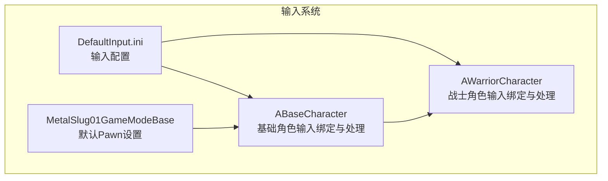
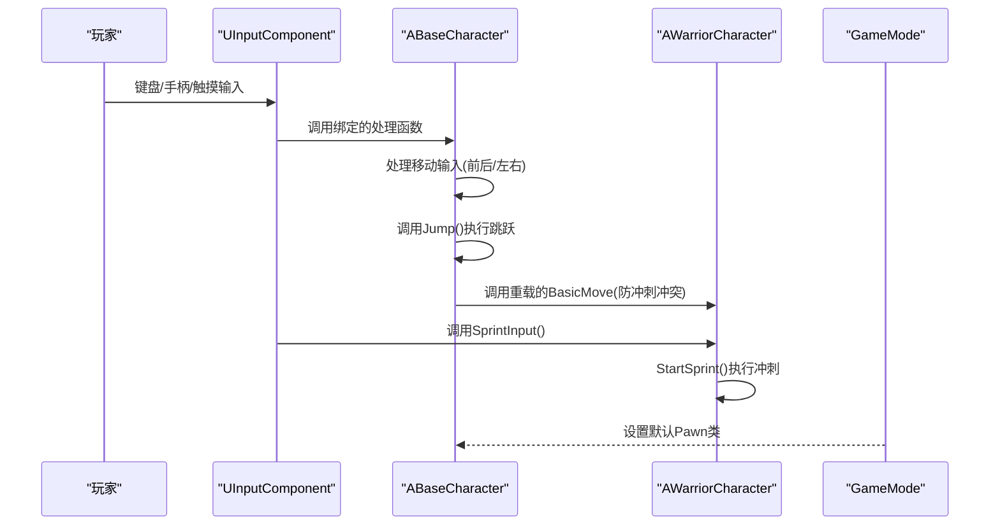
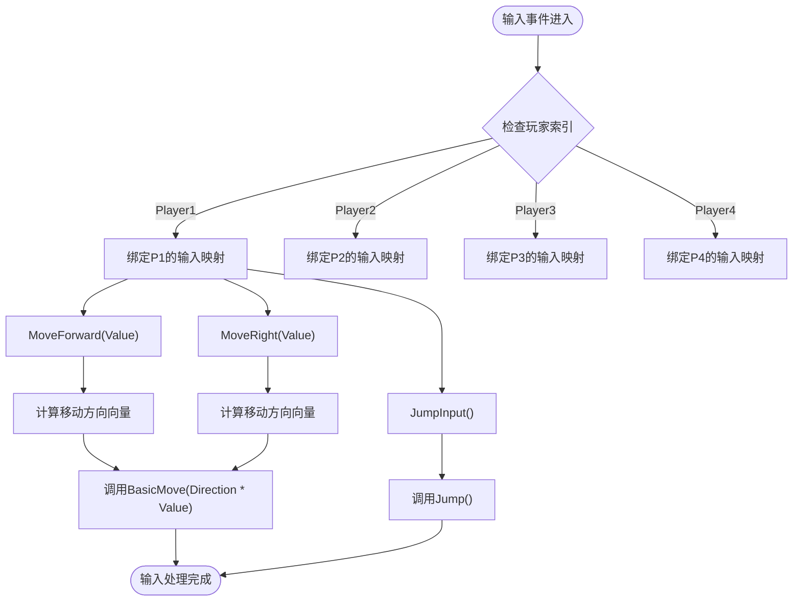
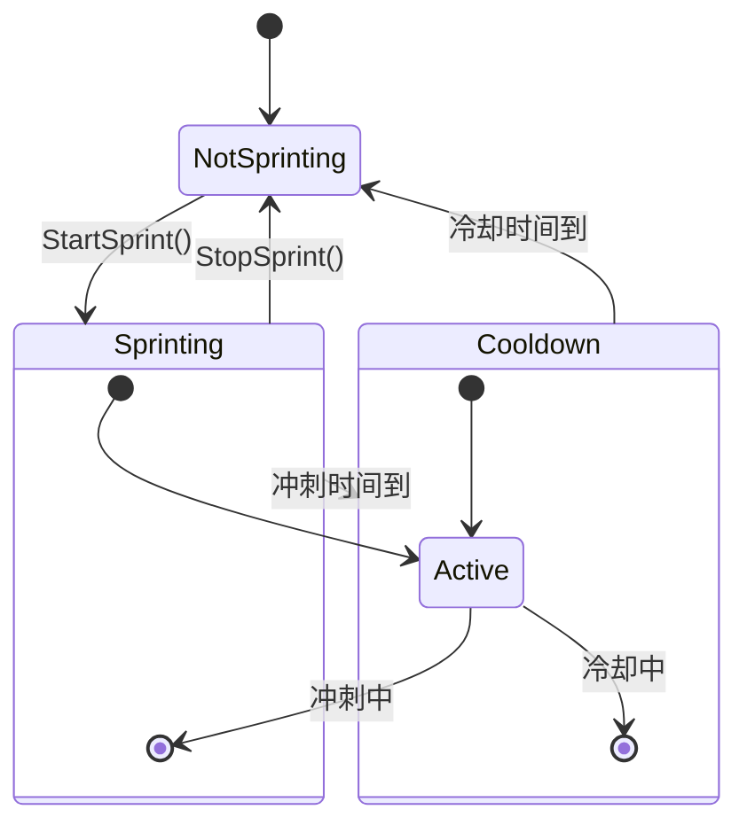
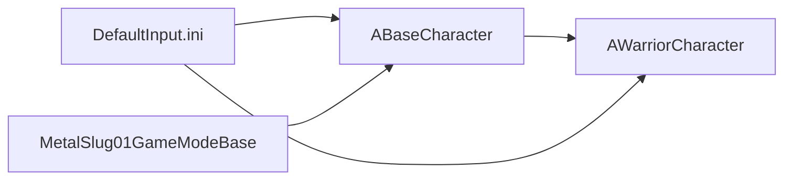

# 输入系统

<cite>
**本文档引用的文件**
- [BaseCharacter.h](file://MetalSlug01/Source/MetalSlug01/Public/Characters/BaseCharacter.h)
- [BaseCharacter.cpp](file://MetalSlug01/Source/MetalSlug01/Private/Characters/BaseCharacter.cpp)
- [WarriorCharacter.h](file://MetalSlug01/Source/MetalSlug01/Public/Characters/WarriorCharacter.h)
- [WarriorCharacter.cpp](file://MetalSlug01/Source/MetalSlug01/Private/Characters/WarriorCharacter.cpp)
- [DefaultInput.ini](file://MetalSlug01/Config/DefaultInput.ini)
- [MetalSlug01GameModeBase.cpp](file://MetalSlug01/Source/MetalSlug01/MetalSlug01GameModeBase.cpp)
</cite>

## 更新摘要
**所做更改**
- 移除了MSInputConfig相关的内容，因为该文件已被移除
- 更新了输入系统架构，从增强输入框架简化为直接的字符移动绑定方法
- 重新组织了核心组件分析，重点介绍ABaseCharacter和AWarriorCharacter的输入绑定实现
- 更新了架构图和流程图，反映新的输入系统结构
- 修改了配置文件分析，强调DefaultInput.ini中的传统输入映射配置

## 目录
1. [简介](#简介)
2. [项目结构](#项目结构)
3. [核心组件](#核心组件)
4. [架构总览](#架构总览)
5. [详细组件分析](#详细组件分析)
6. [依赖关系分析](#依赖关系分析)
7. [性能考量](#性能考量)
8. [故障排查指南](#故障排查指南)
9. [结论](#结论)
10. [附录](#附录)

## 简介
本文件面向MetalSlug项目的输入系统，聚焦于简化后的直接字符移动绑定方法，系统性阐述ABaseCharacter和AWarriorCharacter类的输入绑定与事件处理、从原始输入到游戏逻辑的转换过程、多平台按键配置差异与适配方案，并提供扩展指南（新增输入动作、自定义映射）、DefaultInput.ini配置详解与最佳实践，以及实际输入处理代码示例与调试技巧。

## 项目结构
输入系统主要由以下模块构成：
- 角色层：ABaseCharacter，负责基础移动、跳跃等输入绑定与处理。
- 战士角色层：AWarriorCharacter，在基础角色基础上添加冲刺功能的输入绑定。
- 配置层：DefaultInput.ini，定义输入轴、默认输入组件类、触摸界面等全局输入设置。
- 游戏模式：MetalSlug01GameModeBase，设置默认生成的玩家Pawn类，间接影响输入系统的生效。

图表来源
- [BaseCharacter.h](file://MetalSlug01/Source/MetalSlug01/Public/Characters/BaseCharacter.h#L8-L29)
- [WarriorCharacter.h](file://MetalSlug01/Source/MetalSlug01/Public/Characters/WarriorCharacter.h#L11-L117)
- [DefaultInput.ini](file://MetalSlug01/Config/DefaultInput.ini#L80-L90)
- [MetalSlug01GameModeBase.cpp](file://MetalSlug01/Source/MetalSlug01/MetalSlug01GameModeBase.cpp#L9-L26)

章节来源
- [BaseCharacter.h](file://MetalSlug01/Source/MetalSlug01/Public/Characters/BaseCharacter.h#L8-L29)
- [WarriorCharacter.h](file://MetalSlug01/Source/MetalSlug01/Public/Characters/WarriorCharacter.h#L11-L117)
- [DefaultInput.ini](file://MetalSlug01/Config/DefaultInput.ini#L80-L90)
- [MetalSlug01GameModeBase.cpp](file://MetalSlug01/Source/MetalSlug01/MetalSlug01GameModeBase.cpp#L9-L26)

## 核心组件
- ABaseCharacter：基础角色输入绑定，包含移动、跳跃等基本输入处理，支持多玩家索引的输入映射。
- AWarriorCharacter：在基础角色基础上添加冲刺输入绑定，实现冲刺功能的完整生命周期管理。
- DefaultInput.ini：定义输入轴配置、默认输入组件类、触摸界面、鼠标捕获与锁定模式等，决定输入系统的行为与平台适配。
- 游戏模式：设置默认Pawn类，确保输入系统在场景中正确生效。

章节来源
- [BaseCharacter.cpp](file://MetalSlug01/Source/MetalSlug01/Private/Characters/BaseCharacter.cpp#L102-L135)
- [WarriorCharacter.cpp](file://MetalSlug01/Source/MetalSlug01/Private/Characters/WarriorCharacter.cpp#L79-L85)
- [DefaultInput.ini](file://MetalSlug01/Config/DefaultInput.ini#L80-L90)
- [MetalSlug01GameModeBase.cpp](file://MetalSlug01/Source/MetalSlug01/MetalSlug01GameModeBase.cpp#L9-L26)

## 架构总览
输入系统采用"基础角色 + 派生角色 + 传统输入映射"的架构：
- 基础层：ABaseCharacter提供所有角色共享的基础输入功能，包括移动轴绑定和跳跃动作绑定。
- 扩展层：AWarriorCharacter在基础之上添加特定角色的输入功能，如冲刺按键绑定。
- 配置层：DefaultInput.ini定义输入轴映射和动作映射，支持多平台输入设备。
- 绑定层：SetupPlayerInputComponent方法将输入名称绑定到具体的处理函数。

图表来源
- [BaseCharacter.cpp](file://MetalSlug01/Source/MetalSlug01/Private/Characters/BaseCharacter.cpp#L102-L135)
- [WarriorCharacter.cpp](file://MetalSlug01/Source/MetalSlug01/Private/Characters/WarriorCharacter.cpp#L79-L85)
- [MetalSlug01GameModeBase.cpp](file://MetalSlug01/Source/MetalSlug01/MetalSlug01GameModeBase.cpp#L9-L26)

章节来源
- [BaseCharacter.cpp](file://MetalSlug01/Source/MetalSlug01/Private/Characters/BaseCharacter.cpp#L102-L135)
- [WarriorCharacter.cpp](file://MetalSlug01/Source/MetalSlug01/Private/Characters/WarriorCharacter.cpp#L79-L85)
- [MetalSlug01GameModeBase.cpp](file://MetalSlug01/Source/MetalSlug01/MetalSlug01GameModeBase.cpp#L9-L26)

## 详细组件分析

### ABaseCharacter 输入绑定与事件处理
- 绑定入口：SetupPlayerInputComponent中，根据玩家索引动态设置不同的输入映射。
- 绑定策略：
  - 移动轴绑定：根据PlayerIndex选择不同的轴映射名称（MoveForward/MoveRight 或带P2/P3/P4后缀）。
  - 跳跃动作绑定：动态生成Jump_P1/Jump_P2/Jump_P3/Jump_P4的动作名称。
- 输入值处理：MoveForward和MoveRight函数通过Controller的控制旋转计算移动方向向量，然后调用BasicMove执行移动。
- 多玩家支持：通过PlayerIndex枚举支持最多4个玩家的分屏控制。

图表来源
- [BaseCharacter.cpp](file://MetalSlug01/Source/MetalSlug01/Private/Characters/BaseCharacter.cpp#L102-L135)
- [BaseCharacter.cpp](file://MetalSlug01/Source/MetalSlug01/Private/Characters/BaseCharacter.cpp#L137-L169)

章节来源
- [BaseCharacter.cpp](file://MetalSlug01/Source/MetalSlug01/Private/Characters/BaseCharacter.cpp#L102-L135)
- [BaseCharacter.cpp](file://MetalSlug01/Source/MetalSlug01/Private/Characters/BaseCharacter.cpp#L137-L169)

### AWarriorCharacter 冲刺输入绑定与处理
- 绑定入口：SetupPlayerInputComponent中，将"Sprint"动作绑定到SprintInput函数。
- 冲刺机制：SprintInput调用StartSprint，StartSprint检查CanSprint条件后执行冲刺逻辑。
- 冲刺实现：使用LaunchCharacter施加巨大的速度向量，实现瞬间冲刺效果。
- 冲刺状态管理：维护冲刺状态、计时器和冷却状态，提供完整的生命周期管理。

图表来源
- [WarriorCharacter.cpp](file://MetalSlug01/Source/MetalSlug01/Private/Characters/WarriorCharacter.cpp#L99-L134)
- [WarriorCharacter.cpp](file://MetalSlug01/Source/MetalSlug01/Private/Characters/WarriorCharacter.cpp#L211-L233)

章节来源
- [WarriorCharacter.cpp](file://MetalSlug01/Source/MetalSlug01/Private/Characters/WarriorCharacter.cpp#L79-L85)
- [WarriorCharacter.cpp](file://MetalSlug01/Source/MetalSlug01/Private/Characters/WarriorCharacter.cpp#L99-L134)
- [WarriorCharacter.cpp](file://MetalSlug01/Source/MetalSlug01/Private/Characters/WarriorCharacter.cpp#L164-L175)

### DefaultInput.ini 配置详解与最佳实践
- 输入轴配置：定义了WASD和方向键的移动映射，支持正负方向的轴映射。
- 默认输入组件：DefaultPlayerInputClass和DefaultInputComponentClass仍指向EnhancedInput相关类，但实际使用的是传统输入映射方式。
- 触摸与鼠标：DefaultTouchInterface指定虚拟摇杆；鼠标捕获与锁定模式、双击时间、FOV缩放等参数优化体验。
- 动作映射：包含Sprint动作映射，支持左Shift键触发冲刺。
- 最佳实践：
  - 在编辑器中通过DefaultInput.ini分配按键，避免硬编码。
  - 针对不同平台（PC/主机/VR/移动端）通过输入轴配置与映射上下文进行差异化适配。
  - 合理设置DeadZone与Sensitivity，平衡灵敏度与稳定性。

章节来源
- [DefaultInput.ini](file://MetalSlug01/Config/DefaultInput.ini#L80-L90)

### 多平台按键配置差异与适配方案
- PC端：WASD键映射至MoveForward/MoveRight轴；鼠标映射至视角控制；左Shift映射至Sprint动作。
- 手柄端：Gamepad_*轴映射至移动与视角；DeadZone与Sensitivity已优化。
- VR端：多种VR设备轴（如ValveIndex、OculusTouch、MixedReality）已覆盖，便于在VR场景中使用。
- 移动端：DefaultTouchInterface指定虚拟摇杆，适合触屏操作。
- 适配建议：
  - 使用PlayerIndex枚举支持多玩家分屏控制。
  - 通过不同的轴映射名称实现不同玩家的独立控制。
  - 针对VR设备，单独调整DeadZone与Sensitivity，避免漂移。

章节来源
- [DefaultInput.ini](file://MetalSlug01/Config/DefaultInput.ini#L81-L84)
- [BaseCharacter.cpp](file://MetalSlug01/Source/MetalSlug01/Private/Characters/BaseCharacter.cpp#L112-L127)

### 输入系统的扩展指南
- 新增输入动作：
  - 在DefaultInput.ini中添加新的ActionMappings条目。
  - 在AWarriorCharacter中添加对应的输入处理函数。
  - 在SetupPlayerInputComponent中绑定新动作到处理函数。
- 自定义输入映射：
  - 通过DefaultInput.ini调整输入轴参数，满足不同设备特性。
  - 使用PlayerIndex支持多玩家分屏控制。
- 动画与输入联动：
  - 在BaseCharacter的Tick函数中根据移动状态更新动画状态。
  - 通过蓝图事件通知动画系统状态变化。

章节来源
- [DefaultInput.ini](file://MetalSlug01/Config/DefaultInput.ini#L80-L90)
- [WarriorCharacter.cpp](file://MetalSlug01/Source/MetalSlug01/Private/Characters/WarriorCharacter.cpp#L79-L85)
- [BaseCharacter.cpp](file://MetalSlug01/Source/MetalSlug01/Private/Characters/BaseCharacter.cpp#L68-L95)

## 依赖关系分析
- ABaseCharacter依赖DefaultInput.ini中的输入轴映射配置，通过SetupPlayerInputComponent绑定到具体处理函数。
- AWarriorCharacter继承自ABaseCharacter，复用基础输入功能并添加冲刺功能。
- DefaultInput.ini影响输入轴与输入组件类，决定输入系统的行为与平台适配。
- MetalSlug01GameModeBase设置默认Pawn类，确保输入系统在场景中生效。

图表来源
- [BaseCharacter.h](file://MetalSlug01/Source/MetalSlug01/Public/Characters/BaseCharacter.h#L8-L29)
- [WarriorCharacter.h](file://MetalSlug01/Source/MetalSlug01/Public/Characters/WarriorCharacter.h#L11-L117)
- [DefaultInput.ini](file://MetalSlug01/Config/DefaultInput.ini#L80-L90)
- [MetalSlug01GameModeBase.cpp](file://MetalSlug01/Source/MetalSlug01/MetalSlug01GameModeBase.cpp#L9-L26)

章节来源
- [BaseCharacter.h](file://MetalSlug01/Source/MetalSlug01/Public/Characters/BaseCharacter.h#L8-L29)
- [WarriorCharacter.h](file://MetalSlug01/Source/MetalSlug01/Public/Characters/WarriorCharacter.h#L11-L117)
- [DefaultInput.ini](file://MetalSlug01/Config/DefaultInput.ini#L80-L90)
- [MetalSlug01GameModeBase.cpp](file://MetalSlug01/Source/MetalSlug01/MetalSlug01GameModeBase.cpp#L9-L26)

## 性能考量
- 输入轴配置：合理设置DeadZone与Sensitivity，减少误触与漂移，提高响应稳定性。
- 动画切换：在BaseCharacter的Tick函数中仅在必要时切换动画，避免频繁资源切换。
- 绑定粒度：将动作绑定到最小必要回调，减少不必要的事件处理开销。
- 多玩家优化：通过PlayerIndex枚举避免重复的输入绑定逻辑，提高代码复用性。

## 故障排查指南
- 输入不生效：
  - 检查DefaultInput.ini中AxisMappings和ActionMappings是否正确配置。
  - 确认SetupPlayerInputComponent中的绑定名称与配置文件一致。
  - 确认角色Pawn类正确设置，游戏模式中DefaultPawnClass指向正确的蓝图类。
- 移动异常：
  - 检查MoveForward和MoveRight函数中的方向向量计算是否正确。
  - 确认BasicMove函数中的AddMovementInput调用参数。
- 动画不更新：
  - 检查BaseCharacter的Tick函数中动画状态更新逻辑。
  - 确认AnimationState枚举值与蓝图事件的对应关系。
- 冲刺功能异常：
  - 检查CanSprint函数中的条件判断逻辑。
  - 确认SprintInput函数到StartSprint的调用链是否正确。

章节来源
- [DefaultInput.ini](file://MetalSlug01/Config/DefaultInput.ini#L80-L90)
- [BaseCharacter.cpp](file://MetalSlug01/Source/MetalSlug01/Private/Characters/BaseCharacter.cpp#L137-L169)
- [WarriorCharacter.cpp](file://MetalSlug01/Source/MetalSlug01/Private/Characters/WarriorCharacter.cpp#L99-L134)
- [MetalSlug01GameModeBase.cpp](file://MetalSlug01/Source/MetalSlug01/MetalSlug01GameModeBase.cpp#L9-L26)

## 结论
MetalSlug的输入系统通过ABaseCharacter和AWarriorCharacter的直接字符移动绑定方法，实现了简洁高效的输入处理链路。系统支持多玩家分屏控制、基础移动和跳跃功能，以及战士角色的冲刺功能。配合DefaultInput.ini的传统输入映射配置，系统具备良好的可扩展性与跨平台适配能力。建议在后续迭代中继续完善更多角色特性的输入绑定，并通过PlayerIndex枚举进一步细化多玩家差异化配置。

## 附录
- 实际输入处理代码示例路径：
  - [ABaseCharacter::SetupPlayerInputComponent](file://MetalSlug01/Source/MetalSlug01/Private/Characters/BaseCharacter.cpp#L102-L135)
  - [ABaseCharacter::MoveForward](file://MetalSlug01/Source/MetalSlug01/Private/Characters/BaseCharacter.cpp#L137-L151)
  - [ABaseCharacter::MoveRight](file://MetalSlug01/Source/MetalSlug01/Private/Characters/BaseCharacter.cpp#L154-L169)
  - [AWarriorCharacter::SetupPlayerInputComponent](file://MetalSlug01/Source/MetalSlug01/Private/Characters/WarriorCharacter.cpp#L79-L85)
  - [AWarriorCharacter::StartSprint](file://MetalSlug01/Source/MetalSlug01/Private/Characters/WarriorCharacter.cpp#L99-L134)
- 调试技巧：
  - 在回调中打印输入值与触发事件类型，验证绑定是否正确。
  - 使用编辑器的输入映射调试工具查看按键映射与事件流。
  - 针对不同平台逐一测试，确保DeadZone与Sensitivity设置合理。
  - 通过PlayerIndex枚举验证多玩家输入绑定的正确性。