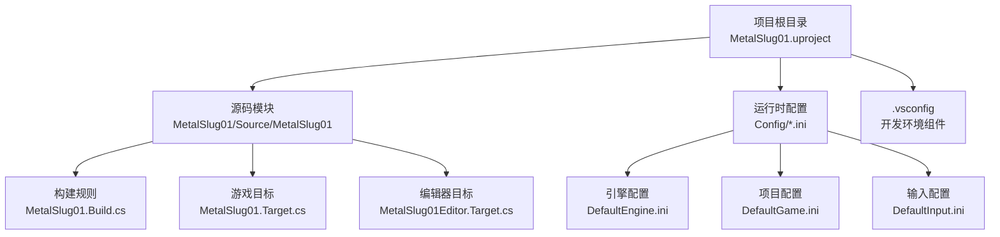
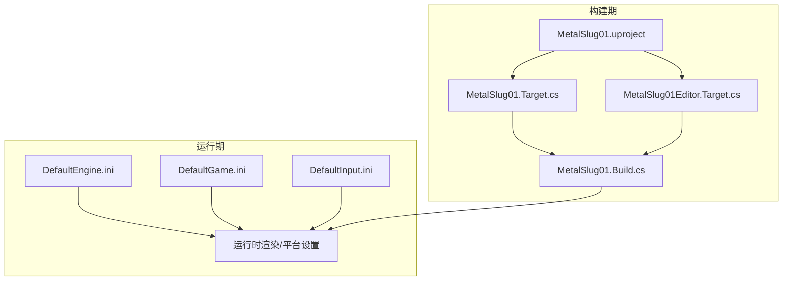
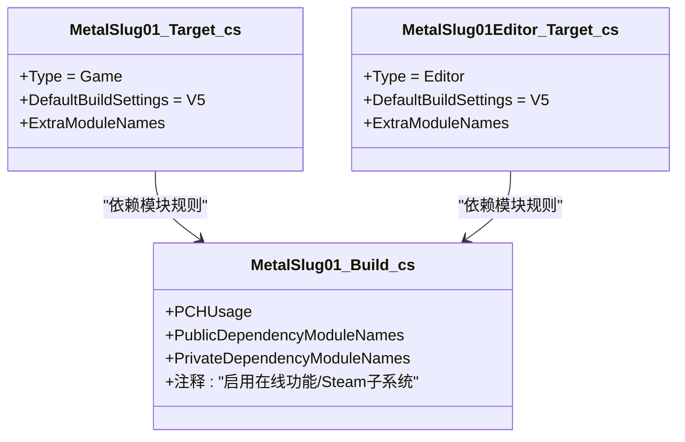
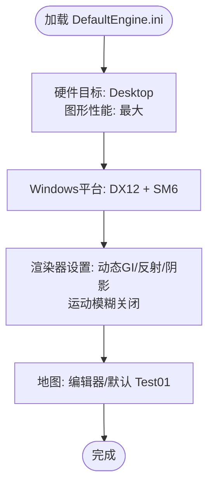
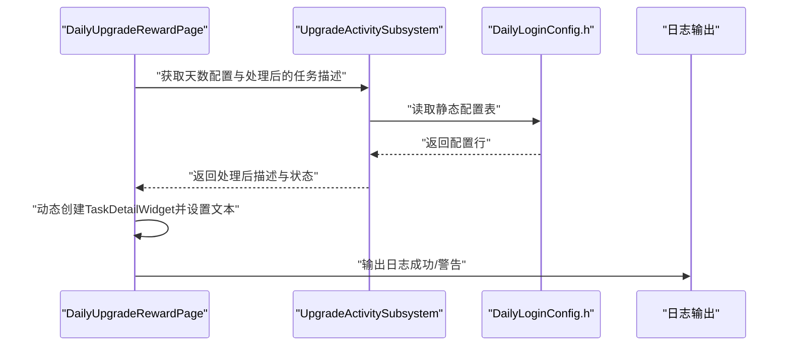
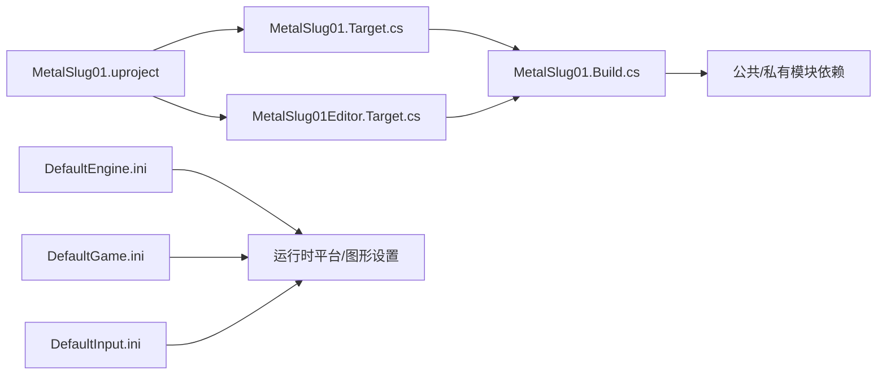

# 部署与发布

<cite>
**本文引用的文件**
- [MetalSlug01.Build.cs](file://MetalSlug01/Source/MetalSlug01/MetalSlug01.Build.cs)
- [MetalSlug01.Target.cs](file://MetalSlug01/Source/MetalSlug01/MetalSlug01.Target.cs)
- [MetalSlug01Editor.Target.cs](file://MetalSlug01/Source/MetalSlug01/MetalSlug01Editor.Target.cs)
- [MetalSlug01.uproject](file://MetalSlug01/MetalSlug01.uproject)
- [DefaultEngine.ini](file://MetalSlug01/Config/DefaultEngine.ini)
- [DefaultGame.ini](file://MetalSlug01/Config/DefaultGame.ini)
- [DefaultInput.ini](file://MetalSlug01/Config/DefaultInput.ini)
- [.vsconfig](file://MetalSlug01/.vsconfig)
- [DailyLoginConfig.h](file://MetalSlug01/Source/MetalSlug01/Public/UI/Activity/Data/DailyLoginConfig.h)
- [UpgradeActivitySubsystem.cpp](file://MetalSlug01/Source/MetalSlug01/Private/UI/Activity/Core/UpgradeActivitySubsystem.cpp)
- [DailyUpgradeRewardPage.cpp](file://MetalSlug01/Source/MetalSlug01/Private/UI/Activity/Pages/DailyUpgradeReward/DailyUpgradeRewardPage.cpp)
- [TaskDetailWidget.cpp](file://MetalSlug01/Source/MetalSlug01/Private/UI/Activity/Pages/DailyUpgradeReward/TaskDetailWidget.cpp)
</cite>

## 目录
1. [简介](#简介)
2. [项目结构](#项目结构)
3. [核心组件](#核心组件)
4. [架构总览](#架构总览)
5. [详细组件分析](#详细组件分析)
6. [依赖关系分析](#依赖关系分析)
7. [性能考虑](#性能考虑)
8. [故障排查指南](#故障排查指南)
9. [结论](#结论)
10. [附录](#附录)

## 简介
本指南面向MetalSlug项目的部署与发布，围绕构建配置、多平台适配、发布打包、版本管理与回滚策略、性能优化与发布前检查清单展开。文档以仓库中的实际配置文件与源码为依据，结合Unreal Engine 5.6工程特性，给出可操作的部署建议与最佳实践。

## 项目结构
MetalSlug采用标准Unreal Engine 5.6工程布局，核心模块位于MetalSlug01/Source/MetalSlug01，构建与目标配置通过Build.cs与Target.cs文件定义，运行时配置集中在Config目录下的ini文件中。项目声明了对引擎版本5.6的关联，并启用了若干编辑器插件。

图表来源
- [MetalSlug01.uproject](file://MetalSlug01/MetalSlug01.uproject#L1-L22)
- [MetalSlug01.Build.cs](file://MetalSlug01/Source/MetalSlug01/MetalSlug01.Build.cs#L1-L24)
- [MetalSlug01.Target.cs](file://MetalSlug01/Source/MetalSlug01/MetalSlug01.Target.cs#L1-L16)
- [MetalSlug01Editor.Target.cs](file://MetalSlug01/Source/MetalSlug01/MetalSlug01Editor.Target.cs#L1-L16)
- [DefaultEngine.ini](file://MetalSlug01/Config/DefaultEngine.ini#L1-L58)
- [DefaultGame.ini](file://MetalSlug01/Config/DefaultGame.ini#L1-L6)
- [DefaultInput.ini](file://MetalSlug01/Config/DefaultInput.ini#L1-L85)
- [.vsconfig](file://MetalSlug01/.vsconfig#L1-L17)

章节来源
- [MetalSlug01.uproject](file://MetalSlug01/MetalSlug01.uproject#L1-L22)
- [MetalSlug01.Build.cs](file://MetalSlug01/Source/MetalSlug01/MetalSlug01.Build.cs#L1-L24)
- [MetalSlug01.Target.cs](file://MetalSlug01/Source/MetalSlug01/MetalSlug01.Target.cs#L1-L16)
- [MetalSlug01Editor.Target.cs](file://MetalSlug01/Source/MetalSlug01/MetalSlug01Editor.Target.cs#L1-L16)
- [DefaultEngine.ini](file://MetalSlug01/Config/DefaultEngine.ini#L1-L58)
- [DefaultGame.ini](file://MetalSlug01/Config/DefaultGame.ini#L1-L6)
- [DefaultInput.ini](file://MetalSlug01/Config/DefaultInput.ini#L1-L85)
- [.vsconfig](file://MetalSlug01/.vsconfig#L1-L17)

## 核心组件
- 构建与模块依赖
  - 模块规则在Build.cs中定义，声明公共与私有依赖模块，如Core、CoreUObject、Engine、UMG、Paper2D、EnhancedInput、GameplayTags、Json、JsonUtilities等；同时保留Slate/SlateCore作为私有依赖，便于编辑器UI扩展。
  - 目标规则分别定义游戏目标与编辑器目标，使用V5构建设置，指定模块名列表。
- 引擎与平台配置
  - DefaultEngine.ini设置硬件目标为Desktop，图形性能为最高，Windows平台默认DX12与SM6着色器格式，启用渲染器多项高级特性（光照、阴影、运动模糊开关、光线追踪等），并配置地图启动项。
  - DefaultGame.ini包含项目ID与通用UI按键处理策略。
  - DefaultInput.ini启用增强输入系统与多平台输入轴配置。
- 工程元数据
  - MetalSlug01.uproject声明引擎版本5.6、模块加载阶段、以及启用的编辑器插件。

章节来源
- [MetalSlug01.Build.cs](file://MetalSlug01/Source/MetalSlug01/MetalSlug01.Build.cs#L5-L22)
- [MetalSlug01.Target.cs](file://MetalSlug01/Source/MetalSlug01/MetalSlug01.Target.cs#L6-L14)
- [MetalSlug01Editor.Target.cs](file://MetalSlug01/Source/MetalSlug01/MetalSlug01Editor.Target.cs#L6-L14)
- [DefaultEngine.ini](file://MetalSlug01/Config/DefaultEngine.ini#L6-L31)
- [DefaultEngine.ini](file://MetalSlug01/Config/DefaultEngine.ini#54-L57)
- [DefaultGame.ini](file://MetalSlug01/Config/DefaultGame.ini#L1-L6)
- [DefaultInput.ini](file://MetalSlug01/Config/DefaultInput.ini#L1-L85)
- [MetalSlug01.uproject](file://MetalSlug01/MetalSlug01.uproject#L3-L11)

## 架构总览
下图展示MetalSlug在构建期与运行期的关键交互：构建系统依据Build.cs与Target.cs生成目标产物；运行时由DefaultEngine.ini/DefaultGame.ini/DefaultInput.ini驱动平台与功能行为；编辑器侧通过Editor目标参与开发与打包流程。

图表来源
- [MetalSlug01.Target.cs](file://MetalSlug01/Source/MetalSlug01/MetalSlug01.Target.cs#L6-L14)
- [MetalSlug01Editor.Target.cs](file://MetalSlug01/Source/MetalSlug01/MetalSlug01Editor.Target.cs#L6-L14)
- [MetalSlug01.Build.cs](file://MetalSlug01/Source/MetalSlug01/MetalSlug01.Build.cs#L5-L22)
- [MetalSlug01.uproject](file://MetalSlug01/MetalSlug01.uproject#L3-L11)
- [DefaultEngine.ini](file://MetalSlug01/Config/DefaultEngine.ini#L6-L31)
- [DefaultGame.ini](file://MetalSlug01/Config/DefaultGame.ini#L1-L6)
- [DefaultInput.ini](file://MetalSlug01/Config/DefaultInput.ini#L1-L85)

## 详细组件分析

### 构建系统与模块依赖（Build.cs）
- 模块规则要点
  - 显式或共享预编译头（PCH）策略，提升编译效率。
  - 公共依赖覆盖核心框架、输入系统、UMG界面、Paper2D资源、增强输入、GameplayTags、JSON序列化工具等。
  - 私有依赖包含Slate/SlateCore，便于编辑器UI扩展。
  - 提供注释示例，说明如何启用在线功能与Steam子系统插件。
- 影响与建议
  - 若引入网络/商店/支付等特性，需按注释指引添加对应模块与插件。
  - 对于UI与关卡编辑器功能，保持Slate/SlateCore私有依赖可满足扩展需求。

图表来源
- [MetalSlug01.Build.cs](file://MetalSlug01/Source/MetalSlug01/MetalSlug01.Build.cs#L5-L22)
- [MetalSlug01.Target.cs](file://MetalSlug01/Source/MetalSlug01/MetalSlug01.Target.cs#L6-L14)
- [MetalSlug01Editor.Target.cs](file://MetalSlug01/Source/MetalSlug01/MetalSlug01Editor.Target.cs#L6-L14)

章节来源
- [MetalSlug01.Build.cs](file://MetalSlug01/Source/MetalSlug01/MetalSlug01.Build.cs#L5-L22)
- [MetalSlug01.Target.cs](file://MetalSlug01/Source/MetalSlug01/MetalSlug01.Target.cs#L6-L14)
- [MetalSlug01Editor.Target.cs](file://MetalSlug01/Source/MetalSlug01/MetalSlug01Editor.Target.cs#L6-L14)

### 运行时配置与平台设置（DefaultEngine.ini）
- 硬件与图形
  - Desktop硬件类、最大图形性能、Windows平台DX12与SM6着色器格式，确保现代GPU特性可用。
- 渲染器设置
  - 启用动态GI、反射、虚拟阴影、光照场、运动模糊关闭等，兼顾画质与性能。
- 地图与编辑器
  - 设定编辑器与默认地图，便于开发与测试。
- 输入与UI
  - 关闭自动变量创建，字体DPI与预设固定，减少运行时开销。

图表来源
- [DefaultEngine.ini](file://MetalSlug01/Config/DefaultEngine.ini#L6-L31)
- [DefaultEngine.ini](file://MetalSlug01/Config/DefaultEngine.ini#L54-L57)

章节来源
- [DefaultEngine.ini](file://MetalSlug01/Config/DefaultEngine.ini#L6-L31)
- [DefaultEngine.ini](file://MetalSlug01/Config/DefaultEngine.ini#L54-L57)

### 项目与UI配置（DefaultGame.ini、DefaultInput.ini）
- DefaultGame.ini
  - 项目ID与通用UI按键处理策略，确保跨平台一致的交互体验。
- DefaultInput.ini
  - 启用增强输入系统，配置多平台输入轴参数，关闭平台过滤，便于统一输入行为。

章节来源
- [DefaultGame.ini](file://MetalSlug01/Config/DefaultGame.ini#L1-L6)
- [DefaultInput.ini](file://MetalSlug01/Config/DefaultInput.ini#L1-L85)

### 开发环境与工具链（.vsconfig）
- 指定Unreal相关调试器、IDE、VC工具链、LLVM Clang、Windows SDK等组件，确保本地开发一致性。

章节来源
- [.vsconfig](file://MetalSlug01/.vsconfig#L1-L17)

### 活动系统配置与运行时数据（DailyLoginConfig.h、UpgradeActivitySubsystem.cpp）
- 配置结构
  - 活动系统静态配置集中于DailyLoginConfig.h，包含活动类型、状态、宝箱与每日升级奖励等结构体，统一管理静态表。
- 运行时逻辑
  - UpgradeActivitySubsystem.cpp负责活动记录初始化、任务计数与状态、宝箱状态初始化与时间戳记录。
  - DailyUpgradeRewardPage.cpp与TaskDetailWidget.cpp体现UI层对配置的消费与动态生成，包含日志输出便于排障。

图表来源
- [DailyUpgradeRewardPage.cpp](file://MetalSlug01/Source/MetalSlug01/Private/UI/Activity/Pages/DailyUpgradeReward/DailyUpgradeRewardPage.cpp#L916-L943)
- [TaskDetailWidget.cpp](file://MetalSlug01/Source/MetalSlug01/Private/UI/Activity/Pages/DailyUpgradeReward/TaskDetailWidget.cpp#L212-L246)
- [UpgradeActivitySubsystem.cpp](file://MetalSlug01/Source/MetalSlug01/Private/UI/Activity/Core/UpgradeActivitySubsystem.cpp#L502-L544)
- [DailyLoginConfig.h](file://MetalSlug01/Source/MetalSlug01/Public/UI/Activity/Data/DailyLoginConfig.h#L549-L622)

章节来源
- [DailyLoginConfig.h](file://MetalSlug01/Source/MetalSlug01/Public/UI/Activity/Data/DailyLoginConfig.h#L1-L635)
- [UpgradeActivitySubsystem.cpp](file://MetalSlug01/Source/MetalSlug01/Private/UI/Activity/Core/UpgradeActivitySubsystem.cpp#L502-L544)
- [DailyUpgradeRewardPage.cpp](file://MetalSlug01/Source/MetalSlug01/Private/UI/Activity/Pages/DailyUpgradeReward/DailyUpgradeRewardPage.cpp#L916-L943)
- [TaskDetailWidget.cpp](file://MetalSlug01/Source/MetalSlug01/Private/UI/Activity/Pages/DailyUpgradeReward/TaskDetailWidget.cpp#L212-L246)

## 依赖关系分析
- 模块耦合
  - 游戏目标与编辑器目标均依赖同一模块规则，确保构建一致性。
  - 模块规则对引擎与UI相关模块强依赖，保证运行时功能完备。
- 外部依赖
  - 通过uproject声明的插件与引擎版本约束，确保兼容性。
- 平台差异
  - DefaultEngine.ini针对Windows平台进行DX12/SM6优化，其他平台可在同配置基础上按需调整。

图表来源
- [MetalSlug01.Build.cs](file://MetalSlug01/Source/MetalSlug01/MetalSlug01.Build.cs#L5-L22)
- [MetalSlug01.Target.cs](file://MetalSlug01/Source/MetalSlug01/MetalSlug01.Target.cs#L6-L14)
- [MetalSlug01Editor.Target.cs](file://MetalSlug01/Source/MetalSlug01/MetalSlug01Editor.Target.cs#L6-L14)
- [MetalSlug01.uproject](file://MetalSlug01/MetalSlug01.uproject#L3-L11)
- [DefaultEngine.ini](file://MetalSlug01/Config/DefaultEngine.ini#L6-L31)
- [DefaultGame.ini](file://MetalSlug01/Config/DefaultGame.ini#L1-L6)
- [DefaultInput.ini](file://MetalSlug01/Config/DefaultInput.ini#L1-L85)

章节来源
- [MetalSlug01.Build.cs](file://MetalSlug01/Source/MetalSlug01/MetalSlug01.Build.cs#L5-L22)
- [MetalSlug01.Target.cs](file://MetalSlug01/Source/MetalSlug01/MetalSlug01.Target.cs#L6-L14)
- [MetalSlug01Editor.Target.cs](file://MetalSlug01/Source/MetalSlug01/MetalSlug01Editor.Target.cs#L6-L14)
- [MetalSlug01.uproject](file://MetalSlug01/MetalSlug01.uproject#L3-L11)
- [DefaultEngine.ini](file://MetalSlug01/Config/DefaultEngine.ini#L6-L31)
- [DefaultGame.ini](file://MetalSlug01/Config/DefaultGame.ini#L1-L6)
- [DefaultInput.ini](file://MetalSlug01/Config/DefaultInput.ini#L1-L85)

## 性能考虑
- 图形与渲染
  - 使用Desktop硬件类与最大图形性能，启用动态GI、反射与光线追踪代理，适合高质量桌面端表现。
  - 可根据目标设备调低部分特效或切换至较低性能档位。
- 输入与UI
  - 关闭自动变量创建与固定字体DPI，降低运行时UI开销。
- 编译与构建
  - 显式/共享PCH策略有助于缩短编译时间；避免不必要的私有依赖可减少链接负担。
- 日志与诊断
  - UI层存在大量日志输出，建议在发布版本中关闭或限制日志级别，避免影响性能。

章节来源
- [DefaultEngine.ini](file://MetalSlug01/Config/DefaultEngine.ini#L6-L31)
- [DefaultEngine.ini](file://MetalSlug01/Config/DefaultEngine.ini#L35-L39)
- [MetalSlug01.Build.cs](file://MetalSlug01/Source/MetalSlug01/MetalSlug01.Build.cs#L9-L9)
- [TaskDetailWidget.cpp](file://MetalSlug01/Source/MetalSlug01/Private/UI/Activity/Pages/DailyUpgradeReward/TaskDetailWidget.cpp#L212-L246)

## 故障排查指南
- 构建失败
  - 检查模块依赖是否遗漏；确认引擎版本与uproject匹配。
- 运行异常
  - 核对DefaultEngine.ini/DefaultGame.ini/DefaultInput.ini关键项（地图、输入系统、平台设置）。
- UI/活动系统问题
  - 关注DailyUpgradeRewardPage与TaskDetailWidget的日志输出，定位配置索引越界、空字符串、解析错误等问题。
- 插件与平台
  - 若启用Steam或其他在线功能，参考Build.cs注释补充模块与插件配置。

章节来源
- [MetalSlug01.Build.cs](file://MetalSlug01/Source/MetalSlug01/MetalSlug01.Build.cs#L18-L22)
- [DefaultEngine.ini](file://MetalSlug01/Config/DefaultEngine.ini#L54-L57)
- [DefaultInput.ini](file://MetalSlug01/Config/DefaultInput.ini#L1-L85)
- [DailyUpgradeRewardPage.cpp](file://MetalSlug01/Source/MetalSlug01/Private/UI/Activity/Pages/DailyUpgradeReward/DailyUpgradeRewardPage.cpp#L916-L943)
- [TaskDetailWidget.cpp](file://MetalSlug01/Source/MetalSlug01/Private/UI/Activity/Pages/DailyUpgradeReward/TaskDetailWidget.cpp#L212-L246)

## 结论
MetalSlug的部署与发布以Unreal Engine 5.6为核心，构建系统通过Build.cs与Target.cs清晰定义模块依赖与目标产物；运行时配置在DefaultEngine.ini/DefaultGame.ini/DefaultInput.ini中集中管理，确保跨平台一致性与性能平衡。结合活动系统的静态配置与运行时逻辑，可实现稳定的功能交付。建议在发布前完善版本号规范、更新与回滚策略，并执行性能与兼容性检查清单。

## 附录

### 多平台适配与差异化配置
- Windows
  - 默认DX12与SM6，Desktop硬件类与最大图形性能，适合高端桌面。
- Linux/Mac
  - 可沿用相同模块与配置，按需调整渲染器设置与平台特定资源路径；若启用移动平台，需在DefaultEngine.ini中增加相应平台段落与设置。

章节来源
- [DefaultEngine.ini](file://MetalSlug01/Config/DefaultEngine.ini#L6-L31)

### 发布流程与打包要点
- 构建目标
  - 使用游戏目标进行打包，确保模块列表与依赖完整。
- 资源与依赖
  - 保持DefaultEngine.ini中的地图与资源引用正确；如涉及外部库或插件，按需在Build.cs中声明。
- 安装包生成
  - 在编辑器“打包”流程中选择目标平台，生成可分发的安装包。

章节来源
- [MetalSlug01.Target.cs](file://MetalSlug01/Source/MetalSlug01/MetalSlug01.Target.cs#L6-L14)
- [DefaultEngine.ini](file://MetalSlug01/Config/DefaultEngine.ini#L54-L57)

### 版本管理与发布策略
- 版本号规范
  - 建议采用语义化版本（主.次.补丁），并在发布分支上打标签。
- 更新机制
  - 通过DefaultGame.ini中的项目ID与服务器配置实现版本校验与热更新策略（如适用）。
- 回滚方案
  - 保留最近三个版本的安装包与配置快照，确保快速回滚。

章节来源
- [DefaultGame.ini](file://MetalSlug01/Config/DefaultGame.ini#L1-L6)
- [MetalSlug01.uproject](file://MetalSlug01/MetalSlug01.uproject#L3-L3)

### 发布前检查清单
- 构建与依赖
  - 模块依赖齐全、引擎版本匹配、无未解析符号。
- 平台与图形
  - 平台设置正确、DX12/SM6可用、渲染器设置符合目标设备。
- 输入与UI
  - 增强输入启用、UI交互正常、日志级别合理。
- 活动系统
  - 配置表加载成功、任务与宝箱状态初始化正确、日志无越界/空值警告。

章节来源
- [MetalSlug01.Build.cs](file://MetalSlug01/Source/MetalSlug01/MetalSlug01.Build.cs#L5-L22)
- [DefaultEngine.ini](file://MetalSlug01/Config/DefaultEngine.ini#L6-L31)
- [DefaultInput.ini](file://MetalSlug01/Config/DefaultInput.ini#L1-L85)
- [DailyLoginConfig.h](file://MetalSlug01/Source/MetalSlug01/Public/UI/Activity/Data/DailyLoginConfig.h#L549-L622)
- [UpgradeActivitySubsystem.cpp](file://MetalSlug01/Source/MetalSlug01/Private/UI/Activity/Core/UpgradeActivitySubsystem.cpp#L502-L544)