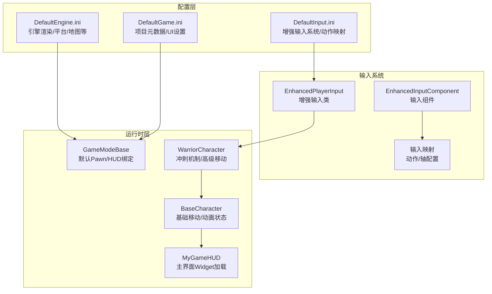
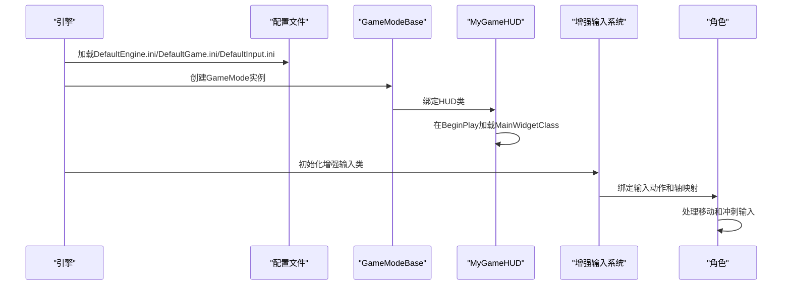
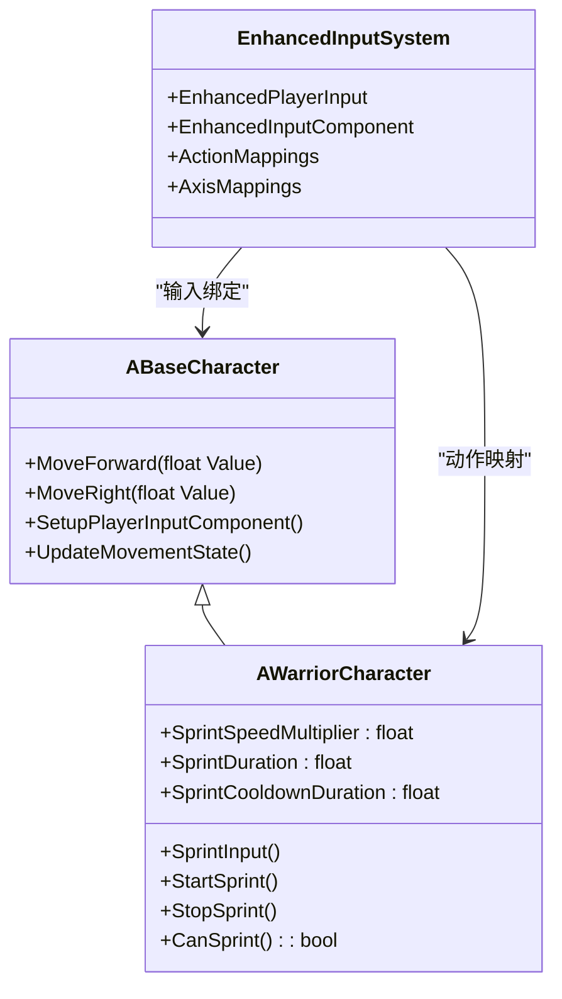
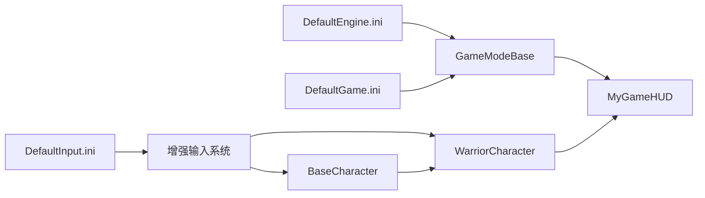

# 配置管理

<cite>
**本文档引用的文件**
- [DefaultEngine.ini](file://MetalSlug01/Config/DefaultEngine.ini)
- [DefaultGame.ini](file://MetalSlug01/Config/DefaultGame.ini)
- [DefaultInput.ini](file://MetalSlug01/Config/DefaultInput.ini)
- [BaseCharacter.h](file://MetalSlug01/Source/MetalSlug01/Public/Characters/BaseCharacter.h)
- [WarriorCharacter.cpp](file://MetalSlug01/Source/MetalSlug01/Private/Characters/WarriorCharacter.cpp)
- [BaseCharacter.cpp](file://MetalSlug01/Source/MetalSlug01/Private/Characters/BaseCharacter.cpp)
- [MyGameHUD.cpp](file://MetalSlug01/Source/MetalSlug01/Private/UI/MyGameHUD.cpp)
- [MyGameHUD.h](file://MetalSlug01/Source/MetalSlug01/Public/UI/MyGameHUD.h)
- [MetalSlug01GameModeBase.cpp](file://MetalSlug01/Source/MetalSlug01/Private/MetalSlug01GameModeBase.cpp)
- [MetalSlug01GameModeBase.h](file://MetalSlug01/Source/MetalSlug01/Public/MetalSlug01GameModeBase.h)
</cite>

## 更新摘要
**所做更改**
- 更新了输入配置部分，反映新的增强输入系统和角色移动系统的配置变更
- 新增了角色移动系统配置说明，包括冲刺机制和输入映射方案
- 更新了配置文件加载和应用机制，强调增强输入类的使用
- 完善了配置项参考，增加了新的输入轴配置和动作映射

## 目录
1. [简介](#简介)
2. [项目结构](#项目结构)
3. [核心组件](#核心组件)
4. [架构总览](#架构总览)
5. [详细组件分析](#详细组件分析)
6. [依赖关系分析](#依赖关系分析)
7. [性能考虑](#性能考虑)
8. [故障排查指南](#故障排查指南)
9. [结论](#结论)
10. [附录](#附录)

## 简介
本文件面向MetalSlug项目的配置管理，系统性梳理引擎配置(DefaultEngine.ini)、游戏配置(DefaultGame.ini)与输入配置(DefaultInput.ini)的设计与作用，并结合实际代码实现，解释配置项对物理参数、渲染设置、游戏模式绑定等方面的影响。同时，阐明配置文件的加载与应用机制（优先级、覆盖规则、动态更新）、扩展方式（新增配置项、自定义配置文件），并提供性能优化与兼容性建议及完整配置参考。

**更新** 本次更新重点关注新的角色移动系统和增强输入映射方案的配置支持。

## 项目结构
MetalSlug的配置位于项目根目录下的Config文件夹，分别定义了引擎、游戏与输入层面的默认配置；运行时与UI层通过代码读取这些配置并驱动行为。

**图表来源**
- [DefaultEngine.ini](file://MetalSlug01/Config/DefaultEngine.ini#L54-L57)
- [DefaultGame.ini](file://MetalSlug01/Config/DefaultGame.ini#L1-L6)
- [DefaultInput.ini](file://MetalSlug01/Config/DefaultInput.ini#L80-L89)
- [BaseCharacter.h](file://MetalSlug01/Source/MetalSlug01/Public/Characters/BaseCharacter.h#L102-L120)
- [WarriorCharacter.cpp](file://MetalSlug01/Source/MetalSlug01/Private/Characters/WarriorCharacter.cpp#L79-L85)
- [MyGameHUD.cpp](file://MetalSlug01/Source/MetalSlug01/Private/UI/MyGameHUD.cpp#L4-L18)

**章节来源**
- [DefaultEngine.ini](file://MetalSlug01/Config/DefaultEngine.ini#L1-L60)
- [DefaultGame.ini](file://MetalSlug01/Config/DefaultGame.ini#L1-L6)
- [DefaultInput.ini](file://MetalSlug01/Config/DefaultInput.ini#L1-L91)
- [BaseCharacter.h](file://MetalSlug01/Source/MetalSlug01/Public/Characters/BaseCharacter.h#L1-L292)
- [WarriorCharacter.cpp](file://MetalSlug01/Source/MetalSlug01/Private/Characters/WarriorCharacter.cpp#L1-L280)
- [MyGameHUD.cpp](file://MetalSlug01/Source/MetalSlug01/Private/UI/MyGameHUD.cpp#L4-L18)

## 核心组件
- 引擎配置(DefaultEngine.ini)
  - 音频混音开关、硬件目标平台、图形性能、DX12/RHI、渲染特性（静态光照、距离场、全局光照、反射、阴影、曝光、运动模糊、光线追踪）、UI字体DPI、Android文件服务器等。
- 游戏配置(DefaultGame.ini)
  - 项目ID、通用UI按钮按键处理策略。
- 输入配置(DefaultInput.ini)
  - 增强输入系统配置，包括轴配置（手柄/鼠标死区、指数、灵敏度）、动作映射（冲刺）、全屏切换、鼠标平滑、FOV缩放、捕获/锁定模式、默认输入类、触摸接口、控制台键等。

**更新** 新增了增强输入系统的配置说明，强调了增强输入类和组件的使用。

**章节来源**
- [DefaultEngine.ini](file://MetalSlug01/Config/DefaultEngine.ini#L3-L57)
- [DefaultGame.ini](file://MetalSlug01/Config/DefaultGame.ini#L1-L6)
- [DefaultInput.ini](file://MetalSlug01/Config/DefaultInput.ini#L1-L91)

## 架构总览
配置系统在启动阶段由引擎读取各INI文件，随后在运行时由GameMode、HUD、角色与UI组件按需消费配置值，形成"配置驱动行为"的闭环。

**图表来源**
- [DefaultEngine.ini](file://MetalSlug01/Config/DefaultEngine.ini#L54-L57)
- [DefaultGame.ini](file://MetalSlug01/Config/DefaultGame.ini#L1-L6)
- [DefaultInput.ini](file://MetalSlug01/Config/DefaultInput.ini#L80-L89)
- [MetalSlug01GameModeBase.cpp](file://MetalSlug01/Source/MetalSlug01/Private/MetalSlug01GameModeBase.cpp#L9-L26)
- [MyGameHUD.cpp](file://MetalSlug01/Source/MetalSlug01/Private/UI/MyGameHUD.cpp#L4-L18)
- [WarriorCharacter.cpp](file://MetalSlug01/Source/MetalSlug01/Private/Characters/WarriorCharacter.cpp#L79-L85)

## 详细组件分析

### 引擎配置(DefaultEngine.ini)解析
- 硬件与图形
  - 平台与性能：桌面硬件类、最大图形性能。
  - RHI与着色器：DX12、SM6目标格式。
  - 渲染特性：禁用静态光照、生成网格距离场、启用虚拟阴影、开启光线追踪与代理、关闭运动模糊。
  - 曝光与局部曝光：扩展亮度范围、高光/阴影对比缩放。
- 地图设置
  - 编辑器与默认关卡指向同一测试地图。
- UI设置
  - 关闭自动变量创建、标准字体DPI。
- Android文件服务器
  - 启用插件、网络连接、安全令牌、连接类型等。

**章节来源**
- [DefaultEngine.ini](file://MetalSlug01/Config/DefaultEngine.ini#L6-L16)
- [DefaultEngine.ini](file://MetalSlug01/Config/DefaultEngine.ini#L18-L30)
- [DefaultEngine.ini](file://MetalSlug01/Config/DefaultEngine.ini#L54-L57)
- [DefaultEngine.ini](file://MetalSlug01/Config/DefaultEngine.ini#L35-L38)
- [DefaultEngine.ini](file://MetalSlug01/Config/DefaultEngine.ini#L40-L52)

### 游戏配置(DefaultGame.ini)解析
- 项目ID：唯一标识项目。
- 通用UI设置：按钮接受键处理策略（触发点击）。

**章节来源**
- [DefaultGame.ini](file://MetalSlug01/Config/DefaultGame.ini#L1-L6)

### 输入配置(DefaultInput.ini)解析
- 增强输入系统
  - 默认输入类：使用增强输入类与组件，支持更灵活的输入映射。
  - 输入组件：EnhancedInputComponent提供更强大的输入处理能力。
- 轴配置：手柄左右摇杆、右摇杆、鼠标X/Y、2D鼠标、滚轮、各类VR/手柄专用轴，统一设置死区、指数、灵敏度与反转标志。
- 动作映射：包含冲刺动作映射，使用LeftShift键触发。
- 全屏与鼠标：Alt+F11、F11切换全屏；鼠标平滑、FOV缩放、捕获/锁定模式。
- 动态绑定：启用动态组件输入绑定、手势识别、自动纠正、控制台键等。
- 触摸接口：指向默认虚拟摇杆。

**更新** 新增了增强输入系统的详细配置说明，包括默认输入类和组件的使用。

**章节来源**
- [DefaultInput.ini](file://MetalSlug01/Config/DefaultInput.ini#L1-L91)

### 角色移动系统与输入绑定
- 基础角色移动
  - 基础角色类提供移动输入处理，支持前进/后退和左右移动。
  - 支持多玩家输入映射，不同玩家使用不同的轴名称。
- 战士角色冲刺系统
  - 冲刺机制：通过增强输入系统绑定Sprint动作。
  - 冲刺参数：速度倍数3000、持续时间0.3秒、冷却1秒。
  - 冲刺状态管理：未冲刺、冲刺中、冷却中三种状态。
  - 冲刺实现：使用LaunchCharacter函数实现瞬间冲刺效果。
- 输入系统集成
  - 角色输入绑定使用增强输入组件。
  - 支持键盘WASD移动和鼠标视角控制。
  - 冲刺按键使用LeftShift键。

**图表来源**
- [BaseCharacter.h](file://MetalSlug01/Source/MetalSlug01/Public/Characters/BaseCharacter.h#L31-L56)
- [WarriorCharacter.cpp](file://MetalSlug01/Source/MetalSlug01/Private/Characters/WarriorCharacter.cpp#L90-L134)
- [DefaultInput.ini](file://MetalSlug01/Config/DefaultInput.ini#L80-L84)

**章节来源**
- [BaseCharacter.h](file://MetalSlug01/Source/MetalSlug01/Public/Characters/BaseCharacter.h#L31-L56)
- [WarriorCharacter.cpp](file://MetalSlug01/Source/MetalSlug01/Private/Characters/WarriorCharacter.cpp#L79-L85)
- [WarriorCharacter.cpp](file://MetalSlug01/Source/MetalSlug01/Private/Characters/WarriorCharacter.cpp#L90-L134)
- [DefaultInput.ini](file://MetalSlug01/Config/DefaultInput.ini#L80-L84)

### HUD与主界面加载
- GameMode绑定HUD类，HUD在BeginPlay中根据MainWidgetClass加载主界面Widget并添加到视口。
- 该流程受DefaultGame.ini中的UI设置与DefaultEngine.ini的地图设置影响。

**章节来源**
- [MetalSlug01GameModeBase.cpp](file://MetalSlug01/Source/MetalSlug01/Private/MetalSlug01GameModeBase.cpp#L9-L26)
- [MyGameHUD.cpp](file://MetalSlug01/Source/MetalSlug01/Private/UI/MyGameHUD.cpp#L4-L18)
- [DefaultGame.ini](file://MetalSlug01/Config/DefaultGame.ini#L4-L6)
- [DefaultEngine.ini](file://MetalSlug01/Config/DefaultEngine.ini#L54-L57)

## 依赖关系分析
- 配置到运行时的依赖
  - DefaultEngine.ini影响渲染管线、平台与地图选择。
  - DefaultGame.ini影响项目元数据与UI行为。
  - DefaultInput.ini影响增强输入系统与输入映射配置。
- 运行时组件依赖
  - GameMode依赖地图设置与HUD类。
  - 角色依赖增强输入组件和动作映射。
  - UI依赖子系统配置与保存记录。

**图表来源**
- [DefaultEngine.ini](file://MetalSlug01/Config/DefaultEngine.ini#L54-L57)
- [DefaultGame.ini](file://MetalSlug01/Config/DefaultGame.ini#L1-L6)
- [DefaultInput.ini](file://MetalSlug01/Config/DefaultInput.ini#L80-L89)
- [BaseCharacter.h](file://MetalSlug01/Source/MetalSlug01/Public/Characters/BaseCharacter.h#L102-L120)
- [WarriorCharacter.cpp](file://MetalSlug01/Source/MetalSlug01/Private/Characters/WarriorCharacter.cpp#L79-L85)
- [MyGameHUD.cpp](file://MetalSlug01/Source/MetalSlug01/Private/UI/MyGameHUD.cpp#L4-L18)

**章节来源**
- [DefaultEngine.ini](file://MetalSlug01/Config/DefaultEngine.ini#L54-L57)
- [DefaultGame.ini](file://MetalSlug01/Config/DefaultGame.ini#L1-L6)
- [DefaultInput.ini](file://MetalSlug01/Config/DefaultInput.ini#L80-L89)
- [BaseCharacter.h](file://MetalSlug01/Source/MetalSlug01/Public/Characters/BaseCharacter.h#L102-L120)
- [WarriorCharacter.cpp](file://MetalSlug01/Source/MetalSlug01/Private/Characters/WarriorCharacter.cpp#L79-L85)
- [MyGameHUD.cpp](file://MetalSlug01/Source/MetalSlug01/Private/UI/MyGameHUD.cpp#L4-L18)

## 性能考虑
- 渲染与图形
  - 最大图形性能与DX12/RHI可获得更佳画质与性能表现；若目标设备性能有限，可降低图形质量或关闭光线追踪与运动模糊。
  - 关闭静态光照与启用距离场适合动态场景；注意内存占用与烘焙成本。
- 输入与响应
  - 合理设置轴死区与灵敏度，避免误触与响应迟滞；鼠标平滑与FOV缩放应按设备与用户习惯调整。
  - 增强输入系统提供更精确的输入处理，建议使用默认配置以获得最佳体验。
- 角色移动性能
  - 冲刺系统使用LaunchCharacter函数，性能开销较小但要注意速度倍数的合理性。
  - 多玩家输入映射会增加少量内存开销，但提升游戏体验。
- UI与资源
  - 使用软引用异步加载资源，缺失时降级为占位符，确保UI稳定与加载速度。
- 地图与启动
  - 统一编辑器与默认地图有助于减少调试与打包差异带来的问题。

## 故障排查指南
- 输入无响应
  - 检查DefaultInput.ini中的默认输入类与组件是否正确；确认角色的输入组件已绑定增强输入组件与动作。
  - 验证动作映射是否正确配置，特别是冲刺动作的键位设置。
- 角色移动异常
  - 检查BaseCharacter的输入绑定是否正确，特别是多玩家输入映射。
  - 确认WarriorCharacter的冲刺系统是否正常工作，检查状态机转换。
- UI不显示
  - 检查GameMode是否正确绑定HUD类，HUD的BeginPlay是否成功加载MainWidgetClass。
- 性能问题
  - 检查图形设置是否过高，适当降低图形质量。
  - 验证输入配置是否合理，避免过度敏感的轴配置。

**更新** 新增了角色移动系统和增强输入系统的故障排查指导。

**章节来源**
- [DefaultInput.ini](file://MetalSlug01/Config/DefaultInput.ini#L80-L89)
- [BaseCharacter.h](file://MetalSlug01/Source/MetalSlug01/Public/Characters/BaseCharacter.h#L102-L120)
- [WarriorCharacter.cpp](file://MetalSlug01/Source/MetalSlug01/Private/Characters/WarriorCharacter.cpp#L164-L175)
- [MyGameHUD.cpp](file://MetalSlug01/Source/MetalSlug01/Private/UI/MyGameHUD.cpp#L4-L18)

## 结论
MetalSlug的配置体系以INI文件为核心，贯穿引擎、游戏与输入三个层面，配合运行时组件实现"配置即功能"。通过合理设置渲染、输入与地图参数，并在UI层以子系统与配置联动的方式实现动态展示，既保证了灵活性，又提升了可维护性。

**更新** 新的角色移动系统和增强输入配置为游戏提供了更丰富的控制选项和更好的用户体验。建议在不同设备上进行针对性优化，并持续完善配置项与扩展机制。

## 附录

### 配置项参考与建议
- 引擎配置(DefaultEngine.ini)
  - 硬件与图形：桌面硬件类、最大图形性能、DX12/RHI、SM6、光线追踪、虚拟阴影、距离场、曝光与运动模糊。
  - 地图设置：编辑器与默认地图一致。
  - UI设置：字体DPI与自动变量创建。
  - Android文件服务器：连接与安全令牌。
- 游戏配置(DefaultGame.ini)
  - 项目ID：确保唯一性。
  - 通用UI：按钮接受键处理策略。
- 输入配置(DefaultInput.ini)
  - 增强输入系统：默认输入类、输入组件、触摸接口。
  - 轴配置：手柄/鼠标/VR轴的死区、指数、灵敏度与反转。
  - 动作映射：冲刺动作映射配置。
  - 全屏与鼠标：捕获/锁定、平滑、FOV缩放。
  - 动态绑定：动态组件输入绑定、手势识别、控制台键。

**更新** 新增了增强输入系统的配置项说明和角色移动系统的相关配置。

**章节来源**
- [DefaultEngine.ini](file://MetalSlug01/Config/DefaultEngine.ini#L6-L16)
- [DefaultEngine.ini](file://MetalSlug01/Config/DefaultEngine.ini#L18-L30)
- [DefaultEngine.ini](file://MetalSlug01/Config/DefaultEngine.ini#L54-L57)
- [DefaultEngine.ini](file://MetalSlug01/Config/DefaultEngine.ini#L35-L38)
- [DefaultEngine.ini](file://MetalSlug01/Config/DefaultEngine.ini#L40-L52)
- [DefaultGame.ini](file://MetalSlug01/Config/DefaultGame.ini#L1-L6)
- [DefaultInput.ini](file://MetalSlug01/Config/DefaultInput.ini#L1-L91)
- [BaseCharacter.h](file://MetalSlug01/Source/MetalSlug01/Public/Characters/BaseCharacter.h#L102-L120)
- [WarriorCharacter.cpp](file://MetalSlug01/Source/MetalSlug01/Private/Characters/WarriorCharacter.cpp#L19-L27)