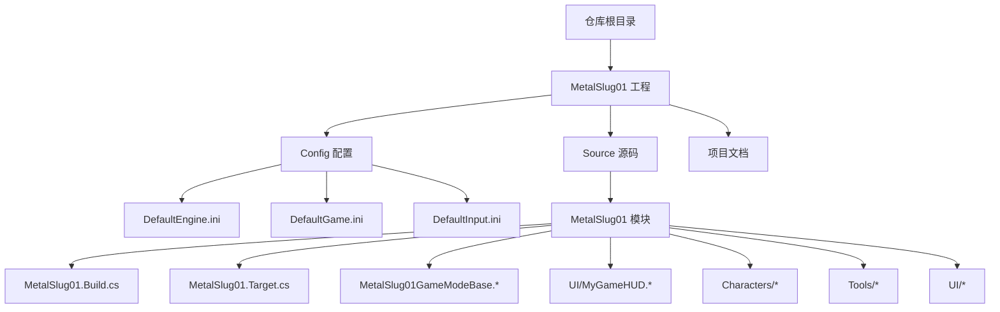
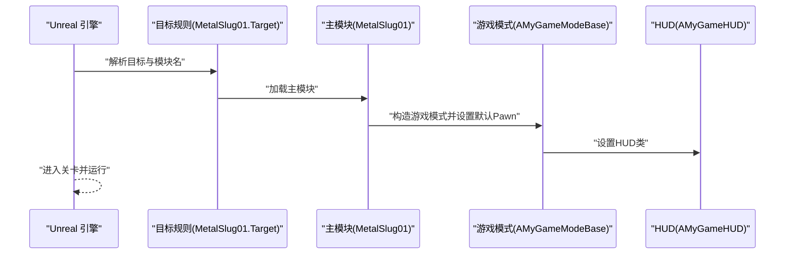
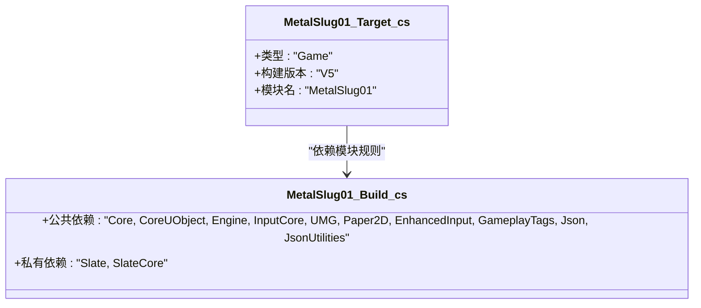
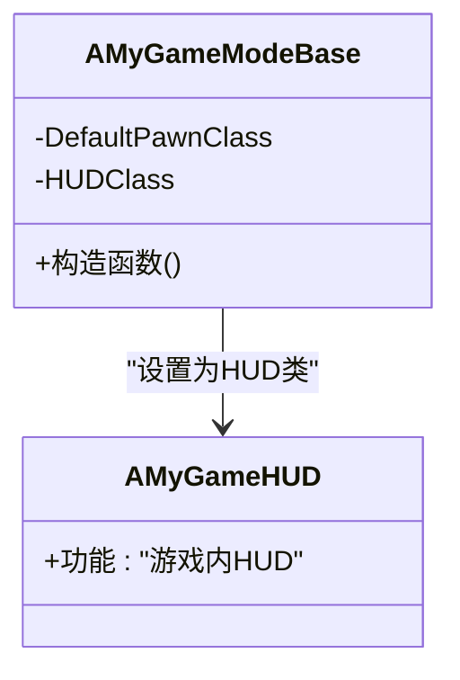
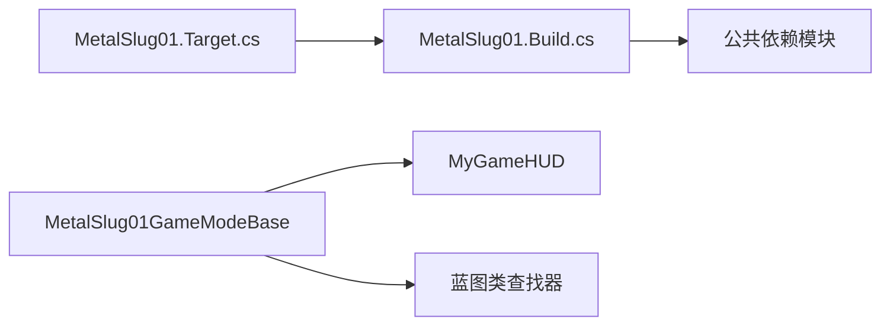

# 快速开始

<cite>
**本文引用的文件**
- [MetalSlug01.uproject](file://MetalSlug01/MetalSlug01.uproject)
- [DefaultEngine.ini](file://MetalSlug01/Config/DefaultEngine.ini)
- [DefaultGame.ini](file://MetalSlug01/Config/DefaultGame.ini)
- [MetalSlug01.Build.cs](file://MetalSlug01/Source/MetalSlug01/MetalSlug01.Build.cs)
- [MetalSlug01.Target.cs](file://MetalSlug01/Source/MetalSlug01.Target.cs)
- [MetalSlug01.cpp](file://MetalSlug01/Source/MetalSlug01/MetalSlug01.cpp)
- [MetalSlug01.h](file://MetalSlug01/Source/MetalSlug01/MetalSlug01.h)
- [MetalSlug01GameModeBase.cpp](file://MetalSlug01/Source/MetalSlug01/MetalSlug01GameModeBase.cpp)
- [MetalSlug01GameModeBase.h](file://MetalSlug01/Source/MetalSlug01/MetalSlug01GameModeBase.h)
- [UpgradeActivitySaveModifier_Readme.md](file://UpgradeActivitySaveModifier_Readme.md)
</cite>

## 目录
1. [简介](#简介)
2. [项目结构](#项目结构)
3. [核心组件](#核心组件)
4. [架构总览](#架构总览)
5. [详细组件分析](#详细组件分析)
6. [依赖关系分析](#依赖关系分析)
7. [性能与优化建议](#性能与优化建议)
8. [故障排查指南](#故障排查指南)
9. [结论](#结论)
10. [附录](#附录)

## 简介
本指南面向首次接触 MetalSlug 项目的开发者，目标是帮助你在最短时间内完成开发环境准备、项目导入、编译与运行，并理解项目目录结构与主要文件职责。项目基于 Unreal Engine 5.6，采用 C++ 模块化开发，结合 UMG、Paper2D、EnhancedInput、GameplayTags 等模块，具备可扩展的 UI 活动子系统与存档调试工具。

## 项目结构
- 根目录包含项目根目录与文档文件，核心工程位于 MetalSlug01 子目录。
- 工程配置集中在 Config 目录，包含引擎、游戏、输入等基础配置。
- 源码位于 Source/MetalSlug01，采用模块化组织，包含角色、工具、UI 等子模块。
- 项目根目录包含升级活动存档调试说明文档，便于快速上手调试。

图表来源
- [MetalSlug01.uproject](file://MetalSlug01/MetalSlug01.uproject#L1-L22)
- [DefaultEngine.ini](file://MetalSlug01/Config/DefaultEngine.ini#L1-L58)
- [DefaultGame.ini](file://MetalSlug01/Config/DefaultGame.ini#L1-L6)
- [MetalSlug01.Build.cs](file://MetalSlug01/Source/MetalSlug01/MetalSlug01.Build.cs#L1-L24)
- [MetalSlug01.Target.cs](file://MetalSlug01/Source/MetalSlug01.Target.cs#L1-L16)
- [MetalSlug01GameModeBase.cpp](file://MetalSlug01/Source/MetalSlug01/MetalSlug01GameModeBase.cpp#L1-L26)
- [MetalSlug01GameModeBase.h](file://MetalSlug01/Source/MetalSlug01/MetalSlug01GameModeBase.h#L1-L17)

章节来源
- [MetalSlug01.uproject](file://MetalSlug01/MetalSlug01.uproject#L1-L22)
- [DefaultEngine.ini](file://MetalSlug01/Config/DefaultEngine.ini#L1-L58)
- [DefaultGame.ini](file://MetalSlug01/Config/DefaultGame.ini#L1-L6)

## 核心组件
- 引擎关联与模块定义
  - 工程文件明确绑定引擎版本为 5.6，并声明 Runtime 模块 MetalSlug01。
  - 模块构建脚本定义了公共与私有依赖模块，涵盖 UMG、Paper2D、EnhancedInput、GameplayTags、Json/JsonUtilities 等。
- 目标类型与构建设置
  - 目标规则设置为游戏类型，启用 V5 构建版本，模块名包含 MetalSlug01。
- 游戏模式与 HUD
  - 游戏模式构造函数中通过蓝图类查找器设置默认玩家 Pawn，并指定 HUD 类型。
- 主模块入口
  - 主模块实现文件负责注册 Primary Game Module，作为引擎启动入口。

章节来源
- [MetalSlug01.uproject](file://MetalSlug01/MetalSlug01.uproject#L3-L11)
- [MetalSlug01.Build.cs](file://MetalSlug01/Source/MetalSlug01/MetalSlug01.Build.cs#L7-L22)
- [MetalSlug01.Target.cs](file://MetalSlug01/Source/MetalSlug01.Target.cs#L8-L14)
- [MetalSlug01GameModeBase.cpp](file://MetalSlug01/Source/MetalSlug01/MetalSlug01GameModeBase.cpp#L9-L26)
- [MetalSlug01.cpp](file://MetalSlug01/Source/MetalSlug01/MetalSlug01.cpp#L6-L10)

## 架构总览
下图展示了从引擎启动到游戏运行的关键交互：Editor/Engine 通过模块加载与目标规则初始化模块，随后由游戏模式设置默认 Pawn 与 HUD，最终进入关卡运行。

图表来源
- [MetalSlug01.Target.cs](file://MetalSlug01/Source/MetalSlug01.Target.cs#L8-L14)
- [MetalSlug01.cpp](file://MetalSlug01/Source/MetalSlug01/MetalSlug01.cpp#L6-L10)
- [MetalSlug01GameModeBase.cpp](file://MetalSlug01/Source/MetalSlug01/MetalSlug01GameModeBase.cpp#L9-L26)

## 详细组件分析

### 模块与构建配置
- 模块规则
  - 使用显式或共享预编译头，公共依赖包含 Core、CoreUObject、Engine、InputCore、UMG、Paper2D、EnhancedInput、GameplayTags、Json、JsonUtilities。
  - 私有依赖包含 Slate、SlateCore，便于 UI 相关功能。
- 目标规则
  - 目标类型为 Game，启用 V5 构建版本，模块名为 MetalSlug01。

图表来源
- [MetalSlug01.Build.cs](file://MetalSlug01/Source/MetalSlug01/MetalSlug01.Build.cs#L7-L22)
- [MetalSlug01.Target.cs](file://MetalSlug01/Source/MetalSlug01.Target.cs#L8-L14)

章节来源
- [MetalSlug01.Build.cs](file://MetalSlug01/Source/MetalSlug01/MetalSlug01.Build.cs#L7-L22)
- [MetalSlug01.Target.cs](file://MetalSlug01/Source/MetalSlug01.Target.cs#L8-L14)

### 游戏模式与 HUD
- 游戏模式
  - 通过蓝图类查找器设置默认玩家 Pawn，并指定 HUD 类型。
- HUD
  - 在游戏模式中被设置为默认 HUD 类，用于 UI 层展示与交互。

图表来源
- [MetalSlug01GameModeBase.cpp](file://MetalSlug01/Source/MetalSlug01/MetalSlug01GameModeBase.cpp#L9-L26)
- [MetalSlug01GameModeBase.h](file://MetalSlug01/Source/MetalSlug01/MetalSlug01GameModeBase.h#L9-L16)

章节来源
- [MetalSlug01GameModeBase.cpp](file://MetalSlug01/Source/MetalSlug01/MetalSlug01GameModeBase.cpp#L9-L26)
- [MetalSlug01GameModeBase.h](file://MetalSlug01/Source/MetalSlug01/MetalSlug01GameModeBase.h#L9-L16)

### 配置文件要点
- 引擎配置
  - 针对桌面硬件与 DX12 RHI 的图形设置，启用光线追踪与阴影虚拟化等特性。
  - 关卡映射指向 Test01，编辑器与默认地图一致。
- 游戏项目配置
  - 项目 ID 与通用 UI 键盘回车点击行为设置。

章节来源
- [DefaultEngine.ini](file://MetalSlug01/Config/DefaultEngine.ini#L6-L57)
- [DefaultGame.ini](file://MetalSlug01/Config/DefaultGame.ini#L1-L6)

### 升级活动存档调试工具
- 提供一系列控制台命令，支持设置经验值、奖励图标索引、宝箱领取状态、创建新记录、重置记录、查看记录信息等。
- 支持一次性查看所有记录状态，便于对比与调试。
- 包含常见错误处理与最佳实践建议。

章节来源
- [UpgradeActivitySaveModifier_Readme.md](file://UpgradeActivitySaveModifier_Readme.md#L1-L189)

## 依赖关系分析
- 模块耦合
  - 游戏模式依赖蓝图类查找器以延迟绑定默认 Pawn；HUD 作为游戏模式的一部分被设置。
- 外部依赖
  - 项目依赖 UMG、Paper2D、EnhancedInput、GameplayTags、Json/JsonUtilities 等模块，满足 UI、2D 渲染、输入增强、标签系统与 JSON 数据处理需求。
- 目标与模块一致性
  - 目标规则与模块构建脚本保持一致，确保编译链路正确。

图表来源
- [MetalSlug01.Target.cs](file://MetalSlug01/Source/MetalSlug01.Target.cs#L8-L14)
- [MetalSlug01.Build.cs](file://MetalSlug01/Source/MetalSlug01/MetalSlug01.Build.cs#L11-L13)
- [MetalSlug01GameModeBase.cpp](file://MetalSlug01/Source/MetalSlug01/MetalSlug01GameModeBase.cpp#L14-L19)

章节来源
- [MetalSlug01.Target.cs](file://MetalSlug01/Source/MetalSlug01.Target.cs#L8-L14)
- [MetalSlug01.Build.cs](file://MetalSlug01/Source/MetalSlug01/MetalSlug01.Build.cs#L11-L13)
- [MetalSlug01GameModeBase.cpp](file://MetalSlug01/Source/MetalSlug01/MetalSlug01GameModeBase.cpp#L14-L19)

## 性能与优化建议
- 图形与渲染
  - 已启用 DX12 RHI 与 SM6 着色格式，以及光线追踪与阴影虚拟化，适合现代桌面平台。
  - 若目标为低功耗设备，可在配置中调整默认图形性能与光照方法。
- 输入与 UI
  - EnhancedInput 与 UMG 的组合可提升输入响应与 UI 交互体验，建议在蓝图与 C++ 中保持一致的输入映射策略。
- 资源管理
  - Paper2D 适用于 2D 游戏资源管线，建议统一资源命名与打包策略，减少运行时加载抖动。

## 故障排查指南
- 引擎版本不匹配
  - 现象：无法打开或编译项目。
  - 排查：确认已安装 UE 5.6，工程文件中 EngineAssociation 指向 5.6。
  - 参考：[MetalSlug01.uproject](file://MetalSlug01/MetalSlug01.uproject#L3)
- 默认关卡未找到
  - 现象：编辑器启动后无场景或白屏。
  - 排查：检查 DefaultEngine.ini 中 EditorStartupMap 与 GameDefaultMap 指向的关卡是否存在。
  - 参考：[DefaultEngine.ini](file://MetalSlug01/Config/DefaultEngine.ini#L54-L57)
- 默认玩家 Pawn 未设置
  - 现象：运行时无玩家控制对象。
  - 排查：确认蓝图类查找器路径有效，且蓝图类后缀为 _C；检查游戏模式 DefaultPawnClass 是否被赋值。
  - 参考：[MetalSlug01GameModeBase.cpp](file://MetalSlug01/Source/MetalSlug01/MetalSlug01GameModeBase.cpp#L14-L19)
- 编译失败（模块缺失）
  - 现象：编译报错提示模块未找到。
  - 排查：核对 MetalSlug01.Build.cs 中公共/私有依赖是否齐全，必要时在插件中启用相关模块。
  - 参考：[MetalSlug01.Build.cs](file://MetalSlug01/Source/MetalSlug01/MetalSlug01.Build.cs#L11-L13)
- 控制台调试命令无效
  - 现象：在编辑器控制台输入命令无响应。
  - 排查：确认命令拼写正确，且相关 Subsystem 已初始化；使用 ShowInfo/ShowAllInfo 验证状态。
  - 参考：[UpgradeActivitySaveModifier_Readme.md](file://UpgradeActivitySaveModifier_Readme.md#L92-L132)

## 结论
通过本指南，你可以完成 MetalSlug 项目的环境准备、导入与编译，并理解核心模块、配置与运行流程。建议在熟悉基础结构后，逐步探索 UI 活动子系统与存档调试工具，以提升开发效率与问题定位能力。

## 附录

### 开发环境搭建步骤
- 安装 Unreal Engine 5.6
  - 从官方渠道下载并安装 UE 5.6。
  - 确保安装过程中勾选 C++ 支持与所选平台工具链。
- 准备项目目录
  - 将仓库克隆至本地，确保 MetalSlug01/MetalSlug01.uproject 文件存在。
- 导入项目到编辑器
  - 打开编辑器，选择 “Open Project”，浏览到 MetalSlug01/MetalSlug01.uproject 并打开。
  - 首次打开可能触发模块重建，请耐心等待。
- 运行项目
  - 点击 “Play” 按钮在编辑器内运行，或使用命令行进行打包与分发（见下一节）。

章节来源
- [MetalSlug01.uproject](file://MetalSlug01/MetalSlug01.uproject#L3)

### 编译与运行步骤
- 编辑器内运行
  - 打开工程后直接点击 “Play”，选择编辑器运行或模拟器运行。
- 命令行编译与打包
  - 使用控制台执行编译与打包命令（例如：GenerateProjectFiles.bat、Build.bat 或针对目标平台的打包命令），具体命令根据你的平台与构建脚本而定。
  - 打包完成后，可在输出目录中找到可执行文件或安装包。

[本节为通用流程说明，不涉及特定文件分析]

### 目录结构与主要文件说明
- MetalSlug01/
  - Config/
    - DefaultEngine.ini：引擎图形、平台与关卡映射等配置。
    - DefaultGame.ini：项目 ID 与通用 UI 行为设置。
  - Source/MetalSlug01/
    - MetalSlug01.Build.cs：模块公共/私有依赖声明。
    - MetalSlug01.Target.cs：目标类型与模块名配置。
    - MetalSlug01.cpp / MetalSlug01.h：主模块入口与头文件。
    - MetalSlug01GameModeBase.*：游戏模式，设置默认 Pawn 与 HUD。
    - UI/MyGameHUD.*：HUD 类，承载 UI 层逻辑。
    - Characters/*：角色基类与玩家角色实现。
    - Tools/*：存档与活动调试工具（含控制台命令说明）。
    - UI/*：活动页、导航、弹窗等 UI 组件。
  - MetalSlug01.uproject：工程文件，声明引擎版本与模块。

章节来源
- [DefaultEngine.ini](file://MetalSlug01/Config/DefaultEngine.ini#L54-L57)
- [DefaultGame.ini](file://MetalSlug01/Config/DefaultGame.ini#L1-L6)
- [MetalSlug01.Build.cs](file://MetalSlug01/Source/MetalSlug01/MetalSlug01.Build.cs#L11-L13)
- [MetalSlug01.Target.cs](file://MetalSlug01/Source/MetalSlug01.Target.cs#L8-L14)
- [MetalSlug01.cpp](file://MetalSlug01/Source/MetalSlug01/MetalSlug01.cpp#L6-L10)
- [MetalSlug01GameModeBase.cpp](file://MetalSlug01/Source/MetalSlug01/MetalSlug01GameModeBase.cpp#L9-L26)
- [UpgradeActivitySaveModifier_Readme.md](file://UpgradeActivitySaveModifier_Readme.md#L1-L189)

### 基本开发工作流程
- 代码编写
  - 在 Source/MetalSlug01 下新增或修改 C++ 类，确保在 MetalSlug01.Build.cs 中声明所需模块依赖。
- 蓝图制作
  - 在 Content Browser 中创建蓝图类（如角色、UI、关卡脚本），并在游戏模式中通过蓝图类查找器绑定。
- 资源管理
  - 使用 Paper2D 管理 2D 资源，遵循统一命名规范；在 DefaultEngine.ini 中配置关卡映射与图形性能。
- 调试与验证
  - 使用 UpgradeActivitySaveModifier 控制台命令进行活动数据调试，配合 ShowInfo/ShowAllInfo 验证状态变更。

章节来源
- [MetalSlug01.Build.cs](file://MetalSlug01/Source/MetalSlug01/MetalSlug01.Build.cs#L11-L13)
- [MetalSlug01GameModeBase.cpp](file://MetalSlug01/Source/MetalSlug01/MetalSlug01GameModeBase.cpp#L14-L19)
- [UpgradeActivitySaveModifier_Readme.md](file://UpgradeActivitySaveModifier_Readme.md#L134-L178)