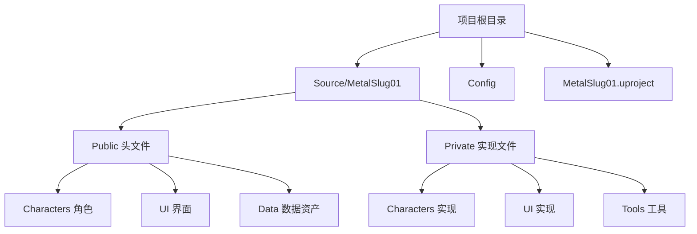
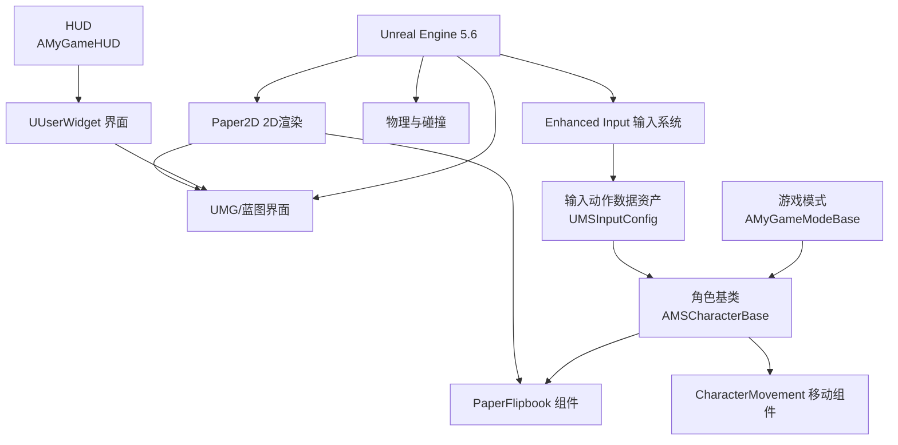
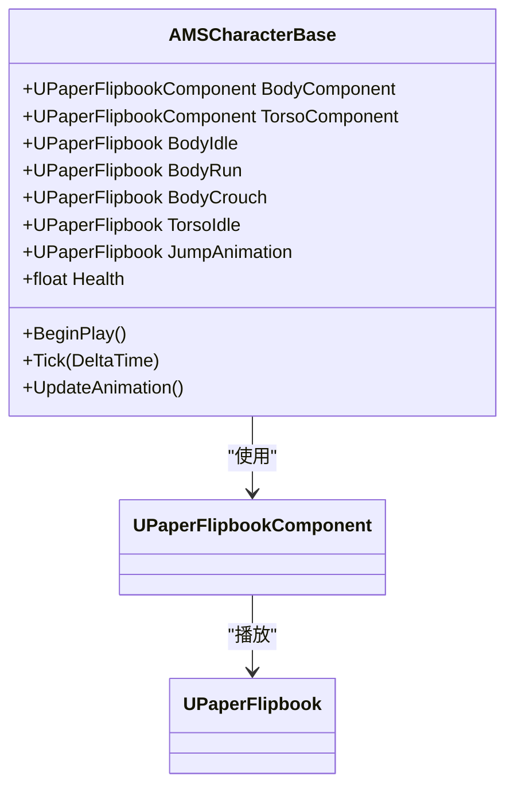
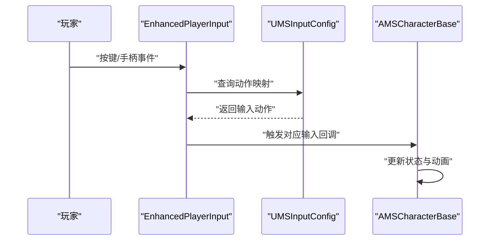
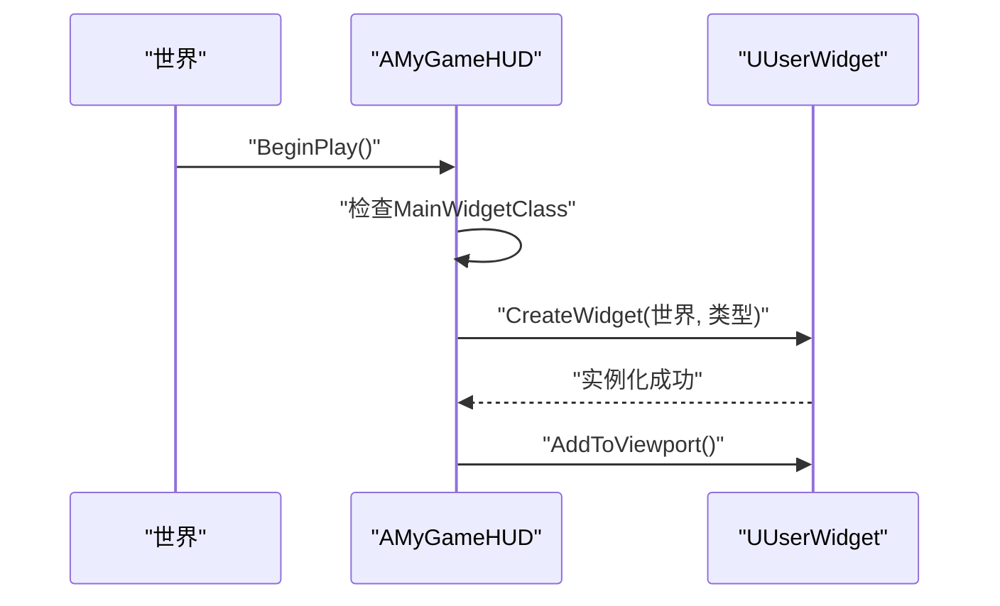
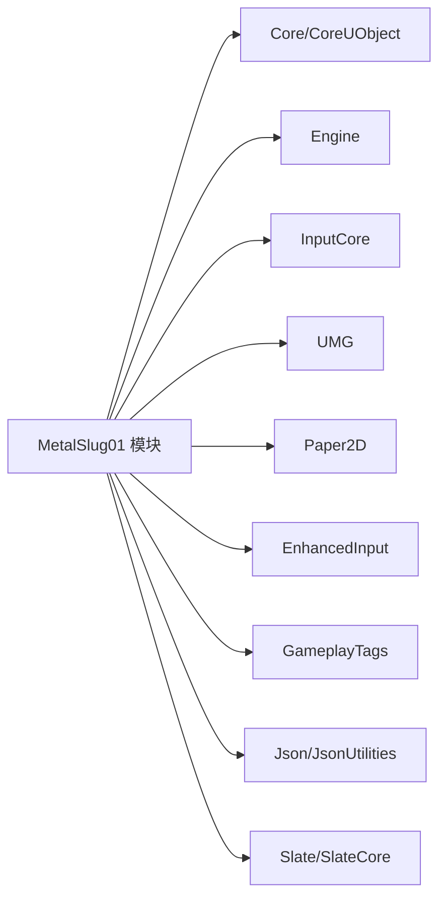

# 技术栈概览

<cite>
**本文档引用的文件**
- [MetalSlug01.h](file://MetalSlug01/Source/MetalSlug01/MetalSlug01.h)
- [MetalSlug01GameModeBase.h](file://MetalSlug01/Source/MetalSlug01/MetalSlug01GameModeBase.h)
- [DefaultEngine.ini](file://MetalSlug01/Config/DefaultEngine.ini)
- [DefaultGame.ini](file://MetalSlug01/Config/DefaultGame.ini)
- [DefaultInput.ini](file://MetalSlug01/Config/DefaultInput.ini)
- [MetalSlug01.Build.cs](file://MetalSlug01/Source/MetalSlug01/MetalSlug01.Build.cs)
- [MSCharacterBase.h](file://MetalSlug01/Source/MetalSlug01/Public/Characters/MSCharacterBase.h)
- [MSCharacterBase.cpp](file://MetalSlug01/Source/MetalSlug01/Private/Characters/MSCharacterBase.cpp)
- [MyGameHUD.h](file://MetalSlug01/Source/MetalSlug01/Public/UI/MyGameHUD.h)
- [MyGameHUD.cpp](file://MetalSlug01/Source/MetalSlug01/Private/UI/MyGameHUD.cpp)
- [MSInputConfig.h](file://MetalSlug01/Source/MetalSlug01/Public/Data/MSInputConfig.h)
- [MetalSlug01.uproject](file://MetalSlug01/MetalSlug01.uproject)
</cite>

## 目录
1. [引言](#引言)
2. [项目结构](#项目结构)
3. [核心组件](#核心组件)
4. [架构总览](#架构总览)
5. [详细组件分析](#详细组件分析)
6. [依赖分析](#依赖分析)
7. [性能考虑](#性能考虑)
8. [故障排除指南](#故障排除指南)
9. [结论](#结论)
10. [附录](#附录)

## 引言
本文件面向MetalSlug项目的技术栈进行全面概览，重点围绕以下方面展开：
- Unreal Engine 5.6作为核心引擎的技术优势与特性
- C++作为主要开发语言的选择原因与优势，并结合Blueprint可视化脚本系统
- Paper2D 2D渲染系统在精灵渲染与动画中的应用
- Enhanced Input增强输入系统与输入动作配置
- 在线功能支持（OnlineSubsystem）与相关扩展
- 插件与第三方库（如ModelingToolsEditorMode）的使用
- 各技术组件间的协作关系与技术选型理由
- 面向开发者的分阶段学习路径与参考资料

## 项目结构
项目采用Unreal Engine标准的模块化组织方式，核心运行时模块为MetalSlug01，包含源码、配置与资源。关键目录与文件如下：
- 源码层：Source/MetalSlug01（包含Public/Private头文件与实现）
- 配置层：Config（DefaultEngine.ini、DefaultGame.ini、DefaultInput.ini）
- 项目元数据：MetalSlug01.uproject（引擎版本、模块与插件声明）

图表来源
- [MetalSlug01.uproject](file://MetalSlug01/MetalSlug01.uproject#L1-L22)
- [MetalSlug01.Build.cs](file://MetalSlug01/Source/MetalSlug01/MetalSlug01.Build.cs#L1-L24)

章节来源
- [MetalSlug01.uproject](file://MetalSlug01/MetalSlug01.uproject#L1-L22)
- [MetalSlug01.Build.cs](file://MetalSlug01/Source/MetalSlug01/MetalSlug01.Build.cs#L1-L24)

## 核心组件
- 游戏模式基类：AMyGameModeBase，作为游戏逻辑入口点，继承自GameModeBase，用于控制游戏会话生命周期与规则。
- 角色基类：AMSCharacterBase，基于ACharacter，集成Paper2D Flipbook组件以实现2D精灵动画驱动；包含角色移动、蹲伏、跳跃与动画切换逻辑。
- HUD系统：AMyGameHUD，负责在游戏运行时加载并展示UUserWidget界面。
- 输入配置：UMSInputConfig，将输入动作（移动、跳跃、射击、蹲下）集中管理为可编辑的数据资产，便于策划在编辑器中配置。

章节来源
- [MetalSlug01GameModeBase.h](file://MetalSlug01/Source/MetalSlug01/MetalSlug01GameModeBase.h#L1-L17)
- [MSCharacterBase.h](file://MetalSlug01/Source/MetalSlug01/Public/Characters/MSCharacterBase.h#L1-L50)
- [MyGameHUD.h](file://MetalSlug01/Source/MetalSlug01/Public/UI/MyGameHUD.h#L1-L23)
- [MSInputConfig.h](file://MetalSlug01/Source/MetalSlug01/Public/Data/MSInputConfig.h#L1-L29)

## 架构总览
整体架构围绕“角色-输入-渲染-界面”主线展开，引擎层提供渲染、输入、物理与蓝图系统；业务层通过C++实现角色行为与状态机，通过Paper2D完成2D精灵动画；输入通过Enhanced Input统一采集与分发；UI通过UMG与HUD进行呈现。

图表来源
- [DefaultInput.ini](file://MetalSlug01/Config/DefaultInput.ini#L80-L82)
- [MSCharacterBase.h](file://MetalSlug01/Source/MetalSlug01/Public/Characters/MSCharacterBase.h#L1-L50)
- [MSCharacterBase.cpp](file://MetalSlug01/Source/MetalSlug01/Private/Characters/MSCharacterBase.cpp#L1-L64)
- [MyGameHUD.cpp](file://MetalSlug01/Source/MetalSlug01/Private/UI/MyGameHUD.cpp#L1-L19)
- [MSInputConfig.h](file://MetalSlug01/Source/MetalSlug01/Public/Data/MSInputConfig.h#L1-L29)

## 详细组件分析

### 角色系统（Paper2D + CharacterMovement）
- 组件构成：UPaperFlipbookComponent挂载于角色根组件与躯干，分别承载身体与上半身动画；UPaperFlipbook提供精灵序列播放能力。
- 行为逻辑：在Tick中根据速度、是否下落、是否蹲伏等条件切换不同动画；在BeginPlay中预设初始Idle动画，避免首帧黑屏。
- 移动约束：启用平面约束与可蹲伏导航代理属性，设置蹲伏高度与速度，保证2D平台动作的连贯性。

图表来源
- [MSCharacterBase.h](file://MetalSlug01/Source/MetalSlug01/Public/Characters/MSCharacterBase.h#L1-L50)
- [MSCharacterBase.cpp](file://MetalSlug01/Source/MetalSlug01/Private/Characters/MSCharacterBase.cpp#L1-L64)

章节来源
- [MSCharacterBase.h](file://MetalSlug01/Source/MetalSlug01/Public/Characters/MSCharacterBase.h#L1-L50)
- [MSCharacterBase.cpp](file://MetalSlug01/Source/MetalSlug01/Private/Characters/MSCharacterBase.cpp#L1-L64)

### 输入系统（Enhanced Input + Data Asset）
- 默认输入类：通过DefaultInput.ini将默认玩家输入类与输入组件类指向EnhancedInput，确保新式输入管线生效。
- 输入动作资产：UMSInputConfig将Move、Jump、Shoot、Crouch等动作集中管理，策划可在编辑器中直接绑定按键，无需改动C++。
- 协作流程：角色接收输入事件，依据当前状态与动作映射执行相应行为（移动、跳跃、射击、蹲伏）。

图表来源
- [DefaultInput.ini](file://MetalSlug01/Config/DefaultInput.ini#L80-L82)
- [MSInputConfig.h](file://MetalSlug01/Source/MetalSlug01/Public/Data/MSInputConfig.h#L1-L29)
- [MSCharacterBase.cpp](file://MetalSlug01/Source/MetalSlug01/Private/Characters/MSCharacterBase.cpp#L47-L64)

章节来源
- [DefaultInput.ini](file://MetalSlug01/Config/DefaultInput.ini#L80-L82)
- [MSInputConfig.h](file://MetalSlug01/Source/MetalSlug01/Public/Data/MSInputConfig.h#L1-L29)

### HUD与界面（UMG + HUD）
- HUD职责：在BeginPlay中根据MainWidgetClass动态创建UUserWidget并添加到视口，实现游戏内UI的统一入口。
- 协作关系：与角色系统解耦，专注于渲染与交互；可通过蓝图快速迭代界面布局与事件绑定。

图表来源
- [MyGameHUD.cpp](file://MetalSlug01/Source/MetalSlug01/Private/UI/MyGameHUD.cpp#L1-L19)
- [MyGameHUD.h](file://MetalSlug01/Source/MetalSlug01/Public/UI/MyGameHUD.h#L1-L23)

章节来源
- [MyGameHUD.cpp](file://MetalSlug01/Source/MetalSlug01/Private/UI/MyGameHUD.cpp#L1-L19)
- [MyGameHUD.h](file://MetalSlug01/Source/MetalSlug01/Public/UI/MyGameHUD.h#L1-L23)

### 渲染与图形设置（Paper2D + Engine渲染）
- Paper2D：用于2D精灵渲染与Flipbook动画播放，配合角色组件实现流畅的动作切换。
- 引擎渲染：DefaultEngine.ini启用DX12、光线追踪、阴影与全局光照等高级特性，结合硬件目标桌面端，追求高质量视觉表现。

章节来源
- [DefaultEngine.ini](file://MetalSlug01/Config/DefaultEngine.ini#L1-L58)
- [MSCharacterBase.h](file://MetalSlug01/Source/MetalSlug01/Public/Characters/MSCharacterBase.h#L1-L50)

### 在线功能与扩展（OnlineSubsystem）
- Build.cs中保留了OnlineSubsystem与OnlineSubsystemSteam的注释占位，表明未来可按需启用在线功能（如多人、存档、成就等），当前未在模块依赖中启用。

章节来源
- [MetalSlug01.Build.cs](file://MetalSlug01/Source/MetalSlug01/MetalSlug01.Build.cs#L18-L22)

### 插件与编辑器工具（ModelingToolsEditorMode）
- MetalSlug01.uproject声明启用ModelingToolsEditorMode插件，仅限编辑器目标，用于辅助地形建模与场景编辑工作流。

章节来源
- [MetalSlug01.uproject](file://MetalSlug01/MetalSlug01.uproject#L13-L21)

## 依赖分析
- 模块依赖：MetalSlug01模块显式依赖Core、CoreUObject、Engine、InputCore、UMG、Paper2D、EnhancedInput、GameplayTags、Json、JsonUtilities；私有依赖Slate/SlateCore。
- 输入管线：DefaultInput.ini将默认输入类与输入组件类指向EnhancedInput，确保输入系统现代化与可扩展。
- 渲染管线：Paper2D与引擎渲染设置共同作用，提供2D精灵与高级光照效果。

图表来源
- [MetalSlug01.Build.cs](file://MetalSlug01/Source/MetalSlug01/MetalSlug01.Build.cs#L11-L13)

章节来源
- [MetalSlug01.Build.cs](file://MetalSlug01/Source/MetalSlug01/MetalSlug01.Build.cs#L1-L24)
- [DefaultInput.ini](file://MetalSlug01/Config/DefaultInput.ini#L80-L82)

## 性能考虑
- 渲染性能：启用DX12与光线追踪、阴影与GI等特性，适合桌面端高性能硬件；建议在移动设备上按需关闭或降级。
- 动画性能：Paper2D Flipbook按需切换动画，避免不必要的重绘；角色动画切换逻辑在Tick中执行，应保持轻量计算。
- 输入性能：Enhanced Input提供高效事件分发，建议将复杂逻辑从输入回调中剥离至状态机或子系统。

## 故障排除指南
- 输入无响应：检查DefaultInput.ini中的默认输入类与输入组件类是否正确指向EnhancedInput；确认UMSInputConfig中动作已正确绑定。
- 动画不切换：检查角色组件是否正确挂载，Flipbook资产是否在BeginPlay中预设；确认UpdateAnimation逻辑覆盖了所有状态分支。
- UI不显示：确认HUD的MainWidgetClass已设置且有效；检查CreateWidget与AddToViewport调用链是否被执行。

章节来源
- [DefaultInput.ini](file://MetalSlug01/Config/DefaultInput.ini#L80-L82)
- [MSCharacterBase.cpp](file://MetalSlug01/Source/MetalSlug01/Private/Characters/MSCharacterBase.cpp#L31-L64)
- [MyGameHUD.cpp](file://MetalSlug01/Source/MetalSlug01/Private/UI/MyGameHUD.cpp#L4-L18)

## 结论
MetalSlug项目以Unreal Engine 5.6为核心，结合C++与Blueprint的混合开发模式，利用Paper2D实现高质量2D精灵动画，通过Enhanced Input构建灵活的输入体系，并以UMG与HUD完成界面呈现。项目在模块依赖、渲染设置与编辑器插件方面具备清晰规划，为后续扩展在线功能与更复杂的玩法提供了良好基础。

## 附录

### 学习路径与参考资料
- 引擎与模块
  - 官方文档：Unreal Engine 5.6核心概念与模块系统
  - 参考路径：[MetalSlug01.Build.cs](file://MetalSlug01/Source/MetalSlug01/MetalSlug01.Build.cs#L1-L24)
- 输入系统
  - Enhanced Input官方教程与最佳实践
  - 参考路径：[DefaultInput.ini](file://MetalSlug01/Config/DefaultInput.ini#L80-L82)，[MSInputConfig.h](file://MetalSlug01/Source/MetalSlug01/Public/Data/MSInputConfig.h#L1-L29)
- 2D渲染与动画
  - Paper2D使用指南与Flipbook动画
  - 参考路径：[MSCharacterBase.h](file://MetalSlug01/Source/MetalSlug01/Public/Characters/MSCharacterBase.h#L1-L50)，[MSCharacterBase.cpp](file://MetalSlug01/Source/MetalSlug01/Private/Characters/MSCharacterBase.cpp#L1-L64)
- 用户界面
  - UMG与HUD基础与实践
  - 参考路径：[MyGameHUD.h](file://MetalSlug01/Source/MetalSlug01/Public/UI/MyGameHUD.h#L1-L23)，[MyGameHUD.cpp](file://MetalSlug01/Source/MetalSlug01/Private/UI/MyGameHUD.cpp#L1-L19)
- 在线功能
  - OnlineSubsystem与Steam集成（按需启用）
  - 参考路径：[MetalSlug01.Build.cs](file://MetalSlug01/Source/MetalSlug01/MetalSlug01.Build.cs#L18-L22)
- 编辑器工具
  - ModelingToolsEditorMode插件使用
  - 参考路径：[MetalSlug01.uproject](file://MetalSlug01/MetalSlug01.uproject#L13-L21)