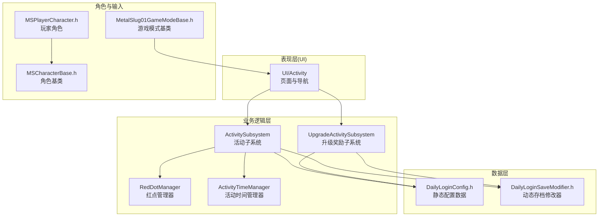
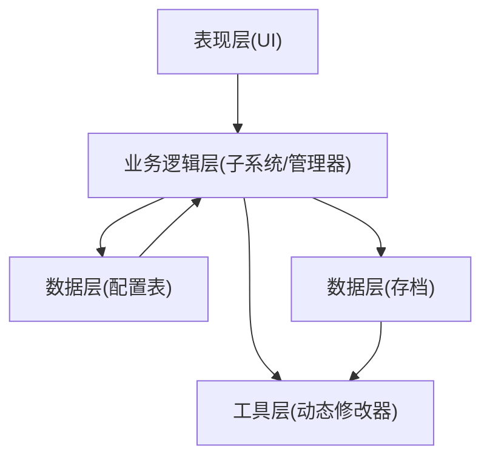
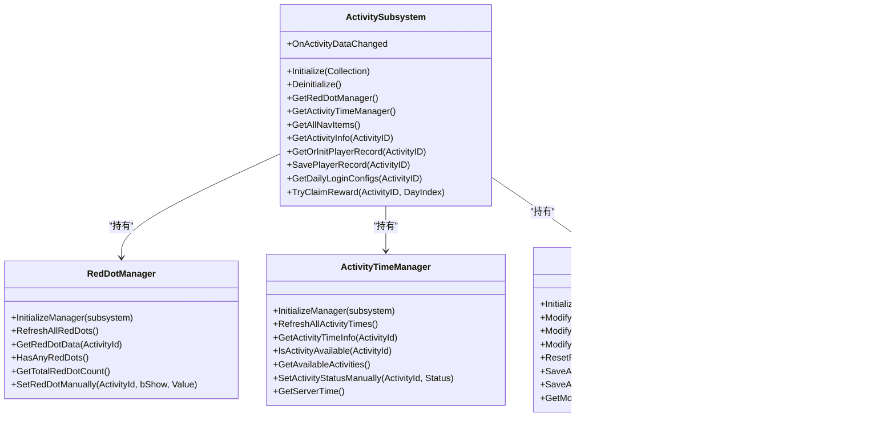
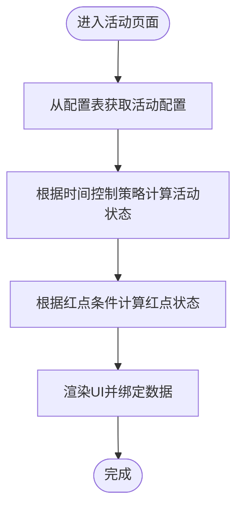
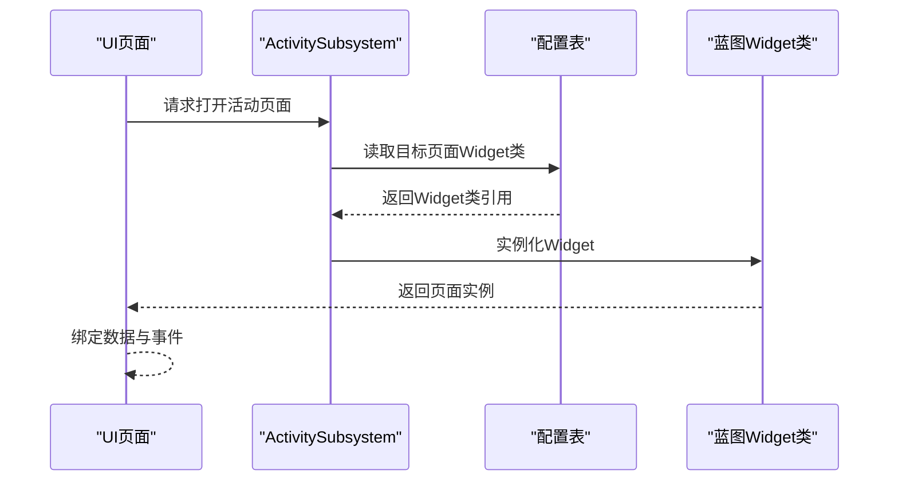
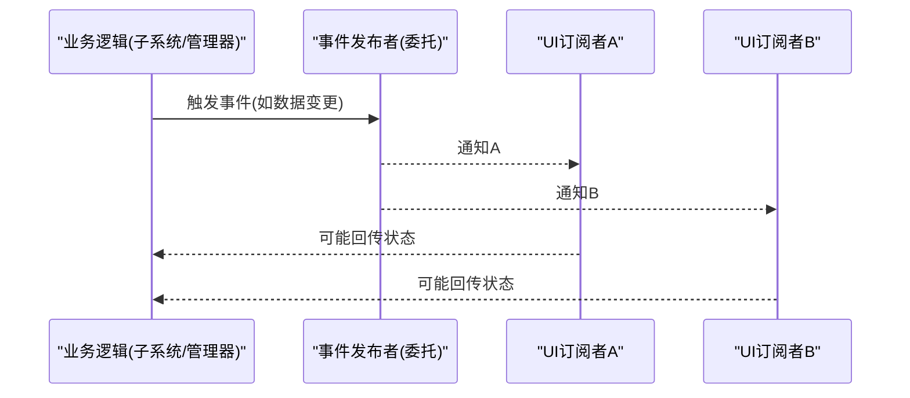
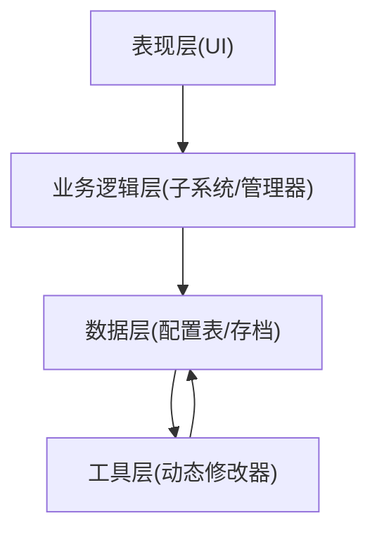
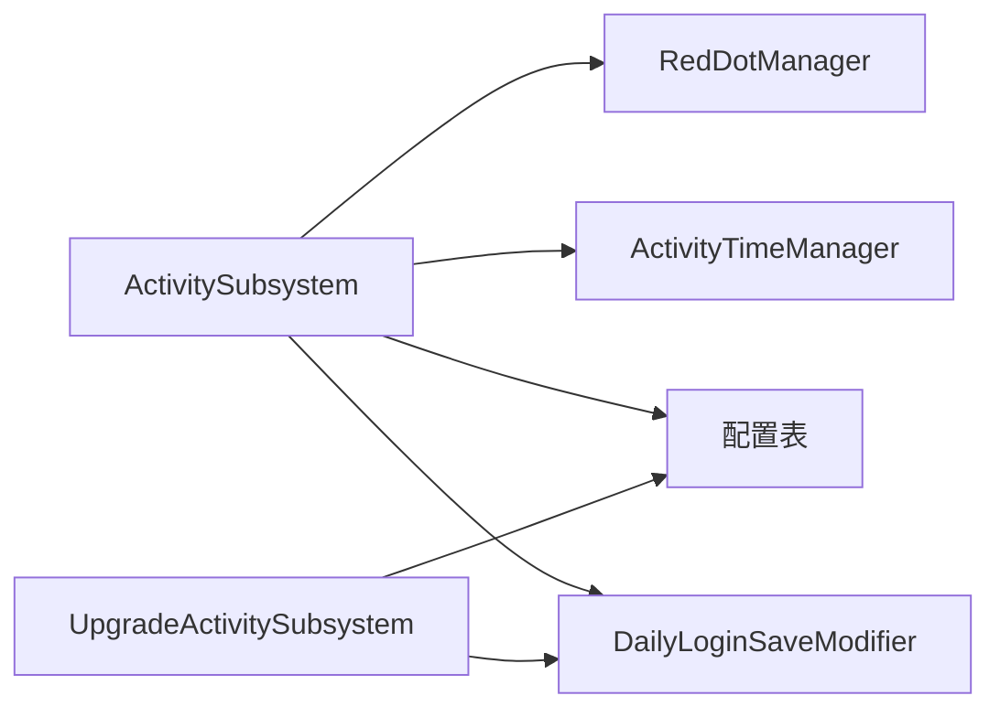
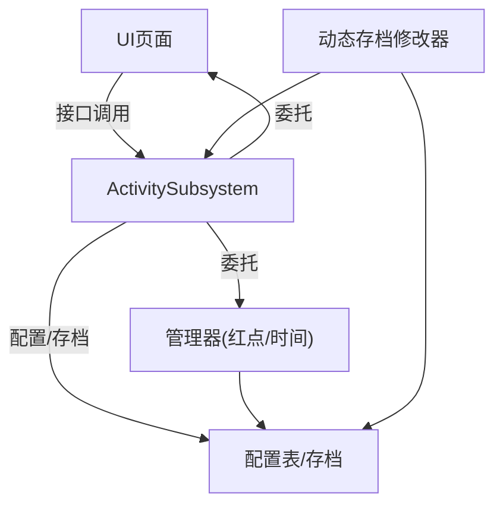

# 架构设计理念

<cite>
**本文引用的文件**
- [MetalSlug01.h](file://MetalSlug01/Source/MetalSlug01/MetalSlug01.h)
- [ActivitySubsystem.h](file://MetalSlug01/Source/MetalSlug01/Public/UI/Activity/Core/ActivitySubsystem.h)
- [RedDotManager.h](file://MetalSlug01/Source/MetalSlug01/Public/UI/Activity/Core/RedDotManager.h)
- [UpgradeActivitySubsystem.h](file://MetalSlug01/Source/MetalSlug01/Public/UI/Activity/Core/UpgradeActivitySubsystem.h)
- [DailyLoginConfig.h](file://MetalSlug01/Source/MetalSlug01/Public/UI/Activity/Data/DailyLoginConfig.h)
- [ActivityTimeManager.h](file://MetalSlug01/Source/MetalSlug01/Public/UI/Activity/Managers/ActivityTimeManager.h)
- [DailyLoginSaveModifier.h](file://MetalSlug01/Source/MetalSlug01/Public/Tools/DailyLoginSaveModifier.h)
- [MSCharacterBase.h](file://MetalSlug01/Source/MetalSlug01/Public/Characters/MSCharacterBase.h)
- [MSPlayerCharacter.h](file://MetalSlug01/Source/MetalSlug01/Public/Characters/MSPlayerCharacter.h)
- [MetalSlug01GameModeBase.h](file://MetalSlug01/Source/MetalSlug01/MetalSlug01GameModeBase.h)
</cite>

## 目录
1. [简介](#简介)
2. [项目结构](#项目结构)
3. [核心组件](#核心组件)
4. [架构总览](#架构总览)
5. [详细组件分析](#详细组件分析)
6. [依赖关系分析](#依赖关系分析)
7. [性能考量](#性能考量)
8. [故障排查指南](#故障排查指南)
9. [结论](#结论)
10. [附录](#附录)

## 简介
本文件系统化阐述 MetalSlug 项目的架构设计理念，重点围绕以下主题展开：
- 模块化与可扩展性：通过子系统（Subsystems）解耦功能模块，实现跨页面、跨功能的统一管理与复用。
- DataAsset 模式：以配置数据（静态表结构）与代码逻辑分离，提升可维护性与运营可配性。
- 工厂模式在蓝图类查找器中的应用：通过配置驱动的类映射，实现运行时动态定位与实例化。
- 观察者模式在事件委托中的实现：利用多播委托（Multicast Delegate）实现松耦合的事件通知与状态传播。
- 分层架构：表现层（UI）、业务逻辑层（子系统/管理器）、数据访问层（存档/配置表）职责清晰。
- 组件间通信与依赖管理：弱耦合的依赖注入与事件广播，确保扩展与演进的灵活性。

## 项目结构
项目采用“按功能域+层次”的组织方式：
- 表现层（UI）：位于 UI/Activity 下，包含页面、导航、弹窗等 UI 组件与页面控制器。
- 业务逻辑层（子系统/管理器）：位于 UI/Activity/Core 与 UI/Activity/Managers，负责活动管理、红点计算、时间控制等。
- 数据层（配置/存档）：位于 UI/Activity/Data 与 Tools，包含静态配置表结构与动态存档修改器。
- 角色与输入：Characters 目录下定义角色基类与玩家角色，配合输入配置与游戏模式基类。

图表来源
- [ActivitySubsystem.h](file://MetalSlug01/Source/MetalSlug01/Public/UI/Activity/Core/ActivitySubsystem.h#L1-L178)
- [UpgradeActivitySubsystem.h](file://MetalSlug01/Source/MetalSlug01/Public/UI/Activity/Core/UpgradeActivitySubsystem.h#L1-L476)
- [RedDotManager.h](file://MetalSlug01/Source/MetalSlug01/Public/UI/Activity/Core/RedDotManager.h#L1-L100)
- [ActivityTimeManager.h](file://MetalSlug01/Source/MetalSlug01/Public/UI/Activity/Managers/ActivityTimeManager.h#L1-L117)
- [DailyLoginConfig.h](file://MetalSlug01/Source/MetalSlug01/Public/UI/Activity/Data/DailyLoginConfig.h#L1-L635)
- [DailyLoginSaveModifier.h](file://MetalSlug01/Source/MetalSlug01/Public/Tools/DailyLoginSaveModifier.h#L1-L294)
- [MSCharacterBase.h](file://MetalSlug01/Source/MetalSlug01/Public/Characters/MSCharacterBase.h#L1-L50)
- [MSPlayerCharacter.h](file://MetalSlug01/Source/MetalSlug01/Public/Characters/MSPlayerCharacter.h#L1-L41)
- [MetalSlug01GameModeBase.h](file://MetalSlug01/Source/MetalSlug01/MetalSlug01GameModeBase.h#L1-L17)

章节来源
- [ActivitySubsystem.h](file://MetalSlug01/Source/MetalSlug01/Public/UI/Activity/Core/ActivitySubsystem.h#L1-L178)
- [UpgradeActivitySubsystem.h](file://MetalSlug01/Source/MetalSlug01/Public/UI/Activity/Core/UpgradeActivitySubsystem.h#L1-L476)
- [DailyLoginConfig.h](file://MetalSlug01/Source/MetalSlug01/Public/UI/Activity/Data/DailyLoginConfig.h#L1-L635)

## 核心组件
- 活动子系统（ActivitySubsystem）
  - 统一管理活动 Track 的创建、生命周期与对外访问入口；不直接做业务判断与 UI 操作，职责边界清晰。
  - 提供红点管理器与时间管理器的访问接口，以及活动配置、存档记录、奖励查询等能力。
- 升级奖励子系统（UpgradeActivitySubsystem）
  - 负责升级奖励活动的核心业务逻辑与数据操作，包括任务进度、宝箱领取、存档读写与记录处理。
  - 暴露丰富的数据访问与业务接口，封装复杂的状态计算与 UI 无关的业务判断。
- 红点管理器（RedDotManager）
  - 负责计算与管理所有活动项的红点状态，支持手动设置与汇总统计。
- 活动时间管理器（ActivityTimeManager）
  - 负责活动时间状态与生命周期的计算与缓存，支持多种时间控制策略。
- 动态存档修改器（DailyLoginSaveModifier）
  - 提供运行时修改存档数据的能力，支持进度、领取状态、批量修改与历史记录追踪。
- 静态配置数据（DailyLoginConfig）
  - 定义活动类型、状态、时间控制、红点类型、奖励类型、物品与宝箱配置等统一结构，支撑配置驱动的业务实现。

章节来源
- [ActivitySubsystem.h](file://MetalSlug01/Source/MetalSlug01/Public/UI/Activity/Core/ActivitySubsystem.h#L17-L84)
- [UpgradeActivitySubsystem.h](file://MetalSlug01/Source/MetalSlug01/Public/UI/Activity/Core/UpgradeActivitySubsystem.h#L31-L63)
- [RedDotManager.h](file://MetalSlug01/Source/MetalSlug01/Public/UI/Activity/Core/RedDotManager.h#L12-L49)
- [ActivityTimeManager.h](file://MetalSlug01/Source/MetalSlug01/Public/UI/Activity/Managers/ActivityTimeManager.h#L14-L58)
- [DailyLoginSaveModifier.h](file://MetalSlug01/Source/MetalSlug01/Public/Tools/DailyLoginSaveModifier.h#L68-L150)
- [DailyLoginConfig.h](file://MetalSlug01/Source/MetalSlug01/Public/UI/Activity/Data/DailyLoginConfig.h#L19-L139)

## 架构总览
MetalSlug 采用“子系统 + 管理器 + 配置数据 + 存档修改器”的分层架构：
- 表现层（UI）仅负责渲染与交互，通过子系统/管理器提供的稳定接口获取数据与触发业务。
- 业务逻辑层（子系统/管理器）集中处理业务规则与状态计算，避免 UI 侧逻辑分散。
- 数据层（配置表/存档）与工具层（修改器）提供可配置与可运维能力，降低硬编码风险。

图表来源
- [ActivitySubsystem.h](file://MetalSlug01/Source/MetalSlug01/Public/UI/Activity/Core/ActivitySubsystem.h#L30-L38)
- [UpgradeActivitySubsystem.h](file://MetalSlug01/Source/MetalSlug01/Public/UI/Activity/Core/UpgradeActivitySubsystem.h#L35-L62)
- [DailyLoginConfig.h](file://MetalSlug01/Source/MetalSlug01/Public/UI/Activity/Data/DailyLoginConfig.h#L1-L635)
- [DailyLoginSaveModifier.h](file://MetalSlug01/Source/MetalSlug01/Public/Tools/DailyLoginSaveModifier.h#L72-L93)

## 详细组件分析

### 子系统模式：ActivitySubsystem 与 UpgradeActivitySubsystem
- 设计要点
  - 以 GameInstance 子系统为根，统一生命周期（Initialize/Deinitialize），便于跨模块共享与依赖注入。
  - 将“业务逻辑”与“UI 控制”解耦：子系统只暴露稳定的接口，UI 通过接口访问数据与触发业务，不直接依赖具体实现。
  - 通过管理器（红点、时间）与配置/存档的协作，形成“配置驱动 + 运行时状态”的双轨数据流。
- 事件与委托
  - 使用多播委托（如活动数据变更事件）实现松耦合的通知机制，UI 可订阅而不需感知具体触发源。
- 工具集成
  - 通过动态存档修改器提供运行时调试与运维能力，支持进度修改、批量领取、历史记录等。

图表来源
- [ActivitySubsystem.h](file://MetalSlug01/Source/MetalSlug01/Public/UI/Activity/Core/ActivitySubsystem.h#L29-L175)
- [UpgradeActivitySubsystem.h](file://MetalSlug01/Source/MetalSlug01/Public/UI/Activity/Core/UpgradeActivitySubsystem.h#L35-L424)
- [RedDotManager.h](file://MetalSlug01/Source/MetalSlug01/Public/UI/Activity/Core/RedDotManager.h#L16-L99)
- [ActivityTimeManager.h](file://MetalSlug01/Source/MetalSlug01/Public/UI/Activity/Managers/ActivityTimeManager.h#L18-L116)
- [DailyLoginSaveModifier.h](file://MetalSlug01/Source/MetalSlug01/Public/Tools/DailyLoginSaveModifier.h#L72-L294)

章节来源
- [ActivitySubsystem.h](file://MetalSlug01/Source/MetalSlug01/Public/UI/Activity/Core/ActivitySubsystem.h#L17-L84)
- [UpgradeActivitySubsystem.h](file://MetalSlug01/Source/MetalSlug01/Public/UI/Activity/Core/UpgradeActivitySubsystem.h#L31-L63)
- [RedDotManager.h](file://MetalSlug01/Source/MetalSlug01/Public/UI/Activity/Core/RedDotManager.h#L12-L49)
- [ActivityTimeManager.h](file://MetalSlug01/Source/MetalSlug01/Public/UI/Activity/Managers/ActivityTimeManager.h#L14-L58)
- [DailyLoginSaveModifier.h](file://MetalSlug01/Source/MetalSlug01/Public/Tools/DailyLoginSaveModifier.h#L68-L150)

### DataAsset 模式：配置数据与代码逻辑分离
- 静态配置集中管理
  - 活动类型、状态、时间控制、红点类型、奖励类型、物品与宝箱配置等均定义在统一的头文件中，便于运营与策划通过编辑器调整。
- 配置驱动的 UI 与业务
  - UI 通过子系统提供的接口查询配置与运行时状态，业务逻辑通过配置表进行分支与展示控制，减少硬编码。
- 数据结构职责单一
  - 通过结构体与枚举的组合，确保每类配置的职责边界清晰，易于扩展与维护。

图表来源
- [DailyLoginConfig.h](file://MetalSlug01/Source/MetalSlug01/Public/UI/Activity/Data/DailyLoginConfig.h#L19-L139)
- [ActivityTimeManager.h](file://MetalSlug01/Source/MetalSlug01/Public/UI/Activity/Managers/ActivityTimeManager.h#L92-L116)
- [RedDotManager.h](file://MetalSlug01/Source/MetalSlug01/Public/UI/Activity/Core/RedDotManager.h#L86-L99)

章节来源
- [DailyLoginConfig.h](file://MetalSlug01/Source/MetalSlug01/Public/UI/Activity/Data/DailyLoginConfig.h#L1-L635)

### 工厂模式在蓝图类查找器中的应用
- 蓝图类映射与查找
  - 配置表中包含目标页面 Widget 类型字段，子系统通过该字段进行蓝图类查找与实例化，实现“配置驱动”的页面路由。
- 松耦合的页面装配
  - UI 页面与业务逻辑通过接口解耦，页面类的变更不影响业务层，仅需调整配置即可切换页面类型。

图表来源
- [DailyLoginConfig.h](file://MetalSlug01/Source/MetalSlug01/Public/UI/Activity/Data/DailyLoginConfig.h#L347-L360)
- [ActivitySubsystem.h](file://MetalSlug01/Source/MetalSlug01/Public/UI/Activity/Core/ActivitySubsystem.h#L49-L56)

章节来源
- [DailyLoginConfig.h](file://MetalSlug01/Source/MetalSlug01/Public/UI/Activity/Data/DailyLoginConfig.h#L347-L360)
- [ActivitySubsystem.h](file://MetalSlug01/Source/MetalSlug01/Public/UI/Activity/Core/ActivitySubsystem.h#L49-L56)

### 观察者模式在事件委托中的实现
- 多播委托（Multicast Delegate）
  - 子系统与管理器通过委托对外发布事件（如活动数据变更、奖励图标索引变化、全局刷新），UI 订阅后自动响应。
- 松耦合与可扩展
  - UI 可以按需订阅多个事件，新增事件类型无需改动现有订阅方，便于功能扩展。

图表来源
- [ActivitySubsystem.h](file://MetalSlug01/Source/MetalSlug01/Public/UI/Activity/Core/ActivitySubsystem.h#L149-L152)
- [UpgradeActivitySubsystem.h](file://MetalSlug01/Source/MetalSlug01/Public/UI/Activity/Core/UpgradeActivitySubsystem.h#L43-L49)

章节来源
- [ActivitySubsystem.h](file://MetalSlug01/Source/MetalSlug01/Public/UI/Activity/Core/ActivitySubsystem.h#L149-L152)
- [UpgradeActivitySubsystem.h](file://MetalSlug01/Source/MetalSlug01/Public/UI/Activity/Core/UpgradeActivitySubsystem.h#L43-L49)

### 分层架构设计
- 表现层（UI）
  - 负责渲染与交互，通过稳定的接口访问业务数据与触发业务。
- 业务逻辑层（子系统/管理器）
  - 负责业务规则、状态计算与事件发布，保持 UI 无关。
- 数据访问层（配置表/存档）
  - 提供静态配置与动态存档，支持运行时修改与历史追踪。

图表来源
- [ActivitySubsystem.h](file://MetalSlug01/Source/MetalSlug01/Public/UI/Activity/Core/ActivitySubsystem.h#L30-L38)
- [UpgradeActivitySubsystem.h](file://MetalSlug01/Source/MetalSlug01/Public/UI/Activity/Core/UpgradeActivitySubsystem.h#L35-L62)
- [DailyLoginSaveModifier.h](file://MetalSlug01/Source/MetalSlug01/Public/Tools/DailyLoginSaveModifier.h#L72-L93)

章节来源
- [ActivitySubsystem.h](file://MetalSlug01/Source/MetalSlug01/Public/UI/Activity/Core/ActivitySubsystem.h#L30-L38)
- [UpgradeActivitySubsystem.h](file://MetalSlug01/Source/MetalSlug01/Public/UI/Activity/Core/UpgradeActivitySubsystem.h#L35-L62)
- [DailyLoginSaveModifier.h](file://MetalSlug01/Source/MetalSlug01/Public/Tools/DailyLoginSaveModifier.h#L72-L93)

### 组件间通信与依赖关系管理
- 依赖注入
  - 子系统通过管理器接口持有红点与时间管理器，避免直接依赖具体实现。
- 事件驱动
  - 通过委托实现跨模块事件传播，UI 与业务模块均可订阅与响应。
- 配置驱动
  - 通过配置表字段决定页面类型与行为，降低耦合度，便于快速迭代。

图表来源
- [ActivitySubsystem.h](file://MetalSlug01/Source/MetalSlug01/Public/UI/Activity/Core/ActivitySubsystem.h#L159-L174)
- [UpgradeActivitySubsystem.h](file://MetalSlug01/Source/MetalSlug01/Public/UI/Activity/Core/UpgradeActivitySubsystem.h#L421-L423)
- [DailyLoginConfig.h](file://MetalSlug01/Source/MetalSlug01/Public/UI/Activity/Data/DailyLoginConfig.h#L347-L360)

章节来源
- [ActivitySubsystem.h](file://MetalSlug01/Source/MetalSlug01/Public/UI/Activity/Core/ActivitySubsystem.h#L159-L174)
- [UpgradeActivitySubsystem.h](file://MetalSlug01/Source/MetalSlug01/Public/UI/Activity/Core/UpgradeActivitySubsystem.h#L421-L423)
- [DailyLoginConfig.h](file://MetalSlug01/Source/MetalSlug01/Public/UI/Activity/Data/DailyLoginConfig.h#L347-L360)

## 依赖关系分析
- 组件耦合与内聚
  - 子系统与管理器之间为弱耦合（通过接口与委托），内聚于各自职责范围。
  - UI 与业务逻辑通过接口解耦，遵循“UI 不做业务判断”的约定。
- 外部依赖与集成点
  - 配置表与存档修改器构成数据访问层，为业务逻辑提供稳定的数据来源。
  - 动态存档修改器支持运行时调试与运维，是重要的外部集成点。
- 潜在循环依赖
  - 通过接口与委托避免直接循环引用；管理器与子系统之间通过弱引用与延迟初始化降低耦合。

图表来源
- [ActivitySubsystem.h](file://MetalSlug01/Source/MetalSlug01/Public/UI/Activity/Core/ActivitySubsystem.h#L43-L56)
- [RedDotManager.h](file://MetalSlug01/Source/MetalSlug01/Public/UI/Activity/Core/RedDotManager.h#L26-L41)
- [ActivityTimeManager.h](file://MetalSlug01/Source/MetalSlug01/Public/UI/Activity/Managers/ActivityTimeManager.h#L28-L43)
- [DailyLoginSaveModifier.h](file://MetalSlug01/Source/MetalSlug01/Public/Tools/DailyLoginSaveModifier.h#L85-L149)

章节来源
- [ActivitySubsystem.h](file://MetalSlug01/Source/MetalSlug01/Public/UI/Activity/Core/ActivitySubsystem.h#L43-L56)
- [RedDotManager.h](file://MetalSlug01/Source/MetalSlug01/Public/UI/Activity/Core/RedDotManager.h#L26-L41)
- [ActivityTimeManager.h](file://MetalSlug01/Source/MetalSlug01/Public/UI/Activity/Managers/ActivityTimeManager.h#L28-L43)
- [DailyLoginSaveModifier.h](file://MetalSlug01/Source/MetalSlug01/Public/Tools/DailyLoginSaveModifier.h#L85-L149)

## 性能考量
- 缓存策略
  - 红点与时间管理器对计算结果进行缓存，结合刷新间隔控制，减少重复计算开销。
- 委托与事件
  - 事件广播仅在订阅者存在时产生开销，建议按需订阅，避免过度广播。
- 配置表访问
  - 通过弱引用与延迟初始化减少不必要的资源加载；对频繁访问的配置进行本地缓存。
- 存档修改
  - 动态修改器支持批量修改与自动保存，建议在批量操作时关闭自动保存，在完成后一次性保存，降低 I/O 压力。

## 故障排查指南
- 红点与时间异常
  - 检查时间管理器的刷新间隔与缓存时间，确认活动状态计算逻辑是否正确。
  - 使用红点管理器的手动设置接口进行快速验证。
- 存档修改无效
  - 确认动态存档修改器已初始化并持有正确的世界上下文对象。
  - 检查修改历史记录与保存状态，确认是否触发了保存流程。
- 页面路由错误
  - 核对配置表中的目标页面 Widget 类型字段，确保蓝图类存在且可实例化。

章节来源
- [ActivityTimeManager.h](file://MetalSlug01/Source/MetalSlug01/Public/UI/Activity/Managers/ActivityTimeManager.h#L88-L90)
- [RedDotManager.h](file://MetalSlug01/Source/MetalSlug01/Public/UI/Activity/Core/RedDotManager.h#L63-L64)
- [DailyLoginSaveModifier.h](file://MetalSlug01/Source/MetalSlug01/Public/Tools/DailyLoginSaveModifier.h#L281-L282)
- [DailyLoginConfig.h](file://MetalSlug01/Source/MetalSlug01/Public/UI/Activity/Data/DailyLoginConfig.h#L347-L360)

## 结论
MetalSlug 的架构以“子系统 + 管理器 + 配置数据 + 存档修改器”为核心，实现了表现层与业务逻辑的解耦、配置与代码的分离、以及事件驱动的松耦合通信。该设计在保证可维护性的同时，提供了良好的可扩展性与可运维性，适合持续迭代与功能扩展。

## 附录
- 开发者指导原则
  - 遵循“子系统不直接做业务判断、不直接操作 UI”的约定，将业务逻辑下沉至子系统或管理器。
  - 使用委托进行事件通知，UI 与业务模块按需订阅，避免强耦合。
  - 通过配置表驱动 UI 与行为，减少硬编码，提升运营效率。
  - 在需要运行时调试与运维时，优先使用动态存档修改器，确保安全与可追溯。
- 技术权衡
  - 配置驱动带来灵活性，但需注意配置一致性与版本兼容；建议引入配置校验与迁移机制。
  - 委托广播提升扩展性，但需控制订阅范围与频率，避免性能问题。
  - 存档修改器提供强大运维能力，需严格限制权限与审计日志，防止误操作。