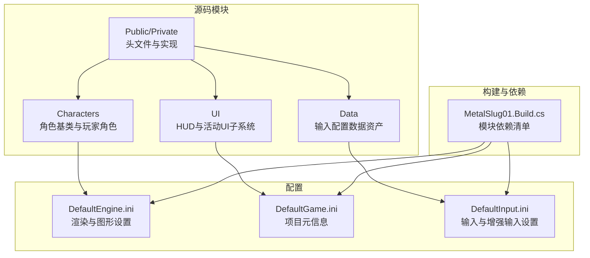
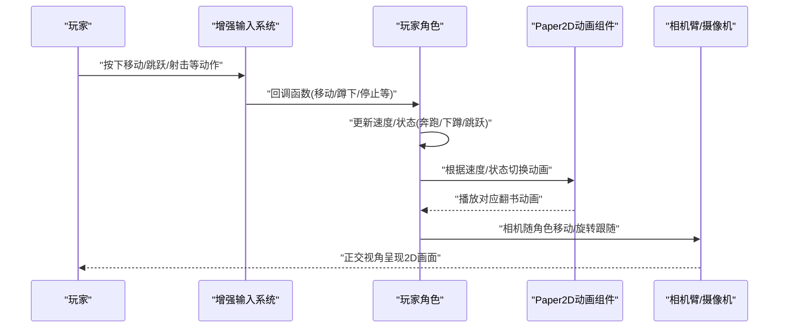
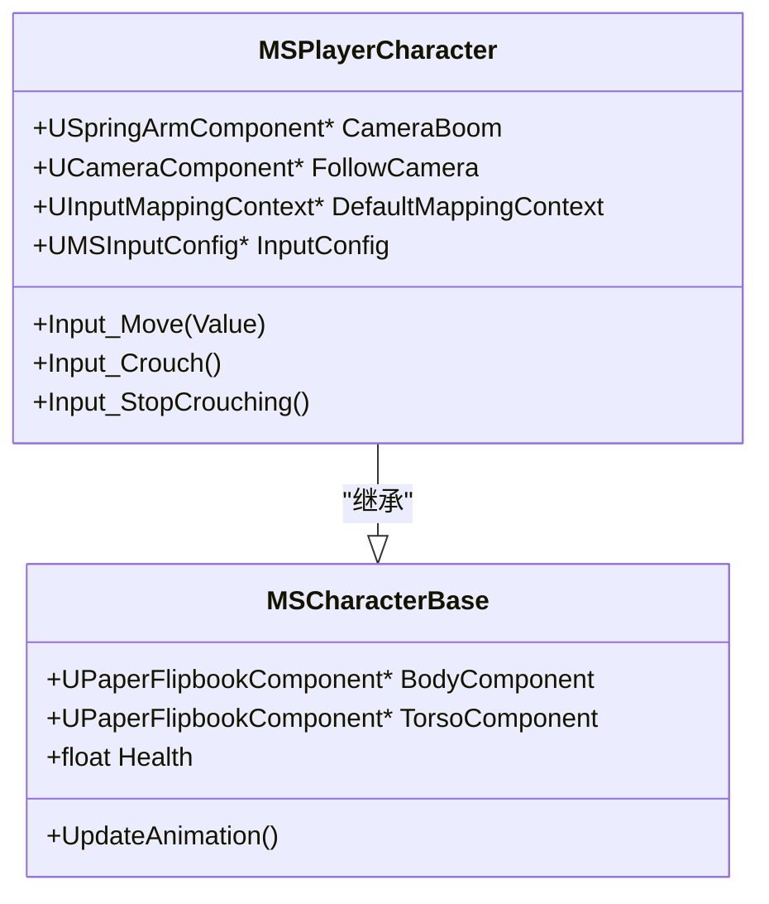
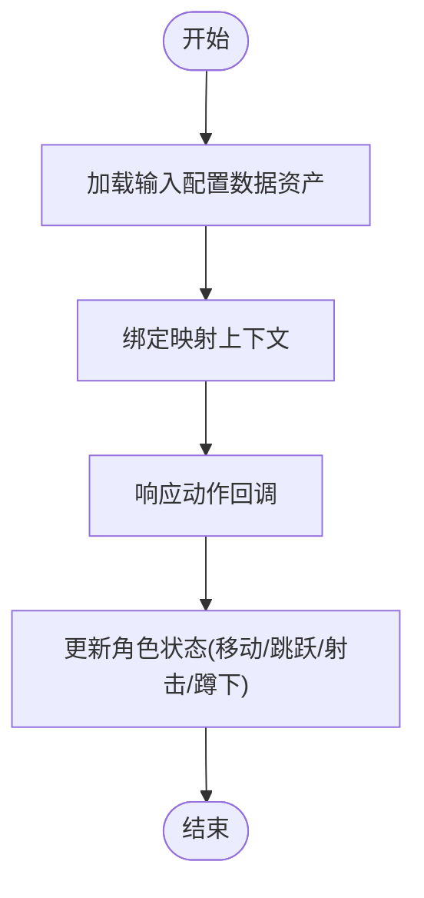
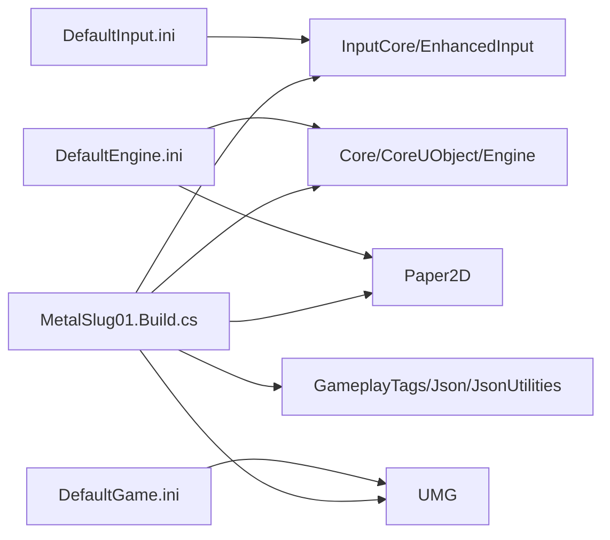

# 项目介绍

<cite>
**本文引用的文件**
- [MetalSlug01.h](file://MetalSlug01/Source/MetalSlug01/MetalSlug01.h)
- [MetalSlug01GameModeBase.h](file://MetalSlug01/Source/MetalSlug01/MetalSlug01GameModeBase.h)
- [MSCharacterBase.h](file://MetalSlug01/Source/MetalSlug01/Public/Characters/MSCharacterBase.h)
- [MSPlayerCharacter.h](file://MetalSlug01/Source/MetalSlug01/Public/Characters/MSPlayerCharacter.h)
- [MSCharacterBase.cpp](file://MetalSlug01/Source/MetalSlug01/Private/Characters/MSCharacterBase.cpp)
- [MSPlayerCharacter.cpp](file://MetalSlug01/Source/MetalSlug01/Private/Characters/MSPlayerCharacter.cpp)
- [MyGameHUD.h](file://MetalSlug01/Source/MetalSlug01/Public/UI/MyGameHUD.h)
- [MSInputConfig.h](file://MetalSlug01/Source/MetalSlug01/Public/Data/MSInputConfig.h)
- [DefaultEngine.ini](file://MetalSlug01/Config/DefaultEngine.ini)
- [DefaultGame.ini](file://MetalSlug01/Config/DefaultGame.ini)
- [DefaultInput.ini](file://MetalSlug01/Config/DefaultInput.ini)
- [MetalSlug01.Build.cs](file://MetalSlug01/Source/MetalSlug01/MetalSlug01.Build.cs)
- [UpgradeActivitySaveModifier_Readme.md](file://UpgradeActivitySaveModifier_Readme.md)
</cite>

## 目录
1. [简介](#简介)
2. [项目结构](#项目结构)
3. [核心组件](#核心组件)
4. [架构总览](#架构总览)
5. [详细组件分析](#详细组件分析)
6. [依赖关系分析](#依赖关系分析)
7. [性能考量](#性能考量)
8. [故障排查指南](#故障排查指南)
9. [结论](#结论)
10. [附录](#附录)

## 简介
本项目是一个基于Unreal Engine 5.6开发的2D平台动作游戏，采用C++与Blueprint混合开发模式，围绕“MetalSlug”风格的快节奏射击与平台跳跃体验展开。项目以Paper2D翻书动画系统为核心渲染方案，结合SpringArm相机跟随与增强输入系统（Enhanced Input），提供流畅且可扩展的角色控制与视觉表现。同时，项目内嵌一套完整的活动系统与UI框架，便于后续扩展日常登录、升级奖励、限时活动等玩法模块。

项目定位清晰：面向希望在Unreal Engine 5.6上快速搭建2D平台动作类游戏的团队与个人开发者，强调“即插即用”的角色动画管线、稳定的输入映射机制与可维护的UI子系统。

## 项目结构
项目采用按功能域分层的目录组织方式：
- Source/MetalSlug01：核心C++模块，包含角色、UI、数据资产与游戏模式基类
- Config：引擎与项目配置，涵盖渲染、输入、地图等
- 资产与蓝图：通过蓝图扩展UI与玩法逻辑（例如活动页、导航菜单等）

图表来源
- [MSCharacterBase.h](file://MetalSlug01/Source/MetalSlug01/Public/Characters/MSCharacterBase.h#L1-L50)
- [MSPlayerCharacter.h](file://MetalSlug01/Source/MetalSlug01/Public/Characters/MSPlayerCharacter.h#L1-L41)
- [MyGameHUD.h](file://MetalSlug01/Source/MetalSlug01/Public/UI/MyGameHUD.h#L1-L23)
- [MSInputConfig.h](file://MetalSlug01/Source/MetalSlug01/Public/Data/MSInputConfig.h#L1-L29)
- [DefaultEngine.ini](file://MetalSlug01/Config/DefaultEngine.ini#L1-L58)
- [DefaultGame.ini](file://MetalSlug01/Config/DefaultGame.ini#L1-L6)
- [DefaultInput.ini](file://MetalSlug01/Config/DefaultInput.ini#L1-L86)
- [MetalSlug01.Build.cs](file://MetalSlug01/Source/MetalSlug01/MetalSlug01.Build.cs#L1-L24)

章节来源
- [MetalSlug01.h](file://MetalSlug01/Source/MetalSlug01/MetalSlug01.h#L1-L10)
- [MetalSlug01GameModeBase.h](file://MetalSlug01/Source/MetalSlug01/MetalSlug01GameModeBase.h#L1-L17)
- [DefaultEngine.ini](file://MetalSlug01/Config/DefaultEngine.ini#L1-L58)
- [DefaultGame.ini](file://MetalSlug01/Config/DefaultGame.ini#L1-L6)
- [DefaultInput.ini](file://MetalSlug01/Config/DefaultInput.ini#L1-L86)
- [MetalSlug01.Build.cs](file://MetalSlug01/Source/MetalSlug01/MetalSlug01.Build.cs#L1-L24)

## 核心组件
- 角色系统
  - 基类角色：负责Paper2D翻书动画驱动、角色移动约束与动画切换逻辑
  - 玩家角色：集成SpringArm相机臂与正交摄像机，绑定增强输入映射上下文与输入配置数据资产
- UI系统
  - HUD：统一管理主界面Widget加载与生命周期
  - 活动UI：包含导航菜单、日常登录、升级奖励、弹窗等模块化页面
- 输入系统
  - 增强输入：通过MappingContext与InputConfig数据资产集中管理动作映射，便于策划在编辑器中调整
- 渲染与相机
  - Paper2D翻书动画：角色身体与躯干分别挂载独立动画组件，支持Idle/Run/Crouch/Jump等状态切换
  - SpringArm相机：固定角度与长度，配合正交投影，适配2D平台动作的视觉需求

章节来源
- [MSCharacterBase.h](file://MetalSlug01/Source/MetalSlug01/Public/Characters/MSCharacterBase.h#L1-L50)
- [MSPlayerCharacter.h](file://MetalSlug01/Source/MetalSlug01/Public/Characters/MSPlayerCharacter.h#L1-L41)
- [MyGameHUD.h](file://MetalSlug01/Source/MetalSlug01/Public/UI/MyGameHUD.h#L1-L23)
- [MSInputConfig.h](file://MetalSlug01/Source/MetalSlug01/Public/Data/MSInputConfig.h#L1-L29)

## 架构总览
下图展示了从输入到动画与相机的整体交互路径，体现“增强输入 → 角色控制 → 动画切换 → 相机跟随”的关键流程。

图表来源
- [MSPlayerCharacter.cpp](file://MetalSlug01/Source/MetalSlug01/Private/Characters/MSPlayerCharacter.cpp#L1-L32)
- [MSCharacterBase.cpp](file://MetalSlug01/Source/MetalSlug01/Private/Characters/MSCharacterBase.cpp#L1-L64)
- [MSPlayerCharacter.h](file://MetalSlug01/Source/MetalSlug01/Public/Characters/MSPlayerCharacter.h#L1-L41)
- [MSCharacterBase.h](file://MetalSlug01/Source/MetalSlug01/Public/Characters/MSCharacterBase.h#L1-L50)

## 详细组件分析

### 角色基类与玩家角色
- 角色基类
  - 负责初始化Paper2D翻书组件（身体/躯干）、设置角色移动平面约束、在首帧强制赋动画避免黑屏
  - 在Tick中驱动动画更新，依据速度/状态切换Idle/Run/Crouch/Jump动画
- 玩家角色
  - 初始化SpringArm相机臂与正交摄像机，设置固定角度与宽度
  - 绑定增强输入映射上下文与输入配置数据资产，确保输入行为可编辑器配置
  - 强制接收玩家输入，保证按键响应稳定

图表来源
- [MSCharacterBase.h](file://MetalSlug01/Source/MetalSlug01/Public/Characters/MSCharacterBase.h#L1-L50)
- [MSPlayerCharacter.h](file://MetalSlug01/Source/MetalSlug01/Public/Characters/MSPlayerCharacter.h#L1-L41)

章节来源
- [MSCharacterBase.h](file://MetalSlug01/Source/MetalSlug01/Public/Characters/MSCharacterBase.h#L1-L50)
- [MSCharacterBase.cpp](file://MetalSlug01/Source/MetalSlug01/Private/Characters/MSCharacterBase.cpp#L1-L64)
- [MSPlayerCharacter.h](file://MetalSlug01/Source/MetalSlug01/Public/Characters/MSPlayerCharacter.h#L1-L41)
- [MSPlayerCharacter.cpp](file://MetalSlug01/Source/MetalSlug01/Private/Characters/MSPlayerCharacter.cpp#L1-L32)

### 输入系统与增强输入
- 输入配置数据资产
  - 将移动、跳跃、射击、蹲下等动作集中定义于数据资产中，便于非程序员在编辑器中直接调整
- 增强输入设置
  - 默认输入类与输入组件类指向增强输入实现，确保跨平台输入一致性与可扩展性
  - 支持多种手柄与鼠标轴配置，满足2D平台游戏的输入需求

图表来源
- [MSInputConfig.h](file://MetalSlug01/Source/MetalSlug01/Public/Data/MSInputConfig.h#L1-L29)
- [DefaultInput.ini](file://MetalSlug01/Config/DefaultInput.ini#L80-L85)

章节来源
- [MSInputConfig.h](file://MetalSlug01/Source/MetalSlug01/Public/Data/MSInputConfig.h#L1-L29)
- [DefaultInput.ini](file://MetalSlug01/Config/DefaultInput.ini#L1-L86)

### HUD与UI系统
- HUD
  - 负责加载主Widget类并在游戏开始时初始化
- 活动UI
  - 提供导航菜单、日常登录、升级奖励、弹窗等页面，采用模块化设计，便于扩展

章节来源
- [MyGameHUD.h](file://MetalSlug01/Source/MetalSlug01/Public/UI/MyGameHUD.h#L1-L23)

### 渲染与相机系统
- Paper2D翻书动画
  - 身体与躯干分别挂载独立动画组件，支持多状态动画切换，提升角色表现力
- SpringArm相机
  - 固定角度与长度，配合正交投影，确保2D平台动作的稳定视角与缩放

章节来源
- [MSCharacterBase.cpp](file://MetalSlug01/Source/MetalSlug01/Private/Characters/MSCharacterBase.cpp#L1-L64)
- [MSPlayerCharacter.cpp](file://MetalSlug01/Source/MetalSlug01/Private/Characters/MSPlayerCharacter.cpp#L1-L32)

## 依赖关系分析
- 模块依赖
  - 核心依赖：Core/CoreUObject/Engine/InputCore/UMG/Paper2D/EnhancedInput/GameplayTags/Json/JsonUtilities
  - 用于支持UI、2D渲染、输入、数据持久化与活动系统
- 配置依赖
  - DefaultEngine.ini：渲染与图形性能设置
  - DefaultInput.ini：增强输入类与轴配置
  - DefaultGame.ini：项目元信息与通用UI设置

图表来源
- [MetalSlug01.Build.cs](file://MetalSlug01/Source/MetalSlug01/MetalSlug01.Build.cs#L1-L24)
- [DefaultEngine.ini](file://MetalSlug01/Config/DefaultEngine.ini#L1-L58)
- [DefaultInput.ini](file://MetalSlug01/Config/DefaultInput.ini#L1-L86)
- [DefaultGame.ini](file://MetalSlug01/Config/DefaultGame.ini#L1-L6)

章节来源
- [MetalSlug01.Build.cs](file://MetalSlug01/Source/MetalSlug01/MetalSlug01.Build.cs#L1-L24)
- [DefaultEngine.ini](file://MetalSlug01/Config/DefaultEngine.ini#L1-L58)
- [DefaultInput.ini](file://MetalSlug01/Config/DefaultInput.ini#L1-L86)
- [DefaultGame.ini](file://MetalSlug01/Config/DefaultGame.ini#L1-L6)

## 性能考量
- 2D正交投影与固定相机臂参数有助于降低渲染复杂度，适合平台动作类游戏的性能优化
- Paper2D翻书动画在角色组件层面拆分（身体/躯干）可减少动画切换抖动，提高视觉稳定性
- 增强输入系统减少重复绑定与回调开销，利于跨平台一致的输入处理

## 故障排查指南
- 按键无响应
  - 确认玩家角色已启用自动接收输入
  - 检查输入映射上下文与输入配置数据资产是否正确绑定
- 动画不切换
  - 确保角色移动组件已启用平面约束，且速度阈值设置合理
  - 检查翻书动画资源是否正确赋给对应状态槽位
- 相机视角异常
  - 检查相机臂长度与角度设置，确认正交投影宽度符合预期
- 活动系统调试
  - 可使用控制台命令对活动数据进行设置与重置，验证UI刷新与事件广播

章节来源
- [MSPlayerCharacter.cpp](file://MetalSlug01/Source/MetalSlug01/Private/Characters/MSPlayerCharacter.cpp#L1-L32)
- [MSCharacterBase.cpp](file://MetalSlug01/Source/MetalSlug01/Private/Characters/MSCharacterBase.cpp#L1-L64)
- [UpgradeActivitySaveModifier_Readme.md](file://UpgradeActivitySaveModifier_Readme.md#L1-L189)

## 结论
本项目以Unreal Engine 5.6为基础，结合Paper2D翻书动画、SpringArm相机与增强输入系统，构建了面向2D平台动作游戏的高效开发框架。通过C++与Blueprint混合开发，既保证了底层性能与可维护性，又提供了编辑器友好、易于扩展的玩法与UI能力。项目适合希望快速落地“MetalSlug”风格动作平台游戏的团队，亦可作为学习2D动作游戏开发的参考范例。

## 附录
- 开发背景与设计理念
  - 选择Unreal Engine 5.6的原因：强大的2D渲染能力、成熟的输入系统与蓝图生态
  - 设计理念：以数据资产驱动输入与活动系统，以模块化UI支撑快速迭代
- 应用场景与目标用户
  - 场景：移动端与PC端的2D平台动作游戏
  - 用户：独立开发者、小型工作室、教学与演示用途