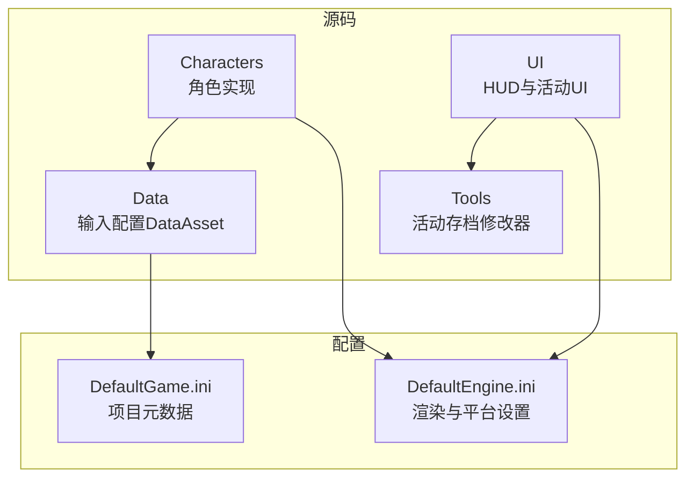
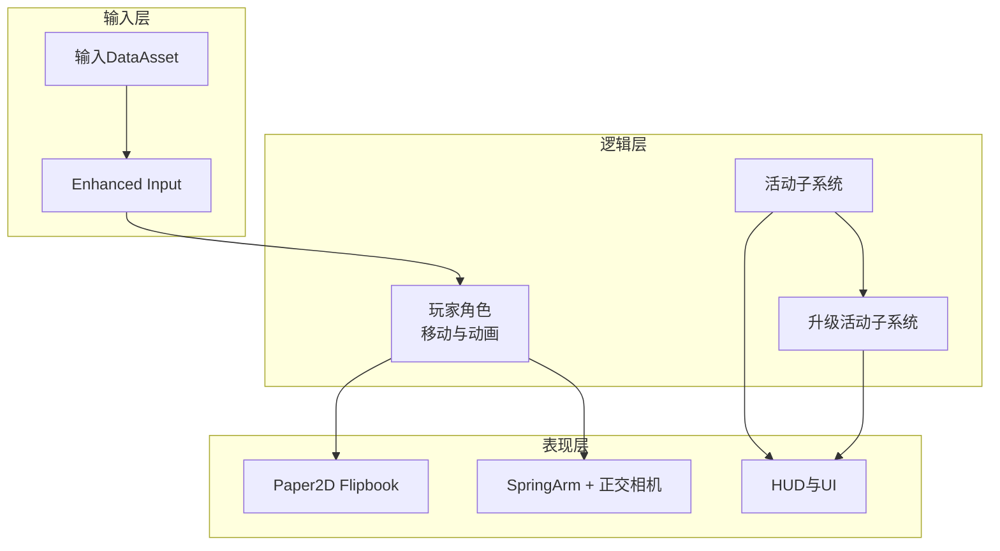
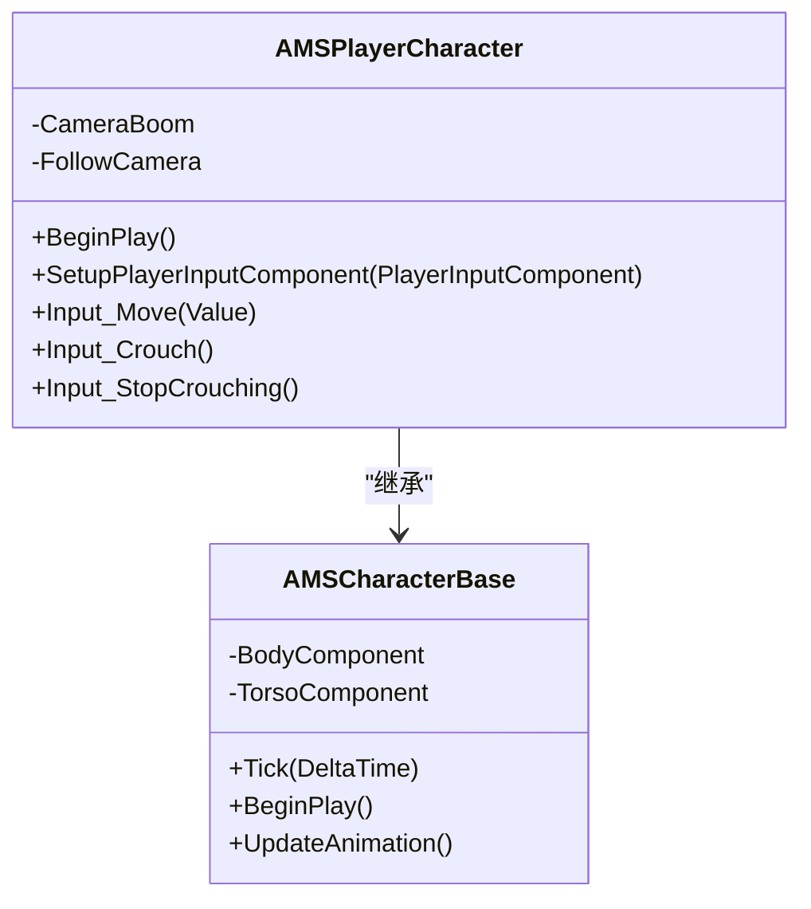
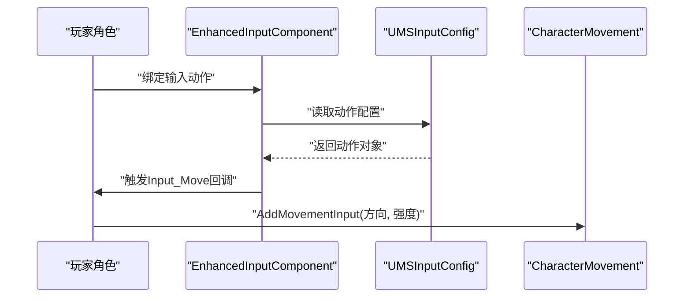
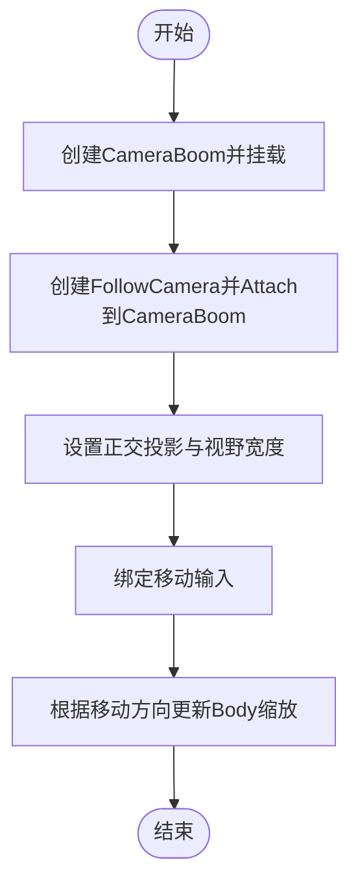
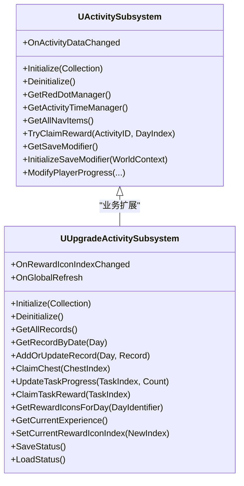
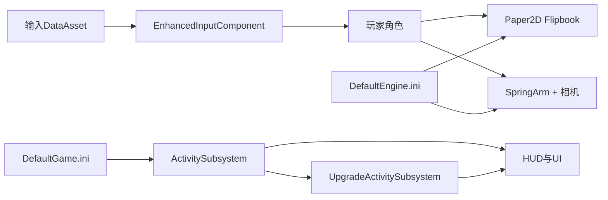

# 项目概述

<cite>
**本文引用的文件**
- [MetalSlug01.h](file://MetalSlug01/Source/MetalSlug01/MetalSlug01.h)
- [MetalSlug01GameModeBase.h](file://MetalSlug01/Source/MetalSlug01/MetalSlug01GameModeBase.h)
- [DefaultEngine.ini](file://MetalSlug01/Config/DefaultEngine.ini)
- [DefaultGame.ini](file://MetalSlug01/Config/DefaultGame.ini)
- [MSCharacterBase.cpp](file://MetalSlug01/Source/MetalSlug01/Private/Characters/MSCharacterBase.cpp)
- [MSPlayerCharacter.cpp](file://MetalSlug01/Source/MetalSlug01/Private/Characters/MSPlayerCharacter.cpp)
- [MSInputConfig.h](file://MetalSlug01/Source/MetalSlug01/Public/Data/MSInputConfig.h)
- [ActivitySubsystem.h](file://MetalSlug01/Source/MetalSlug01/Public/UI/Activity/Core/ActivitySubsystem.h)
- [UpgradeActivitySubsystem.h](file://MetalSlug01/Source/MetalSlug01/Public/UI/Activity/Core/UpgradeActivitySubsystem.h)
- [MyGameHUD.cpp](file://MetalSlug01/Source/MetalSlug01/Private/UI/MyGameHUD.cpp)
</cite>

## 目录
1. [简介](#简介)
2. [项目结构](#项目结构)
3. [核心组件](#核心组件)
4. [架构总览](#架构总览)
5. [详细组件分析](#详细组件分析)
6. [依赖关系分析](#依赖关系分析)
7. [性能考量](#性能考量)
8. [故障排查指南](#故障排查指南)
9. [结论](#结论)
10. [附录](#附录)

## 简介
本项目是一个基于 Unreal Engine 5.6 的 2D 平台动作游戏原型，采用 C++ 与 Blueprint 混合开发模式。项目围绕“MetalSlug”风格的横向卷轴射击玩法展开，强调角色控制的流畅性、2D 动画系统的易维护性以及 UI 活动系统的模块化扩展能力。

项目采用以下设计理念与技术选型：
- 使用 Paper2D Flipbook 动画系统承载角色与特效的 2D 帧动画，确保美术资源与播放控制解耦。
- 使用 SpringArm + 正交投影相机实现稳定的 2D 摄像机跟随，便于在横向卷轴场景中保持焦点。
- 输入系统采用 Enhanced Input 与 DataAsset 配置，支持策划在编辑器中快速调整键位，降低编译成本。
- UI 活动系统通过 Subsystems 模式实现业务逻辑与界面解耦，配合 DataAsset 与存档修改器，提升可测试性与可扩展性。

## 项目结构
项目采用按功能域分层的模块化组织方式：
- Source/MetalSlug01：核心源码
  - Characters：角色基类与玩家角色实现，负责 2D 动画与移动控制。
  - UI：HUD 与活动 UI 模块，包含导航、签到、升级奖励等页面。
  - Data：输入配置 DataAsset，统一管理输入动作。
  - Tools：活动存档修改器工具，支持运行时调试与数据注入。
- Config：引擎与项目配置，包含渲染、地图、输入等设置。

图表来源
- [DefaultEngine.ini](file://MetalSlug01/Config/DefaultEngine.ini#L1-L58)
- [DefaultGame.ini](file://MetalSlug01/Config/DefaultGame.ini#L1-L6)

章节来源
- [DefaultEngine.ini](file://MetalSlug01/Config/DefaultEngine.ini#L1-L58)
- [DefaultGame.ini](file://MetalSlug01/Config/DefaultGame.ini#L1-L6)

## 核心组件
- 游戏模式基类：提供游戏生命周期入口与默认行为占位。
- 角色基类与玩家角色：实现 2D 平台角色的移动、动画切换与输入绑定。
- 输入配置 DataAsset：集中管理输入动作，支持编辑器可视化配置。
- 活动子系统：以 Subsystem 形式封装活动业务逻辑，提供统一的数据访问与事件通知。
- HUD：负责主界面 Widget 的创建与展示。

章节来源
- [MetalSlug01GameModeBase.h](file://MetalSlug01/Source/MetalSlug01/MetalSlug01GameModeBase.h#L1-L17)
- [MSCharacterBase.cpp](file://MetalSlug01/Source/MetalSlug01/Private/Characters/MSCharacterBase.cpp#L1-L64)
- [MSPlayerCharacter.cpp](file://MetalSlug01/Source/MetalSlug01/Private/Characters/MSPlayerCharacter.cpp#L1-L62)
- [MSInputConfig.h](file://MetalSlug01/Source/MetalSlug01/Public/Data/MSInputConfig.h#L1-L29)
- [ActivitySubsystem.h](file://MetalSlug01/Source/MetalSlug01/Public/UI/Activity/Core/ActivitySubsystem.h#L1-L178)
- [UpgradeActivitySubsystem.h](file://MetalSlug01/Source/MetalSlug01/Public/UI/Activity/Core/UpgradeActivitySubsystem.h#L1-L476)
- [MyGameHUD.cpp](file://MetalSlug01/Source/MetalSlug01/Private/UI/MyGameHUD.cpp#L1-L19)

## 架构总览
项目采用“蓝图可视化 + C++ 逻辑”的混合架构：
- 角色与动画：C++ 实现 2D Flipbook 动画驱动与移动控制。
- 输入与交互：C++ 绑定 Enhanced Input，DataAsset 驱动键位配置。
- UI 与活动：蓝图负责界面布局与交互反馈；C++ Subsystems 负责业务逻辑与数据持久化。
- 摄像机：SpringArm + 正交投影，保证 2D 场景的稳定跟随。

图表来源
- [MSPlayerCharacter.cpp](file://MetalSlug01/Source/MetalSlug01/Private/Characters/MSPlayerCharacter.cpp#L1-L62)
- [MSInputConfig.h](file://MetalSlug01/Source/MetalSlug01/Public/Data/MSInputConfig.h#L1-L29)
- [MSCharacterBase.cpp](file://MetalSlug01/Source/MetalSlug01/Private/Characters/MSCharacterBase.cpp#L1-L64)
- [ActivitySubsystem.h](file://MetalSlug01/Source/MetalSlug01/Public/UI/Activity/Core/ActivitySubsystem.h#L1-L178)
- [UpgradeActivitySubsystem.h](file://MetalSlug01/Source/MetalSlug01/Public/UI/Activity/Core/UpgradeActivitySubsystem.h#L1-L476)
- [MyGameHUD.cpp](file://MetalSlug01/Source/MetalSlug01/Private/UI/MyGameHUD.cpp#L1-L19)

## 详细组件分析

### 角色与动画系统（Paper Flipbook）
- 组件挂载与层级：角色根节点下挂载身体与躯干 Flipbook 组件，实现多层动画叠加与局部控制。
- 物理约束：CharacterMovement 启用平面约束与蹲伏高度配置，保证 2D 平台移动的稳定性。
- 动画切换：根据速度、落地状态与蹲伏状态动态选择 Idle/Run/Jump/下蹲动画，首帧强制赋值避免黑屏。
- 输入联动：水平移动时根据方向翻转 BodyComponent 缩放，实现左右朝向一致性。

图表来源
- [MSCharacterBase.cpp](file://MetalSlug01/Source/MetalSlug01/Private/Characters/MSCharacterBase.cpp#L1-L64)
- [MSPlayerCharacter.cpp](file://MetalSlug01/Source/MetalSlug01/Private/Characters/MSPlayerCharacter.cpp#L1-L62)

章节来源
- [MSCharacterBase.cpp](file://MetalSlug01/Source/MetalSlug01/Private/Characters/MSCharacterBase.cpp#L1-L64)
- [MSPlayerCharacter.cpp](file://MetalSlug01/Source/MetalSlug01/Private/Characters/MSPlayerCharacter.cpp#L1-L62)

### 输入系统与 DataAsset 配置
- 输入配置：将 Move/Jump/Shoot/Crouch 等动作集中于 UMSInputConfig DataAsset，支持编辑器直接绑定。
- 输入绑定：在 SetupPlayerInputComponent 中将 DataAsset 中的动作绑定到对应函数，增强可配置性与可测试性。
- 键位可视化：策划可在编辑器中调整按键映射，无需改动 C++ 代码。

图表来源
- [MSPlayerCharacter.cpp](file://MetalSlug01/Source/MetalSlug01/Private/Characters/MSPlayerCharacter.cpp#L29-L43)
- [MSInputConfig.h](file://MetalSlug01/Source/MetalSlug01/Public/Data/MSInputConfig.h#L1-L29)

章节来源
- [MSPlayerCharacter.cpp](file://MetalSlug01/Source/MetalSlug01/Private/Characters/MSPlayerCharacter.cpp#L29-L43)
- [MSInputConfig.h](file://MetalSlug01/Source/MetalSlug01/Public/Data/MSInputConfig.h#L1-L29)

### 摄像机系统（SpringArm + 正交投影）
- 相机挂载：CameraBoom 作为弹簧臂，FollowCamera 作为跟随相机，设置目标臂长与旋转。
- 投影模式：正交投影适配 2D 平台场景，OrthoWidth 控制视野宽度。
- 方向控制：依据角色移动方向调整 BodyComponent 缩放，保持画面朝向一致。

图表来源
- [MSPlayerCharacter.cpp](file://MetalSlug01/Source/MetalSlug01/Private/Characters/MSPlayerCharacter.cpp#L10-L25)

章节来源
- [MSPlayerCharacter.cpp](file://MetalSlug01/Source/MetalSlug01/Private/Characters/MSPlayerCharacter.cpp#L10-L25)

### 活动子系统（ActivitySubsystem 与 UpgradeActivitySubsystem）
- ActivitySubsystem：作为 GameInstance 子系统，统一管理活动 Track、红点、时间管理与存档缓存，提供导航、签到、奖励查询等接口，并暴露蓝图可调用的存档修改器接口。
- UpgradeActivitySubsystem：专注于升级奖励活动的业务逻辑，包括记录加载/保存、任务进度、宝箱领取、奖励图标索引管理、固定奖励进度计算等，提供丰富的蓝图可用接口与事件委托。

图表来源
- [ActivitySubsystem.h](file://MetalSlug01/Source/MetalSlug01/Public/UI/Activity/Core/ActivitySubsystem.h#L1-L178)
- [UpgradeActivitySubsystem.h](file://MetalSlug01/Source/MetalSlug01/Public/UI/Activity/Core/UpgradeActivitySubsystem.h#L1-L476)

章节来源
- [ActivitySubsystem.h](file://MetalSlug01/Source/MetalSlug01/Public/UI/Activity/Core/ActivitySubsystem.h#L1-L178)
- [UpgradeActivitySubsystem.h](file://MetalSlug01/Source/MetalSlug01/Public/UI/Activity/Core/UpgradeActivitySubsystem.h#L1-L476)

### HUD 与 UI 加载
- HUD 在 BeginPlay 中根据配置类创建主 Widget 并添加到视口，实现 UI 的统一入口与生命周期管理。

章节来源
- [MyGameHUD.cpp](file://MetalSlug01/Source/MetalSlug01/Private/UI/MyGameHUD.cpp#L1-L19)

## 依赖关系分析
- 角色与输入：玩家角色依赖 Enhanced Input 与输入 DataAsset；Flipbook 动画依赖 CharacterMovement 的速度与状态。
- 活动系统：Activity 与 Upgrade 子系统均依赖 GameInstance 生命周期，向上提供 UI 访问接口与事件。
- 配置与渲染：DefaultEngine.ini 控制渲染与平台设置，影响相机与 UI 的表现；DefaultGame.ini 提供项目元数据。

图表来源
- [MSPlayerCharacter.cpp](file://MetalSlug01/Source/MetalSlug01/Private/Characters/MSPlayerCharacter.cpp#L29-L43)
- [MSCharacterBase.cpp](file://MetalSlug01/Source/MetalSlug01/Private/Characters/MSCharacterBase.cpp#L47-L64)
- [ActivitySubsystem.h](file://MetalSlug01/Source/MetalSlug01/Public/UI/Activity/Core/ActivitySubsystem.h#L1-L178)
- [UpgradeActivitySubsystem.h](file://MetalSlug01/Source/MetalSlug01/Public/UI/Activity/Core/UpgradeActivitySubsystem.h#L1-L476)
- [DefaultEngine.ini](file://MetalSlug01/Config/DefaultEngine.ini#L1-L58)
- [DefaultGame.ini](file://MetalSlug01/Config/DefaultGame.ini#L1-L6)

章节来源
- [DefaultEngine.ini](file://MetalSlug01/Config/DefaultEngine.ini#L1-L58)
- [DefaultGame.ini](file://MetalSlug01/Config/DefaultGame.ini#L1-L6)

## 性能考量
- 动画切换：在 Tick 中根据速度与状态切换 Flipbook，建议在动画切换处增加幂等判断，避免频繁 SetFlipbook 导致的开销。
- 相机跟随：SpringArm 的 ArmLength 与旋转设置需结合关卡尺寸，避免过大导致的裁剪与渲染压力。
- 输入绑定：将输入动作集中在 DataAsset 中，减少运行时反射查找，提高响应效率。
- UI 加载：HUD 在 BeginPlay 创建 Widget，建议在 GameInstance 或 WorldSubsystem 中统一管理，避免重复创建。

## 故障排查指南
- 按键无响应：确认 EnhancedInputComponent 已正确绑定输入动作，且 InputConfig 已在 SetupPlayerInputComponent 中使用。
- 动画不显示：检查 BeginPlay 中是否已设置首帧 Flipbook，确保 BodyComponent 与 BodyIdle 配置正确。
- 相机视角异常：检查 CameraBoom 的 TargetArmLength、相对旋转与继承属性，确保 FollowCamera 投影为正交。
- UI 未显示：确认 HUD 的 MainWidgetClass 已在关卡中设置，BeginPlay 中的创建与 AddToViewport 流程正常执行。

章节来源
- [MSPlayerCharacter.cpp](file://MetalSlug01/Source/MetalSlug01/Private/Characters/MSPlayerCharacter.cpp#L29-L43)
- [MSCharacterBase.cpp](file://MetalSlug01/Source/MetalSlug01/Private/Characters/MSCharacterBase.cpp#L31-L39)
- [MyGameHUD.cpp](file://MetalSlug01/Source/MetalSlug01/Private/UI/MyGameHUD.cpp#L4-L18)

## 结论
本项目以“蓝图可视化 + C++ 逻辑”为核心，构建了面向 2D 平台动作游戏的可扩展架构。通过 Paper Flipbook 动画系统与 SpringArm 相机组合，实现了稳定的 2D 表现层；通过 Enhanced Input 与 DataAsset，提升了输入配置的灵活性；通过 Subsystems 模式与存档修改器，使活动系统具备良好的可测试性与可扩展性。对于初学者，蓝图与 DataAsset 的组合降低了上手门槛；对于有经验的开发者，C++ 的模块化设计与清晰的职责划分提供了深入定制的空间。

## 附录
- 引擎版本：Unreal Engine 5.6
- 渲染系统：DX12，启用多项现代渲染特性（阴影、光照、运动模糊关闭等）
- 输入系统：Enhanced Input + DataAsset
- UI 系统：蓝图 Widget + C++ Subsystems
- 地图设置：编辑器启动地图与默认关卡指向 Test01

章节来源
- [DefaultEngine.ini](file://MetalSlug01/Config/DefaultEngine.ini#L1-L58)
- [DefaultGame.ini](file://MetalSlug01/Config/DefaultGame.ini#L1-L6)